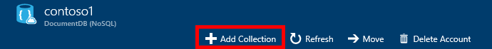

<properties 
    pageTitle="建立 DocumentDB 資料庫並集合 |Microsoft Azure" 
    description="瞭解如何建立 NoSQL 資料庫，和 JSON 文件集合 Azure DocumentDB 使用線上服務入口網站，雲端為基礎的文件資料庫。 取得免費的試用版今天。" 
    services="documentdb" 
    authors="mimig1" 
    manager="jhubbard" 
    editor="monicar" 
    documentationCenter=""/>

<tags 
    ms.service="documentdb" 
    ms.workload="data-services" 
    ms.tgt_pltfrm="na" 
    ms.devlang="na" 
    ms.topic="article" 
    ms.date="10/17/2016" 
    ms.author="mimig"/>

# 如何建立 DocumentDB 收集與使用 Azure 入口網站的資料庫

若要使用 Microsoft Azure DocumentDB，您必須以[DocumentDB 帳戶](documentdb-create-account.md)、 資料庫、 集合，與文件。 本主題說明如何建立 DocumentDB 集合 Azure 入口網站中。 

不確定檔案是什麼集合？ 請參閱[何謂 DocumentDB 集合？](#what-is-a-documentdb-collection)

1.  在[Azure 入口網站](https://portal.azure.com/)，在 Jumpbar，按一下**DocumentDB (NoSQL)**，，然後在**DocumentDB (NoSQL)**刀中，選取要新增集合中的帳戶。 如果您沒有列出任何帳戶，必須[建立 DocumentDB 帳戶](documentdb-create-account.md)。

    
    
    如果 Jumpbar 中看不到 [ **DocumentDB (NoSQL)** ，請按一下 [**更多服務**]，然後按一下 [ **DocumentDB (NoSQL)**。 如果您沒有列出任何帳戶，必須[建立 DocumentDB 帳戶](documentdb-create-account.md)。

2. 在 [選取帳戶**DocumentDB 帳戶**刀，按一下 [**新增集合**]。

    

3. **新增集合**刀，在 [**識別碼**] 方塊中輸入新的識別碼。 集合名稱必須介於 1 到 255 個字元，而且不能包含`/ \ # ?`或結尾空格。 當驗證名稱時，綠色的核取記號會出現在 [識別碼] 方塊中。

    ![螢幕擷取畫面醒目提示資料庫刀上的 [新增集合] 按鈕，新增集合刀，以及 [確定] 按鈕-Azure 入口網站的 DocumentDB-雲端資料庫建立者 NoSQL JSON 資料庫的設定](./media/documentdb-create-collection/docdb-collection-creation-5-8.png)

4. 根據預設，**價格層**已設為**標準**，以便您可以自訂處理量，儲存空間，您的集合。 如需有關價格層的詳細資訊，請參閱[在 DocumentDB 效能層級](documentdb-performance-levels.md)。  

5. 選取**單一磁碟分割**或**分割**的集合**Partitioning 模式**。 

    **單一資料分割**的 10 GB，保留的儲存容量，而且可以有處理量等級從 400 10000 要求單位/第二個 (RU/s)。 一個 RU 會對應到的 1 的知識庫文件的讀取。 如需要求單位的詳細資訊，請參閱[要求單位](documentdb-request-units.md)。 

    **分割的集合**可以調整，以在多個資料分割，處理量不受限制的儲存空間，並且可以有 10,100 RU/s，開始處理量層級。 在入口網站中最大的儲存空間，您可以保留 250 GB，而您可以保留大部分處理量會 250000 RU/s。 若要增加任一配額，檔案的邀請，[邀請增加 DocumentDB 帳戶配額](documentdb-increase-limits.md)所述。 更多資料分割集合的詳細資料，請參閱[單一磁碟分割和分割的集合](documentdb-partition-data.md#single-partition-and-partitioned-collections)。

    根據預設，新的單一資料分割集合處理量會設定為 1000 RU/s 10 GB 的儲存空間容量。 分割的集合，集合處理量會設定為 10100 RU/s 250 GB 的儲存空間容量。 集合建立之後，您可以變更的處理量及集合的儲存空間。 

6. 如果您正在建立分割的集合，請選取 [**分割索引鍵**的集合。 選取正確的磁碟分割索引鍵是很重要的建立效能集合。 如需有關選取資料分割索引鍵的詳細資訊，請參閱[分割的設計](documentdb-partition-data.md#designing-for-partitioning)。

7. 在**資料庫**防禦，以建立新資料庫或使用現有。 資料庫名稱必須介於 1 到 255 個字元，而且不能包含`/ \ # ?`或結尾空格。 若要驗證的名稱，按一下 [文字方塊外]。 當驗證名稱時，綠色的核取記號會出現在] 方塊中。

8. 按一下**[確定]**畫面的底部若要建立新集合]。 

9. 新集合現在會出現在**概觀**刀上的 [**集合**透鏡。
 
    

10. **可省略︰**若要修改的入口網站中的集合，按一下 [資源] 功能表**小數位數**。 

    ![螢幕擷取畫面的 [資源] 功能表中，選取 [縮放比例](./media/documentdb-create-collection/docdb-collection-creation-scale.png)

## 什麼是 DocumentDB 集合？ 

集合是 JSON 文件和相關聯的 JavaScript 應用程式邏輯的容器。 集合是集合的計費的實體[成本](documentdb-performance-levels.md)由能夠處理量的位置。 集合可以延伸一或多個磁碟分割區/伺服器，且可以調整，以處理幾乎沒有限制的區的儲存空間或處理量。

將一或多個實體伺服器 DocumentDB 來自動分割集合。 當您建立的集合時，您可以指定要求單位的磁碟分割屬性及每能夠處理量。 DocumentDB 將用於此屬性的值，發佈磁碟分割區與傳送邀請，例如查詢之間的文件。 分割索引鍵值也做為交易的預存程序及界限引動程序。 每個集合有特定的集合，未共用的同一個帳戶中的其他集合處理量保留的量。 因此，您可以調整查看您的應用程式從儲存及處理量。 

集合的並不一樣關聯式資料庫中的資料表。 集合不會強制執行結構描述、 事實上 DocumentDB 不會執行任何結構描述，無結構描述的資料庫。 因此，您可以在相同的集合儲存不同類型的文件使用不同的結構描述。 您可以選擇使用集合儲存單一類型，如同使用表格的物件。 最佳模型取決於只的資料顯示在一起的查詢和交易中。

## 若要建立 DocumentDB 集合的其他方法

不需要建立使用入口網站集合，您也可以建立使用[DocumentDB Sdk](documentdb-sdk-dotnet.md)和 REST API 它們。 

- C# 程式碼範例，請參閱[C# 集合範例](documentdb-dotnet-samples.md#collection-examples)。 
- Node.js 程式碼範例，請參閱[Node.js 集合範例](documentdb-nodejs-samples.md#collection-examples)。
- Python 程式碼範例，請參閱[Python 集合範例](documentdb-python-samples.md#collection-examples)。
- 如 REST API 範例，請參閱[建立集合](https://msdn.microsoft.com/library/azure/mt489078.aspx)。

## 疑難排解

如果**新增集合**已停用 Azure 入口網站中，就表示您的帳戶目前已停用，這通常會發生的月份的所有優點信用額度都使用時。   

## 後續步驟

現在您擁有的集合下, 一步是新增文件或匯入到集合的文件。 若要將文件新增至集合時，您會有幾個選擇︰

- 您可以[新增文件](documentdb-view-json-document-explorer.md)使用入口網站中的 [文件檔案總管]。
- 您可以[匯入文件和資料](documentdb-import-data.md)使用 DocumentDB 資料移轉工具，可讓您匯入 JSON 和 CSV 檔案，以及 SQL Server、 MongoDB、 Azure 資料表儲存體和其他 DocumentDB 集合中的資料。 
- 或者，您可以使用其中一個[DocumentDB Sdk](documentdb-sdk-dotnet.md)新增文件。 DocumentDB 有.NET、 Java、 Python、 Node.js 和 JavaScript API Sdk。 C# 程式碼範例顯示如何使用 DocumentDB.NET SDK 來處理文件，請參閱[C# 文件範例](documentdb-dotnet-samples.md#document-examples)。 顯示如何使用文件使用 DocumentDB Node.js SDK Node.js 程式碼範例，請參閱[Node.js 文件的範例](documentdb-nodejs-samples.md#document-examples)。

有集合中的文件之後，您可以使用[DocumentDB SQL](documentdb-sql-query.md)執行[查詢](documentdb-sql-query.md#executing-queries)針對您的文件使用中的入口網站、 [REST API](https://msdn.microsoft.com/library/azure/dn781481.aspx)，或其中一個[Sdk](documentdb-sdk-dotnet.md)的[查詢檔案總管](documentdb-query-collections-query-explorer.md)。 
