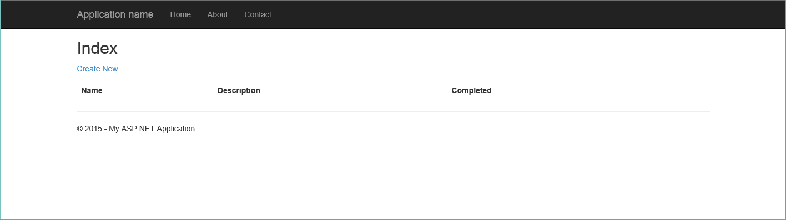

<properties 
    pageTitle="部署 DocumentDB 和 Azure 應用程式服務 Web 應用程式使用 Azure 資源管理員範本 |Microsoft Azure" 
    description="瞭解如何部署 DocumentDB 帳戶、 Azure 應用程式服務 Web 應用程式，並使用 Azure 資源管理員範本的範例 web 應用程式。" 
    services="documentdb, app-service\web" 
    authors="h0n" 
    manager="jhubbard" 
    editor="monicar" 
    documentationCenter=""/>

<tags 
    ms.service="documentdb" 
    ms.workload="data-services" 
    ms.tgt_pltfrm="na" 
    ms.devlang="na" 
    ms.topic="article" 
    ms.date="08/02/2016" 
    ms.author="hawong"/>

# 部署 DocumentDB 和 Azure 應用程式服務 Web 應用程式使用 Azure 資源管理員範本

本教學課程教您如何使用 Azure 資源管理員範本部署，以及整合[Microsoft Azure DocumentDB](https://azure.microsoft.com/services/documentdb/) [Azure 應用程式服務](http://go.microsoft.com/fwlink/?LinkId=529714)web 應用程式]，與範例 web 應用程式。

使用 Azure 資源管理員範本，您可以輕鬆地自動化的部署和 Azure 資源的設定。  本教學課程介紹如何部署 web 應用程式，並自動設定 DocumentDB 帳戶連線資訊。

完成後本教學課程中，您可以回答下列問題︰  

-   如何使用 Azure 資源管理員範本部署和整合 DocumentDB 帳戶和 Azure 應用程式服務中的 web 應用程式？
-   如何使用 Azure 資源管理員範本部署和整合 DocumentDB 帳戶、 應用程式服務 Web 應用程式中的 web 應用程式和 Webdeploy 應用程式？

## 必要條件
> [AZURE.TIP] 本教學課程也不會採用 Azure 資源管理員範本或 JSON 先前曾，如果您想要修改的參照的範本或部署選項]，然後每一個領域的知識將會需要。

之前的指示執行本教學課程中，請確定您有下列動作︰

- Azure 的訂閱。 Azure 是訂閱為基礎的平台。  如需有關如何取得訂閱的詳細資訊，請參閱[購買選項](https://azure.microsoft.com/pricing/purchase-options/)]、 [[成員提供](https://azure.microsoft.com/pricing/member-offers/)，或 [[免費試用版](https://azure.microsoft.com/pricing/free-trial/)。

##步驟 1︰ 下載的範本檔案 ##
現在就讓我們開始下載本教學課程中，我們將使用的範本檔案。

1. [建立 DocumentDB 帳戶，Web 應用程式，並部署示範應用程式範例](https://portalcontent.blob.core.windows.net/samples/DocDBWebsiteTodo.json)範本下載至本機資料夾 (例如 C:\DocumentDBTemplates)。 此範本會部署 DocumentDB 帳戶與應用程式服務 web 應用程式]，web 應用程式。  它會也會自動設定 web 應用程式連線至 DocumentDB 帳戶。

2. [建立 DocumentDB 帳戶和 Web 應用程式範例](https://portalcontent.blob.core.windows.net/samples/DocDBWebSite.json)範本下載至本機資料夾 (例如 C:\DocumentDBTemplates)。 此範本部署 DocumentDB 帳戶，應用程式服務 web 應用程式]，並將修改網站的應用程式設定，輕鬆地呈現 DocumentDB 連線資訊，但不是包括 web 應用程式。  

##步驟 2︰ 部署 DocumentDB 帳戶、 應用程式服務 web 應用程式和示範應用程式範例

現在讓我們來部署我們的第一個範本。

> [AZURE.TIP] 範本不會驗證的 web 應用程式的名稱及 DocumentDB 帳戶名稱下方輸入有 a） 有效且 b） 可用。  強烈建議您確認是否可使用您提供之前送出部署計劃的名稱。

1. 登入[Azure 入口網站](https://portal.azure.com)，按一下 [新增] 和搜尋 」 範本部署]。
    

2. 選取範本部署項目，然後按一下 [**建立**
    

3.  按一下 [**編輯範本**、 貼上 DocDBWebsiteTodo.json 範本檔案的內容，按一下 [**儲存**]。
    

4. 按一下 [**編輯參數**，為每個必要的參數，提供的值，按一下**[確定]**。  參數如下所示︰

    1. 站台名稱︰ 指定應用程式服務 web 應用程式的名稱，而用來建構您將會用來存取 web 應用程式的 URL (例如︰ 如果您指定 「 mydemodocdbwebapp 」，然後將存取 web 應用程式的 URL 會 mydemodocdbwebapp.azurewebsites.net)。

    2. HOSTINGPLANNAME︰ 指定服務應用程式建立的主機服務方案的名稱。

    3. 位置︰ 指定要在其中建立 DocumentDB 和 web 應用程式資源 Azure 位置。

    4. DATABASEACCOUNTNAME︰ 指定要建立的 DocumentDB 帳戶的名稱。   

    

5. 選擇現有的資源群組或提供的名稱來進行新的 [資源] 群組中，然後選擇 [資源] 群組的位置。
    
  
6.  按一下 [**校閱法律條款**，**購買**，，然後按一下 [**建立**]，開始部署。  產生部署為一目了然 Azure 入口網站首頁，請選取 [**固定至儀表板**]。
    

7.  部署完成時，隨即會開啟 [資源群組刀。
      

8.  若要使用的應用程式，只要瀏覽至 web 應用程式 URL （上述範例中的 URL 是 http://mydemodocdbwebapp.azurewebsites.net）。  您會看到下列 web 應用程式︰

    

9. 請繼續進行和 web 應用程式中建立幾個工作，然後返回 [資源群組刀 Azure 入口網站中。 按一下 [資源] 清單中的 DocumentDB 帳戶資源，然後按一下 [**查詢檔案總管**。
      

10. 執行預設查詢，「 選取*從 c 」，並檢查結果。 請注意具有擷取 todo 項目，您在上述步驟 7 中建立的 JSON 表示該查詢。 可嘗試使用查詢。例如，請嘗試執行選取*從 c 位置 c.isComplete = true，則傳回所有已標示為完成的 todo 項目。

    ![顯示查詢結果的查詢檔案總管] 及 [結果刀的螢幕擷取畫面](./media/documentdb-create-documentdb-website/image5.png)

11. 請隨意探索 DocumentDB 入口網站體驗或修改範例 Todo 應用程式。  當您準備好時，請讓我們來部署另一個範本。
    
 
## 步驟 3︰ 將文件的帳戶和 web 應用程式範例部署

現在讓我們來部署我們第二個範本。  此範本是很有用顯示如何您可以插入 DocumentDB 連線資訊，例如帳戶端點和主索引鍵的 web 應用程式為應用程式設定或自訂的連線字串。 例如，也許您有自己的 web 應用程式您想要部署 DocumentDB 帳戶，而且會自動填入部署期間的連線資訊。

> [AZURE.TIP] 範本不會驗證的 web 應用程式的名稱及 DocumentDB 帳戶名稱下方輸入有 a） 有效且 b） 可用。  強烈建議您確認是否可使用您提供之前送出部署計劃的名稱。

1. 在[Azure 入口網站](https://portal.azure.com)中，按一下 [新增] 和 [搜尋 」 範本部署]。
    

2. 選取範本部署項目，然後按一下 [**建立**
    

3.  按一下 [**編輯範本**、 貼上 DocDBWebSite.json 範本檔案的內容，按一下 [**儲存**]。
    

4. 按一下 [**編輯參數**，為每個必要的參數，提供的值，按一下**[確定]**。  參數如下所示︰

    1. 站台名稱︰ 指定應用程式服務 web 應用程式的名稱，而用來建構您將會用來存取 web 應用程式的 URL (例如︰ 如果您指定 「 mydemodocdbwebapp 」，然後將存取 web 應用程式的 URL 會 mydemodocdbwebapp.azurewebsites.net)。

    2. HOSTINGPLANNAME︰ 指定服務應用程式建立的主機服務方案的名稱。

    3. 位置︰ 指定要在其中建立 DocumentDB 和 web 應用程式資源 Azure 位置。

    4. DATABASEACCOUNTNAME︰ 指定要建立 DocumentDB 帳戶的名稱。   

    

5. 選擇現有的資源群組或提供的名稱來進行新的 [資源] 群組中，然後選擇 [資源] 群組的位置。
    
  
6.  按一下 [**校閱法律條款**，**購買**，，然後按一下 [**建立**]，開始部署。  產生部署為一目了然 Azure 入口網站首頁，請選取 [**固定至儀表板**]。
    

7.  部署完成時，隨即會開啟 [資源群組刀。
      

8. 按一下 [資源] 清單中的 Web 應用程式資源，然後按一下 [**應用程式設定**
      

9. 請注意如何有應用程式設定簡報 DocumentDB 端點和每個 DocumentDB 主索引鍵。
      

10. 請依需要繼續探索 Azure 入口網站中，或執行下列其中一個我們 DocumentDB[範例](http://go.microsoft.com/fwlink/?LinkID=402386)] 來建立您自己的 DocumentDB 應用程式。

    
    

## 後續步驟

恭喜您 ！ 您已部署 DocumentDB 應用程式服務 web 應用程式和使用 Azure 資源管理員範本的範例 web 應用程式。

- 若要進一步瞭解 DocumentDB，請按一下[這裡](http://azure.com/docdb)。
- 若要進一步瞭解 Azure 應用程式服務 Web 應用程式，請按一下[這裡](http://go.microsoft.com/fwlink/?LinkId=325362)。
- 若要進一步瞭解 Azure 資源管理員範本，請按一下[這裡](https://msdn.microsoft.com/library/azure/dn790549.aspx)。

## 變更的項目
* 若要變更的指南，從網站應用程式服務請參閱︰ [Azure 應用程式服務與程式影響現有 Azure 服務](http://go.microsoft.com/fwlink/?LinkId=529714)
* 舊的入口網站，以新的入口網站的變更引導請參閱︰[參考瀏覽 Azure 傳統入口網站](http://go.microsoft.com/fwlink/?LinkId=529715)

>[AZURE.NOTE] 如果您想要開始使用 Azure 應用程式服務註冊 Azure 帳戶之前，請移至[嘗試應用程式服務](http://go.microsoft.com/fwlink/?LinkId=523751)，可以讓您立即建立短暫入門 web 應用程式在應用程式服務。 必要; 沒有信用卡沒有承諾。
 
