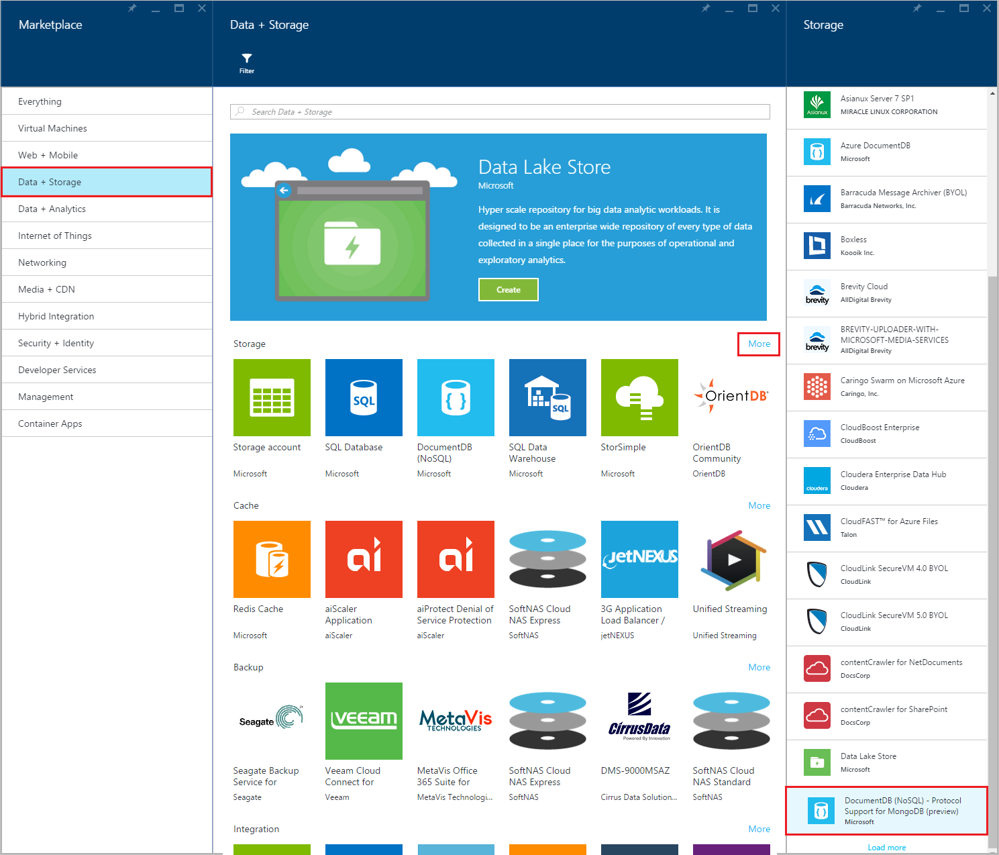

<properties 
    pageTitle="建立 DocumentDB 帳戶的 MongoDB 的通訊協定支援 |Microsoft Azure" 
    description="瞭解如何建立 DocumentDB 帳戶與通訊協定支援 MongoDB，現在可預覽。" 
    services="documentdb" 
    authors="AndrewHoh" 
    manager="jhubbard" 
    editor="" 
    documentationCenter=""/>

<tags 
    ms.service="documentdb" 
    ms.workload="data-services" 
    ms.tgt_pltfrm="na" 
    ms.devlang="na" 
    ms.topic="article" 
    ms.date="10/20/2016" 
    ms.author="anhoh"/>

# 如何建立 DocumentDB 帳戶的 MongoDB 使用 Azure 入口網站的通訊協定支援

若要建立 Azure DocumentDB 帳戶的 MongoDB 的通訊協定支援，您必須︰

- 有 Azure 帳戶。 如果您沒有，您可以取得[免費的 Azure 帳戶](https://azure.microsoft.com/free/)。

## 建立帳戶  

若要建立 DocumentDB 帳戶的 MongoDB 的通訊協定支援，執行下列步驟。

1. 在新視窗中，登入[Azure 入口網站](https://portal.azure.com)。
2. 按一下 [**新增**]、 按一下**資料 + 的儲存空間**，按一下 [**查看所有**，，然後搜尋 「 DocumentDB 通訊協定] 的 [**資料 + 的儲存空間**] 類別。 按一下 [ **DocumentDB-MongoDB 通訊協定支援**]。

    

3. 或者，在 [**資料 + 的儲存空間**] 類別，在 [**儲存**] 底下，按一下 [**更多**]，然後按一下**載入更多**一或多個時間顯示**DocumentDB-MongoDB 通訊協定支援**。 按一下 [ **DocumentDB-MongoDB 通訊協定支援**]。

    

4. 在**DocumentDB-MongoDB （預覽版本） 的通訊協定支援**刀中，按一下 [**建立**啟動預覽註冊程序。

    

5. 在 [ **DocumentDB 帳戶**刀中，按一下 [**登入，若要預覽**]。 讀取的資訊，然後按一下**[確定]**。

    

6.  接受預覽字詞之後, 會回到您建立刀。  在**DocumentDB 帳戶**防禦，以指定的帳戶所需的設定。

    

    - 在 [**識別碼**] 方塊中，輸入要識別該帳戶的名稱。  當**ID**驗證時，綠色的核取記號會出現在 [**識別碼**] 方塊中。 [**識別碼**] 的值會變成 URI 內，主機名稱。 **識別碼**可能包含只大小寫字母、 數字，以及 '-' 字元，而且必須是介於 3 至 50 個字元。 附註的*documents.azure.com*會附加您選擇，結果會變成您的帳戶端點結束點名稱。

    - 如需**訂閱**，選取 [Azure 訂閱您想要使用的帳戶]。 如果您的帳戶有只有一個訂閱，預設會選取該帳戶。

    - 在 [**資源] 群組**中，選取或建立帳戶的資源群組。  根據預設，會選取現有的資源群組底下 Azure 訂閱。  不過，您可能會選擇選取 [建立新的資源群組至您想要新增的帳戶。 如需詳細資訊，請參閱[使用 Azure 入口網站管理 Azure 資源](resource-group-portal.md)。

    - 若要指定要主控帳戶的地理位置的使用**位置**。
    
    - 可省略︰ 核取**釘選至儀表板**。 如果釘選到儀表板，請依照下列**步驟 8**下方以檢視您的新帳戶左側的導覽。

7.  一旦設定新的帳號選項，請按一下 [**建立**]。  它可能需要幾分鐘，才能建立帳戶。  如果已釘選至儀表板，您可以監視 Startboard 佈建進度。  
    ![Startboard-線上資料庫建立者的 [建立] 磚的螢幕擷取畫面](./media/documentdb-create-mongodb-account/create-nosql-db-databases-json-tutorial-3.png)  

    如果不釘選至儀表板，您可以監視您從 [通知] 中心的進度。  

      

    ![[通知] 中心內，顯示 DocumentDB 帳戶已成功建立及部署到資源群組-線上資料庫建立者通知的螢幕擷取畫面](./media/documentdb-create-mongodb-account/create-nosql-db-databases-json-tutorial-5.png)

8.  若要存取您的新帳戶，請在左功能表上按一下**DocumentDB (NoSQL)** 。 在清單中的一般 DocumentDB 和 DocumentDB Mongo 通訊協定支援帳戶，按一下您的新帳戶名稱。

9.  您現在可供使用的預設設定。 

    
    

## 後續步驟

- 瞭解如何[連線](documentdb-connect-mongodb-account.md)到 DocumentDB 帳戶與通訊協定支援 MongoDB。

 
