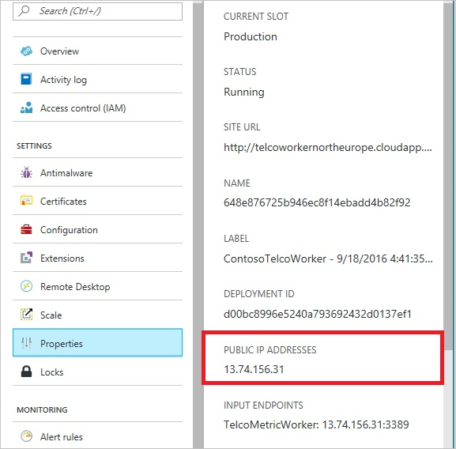

<properties
    pageTitle="DocumentDB 防火牆支援 |Microsoft Azure"
    description="瞭解如何使用 Azure DocumentDB 資料庫帳戶的防火牆支援的 IP 存取控制 」 原則。"
    keywords="IP 存取控制、 防火牆支援"
    services="documentdb"
    authors="shahankur11"
    manager="jhubbard"
    editor=""
    tags="azure-resource-manager"
    documentationCenter=""/>

<tags 
    ms.service="documentdb" 
    ms.workload="data-services" 
    ms.tgt_pltfrm="na" 
    ms.devlang="na" 
    ms.topic="article" 
    ms.date="10/17/2016" 
    ms.author="ankshah; kraman"/>

# DocumentDB 防火牆支援

若要保護 Azure DocumentDB 資料庫帳戶中儲存的資料，DocumentDB 提供支援的私人根據[授權模型](https://msdn.microsoft.com/library/azure/dn783368.aspx)，利用強式雜湊訊息驗證碼 (HMAC)。 現在，除了秘密根據的授權模型 DocumentDB 支援原則導向輸入的防火牆支援的 IP 型存取控制。 此模型非常類似傳統資料庫系統的防火牆規則，並提供其他 DocumentDB 資料庫帳戶的安全性層級。 使用這個模型，您現在可以設定 DocumentDB 資料庫帳戶只能從已核准的電腦存取及/或雲端服務。 從這些已核准的集合，機器和服務存取 DocumentDB 資源仍需要呈現的有效的授權權杖來電者。

## IP 存取控制概觀

根據預設，只要要求伴隨的有效的授權權杖，就可以從公用網際網路存取 DocumentDB 資料庫帳戶。 若要設定 IP 原則型存取控制，使用者必須提供 IP 位址或 CIDR 包含指定的資料庫帳戶的用戶端 Ip 允許清單的表單中的 IP 位址範圍。 後套用此設定時，伺服器會封鎖來自機器此清單以外的所有要求。  下圖說明處理 IP 型存取控制流程的連線。

## 來自雲端服務的連線

Azure 在雲端服務會是常見的主機服務使用 DocumentDB 中間層服務邏輯方式。 若要啟用存取 DocumentDB 資料庫帳戶，來自雲端服務，必須允許的連絡[Azure 支援](#configure-ip-policy)與 DocumentDB 資料庫帳戶相關聯的 IP 位址清單新增雲端服務的公用 IP 位址。  如此一來，可確保所有的角色執行個體的雲端服務，可以存取您 DocumentDB 資料庫的帳戶。 下圖所示，您可以雲端服務中 Azure 入口網站中，擷取 IP 位址。 

當您藉由新增額外的角色執行個體擴展您的雲端服務時，這些新的執行個體會自動提供存取 DocumentDB 資料庫帳戶因為它們都相同的雲端服務的一部分。

## 虛擬機器中的連線

[虛擬機器](https://azure.microsoft.com/services/virtual-machines/)或[虛擬機器縮放比例設定](../virtual-machine-scale-sets/virtual-machine-scale-sets-overview.md)也可以裝載使用 DocumentDB 的中間層服務使用。  若要設定 DocumentDB 允許寄件者的虛擬機器、 的虛擬機器及/或虛擬機器縮放比例設定的公用 IP 位址的 access 資料庫帳戶必須設定為允許的 IP 位址 DocumentDB 資料庫帳戶的其中一個連絡[Azure 支援](#configure-ip-policy)。 下圖所示，您就可以擷取虛擬機器中 Azure] 入口網站的 IP 位址。

當您新增至群組的其他虛擬機器執行個體時，他們會自動提供存取 DocumentDB 資料庫帳戶。

## 從網際網路連線

當您在網際網路上的電腦存取 DocumentDB 資料庫帳戶時，用戶端 IP 位址或電腦的 IP 位址範圍必須新增至允許的 IP 位址 DocumentDB 資料庫帳戶清單。 

## 設定 IP 存取控制原則

若要啟用您的資料庫帳戶 IP 存取控制原則[Azure](https://portal.azure.com/?#blade/Microsoft_Azure_Support/HelpAndSupportBlade)支援要求使用 Azure 入口網站。

1. 在[說明 + 支援](https://portal.azure.com/?#blade/Microsoft_Azure_Support/HelpAndSupportBlade)刀中，選取 [**新增支援要求**。
2. 在 [**新增支援要求**刀，選取 [**基本功能**]。
3. 中**的基本概念**刀中，選取下列選項︰
    - **問題類型**︰ 配額
    - **訂閱**︰ 在其中新增 IP 存取控制原則帳戶相關聯的訂閱。
    - **配額類型**︰ DocumentDB
    - **支援計劃**︰ 配額支援-包含。
4. 在**問題**刀中，執行下列動作︰
    - **嚴重性**︰ 選取 C-最小的影響
    - **詳細資料**︰ 將下列文字複製到] 方塊中，且包含您的帳戶名稱/s 和 IP 位址/es: 「 我想要啟用防火牆支援 DocumentDB 資料庫帳戶。 資料庫帳戶︰*包含帳戶名稱/s*。 允許的 IP 位址範圍︰*包含/ip CIDR 格式，例如 13.91.6.132、 13.91.6.1/24*。 」
    - 按一下 [**下一步**]。 
5. 在**連絡人資訊**刀，填入您連絡人的詳細資訊，然後按一下 [**建立**]。 

一旦收到您的要求時，應該啟用 IP 存取控制 24 小時內。 要求已完成後，您會收到通知。

![[說明] 的螢幕擷取畫面 + 支援刀](./media/documentdb-firewall-support/documentdb-firewall-support-request-access.png)

## 疑難排解 IP 存取控制原則

### 入口網站的作業

啟用 DocumentDB 資料庫帳戶 IP 存取控制原則，所有 DocumentDB 資料庫帳戶從外部設定的電腦可以存取封鎖 IP 位址範圍的清單。 一定此模型中，瀏覽資料平面作業從入口網站將也會封鎖以確保存取控制的完整性。 

### SDK 與 Rest API

安全性理由，從電腦上允許清單透過 SDK 或 REST API 的存取權會傳回為一般 404 找不到回應沒有其他詳細資料。 請確認的 IP 允許清單 DocumentDB 資料庫帳戶設定以確保正確的原則設定會套用至您 DocumentDB 資料庫的帳戶。

## 後續步驟

有關網路效能的相關的秘訣，請參閱[效能秘訣](documentdb-performance-tips.md)。