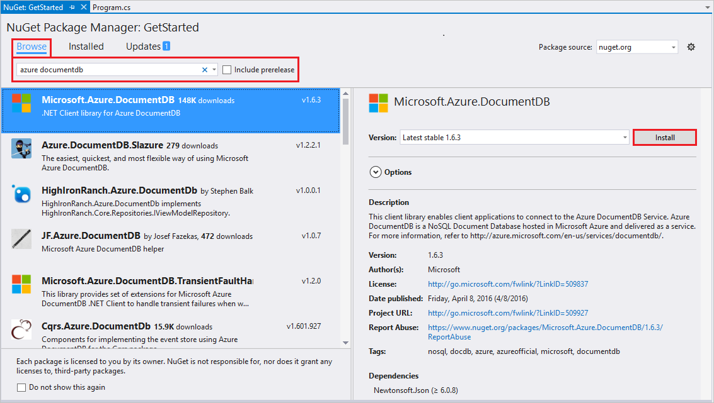
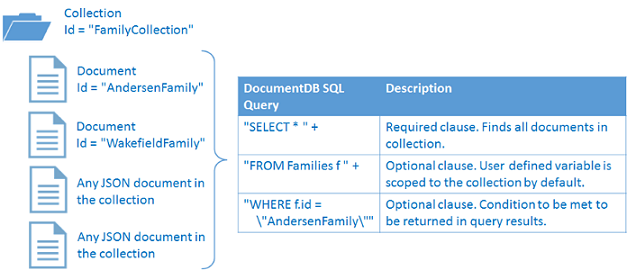

<properties
    pageTitle="NoSQL 教學課程︰ DocumentDB.NET SDK |Microsoft Azure"
    description="建立線上資料庫及 C# 主控台應用程式使用 DocumentDB.NET SDK NoSQL 教學課程。 DocumentDB 是 JSON NoSQL 資料庫。"
    keywords="nosql 教學課程中，線上資料庫，c# 主控台應用程式"
    services="documentdb"
    documentationCenter=".net"
    authors="AndrewHoh"
    manager="jhubbard"
    editor="monicar"/>

<tags
    ms.service="documentdb"
    ms.workload="data-services"
    ms.tgt_pltfrm="na"
    ms.devlang="dotnet"
    ms.topic="hero-article"
    ms.date="09/01/2016"
    ms.author="anhoh"/>

# NoSQL 教學課程︰ 建立 DocumentDB C# 主控台應用程式

> [AZURE.SELECTOR]
- [.NET](documentdb-get-started.md)
- [Node.js](documentdb-nodejs-get-started.md)

歡迎使用 NoSQL 教學課程的 Azure DocumentDB.NET SDK ！ 快速入門專案或之後完成教學課程，則必須主控台應用程式建立的和查詢 DocumentDB 資源。

- **[快速入門](#quickstart)**︰ 下載的範例專案、 新增您的連線資訊，以及已在小於 10 分鐘的時間執行 DocumentDB 應用程式。
- **[教學課程](#tutorial)**︰ 建立 [快速入門] 應用程式中從頭開始 30 分鐘。

## 必要條件

- 使用中的 Azure 帳戶。 如果您沒有帳戶，您可以註冊[免費的帳戶](https://azure.microsoft.com/free/)。
- [Visual Studio 2013 或 Visual Studio 2015](http://www.visualstudio.com/)。
- .NET framework 4.6

## 快速入門

1. 從[GitHub](https://github.com/Azure-Samples/documentdb-dotnet-getting-started-quickstart/archive/master.zip)下載範例專案.zip，或複製[documentdb-dotnet-開始-開始-快速入門](https://github.com/Azure-Samples/documentdb-dotnet-getting-started-quickstart)repo。
2. 使用 Azure 的入口網站，以[建立 DocumentDB 帳戶](documentdb-create-account.md)。
3. 在 [App.config 檔案的 EndpointUri 和 PrimaryKey 值取代為擷取從[Azure 入口網站](https://portal.azure.com/)中，瀏覽至**DocumentDB (NoSQL)**刀，然後按一下**帳戶名稱**，，然後在 [資源] 功能表上按一下 [**索引鍵**的值。
    
4. 建立專案。 主控台視窗會顯示新的資源所建立查詢，，然後清除。
    
    

## 教學課程

本教學課程中會引導您建立 DocumentDB 資料庫、 DocumentDB 集合，以及 JSON 文件。 您會然後查詢集合，清理及刪除資料庫。 本教學課程中建置相同專案快速入門專案，但您會建立從屬參照並將會收到您要新增到專案的程式碼的相關說明。

## 步驟 1︰ 建立 DocumentDB 帳戶

現在就讓我們建立 DocumentDB 帳戶。 如果您已經有您想要使用的帳戶，您可以略過; 若要[設定 Visual Studio 方案](#SetupVS)。

[AZURE.INCLUDE [documentdb-create-dbaccount](../../includes/documentdb-create-dbaccount.md)]

## 步驟 2︰ 設定您的 Visual Studio 解決方案

1. 在您的電腦上開啟**Visual Studio 2015** 。
2. 在 [**檔案**] 功能表中，選取 [**新增**]，然後選擇**專案**。
3. 在 [**新專案**] 對話方塊中，選取 [**範本** / **Visual C#** / **主控台應用程式**，命名您的專案，，然後按一下**[確定]**。
![新增專案] 視窗的螢幕擷取畫面](./media/documentdb-get-started/nosql-tutorial-new-project-2.png)
4. 在**方案總管]**中，以滑鼠右鍵按一下新主控台應用程式，也就是在 Visual Studio 方案。
5. 不需離開 [] 功能表，然後按一下 []**管理 NuGet 套件...**

6. 在 [ **Nuget** ] 索引標籤中，按一下 [**瀏覽]**，請再輸入**azure documentdb**在搜尋方塊中。
7. 在結果]，尋找**Microsoft.Azure.DocumentDB**並按一下 [**安裝**]。
DocumentDB 用戶端文件庫的套件識別碼是[Microsoft.Azure.DocumentDB](https://www.nuget.org/packages/Microsoft.Azure.DocumentDB)

好 ！ 現在我們完成設定，現在就讓我們開始撰寫的部分程式碼。 您可以在[GitHub](https://github.com/Azure-Samples/documentdb-dotnet-getting-started/blob/master/src/Program.cs)上找到此教學課程的完整程式碼專案。

## 步驟 3︰ 連線至 DocumentDB 帳戶

首先，Program.cs 檔案中新增至首 C# 應用程式，這些參照︰

    using System;
    using System.Linq;
    using System.Threading.Tasks;

    // ADD THIS PART TO YOUR CODE
    using System.Net;
    using Microsoft.Azure.Documents;
    using Microsoft.Azure.Documents.Client;
    using Newtonsoft.Json;

> [AZURE.IMPORTANT] 若要完成此 NoSQL 教學課程，請確定您新增上面相依性。

現在，新增下列兩個常數和您的*用戶端*變數下方公用課程*程式*。

    public class Program
    {
        // ADD THIS PART TO YOUR CODE
        private const string EndpointUri = "<your endpoint URI>";
        private const string PrimaryKey = "<your key>";
        private DocumentClient client;

下一步] 至[Azure 入口網站](https://portal.azure.com)，來擷取您 URI 和主索引鍵不對。 DocumentDB URI 和主索引鍵是必要的應用程式，以了解連線，以及 DocumentDB 信任應用程式的連線。

在 [Azure 入口網站中，瀏覽至您的 DocumentDB 帳戶，然後按一下**鍵**。

複製 URI 從入口網站，並貼到`<your endpoint URI>`program.cs 檔案中。 然後複製入口網站的主索引鍵，並將它貼到`<your key>`。

![用來建立 C# 主控台應用程式 NoSQL 教學課程 Azure 入口網站的螢幕擷取畫面。 顯示 DocumentDB 帳戶，醒目提示 [作用中] 中心內，DocumentDB 帳戶把刀上醒目提示 [索引鍵] 按鈕與鍵刀上醒目提示的 URI、 主索引鍵和次要鍵值][keys]

我們先發生啟動應用程式建立新的執行個體的**DocumentClient**。

**主要**方法下方新增稱為**GetStartedDemo**，其中會產生我們新**DocumentClient**此新非同步工作。

    static void Main(string[] args)
    {
    }

    // ADD THIS PART TO YOUR CODE
    private async Task GetStartedDemo()
    {
        this.client = new DocumentClient(new Uri(EndpointUri), PrimaryKey);
    }

新增下列程式碼，從您的**主要**方式執行非同步工作。 **主要**方法會擷取例外狀況，並填入主控台。

    static void Main(string[] args)
    {
            // ADD THIS PART TO YOUR CODE
            try
            {
                    Program p = new Program();
                    p.GetStartedDemo().Wait();
            }
            catch (DocumentClientException de)
            {
                    Exception baseException = de.GetBaseException();
                    Console.WriteLine("{0} error occurred: {1}, Message: {2}", de.StatusCode, de.Message, baseException.Message);
            }
            catch (Exception e)
            {
                    Exception baseException = e.GetBaseException();
                    Console.WriteLine("Error: {0}, Message: {1}", e.Message, baseException.Message);
            }
            finally
            {
                    Console.WriteLine("End of demo, press any key to exit.");
                    Console.ReadKey();
            }

按**F5**執行應用程式。

恭喜您 ！ 您已成功連線至 DocumentDB 帳戶，現在讓我們來看看使用 DocumentDB 資源。  

## 步驟 4︰ 建立資料庫
新增建立資料庫的程式碼之前，新增撰寫主控台協助程式方法。

複製並貼上的下方**GetStartedDemo**方法**WriteToConsoleAndPromptToContinue**方法。

    // ADD THIS PART TO YOUR CODE
    private void WriteToConsoleAndPromptToContinue(string format, params object[] args)
    {
            Console.WriteLine(format, args);
            Console.WriteLine("Press any key to continue ...");
            Console.ReadKey();
    }

建立 DocumentDB[資料庫](documentdb-resources.md#databases)可以使用**DocumentClient**類別[CreateDatabaseAsync](https://msdn.microsoft.com/library/microsoft.azure.documents.client.documentclient.createdatabaseasync.aspx)方法。 資料庫是邏輯容器的 JSON 分割整個集合的文件儲存空間。

複製並貼上的下方**WriteToConsoleAndPromptToContinue**方法**CreateDatabaseIfNotExists**方法。

    // ADD THIS PART TO YOUR CODE
    private async Task CreateDatabaseIfNotExists(string databaseName)
    {
            // Check to verify a database with the id=FamilyDB does not exist
            try
            {
                    await this.client.ReadDatabaseAsync(UriFactory.CreateDatabaseUri(databaseName));
                    this.WriteToConsoleAndPromptToContinue("Found {0}", databaseName);
            }
            catch (DocumentClientException de)
            {
                    // If the database does not exist, create a new database
                    if (de.StatusCode == HttpStatusCode.NotFound)
                    {
                            await this.client.CreateDatabaseAsync(new Database { Id = databaseName });
                            this.WriteToConsoleAndPromptToContinue("Created {0}", databaseName);
                    }
                    else
                    {
                            throw;
                    }
            }
    }

複製並貼上下列的程式碼，建立用戶端下方您**GetStartedDemo**方法。 這會建立一個名為*FamilyDB*資料庫。

    private async Task GetStartedDemo()
    {
        this.client = new DocumentClient(new Uri(EndpointUri), PrimaryKey);

        // ADD THIS PART TO YOUR CODE
        await this.CreateDatabaseIfNotExists("FamilyDB_va");

按**F5**執行應用程式。

恭喜您 ！ 您已成功建立 DocumentDB 資料庫。  

## 步驟 5︰ 建立集合  

> [AZURE.WARNING] **CreateDocumentCollectionAsync**將會建立新集合與保留處理量，具有價格的含意。 如需詳細資訊，請造訪我們的[價格頁面](https://azure.microsoft.com/pricing/details/documentdb/)。

建立[集合](documentdb-resources.md#collections)可以使用**DocumentClient**類別[CreateDocumentCollectionAsync](https://msdn.microsoft.com/library/microsoft.azure.documents.client.documentclient.createdocumentcollectionasync.aspx)方法。 集合是 JSON 文件和相關聯的 JavaScript 應用程式邏輯的容器。

複製並貼上您**CreateDatabaseIfNotExists**方法下方的**CreateDocumentCollectionIfNotExists**方法。

    // ADD THIS PART TO YOUR CODE
    private async Task CreateDocumentCollectionIfNotExists(string databaseName, string collectionName)
    {
        try
        {
            await this.client.ReadDocumentCollectionAsync(UriFactory.CreateDocumentCollectionUri(databaseName, collectionName));
            this.WriteToConsoleAndPromptToContinue("Found {0}", collectionName);
        }
        catch (DocumentClientException de)
        {
            // If the document collection does not exist, create a new collection
            if (de.StatusCode == HttpStatusCode.NotFound)
            {
                DocumentCollection collectionInfo = new DocumentCollection();
                collectionInfo.Id = collectionName;

                // Configure collections for maximum query flexibility including string range queries.
                collectionInfo.IndexingPolicy = new IndexingPolicy(new RangeIndex(DataType.String) { Precision = -1 });

                // Here we create a collection with 400 RU/s.
                await this.client.CreateDocumentCollectionAsync(
                    UriFactory.CreateDatabaseUri(databaseName),
                    collectionInfo,
                    new RequestOptions { OfferThroughput = 400 });

                this.WriteToConsoleAndPromptToContinue("Created {0}", collectionName);
            }
            else
            {
                throw;
            }
        }
    }

複製並貼上下列的程式碼下方資料庫建立您**GetStartedDemo**方法。 這會建立名為*FamilyCollection_va*文件集合。

        this.client = new DocumentClient(new Uri(EndpointUri), PrimaryKey);

        await this.CreateDatabaseIfNotExists("FamilyDB_oa");

        // ADD THIS PART TO YOUR CODE
        await this.CreateDocumentCollectionIfNotExists("FamilyDB_va", "FamilyCollection_va");

按**F5**執行應用程式。

恭喜您 ！ 您已成功建立 DocumentDB 文件集合。  

## 步驟 6︰ 建立 JSON 文件
建立[文件](documentdb-resources.md#documents)可以使用**DocumentClient**類別[CreateDocumentAsync](https://msdn.microsoft.com/library/microsoft.azure.documents.client.documentclient.createdocumentasync.aspx)方法。 文件的使用者定義 （任意） JSON 內容。 現在，我們可以插入一或多個文件。 如果您已經有您想要儲存在您的資料庫中的資料，您可以使用 DocumentDB 的[資料移轉工具](documentdb-import-data.md)。

首先，我們需要建立**系列**課程代表內 DocumentDB 儲存在這個範例中的物件。 我們也會建立**父**、**子**、**寵物****系列**中所使用的**地址**子類別。 注意文件，必須有序列化**識別碼**JSON 中為 [**識別碼**] 屬性。 新增下列內部子類別**GetStartedDemo**方法之後，以建立這些類別。

複製並貼上**家人**、**父**、**子**、**寵物**和**WriteToConsoleAndPromptToContinue**方法下方的**地址**類別。

    private void WriteToConsoleAndPromptToContinue(string format, params object[] args)
    {
        Console.WriteLine(format, args);
        Console.WriteLine("Press any key to continue ...");
        Console.ReadKey();
    }

    // ADD THIS PART TO YOUR CODE
    public class Family
    {
        [JsonProperty(PropertyName = "id")]
        public string Id { get; set; }
        public string LastName { get; set; }
        public Parent[] Parents { get; set; }
        public Child[] Children { get; set; }
        public Address Address { get; set; }
        public bool IsRegistered { get; set; }
        public override string ToString()
        {
                return JsonConvert.SerializeObject(this);
        }
    }

    public class Parent
    {
        public string FamilyName { get; set; }
        public string FirstName { get; set; }
    }

    public class Child
    {
        public string FamilyName { get; set; }
        public string FirstName { get; set; }
        public string Gender { get; set; }
        public int Grade { get; set; }
        public Pet[] Pets { get; set; }
    }

    public class Pet
    {
        public string GivenName { get; set; }
    }

    public class Address
    {
        public string State { get; set; }
        public string County { get; set; }
        public string City { get; set; }
    }

複製並貼上您**CreateDocumentCollectionIfNotExists**方法下方的**CreateFamilyDocumentIfNotExists**方法。

    // ADD THIS PART TO YOUR CODE
    private async Task CreateFamilyDocumentIfNotExists(string databaseName, string collectionName, Family family)
    {
        try
        {
            await this.client.ReadDocumentAsync(UriFactory.CreateDocumentUri(databaseName, collectionName, family.Id));
            this.WriteToConsoleAndPromptToContinue("Found {0}", family.Id);
        }
        catch (DocumentClientException de)
        {
            if (de.StatusCode == HttpStatusCode.NotFound)
            {
                await this.client.CreateDocumentAsync(UriFactory.CreateDocumentCollectionUri(databaseName, collectionName), family);
                this.WriteToConsoleAndPromptToContinue("Created Family {0}", family.Id);
            }
            else
            {
                throw;
            }
        }
    }

然後插入兩個文件，分別 Andersen 系列和 Wakefield 系列。

複製並貼上下列的程式碼，以建立文件集合下方您**GetStartedDemo**方法。

    await this.CreateDatabaseIfNotExists("FamilyDB_va");

    await this.CreateDocumentCollectionIfNotExists("FamilyDB_va", "FamilyCollection_va");

    // ADD THIS PART TO YOUR CODE
    Family andersenFamily = new Family
    {
            Id = "Andersen.1",
            LastName = "Andersen",
            Parents = new Parent[]
            {
                    new Parent { FirstName = "Thomas" },
                    new Parent { FirstName = "Mary Kay" }
            },
            Children = new Child[]
            {
                    new Child
                    {
                            FirstName = "Henriette Thaulow",
                            Gender = "female",
                            Grade = 5,
                            Pets = new Pet[]
                            {
                                    new Pet { GivenName = "Fluffy" }
                            }
                    }
            },
            Address = new Address { State = "WA", County = "King", City = "Seattle" },
            IsRegistered = true
    };

    await this.CreateFamilyDocumentIfNotExists("FamilyDB_va", "FamilyCollection_va", andersenFamily);

    Family wakefieldFamily = new Family
    {
            Id = "Wakefield.7",
            LastName = "Wakefield",
            Parents = new Parent[]
            {
                    new Parent { FamilyName = "Wakefield", FirstName = "Robin" },
                    new Parent { FamilyName = "Miller", FirstName = "Ben" }
            },
            Children = new Child[]
            {
                    new Child
                    {
                            FamilyName = "Merriam",
                            FirstName = "Jesse",
                            Gender = "female",
                            Grade = 8,
                            Pets = new Pet[]
                            {
                                    new Pet { GivenName = "Goofy" },
                                    new Pet { GivenName = "Shadow" }
                            }
                    },
                    new Child
                    {
                            FamilyName = "Miller",
                            FirstName = "Lisa",
                            Gender = "female",
                            Grade = 1
                    }
            },
            Address = new Address { State = "NY", County = "Manhattan", City = "NY" },
            IsRegistered = false
    };

    await this.CreateFamilyDocumentIfNotExists("FamilyDB_va", "FamilyCollection_va", wakefieldFamily);

按**F5**執行應用程式。

恭喜您 ！ 您已成功建立兩個 DocumentDB 文件。  

##步驟 7︰ 查詢 DocumentDB 資源

DocumentDB 支援 JSON 文件儲存在每個集合中豐富[的查詢](documentdb-sql-query.md)。  下列範例會顯示各種不同的查詢-使用兩個 DocumentDB SQL 語法以及 LINQ-，我們對執行文件我們插入在先前的步驟。

複製並貼上您**CreateFamilyDocumentIfNotExists**方法下方的**ExecuteSimpleQuery**方法。

    // ADD THIS PART TO YOUR CODE
    private void ExecuteSimpleQuery(string databaseName, string collectionName)
    {
        // Set some common query options
        FeedOptions queryOptions = new FeedOptions { MaxItemCount = -1 };

            // Here we find the Andersen family via its LastName
            IQueryable<Family> familyQuery = this.client.CreateDocumentQuery<Family>(
                    UriFactory.CreateDocumentCollectionUri(databaseName, collectionName), queryOptions)
                    .Where(f => f.LastName == "Andersen");

            // The query is executed synchronously here, but can also be executed asynchronously via the IDocumentQuery<T> interface
            Console.WriteLine("Running LINQ query...");
            foreach (Family family in familyQuery)
            {
                    Console.WriteLine("\tRead {0}", family);
            }

            // Now execute the same query via direct SQL
            IQueryable<Family> familyQueryInSql = this.client.CreateDocumentQuery<Family>(
                    UriFactory.CreateDocumentCollectionUri(databaseName, collectionName),
                    "SELECT * FROM Family WHERE Family.LastName = 'Andersen'",
                    queryOptions);

            Console.WriteLine("Running direct SQL query...");
            foreach (Family family in familyQueryInSql)
            {
                    Console.WriteLine("\tRead {0}", family);
            }

            Console.WriteLine("Press any key to continue ...");
            Console.ReadKey();
    }

複製並貼上下列的程式碼，第二個建立的文件下方您**GetStartedDemo**方法。

    await this.CreateFamilyDocumentIfNotExists("FamilyDB_va", "FamilyCollection_va", wakefieldFamily);

    // ADD THIS PART TO YOUR CODE
    this.ExecuteSimpleQuery("FamilyDB_va", "FamilyCollection_va");

按**F5**執行應用程式。

恭喜您 ！ 您已成功查詢 DocumentDB 集合。

下圖說明如何 DocumentDB SQL 查詢語法稱為集合您建立了及相同的邏輯適用於 LINQ 查詢。

[從](documentdb-sql-query.md#from-clause)關鍵字是在查詢中的選擇性的因為 DocumentDB 查詢已經限於單一集合。 因此，「 從系列 f 」 可以交換以 「 從根 r 」，或任何其他變數名稱您選擇。 DocumentDB 會推斷該系列、 根目錄或您選擇的變數名稱，請依預設參照目前的集合。

##步驟 8︰ 取代 JSON 文件

DocumentDB 支援取代 JSON 文件。  

複製並貼上您**ExecuteSimpleQuery**方法下方的**ReplaceFamilyDocument**方法。

    // ADD THIS PART TO YOUR CODE
    private async Task ReplaceFamilyDocument(string databaseName, string collectionName, string familyName, Family updatedFamily)
    {
        try
        {
            await this.client.ReplaceDocumentAsync(UriFactory.CreateDocumentUri(databaseName, collectionName, familyName), updatedFamily);
            this.WriteToConsoleAndPromptToContinue("Replaced Family {0}", familyName);
        }
        catch (DocumentClientException de)
        {
            throw;
        }
    }

複製並貼上下列的程式碼，查詢執行下方您**GetStartedDemo**方法。 之後取代文件，這樣就會執行相同的查詢，即可檢視修訂的文件。

    await this.CreateFamilyDocumentIfNotExists("FamilyDB_va", "FamilyCollection_va", wakefieldFamily);

    this.ExecuteSimpleQuery("FamilyDB_va", "FamilyCollection_va");

    // ADD THIS PART TO YOUR CODE
    // Update the Grade of the Andersen Family child
    andersenFamily.Children[0].Grade = 6;

    await this.ReplaceFamilyDocument("FamilyDB_va", "FamilyCollection_va", "Andersen.1", andersenFamily);

    this.ExecuteSimpleQuery("FamilyDB_va", "FamilyCollection_va");

按**F5**執行應用程式。

恭喜您 ！ 您已經順利取代 DocumentDB 文件。

##步驟 9︰ 刪除 JSON 文件

DocumentDB 支援刪除 JSON 文件。  

複製並貼上您**ReplaceFamilyDocument**方法下方的**DeleteFamilyDocument**方法。

    // ADD THIS PART TO YOUR CODE
    private async Task DeleteFamilyDocument(string databaseName, string collectionName, string documentName)
    {
        try
        {
            await this.client.DeleteDocumentAsync(UriFactory.CreateDocumentUri(databaseName, collectionName, documentName));
            Console.WriteLine("Deleted Family {0}", documentName);
        }
        catch (DocumentClientException de)
        {
            throw;
        }
    }

複製並貼上下列的程式碼下方的第二個查詢執行您**GetStartedDemo**方法。

    await this.ReplaceFamilyDocument("FamilyDB_va", "FamilyCollection_va", "Andersen.1", andersenFamily);

    this.ExecuteSimpleQuery("FamilyDB_va", "FamilyCollection_va");

    // ADD THIS PART TO CODE
    await this.DeleteFamilyDocument("FamilyDB_va", "FamilyCollection_va", "Andersen.1");

按**F5**執行應用程式。

恭喜您 ！ 您已成功刪除 DocumentDB 文件。

##步驟 10︰ 刪除資料庫

刪除建立的資料庫，將會移除資料庫及所有子系資源 （集合、 文件）。

複製並貼上下列程式碼，您的文件下方的**GetStartedDemo**方法若要刪除刪除整個資料庫及所有子系資源。

    this.ExecuteSimpleQuery("FamilyDB_va", "FamilyCollection_va");

    await this.DeleteFamilyDocument("FamilyDB_va", "FamilyCollection_va", "Andersen.1");

    // ADD THIS PART TO CODE
    // Clean up/delete the database
    await this.client.DeleteDatabaseAsync(UriFactory.CreateDatabaseUri("FamilyDB_va"));

按**F5**執行應用程式。

恭喜您 ！ 您已成功刪除 DocumentDB 資料庫。

##步驟 11︰ 執行您 C# 主控台應用程式一起 ！

Visual Studio 建立偵錯模式中的應用程式的 f5。

您應該會看到您開始使用應用程式的輸出。 輸出會顯示我們新增，並應符合下列範例文字查詢的結果。

    Created FamilyDB_va
    Press any key to continue ...
    Created FamilyCollection_va
    Press any key to continue ...
    Created Family Andersen.1
    Press any key to continue ...
    Created Family Wakefield.7
    Press any key to continue ...
    Running LINQ query...
        Read {"id":"Andersen.1","LastName":"Andersen","District":"WA5","Parents":[{"FamilyName":null,"FirstName":"Thomas"},{"FamilyName":null,"FirstName":"Mary Kay"}],"Children":[{"FamilyName":null,"FirstName":"Henriette Thaulow","Gender":"female","Grade":5,"Pets":[{"GivenName":"Fluffy"}]}],"Address":{"State":"WA","County":"King","City":"Seattle"},"IsRegistered":true}
    Running direct SQL query...
        Read {"id":"Andersen.1","LastName":"Andersen","District":"WA5","Parents":[{"FamilyName":null,"FirstName":"Thomas"},{"FamilyName":null,"FirstName":"Mary Kay"}],"Children":[{"FamilyName":null,"FirstName":"Henriette Thaulow","Gender":"female","Grade":5,"Pets":[{"GivenName":"Fluffy"}]}],"Address":{"State":"WA","County":"King","City":"Seattle"},"IsRegistered":true}
    Replaced Family Andersen.1
    Press any key to continue ...
    Running LINQ query...
        Read {"id":"Andersen.1","LastName":"Andersen","District":"WA5","Parents":[{"FamilyName":null,"FirstName":"Thomas"},{"FamilyName":null,"FirstName":"Mary Kay"}],"Children":[{"FamilyName":null,"FirstName":"Henriette Thaulow","Gender":"female","Grade":6,"Pets":[{"GivenName":"Fluffy"}]}],"Address":{"State":"WA","County":"King","City":"Seattle"},"IsRegistered":true}
    Running direct SQL query...
        Read {"id":"Andersen.1","LastName":"Andersen","District":"WA5","Parents":[{"FamilyName":null,"FirstName":"Thomas"},{"FamilyName":null,"FirstName":"Mary Kay"}],"Children":[{"FamilyName":null,"FirstName":"Henriette Thaulow","Gender":"female","Grade":6,"Pets":[{"GivenName":"Fluffy"}]}],"Address":{"State":"WA","County":"King","City":"Seattle"},"IsRegistered":true}
    Deleted Family Andersen.1
    End of demo, press any key to exit.

恭喜您 ！ 您已完成此 NoSQL 教學課程，並使用 C# 主控台應用程式 ！

## 後續步驟

- 想要更複雜的 ASP.NET MVC NoSQL 教學課程嗎？ 請參閱[建立與使用 DocumentDB ASP.NET MVC web 應用程式](documentdb-dotnet-application.md)。
- 想要執行縮放比例與使用 DocumentDB 測試的效能？ 請參閱[效能與縮放比例與 Azure DocumentDB 測試](documentdb-performance-testing.md)
-   瞭解如何[監視器 DocumentDB 帳戶](documentdb-monitor-accounts.md)。
-   針對我們的範例資料集，[查詢遊樂場](https://www.documentdb.com/sql/demo)中執行查詢。
-   進一步瞭解程式設計的模型[DocumentDB 文件頁面](https://azure.microsoft.com/documentation/services/documentdb/)的 [開發] 區段中。

[documentdb-create-account]: documentdb-create-account.md
[documentdb-manage]: documentdb-manage.md
[keys]: media/documentdb-get-started-quickstart/nosql-tutorial-keys.png

