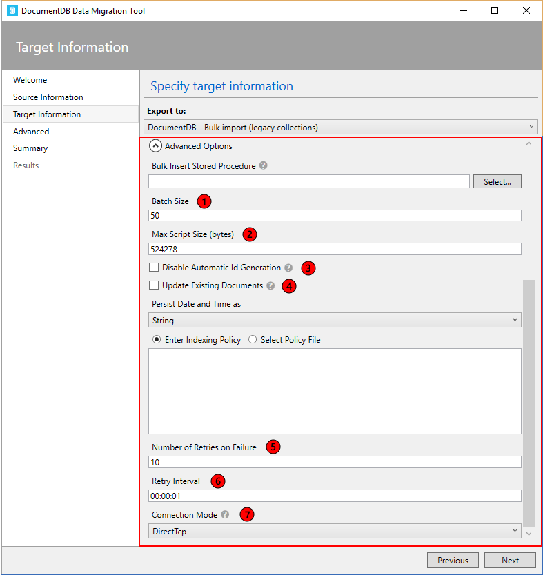
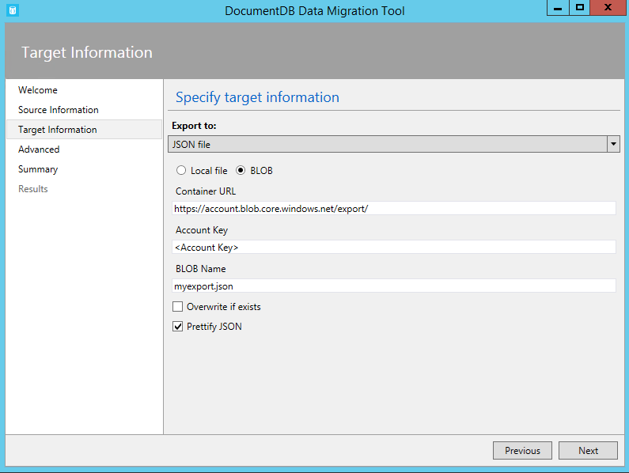
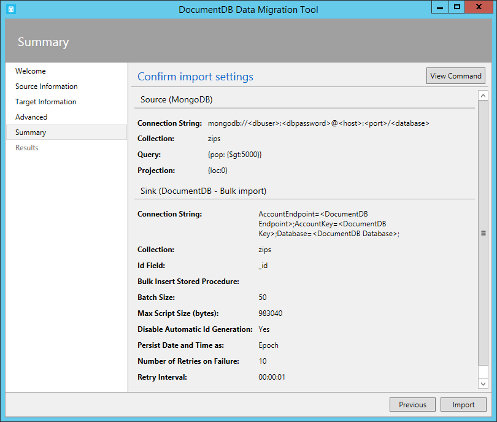

<properties
    pageTitle="資料庫移轉工具 DocumentDB |Microsoft Azure"
    description="瞭解如何使用開啟來源 DocumentDB 資料移轉工具資料匯入到 DocumentDB 來自各種來源包括 MongoDB、 SQL Server、 表格儲存空間、 Amazon DynamoDB，CSV 及 JSON 檔案。 JSON 轉換為 CSV。"
    keywords="csv 到 json，資料庫移轉工具，將 csv 轉換成 json"
    services="documentdb"
    authors="andrewhoh"
    manager="jhubbard"
    editor="monicar"
    documentationCenter=""/>

<tags
    ms.service="documentdb"
    ms.workload="data-services"
    ms.tgt_pltfrm="na"
    ms.devlang="na"
    ms.topic="article"
    ms.date="10/06/2016"
    ms.author="anhoh"/>

# 使用資料庫移轉工具匯入資料至 DocumentDB

本文將示範如何使用 「 正式開啟來源 DocumentDB 資料移轉工具資料匯入到[Microsoft Azure DocumentDB](https://azure.microsoft.com/services/documentdb/)來自各種來源，包括 JSON 檔案、 CSV 檔案、 SQL、 MongoDB、 Azure 資料表儲存體、 Amazon DynamoDB 和 DocumentDB 集合。

閱讀本文之後，您便可以回答下列問題︰  

-   如何以 DocumentDB 匯 JSON 檔案、 CSV 檔案、 SQL Server 資料或 MongoDB 資料？
-   如何可以匯入資料從 Azure 資料表儲存體、 Amazon DynamoDB 和 HBase 至 DocumentDB？
-   我要如何移轉 DocumentDB 集合之間的資料？

##必要條件

前遵循本文中的指示，請確定您已安裝下列︰

- [Microsoft.NET Framework 4.51](https://www.microsoft.com/download/developer-tools.aspx)或更新版本。

##DocumentDB 資料移轉工具的概觀

DocumentDB 資料移轉工具是從各種不同的來源匯入資料至 DocumentDB 開啟來源解決辦法︰

- JSON 檔案
- MongoDB
- SQL Server
- CSV 檔案
- Azure 資料表儲存體
- Amazon DynamoDB
- HBase
- DocumentDB 集合

匯入工具包含圖形使用者介面 (dtui.exe)，同時也從命令列 (dt.exe) 導向它。 事實上，有一個選項來設定透過 UI 匯入後輸出相關聯的命令。 經過的階層式關聯 （含子） 建立匯入期間，可以轉換表格式的來源資料 （例如 SQL Server 或 CSV 檔案）。 請繼續閱讀以瞭解更多有關來源選項，範例匯入的每個來源] 目標選項，以及檢視匯入結果的命令列。

##安裝 DocumentDB 資料移轉工具

移轉工具原始程式碼 GitHub 提供[此存放庫](https://github.com/azure/azure-documentdb-datamigrationtool)中，而編譯的版本，從[Microsoft 下載中心](http://www.microsoft.com/downloads/details.aspx?FamilyID=cda7703a-2774-4c07-adcc-ad02ddc1a44d)。 您可能會編譯方案或只要下載並解壓縮已編譯的目錄，您所選擇的版本。 再執行︰

- **Dtui.exe**︰ 工具的圖形化介面版本
- **Dt.exe**: 工具命令列版本

##匯入 JSON 檔案

JSON 檔案來源匯入工具選項可讓您匯入一或多個單一文件 JSON 檔案或 JSON 每一個包含陣列的 JSON 文件的檔案。 新增包含 JSON 檔案匯入的資料夾，您有循環搜尋的子資料夾中的選項。

以下是一些命令列範例] 來匯入 JSON 檔案︰

    #Import a single JSON file
    dt.exe /s:JsonFile /s.Files:.\Sessions.json /t:DocumentDBBulk /t.ConnectionString:"AccountEndpoint=<DocumentDB Endpoint>;AccountKey=<DocumentDB Key>;Database=<DocumentDB Database>;" /t.Collection:Sessions /t.CollectionThroughput:2500

    #Import a directory of JSON files
    dt.exe /s:JsonFile /s.Files:C:\TESessions\*.json /t:DocumentDBBulk /t.ConnectionString:" AccountEndpoint=<DocumentDB Endpoint>;AccountKey=<DocumentDB Key>;Database=<DocumentDB Database>;" /t.Collection:Sessions /t.CollectionThroughput:2500

    #Import a directory (including sub-directories) of JSON files
    dt.exe /s:JsonFile /s.Files:C:\LastFMMusic\**\*.json /t:DocumentDBBulk /t.ConnectionString:" AccountEndpoint=<DocumentDB Endpoint>;AccountKey=<DocumentDB Key>;Database=<DocumentDB Database>;" /t.Collection:Music /t.CollectionThroughput:2500

    #Import a directory (single), directory (recursive), and individual JSON files
    dt.exe /s:JsonFile /s.Files:C:\Tweets\*.*;C:\LargeDocs\**\*.*;C:\TESessions\Session48172.json;C:\TESessions\Session48173.json;C:\TESessions\Session48174.json;C:\TESessions\Session48175.json;C:\TESessions\Session48177.json /t:DocumentDBBulk /t.ConnectionString:"AccountEndpoint=<DocumentDB Endpoint>;AccountKey=<DocumentDB Key>;Database=<DocumentDB Database>;" /t.Collection:subs /t.CollectionThroughput:2500

    #Import a single JSON file and partition the data across 4 collections
    dt.exe /s:JsonFile /s.Files:D:\\CompanyData\\Companies.json /t:DocumentDBBulk /t.ConnectionString:"AccountEndpoint=<DocumentDB Endpoint>;AccountKey=<DocumentDB Key>;Database=<DocumentDB Database>;" /t.Collection:comp[1-4] /t.PartitionKey:name /t.CollectionThroughput:2500

##從 MongoDB 匯入

MongoDB 來源匯入工具選項可讓您匯入個別的 MongoDB 集合，您也可以篩選使用查詢的文件及/或修改文件結構使用預測。  

連接字串是標準的 MongoDB 格式︰

    mongodb://<dbuser>:<dbpassword>@<host>:<port>/<database>

> [AZURE.NOTE] 使用 [驗證] 命令，以確保可以存取的連線字串] 欄位中指定的 MongoDB 執行個體。

輸入的集合匯入資料的名稱。 您也可以選擇指定或提供查詢檔案 (例如 {快: {$gt: 5000}}) 及/或預測 (例如 {loc:0}) 篩選，並重塑資料以匯入。

以下是一些 MongoDB 從匯入的命令列範例︰

    #Import all documents from a MongoDB collection
    dt.exe /s:MongoDB /s.ConnectionString:mongodb://<dbuser>:<dbpassword>@<host>:<port>/<database> /s.Collection:zips /t:DocumentDBBulk /t.ConnectionString:"AccountEndpoint=<DocumentDB Endpoint>;AccountKey=<DocumentDB Key>;Database=<DocumentDB Database>;" /t.Collection:BulkZips /t.IdField:_id /t.CollectionThroughput:2500

    #Import documents from a MongoDB collection which match the query and exclude the loc field
    dt.exe /s:MongoDB /s.ConnectionString:mongodb://<dbuser>:<dbpassword>@<host>:<port>/<database> /s.Collection:zips /s.Query:{pop:{$gt:50000}} /s.Projection:{loc:0} /t:DocumentDBBulk /t.ConnectionString:"AccountEndpoint=<DocumentDB Endpoint>;AccountKey=<DocumentDB Key>;Database=<DocumentDB Database>;" /t.Collection:BulkZipsTransform /t.IdField:_id/t.CollectionThroughput:2500

##匯入 MongoDB 匯出檔案

MongoDB 匯出 JSON 檔案來源匯入工具選項可讓您匯入從 mongoexport 公用程式所產生的一或多個 JSON 檔案。  

新增包含 MongoDB 匯出 JSON 檔案匯入的資料夾，您有循環搜尋的子資料夾中的選項。

以下是從 MongoDB 匯出 JSON 檔案匯入的命令列範例︰

    dt.exe /s:MongoDBExport /s.Files:D:\mongoemployees.json /t:DocumentDBBulk /t.ConnectionString:"AccountEndpoint=<DocumentDB Endpoint>;AccountKey=<DocumentDB Key>;Database=<DocumentDB Database>;" /t.Collection:employees /t.IdField:_id /t.Dates:Epoch /t.CollectionThroughput:2500

##從 SQL Server 匯入

SQL 來源匯入工具選項可讓您匯入個別的 SQL Server 資料庫，而且您也可以篩選 [要匯入使用查詢的記錄。 此外，您可以修改文件結構，藉由使用巢狀的分隔符號 （詳細說明一些時間）。  

連線字串的格式是標準的 SQL 連接字串格式。

> [AZURE.NOTE] 使用 [驗證] 命令，以確保可以存取的連線字串] 欄位中指定的 SQL Server 執行個體。

巢狀分隔符號屬性用來建立匯入期間的階層式關聯 （子文件）。 請考慮下列 SQL 查詢︰

*選取轉換 (BusinessEntityID 另存新檔 varchar) 為識別碼、 名稱、 地址鍵入為 [Address.AddressType]、 AddressLine1 為 [Address.AddressLine1]、 縣/市為 [Address.Location.City]、 StateProvinceName 為 [Address.Location.StateProvinceName]、 [郵遞區號] 為 [Address.PostalCode]、 CountryRegionName 為 [Address.CountryRegionName] 從 Sales.vStoreWithAddresses 位置地址鍵入 =' 主要 Office 」*

會傳回下列 （部分） 的結果︰

請注意 Address.AddressType 等 Address.Location.StateProvinceName 別名。 依指定的巢狀分隔符號 '。 」，匯入期間匯入工具所建立的地址和 Address.Location 子文件。 以下是在 DocumentDB 產生文件的範例︰

*{「 識別碼 」: 「 956 」 的 「 名稱 」: 「 更妥善地銷售與服務]，「 地址 」: {「 地址鍵入 「: 「 主要 Office 」、 「 AddressLine1 」: 「 #500 75 O'Connor 街道 「，」 位置 」: {「 城市 」: 「 Ottawa 」、 「 StateProvinceName 」: 「 安大略 」}，「 郵遞區號 」: 「 K4B 1S2 「，」 CountryRegionName 」: 「 加拿大 」}}*

以下是一些從 SQL Server 匯入的命令列範例︰

    #Import records from SQL which match a query
    dt.exe /s:SQL /s.ConnectionString:"Data Source=<server>;Initial Catalog=AdventureWorks;User Id=advworks;Password=<password>;" /s.Query:"select CAST(BusinessEntityID AS varchar) as Id, * from Sales.vStoreWithAddresses WHERE AddressType='Main Office'" /t:DocumentDBBulk /t.ConnectionString:" AccountEndpoint=<DocumentDB Endpoint>;AccountKey=<DocumentDB Key>;Database=<DocumentDB Database>;" /t.Collection:Stores /t.IdField:Id /t.CollectionThroughput:2500

    #Import records from sql which match a query and create hierarchical relationships
    dt.exe /s:SQL /s.ConnectionString:"Data Source=<server>;Initial Catalog=AdventureWorks;User Id=advworks;Password=<password>;" /s.Query:"select CAST(BusinessEntityID AS varchar) as Id, Name, AddressType as [Address.AddressType], AddressLine1 as [Address.AddressLine1], City as [Address.Location.City], StateProvinceName as [Address.Location.StateProvinceName], PostalCode as [Address.PostalCode], CountryRegionName as [Address.CountryRegionName] from Sales.vStoreWithAddresses WHERE AddressType='Main Office'" /s.NestingSeparator:. /t:DocumentDBBulk /t.ConnectionString:" AccountEndpoint=<DocumentDB Endpoint>;AccountKey=<DocumentDB Key>;Database=<DocumentDB Database>;" /t.Collection:StoresSub /t.IdField:Id /t.CollectionThroughput:2500

##匯入 CSV 檔案的轉換為 JSON 的 CSV

CSV 檔案來源匯入工具選項可讓您匯入一或多個 CSV 檔案。 新增包含 CSV 檔案匯入的資料夾，您有循環搜尋的子資料夾中的選項。

類似的 SQL 來源、 巢狀分隔符號屬性可能會用來建立階層的關聯 （子文件） 匯入期間。 請考慮下列 CSV 標頭列和資料列︰

請注意 DomainInfo.Domain_Name 等 RedirectInfo.Redirecting 別名。 依指定的巢狀分隔符號 '。 」，匯入工具將會建立 DomainInfo 和 RedirectInfo 含子匯入期間。 以下是在 DocumentDB 產生文件的範例︰

*{「 DomainInfo 」: {「 網域名稱 」: 「 ACUS.GOV 」、 「 Domain_Name_Address 」: 「 http://www.ACUS.GOV 」}，「 美國聯邦機構 」: 「 系統管理會議的美國 」、 「 RedirectInfo 」: {」 重新導向 」: 「 0 」，「 Redirect_Destination 」: 「 「}，「 識別碼 」: 「 9cc565c5-ebcd-1c03-ebd3-cc3e2ecd814d 」}*

[匯入] 工具會嘗試推斷具 CSV 檔案中的值 （引號括住的值永遠被視為字串） 的類型資訊。  以下列順序識別型別︰ 數字、 日期時間、 布林值。  

有注意 CSV 匯入的其他兩個動作︰

1.  根據預設，具的值將會永遠調整定位點和空格時引號括住的值會保留為-是。 可以覆寫此行為，與 Trim 引號括住的值] 核取方塊或 /s.TrimQuoted 命令列選項。

2.  根據預設，具的 null 被視為 null 值。 可覆寫此行為 （亦即視為具的 null 「 null 」 字串） 與就搗蛋不加引號 NULL 為字串] 核取方塊或 /s.NoUnquotedNulls 命令列選項。

以下是命令列範例 CSV 匯入︰

    dt.exe /s:CsvFile /s.Files:.\Employees.csv /t:DocumentDBBulk /t.ConnectionString:"AccountEndpoint=<DocumentDB Endpoint>;AccountKey=<DocumentDB Key>;Database=<DocumentDB Database>;" /t.Collection:Employees /t.IdField:EntityID /t.CollectionThroughput:2500

##匯入 Azure 資料表儲存體

Azure 資料表儲存體來源匯入工具選項可讓您匯入個別的 Azure 資料表儲存體表格，您也可以篩選 [要匯入的資料表實體。  

Azure 資料表儲存體連接字串的格式為︰

    DefaultEndpointsProtocol=<protocol>;AccountName=<Account Name>;AccountKey=<Account Key>;

> [AZURE.NOTE] 使用 [驗證] 命令，以確保可以存取的連線字串] 欄位中指定的 Azure 資料表儲存體執行個體。

輸入 Azure 資料表匯入資料的名稱。 您也可以指定[篩選](https://msdn.microsoft.com/library/azure/ff683669.aspx)。

Azure 資料表儲存體來源匯入工具選項有下列選項︰

1. 包含內部的欄位
    2. 所有-包括所有的內部欄位 （PartitionKey、 RowKey 和時間戳記）
    3. 無-排除內部的所有欄位
    4. RowKey-僅包含 RowKey 欄位
3. 選取資料行
    1. Azure 資料表儲存體篩選不支援預測。 如果您想要只能匯入 Azure 資料表實體的特定屬性，請將其新增至 [選取欄] 清單。 所有其他實體屬性將會忽略。

以下是從 Azure 資料表儲存體匯入的命令列範例︰

    dt.exe /s:AzureTable /s.ConnectionString:"DefaultEndpointsProtocol=https;AccountName=<Account Name>;AccountKey=<Account Key>" /s.Table:metrics /s.InternalFields:All /s.Filter:"PartitionKey eq 'Partition1' and RowKey gt '00001'" /s.Projection:ObjectCount;ObjectSize  /t:DocumentDBBulk /t.ConnectionString:" AccountEndpoint=<DocumentDB Endpoint>;AccountKey=<DocumentDB Key>;Database=<DocumentDB Database>;" /t.Collection:metrics /t.CollectionThroughput:2500

##從 Amazon DynamoDB 匯入

Amazon DynamoDB 來源匯入工具選項可讓您匯入個別的 Amazon DynamoDB 表格，您也可以篩選 [要匯入的實體。 讓設定匯入非常簡單，只要可能提供多個範本。

Amazon DynamoDB 連接字串的格式為︰

    ServiceURL=<Service Address>;AccessKey=<Access Key>;SecretKey=<Secret Key>;

> [AZURE.NOTE] 使用 [驗證] 命令，以確保可以存取的連線字串] 欄位中指定的 Amazon DynamoDB 執行個體。

以下是從 Amazon DynamoDB 匯入的命令列範例︰

    dt.exe /s:DynamoDB /s.ConnectionString:ServiceURL=https://dynamodb.us-east-1.amazonaws.com;AccessKey=<accessKey>;SecretKey=<secretKey> /s.Request:"{   """TableName""": """ProductCatalog""" }" /t:DocumentDBBulk /t.ConnectionString:"AccountEndpoint=<DocumentDB Endpoint>;AccountKey=<DocumentDB Key>;Database=<DocumentDB Database>;" /t.Collection:catalogCollection /t.CollectionThroughput:2500

##從 Azure Blob 儲存體匯入的檔案

JSON 檔案、 MongoDB 匯出檔案和 CSV 檔案來源匯入工具選項可讓您從 Azure Blob 儲存體匯入一或多個檔案。 指定之後的 Blob 容器 URL 和帳戶金鑰]，只提供規則運算式，選取要匯入的檔案。

以下是從 Azure Blob 儲存體匯入 JSON 檔案的命令列範例︰

    dt.exe /s:JsonFile /s.Files:"blobs://<account key>@account.blob.core.windows.net:443/importcontainer/.*" /t:DocumentDBBulk /t.ConnectionString:"AccountEndpoint=<DocumentDB Endpoint>;AccountKey=<DocumentDB Key>;Database=<DocumentDB Database>;" /t.Collection:doctest

##從 DocumentDB 匯入

DocumentDB 來源匯入工具選項可讓您從一或多個 DocumentDB 集合匯入資料，您也可以篩選使用查詢的文件。  

為 DocumentDB 連線字串的格式︰

    AccountEndpoint=<DocumentDB Endpoint>;AccountKey=<DocumentDB Key>;Database=<DocumentDB Database>;

可從 Azure 入口網站的按鍵刀擷取帳戶連線字串 DocumentDB，[如何管理 DocumentDB 帳戶](documentdb-manage-account.md)，所述不過資料庫的名稱必須附加到以下列格式的連線字串︰

    Database=<DocumentDB Database>;

> [AZURE.NOTE] 使用 [驗證] 命令，以確保可以存取的連線字串] 欄位中指定的 DocumentDB 執行個體。

若要匯入從單一 DocumentDB 集合，請輸入的集合匯入資料的名稱。 若要匯入來自多個 DocumentDB 集合，提供一個或多個集合名稱相符的規則運算式 (例如 collection01 | collection02 | collection03)。 您也可以選擇指定，或可能提供查詢篩選和圖案的資料要匯入的檔案。

> [AZURE.NOTE] 由於 [集合] 欄位會接受規則運算式，如果您要匯入從單一的集合，其名稱中包含規則運算式字元，然後這些字元必須逸出會相應地。

DocumentDB 來源匯入工具選項具有下列的進階的選項︰

1. 包含內部欄位︰ 指定要在 [匯出 （例如 _rid，_ts） 中包含 DocumentDB 文件系統內容。
2. 失敗次數︰ 指定的次數重試 DocumentDB 的連線發生暫時性失敗 （例如網路連線中斷）。
3. 重試間隔︰ 多久指定等待重試 DocumentDB 的連線發生暫時性失敗 （例如網路連線中斷）。
4. 連線模式︰ 指定連接模式與 DocumentDB 搭配使用。 可用的選項包括 DirectTcp、 DirectHttps，以及 [閘道器。 直接連線模式會更快、 時閘道模式為多個好記的防火牆，僅使用連接埠 443。

> [AZURE.TIP] 匯入工具預設連接模式 DirectTcp。 如果您遇到防火牆問題，請切換至連線模式閘道器，因為它只需要連接埠 443。

以下是一些從 DocumentDB 匯入的命令列範例︰

    #Migrate data from one DocumentDB collection to another DocumentDB collections
    dt.exe /s:DocumentDB /s.ConnectionString:"AccountEndpoint=<DocumentDB Endpoint>;AccountKey=<DocumentDB Key>;Database=<DocumentDB Database>;" /s.Collection:TEColl /t:DocumentDBBulk /t.ConnectionString:" AccountEndpoint=<DocumentDB Endpoint>;AccountKey=<DocumentDB Key>;Database=<DocumentDB Database>;" /t.Collection:TESessions /t.CollectionThroughput:2500

    #Migrate data from multiple DocumentDB collections to a single DocumentDB collection
    dt.exe /s:DocumentDB /s.ConnectionString:"AccountEndpoint=<DocumentDB Endpoint>;AccountKey=<DocumentDB Key>;Database=<DocumentDB Database>;" /s.Collection:comp1|comp2|comp3|comp4 /t:DocumentDBBulk /t.ConnectionString:"AccountEndpoint=<DocumentDB Endpoint>;AccountKey=<DocumentDB Key>;Database=<DocumentDB Database>;" /t.Collection:singleCollection /t.CollectionThroughput:2500

    #Export a DocumentDB collection to a JSON file
    dt.exe /s:DocumentDB /s.ConnectionString:"AccountEndpoint=<DocumentDB Endpoint>;AccountKey=<DocumentDB Key>;Database=<DocumentDB Database>;" /s.Collection:StoresSub /t:JsonFile /t.File:StoresExport.json /t.Overwrite /t.CollectionThroughput:2500

##從 HBase 匯入

HBase 來源匯入工具選項可讓您從 HBase 資料表匯入資料，您也可以篩選的資料。 讓設定匯入非常簡單，只要可能提供多個範本。

為 HBase Stargate 連線字串的格式︰

    ServiceURL=<server-address>;Username=<username>;Password=<password>

> [AZURE.NOTE] 使用 [驗證] 命令，以確保可以存取的連線字串] 欄位中指定的 HBase 執行個體。

以下是從 HBase 匯入的命令列範例︰

    dt.exe /s:HBase /s.ConnectionString:ServiceURL=<server-address>;Username=<username>;Password=<password> /s.Table:Contacts /t:DocumentDBBulk /t.ConnectionString:"AccountEndpoint=<DocumentDB Endpoint>;AccountKey=<DocumentDB Key>;Database=<DocumentDB Database>;" /t.Collection:hbaseimport

##匯入 DocumentDB （大量匯入）

DocumentDB 大量匯入工具可讓您匯入任何可用的來源的選項，使用 DocumentDB 預存程序的效率。 此工具支援匯入到一個單一分割 DocumentDB 集合，以及 sharded 匯入，也就是在多個單一分割 DocumentDB 集合分割的資料。 如需有關如何分割資料的詳細資訊，請參閱[Partitioning 和 Azure DocumentDB 中的縮放比例](documentdb-partition-data.md)。 工具會建立、 執行，然後刪除目標某個或顯示預存程序。  

為 DocumentDB 連線字串的格式︰

    AccountEndpoint=<DocumentDB Endpoint>;AccountKey=<DocumentDB Key>;Database=<DocumentDB Database>;

可從 Azure 入口網站的按鍵刀擷取帳戶連線字串 DocumentDB，[如何管理 DocumentDB 帳戶](documentdb-manage-account.md)，所述不過資料庫的名稱必須附加到以下列格式的連線字串︰

    Database=<DocumentDB Database>;

> [AZURE.NOTE] 使用 [驗證] 命令，以確保可以存取的連線字串] 欄位中指定的 DocumentDB 執行個體。

若要匯入至單一的集合，請輸入的集合的資料將會匯入並按一下 [新增] 按鈕的名稱。 若要匯入至多個集合，請個別輸入每個集合名稱或指定多個集合中使用下列語法︰ *collection_prefix*[開始-結尾索引索引索引標籤]。 當指定多個集合透過上述語法，請注意下列動作︰

1. 支援只整數範圍名稱的模式。 例如，指定集合 [0-3] 會產生下列集合︰ collection0，collection1，collection2，collection3。
2. 您可以使用縮寫的語法: [3] 集合會發出一組相同的步驟 1 中所提及的集合。
3. 提供一個以上的替代。 例如，[0-1] [0-9] 集合會產生 20 有前置零的集合名稱 (collection01，...02.03)。

一旦已指定的集合名稱，選擇所要的某個或 (到 10000 RUs RUs 400) 處理量。 最佳化匯入效能，請選擇較高的處理量。 如需有關效能層級的詳細資訊，請參閱[在 DocumentDB 效能層級](documentdb-performance-levels.md)。

> [AZURE.NOTE] 效能處理量設定僅適用於集合建立。 如果指定的集合已經存在，將不會修改其處理量。

當匯入到多個集合，匯入工具支援雜湊依據 sharding。 在此案例中，指定您想要使用的磁碟分割索引鍵的文件摘要資訊 （如果分割索引鍵空白，文件會 sharded 隨機在目標集合）。

或者，您可以指定應該在匯入 （請注意，如果文件不會包含此屬性，然後匯入工具會產生 GUID 為識別碼] 屬性值） 為 [DocumentDB 文件識別碼] 屬性使用匯入來源中的欄位。

匯入期間還有幾個進階選項可用。 首先，雖然工具包括預設大量匯入預存程序 (BulkInsert.js)，您可以選擇指定您自己儲存的匯入程序︰

 

此外，匯入時的日期類型 （例如從 SQL Server 或 MongoDB），您可以選擇三個匯入選項︰

 

-   固定的字串值的字串︰
-   期間︰ 保存為期間數值
-   同時︰ 持續字串和期間數字的值。 這個選項會建立子文件，例如: 「 date_joined 」: {「 值 」: 「 2013年-10-21T21:17:25.2410000Z 」、 「 期間 」: 1382390245}

DocumentDB 大量匯入程式有下列其他進階選項︰

1. 批次大小︰ 工具預設值為 50 批次的大小。  如果要匯入的文件很大，請考慮降低批次的大小。 相反地，如果要匯入的文件都很小，請考慮引發批次的大小。
2. 最大值指令碼大小 （位元組）︰ 預設為最大的指令碼大小為 512 KB 的工具
3. 停用自動識別碼產生︰ 如果要匯入的每個文件包含識別碼] 欄位，然後選取這個選項，可提升效能。 遺漏的唯一識別碼] 欄位的文件不會匯入。
4. 更新現有的文件︰ 工具預設 id 衝突而不取代現有的文件。 選取這個選項可讓覆寫現有的文件和搭配得宜的識別碼。 這項功能很適合用於更新現有的文件的排程的資料移轉。
5. 失敗次數︰ 指定的次數重試 DocumentDB 的連線發生暫時性失敗 （例如網路連線中斷）。
6. 重試間隔︰ 多久指定等待重試 DocumentDB 的連線發生暫時性失敗 （例如網路連線中斷）。
7. 連線模式︰ 指定連接模式與 DocumentDB 搭配使用。 可用的選項包括 DirectTcp、 DirectHttps，以及 [閘道器。 直接連線模式會更快、 時閘道模式為多個好記的防火牆，僅使用連接埠 443。

> [AZURE.TIP] 匯入工具預設連接模式 DirectTcp。 如果您遇到防火牆問題，請切換至連線模式閘道器，因為它只需要連接埠 443。

##匯入 DocumentDB （連續記錄匯入）

DocumentDB 連續記錄匯入工具可讓您匯入的任何可用的來源選項筆的基礎。 如果您要匯入至現有的集合已到達配額預存程序，您可以選擇這個選項。 此工具支援 DocumentDB 集合，以及為 sharded 匯入資料分割在多個的單一資料分割及/或多個資料分割 DocumentDB 集合是以單一 （單一資料分割和多重磁碟分割） 匯入。 如需有關如何分割資料的詳細資訊，請參閱[Partitioning 和 Azure DocumentDB 中的縮放比例](documentdb-partition-data.md)。

為 DocumentDB 連線字串的格式︰

    AccountEndpoint=<DocumentDB Endpoint>;AccountKey=<DocumentDB Key>;Database=<DocumentDB Database>;

可從 Azure 入口網站的按鍵刀擷取帳戶連線字串 DocumentDB，[如何管理 DocumentDB 帳戶](documentdb-manage-account.md)，所述不過資料庫的名稱必須附加到以下列格式的連線字串︰

    Database=<DocumentDB Database>;

> [AZURE.NOTE] 使用 [驗證] 命令，以確保可以存取的連線字串] 欄位中指定的 DocumentDB 執行個體。

若要匯入至單一的集合，請輸入的集合的資料將會匯入並按一下 [新增] 按鈕的名稱。 若要匯入至多個集合，請個別輸入每個集合名稱或指定多個集合中使用下列語法︰ *collection_prefix*[開始-結尾索引索引索引標籤]。 當指定多個集合透過上述語法，請注意下列動作︰

1. 支援只整數範圍名稱的模式。 例如，指定集合 [0-3] 會產生下列集合︰ collection0，collection1，collection2，collection3。
2. 您可以使用縮寫的語法: [3] 集合會發出一組相同的步驟 1 中所提及的集合。
3. 提供一個以上的替代。 例如，[0-1] [0-9] 集合會產生 20 有前置零的集合名稱 (collection01，...02.03)。

一旦已指定集合名稱，選擇您要的 (400 RUs 250000 RUs 要) 某個或處理量。 最佳化匯入效能，請選擇較高的處理量。 如需有關效能層級的詳細資訊，請參閱[在 DocumentDB 效能層級](documentdb-performance-levels.md)。 與處理量的集合任何匯入 > 10000 RUs 會要求資料分割索引鍵。 如果您選擇要有多個 250000 RUs，請參閱[要求增加 DocumentDB 帳戶限制](documentdb-increase-limits.md)。

> [AZURE.NOTE] 處理量設定僅適用於集合建立。 如果指定的集合已經存在，將不會修改其處理量。

當匯入到多個集合，匯入工具支援雜湊依據 sharding。 在此案例中，指定您想要使用的磁碟分割索引鍵的文件摘要資訊 （如果分割索引鍵空白，文件會 sharded 隨機在目標集合）。

或者，您可以指定應該在匯入 （請注意，如果文件不會包含此屬性，然後匯入工具會產生 GUID 為識別碼] 屬性值） 為 [DocumentDB 文件識別碼] 屬性使用匯入來源中的欄位。

匯入期間還有幾個進階選項可用。 首先，匯入時的日期類型 （例如從 SQL Server 或 MongoDB），您可以選擇三個匯入選項︰

 

-   固定的字串值的字串︰
-   期間︰ 保存為期間數值
-   同時︰ 持續字串和期間數字的值。 這個選項會建立子文件，例如: 「 date_joined 」: {「 值 」: 「 2013年-10-21T21:17:25.2410000Z 」、 「 期間 」: 1382390245}

DocumentDB-連續記錄匯入工具具有下列的其他進階的選項︰

1. 平行要求數目︰ 預設為 2 平行要求的工具。 如果要匯入的文件都很小，請考慮引發平行要求的數目。 請注意，如果這個數字太多引發，匯入可能會遇到節流設定。
2. 停用自動識別碼產生︰ 如果要匯入的每個文件包含識別碼] 欄位，然後選取這個選項，可提升效能。 遺漏的唯一識別碼] 欄位的文件不會匯入。
3. 更新現有的文件︰ 工具預設 id 衝突而不取代現有的文件。 選取這個選項可讓覆寫現有的文件和搭配得宜的識別碼。 這項功能很適合用於更新現有的文件的排程的資料移轉。
4. 失敗次數︰ 指定的次數重試 DocumentDB 的連線發生暫時性失敗 （例如網路連線中斷）。
5. 重試間隔︰ 多久指定等待重試 DocumentDB 的連線發生暫時性失敗 （例如網路連線中斷）。
6. 連線模式︰ 指定連接模式與 DocumentDB 搭配使用。 可用的選項包括 DirectTcp、 DirectHttps，以及 [閘道器。 直接連線模式會更快、 時閘道模式為多個好記的防火牆，僅使用連接埠 443。

> [AZURE.TIP] 匯入工具預設連接模式 DirectTcp。 如果您遇到防火牆問題，請切換至連線模式閘道器，因為它只需要連接埠 443。

##建立 DocumentDB 集合時，指定編製索引的原則

當您允許移轉工具來建立集合匯入期間時，您可以指定編製索引的原則的集合。 在進階選項] 區段的 [DocumentDB 大量匯入及 DocumentDB 連續的記錄選項]，瀏覽至 [編製索引作業原則] 區段。

使用 [進階選項編製索引的原則，您可以選取編製索引的原則檔案、 手動輸入編製索引的原則，或從預設範本 （以滑鼠右鍵按一下選取編製索引的 [原則] 文字方塊中）。

此工具提供的原則範本是︰

- 預設值。 當您執行 」 等相等性查詢字串並使用 ORDER BY、 範圍和相等查詢的數字，最適合此原則。 此原則負擔較低索引儲存比範圍。
- 範圍。 此原則最適合您在數字和字串使用順序、 範圍以及相等的查詢。 此原則有較高的索引儲存負荷非預設或雜湊。

> [AZURE.NOTE] 如果您沒有指定編製索引的原則，將會套用預設的原則。 如需有關編製索引的原則的詳細資訊，請參閱[DocumentDB 編製索引的原則](documentdb-indexing-policies.md)。

## 匯出至 JSON 檔案

DocumentDB JSON 匯出工具可讓您將任何可用的來源選項匯出為 JSON 檔案包含陣列的 JSON 文件。 工具會處理匯出，或者您可以選擇若要檢視產生的移轉] 命令，然後自行執行命令。 產生 JSON 檔案可能會儲存在本機或 Azure Blob 儲存體中。

您也可以選擇 prettify 產生 JSON，會放大產生的文件時讓內容更多人可讀取。

    Standard JSON export
    [{"id":"Sample","Title":"About Paris","Language":{"Name":"English"},"Author":{"Name":"Don","Location":{"City":"Paris","Country":"France"}},"Content":"Don's document in DocumentDB is a valid JSON document as defined by the JSON spec.","PageViews":10000,"Topics":[{"Title":"History of Paris"},{"Title":"Places to see in Paris"}]}]

    Prettified JSON export
    [
    {
    "id": "Sample",
    "Title": "About Paris",
    "Language": {
      "Name": "English"
    },
    "Author": {
      "Name": "Don",
      "Location": {
        "City": "Paris",
        "Country": "France"
      }
    },
    "Content": "Don's document in DocumentDB is a valid JSON document as defined by the JSON spec.",
    "PageViews": 10000,
    "Topics": [
      {
        "Title": "History of Paris"
      },
      {
        "Title": "Places to see in Paris"
      }
    ]
    }]

## 進階的組態

在 [進階的設定] 畫面中，指定要您想要寫任何錯誤記錄檔的位置。 此頁面，套用下列規則︰

1.  如果不提供檔案名稱，將會在 [結果] 頁面上傳回的所有錯誤。
2.  如果沒有目錄提供檔案名稱，然後檔案會建立 （或覆寫） 在目前的環境目錄。
3.  如果您選取現有的檔案，然後檔案將會覆寫，沒有 [附加] 選項。

然後，選擇是否要記錄全部重要，或任何錯誤訊息。 最後，決定頻率上的畫面傳送郵件的進度時就會更新。

    

## 確認匯入設定和檢視命令列

1. 指定之後來源資訊、 目標的詳細資訊及進階的設定，請檢閱摘要移轉後，您也可以檢視或複製產生的移轉] 命令 （[複製] 命令很有用自動化匯入作業）︰

    

    

2. 一旦您滿意來源及目標選項時，按一下 [**匯入**]。 經過的時間、 傳輸的計數，以及失敗資訊 （如果您並未提供進階設定中的檔案名稱），就會更新程序匯入現狀。 完成之後，您可以將匯出結果 (例如處理任何匯入失敗)。

    

3. [保留現有的設定 （例如連線字串資訊、 來源和目標選項等） 或 [重設所有的值，您也可能會開始新的匯入]。

    

## 後續步驟

- 若要進一步瞭解 DocumentDB，請參閱[學習路徑](https://azure.microsoft.com/documentation/learning-paths/documentdb/)。
