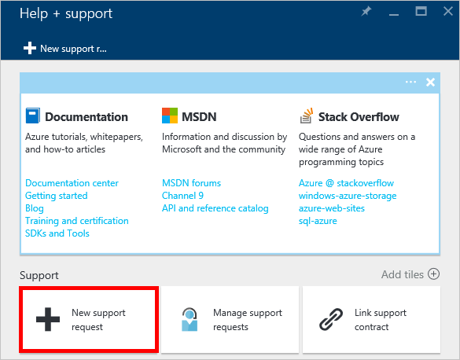
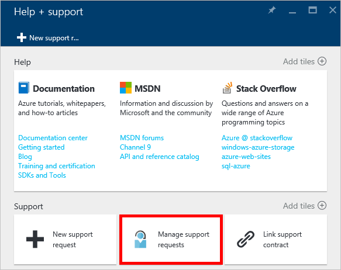

<properties
    pageTitle="要求增加 DocumentDB 帳戶配額 |Microsoft Azure"
    description="瞭解如何要求 DocumentDB 資料庫配額，例如文件儲存及處理量，每個集合調整。"
    services="documentdb"
    authors="AndrewHoh"
    manager="jhubbard"
    editor="monicar"
    documentationCenter=""/>

<tags
    ms.service="documentdb"
    ms.workload="data-services"
    ms.tgt_pltfrm="na"
    ms.devlang="na"
    ms.topic="article"
    ms.date="08/25/2016"
    ms.author="anhoh"/>

# 要求提高的 DocumentDB 帳戶限制

[Microsoft Azure DocumentDB](https://azure.microsoft.com/services/documentdb/)有預設的配額可以調整連絡 Azure 支援的一組。  本文將示範如何要求配額增加。

閱讀本文之後，您便可以回答下列問題︰  

-   可以調整 DocumentDB 資料庫配額連絡 Azure 支援？
-   我要如何要求 DocumentDB 帳戶配額調整？

##DocumentDB 帳戶配額

下表說明 DocumentDB 配額。 有星號 （*） 的配額可以調整連絡 Azure 支援︰

[AZURE.INCLUDE [azure-documentdb-limits](../../includes/azure-documentdb-limits.md)]

##要求配額調整
下列步驟說明如何要求的配額的調整。

1. 在[Azure 入口網站](https://portal.azure.com)中，按一下 [**更多服務**]，然後按一下**說明 + 支援**。

    

2. 在**說明 + 支援**刀中，按一下 [**新增支援要求**。

    

3. 在 [**新增支援要求**刀，按一下 [**基本功能**]。 接下來，設定**問題類型****配額**] 中，您的訂閱裝載您 DocumentDB**訂閱**帳戶，**配額類型** **DocumentDB**，以及**配額**支援-包含**支援計劃**。 然後，請按一下 [**下一步**]。

    

4. 在**問題**刀中，選擇 [嚴重性，**詳細資料**中包含您配額增加的相關資訊。 按一下 [**下一步**]。

    

5. 最後，填入您的**連絡資訊**刀中的連絡人資訊，然後按一下 [**建立**]。

只要支援票證建立之後，您應該會收到透過電子郵件的支援要求號碼。  您也可以按一下 [**說明 + 支援**刀中的 [**管理支援要求**檢視支援要求。

##後續步驟
- 若要進一步瞭解 DocumentDB，請按一下[這裡](http://azure.com/docdb)。
