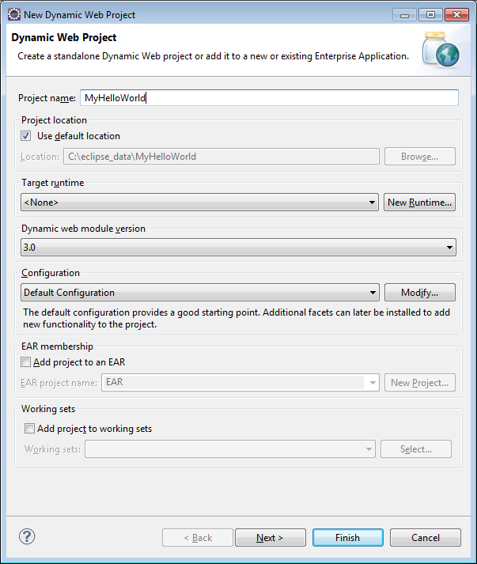

<properties
    pageTitle="Java 應用程式開發教學課程使用 DocumentDB |Microsoft Azure"
    description="本 Java web 應用程式教學課程中會顯示您如何使用 Azure DocumentDB 服務來儲存和存取裝載於 Azure 網站 Java 應用程式的資料。"
    keywords="應用程式開發、 資料庫教學課程，java 應用程式、 java web 應用程式教學課程，documentdb、 azure、 Microsoft azure"
    services="documentdb"
    documentationCenter="java"
    authors="dennyglee"
    manager="jhubbard"
    editor="mimig"/>

<tags
    ms.service="documentdb"
    ms.devlang="java"
    ms.topic="hero-article"
    ms.tgt_pltfrm="NA"
    ms.workload="data-services"
    ms.date="08/24/2016"
    ms.author="denlee"/>

# 建立使用 DocumentDB Java web 應用程式

> [AZURE.SELECTOR]
- [.NET](documentdb-dotnet-application.md)
- [Node.js](documentdb-nodejs-application.md)
- [Java](documentdb-java-application.md)
- [Python](documentdb-python-application.md)

本 Java web 應用程式教學課程中會顯示您如何使用[Microsoft Azure DocumentDB](https://portal.azure.com/#gallery/Microsoft.DocumentDB)服務來儲存和存取裝載於 Azure 網站 Java 應用程式的資料。 本主題中，您將瞭解︰

- 如何建立基本 JSP 應用程式中蝕。
- 如何使用[DocumentDB Java SDK](https://github.com/Azure/azure-documentdb-java)Azure DocumentDB 服務使用。

本教學課程中 Java 應用程式為您示範如何建立可讓您建立、 擷取，並將任務標示為完成，如下圖所示的 web 式工作管理應用程式。 每個待辦清單中的工作會儲存為 Azure DocumentDB JSON 文件。

> [AZURE.TIP] 本教學課程中的應用程式開發假設您已使用 Java 先前體驗。 如果您是新 Java 或[必要的工具](#Prerequisites)，我們建議您從 GitHub 下載完成[todo](https://github.com/Azure-Samples/documentdb-java-todo-app)專案並建立並使用[本文結尾的指示進行](#GetProject)。 一旦您沒有內建，您可以檢閱文件，以了解專案的內容中的程式碼。  

##在此 Java web 應用程式教學課程的先決條件
這個應用程式開發教學課程之前，您必須具備下列項目︰

- 使用中的 Azure 帳戶。 如果您沒有帳戶，您可以建立的免費的試用帳戶在幾分鐘。 如需詳細資訊，請參閱[Azure 免費試用版](https://azure.microsoft.com/pricing/free-trial/)。
- [Java 開發套件 (JDK 7 +)](http://www.oracle.com/technetwork/java/javase/downloads/index.html)。
- [蝕 IDE Java 卻開發人員。](http://www.eclipse.org/downloads/packages/eclipse-ide-java-ee-developers/lunasr1)
- [Java 執行階段環境 （例如 Tomcat 或 Jetty） 啟用 Azure 網站。](../app-service-web/web-sites-java-get-started.md)

如果您第一次安裝這些工具，coreservlets.com 提供安裝程序中的 [快速入門] 區段的逐步解說，其[教學課程︰ 安裝 TomCat7 和使用蝕](http://www.coreservlets.com/Apache-Tomcat-Tutorial/tomcat-7-with-eclipse.html)文章。

##步驟 1︰ 建立 DocumentDB 資料庫帳戶

現在就讓我們開始建立 DocumentDB 帳戶。 如果您已經有帳戶，您可以跳到[步驟 2︰ 建立 Java JSP 應用程式](#CreateJSP)。

[AZURE.INCLUDE [documentdb-create-dbaccount](../../includes/documentdb-create-dbaccount.md)]

[AZURE.INCLUDE [documentdb-keys](../../includes/documentdb-keys.md)]

##步驟 2︰ 建立 Java JSP 應用程式

若要建立 JSP 應用程式︰

1. 首先，我們會在開始建立 Java 專案。 啟動蝕，然後按一下 [**檔案]**，按一下 [**新增**]，然後按一下**動態 Web 專案**。 如果您沒有看到**動態 Web 專案**可用的專案的方式列出，請執行下列動作︰ 按一下 [**檔案]**按一下 [**新增**]、**專案**...、 展開**網頁**、 按一下 [**動態 Web 專案**，然後按一下**下一步**。

    

2. **目標執行階段**下拉功能表和 [**專案名稱**] 方塊中輸入專案名稱，您也可以選取 [(例如 Apache Tomcat v7.0) 的值，再按一下 [**完成]**。 選取目標 runtime 可讓您透過蝕本機執行您的專案。
3. 在蝕，在 [專案總管] 檢視中，展開專案。 以滑鼠右鍵按一下**WebContent**，按一下 [**新增**]，再按一下 [ **JSP 檔案**。
4. 在 [**新 JSP 檔案**] 對話方塊中，名稱為檔案**index.jsp**。 下圖所示，為**WebContent**，保留上層資料夾，然後按一下 [**下一步**。

    

5. **選取 JSP 範本**] 對話方塊中，此教學課程以選取**新 JSP 檔案 (html)**，，然後再按一下 [**完成]**。

6. Index.jsp 檔案開啟時蝕中，新增要顯示的文字**Hello World ！** 在現有的<body>項目。 您更新<body>內容應該看起來像下列程式碼︰

        <body>
            <% out.println("Hello World!"); %>
        </body>

8. 儲存 index.jsp 檔案。
9. 如果您在步驟 2 中設定目標執行階段，您可以按一下 [**專案**]，接著**執行**本機執行 JSP 應用程式︰

    

##步驟 3︰ 安裝 DocumentDB Java SDK ##

拉 DocumentDB Java SDK 和其相依性的最簡單的方法是透過[Apache Maven](http://maven.apache.org/)。

若要這麼做，您必須完成下列步驟，將您的專案轉換成 maven 專案︰

1. 以滑鼠右鍵按一下 [專案總管] 中的專案，按一下 [**設定**]，按一下 [**轉換成 Maven 專案**。
2. 在 [**建立新 POM** ] 視窗中，接受預設值，然後按一下 [**完成]**。
3. 在 [**專案總管]**中，開啟 pom.xml 檔案。
4. [**相依性**] 索引標籤的**相依性**窗格中，按一下 [**新增**。
4. 在 [**選取的相依性**] 視窗中，執行下列動作︰
 - 在 [**識別碼**] 方塊中，輸入 com.microsoft.azure。
 - 在 [**成品識別碼**] 方塊中輸入 azure documentdb。
 - 在 [**版本**] 方塊中輸入 1.5.1。

    

    或 XML 的相依性識別碼和 ArtifactId 直接新增至文字編輯器透過 pom.xml:

        <dependency>
            <groupId>com.microsoft.azure</groupId>
            <artifactId>azure-documentdb</artifactId>
            <version>1.5.1</version>
        </dependency>

5. 按一下**[確定]**並 Maven 會安裝 DocumentDB Java SDK。
6. 儲存 pom.xml 檔案。

##步驟 4: Java 應用程式中使用 DocumentDB 服務

1. 首先，讓我們來定義 TodoItem 物件︰

        @Data
        @Builder
        public class TodoItem {
            private String category;
            private boolean complete;
            private String id;
            private String name;
        }

    在 project 中，我們會使用[Project Lombok](http://projectlombok.org/)產生建構函式、 getter、 setter，以及建立器。 或者，您可以手動撰寫此程式碼或產生，整合開發環境。

2. 叫用 DocumentDB 服務，您必須產生新的**DocumentClient**。 一般而言，最好重複使用**DocumentClient** -，而不是建立新的用戶端，為每個後續要求。 我們可以在**DocumentClientFactory**文繞圖的用戶端，以重複使用的用戶端。 這也是您要貼上您在[步驟 1](#CreateDB)中剪貼簿儲存 URI 和主索引鍵值的位置。 取代 [您\_端點\_以下] URI 與取代 [您\_鍵\_以下] 使用您的主索引鍵。

        private static final String HOST = "[YOUR_ENDPOINT_HERE]";
        private static final String MASTER_KEY = "[YOUR_KEY_HERE]";

        private static DocumentClient documentClient;

        public static DocumentClient getDocumentClient() {
            if (documentClient == null) {
                documentClient = new DocumentClient(HOST, MASTER_KEY,
                        ConnectionPolicy.GetDefault(), ConsistencyLevel.Session);
            }

            return documentClient;
        }

3. 現在讓我們來建立提取保存 DocumentDB 我們 ToDo 項目資料存取物件 (DAO)。

    必須知道的資料庫，若要保存集合用戶端才能儲存集合 ToDo 項目，請 （作為參照的自動連結）。 一般而言，最好快取的資料庫及集合可能的話，以避免其他來回至資料庫。

    下列程式碼說明擷取我們資料庫及集合中，如果有的話，或如果不存在，請建立一個新的方式︰

        public class DocDbDao implements TodoDao {
            // The name of our database.
            private static final String DATABASE_ID = "TodoDB";

            // The name of our collection.
            private static final String COLLECTION_ID = "TodoCollection";

            // The DocumentDB Client
            private static DocumentClient documentClient = DocumentClientFactory
                    .getDocumentClient();

            // Cache for the database object, so we don't have to query for it to
            // retrieve self links.
            private static Database databaseCache;

            // Cache for the collection object, so we don't have to query for it to
            // retrieve self links.
            private static DocumentCollection collectionCache;

            private Database getTodoDatabase() {
                if (databaseCache == null) {
                    // Get the database if it exists
                    List<Database> databaseList = documentClient
                            .queryDatabases(
                                    "SELECT * FROM root r WHERE r.id='" + DATABASE_ID
                                            + "'", null).getQueryIterable().toList();

                    if (databaseList.size() > 0) {
                        // Cache the database object so we won't have to query for it
                        // later to retrieve the selfLink.
                        databaseCache = databaseList.get(0);
                    } else {
                        // Create the database if it doesn't exist.
                        try {
                            Database databaseDefinition = new Database();
                            databaseDefinition.setId(DATABASE_ID);

                            databaseCache = documentClient.createDatabase(
                                    databaseDefinition, null).getResource();
                        } catch (DocumentClientException e) {
                            // TODO: Something has gone terribly wrong - the app wasn't
                            // able to query or create the collection.
                            // Verify your connection, endpoint, and key.
                            e.printStackTrace();
                        }
                    }
                }

                return databaseCache;
            }

            private DocumentCollection getTodoCollection() {
                if (collectionCache == null) {
                    // Get the collection if it exists.
                    List<DocumentCollection> collectionList = documentClient
                            .queryCollections(
                                    getTodoDatabase().getSelfLink(),
                                    "SELECT * FROM root r WHERE r.id='" + COLLECTION_ID
                                            + "'", null).getQueryIterable().toList();

                    if (collectionList.size() > 0) {
                        // Cache the collection object so we won't have to query for it
                        // later to retrieve the selfLink.
                        collectionCache = collectionList.get(0);
                    } else {
                        // Create the collection if it doesn't exist.
                        try {
                            DocumentCollection collectionDefinition = new DocumentCollection();
                            collectionDefinition.setId(COLLECTION_ID);

                            collectionCache = documentClient.createCollection(
                                    getTodoDatabase().getSelfLink(),
                                    collectionDefinition, null).getResource();
                        } catch (DocumentClientException e) {
                            // TODO: Something has gone terribly wrong - the app wasn't
                            // able to query or create the collection.
                            // Verify your connection, endpoint, and key.
                            e.printStackTrace();
                        }
                    }
                }

                return collectionCache;
            }
        }

4. 下一步是撰寫程式碼來保存在 TodoItems 的集合。 在此範例中，我們將使用[Gson](https://code.google.com/p/google-gson/)序列化和還原 JSON 文件序列化 TodoItem 一般舊 Java 物件 (POJOs)。 [Jackson](http://jackson.codehaus.org/)或您自己的自訂序列化，也會以序列化 POJOs 絕佳的替代方案。

        // We'll use Gson for POJO <=> JSON serialization for this example.
        private static Gson gson = new Gson();

        @Override
        public TodoItem createTodoItem(TodoItem todoItem) {
            // Serialize the TodoItem as a JSON Document.
            Document todoItemDocument = new Document(gson.toJson(todoItem));

            // Annotate the document as a TodoItem for retrieval (so that we can
            // store multiple entity types in the collection).
            todoItemDocument.set("entityType", "todoItem");

            try {
                // Persist the document using the DocumentClient.
                todoItemDocument = documentClient.createDocument(
                        getTodoCollection().getSelfLink(), todoItemDocument, null,
                        false).getResource();
            } catch (DocumentClientException e) {
                e.printStackTrace();
                return null;
            }

            return gson.fromJson(todoItemDocument.toString(), TodoItem.class);
        }

5. 也參照 DocumentDB 資料庫及集合，例如文件的自動連結。 下列協助函數可讓我們擷取文件的其他屬性 （例如 「 識別碼 」），而不是自動連結︰

        private Document getDocumentById(String id) {
            // Retrieve the document using the DocumentClient.
            List<Document> documentList = documentClient
                    .queryDocuments(getTodoCollection().getSelfLink(),
                            "SELECT * FROM root r WHERE r.id='" + id + "'", null)
                    .getQueryIterable().toList();

            if (documentList.size() > 0) {
                return documentList.get(0);
            } else {
                return null;
            }
        }

6. 我們可用來協助程式方法在步驟 5 中擷取 TodoItem JSON 文件識別碼，然後將它還原序列化 POJO 至︰

        @Override
        public TodoItem readTodoItem(String id) {
            // Retrieve the document by id using our helper method.
            Document todoItemDocument = getDocumentById(id);

            if (todoItemDocument != null) {
                // De-serialize the document in to a TodoItem.
                return gson.fromJson(todoItemDocument.toString(), TodoItem.class);
            } else {
                return null;
            }
        }

7. 我們也可以使用 DocumentClient 取得集合或使用 DocumentDB SQL TodoItems 的清單︰

        @Override
        public List<TodoItem> readTodoItems() {
            List<TodoItem> todoItems = new ArrayList<TodoItem>();

            // Retrieve the TodoItem documents
            List<Document> documentList = documentClient
                    .queryDocuments(getTodoCollection().getSelfLink(),
                            "SELECT * FROM root r WHERE r.entityType = 'todoItem'",
                            null).getQueryIterable().toList();

            // De-serialize the documents in to TodoItems.
            for (Document todoItemDocument : documentList) {
                todoItems.add(gson.fromJson(todoItemDocument.toString(),
                        TodoItem.class));
            }

            return todoItems;
        }

8. 有多種方式 DocumentClient 更新文件。 我們 Todo 清單應用程式中，我們希望能夠切換是否 TodoItem 已完成。 這可以透過更新文件內的 「 完成 」 的屬性︰

        @Override
        public TodoItem updateTodoItem(String id, boolean isComplete) {
            // Retrieve the document from the database
            Document todoItemDocument = getDocumentById(id);

            // You can update the document as a JSON document directly.
            // For more complex operations - you could de-serialize the document in
            // to a POJO, update the POJO, and then re-serialize the POJO back in to
            // a document.
            todoItemDocument.set("complete", isComplete);

            try {
                // Persist/replace the updated document.
                todoItemDocument = documentClient.replaceDocument(todoItemDocument,
                        null).getResource();
            } catch (DocumentClientException e) {
                e.printStackTrace();
                return null;
            }

            return gson.fromJson(todoItemDocument.toString(), TodoItem.class);
        }

9. 最後，我們希望從我們的清單中刪除 TodoItem 的能力。 若要這麼做，我們可以使用我們將擷取自動連結，然後即 [用戶端，將其刪除較舊版本寫協助程式方法︰

        @Override
        public boolean deleteTodoItem(String id) {
            // DocumentDB refers to documents by self link rather than id.

            // Query for the document to retrieve the self link.
            Document todoItemDocument = getDocumentById(id);

            try {
                // Delete the document by self link.
                documentClient.deleteDocument(todoItemDocument.getSelfLink(), null);
            } catch (DocumentClientException e) {
                e.printStackTrace();
                return false;
            }

            return true;
        }

##步驟 5︰ 繫結的其餘部分的 Java 應用程式開發專案分成一組

現在，我們已完成的樂趣位-所有的左建立快速使用者介面，然後再連結至我們 DAO。

1. 首先，我們先從開始建立撥打我們 DAO 控制器︰

        public class TodoItemController {
            public static TodoItemController getInstance() {
                if (todoItemController == null) {
                    todoItemController = new TodoItemController(TodoDaoFactory.getDao());
                }
                return todoItemController;
            }

            private static TodoItemController todoItemController;

            private final TodoDao todoDao;

            TodoItemController(TodoDao todoDao) {
                this.todoDao = todoDao;
            }

            public TodoItem createTodoItem(@NonNull String name,
                    @NonNull String category, boolean isComplete) {
                TodoItem todoItem = TodoItem.builder().name(name).category(category)
                        .complete(isComplete).build();
                return todoDao.createTodoItem(todoItem);
            }

            public boolean deleteTodoItem(@NonNull String id) {
                return todoDao.deleteTodoItem(id);
            }

            public TodoItem getTodoItemById(@NonNull String id) {
                return todoDao.readTodoItem(id);
            }

            public List<TodoItem> getTodoItems() {
                return todoDao.readTodoItems();
            }

            public TodoItem updateTodoItem(@NonNull String id, boolean isComplete) {
                return todoDao.updateTodoItem(id, isComplete);
            }
        }

    更複雜的應用程式中，控制器可能放置 DAO 上方的複雜的商務邏輯。

2. 接下來，我們會建立 HTTP 要求路由至控制器 servlet:

        public class TodoServlet extends HttpServlet {
            // API Keys
            public static final String API_METHOD = "method";

            // API Methods
            public static final String CREATE_TODO_ITEM = "createTodoItem";
            public static final String GET_TODO_ITEMS = "getTodoItems";
            public static final String UPDATE_TODO_ITEM = "updateTodoItem";

            // API Parameters
            public static final String TODO_ITEM_ID = "todoItemId";
            public static final String TODO_ITEM_NAME = "todoItemName";
            public static final String TODO_ITEM_CATEGORY = "todoItemCategory";
            public static final String TODO_ITEM_COMPLETE = "todoItemComplete";

            public static final String MESSAGE_ERROR_INVALID_METHOD = "{'error': 'Invalid method'}";

            private static final long serialVersionUID = 1L;
            private static final Gson gson = new Gson();

            @Override
            protected void doGet(HttpServletRequest request,
                    HttpServletResponse response) throws ServletException, IOException {

                String apiResponse = MESSAGE_ERROR_INVALID_METHOD;

                TodoItemController todoItemController = TodoItemController
                        .getInstance();

                String id = request.getParameter(TODO_ITEM_ID);
                String name = request.getParameter(TODO_ITEM_NAME);
                String category = request.getParameter(TODO_ITEM_CATEGORY);
                boolean isComplete = StringUtils.equalsIgnoreCase("true",
                        request.getParameter(TODO_ITEM_COMPLETE)) ? true : false;

                switch (request.getParameter(API_METHOD)) {
                case CREATE_TODO_ITEM:
                    apiResponse = gson.toJson(todoItemController.createTodoItem(name,
                            category, isComplete));
                    break;
                case GET_TODO_ITEMS:
                    apiResponse = gson.toJson(todoItemController.getTodoItems());
                    break;
                case UPDATE_TODO_ITEM:
                    apiResponse = gson.toJson(todoItemController.updateTodoItem(id,
                            isComplete));
                    break;
                default:
                    break;
                }

                response.getWriter().println(apiResponse);
            }

            @Override
            protected void doPost(HttpServletRequest request,
                    HttpServletResponse response) throws ServletException, IOException {
                doGet(request, response);
            }
        }

3. 我們需要 Web 使用者介面，以顯示給使用者。 讓我們來重新撰寫 index.jsp 我們先前所建立︰

        <html>
        <head>
          <meta http-equiv="Content-Type" content="text/html; charset=ISO-8859-1">
          <meta http-equiv="X-UA-Compatible" content="IE=edge;" />
          <title>Azure DocumentDB Java Sample</title>

          <!-- Bootstrap -->
          <link href="//ajax.aspnetcdn.com/ajax/bootstrap/3.2.0/css/bootstrap.min.css" rel="stylesheet">

          
        </head>
        <body>
          <!-- Nav Bar -->
          

            

              

                <a class="navbar-brand" href="#">My Tasks</a>
              

            

          

          <!-- Body -->
          

            <h1>My ToDo List</h1>

            

            <!-- The ToDo List -->
            

              <table class="table table-bordered table-striped" id="todoItems">
                <thead>
                  <tr>
                    <th>Name</th>
                    <th>Category</th>
                    <th>Complete</th>
                  </tr>
                </thead>
                <tbody>
                </tbody>
              </table>

              <!-- Update Button -->
              

                <form class="form-horizontal" role="form">
                  <button type="button" class="btn btn-primary">Update Tasks</button>
                </form>
              

            

            

            <!-- Item Input Form -->
            

              <form class="form-horizontal" role="form">
                

                  <label for="inputItemName" class="col-sm-2">Task Name</label>
                  

                    <input type="text" class="form-control" id="inputItemName" placeholder="Enter name">
                  

                

                

                  <label for="inputItemCategory" class="col-sm-2">Task Category</label>
                  

                    <input type="text" class="form-control" id="inputItemCategory" placeholder="Enter category">
                  

                

                <button type="button" class="btn btn-primary">Add Task</button>
              </form>
            

          

          <!-- Placed at the end of the document so the pages load faster -->
          
          
          
        </body>
        </html>

4. 和最後，寫入到結合 web 使用者介面與 servlet 一些用戶端 Javascript:

        var todoApp = {
          /*
           * API methods to call Java backend.
           */
          apiEndpoint: "api",

          createTodoItem: function(name, category, isComplete) {
            $.post(todoApp.apiEndpoint, {
                "method": "createTodoItem",
                "todoItemName": name,
                "todoItemCategory": category,
                "todoItemComplete": isComplete
              },
              function(data) {
                var todoItem = data;
                todoApp.addTodoItemToTable(todoItem.id, todoItem.name, todoItem.category, todoItem.complete);
              },
              "json");
          },

          getTodoItems: function() {
            $.post(todoApp.apiEndpoint, {
                "method": "getTodoItems"
              },
              function(data) {
                var todoItemArr = data;
                $.each(todoItemArr, function(index, value) {
                  todoApp.addTodoItemToTable(value.id, value.name, value.category, value.complete);
                });
              },
              "json");
          },

          updateTodoItem: function(id, isComplete) {
            $.post(todoApp.apiEndpoint, {
                "method": "updateTodoItem",
                "todoItemId": id,
                "todoItemComplete": isComplete
              },
              function(data) {},
              "json");
          },

          /*
           * UI Methods
           */
          addTodoItemToTable: function(id, name, category, isComplete) {
            var rowColor = isComplete ? "active" : "warning";

            todoApp.ui_table().append($("<tr>")
              .append($("<td>").text(name))
              .append($("<td>").text(category))
              .append($("<td>")
                .append($("<input>")
                  .attr("type", "checkbox")
                  .attr("id", id)
                  .attr("checked", isComplete)
                  .attr("class", "isComplete")
                ))
              .addClass(rowColor)
            );
          },

          /*
           * UI Bindings
           */
          bindCreateButton: function() {
            todoApp.ui_createButton().click(function() {
              todoApp.createTodoItem(todoApp.ui_createNameInput().val(), todoApp.ui_createCategoryInput().val(), false);
              todoApp.ui_createNameInput().val("");
              todoApp.ui_createCategoryInput().val("");
            });
          },

          bindUpdateButton: function() {
            todoApp.ui_updateButton().click(function() {
              // Disable button temporarily.
              var myButton = $(this);
              var originalText = myButton.text();
              $(this).text("Updating...");
              $(this).prop("disabled", true);

              // Call api to update todo items.
              $.each(todoApp.ui_updateId(), function(index, value) {
                todoApp.updateTodoItem(value.name, value.value);
                $(value).remove();
              });

              // Re-enable button.
              setTimeout(function() {
                myButton.prop("disabled", false);
                myButton.text(originalText);
              }, 500);
            });
          },

          bindUpdateCheckboxes: function() {
            todoApp.ui_table().on("click", ".isComplete", function(event) {
              var checkboxElement = $(event.currentTarget);
              var rowElement = $(event.currentTarget).parents('tr');
              var id = checkboxElement.attr('id');
              var isComplete = checkboxElement.is(':checked');

              // Toggle table row color
              if (isComplete) {
                rowElement.addClass("active");
                rowElement.removeClass("warning");
              } else {
                rowElement.removeClass("active");
                rowElement.addClass("warning");
              }

              // Update hidden inputs for update panel.
              todoApp.ui_updateForm().children("input[name='" + id + "']").remove();

              todoApp.ui_updateForm().append($("<input>")
                .attr("type", "hidden")
                .attr("class", "updateComplete")
                .attr("name", id)
                .attr("value", isComplete));

            });
          },

          /*
           * UI Elements
           */
          ui_createNameInput: function() {
            return $(".todoForm #inputItemName");
          },

          ui_createCategoryInput: function() {
            return $(".todoForm #inputItemCategory");
          },

          ui_createButton: function() {
            return $(".todoForm button");
          },

          ui_table: function() {
            return $(".todoList table tbody");
          },

          ui_updateButton: function() {
            return $(".todoUpdatePanel button");
          },

          ui_updateForm: function() {
            return $(".todoUpdatePanel form");
          },

          ui_updateId: function() {
            return $(".todoUpdatePanel .updateComplete");
          },

          /*
           * Install the TodoApp
           */
          install: function() {
            todoApp.bindCreateButton();
            todoApp.bindUpdateButton();
            todoApp.bindUpdateCheckboxes();

            todoApp.getTodoItems();
          }
        };

        $(document).ready(function() {
          todoApp.install();
        });

5. 極了 ！ 現在剩下的可以測試應用程式。 本機，執行應用程式，然後填寫 [項目名稱] 和 [類別，然後按一下 [**新增工作**新增某些 Todo 項目。

6. 當項目出現時，您可以更新無論您是切換] 核取方塊，按一下 [**更新工作**完成。

##步驟 6︰ 部署 Azure 網站 Java 應用程式

Azure 網站可讓您部署 Java 應用程式只要匯出您的應用程式為馬檔案，然後 [上傳透過來源控制項 （例如給） 或 FTP。

1. 若要為一個匯出您的應用程式，以滑鼠右鍵按一下您的專案，在 [**專案總管]**中，按一下 [**匯出**]，然後按一下**馬檔案**。
2. 在 [**匯出馬**] 視窗中，執行下列動作︰
 - 在 [Web 專案] 方塊中，輸入 azure documentdb-java 範例。
 - 在 [目標] 方塊中，選擇儲存馬檔案的目的地。
 - 按一下 [**完成**]。

3. 您已經有馬檔案手中，您可以直接上傳至您的 Azure 網站**webapps**目錄。 上傳檔案的指示，請參閱[新增 Azure 您 Java 網站應用程式](../app-service-web/web-sites-java-add-app.md)。

    馬檔案上傳至 webapps 目錄後執行階段環境會偵測到您已新增，並會自動載入。
4. 若要檢視您已完成的產品，瀏覽至 http://YOUR\_網站\_NAME.azurewebsites.net/azure-documentdb-java-sample/ 並新增您的任務的開始 ！

##從 GitHub 取得專案

在此教學課程中的所有範例會都包含在 GitHub [todo](https://github.com/Azure-Samples/documentdb-java-todo-app)專案中。 若要匯入蝕 todo 專案，請確認您擁有的軟體和[先決條件](#Prerequisites)一節中所列的資源，然後執行下列動作︰

1. 安裝[Project Lombok](http://projectlombok.org/)。 Lombok 用來產生建構函式、 getter setter 專案中。 在您下載 lombok.jar 檔案後，按兩下，以將其安裝，或從命令列進行安裝。
2. 如果蝕已開啟，將其關閉並重新啟動載入 Lombok。
3. 蝕，在 [**檔案**] 功能表中，按一下 [**匯入**。
4. 在 [**匯入**] 視窗中，按一下**就可以給****給從專案**]，然後按一下然後按 [**下一步**。
5. 在 [**選取存放庫來源**] 畫面中，按一下 [**複製 URI**]。
6. 在 [**來源給存放庫**] 畫面中**URI** ] 方塊中，輸入 https://github.com/Azure-Samples/documentdb-java-todo-app.git，，然後再按 [**下一步**]。
7. 在**分支選取**畫面上，確定已選取，然後再按 [**下一步**的**主版**。
8. 在 [**本機的目的地**] 畫面中，按一下 [**瀏覽**至選取的資料夾位置存放庫可以複製，，然後按一下 [**下一步**。
9. 在 [**選取要用於匯入專案] 精靈**] 畫面中，確定已選取，然後再按 [**下一步**，**匯入現有的專案**。
10. 在 [**匯入專案**] 畫面中，取消選取**DocumentDB**專案，，然後按一下 [**完成]**。 DocumentDB 專案包含 DocumentDB Java SDK，我們會改為新增為相依性。
11. 在 [**專案總管]**中，瀏覽至 azure-documentdb-java-sample\src\com.microsoft.azure.documentdb.sample.dao\DocumentClientFactory.java 和 [主機] 和 [MASTER_KEY 值取代 URI 和 DocumentDB 帳戶的主索引鍵，然後儲存檔案。 如需詳細資訊，請參閱[步驟 1。建立 DocumentDB 資料庫帳戶](#CreateDB)。
12. 在 [**專案總管]**中，以滑鼠右鍵按一下**azure documentdb-java 範例**，按一下 [**建立路徑**]，然後按一下**設定建立路徑**。
13. 在 [ **Java 建立路徑**] 畫面的右窗格中，選取 [**文件庫**] 索引標籤，然後按一下**新增外部罐和**。 瀏覽至 lombok.jar 檔案的位置，按一下 [**開啟**]，然後按一下**[確定]**。
14. 使用步驟 12 再次開啟 [**屬性**] 視窗，然後按一下 [在左窗格中的 [**目標執行階段**。
15. 在**目標執行階段**畫面上，按一下 [**新增**]，選取**Apache Tomcat v7.0**，，然後按一下**[確定]**。
16. 使用步驟 12 再次開啟 [**屬性**] 視窗，然後按一下 [在左窗格中的 [**專案 Facet**。
17. 在**專案 Facet**畫面上，選取**動態 Web 模組**和**Java**，，然後按一下**[確定]**。
18. 在畫面底部的 [**伺服器**] 索引標籤，以滑鼠右鍵按一下**Tomcat v7.0 在本機的伺服器**，然後按一下**新增和移除**。
19. 在 [**新增與移除**] 視窗中，將**azure documentdb-java 範例**移到 [**已設定**] 方塊，然後按一下**完成**。
20. 在 [**伺服器**] 索引標籤中**Tomcat v7.0 在本機的伺服器**，以滑鼠右鍵按一下，然後再按一下 [**重新啟動**。
21. 在瀏覽器中，瀏覽到 http://localhost:8080/azure documentdb-java-樣本 / 並開始新增至您的工作清單。 請注意，如果您有變更您的預設連接埠值，變更 8080 您選取的值。
22. 若要將專案部署至 Azure 的網站，請參閱[步驟 6。應用程式部署至 Azure 網站](#Deploy)。

[1]: media/documentdb-java-application/keys.png
