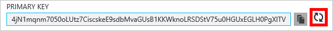

<properties
    pageTitle="管理透過 Azure 入口網站 DocumentDB 帳戶 |Microsoft Azure"
    description="瞭解如何管理 DocumentDB 帳戶透過 Azure 入口網站。 尋找使用 Azure 入口網站檢視、 複製、 刪除及存取帳戶的指南。"
    keywords="Azure 入口網站，documentdb azure、 Microsoft azure"
    services="documentdb"
    documentationCenter=""
    authors="kirillg"
    manager="jhubbard"
    editor="cgronlun"/>

<tags
    ms.service="documentdb"
    ms.workload="data-services"
    ms.tgt_pltfrm="na"
    ms.devlang="na"
    ms.topic="article"
    ms.date="10/14/2016"
    ms.author="kirillg"/>

# 如何管理 DocumentDB 帳戶

瞭解如何設定全域的一致性、 使用鍵，並刪除 DocumentDB 帳戶 Azure 入口網站中。

## 管理 DocumentDB 一致性設定

選取正確的一致性層級，取決於您的應用程式的語意。 您應該瞭解可用的一致性中的階層數 DocumentDB 閱讀[使用一致性層級最大化可用性和效能 DocumentDB] [consistency]。 DocumentDB 提供一致性、 可用性和效能保證，每個您的資料庫帳戶提供的一致性層級。 設定強式的一致性層級的資料庫帳戶需要您的資料是單一 Azure 區域局部和全域可用。 另一方面，寬鬆的一致性層級的限制的過時、 階段或最終啟用您與您的資料庫帳戶建立關聯的 Azure 區域的任何數字。 下列簡單的步驟會顯示如何選取您的資料庫帳戶的預設一致性層級。 

### 若要指定預設一致性 DocumentDB 帳戶

1. 在[Azure 入口網站](https://portal.azure.com/)中，存取您的 DocumentDB 帳戶。
2. 在 [帳戶刀中，按一下 [**預設的一致性**]。
3. 在**預設一致性**刀中，選取新的一致性層級，按一下 [**儲存**]。
    ![預設的一致性工作階段][5]

## 檢視、 複製與重新產生便捷鍵
當您建立 DocumentDB 帳戶時，服務就會產生存取 DocumentDB 帳戶時，才可用於驗證的兩個主要的便捷鍵。 提供兩個便捷鍵，DocumentDB 可讓您重新產生金鑰 DocumentDB 帳戶不中斷。 

[Azure 入口網站](https://portal.azure.com/)中，從 [資源] 功能表上檢視、 複製及重新產生便捷鍵，用來存取您的 DocumentDB 帳戶**DocumentDB 帳戶**刀 access**鍵**刀。

> [AZURE.NOTE] **索引鍵**刀也包含可從[資料移轉工具](documentdb-import-data.md)連線到您的帳戶的主要和次要連線字串。

唯讀金鑰，也會提供此刀。 讀取和查詢是唯讀作業時建立，刪除，並不會取代。

### 複製 Azure 入口網站中的便捷鍵

按一下 [**索引鍵**防禦，以您想要複製的金鑰右側的 [**複製**] 按鈕。

### 重新產生便捷鍵

您應該會定期以協助保護您的連線更安全 DocumentDB 帳戶變更便捷鍵。 兩個 access 的快速鍵，讓您將維持使用一個便捷鍵，當您重新產生其他便捷鍵 DocumentDB 帳戶的連線。

> [AZURE.WARNING] 重新產生您便捷鍵會影響任何應用程式，取決於目前的金鑰。 使用便捷鍵存取 DocumentDB 帳戶的所有用戶端必須更新以使用新的金鑰。

如果您有應用程式或使用 DocumentDB 帳戶的雲端服務，就會失去連線如果您重新產生金鑰，除非您回復索引鍵。 下列步驟建立大綱參與循環索引鍵的程序。

1. 更新您要參照的 DocumentDB 帳戶的次要便捷鍵的應用程式碼中的便捷鍵。
2. 重新產生 DocumentDB 帳戶的主要便捷鍵。 在[Azure 入口網站](https://portal.azure.com/)中，存取您 DocumentDB 的帳戶。
3. 在**DocumentDB 帳戶**刀中，按一下 [**索引鍵**]。
4. 在**鍵**刀中，按一下 [重新產生] 按鈕，然後按一下**[確定]**以確認您想要產生新的金鑰。
    

5. 一旦您已驗證的新索引鍵是可供使用 （約 5 分鐘後重新產生），更新您要參照的新的主要便捷鍵的應用程式碼中的便捷鍵。
6. 重新產生次要便捷鍵。

    

> [AZURE.NOTE] 可能需要幾分鐘，才能新產生的金鑰可以用來存取您的 DocumentDB 帳戶。

## 取得連線字串

若要擷取連接字串，執行下列動作︰ 

1. 在[Azure 入口網站](https://portal.azure.com)中，存取您 DocumentDB 的帳戶。
2. 在 [資源] 功能表中，按一下 [**索引鍵**。
3. 按一下 [**主要的連接字串**或**次要連線字串**] 方塊旁的 [**複製**] 按鈕。 

如果您使用的[DocumentDB 資料庫移轉工具](documentdb-import-data.md)中的連接字串，附加資料庫名稱的連接字串的結尾。 `AccountEndpoint=< >;AccountKey=< >;Database=< >`.

## 刪除 DocumentDB 帳戶
若要移除您不再使用的 Azure 入口網站 DocumentDB 帳戶，請使用 [**刪除的帳戶**] 命令上**DocumentDB 帳戶**刀。

1. 在[Azure 入口網站](https://portal.azure.com/)中，存取您想要刪除的 DocumentDB 帳戶。
2. 在**DocumentDB 帳戶**刀中，按一下 [**更多**]，然後按一下 [**刪除的帳戶**。 或者，以滑鼠右鍵按一下資料庫的名稱，然後按一下 [**刪除的帳戶**。
3. 在產生的確認刀中，輸入 DocumentDB 帳戶名稱，以確認您要刪除的帳戶。
4. 按一下 [**刪除**] 按鈕。

## 後續步驟

瞭解如何[開始使用您 DocumentDB 的帳戶](http://go.microsoft.com/fwlink/p/?LinkId=402364)。

若要進一步瞭解 DocumentDB，請參閱 Azure DocumentDB 文件上[azure.com](http://go.microsoft.com/fwlink/?LinkID=402319&clcid=0x409)。

<!--Image references-->
[1]: ./media/documentdb-manage-account/documentdb_add_region-1.png
[2]: ./media/documentdb-manage-account/documentdb_add_region-2.png
[3]: ./media/documentdb-manage-account/documentdb_change_write_region-1.png
[4]: ./media/documentdb-manage-account/documentdb_change_write_region-2.png
[5]: ./media/documentdb-manage-account/documentdb_change_consistency-1.png
[6]: ./media/documentdb-manage-account/chooseandsaveconsistency.png

<!--Reference style links - using these makes the source content way more readable than using inline links-->
[bcdr]: https://azure.microsoft.com/documentation/articles/best-practices-availability-paired-regions/
[consistency]: https://azure.microsoft.com/documentation/articles/documentdb-consistency-levels/
[azureregions]: https://azure.microsoft.com/en-us/regions/#services
[offers]: https://azure.microsoft.com/en-us/pricing/details/documentdb/
