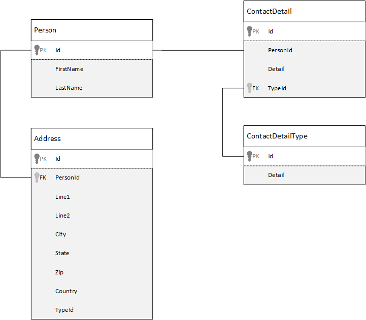

<properties 
    pageTitle="模型中 Azure DocumentDB 資料 |Microsoft Azure" 
    description="深入了解 DocumentDB，NoSQL 文件資料庫的模型資料。" 
    keywords="資料模型"
    services="documentdb" 
    authors="kiratp" 
    manager="jhubbard" 
    editor="mimig1" 
    documentationCenter=""/>

<tags 
    ms.service="documentdb" 
    ms.workload="data-services" 
    ms.tgt_pltfrm="na" 
    ms.devlang="na" 
    ms.topic="article" 
    ms.date="08/05/2016" 
    ms.author="kipandya"/>

#模型 DocumentDB 中的資料#
結構描述空閒的資料庫，例如 Azure DocumentDB，使其時把容易運用您的資料模型變更您應該仍花一些時間思考您資料的相關資訊。 

為資料要如何儲存？ 如何為您的應用程式要擷取及查詢的資料？ 是您的應用程式，請閱讀大量或寫入經常嗎？ 

閱讀本文之後，您將可以回答下列問題︰

- 如何應該考量文件中的文件資料庫？
- 什麼是資料模型，為什麼應該注意？ 
- 何關聯式資料庫至不同的文件資料庫的模型資料？
- 我要如何 express 非關聯式資料庫中的資料關聯？
- 當內嵌資料，以及當我執行連結至資料？

##內嵌的資料##
當您開始建立文件存放區中的資料模型時 DocumentDB，例如嘗試實體視為**獨立的文件**中 JSON 表示。

我們深入瞭解之前太更進一步，讓我們拿幾個步驟，看看如何我們可能模型關聯式資料庫，大多數的已熟悉主旨中的項目。 下列範例會示範如何人員可能會儲存在關聯式資料庫。 

使用關聯式資料庫工作時，我們已教導年標準化、 標準化、 標準化。

通常標準化您的資料，包括實體，例如人員，並將其向下以獨立筆資料。 在上述範例中，人員可以有多個連絡人的詳細資料記錄，以及您在多個地址的記錄。 我們甚至繼續下一步，劃分連絡人詳細資料，進一步擷取常見欄位等類型。 相同的地址，每一筆記錄具有類似*家用版*或*企業版*的類型 

引導部署至每一筆記錄的 [**避免儲存重複的資料**正常化資料時，而是參考資料。 在此範例中，閱讀人員，所有的連絡人詳細資料和地址，您需要使用連接至有效地在執行階段彙總資料。

    SELECT p.FirstName, p.LastName, a.City, cd.Detail
    FROM Person p
    JOIN ContactDetail cd ON cd.PersonId = p.Id
    JOIN ContactDetailType on cdt ON cdt.Id = cd.TypeId
    JOIN Address a ON a.PersonId = p.Id

更新個人連絡人的詳細資料與地址過多的個別表格需要寫入作業。 

現在讓我們來看看如何我們想模型與獨立的實體文件資料庫中相同的資料。
        
    {
        "id": "1",
        "firstName": "Thomas",
        "lastName": "Andersen",
        "addresses": [
            {            
                "line1": "100 Some Street",
                "line2": "Unit 1",
                "city": "Seattle",
                "state": "WA",
                "zip": 98012
            }
        ],
        "contactDetails": [
            {"email: "thomas@andersen.com"},
            {"phone": "+1 555 555-5555", "extension": 5555}
        ] 
    }

使用上述方法現在**正規化**人員錄製的位置，還有我們**內嵌**與相關此人員，其連絡人詳細資料和地址，例如在單一 JSON 文件的所有資訊。
此外，因為我們不受限於固定的結構描述我們會有執行項目，例如完全有連絡人的詳細資料的不同圖案的彈性。 

從資料庫中擷取完整的人員記錄現在單一讀取作業針對單一集合以及一份文件。 更新連絡人詳細資料與地址的人員記錄，也會針對單一文件的單一作業。

以取消正規化資料，您的應用程式可能需要議題較少的查詢和更新完成共同作業。 

###內嵌的時機

一般而言，使用內嵌的資料模型的時機︰

- 實體之間有**包含**關聯性。
- 實體之間有**一到幾個**關聯性。
- 有內嵌的資料**不常變更**。
- 那里內嵌的資料不會放大**不繫結**。
- 有**整數**文件中的資料的內嵌的資料。

> [AZURE.NOTE] 通常不正常的資料模型提供更佳的**讀取**效能。

###不要將內嵌的時機

若要取消正規化所有項目和內嵌至單一文件中的所有資料文件資料庫中的基本原則時，這可能會導致應避免使用某些情況下。

需要此 JSON 程式碼片段。

    {
        "id": "1",
        "name": "What's new in the coolest Cloud",
        "summary": "A blog post by someone real famous",
        "comments": [
            {"id": 1, "author": "anon", "comment": "something useful, I'm sure"},
            {"id": 2, "author": "bob", "comment": "wisdom from the interwebs"},
            …
            {"id": 100001, "author": "jane", "comment": "and on we go ..."},
            …
            {"id": 1000000001, "author": "angry", "comment": "blah angry blah angry"},
            …
            {"id": ∞ + 1, "author": "bored", "comment": "oh man, will this ever end?"},
        ]
    }

這可能是內嵌的註解的文章實體外觀如果我們已模型一般部落格或 CMS，系統。 此範例中的問題是註解陣列**未繫結**，也就是說，有沒有 （實際） 限制註解，可以有任何單一的文章數目。 為文件的大小可能會變大，這會成為問題。

> [AZURE.TIP] 在 DocumentDB 中的文件有大小上限。 如需此參照[DocumentDB 限制](documentdb-limits.md)。

當文件的大小規模擴大時的功能傳送資料的連線，以及讀取和更新文件中的，在 [縮放]，將受影響。

在此情況下會以請考慮下列模型。
        
    Post document:
    {
        "id": "1",
        "name": "What's new in the coolest Cloud",
        "summary": "A blog post by someone real famous",
        "recentComments": [
            {"id": 1, "author": "anon", "comment": "something useful, I'm sure"},
            {"id": 2, "author": "bob", "comment": "wisdom from the interwebs"},
            {"id": 3, "author": "jane", "comment": "....."}
        ]
    }

    Comment documents:
    {
        "postId": "1"
        "comments": [
            {"id": 4, "author": "anon", "comment": "more goodness"},
            {"id": 5, "author": "bob", "comment": "tails from the field"},
            ...
            {"id": 99, "author": "angry", "comment": "blah angry blah angry"}
        ]
    },
    {
        "postId": "1"
        "comments": [
            {"id": 100, "author": "anon", "comment": "yet more"},
            ...
            {"id": 199, "author": "bored", "comment": "will this ever end?"}
        ]
    }

此模型具有最新的三個註解的文章上，此為陣列具有固定內嵌繫結這次。 其他註解中群組到 100 的註解的批次，而且儲存在另一個文件。 因為我們虛構的應用程式可讓使用者一次載入 100 的註解會被選為 100 批次的大小。  

內嵌的資料是不建議您先的另一種情況，通常用過的文件內嵌的資料，並會經常變更。 

需要此 JSON 程式碼片段。

    {
        "id": "1",
        "firstName": "Thomas",
        "lastName": "Andersen",
        "holdings": [
            {
                "numberHeld": 100,
                "stock": { "symbol": "zaza", "open": 1, "high": 2, "low": 0.5 }
            },
            {
                "numberHeld": 50,
                "stock": { "symbol": "xcxc", "open": 89, "high": 93.24, "low": 88.87 }
            }
        ]
    }

這可能表示人員股票產品組合。 我們已選擇內嵌至每個產品組合文件中的內建資訊。 在環境中相關的資料經常變更，例如股票交易應用程式、 內嵌經常變更的資料會意義，您會持續更新每個產品組合文件每次股票債券傳送。

股票*zaza*物品種中某一天的時間和數以千計的使用者可能造成公事包*zaza* 。 例如就必須多次更新的產品組合文件的多個千分位以上的資料模型而產生系統每天的不會不按比例縮放很好。 

##參照的資料##

因此，內嵌資料精美適合許多情況下，但很清楚的種情況時取消正規化資料會導致值得更多的問題。 因此我們現在該做什麼？ 

關聯式資料庫不是唯一的地方，您可以在其中建立項目之間的關聯。 文件資料庫中可以有一份文件的實際其他文件中的資料的相關資訊。 現在，我正在不支持甚至一分鐘我們建立系統，就會更適合關聯式資料庫中 DocumentDB，或任何其他文件的資料庫，但簡單的關聯性是正常和非常有用。 

我們之所以選擇這個先前使用從股票產品組合範例 JSON 下方，但這次我們參照，而不是內嵌公事包的內建項目。 如此一來，內建的項目變更日常常見問題的唯一的文件，需要更新時是單一股票的文件。 

    Person document:
    {
        "id": "1",
        "firstName": "Thomas",
        "lastName": "Andersen",
        "holdings": [
            { "numberHeld":  100, "stockId": 1},
            { "numberHeld":  50, "stockId": 2}
        ]
    }
    
    Stock documents:
    {
        "id": "1",
        "symbol": "zaza",
        "open": 1,
        "high": 2,
        "low": 0.5,
        "vol": 11970000,
        "mkt-cap": 42000000,
        "pe": 5.89
    },
    {
        "id": "2",
        "symbol": "xcxc",
        "open": 89,
        "high": 93.24,
        "low": 88.87,
        "vol": 2970200,
        "mkt-cap": 1005000,
        "pe": 75.82
    }
    

此方法均立即缺點透過是如果您的應用程式才能顯示會保留時顯示人員的產品組合; 每一張股票的相關資訊在此情況下，您必須對要載入的每個內建的文件資訊的資料庫的程序。 以下我們已做出決策改善寫入作業，日常經常發生這種情形，但又遭到可能會發生的特定系統效能的影響比較小讀取作業的效率。

> [AZURE.NOTE] 正規化資料模型**可以需要更多往返**至伺服器。

### 外部索引鍵呢？
因為目前沒有限制式的概念，外部索引鍵，或其他任何間的文件關聯，您必須在文件中都是有效的 「 弱式連結 」 與資料庫本身將不會檢查。 如果您想要確保文件指的實際上存在的資料，您就需要這麼做，在您的應用程式，或透過使用伺服器端引動程序或 DocumentDB 預存程序。

###若要參照的時機
一般而言，使用常態化的資料模型的時機︰

- 代表**一對多**關聯性。
- 代表**多對多**關聯性。
- 相關的資料**經常變更**。
- 可能會被參考的資料**未繫結**。

> [AZURE.NOTE] 通常正常化提供更佳的**撰寫**效能。

###放在哪裡關聯？
關聯性的成長會協助您判斷儲存參照的文件中。

如果我們看看下列模型發行者和活頁簿 JSON。

    Publisher document:
    {
        "id": "mspress",
        "name": "Microsoft Press",
        "books": [ 1, 2, 3, ..., 100, ..., 1000]
    }

    Book documents:
    {"id": "1", "name": "DocumentDB 101" }
    {"id": "2", "name": "DocumentDB for RDBMS Users" }
    {"id": "3", "name": "Taking over the world one JSON doc at a time" }
    ...
    {"id": "100", "name": "Learn about Azure DocumentDB" }
    ...
    {"id": "1000", "name": "Deep Dive in to DocumentDB" }

如果活頁簿每 publisher 數小與有限的等比級數，然後儲存 publisher 文件內的活頁簿參照可能會有幫助。 不過，如果未繫結的活頁簿每 publisher 數，此資料模型會導致可變動、 成長的陣列，如上述範例 publisher 文件所示。 

切換有些項目會造成仍代表相同的資料，但現在可避免這些大的可變動集合的模型。

    Publisher document: 
    {
        "id": "mspress",
        "name": "Microsoft Press"
    }
    
    Book documents: 
    {"id": "1","name": "DocumentDB 101", "pub-id": "mspress"}
    {"id": "2","name": "DocumentDB for RDBMS Users", "pub-id": "mspress"}
    {"id": "3","name": "Taking over the world one JSON doc at a time"}
    ...
    {"id": "100","name": "Learn about Azure DocumentDB", "pub-id": "mspress"}
    ...
    {"id": "1000","name": "Deep Dive in to DocumentDB", "pub-id": "mspress"}

在上述範例中，我們在 publisher 文件中卸除未繫結的集合。 請改為我們只需要在每個活頁簿文件上 publisher 的參考。

###如何建立多︰ 多關聯性的模型？
關聯式資料庫中*多︰ 多*關聯性通常會使用聯結資料表，只要結合在一起記錄其他資料表的建立模型。 

您可能會想要複製使用文件的相同項目，並產生看起來就像以下的資料模型。

    Author documents: 
    {"id": "a1", "name": "Thomas Andersen" }
    {"id": "a2", "name": "William Wakefield" }
    
    Book documents:
    {"id": "b1", "name": "DocumentDB 101" }
    {"id": "b2", "name": "DocumentDB for RDBMS Users" }
    {"id": "b3", "name": "Taking over the world one JSON doc at a time" }
    {"id": "b4", "name": "Learn about Azure DocumentDB" }
    {"id": "b5", "name": "Deep Dive in to DocumentDB" }
    
    Joining documents: 
    {"authorId": "a1", "bookId": "b1" }
    {"authorId": "a2", "bookId": "b1" }
    {"authorId": "a1", "bookId": "b2" }
    {"authorId": "a1", "bookId": "b3" }

這會運作。 不過，載入以其活頁簿，有一位作者或載入活頁簿的作者，永遠必須至少為兩個其他資料庫的查詢。 一個聯結的文件並擷取實際所聯結的文件的另一個查詢的查詢。 

如果所有執行這個聯結資料表結合在一起兩筆資料，然後為何不放完全？
請考慮下列項目。

    Author documents:
    {"id": "a1", "name": "Thomas Andersen", "books": ["b1, "b2", "b3"]}
    {"id": "a2", "name": "William Wakefield", "books": ["b1", "b4"]}
    
    Book documents: 
    {"id": "b1", "name": "DocumentDB 101", "authors": ["a1", "a2"]}
    {"id": "b2", "name": "DocumentDB for RDBMS Users", "authors": ["a1"]}
    {"id": "b3", "name": "Learn about Azure DocumentDB", "authors": ["a1"]}
    {"id": "b4", "name": "Deep Dive in to DocumentDB", "authors": ["a2"]}

現在，如果我有一位作者，立即知道他們所撰寫的活頁簿，並相反如果我有載入的活頁簿文件想知道 author(s) 的識別碼。 這會儲存該中間對查詢加入表格減少伺服器的編號往返您的應用程式。 

##混合式資料模型##
我們現在看起來內嵌 （或取消正規化） 和各有其 upsides 參考 （或正規化） 的資料，而且每個有折衷如前述。 

不一定是或不可以與恐怖了一些混合的項目。 

根據您的應用程式使用特定模式和負載可能位置混合內嵌的情況下和參考的資料意義，可能會找出較簡單的應用程式邏輯與較少的伺服器往返仍維持不錯的效能。

請考慮下列 JSON。 

    Author documents: 
    {
        "id": "a1",
        "firstName": "Thomas",
        "lastName": "Andersen",     
        "countOfBooks": 3,
        "books": ["b1", "b2", "b3"],
        "images": [
            {"thumbnail": "http://....png"}
            {"profile": "http://....png"}
            {"large": "http://....png"}
        ]
    },
    {
        "id": "a2",
        "firstName": "William",
        "lastName": "Wakefield",
        "countOfBooks": 1,
        "books": ["b1"],
        "images": [
            {"thumbnail": "http://....png"}
        ]
    }
    
    Book documents:
    {
        "id": "b1",
        "name": "DocumentDB 101",
        "authors": [
            {"id": "a1", "name": "Thomas Andersen", "thumbnailUrl": "http://....png"},
            {"id": "a2", "name": "William Wakefield", "thumbnailUrl": "http://....png"}
        ]
    },
    {
        "id": "b2",
        "name": "DocumentDB for RDBMS Users",
        "authors": [
            {"id": "a1", "name": "Thomas Andersen", "thumbnailUrl": "http://....png"},
        ]
    }

以下我們 （主要） 瀏覽過位置，最上層的文件中內嵌來自其他實體的資料，但參照其他資料的內嵌的模型。 

如果您查看活頁簿文件時，我們可以看到幾有趣的欄位時，我們看看的作者陣列。 這是我們回頭參考撰寫文件時，標準練習常態化的模型] 中，使用欄位的*識別碼*] 欄位，但然後我們也有*名稱*] 和 [ *thumbnailUrl*。 我們可能已剛卡*識別碼*，然後向左使用 「 連結 」，分別撰寫文件從取得其所需的任何其他資訊的應用程式但因為我們的應用程式會顯示每個活頁簿的顯示作者名稱以及縮圖圖片我們可以將儲存往返至伺服器每清單中的活頁簿取消正規化作者**一些**資料。

確定，如果變更作者的名稱或他們想要更新其相片，就可以了移更新每個活頁簿他們發行，但我們的應用程式中，然後再根據作者不經常變更其名稱的假設這是可接受的設計決策。  

在範例中，有**預先計算彙總**的值，以了解作業儲存昂貴的處理。 在範例中，部分的撰寫文件中內嵌的資料是在執行階段的計算的資料。 每次發佈新的活頁簿，活頁簿文件會建立**並**countOfBooks 欄位設為根據的活頁簿的特定作者的文件數計算值。 最佳化會建議閱讀大量系統中我們可以負擔於寫入進行計算，才能最佳化讀取。

因為 DocumentDB 支援**多重文件交易**，是由可能擁有一個模型，以預先導出欄位的能力。 多個 NoSQL 商店無法執行交易所有文件，因此小幫手設計的決策，例如 「 永遠內嵌所有項目 」，因為這項限制。 DocumentDB，您可以使用伺服器端引動程序或預存程序，插入書籍和更新 ACID 交易內的所有作者。 現在您不**具有**內嵌所有項目中一份文件，只要以確定您的資料保持一致。

##後續步驟

本文重大心得是瞭解結構描述免費的世界中的資料模型的以前為重要。 

有任何單一代表一份在螢幕上的資料，如同單一方法來建立您的資料模型。 您必須瞭解您的應用程式，以及如何將會產生，使用，並處理資料。 然後，套用部分此處所提供的指導方針，您可以設定關於建立模型的地址應用程式的需求。 當您的應用程式需要變更時，您可以利用的結構描述空閒資料庫接受漸漸輕鬆的資料模型的彈性。 

若要進一步瞭解 Azure DocumentDB，請參閱服務的[文件](https://azure.microsoft.com/documentation/services/documentdb/)頁面。 

若要瞭解在 Azure DocumentDB 微調索引，請參閱[原則](documentdb-indexing-policies.md)索引編製功能的文章。

若要瞭解如何晶怪資料跨多個磁碟分割區，請參閱[DocumentDB 中的 [分割資料](documentdb-partition-data.md)。 

然後，最後，模型資料和 sharding 多租用戶應用程式的指引，請參閱[縮放比例與 Azure DocumentDB 在多租用戶應用程式](http://blogs.msdn.com/b/documentdb/archive/2014/12/03/scaling-a-multi-tenant-application-with-azure-documentdb.aspx)。
 
