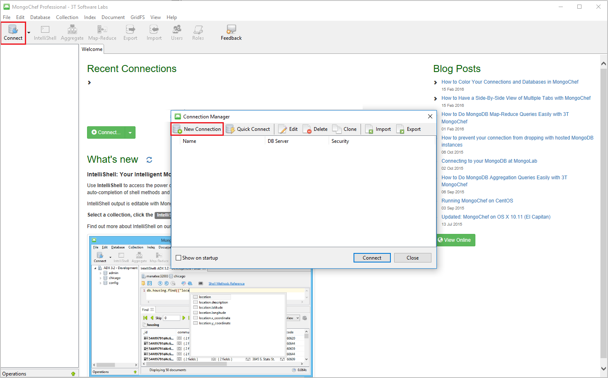

<properties 
    pageTitle="通訊協定支援 MongoDB DocumentDB 帳戶搭配使用 MongoChef |Microsoft Azure" 
    description="瞭解如何使用 MongoChef MongoDB，現在可預覽的通訊協定支援以 DocumentDB 帳戶。" 
    keywords="mongochef"
    services="documentdb" 
    authors="AndrewHoh" 
    manager="jhubbard" 
    editor="" 
    documentationCenter=""/>

<tags 
    ms.service="documentdb" 
    ms.workload="data-services" 
    ms.tgt_pltfrm="na" 
    ms.devlang="na" 
    ms.topic="article" 
    ms.date="08/25/2016" 
    ms.author="anhoh"/>

# 使用 MongoChef 與通訊協定支援 MongoDB DocumentDB 帳戶

若要連接的通訊協定支援使用 MongoChef MongoDB Azure DocumentDB 帳戶，您必須︰

- 下載並安裝[MongoChef](http://3t.io/mongochef)
- 您必須 DocumentDB MongoDB[連線字串](documentdb-connect-mongodb-account.md)資訊的通訊協定支援

## 在 MongoChef 建立連線  

若要新增您 DocumentDB 帳戶與通訊協定支援 MongoDB MongoChef 連線管理員，請執行下列步驟。

1. 擷取您使用的指示 MongoDB 連線資訊的通訊協定支援 DocumentDB[以下](documentdb-connect-mongodb-account.md)。

    

2. 按一下 [**連線**至開啟連線管理員]，然後按一下 [**新連線**

    
    
2. 在 [**新連線**] 視窗中，在 [**伺服器**] 索引標籤上輸入與通訊協定支援 MongoDB 和連接埠的 DocumentDB 帳戶 host （主機) (FQDN)。
    
    ![MongoChef 連線管理員伺服器] 索引標籤的螢幕擷取畫面](./media/documentdb-mongodb-mongochef/ConnectionManagerServerTab.png)

3. 在 [**新連線**] 視窗中，在 [**驗證**] 索引標籤上選擇驗證模式**標準換行 （MONGODB 字元或 SCARM-sha-1）** ，輸入使用者名稱和密碼。  接受預設驗證 db （系統），或提供您自己的值。

    ![MongoChef 連線管理員驗證] 索引標籤的螢幕擷取畫面](./media/documentdb-mongodb-mongochef/ConnectionManagerAuthenticationTab.png)

4. 在 [**新連線**] 視窗中，[ **SSL** ] 索引標籤上核取 [**使用 SSL 連線的通訊協定**] 核取方塊及 [**接受自我簽署的 SSL 憑證**選項] 按鈕。

    ![MongoChef 連線管理員 SSL] 索引標籤的螢幕擷取畫面](./media/documentdb-mongodb-mongochef/ConnectionManagerSSLTab.png)

5. 按一下 [**測試連線**] 按鈕，以驗證的連線資訊，請按一下**[確定**] 以返回 [新增連線] 視窗中，再按一下 [**儲存**]。

    ![[MongoChef 測試連線] 視窗的螢幕擷取畫面](./media/documentdb-mongodb-mongochef/TestConnectionResults.png)

## 使用 MongoChef 建立資料庫、 集合中，與文件  

若要建立一個資料庫、 集合，以及使用 MongoChef 的文件，請執行下列步驟。

1. 在 [**連線管理員**醒目提示連線並按一下 [**連線**]。

    

2. 以滑鼠右鍵按一下主應用程式，然後選擇 [**新增資料庫**]。  提供的資料庫名稱，然後按一下**[確定**]。
    
    ![[MongoChef 新增資料庫] 選項的螢幕擷取畫面](./media/documentdb-mongodb-mongochef/AddDatabase1.png)

3. 以滑鼠右鍵按一下資料庫，然後選擇 [**新增集合**。  提供集合的名稱，並按一下 [**建立**]。

    ![[MongoChef 新增集合] 選項的螢幕擷取畫面](./media/documentdb-mongodb-mongochef/AddCollection.png)

4. 按一下 [**集合**功能表項目，然後按一下 [**新增文件**。

    

5. 在 [新增文件] 對話方塊中，貼上下列然後再按一下 [**新增文件**。

        {
        "_id": "AndersenFamily",
        "lastName": "Andersen",
        "parents": [
            { "firstName": "Thomas" },
            { "firstName": "Mary Kay"}
        ],
        "children": [
        {
            "firstName": "Henriette Thaulow", "gender": "female", "grade": 5,
            "pets": [{ "givenName": "Fluffy" }]
        }
        ],
        "address": { "state": "WA", "county": "King", "city": "seattle" },
        "isRegistered": true
        }

    
6. 新增另一個文件中，這次下列內容。

        {
        "_id": "WakefieldFamily",
        "parents": [
            { "familyName": "Wakefield", "givenName": "Robin" },
            { "familyName": "Miller", "givenName": "Ben" }
        ],
        "children": [
            {
                "familyName": "Merriam", 
                "givenName": "Jesse", 
                "gender": "female", "grade": 1,
                "pets": [
                    { "givenName": "Goofy" },
                    { "givenName": "Shadow" }
                ]
            },
            { 
                "familyName": "Miller", 
                "givenName": "Lisa", 
                "gender": "female", 
                "grade": 8 }
        ],
        "address": { "state": "NY", "county": "Manhattan", "city": "NY" },
        "isRegistered": false
        }

7. 範例查詢執行。 例如，高中姓氏 」 Andersen 」 的搜尋，並傳回父母和狀態欄位。

    
    

## 後續步驟

- 探索 DocumentDB MongoDB[範例](documentdb-mongodb-samples.md)的通訊協定支援。

 
