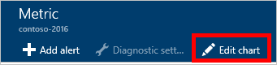
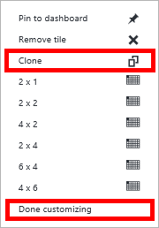
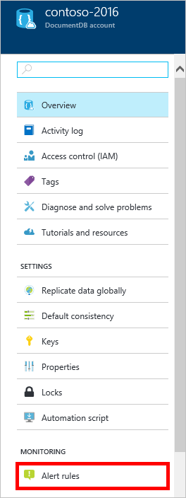

<properties
    pageTitle="監視 DocumentDB 要求和儲存 |Microsoft Azure"
    description="瞭解如何監控效能指標，例如要求與伺服器的錯誤，及使用方式的度量，例如儲存消耗您 DocumentDB 的帳戶。"
    services="documentdb"
    documentationCenter=""
    authors="mimig1"
    manager="jhubbard"
    editor="cgronlun"/>

<tags
    ms.service="documentdb"
    ms.workload="data-services"
    ms.tgt_pltfrm="na"
    ms.devlang="na"
    ms.topic="article"
    ms.date="10/17/2016"
    ms.author="mimig"/>

# 監控 DocumentDB 要求、 使用狀況]，儲存空間

您可以監視[Azure 入口網站](https://portal.azure.com/)中的 Azure DocumentDB 帳號。 針對每個 DocumentDB 帳戶，這兩個效能指標，例如要求和伺服器錯誤及使用方式的度量，例如儲存消耗可供使用。

新的度量刀或帳戶刀上，您可以檢閱指標。

## 在計量刀檢視效能指標

1. 在新視窗中，開啟[Azure 入口網站](https://portal.azure.com/)，按一下**其他服務**，按一下**DocumentDB (NoSQL)**，，然後按一下您要檢視的效能指標 DocumentDB 帳戶的名稱。
2. 在 [資源] 功能表中，按一下 [**指標**]。

指標刀隨即開啟，然後您可以選取要檢閱的集合。 您可以檢閱可用性、 邀請、 處理量及儲存指標，並以 DocumentDB Sla 比較。

## 在帳戶刀檢視效能指標
1.  在新視窗中，開啟[Azure 入口網站](https://portal.azure.com/)，按一下**其他服務**，按一下**DocumentDB (NoSQL)**，，然後按一下您要檢視的效能指標 DocumentDB 帳戶的名稱。

2.  **監控**透鏡預設會顯示下列方塊︰
    *   目前日期的所有要求。
    *   使用儲存空間。

    如果您的表格會顯示**可用的資料**，您認為您的資料庫中有資料，請參閱[疑難排解](#troubleshooting)一節。

    

3.  **要求**或**儲存空間**上按一下 [並排顯示開啟詳細的**公制**刀。
4.  **公制**刀會顯示您所選取的度量資訊的詳細資料。  按一下頂端的刀要求每小時、 繪製的圖表，而下面是顯示流速控制及總要求的彙總值的資料表。  公制刀也會顯示通知的已定義，出現在目前的公制刀計量篩選的清單 （如此一來，如果您有數字的通知，您只會看到此處所提供的相關項目）。   

    

## 自訂效能公制檢視在入口網站

1.  若要自訂特定的圖表中顯示指標，請按一下圖表中**公制**防禦，以開啟它，然後按一下**編輯圖表**。  
    

2.  **編輯圖表**刀中，有選項來修改圖表，以及他們的時間範圍中顯示的指標。  
    

3.  若要變更的部分顯示指標，只要選取或清除 [可用的效能指標，，然後按一下刀底部的**[確定]** 。  
4.  若要變更的時間範圍，選擇不同的範圍 （例如，**自訂**）]，然後按一下刀底部的**[確定]** 。  

    

## 建立並排顯示圖表，在入口網站
Azure 入口網站可讓您建立並排顯示公制圖表。  

1.  首先，請以滑鼠右鍵按一下您要複製，然後選取 [**自訂**的圖表。

    ![總要求圖表與反白顯示的 [自訂] 選項的螢幕擷取畫面](./media/documentdb-monitor-accounts/madocdb6.png)

2.  按一下 [複製組件，然後按一下 [**完成 [自訂**] 功能表上的 [**複製**]。

      

您現在可能會將此組件為單位的一部分，自訂組件中顯示的指標及時間範圍。  如此一來，您可以同時看到兩個不同的指標圖表-並存。  
      

## 設定提醒，在入口網站
1.  在[Azure 入口網站](https://portal.azure.com/)中，按一下 [**更多服務**]、 按一下**DocumentDB (NoSQL)**，，然後按一下您要設定效能公制通知 DocumentDB 帳戶的名稱。

2.  在 [資源] 功能表中，按一下 [開啟提醒規則刀的**通知的規則**]。  
    

3.  在**通知規則**刀中，按一下 [**新增提醒**]。  
    ![通知規則刀，醒目提示 [新增提醒] 按鈕的螢幕擷取畫面](./media/documentdb-monitor-accounts/madocdb11.png)

4.  在 [**新增提醒的規則**刀，指定︰
    *   提醒您設定的規則的名稱。
    *   新的通知規則的描述。
    *   通知規則的度量。
    *   決定提醒時啟動條件、 閥值，並期間。 例如，伺服器錯誤移到最後一個 15 分鐘計算大於 5。
    *   是否服務系統管理員和 coadministrators 會透過電子郵件傳送時的通知，則會啟動。
    *   提醒通知的額外的電子郵件地址。  
    

## 以程式設計方式監控 DocumentDB
在入口網站，例如帳戶儲存空間使用狀況] 和 [總要求，可使用的帳戶層級指標無法透過 DocumentDB Api。 不過，您可以使用 DocumentDB Api 來擷取集合層級的使用情況資料。 若要擷取集合層級的資料，請執行下列動作︰

- 若要使用 REST API，[執行集合上的取得](https://msdn.microsoft.com/library/mt489073.aspx)。 在回應中 x ms-資源配額和 x ms-資源使用量行標頭中則會傳回集合配額及使用方式的資訊。
- 若要使用.NET SDK，使用 [ [DocumentClient.ReadDocumentCollectionAsync](https://msdn.microsoft.com/library/microsoft.azure.documents.client.documentclient.readdocumentcollectionasync.aspx)方法，會傳回[ResourceResponse](https://msdn.microsoft.com/library/dn799209.aspx)包含數字的使用方式的屬性，例如**CollectionSizeUsage**、 **DatabaseUsage**、 **DocumentUsage**，及其他功能。

若要存取其他指標，請使用[Azure 監視器 SDK](https://www.nuget.org/packages/Microsoft.Azure.Insights)。 擷取可用的公制定義，則可電話︰

    https://management.azure.com/subscriptions/{SubscriptionId}/resourceGroups/{ResourceGroup}/providers/Microsoft.DocumentDb/databaseAccounts/{DocumentDBAccountName}/metricDefinitions?api-version=2015-04-08

查詢來擷取個別指標會使用下列格式︰

    https://management.azure.com/subscriptions/{SubecriptionId}/resourceGroups/{ResourceGroup}/providers/Microsoft.DocumentDb/databaseAccounts/{DocumentDBAccountName}/metrics?api-version=2015-04-08&$filter=%28name.value%20eq%20%27Total%20Requests%27%29%20and%20timeGrain%20eq%20duration%27PT5M%27%20and%20startTime%20eq%202016-06-03T03%3A26%3A00.0000000Z%20and%20endTime%20eq%202016-06-10T03%3A26%3A00.0000000Z

如需詳細資訊，請參閱[透過 Azure 監視器 REST API 擷取資源指標](https://blogs.msdn.microsoft.com/cloud_solution_architect/2016/02/23/retrieving-resource-metrics-via-the-azure-insights-api/)。 請注意 「 Azure Inights 「 已重新命名 「 Azure 監視器 」。  此部落格文章指的是較舊的名稱。

## 疑難排解
如果監控磚顯示**可用的資料**封郵件，且您最近所做的要求，或新增資料至資料庫，您可以編輯磚，以反映最近的使用方式。

### 編輯方塊重新整理目前的資料
1.  若要自訂特定的組件中顯示指標，請按一下圖表以開啟 [**公制**刀，，，然後按一下 [**編輯圖表**。  
    

2.  在**編輯圖表**刀，在 [**時間範圍**] 區段中，按一下 [**過去的小時**，，然後按一下**[確定]**。  
    

3.  您的磚現在應該重新整理顯示您目前的資料及使用方式。  
    

## 後續步驟
若要進一步瞭解 DocumentDB 容量，請參閱[管理 DocumentDB 容量](documentdb-manage.md)。
