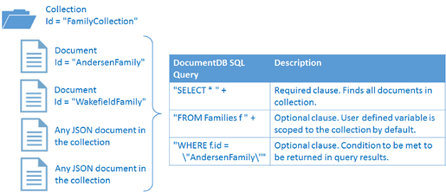

<properties
  pageTitle="針對 DocumentDB NoSQL Node.js 教學課程 |Microsoft Azure"
  description="建立節點資料庫及主控台應用程式，使用 DocumentDB Node.js SDK NoSQL Node.js 教學課程。 DocumentDB 是 JSON NoSQL 資料庫。"
    keywords="node.js 教學課程中，節點資料庫"
  services="documentdb"
  documentationCenter="node.js"
  authors="AndrewHoh"
  manager="jhubbard"
  editor="monicar"/>

<tags
  ms.service="documentdb"
  ms.workload="data-services"
  ms.tgt_pltfrm="na"
  ms.devlang="node"
  ms.topic="hero-article"
  ms.date="08/11/2016"
  ms.author="anhoh"/>

# <a name="nosql-nodejs-tutorial-documentdb-nodejs-console-application"></a>NoSQL Node.js 教學課程︰ DocumentDB Node.js 主控台應用程式  

> [AZURE.SELECTOR]
- [.NET](documentdb-get-started.md)
- [Node.js](documentdb-nodejs-get-started.md)

歡迎使用 Node.js 教學課程的 Azure DocumentDB Node.js SDK ！ 後遵循此教學課程中，您必須主控台應用程式建立的和查詢 DocumentDB 資源，包括節點資料庫。

我們會︰

- 建立並連線到 DocumentDB 的帳戶
- 設定您的應用程式
- 建立節點資料庫
- 建立集合
- 建立 JSON 文件
- 查詢集合
- 取代文件
- 刪除文件
- 刪除節點資料庫

沒有時間？ 別擔心 ！ 使用[GitHub](https://github.com/Azure-Samples/documentdb-node-getting-started)上完整的解決方案。 如需快速的指示，請參閱[取得完整的解決方案](#GetSolution)。

您已完成 Node.js 教學課程後，請使用投票按鈕在頂端和底部的這個頁面以提供意見反應。 如果您希望我們為直接連絡您，請隨意註解中包含您的電子郵件地址。

現在讓我們開始吧 ！

## <a name="prerequisites-for-the-nodejs-tutorial"></a>先決條件 Node.js 教學課程

請確定您有下列動作︰

- 使用中的 Azure 帳戶。 如果您沒有帳戶，您可以註冊[免費 Azure 試用版](https://azure.microsoft.com/pricing/free-trial/)。
- [Node.js](https://nodejs.org/)版本 v0.10.29 或更新版本。

## <a name="step-1-create-a-documentdb-account"></a>步驟 1︰ 建立 DocumentDB 帳戶

現在就讓我們建立 DocumentDB 帳戶。 如果您已經有您想要使用的帳戶，您可以跳到[設定 Node.js 應用程式](#SetupNode)。

[AZURE.INCLUDE [documentdb-create-dbaccount](../../includes/documentdb-create-dbaccount.md)]

## <a id="SetupNode"></a>步驟 2︰ 設定您的 Node.js 應用程式

1. 開啟您最愛的終端機。
2. 找出您想要儲存您的 Node.js 應用程式目錄的資料夾。
3. 建立兩個空白 JavaScript 檔案，並輸入下列命令︰
  - 在 Windows 中︰
      * ```fsutil file createnew app.js 0```
        * ```fsutil file createnew config.js 0```
  - Linux OS x:
      * ```touch app.js```
        * ```touch config.js```
4. 安裝透過 npm documentdb 模組。 使用下列命令︰
    * ```npm install documentdb --save```

好 ！ 現在您已經完成設定，現在就讓我們開始撰寫的部分程式碼。

## <a id="Config"></a>步驟 3︰ 設定您的應用程式設定

開啟```config.js```最愛的文字編輯器。

然後、 複製和貼上下列的程式碼片段及設定屬性```config.endpoint```和```config.primaryKey```DocumentDB 端點 uri 和主索引鍵。 [Azure 入口網站](https://portal.azure.com)中可以找到這兩個這些設定。

![Node.js 教學課程-Azure 入口網站，顯示 DocumentDB 帳戶，醒目提示 [作用中] 中心內，DocumentDB 帳戶把刀上醒目提示 [索引鍵] 按鈕與鍵刀-節點資料庫上醒目提示的 URI、 主索引鍵和次要鍵值的螢幕擷取畫面][keys]

    // ADD THIS PART TO YOUR CODE
    var config = {}

    config.endpoint = "~your DocumentDB endpoint uri here~";
    config.primaryKey = "~your primary key here~";

複製並貼上```database id```， ```collection id```，及```JSON documents```至您```config```物件下，設定您```config.endpoint```和```config.authKey```屬性。 如果您已經有您想要儲存在您的資料庫中的資料，您可以使用[DocumentDB 的資料移轉工具](documentdb-import-data.md)，而非新增文件定義。

    config.endpoint = "~your DocumentDB endpoint uri here~";
    config.primaryKey = "~your primary key here~";

    // ADD THIS PART TO YOUR CODE
    config.database = {
        "id": "FamilyDB"
    };

    config.collection = {
        "id": "FamilyColl"
    };

    config.documents = {
        "Andersen": {
            "id": "Anderson.1",
            "lastName": "Andersen",
            "parents": [{
                "firstName": "Thomas"
            }, {
                    "firstName": "Mary Kay"
                }],
            "children": [{
                "firstName": "Henriette Thaulow",
                "gender": "female",
                "grade": 5,
                "pets": [{
                    "givenName": "Fluffy"
                }]
            }],
            "address": {
                "state": "WA",
                "county": "King",
                "city": "Seattle"
            }
        },
        "Wakefield": {
            "id": "Wakefield.7",
            "parents": [{
                "familyName": "Wakefield",
                "firstName": "Robin"
            }, {
                    "familyName": "Miller",
                    "firstName": "Ben"
                }],
            "children": [{
                "familyName": "Merriam",
                "firstName": "Jesse",
                "gender": "female",
                "grade": 8,
                "pets": [{
                    "givenName": "Goofy"
                }, {
                        "givenName": "Shadow"
                    }]
            }, {
                    "familyName": "Miller",
                    "firstName": "Lisa",
                    "gender": "female",
                    "grade": 1
                }],
            "address": {
                "state": "NY",
                "county": "Manhattan",
                "city": "NY"
            },
            "isRegistered": false
        }
    };


資料庫、 收集及文件定義要做為您 DocumentDB ```database id```， ```collection id```，與文件的資料。

最後，匯出您```config```物件，讓您可以參考它內```app.js```檔案。

            },
            "isRegistered": false
        }
    };

    // ADD THIS PART TO YOUR CODE
    module.exports = config;

##<a id="Connect"></a>步驟 4︰ 連線至 DocumentDB 帳戶

開啟您清空```app.js```在文字編輯器中的檔案。 複製並貼上以下匯入的程式碼```documentdb```模組，且您剛建立```config```模組。

    // ADD THIS PART TO YOUR CODE
    "use strict";

    var documentClient = require("documentdb").DocumentClient;
    var config = require("./config");
    var url = require('url');

複製並貼上要使用先前儲存的程式碼```config.endpoint```和```config.primaryKey```若要建立新的 DocumentClient。

    var config = require("./config");
    var url = require('url');

    // ADD THIS PART TO YOUR CODE
    var client = new documentClient(config.endpoint, { "masterKey": config.primaryKey });

現在您有初始化 documentdb 用戶端的程式碼，請讓我們來看看使用 DocumentDB 資源。

## <a name="step-5-create-a-node-database"></a>步驟 5︰ 建立節點的資料庫
複製並貼上下列的 HTTP 狀態為找不到資料庫 url，與集合 url 的程式碼。 這些 url 是 DocumentDB 用戶端如何找到正確的資料庫及集合。

    var client = new documentClient(config.endpoint, { "masterKey": config.primaryKey });

    // ADD THIS PART TO YOUR CODE
    var HttpStatusCodes = { NOTFOUND: 404 };
    var databaseUrl = `dbs/${config.database.id}`;
    var collectionUrl = `${databaseUrl}/colls/${config.collection.id}`;

建立[資料庫](documentdb-resources.md#databases)可以使用**DocumentClient**類別的[createDatabase](https://azure.github.io/azure-documentdb-node/DocumentClient.html)函數。 資料庫是邏輯的分割整個集合的文件存放容器。

複製並貼上 app.js 檔案中建立新資料庫的**getDatabase**函數```id```指定```config```物件。 此函數會檢查如果具有相同的資料庫```FamilyRegistry```識別碼不存在。 如果存在，我們會傳回，而不是建立一個新的資料庫。

    var collectionUrl = `${databaseUrl}/colls/${config.collection.id}`;

    // ADD THIS PART TO YOUR CODE
    function getDatabase() {
        console.log(`Getting database:\n${config.database.id}\n`);

        return new Promise((resolve, reject) => {
            client.readDatabase(databaseUrl, (err, result) => {
                if (err) {
                    if (err.code == HttpStatusCodes.NOTFOUND) {
                        client.createDatabase(config.database, (err, created) => {
                            if (err) reject(err)
                            else resolve(created);
                        });
                    } else {
                        reject(err);
                    }
                } else {
                    resolve(result);
                }
            });
        });
    }

複製並貼上] 下方，您可以在此設定的**getDatabase**函數，用於相加協助函數**結束**會列印結束訊息和**getDatabase**函數呼叫的程式碼。

                } else {
                    resolve(result);
                }
            });
        });
    }

    // ADD THIS PART TO YOUR CODE
    function exit(message) {
        console.log(message);
        console.log('Press any key to exit');
        process.stdin.setRawMode(true);
        process.stdin.resume();
        process.stdin.on('data', process.exit.bind(process, 0));
    }

    getDatabase()
    .then(() => { exit(`Completed successfully`); })
    .catch((error) => { exit(`Completed with error ${JSON.stringify(error)}`) });

在 terminal 中，找出您```app.js```檔案，然後執行命令︰```node app.js```

恭喜您 ！ 您已成功建立 DocumentDB 資料庫。

##<a id="CreateColl"></a>步驟 6︰ 建立集合  

> [AZURE.WARNING] **CreateDocumentCollectionAsync**將會建立新的集合，其中有價格的含意。 如需詳細資訊，請造訪我們的[價格頁面](https://azure.microsoft.com/pricing/details/documentdb/)。

建立[集合](documentdb-resources.md#collections)可以使用**DocumentClient**類別的[createCollection](https://azure.github.io/azure-documentdb-node/DocumentClient.html)函數。 集合是 JSON 文件和相關聯的 JavaScript 應用程式邏輯的容器。

複製並貼上建立新集合與**getDatabase**函數下方**getCollection**函數```id```指定```config```物件。 同樣地，我們會檢查以確認具有相同的集合```FamilyCollection```識別碼不存在。 如果存在，我們會傳回，而不是建立一個新的集合。

                } else {
                    resolve(result);
                }
            });
        });
    }

    // ADD THIS PART TO YOUR CODE
    function getCollection() {
        console.log(`Getting collection:\n${config.collection.id}\n`);

        return new Promise((resolve, reject) => {
            client.readCollection(collectionUrl, (err, result) => {
                if (err) {
                    if (err.code == HttpStatusCodes.NOTFOUND) {
                        client.createCollection(databaseUrl, config.collection, { offerThroughput: 400 }, (err, created) => {
                            if (err) reject(err)
                            else resolve(created);
                        });
                    } else {
                        reject(err);
                    }
                } else {
                    resolve(result);
                }
            });
        });
    }

複製並貼上] 下方執行**getCollection**函數呼叫**getDatabase**的程式碼。

    getDatabase()

    // ADD THIS PART TO YOUR CODE
    .then(() => getCollection())
    // ENDS HERE

    .then(() => { exit(`Completed successfully`); })
    .catch((error) => { exit(`Completed with error ${JSON.stringify(error)}`) });

在 terminal 中，找出您```app.js```檔案，然後執行命令︰```node app.js```

恭喜您 ！ 您已成功建立 DocumentDB 集合。

##<a id="CreateDoc"></a>步驟 7︰ 建立文件
建立[文件](documentdb-resources.md#documents)可以使用**DocumentClient**類別的[createDocument](https://azure.github.io/azure-documentdb-node/DocumentClient.html)函數。 文件的使用者定義 （任意） JSON 內容。 您現在可以將 DocumentDB 插入文件。

複製並貼上**getCollection**函數來建立包含 JSON 資料儲存在文件下方的**getFamilyDocument**函數```config```物件。 同樣地，我們會檢查，請確定文件的相同的識別碼不存在。

                } else {
                    resolve(result);
                }
            });
        });
    }

    // ADD THIS PART TO YOUR CODE
    function getFamilyDocument(document) {
        let documentUrl = `${collectionUrl}/docs/${document.id}`;
        console.log(`Getting document:\n${document.id}\n`);

        return new Promise((resolve, reject) => {
            client.readDocument(documentUrl, { partitionKey: document.district }, (err, result) => {
                if (err) {
                    if (err.code == HttpStatusCodes.NOTFOUND) {
                        client.createDocument(collectionUrl, document, (err, created) => {
                            if (err) reject(err)
                            else resolve(created);
                        });
                    } else {
                        reject(err);
                    }
                } else {
                    resolve(result);
                }
            });
        });
    };

複製並貼上] 下方執行**getFamilyDocument**函數呼叫**getCollection**的程式碼。

    getDatabase()
    .then(() => getCollection())

    // ADD THIS PART TO YOUR CODE
    .then(() => getFamilyDocument(config.documents.Andersen))
    .then(() => getFamilyDocument(config.documents.Wakefield))
    // ENDS HERE

    .then(() => { exit(`Completed successfully`); })
    .catch((error) => { exit(`Completed with error ${JSON.stringify(error)}`) });

在 terminal 中，找出您```app.js```檔案，然後執行命令︰```node app.js```

恭喜您 ！ 您已成功建立 DocumentDB 文件。


##<a id="Query"></a>步驟 8︰ 查詢 DocumentDB 資源

DocumentDB 支援 JSON 文件儲存在每個集合中[豐富的查詢](documentdb-sql-query.md)。 下列範例會顯示您可以針對文件集合中執行的查詢。

複製並貼上下方**getFamilyDocument**函數**queryCollection**函數。 DocumentDB 支援類似 SQL 查詢，如下所示。 建立複雜的查詢的詳細資訊，請參閱[查詢遊樂場](https://www.documentdb.com/sql/demo)和[查詢文件](documentdb-sql-query.md)。

                } else {
                    resolve(result);
                }
            });
        });
    }

    // ADD THIS PART TO YOUR CODE
    function queryCollection() {
        console.log(`Querying collection through index:\n${config.collection.id}`);

        return new Promise((resolve, reject) => {
            client.queryDocuments(
                collectionUrl,
                'SELECT VALUE r.children FROM root r WHERE r.lastName = "Andersen"'
            ).toArray((err, results) => {
                if (err) reject(err)
                else {
                    for (var queryResult of results) {
                        let resultString = JSON.stringify(queryResult);
                        console.log(`\tQuery returned ${resultString}`);
                    }
                    console.log();
                    resolve(results);
                }
            });
        });
    };


下圖說明如何 DocumentDB SQL 查詢語法稱為集合您所建立。



[從](documentdb-sql-query.md#from-clause)關鍵字是在查詢中的選擇性的因為 DocumentDB 查詢已經限於單一集合。 因此，「 從系列 f 」 可以交換以 「 從根 r 」，或任何其他變數名稱您選擇。 DocumentDB 會推斷該系列、 根目錄或您選擇的變數名稱，請依預設參照目前的集合。

複製並貼上] 下方執行**queryCollection**函數呼叫**getFamilyDocument**的程式碼。

    .then(() => getFamilyDocument(config.documents.Andersen))
    .then(() => getFamilyDocument(config.documents.Wakefield))

    // ADD THIS PART TO YOUR CODE
    .then(() => queryCollection())
    // ENDS HERE

    .then(() => { exit(`Completed successfully`); })
    .catch((error) => { exit(`Completed with error ${JSON.stringify(error)}`) });

在 terminal 中，找出您```app.js```檔案，然後執行命令︰```node app.js```

恭喜您 ！ 您已成功查詢 DocumentDB 文件。

##<a id="ReplaceDocument"></a>步驟 9︰ 取代文件
DocumentDB 支援取代 JSON 文件。

複製並貼上下方**queryCollection**函數**replaceDocument**函數。

                    }
                    console.log();
                    resolve(result);
                }
            });
        });
    }

    // ADD THIS PART TO YOUR CODE
    function replaceFamilyDocument(document) {
        let documentUrl = `${collectionUrl}/docs/${document.id}`;
        console.log(`Replacing document:\n${document.id}\n`);
        document.children[0].grade = 6;

        return new Promise((resolve, reject) => {
            client.replaceDocument(documentUrl, document, (err, result) => {
                if (err) reject(err);
                else {
                    resolve(result);
                }
            });
        });
    };

複製並貼上] 下方執行**replaceDocument**函數呼叫**queryCollection**的程式碼。 此外，新增呼叫再次**queryCollection**驗證的文件已成功變更的程式碼。

    .then(() => getFamilyDocument(config.documents.Andersen))
    .then(() => getFamilyDocument(config.documents.Wakefield))
    .then(() => queryCollection())

    // ADD THIS PART TO YOUR CODE
    .then(() => replaceFamilyDocument(config.documents.Andersen))
    .then(() => queryCollection())
    // ENDS HERE

    .then(() => { exit(`Completed successfully`); })
    .catch((error) => { exit(`Completed with error ${JSON.stringify(error)}`) });

在 terminal 中，找出您```app.js```檔案，然後執行命令︰```node app.js```

恭喜您 ！ 您已經順利取代 DocumentDB 文件。

##<a id="DeleteDocument"></a>步驟 10︰ 刪除文件
DocumentDB 支援刪除 JSON 文件。

複製並貼上下方**replaceDocument**函數**deleteDocument**函數。

                else {
                    resolve(result);
                }
            });
        });
    };

    // ADD THIS PART TO YOUR CODE
    function deleteFamilyDocument(document) {
        let documentUrl = `${collectionUrl}/docs/${document.id}`;
        console.log(`Deleting document:\n${document.id}\n`);

        return new Promise((resolve, reject) => {
            client.deleteDocument(documentUrl, (err, result) => {
                if (err) reject(err);
                else {
                    resolve(result);
                }
            });
        });
    };

複製並貼上] 下方的第二個**queryCollection**呼叫執行**deleteDocument**函式的程式碼。

    .then(() => queryCollection())
    .then(() => replaceFamilyDocument(config.documents.Andersen))
    .then(() => queryCollection())

    // ADD THIS PART TO YOUR CODE
    .then(() => deleteFamilyDocument(config.documents.Andersen))
    // ENDS HERE

    .then(() => { exit(`Completed successfully`); })
    .catch((error) => { exit(`Completed with error ${JSON.stringify(error)}`) });

在 terminal 中，找出您```app.js```檔案，然後執行命令︰```node app.js```

恭喜您 ！ 您已成功刪除 DocumentDB 文件。

##<a id="DeleteDatabase"></a>步驟 11︰ 刪除節點的資料庫

刪除建立的資料庫，將會移除資料庫及所有子系資源 （集合、 文件）。

複製並貼上下列的程式碼片段 （函數**清理**） 若要移除資料庫及所有子系資源。

                else {
                    resolve(result);
                }
            });
        });
    };

    // ADD THIS PART TO YOUR CODE
    function cleanup() {
        console.log(`Cleaning up by deleting database ${config.database.id}`);

        return new Promise((resolve, reject) => {
            client.deleteDatabase(databaseUrl, (err) => {
                if (err) reject(err)
                else resolve(null);
            });
        });
    }

複製並貼上] 下方執行**清理**函數呼叫**deleteDocument**的程式碼。

    .then(() => deleteFamilyDocument(config.documents.Andersen))

    // ADD THIS PART TO YOUR CODE
    .then(() => cleanup())
    // ENDS HERE

    .then(() => { exit(`Completed successfully`); })
    .catch((error) => { exit(`Completed with error ${JSON.stringify(error)}`) });

##<a id="Run"></a>步驟 12︰ 執行 Node.js 應用程式一起 ！

呼叫您函數的順序看起來應該像這樣︰

    getDatabase()
    .then(() => getCollection())
    .then(() => getFamilyDocument(config.documents.Andersen))
    .then(() => getFamilyDocument(config.documents.Wakefield))
    .then(() => queryCollection())
    .then(() => replaceFamilyDocument(config.documents.Andersen))
    .then(() => queryCollection())
    .then(() => deleteFamilyDocument(config.documents.Andersen))
    .then(() => cleanup())
    .then(() => { exit(`Completed successfully`); })
    .catch((error) => { exit(`Completed with error ${JSON.stringify(error)}`) });

在 terminal 中，找出您```app.js```檔案，然後執行命令︰```node app.js```

您應該會看到您開始使用應用程式的輸出。 輸出應符合下列範例文字。

    Getting database:
    FamilyDB

    Getting collection:
    FamilyColl

    Getting document:
    Anderson.1

    Getting document:
    Wakefield.7

    Querying collection through index:
    FamilyColl
        Query returned [{"firstName":"Henriette Thaulow","gender":"female","grade":5,"pets":[{"givenName":"Fluffy"}]}]

    Replacing document:
    Anderson.1

    Querying collection through index:
    FamilyColl
        Query returned [{"firstName":"Henriette Thaulow","gender":"female","grade":6,"pets":[{"givenName":"Fluffy"}]}]

    Deleting document:
    Anderson.1

    Cleaning up by deleting database FamilyDB
    Completed successfully
    Press any key to exit

恭喜您 ！ 您已經建立您已完成 Node.js 教學課程和有您第一份 DocumentDB 主控台應用程式 ！

## <a id="GetSolution"></a>取得完整的 Node.js 教學課程的解決方案
若要建立包含本文中的所有範例的 GetStarted 方案，您將需要下列項目︰

-   [DocumentDB 帳戶][documentdb-create-account]。
-   提供 GitHub [GetStarted](https://github.com/Azure-Samples/documentdb-node-getting-started)解決方案。

安裝透過 npm **documentdb**模組。 使用下列命令︰
* ```npm install documentdb --save```

接著，在```config.js```檔案時，請更新 config.endpoint] 和 [config.authKey 值中所述[步驟 3︰ 設定您的應用程式設定](#Config)。

## <a name="next-steps"></a>後續步驟

-   想要更複雜的 Node.js 範例？ 請參閱[建立使用 DocumentDB Node.js web 應用程式](documentdb-nodejs-application.md)。
-  瞭解如何[監視器 DocumentDB 帳戶](documentdb-monitor-accounts.md)。
-  針對我們的範例資料集，[查詢遊樂場](https://www.documentdb.com/sql/demo)中執行查詢。
-  進一步瞭解程式設計的模型[DocumentDB 文件頁面](https://azure.microsoft.com/documentation/services/documentdb/)的 [開發] 區段中。

[documentdb-create-account]: documentdb-create-account.md
[documentdb-manage]: documentdb-manage.md

[keys]: media/documentdb-nodejs-get-started/node-js-tutorial-keys.png
