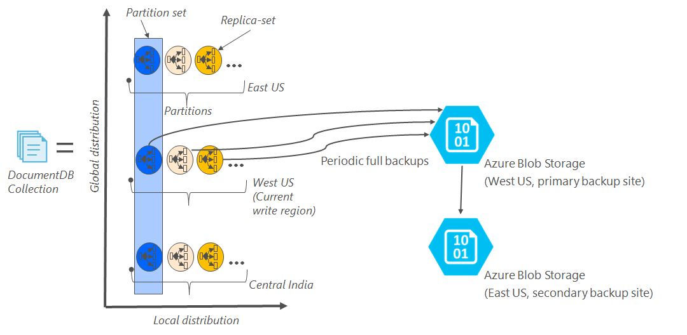

<properties
    pageTitle="線上備份與還原 DocumentDB |Microsoft Azure"
    description="了解如何執行自動備份與還原 NoSQL Azure DocumentDB 的資料庫。"
    keywords="備份與還原，線上備份"
    services="documentdb"
    documentationCenter=""
    authors="RahulPrasad16"
    manager="jhubbard"
    editor="monicar"/>

<tags
    ms.service="documentdb"
    ms.workload="data-services"
    ms.tgt_pltfrm="na"
    ms.devlang="multiple"
    ms.topic="article"
    ms.date="09/23/2016"
    ms.author="raprasa"/>

# 自動線上的備份與還原 DocumentDB 

Azure DocumentDB 自動會定期間隔的備份的所有資料。 自動備份就會採用而不會影響效能或您 NoSQL 資料庫作業的可用性。 其他儲存服務中，分別儲存您的備份，這些備份全域複寫恢復針對地區損毀。 當您不小心刪除您 DocumentDB 集合，並稍後需要資料復原或損壞修復解決方案時，自動備份是針對案例。  

本文快速概述資料重複和可用性 DocumentDB，在第一句，然後討論備份。 

## 使用 DocumentDB-概述可用性

DocumentDB 專為[全域分散式](documentdb-distribute-data-globally.md)-可讓您跨多個 Azure 的區域，以及原則導向容錯移轉和透明的多重隸屬 Api 縮放處理量。 為資料庫系統提供[99.99%可用性 Sla](https://azure.microsoft.com/support/legal/sla/documentdb/v1_0/)，DocumentDB 中的所有寫入都是長期致力於本機磁碟的複本中的區域資料中心的仲裁之前認可用戶端。 請注意，DocumentDB 的是本機的儲存空間，而不會根據任何外部儲存技術。 此外，如果您的資料庫帳戶相關聯與多個 Azure 區域，您將複寫跨以及其他區域。 若要在低延遲縮放您處理量與存取權的資料，您可以讓許多讀取視您資料庫帳戶相關聯的區域。 每個讀取區域 （複寫） 的資料長期複本組保存。  

下圖所示，在單一 DocumentDB 集合是[水平分割](documentdb-partition-data.md)。 「 分割區 」 由下列在圖表中圓形表示，每個資料分割供高度透過複本集。 這是本機的通訊群組內單一 Azure 區域 （以 X 軸表示）。 此外，每個資料分割 （含其對應複本） 然後全域分散到您的資料庫帳戶 （例如，在此圖例三個區域 – 東亞美國、 西和中央印度） 相關聯的多個區域。 「 分割集 」 是全域分散式實體可包含多個複本 （Y 軸表示） 每個區域中的資料。 您可以指定優先順序與您的資料庫帳戶相關聯的區域，DocumentDB 無障礙會容錯移轉到下一個區域損毀的情況下。 您可以手動模擬以測試您的應用程式的端對端可用性容錯移轉。  

下圖顯示高度的重複使用 DocumentDB。

## 完整、 自動線上的備份

沒有控制刪除我的資料庫或集合 ！ DocumentDB，與您的資料，不僅備份資料會一併變更強烈多餘並同時地區損毀。 目前正在進行這些自動的備份約每四個小時。 

不會影響效能或您的資料庫作業的可用性進行備份。 DocumentDB 會在背景中備份，而不使用您能夠的 RUs 或效能的影響，而不影響 NoSQL 資料庫的可用性。 

您儲存在 DocumentDB 內的資料，與自動備份會儲存在 Azure Blob 儲存體服務。 若要確保低有效延遲/上傳，備份的快照是上傳到為目前寫入範圍 DocumentDB 資料庫帳戶的同一個區域中的 Azure Blob 儲存體的執行個體。 恢復地區損毀，備份資料 Azure Blob 儲存體中的每個快照是一次複寫透過地理多餘的儲存空間 (GRS) 到另一個區域。 下圖顯示 （含三個主要中所有磁碟分割西美國，在此範例中） 的整個 DocumentDB 集合備份遠端 Azure Blob 儲存體帳戶中西美國，及 GRS 複寫到東亞美國。 

下圖顯示的 GRS Azure 儲存體中的所有 DocumentDB 實體定期完整的備份。

## 指定快照保留期限

如上所述，我們會定期取得快照的資料和每我們法規遵循法規，我們會保留最新的快照設定為 90 天之前，最後會清除。 如果刪除集合或帳戶，則 DocumentDB 會儲存的最後一個備份 90 天。

## 從線上備份還原資料庫

以防不慎刪除您的資料，您可以[檔案的支援票證](https://portal.azure.com/?#blade/Microsoft_Azure_Support/HelpAndSupportBlade)或[打電話給支援人員 Azure](https://azure.microsoft.com/support/options/)從上一次自動備份還原資料。 您要還原的備份的特定快照，DocumentDB 需要資料的快照的備份週期期間已至少提供給我們。

## 後續步驟

複製您在多個資料中心的 NoSQL 資料庫，請參閱[發佈全面使用 DocumentDB 資料](documentdb-distribute-data-globally.md)。 

檔案連絡人 Azure 支援，[檔案的票證從 Azure 入口網站](https://portal.azure.com/?#blade/Microsoft_Azure_Support/HelpAndSupportBlade)。