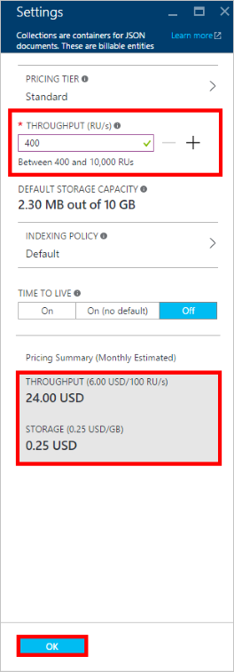
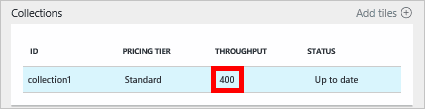

<properties
    pageTitle="效能層級中 DocumentDB |Microsoft Azure"
    description="瞭解如何在 DocumentDB 效能層級可讓您保留每個集合為基礎的處理量。"
    services="documentdb"
    authors="mimig1"
    manager="jhubbard"
    editor="monicar"
    documentationCenter=""/>

<tags
    ms.service="documentdb"
    ms.workload="data-services"
    ms.tgt_pltfrm="na"
    ms.devlang="na"
    ms.topic="article"
    ms.date="08/26/2016"
    ms.author="mimig"/>

# 在 [DocumentDB 效能層級

本文提供[Microsoft Azure DocumentDB](https://azure.microsoft.com/services/documentdb/)中的效能層級的概觀。

閱讀本文之後，您便可以回答下列問題︰  

-   什麼是效能層級？
-   如何處理量保留做為資料庫帳戶中？
-   如何使用效能層級？
-   我要如何正在計費效能層級？

## 效能層級的簡介

在標準的帳戶所建立的每個 DocumentDB 集合已佈建與相關聯的效能等級。 資料庫中的每個集合可以有不同的效能層級可讓您指定更多處理量較常存取集合處理能力和經常存取的集合。 DocumentDB 支援兩種使用者定義的效能層級，而且預先定義的效能層級。  

每個效能層級具有相關聯的[要求單位 (RU)](documentdb-request-units.md)速度限制。 這是會保留集合根據其效能層級，處理量，而且可以使用該集合以獨佔模式。

<table border="0" cellspacing="0" cellpadding="0">
    <tbody>
        <tr>
            <td valign="top">

</td>
            <td valign="top">
詳細資料
</td>
            <td valign="top">
處理限制
</td>
            <td valign="top">
儲存限制
</td>
            <td valign="top">
版本
</td>
            <td valign="top">
Api
</td>            
        </tr>
        <tr>
            <td valign="top">
使用者定義的效能
</td>
            <td valign="top">
儲存計量付費根據 gb 的使用方式。

處理量單位的 100 RU/s
</td>
            <td valign="top">
無限制。 400-250000 要求 （較高的要求） 的預設單位/s
</td>
            <td valign="top">
無限制。 250 GB，預設 （較高的要求） 
</td>
            <td valign="top">
V2
</td>
            <td valign="top">
API 2015 年 12-16 及更新版本
</td>  
        </tr>
        <tr>
            <td valign="top">
預先定義的效能
</td>
            <td valign="top">
保留的 10 GB 的儲存空間。

S1 = 250 RU/s、 S2 = 1000 RU/s，S3 = 2500 RU/s
</td>
            <td valign="top">
2500 RU/s
</td>
            <td valign="top">
10 GB
</td>
            <td valign="top">
V1
</td>
            <td valign="top">
任何
</td>  
        </tr>        
    </tbody>
</table>                

DocumentDB 允許豐富的資料庫作業包括查詢與查詢使用者定義函數 (Udf)，使用預存程序引動程序。 這種操作的相關聯的處理成本會因 CPU IO 與完成作業所需的記憶體。 請改為思考和管理硬體資源，您可以將要求單位為單一資源的量值的所需執行各種不同的資料庫作業與服務應用程式要求。

您可以透過[Microsoft Azure 入口網站](https://portal.azure.com)、 [REST API](https://msdn.microsoft.com/library/azure/mt489078.aspx)或任何[DocumentDB Sdk](https://msdn.microsoft.com/library/azure/dn781482.aspx)建立集合。 DocumentDB Api 可讓您指定的集合效能等級。

> [AZURE.NOTE] 透過 Api 或[Microsoft Azure 入口網站](https://portal.azure.com/)，可以調整集合的效能層級。 效能層級的變更，都必須在 3 分鐘內完成。

## 設定集合的效能層級
集合建立後，根據指定的效能層級的 RUs 完整配置會保留集合。

請注意，這兩個使用者定義和預先定義的效能層級，DocumentDB 運作根據處理量的保留項目。 藉由建立集合，應用程式會保留，並保留處理量，無論該處理量中有多少正在使用的計費。 以使用者定義的效能層級，根據消耗，計量付費儲存空間，但以預先定義的效能層級，一次的集合建立保留 10 GB 的儲存空間。  

集合建立之後，您可以修改透過 DocumentDB Sdk 或 Azure 傳統入口網站的效能層級。

> [AZURE.IMPORTANT] DocumentDB 標準集合會在時薪計費與您所建立的每個集合計費最小值的一個小時的使用方式。

如果您調整一個小時內集合的效能層級，計費 3 小時的最高效能層級。 例如，如果您增加上午 8:53 集合將效能層級您需要付費 8:00 am 處開始新的層級。 同樣地，如果您在上午 8:53 減少將效能層級，9:00 am，將會套用新的工資率。

要求單位是根據效能層級設定的每個集合保留項目。 要求單位消耗評估為每個第二個工資率。 超過能夠的要求單位率 （或效能層級） 集合的應用程式將會降低，直到工資率低於保留集合的層級。 如果您的應用程式需要較高層級的處理量，您可以增加每個集合的效能層級。

> [AZURE.NOTE] 當您的應用程式超過一或多個集合的效能層級時，要求將會降低每個集合為基礎。 這表示的部分應用程式要求可能失敗時可能會降低，其他人。 建議您新增小型次數時才能處理特殊圖文集的要求流量經流速控制。

## 使用效能層級
DocumentDB 集合可讓您根據查詢模式和應用程式的效能需求將資料分組。 DocumentDB 的自動編製索引及查詢的支援，是很常見若非異質性相同集合中的文件。 決定是否應該使用不同的集合的主要考量包括︰

- 查詢 – 集合是執行查詢的範圍。 如果您需要查詢的文件的一組，最有效率的閱讀的模式是來自組合單一集合中的文件]。
- 交易 – 所有交易範圍至單一集合內。 如果您有必須更新單一預存程序或觸發程序中的文件時，他們必須儲存在相同的集合中。 更明確地說，集合中的資料分割索引鍵是交易邊界。 請如需詳細資訊，參閱[在 DocumentDB Partitioning](documentdb-partition-data.md) 。
- 效能隔離 – 集合具有相關聯的效能層級。 這樣的每個集合都有保留 RUs 如預期呈現效能。 資料可以配置到不同的集合，以不同的效能層級，根據存取頻率。

> [AZURE.IMPORTANT] 請務必瞭解將會向您收費，根據您的應用程式所建立的集合數的完整的標準工資率。

建議您的應用程式可讓您使用小的數字的集合，除非您有大型的儲存空間或處理量需求。 請確定您有理解應用程式模式，來建立新的集合。 您可以選擇保留集合建立處理您的應用程式外管理動作。 同樣地，調整集合的效能層級會變更的時薪向收費的集合。 如果您的應用程式調整這些動態，您應該監控集合效能層級。

## 從 S1 S2，S3 變更為使用者定義的效能

請遵循下列步驟來變更從 Azure 入口網站中的使用者定義的處理量層級使用預先定義的處理量層級。 藉由使用使用者定義的處理量層級，您可以根據需求您處理量。 然後，如果您仍在使用 S1 帳戶，您可以增加您預設產能從 250 RU/s 400 RU/s 按幾下滑鼠。

如需有關價格的變更與相關的使用者定義和預先定義處理量的詳細資訊，請參閱部落格文章[DocumentDB︰ 您必須能夠使用新的價格選項的相關的所有項目](https://azure.microsoft.com/blog/documentdb-use-the-new-pricing-options-on-your-existing-collections/)。

> [AZURE.VIDEO changedocumentdbcollectionperformance]

1. 在瀏覽器中瀏覽至[**Azure 入口網站**](https://portal.azure.com)。
2. 按一下 [**瀏覽** -> **DocumentDB 帳戶**，然後選取要修改的 DocumentDB 帳戶。   
3. 在 [**資料庫**透鏡，選取要修改的資料庫，然後在**資料庫**刀中，選取要修改的集合。 使用預先定義的處理量的帳戶有價格層 S1、 S2 或 S3。

      

4. 在**集合**刀中，按一下 [**更多**，然後**設定**在頂端列]。   
5. 在**設定**刀中，按一下**價格層**，請注意每月每個計劃成本估計值會顯示在 [**選擇您的價格層**刀。 若要變更使用者定義的處理量，按一下 [**標準**]，然後按一下**選取**以儲存變更。

      

6. 回到**設定**刀，**價格層**會變更為**標準**，**處理量 (RU/s)** ] 方塊會顯示預設值為 400。 設定之間 400 到 10000 個[要求單位](documentdb-request-units.md)的處理能力 /second (RU/s)。 **價格摘要**頁面的底部會自動更新提供每月成本的估計值。 按一下**[確定]**儲存變更]。

    

7. 重新開啟**資料庫**刀中，您可以檢查新的集合處理量。

    

如果您決定您需要更多處理量 （大於 10000 RU/s） 或更多儲存空間 （大於 10 GB） 您可以建立分割的集合。 若要建立分割的集合，請參閱[建立集合](documentdb-create-collection.md)。

>[AZURE.NOTE] 變更集合的效能層級，可能需要花 2 分鐘。

## 使用.NET SDK 的變更效能層級

變更您的集合效能層級的另一個選項是透過我們 Sdk。 本節只包含使用我們[.NET SDK](https://msdn.microsoft.com/library/azure/dn948556.aspx)，集合的效能層級，但有類似我們其他[Sdk](https://msdn.microsoft.com/library/azure/dn781482.aspx)的程序。 如果您是新我們.NET sdk 的變更，請造訪我們的[快速入門教學課程](documentdb-get-started.md)。

以下是變更優惠處理量 50000 要求單位秒的程式碼片段︰

    //Fetch the resource to be updated
    Offer offer = client.CreateOfferQuery()
                      .Where(r => r.ResourceLink == collection.SelfLink)    
                      .AsEnumerable()
                      .SingleOrDefault();

    // Set the throughput to 5000 request units per second
    offer = new OfferV2(offer, 5000);

    //Now persist these changes to the database by replacing the original resource
    await client.ReplaceOfferAsync(offer);

    // Set the throughput to S2
    offer = new Offer(offer);
    offer.OfferType = "S2";

    //Now persist these changes to the database by replacing the original resource
    await client.ReplaceOfferAsync(offer);

> [AZURE.NOTE] 第二個佈建與底下 10000 要求單位的每個集合可以移轉之間提供與使用者定義的處理量和預先定義處理量 （S1、 S2 S3） 在任何時間。 第二個佈建與每個 10000 要求單位上方的集合無法轉換為預先定義的處理量層級。

請瀏覽[MSDN](https://msdn.microsoft.com/library/azure/microsoft.azure.documents.client.documentclient.aspx)檢視其他範例，並深入瞭解我們提供的方法︰

- [**ReadOfferAsync**](https://msdn.microsoft.com/library/azure/microsoft.azure.documents.client.documentclient.readofferasync.aspx)
- [**ReadOffersFeedAsync**](https://msdn.microsoft.com/library/azure/microsoft.azure.documents.client.documentclient.readoffersfeedasync.aspx)
- [**ReplaceOfferAsync**](https://msdn.microsoft.com/library/azure/microsoft.azure.documents.client.documentclient.replaceofferasync.aspx)
- [**CreateOfferQuery**](https://msdn.microsoft.com/library/azure/microsoft.azure.documents.linq.documentqueryable.createofferquery.aspx)

## 變更的集合

如果您已經在使用使用者定義的效能，您可以執行下列動作來變更的集合。 如果您需要從 S1、 S2 或 S3 效能層級 （[預先定義的效能]） 變更為使用者定義的效能，請參閱[從 S1、 S2 S3 使用者定義的效能的變更](#changing-performance-levels-using-the-azure-portal)。

1. 在瀏覽器中瀏覽至[**Azure 入口網站**](https://portal.azure.com)。
2. 按一下 [**瀏覽** -> **DocumentDB 帳戶**，然後選取要修改的 DocumentDB 帳戶。   
3. 在**DocumentDB 帳戶**刀，在 [**資料庫**透鏡，選取要修改的資料庫，然後在**資料庫**刀中，選取要修改的集合。
4. 在**集合**刀中，按一下 [頂端列中的 [**設定**]。   
5. **設定**防禦，以增加**處理量 (RU/s)** ] 方塊中的值，然後按一下**[確定**] 以儲存您的變更。 **價格摘要**底部的刀更新以顯示您的新估計每月成本該集合的一個區域中。

    ![設定刀，醒目提示 [處理量] 方塊和價格摘要的螢幕擷取畫面](./media/documentdb-performance-levels/documentdb-change-performance-set-thoughput.png)

如果您不確定要增加您處理量多少，請參閱[需要 Estimating 處理量](documentdb-request-units.md#estimating-throughput-needs)，並[要求單位計算機](https://www.documentdb.com/capacityplanner)。

## 後續步驟

若要進一步瞭解定價和管理 Azure DocumentDB 的資料，請探索這些資源︰

- [DocumentDB 價格](https://azure.microsoft.com/pricing/details/documentdb/)
- [管理 DocumentDB 容量](documentdb-manage.md)
- [模型 DocumentDB 中的資料](documentdb-modeling-data.md)
- [分割 DocumentDB 中的資料](documentdb-partition-data.md)
- [要求單位](http://go.microsoft.com/fwlink/?LinkId=735027)

若要進一步瞭解 DocumentDB 」 的資訊，請參閱 Azure DocumentDB[文件](https://azure.microsoft.com/documentation/services/documentdb/)。

若要開始使用小數位數和效能與 DocumentDB 測試，請參閱[效能和 Azure DocumentDB 測試小數位數](documentdb-performance-testing.md)。

[1]: ./media/documentdb-performance-levels/documentdb-change-collection-performance7-9.png
[2]: ./media/documentdb-performance-levels/documentdb-change-collection-performance10-11.png
