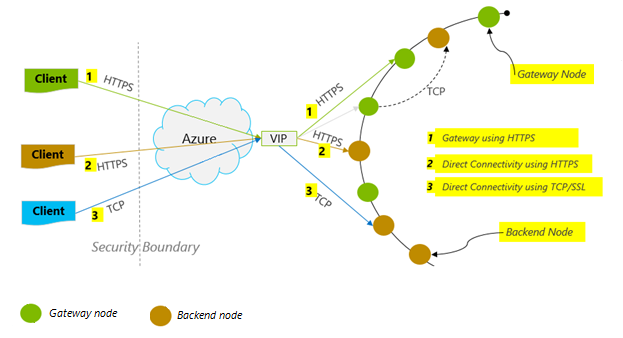

<properties 
    pageTitle="DocumentDB 效能秘訣 |Microsoft Azure" 
    description="瞭解以提升 Azure DocumentDB 資料庫效能的用戶端設定選項"
    keywords="如何改善資料庫效能"
    services="documentdb" 
    authors="mimig1" 
    manager="jhubbard" 
    editor="" 
    documentationCenter=""/>

<tags 
    ms.service="documentdb" 
    ms.workload="data-services" 
    ms.tgt_pltfrm="na" 
    ms.devlang="na" 
    ms.topic="article" 
    ms.date="10/17/2016" 
    ms.author="mimig"/>

# DocumentDB 效能的秘訣

Azure DocumentDB 是快速且有彈性的分散式的資料庫，調整完美保證的延遲與處理量。 您沒有變更主要的搜尋結構，或撰寫複雜的程式碼，若要縮放與 DocumentDB 資料庫。 向上和向下調整是只要簡單以進行單一 API 通話或[SDK 方法呼叫](documentdb-performance-levels.md#changing-performance-levels-using-the-net-sdk)。 不過，因為透過網路電話存取 DocumentDB 是您可以對達到最大使用量效能的用戶端最佳化。

因此，如果您要請求 」 如何改善我資料庫效能？ 」 請考慮下列選項︰

## 網路

1. **連線原則︰ 使用直接連線模式**
    
    用戶端如何連線到 Azure DocumentDB 效能，尤其是而言觀察用戶端延遲具有重要的含意。 有適用於設定用戶端原則連線 – 連線*模式*和[連線*通訊協定*](#connection-protocol)的兩個主要的設定。  有兩種可用模式︰

    1. 閘道器模式 （預設）
    2. 直接模式

    由於 DocumentDB 分散式的儲存系統，DocumentDB 資源，例如集合分割跨許多電腦與每個資料分割複寫高可用性等。 邏輯的實體地址的翻譯會保留在路由資料表中，也是設為 「 資源內部可用。

    閘道器模式中 DocumentDB 閘道器電腦執行此路由]，藉此讓十分簡單精簡的用戶端程式碼。 用戶端應用程式的翻譯後端] 節點的實體地址邀請中的邏輯 URI 和適當轉寄邀請的 DocumentDB 閘道器電腦發出邀請。  相反地，直接模式中的用戶端必須維護 – 定期更新 – 本表路由複本，並直接連接到後端 DocumentDB 節點。

    閘道器模式支援所有 SDK 平台上，並為設定預設值。  如果您的應用程式執行公司網路中使用嚴格防火牆限制，閘道模式是最佳的選擇，因為它會使用標準 HTTPS 連接埠和單一端點。 對於效能的影響，不過，是每次讀取或寫入 DocumentDB 閘道模式牽涉到其他網路躍點。   因此，直接模式會提供更佳的效能，因為較少的網路躍點。

2. **連線原則︰ 使用的 TCP 通訊協定**

    當利用直接模式，有兩種可用的通訊協定選項︰

    - TCP
    - HTTPS

    DocumentDB 提供簡單，並開啟 RESTful 程式設計模型透過 HTTPS。 此外，提供高效率 TCP 通訊協定，也會 RESTful 及其通訊模型，並可透過.NET 用戶端 SDK。 直接的 TCP 及 HTTPS 同時使用 SSL 初始驗證及加密流量。 最佳效能，請使用 [TCP 通訊協定盡可能。 

    使用時 TCP 閘道器模式中，TCP 連接埠 443 DocumentDB 連接埠，而 10250 是 MongoDB API 的連接埠。 使用時 TCP 在直接模式中，除了閘道器連接埠，您會需要確認連接埠 10000 和 20000 的範圍之間已開啟，因為 DocumentDB 使用動態 TCP 連接埠。 如果無法開啟下列連接埠，且您嘗試使用 TCP，您會收到 503 服務無法使用的錯誤。 

    建構 DocumentClient 執行個體和 ConnectionPolicy 參數的期間設定連線模式。 如果使用直接模式時，也可以設定通訊協定內 ConnectionPolicy 參數。

        var serviceEndpoint = new Uri("https://contoso.documents.net");
        var authKey = new "your authKey from Azure Mngt Portal";
        DocumentClient client = new DocumentClient(serviceEndpoint, authKey, 
        new ConnectionPolicy
        {
            ConnectionMode = ConnectionMode.Direct,
            ConnectionProtocol = Protocol.Tcp
        });

    因為 TCP 才支援在直接模式中，使用閘道器模式，接著 HTTPS 通訊協定一律使用進行通訊的閘道器，然後 ConnectionPolicy 的通訊協定值會忽略。

    

3. **若要避免在第一次要求啟動延遲 OpenAsync 的通話**

    根據預設，因為它來擷取位址路由表的第一個要求時，會有較高的延遲。 若要避免此的啟動延遲的第一個要求，您應致電 OpenAsync() 一次在初始化期間，如下所示。

        await client.OpenAsync();

4. **若非相同 Azure 效能區域中的用戶端**

    可能的話，請將呼叫 DocumentDB DocumentDB 資料庫為相同的區域中的任何應用程式。 在同一個區域中的來電至 DocumentDB 完成內 1 到 2 ms 大約比較，但西部及的美國東部海岸之間的延遲 > 50 ms。 此延遲可能可以有所不同要求要求路由至 Azure 資料中心邊界經過從用戶端所要求。 最低可能延遲，以確保呼叫的應用程式位於相同的 Azure 地區能夠 DocumentDB 端點達成。 可用的區域的清單，請參閱[Azure 區域](https://azure.microsoft.com/regions/#services)。

    

5. **增加執行緒/任務數量**

    由於在網路上進行的來電至 DocumentDB 時，您可能需要變更您的要求的平行度，以便用戶端應用程式也需要花費很少等候要求之間的時間。 例如，如果您使用。網路的[任務平行文件庫](https://msdn.microsoft.com//library/dd460717.aspx)，建立 100 s 讀取或寫入 DocumentDB 工作的順序。

## SDK 的使用方式

1. **安裝最新的 SDK**

    DocumentDB Sdk 會持續正在改良，可提供最佳效能。 請參閱判斷最新的 SDK，並檢閱改善[DocumentDB SDK](documentdb-sdk-dotnet.md)頁面。 

2. **使用單一 DocumentDB 用戶端應用程式的存留時間**
  
    請注意，每個 DocumentClient 執行個體是安全執行緒執行有效率的連線管理及在直接模式中操作時，地址快取。 若要允許有效連線管理和 DocumentClient 以更佳的效能，建議使用應用程式的存留時間 DocumentClient AppDomain 每一個執行個體。

3. **每個主機增加 System.Net MaxConnections**

    DocumentDB 要求透過 HTTPS/其餘根據預設，並對每個主機名稱或 IP 位址的預設連線限制。 您可能需要將 MaxConnections 設定為較高的值 (100-1000)，以便用戶端文件庫可以利用多個同時 DocumentDB 連線。 在.NET SDK 1.8.0，上方[ServicePointManager.DefaultConnectionLimit](https://msdn.microsoft.com/library/system.net.servicepointmanager.defaultconnectionlimit.aspx)的預設值是 50，且若要變更的值，您可以將[Documents.Client.ConnectionPolicy.MaxConnectionLimit](https://msdn.microsoft.com/en-us/library/azure/microsoft.azure.documents.client.connectionpolicy.maxconnectionlimit.aspx)為較高的值。  

4. **微調分割集合平行查詢**

     DocumentDB.NET SDK 版本 1.9.0 支援平行查詢，讓您在查詢中平行分割的集合上方 （請參閱[使用 Sdk](documentdb-partition-data.md#working-with-the-sdks)和相關的[的程式碼範例](https://github.com/Azure/azure-documentdb-dotnet/blob/master/samples/code-samples/Queries/Program.cs)的詳細資訊）。 平行查詢的設計改善其循序對應的查詢延遲和處理量。 平行查詢提供兩個參數，使用者可以調整成自訂符合其需求，（a) MaxDegreeOfParallelism︰ 控制磁碟分割區的最大的數字，比可查詢平行和 （b) MaxBufferedItemCount︰ 控制預先擷取結果的數字。 
    
    （a)***調整 MaxDegreeOfParallelism\: *** 
   查詢多個資料分割平行查詢運作。 不過，提供解答查詢時循序讀取個別的分割收集的資料。 因此，設定 MaxDegreeOfParallelism 磁碟分割區的數目有達成大部分的效能查詢的最大的機會提供所有其他系統條件維持不變。 如果您不知道的磁碟分割區數，您可以將 MaxDegreeOfParallelism 為較高的數字，，系統將會選擇 MaxDegreeOfParallelism 為最小值 （的磁碟分割區，提供使用者輸入的數字）。 
    
    請務必請注意，平行查詢產生最佳的優點，是否資料平均分佈於目前提供解答查詢的所有磁碟分割。 如果分割的集合分割方式都將全部或大部分的查詢所傳回的資料集中在幾個磁碟分割區 （一個磁碟分割表現最差的大小寫），然後查詢的效能會影響這些資料分割。 
    
    （b)***調整 MaxBufferedItemCount\: *** 
   平行查詢設計用來處理用戶端目前批次的結果時，預先擷取結果。 預先讀取有助於整體查詢延遲改進。 MaxBufferedItemCount 是參數以限制的預先擷取的結果。 設定 MaxBufferedItemCount 預期的數字傳回的結果 （或更高的數字） 會讓查詢，從預先讀取接收最大優點。 
    
    請注意，預先讀取是相同的不管 MaxDegreeOfParallelism，資料有單一緩衝從所有磁碟分割的資料。  

5. **伺服器端 GC 開啟**
    
    在某些情況下協助降低回收的頻率。 在.NET 設定[gcServer](https://msdn.microsoft.com/library/ms229357.aspx)為 true。

6. **實作輪詢間隔 RetryAfter**
 
    效能在測試期間，您應該增加載入，直到要求的小型速率取得經流速控制。 如果經流速控制，用戶端應用程式會針對伺服器指定重試間隔應該上流速輪詢。 尊重輪詢可確保您花最少的時間等待重試之間。 重試原則支援會包含在版本 1.8.0 DocumentDB [.NET](documentdb-sdk-dotnet.md) [Java](documentdb-sdk-java.md)和版本 1.9.0 和上方[Node.js](documentdb-sdk-node.md)和[Python](documentdb-sdk-python.md)。 如需詳細資訊，請參閱[Exceeding 保留處理量限制](documentdb-request-units.md#exceeding-reserved-throughput-limits)和[RetryAfter](https://msdn.microsoft.com/library/microsoft.azure.documents.documentclientexception.retryafter.aspx)。

7. **查看您的用戶端工作量不按比例縮放**

    如果您正在測試高處理量層級 (> 50000 RU/s)，用戶端應用程式可能會變得瓶頸電腦須出有關 CPU 或網路的使用狀況。 如果您到達此點時，您可以繼續推進一步 DocumentDB 帳戶所用戶端應用程式在多個伺服器。

8. **快取文件 Uri 下方的讀取延遲**

    快取文件 Uri 盡可能最佳化讀的效能。

9. **調整的較佳的效能的查詢/已讀取摘要的頁面大小**

    執行大量的讀取時使用讀取文件摘要功能 (亦即 ReadDocumentFeedAsync)，或如果結果集太大時發出 DocumentDB SQL 查詢，將結果會傳回以分段方式。 根據預設，結果會傳回 100 個項目或 1 MB 的區塊，不論限制是按第一個]。 

    若要減少的網路往返擷取所有適用的結果，您可以增加使用 x-ms-最大值的項目-計算要求標頭，為最 1000年的頁面大小。 在要顯示 [只有幾個結果的情況下例如，如果您的使用者介面或應用程式 API 會傳回只有 10 結果時間，您也可以減少 10 減少耗用的讀取及查詢的處理能力頁面大小。

    您也可以設定使用可用的 DocumentDB Sdk 的頁面大小。  例如︰
    
        IQueryable<dynamic> authorResults = client.CreateDocumentQuery(documentCollection.SelfLink, "SELECT p.Author FROM Pages p WHERE p.Title = 'About Seattle'", new FeedOptions { MaxItemCount = 1000 });

10. **增加執行緒/任務數量**

    請參閱 [網路] 區段中的 [[增加執行緒/任務數量](#increase-threads)。

## 編製索引的原則

1. **使用更快速的最大使用量時間 ingestion 比率麻煩編製索引**

    DocumentDB 可讓您指定 – 集合層級 – 編製索引的原則，可讓您選擇 [是否您想要或不會自動建立索引的集合中的文件。  此外，您也可以選擇同步 （一致） 之間非同步 (Lazy) 索引更新。 根據預設，更新索引同步在每個插入、 [取代] 或 [刪除的文件集合。 同步模式可讓執行相同[的一致性層級](documentdb-consistency-levels.md)的文件讀取，而不會索引 」 掌握 「 任何延遲的查詢。
    
    延遲編製索引作業可能會被視為的案例中高速量，撰寫資料，而您想要 amortize 一段較長時間內容索引所需的工作量。 延遲編製索引作業也可讓您有效地使用您能夠處理量，並在最大使用量時間服務寫入的要求，最小的延遲。 請務必請注意，啟用麻煩編製索引作業時，查詢結果將會最後一致無論 DocumentDB 帳戶設定的一致性層級。

    因此，一致編製索引的模式 （設定為一致的 IndexingPolicy.IndexingMode） 必須支付每寫入、 Lazy 模式 （IndexingPolicy.IndexingMode 設定為 [Lazy） 並沒有編製索引編製索引作業時最高的要求單位收費 （IndexingPolicy.Automatic 設定為 False） 寫入時間在具有零編製索引的成本。

2. **排除編製索引的更快速地將未使用過的路徑**

    DocumentDB 的編製索引原則也可讓您指定的文件路徑，來包含或排除編製索引作業利用編製索引的路徑 （IndexingPolicy.IncludedPaths 和 IndexingPolicy.ExcludedPaths）。 使用編製索引作業路徑編製索引的成本直接相互關聯的唯一索引的路徑數時，可提供改良的寫入效能與案例事先已知查詢模式會較低索引的儲存空間。  下列程式碼，例如，顯示如何 （又名排除整個章節的文件 子樹） 編製索引使用 「 * 」 萬用字元。

        var collection = new DocumentCollection { Id = "excludedPathCollection" };
        collection.IndexingPolicy.IncludedPaths.Add(new IncludedPath { Path = "/*" });
        collection.IndexingPolicy.ExcludedPaths.Add(new ExcludedPath { Path = "/nonIndexedContent/*");
        collection = await client.CreateDocumentCollectionAsync(UriFactory.CreateDatabaseUri("db"), excluded);

    如需詳細資訊，請參閱[DocumentDB 編製索引的原則](documentdb-indexing-policies.md)。

## 處理量

1. **測量及調整為較低的要求單位/第二個使用方式**

    DocumentDB 提供豐富的資料庫作業包括關聯式和階層式的查詢，Udf、 預存程序與引動程序 – 所有作業系統上資料庫集合中的文件。 這種操作的相關聯的成本會根據 CPU IO，與完成作業所需的記憶體而定。 而非思考和管理硬體資源，您可以想像要求單位 (RU) 的所需執行各種不同的資料庫作業與服務應用程式要求的資源的單一量值。

    根據您所購買的容量單位數量每個資料庫帳戶佈建[要求單位](documentdb-request-units.md)。 要求單位耗用的評估方式秒。 超過能夠的要求單位工資率的帳戶，限制，直到工資率低於帳戶的保留層級的應用程式。 如果您的應用程式需要較高層級的處理量，您可以購買額外的容量單位。

    複雜的查詢會影響作業使用要求單位數量。 述詞數目、 性質述詞與 Udf 的數字的所有來源資料集大小會影響查詢作業的成本。

    若要測量的任何作業開銷 （建立、 更新或刪除），檢查 x ms-要求免費頁首 (或相當於 RequestCharge 屬性中 ResourceResponse<T>或 FeedResponse<T> .NET sdk) 測量由下列作業的要求單位數量。

        // Measure the performance (request units) of writes
        ResourceResponse<Document> response = await client.CreateDocumentAsync(collectionSelfLink, myDocument);
        Console.WriteLine("Insert of document consumed {0} request units", response.RequestCharge);
        // Measure the performance (request units) of queries
        IDocumentQuery<dynamic> queryable = client.CreateDocumentQuery(collectionSelfLink, queryString).AsDocumentQuery();
        while (queryable.HasMoreResults)
             {
                  FeedResponse<dynamic> queryResponse = await queryable.ExecuteNextAsync<dynamic>();
                  Console.WriteLine("Query batch consumed {0} request units", queryResponse.RequestCharge);
             }
        
    此標頭中傳回要求費用是您能夠進行處理量的分數 (亦即 2000 RUs / 第二個)。 例如，如果上述查詢會傳回 1000年 1 KB 文件，作業的成本會 1000年。 因此，內一個第二個伺服器會優先處理只有兩個這類要求之前節流後續要求。 如需詳細資訊，請參閱[要求單位](documentdb-request-units.md)] 及 [[要求單位計算機](https://www.documentdb.com/capacityplanner)。

2. **處理太大的工資率要求限制工資率**

    當用戶端嘗試超過帳戶的保留處理能力時，有任何效能降低的伺服器並不會使用超過保留層級的處理量容量。 伺服器主動會結束 RequestRateTooLarge （HTTP 狀態碼 429） 邀請，並傳回指出所需的時間，以毫秒為單位，使用者必須等待正在重新嘗試要求的 x-ms-重試-之後-ms 頁首。
 
        HTTP Status 429,
        Status Line: RequestRateTooLarge
        x-ms-retry-after-ms :100

    Sdk 所有隱含攔截此回應、 尊重伺服器指定重試之後頁首，並再次要求。 除非您的帳戶存取同時以多個用戶端下, 一步重試就會失敗。

    如果您有一個以上的用戶端累積起來操作要求率上方的 [一致的方式，目前 9 內部來設定用戶端的預設重試計數不可以解決問題。在此案例中，用戶端就會擲回狀態碼 429 DocumentClientException 應用程式。 變更預設重試計數可設定 RetryOptions ConnectionPolicy 執行個體。 根據預設，狀態碼 429 DocumentClientException 會傳回 30 秒的累計時間後，如果要求會繼續運作上方要求率。 發生這種情況即使當目前重試計數小於最大重試計數，可能是預設的 9 或使用者定義的值。

    時自動重試行為有助於改善恢復，大部分的應用程式的可用性，它可能來自在 odds 的情況時執行效能基準，尤其是測量延遲。  如果實驗結果的伺服器流速，會造成用戶端自動重試 SDK，將特殊的用戶端觀察延遲。 若要避免延遲特殊圖文集效能實驗期間，測量所傳回的每一項作業收費並確保要求的作業系統保留的要求工資率] 下方。 如需詳細資訊，請參閱[要求單位](documentdb-request-units.md)。
   
3. **設計為較高的處理量較小的文件**

    指定作業的要求收費 （亦即要求處理成本） 是直接關聯的文件大小。 在大型文件上的作業成本超過一個小型文件的作業。

## 一致性層級

1. **使用更好的讀取延遲弱一致性層級**

    調整 DocumentDB 應用程式的效能是一致性層級時，請考慮另一個重要的因素。 選擇的一致性層級會影響效能讀取和寫入兩者均適用。 您可以設定預設的一致性層級資料庫帳戶和所選的一致性層級會套用至所有集合 （之間的所有資料庫） DocumentDB 帳戶內。 寫入作業，以變更一致性層級的影響被觀察為要求延遲。 為使用更嚴密的一致性層級時，會增加寫入延遲。 相反地，在讀取作業的一致性層級的影響觀察處理量。 弱層級允許較高的一致性閱讀處理量，以便用戶端。

    依預設所有讀取及使用者定義的資源對發出的查詢會都使用預設的一致性層級指定資料庫帳戶。 不過，可以指定 x ms-一致性等級要求標頭以降低特定的讀取查詢要求的一致性層級。 如需詳細資訊，請參閱[DocumentDB 中的一致性層級](documentdb-consistency-levels.md)。

## 後續步驟

用來評估 DocumentDB 高效能案例幾個用戶端電腦上的範例應用程式，請參閱[效能和 Azure DocumentDB 以測試的小數位數](documentdb-performance-testing.md)。

此外，若要進一步瞭解設計小數位數和高效能應用程式，請參閱[Partitioning 和 Azure DocumentDB 中的縮放比例](documentdb-partition-data.md)。
