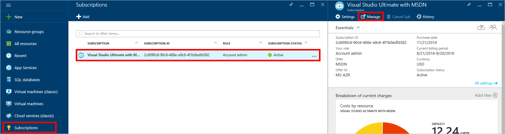

<properties
    pageTitle="疑難排解 DocumentDB 入口網站的問題 |Microsoft Azure"
    description="找出解決 DocumentDB Azure 入口網站中的問題。" 
    services="documentdb"
    documentationCenter=""
    authors="mimig1"
    manager="jhubbard"
    editor="monicar"/>

<tags
    ms.service="documentdb"
    ms.workload="data-services"
    ms.tgt_pltfrm="na"
    ms.devlang="na"
    ms.topic="article"
    ms.date="08/29/2016"
    ms.author="mimig"/>

# Azure DocumentDB 入口網站的疑難排解提示

本文將說明如何解決 DocumentDB Azure 入口網站中的問題。 

## 資源遺失

**問題**︰ 資料庫或集合中沒有您入口網站刀。

**解決方案**︰ 降低下集合的最大處理量配額運作的應用程式使用方式。 

**說明**︰ 入口網站可等任何其他撥打電話至 DocumentDB 資料庫及集合應用程式。 如果您的要求目前正在經流速控制因為從另一個應用程式正在進行通話，入口網站可能也會經流速控制，導致無法在要顯示在入口網站的資源。 若要解決此問題，解決高處理量使用方式的原因，然後重新整理入口網站刀。 [效能秘訣](documentdb-performance-tips.md)文章[處理量](documentdb-performance-tips.md#throughput)一節中找如何測量及較低的處理量使用方式的詳細資訊。
 
## 頁面或刀將無法載入

**問題**︰ 頁面與刀入口網站中的不會顯示。

**解決方案**︰ 降低下集合的最大處理量配額運作的應用程式使用方式。 

**說明**︰ 入口網站可等任何其他撥打電話至 DocumentDB 資料庫及集合應用程式。 如果您的要求目前正在經流速控制因為從另一個應用程式正在進行通話，入口網站可能也會經流速控制，導致無法在要顯示在入口網站的資源。 若要解決此問題，解決高處理量使用方式的原因，然後重新整理入口網站刀。 [效能秘訣](documentdb-performance-tips.md)文章[處理量](documentdb-performance-tips.md#throughput)一節中找如何測量及較低的處理量使用方式的詳細資訊。

## 新增集合] 按鈕

**問題**︰ 資料庫刀中，在 [**新增集合**] 按鈕會停用。

**說明**︰ 如果 Azure 訂閱相關聯的優勢貸項總計，例如從 MSDN 訂閱、 提供的免費貸項總計，且使用您的信用額度總計的所有月份，您無法建立 DocumentDB 的任何其他的集合。

**解決方案**︰ 移除您的帳戶中的費用限制。

1. Azure 入口網站內，Jumpbar 中，按一下 [**訂閱**DocumentDB 資料庫，相關聯的訂閱，然後按一下然後在 [**訂閱**刀中，按一下 [**管理**。 
    

2. 在新瀏覽器視窗中，您會看到您的簡訊。 按一下要移除花費只有目前的計費週期或無限期**移除費用限制**] 按鈕。 然後完成精靈，若要新增或確認您的信用卡資訊。 
    

 
## 查詢總管完成但發生錯誤

請參閱[疑難排解查詢檔案總管](documentdb-query-collections-query-explorer.md#troubleshoot)。

## 沒有在監視磚中可用的資料

請參閱[疑難排解監控磚](documentdb-monitor-accounts.md#troubleshooting)。

## 傳回在文件總管] 中的文件

請參閱[疑難排解文件檔案總管](documentdb-view-json-document-explorer.md#troubleshoot)。

## 後續步驟

如果您仍然會發生問題，在入口網站，請以電子郵件[askdocdb@microsoft.com](mailto:askdocdb@microsoft.com)的協助或檔案的支援要求入口網站中，按一下 [**瀏覽**，**說明 + 支援**]，然後按一下 [**建立支援要求**。
