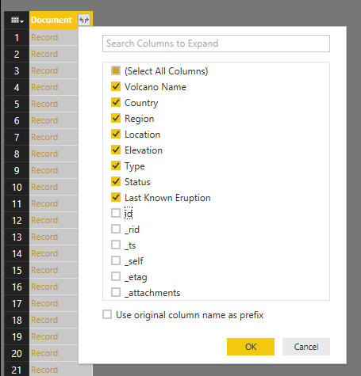
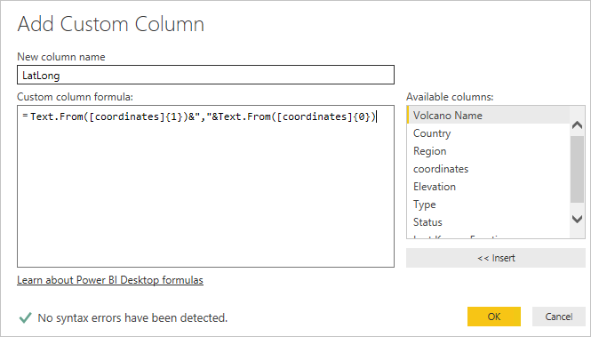

<properties
    pageTitle="Power BI 教學課程 DocumentDB 連接器 |Microsoft Azure"
    description="使用此 Power BI 教學課程來匯入 JSON、 建立詳細的報表，並以視覺化方式呈現資料使用 DocumentDB 和 Power BI 的連接器。"
    keywords="power bi 的教學課程，以視覺化方式呈現資料，power bi 連接器"
    services="documentdb"
    authors="h0n"
    manager="jhubbard"
    editor="mimig"
    documentationCenter=""/>

<tags
    ms.service="documentdb"
    ms.workload="data-services"
    ms.tgt_pltfrm="na"
    ms.devlang="na"
    ms.topic="article"
    ms.date="09/22/2016"
    ms.author="hawong"/>

# DocumentDB 的 power BI 教學課程︰ 以視覺化方式呈現資料使用 Power BI 連接器

[PowerBI.com](https://powerbi.microsoft.com/)是您可以在其中建立及共用資料的重要事項您和組織儀表板和報表的線上服務。  Power BI Desktop 是專用的報表撰寫工具，可讓您從各種不同資料來源擷取資料、 合併及轉換資料、 建立功能強大的報表和視覺效果，並將報表發佈至 Power BI。  與最新版的 Power BI Desktop 中，您現在可以連線到 DocumentDB 帳戶 DocumentDB 連接器透過 Power bi。   

在此 Power BI 教學課程中，我們可以逐一進行連線至 Power BI Desktop 中 DocumentDB 帳戶、 瀏覽至 [集合，我們想要用來擷取資料使用 [導覽]，將 JSON 資料轉換成表格的格式，使用 Power BI 桌面查詢編輯器] 的步驟，建立並將報表發佈到 PowerBI.com。

完成本 Power BI 教學課程之後，您便可以回答下列問題︰  

-   如何建立使用資料的報表從 DocumentDB 使用 Power BI Desktop？
-   如何連線到 Power BI Desktop 中 DocumentDB 帳戶？
-   如何從 Power BI Desktop 中集合擷取資料？
-   如何在 Power BI Desktop 中的巢狀的 JSON 資料轉換？
-   如何發佈及共用我的報表中 PowerBI.com 嗎？

## 必要條件

之前的指示執行此 Power BI 教學課程中，請確定您有下列動作︰

- [最新版的 Power BI Desktop](https://powerbi.microsoft.com/desktop)。
- 我們示範帳戶或您的 Azure DocumentDB 帳戶中的資料存取權。
    - 示範帳戶會填入火山所顯示的資料在本教學課程。 此示範帳戶沒有任何 Sla 的繫結，而且僅供示範。  我們保留權利，來修改此示範帳戶包括但不是限於︰ 終止帳戶變更索引鍵、 限制存取，請變更並刪除資料，隨時沒有預先通知或原因。
        - URL: https://analytics.documents.azure.com
        - 唯讀索引鍵︰ MSr6kt7Gn0YRQbjd6RbTnTt7VHc5ohaAFu7osF0HdyQmfR + YhwCH2D2jcczVIR1LNK3nMPNBD31losN7lQ/fkw = =
    - 或者，若要建立您自己的帳戶，請參閱[建立 DocumentDB 資料庫帳戶使用 Azure 入口網站](https://azure.microsoft.com/documentation/articles/documentdb-create-account/)。 若要取得範例火山內容類似的資料在本教學課程中使用 （但不包含 GeoJSON 區塊），請參閱[NOAA 網站](https://www.ngdc.noaa.gov/nndc/struts/form?t=102557&s=5&d=5)然後再匯入的資料使用[DocumentDB 資料移轉工具](https://azure.microsoft.com/documentation/articles/documentdb-import-data/)。

若要共用您的報表中 PowerBI.com，您必須有 PowerBI.com 的帳戶。  若要進一步瞭解 Power BI 的空閒和 Power BI Pro，請造訪[https://powerbi.microsoft.com/pricing](https://powerbi.microsoft.com/pricing)。

## 我們開始吧 ！
在本教學課程，假設您是研究火山世界各地的 geologist。  火山資料會儲存在 DocumentDB 帳戶，JSON 文件看起來如下。

    {
        "Volcano Name": "Rainier",
        "Country": "United States",
        "Region": "US-Washington",
        "Location": {
            "type": "Point",
            "coordinates": [
            -121.758,
            46.87
            ]
        },
        "Elevation": 4392,
        "Type": "Stratovolcano",
        "Status": "Dendrochronology",
        "Last Known Eruption": "Last known eruption from 1800-1899, inclusive"
    }

您想要從 DocumentDB 帳戶擷取火山資料，並以視覺化方式呈現下方所示的互動式 Power BI 報表中的資料。

準備嘗試一下了嗎？ 我們開始吧。

1. 在工作站上執行 Power BI Desktop。
2. 一旦啟動 Power BI Desktop，會顯示 [*歡迎使用*] 畫面。

    

3. 您可以**取得資料**，請參閱**最近的來源**或**開啟的其他報告**，直接從 [*歡迎使用*] 畫面。  按一下右上角的 X 來關閉畫面。 Power BI Desktop 中的 [**報表**] 檢視會顯示。

    

4. 選取 [**常用]**功能區]，然後按一下**取得資料**。  [**取得資料**] 視窗應該會出現。

5. 按一下**Azure**上的 [選取**Microsoft Azure DocumentDB （beta 版）**，，再按一下 [**連線**。  應該會出現 [ **Microsoft Azure DocumentDB 連線**] 視窗。

    

6. 指定 DocumentDB 帳戶端點 URL 您想要擷取的資料，如下所示，然後按一下**[確定]**。 您可以從 Azure 入口網站的 [URI] 方塊中**[鍵](documentdb-manage-account.md#keys)**刀擷取 URL 或您可以使用的示範帳戶，在這種情況下 URL 是`https://analytics.documents.azure.com`。 

    留空白的資料庫名稱、 集合名稱及 SQL 陳述式為這些欄位是選用。  不過，我們會使用 [導覽] 來選取資料庫及集合，若要識別從收集的資料。

    ![Power BI 教學課程 DocumentDB Power BI 連接器-桌面連線] 視窗](./media/documentdb-powerbi-visualize/power_bi_connector_pbiconnectwindow.png)

7. 如果您第一次連線到此端點，系統會提示您的 [帳戶金鑰]。  您可以從**主索引鍵**的方塊中**[唯讀鍵](documentdb-manage-account.md#keys)**刀 Azure 入口網站中，擷取金鑰，或者您可以使用大小寫索引鍵是示範帳戶`RcEBrRI2xVnlWheejXncHId6QRcKdCGQSW6uSUEgroYBWVnujW3YWvgiG2ePZ0P0TppsrMgscoxsO7cf6mOpcA==`。 輸入 [帳戶金鑰]，然後按一下 [**連線**]。

    我們建議您在建立報表時使用 [唯讀] 鍵。  這可防止不必要的主索引鍵的曝光潛在安全性風險。 從 Azure 入口網站的[按鍵](documentdb-manage-account.md#keys)刀有 [唯讀] 鍵，或者您可以使用上方所提供的示範帳戶資訊。

    ![Power BI 教學課程 DocumentDB Power BI 連接器-帳戶金鑰]](./media/documentdb-powerbi-visualize/power_bi_connector_pbidocumentdbkey.png)

8. 帳戶已成功連線時，會出現**導覽]** 。  **導覽]**會顯示資料庫的帳號] 之下的清單。
9. 按一下，如果您使用的示範帳戶，選取**volcanodb**展開資料庫報表的資料來源] 的位置。   

10. 現在，選取您將會擷取資料的集合。 如果您使用的示範帳戶，請選取 [ **volcano1**]。

    [預覽] 窗格會顯示**記錄**項目的清單。  為 Power BI 中的**記錄**類型，表示文件。 同樣地，在文件內的巢狀的 JSON 區塊也是**記錄**。

    ![Power BI 教學課程 DocumentDB Power BI 連接器-導覽器] 視窗](./media/documentdb-powerbi-visualize/power_bi_connector_pbinavigator.png)

11. 按一下 [**編輯**] 以啟動 [查詢編輯器] 中，我們可以轉換資料。

## 簡維及轉換 JSON 文件
1. 在 Power BI 查詢編輯器中，您應該會看到**文件**中的資料行的中央窗格。

2. 按一下**文件**欄標題右側的展開工具。  欄位清單的內容功能表會顯示。  選取您的報表，請執行個體，火山名稱、 國家/地區、 區域、 位置、 提高權限、 類型、 狀態及最後一個知道 Eruption，您需要的欄位，然後按一下**[確定]**。

    

3. 中間窗格會顯示結果的預覽，與選取的欄位。

    

4. 此範例中，在 [位置] 屬性是 GeoJSON 區塊文件中。  如您所見，表示為 Power BI Desktop 中的**記錄**類型的位置。  
5. 按一下 [位置] 欄標題右側的展開工具。  會顯示 [類型] 和 [座標欄位的內容功能表。  現在就讓我們選取座標欄位，然後按一下**[確定**]。

    

6. 中間窗格現在會顯示**清單**類型座標資料的行。  如下圖所示的教學課程開頭，GeoJSON 資料在本教學課程為點類型緯度和經度錄製座標陣列中的值。

    座標 [0] 項目表示經度，而 [1] 座標代表緯度。
    

7. 若要簡維座標陣列，我們會建立稱為 LatLong**自訂資料行**。  選取 [**加入資料行**功能區，然後按一下 [**新增自訂資料行**。  **新增自訂資料行**視窗應該會出現。

8. 提供新的資料行，例如 LatLong 的名稱。

9. 接下來，指定自訂新的資料行公式。  我們的範例中，我們會串連緯度和經度值如下所示使用下列公式，並以逗號分隔︰ `Text.From([Document.Location.coordinates]{1})&","&Text.From([Document.Location.coordinates]{0})`。 按一下**[確定]**。

    如需在資料分析運算式 (DAX) 包括 DAX 函數，請造訪[Power BI Desktop 中基本 DAX](https://support.powerbi.com/knowledgebase/articles/554619-dax-basics-in-power-bi-desktop)。

    

10. 現在，中間窗格會顯示新的 LatLong 欄填入以逗號分隔的緯度和經度值。

    

    如果您收到新的資料行中的錯誤，請確定已套用的步驟，在 [查詢設定] 底下，符合下圖︰

    

    如果您的步驟不同，刪除的額外步驟，然後再試一次新增自訂資料行。 

11. 現在，我們已完成簡資料維到表格格式。  您可以利用所有可使用 [查詢編輯器中圖案的功能及轉換 DocumentDB 中的資料。  如果您使用範例，變更**常用**功能區上的**資料類型**的資料類型變更為**整數**提高權限。

    

12. 按一下 [**關閉] 和 [套用]**以儲存資料模型。

    

## 建立報表
Power BI 桌面報表檢視是您可以開始建立報表，以視覺化方式呈現資料。  您可以建立報表欄位拖放到**報表**畫布。

在 [報表] 檢視中，您應該看到︰

 1. [**欄位**] 窗格中，這是您會看到資料模型，您可以使用您的報表的欄位清單的位置。

 2. [**視覺效果**] 窗格中。 報表可以包含一個或多個視覺效果。  挑選適合您的需求，從 [**視覺效果**] 窗格的視覺類型。

 3. **報表**畫布中，這是您會在其中建立報表視覺效果。

 4. [**報表**] 頁面。 您可以在 Power BI Desktop 中新增多個報表頁面。

以下所示建立簡單的互動式地圖檢視報表的基本的步驟。

1. 此範例中，我們將建立地圖檢視顯示每個火山的位置。  在 [**視覺效果**] 窗格中，按一下地圖視覺類型醒目提示在上述螢幕擷取畫面。  您應該會看到**報表**畫布上繪製的地圖視覺類型。  **視覺效果**窗格應也會顯示一組相關的地圖視覺類型的屬性。

2. 現在，拖放 LatLong 欄位從 [**欄位**] 窗格以在**視覺效果**] 窗格中的 [**位置**] 屬性。
3. 接下來，拖放到 [**圖例**] 屬性的火山名稱] 欄位。  

4. 然後拖放提高權限的功能變數，[**大小**] 屬性。  

5. 您現在應該會看到地圖視覺顯示一組的權限提高火山相互關聯泡泡的大小與位置的每個火山代表的泡泡圖。

6. 您現在已經建立基本報表。  您可以新增其他視覺效果，進一步自訂報表。  在此例中，我們會新增火山類型交叉分析篩選器以互動式報表。  

    

## 發佈及共用您的報表
若要共用您的報表，您必須有 PowerBI.com 的帳戶。

1. 在 Power BI Desktop 中，按一下 [上**常用**功能區。
2. 按一下 [**發佈**]。  系統會提示您輸入 PowerBI.com 帳戶使用者名稱和密碼。
3. 一旦已驗證認證，報表發佈至您所選取的目的地。
4. 按一下 [以查看並共用您的報表上 PowerBI.com**開啟 「 PowerBITutorial.pbix' Power bi** ]。

    

## 在 [PowerBI.com 中建立儀表板

現在，您有報表時，可讓在 PowerBI.com 上共用筆記本

當您發佈到 PowerBI.com 從 Power BI Desktop 報表時，就會產生**報表**和**資料集**PowerBI.com 租用戶。 例如發佈稱為**PowerBITutorial**到 PowerBI.com 報表之後，您會看到**報表**」 和 「**資料集**的各節中的 PowerBITutorial PowerBI.com 上。

   ![新的 [報表] 和 [PowerBI.com 中的資料集的螢幕擷取畫面](./media/documentdb-powerbi-visualize/documentdb-powerbi-reports-datasets.png)

若要建立可共用儀表板，按一下 [**釘選 Live 頁面**] 按鈕在 PowerBI.com 報表上。

   ![新的 [報表] 和 [PowerBI.com 中的資料集的螢幕擷取畫面](./media/documentdb-powerbi-visualize/azure-documentdb-power-bi-pin-live-tile.png)

接著遵循[固定的磚從報表](https://powerbi.microsoft.com/documentation/powerbi-service-pin-a-tile-to-a-dashboard-from-a-report/#pin-a-tile-from-a-report)中的指示建立新的儀表板。 

您也可以建立儀表板之前執行臨機操作修改報表。 不過，建議您執行的修改，並重新發佈到 PowerBI.com 報表使用 Power BI Desktop。

## PowerBI.com 中重新整理資料

有兩種方法可以重新整理臨機操作與排程的資料。

臨機操作的重新整理，只要按一下以**資料集**，例如 PowerBITutorial eclipses （[…]）。 您應該會看到動作包括**立即重新整理**的清單。 按一下 [**立即重新整理**重新整理的資料。

排定的重新整理，請執行下列動作。

1. 在 [動作] 清單中，按一下 [**重新整理排程**]。 
    

2. 在 [**設定**] 頁面中，展開 [**資料來源的認證**]。 

3. 按一下 [**編輯認證**]。 

    設定快顯視窗隨即出現。 

4. 輸入連線到該資料集的 DocumentDB 帳戶金鑰，然後按一下 [**登入**]。 

5. 展開 [**重新整理排程**，設定您想要重新整理資料集的排程。 
  
6. 按一下 [**套用**並完成設定 [排定的重新整理。

## 後續步驟
- 若要進一步瞭解 Power BI，請參閱[開始使用 Power BI](https://powerbi.microsoft.com/documentation/powerbi-service-get-started/)。
- 若要進一步瞭解 DocumentDB 」 的資訊，請參閱[DocumentDB 登陸頁面的文件](https://azure.microsoft.com/documentation/services/documentdb/)。
