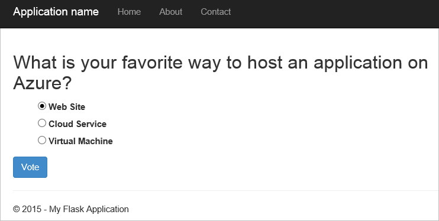

<properties
    pageTitle="使用 DocumentDB Python Flask Web 應用程式開發 |Microsoft Azure"
    description="檢閱資料庫教學課程中使用 DocumentDB 來儲存和存取裝載於 Azure Python Flask web 應用程式的資料。 尋找應用程式開發解決方案。" 
    keywords="應用程式開發、 資料庫教學課程，python flask、 python web 應用程式、 python web 開發、 documentdb、 azure、 Microsoft azure"
    services="documentdb"
    documentationCenter="python"
    authors="syamkmsft"
    manager="jhubbard"
    editor="cgronlun"/>

<tags
    ms.service="documentdb"
    ms.workload="data-management"
    ms.tgt_pltfrm="na"
    ms.devlang="python"
    ms.topic="hero-article"
    ms.date="08/25/2016"
    ms.author="syamk"/>

# <a name="python-flask-web-application-development-with-documentdb"></a>使用 DocumentDB Python Flask Web 應用程式開發

> [AZURE.SELECTOR]
- [.NET](documentdb-dotnet-application.md)
- [Node.js](documentdb-nodejs-application.md)
- [Java](documentdb-java-application.md)
- [Python](documentdb-python-application.md)

本教學課程教您如何使用 Azure DocumentDB 儲存並從 Python 存取資料 web 應用程式裝載於 Azure 假設您有使用 Python 和 Azure 網站先前經驗。

此資料庫教學課程涵蓋︰

1. 建立與佈建 DocumentDB 帳戶。
2. 建立 Python MVC 應用程式。
3. 連線至並使用 Azure DocumentDB web 應用程式。
4. 部署 Azure 網站 web 應用程式。

依照本教學課程中，您會建立一個簡單的投票應用程式，可讓您投票的投票。


## <a name="database-tutorial-prerequisites"></a>資料庫教學課程的先決條件

您應該之前遵循本文中的指示，請確定您有安裝下列︰

- 使用中的 Azure 帳戶。 如果您沒有帳戶，您可以建立的免費的試用帳戶在幾分鐘。 如需詳細資訊，請參閱[Azure 免費試用版](https://azure.microsoft.com/pricing/free-trial/)。
- [Visual Studio 2013](http://www.visualstudio.com/)或更新版本，或[Visual Studio Express]()，這是免費的版本。 專為 Visual Studio 2015 寫入本教學課程中的指示進行。 
- 從[GitHub](http://microsoft.github.io/PTVS/)Visual Studio Python 工具。 本教學課程中使用 Python 工具與 2015。 
- Visual Studio，2.4 或更新版本的 azure Python SDK [azure.com](https://azure.microsoft.com/downloads/)提供。 我們會將 Microsoft Azure SDK 用於 Python 2.7。
- 從[python.org]Python 2.7[2]。 我們使用 Python 2.7.11。 

> [AZURE.IMPORTANT] 如果您第一次安裝 Python 2.7，確定，在 [自訂 Python 2.7.11] 畫面中，您選擇 [**新增至路徑 python.exe**。
> 
>    

- 從[Microsoft 下載中心]python 2.7 Microsoft Visual c + + 編譯器[3]。

## <a name="step-1-create-a-documentdb-database-account"></a>步驟 1︰ 建立 DocumentDB 資料庫帳戶

現在就讓我們開始建立 DocumentDB 帳戶。 如果您已經有帳戶，您可以跳到[步驟 2︰ 建立新的 Python Flask web 應用程式](#step-2:-create-a-new-python-flask-web-application)。

[AZURE.INCLUDE [documentdb-create-dbaccount](../../includes/documentdb-create-dbaccount.md)]

<br/>
我們現在會逐步瞭解如何建立新的 Python Flask web 應用程式，從頭設定。

## <a name="step-2-create-a-new-python-flask-web-application"></a>步驟 2︰ 建立新的 Python Flask web 應用程式

1. 在 Visual Studio 中，按一下 [**檔案**] 功能表指向 [**新增**]，然後再按一下 [**專案**。

    [**新專案**] 對話方塊隨即出現。

2. 在左窗格中，展開**範本**，然後**Python**，，然後按一下 [**網頁**。 

3. 在中間窗格，然後在 [**名稱**] 方塊中輸入**教學課程中**，選取**Flask Web 專案**，然後按一下**[確定]**。 請記住，Python 套件名稱應全部小寫， [Python 程式碼的樣式指南](https://www.python.org/dev/peps/pep-0008/#package-and-module-names)所述。

    對於新 Python Flask，則可協助您更快速建立 web 應用程式中 Python web 應用程式開發架構。

    ![在 Visual Studio 中使用 Python 左側 Python Flask Web 專案名稱] 方塊中選取中間及名稱教學課程中醒目提示 [新增專案] 視窗的螢幕擷取畫面](./media/documentdb-python-application/image9.png)

4. 在 [ **Visual Studio Python 工具**] 視窗中，按一下 [**安裝至虛擬環境**。 

    

5. 在 [**新增虛擬環境**] 視窗中，您可以接受預設值，並 Python 2.7 作為基底的環境，因為 PyDocumentDB 目前不支援 Python 3.x，然後按一下 [**建立**。 這會設定為您的專案所需的 Python 虛擬環境。

    

    輸出視窗會顯示`Successfully installed Flask-0.10.1 Jinja2-2.8 MarkupSafe-0.23 Werkzeug-0.11.5 itsdangerous-0.24 'requirements.txt' was installed successfully.`環境已成功安裝。

## <a name="step-3-modify-the-python-flask-web-application"></a>步驟 3︰ 修改 Python Flask web 應用程式

### <a name="add-the-python-flask-packages-to-your-project"></a>新增至專案 Python Flask 套件

您的專案設定完成之後，您需要新增所需的 Flask 封裝至專案，包括 pydocumentdb，DocumentDB Python 套件。

1. 在方案總管中開啟檔案命名**requirements.txt** ，並以下列取代內容︰

        flask==0.9
        flask-mail==0.7.6
        sqlalchemy==0.7.9
        flask-sqlalchemy==0.16
        sqlalchemy-migrate==0.7.2
        flask-whooshalchemy==0.55a
        flask-wtf==0.8.4
        pytz==2013b
        flask-babel==0.8
        flup
        pydocumentdb>=1.0.0

2. 儲存**requirements.txt**檔案。 
3. 在方案總管中，以滑鼠右鍵按一下 [**信封**，然後按一下 [**從 requirements.txt 安裝**。

    

    成功安裝之後，輸出視窗會顯示下列動作︰

        Successfully installed Babel-2.3.2 Tempita-0.5.2 WTForms-2.1 Whoosh-2.7.4 blinker-1.4 decorator-4.0.9 flask-0.9 flask-babel-0.8 flask-mail-0.7.6 flask-sqlalchemy-0.16 flask-whooshalchemy-0.55a0 flask-wtf-0.8.4 flup-1.0.2 pydocumentdb-1.6.1 pytz-2013b0 speaklater-1.3 sqlalchemy-0.7.9 sqlalchemy-migrate-0.7.2

    > [AZURE.NOTE] 在某些情況中，您可能會看到輸出視窗中的失敗。 如果這種情況下，核取清理如果相關錯誤。 有時清理失敗，但是安裝仍會成功 （向上捲動驗證輸出視窗中的）。 您可以檢查您的安裝，以[驗證虛擬環境](#verify-the-virtual-environment)。 如果安裝失敗，但驗證成功，則 [確定] 以繼續。

### <a name="verify-the-virtual-environment"></a>驗證在虛擬環境

讓我們來確認所有項目正確安裝。

1. 按住**Ctrl**鍵來建立解決方案+**Shift**+**B**。
2. 後建置成功，請按**F5**開始網站。 這會啟動 Flask 開發伺服器，並開始使用網頁瀏覽器。 您應該會看到下列頁面。

    

3. 停止網站偵錯時，按下**Shift**+**F5** Visual Studio 中。

### <a name="create-database-collection-and-document-definitions"></a>建立資料庫、 收集及文件定義

現在讓我們來建立投票應用程式新增新的檔案，然後更新其他人。

1. 在方案總管中，以滑鼠右鍵按一下**教學課程**專案，按一下 [**新增**]，然後按一下**新的項目**。 選取**空白 Python 檔案**，然後命名檔案**forms.py**。  
2. 新增 forms.py 檔案，下列程式碼，然後儲存檔案。

```python
from flask.ext.wtf import Form
from wtforms import RadioField

class VoteForm(Form):
    deploy_preference  = RadioField('Deployment Preference', choices=[
        ('Web Site', 'Web Site'),
        ('Cloud Service', 'Cloud Service'),
        ('Virtual Machine', 'Virtual Machine')], default='Web Site')
```


### <a name="add-the-required-imports-to-viewspy"></a>新增必要的匯入至 views.py

1. 在方案總管中，展開 [**教學課程**] 資料夾中，並開啟**views.py**檔案。 
2. 新增下列匯入陳述式至頂端**views.py**檔案，然後按一下 [儲存檔案。 這些匯入 DocumentDB 的 PythonSDK 和 Flask 套件。

    ```python
    from forms import VoteForm
    import config
    import pydocumentdb.document_client as document_client
    ```


### <a name="create-database-collection-and-document"></a>建立資料庫、 收集及文件

- 仍在**views.py**，新增下列程式碼到檔案的結尾。 這是考慮建立表單所使用的資料庫。 不要刪除任何現有的程式碼中**views.py**。 這只是附加到結尾。

```python
@app.route('/create')
def create():
    """Renders the contact page."""
    client = document_client.DocumentClient(config.DOCUMENTDB_HOST, {'masterKey': config.DOCUMENTDB_KEY})

    # Attempt to delete the database.  This allows this to be used to recreate as well as create
    try:
        db = next((data for data in client.ReadDatabases() if data['id'] == config.DOCUMENTDB_DATABASE))
        client.DeleteDatabase(db['_self'])
    except:
        pass

    # Create database
    db = client.CreateDatabase({ 'id': config.DOCUMENTDB_DATABASE })

    # Create collection
    collection = client.CreateCollection(db['_self'],{ 'id': config.DOCUMENTDB_COLLECTION })

    # Create document
    document = client.CreateDocument(collection['_self'],
        { 'id': config.DOCUMENTDB_DOCUMENT,
          'Web Site': 0,
          'Cloud Service': 0,
          'Virtual Machine': 0,
          'name': config.DOCUMENTDB_DOCUMENT 
        })

    return render_template(
       'create.html',
        title='Create Page',
        year=datetime.now().year,
        message='You just created a new database, collection, and document.  Your old votes have been deleted')
```

> [AZURE.TIP] **CreateCollection**方法會選擇性**RequestOptions**當做第三個參數。 這可以用於指定集合提供類型。 如果未 offerType 提供值，然後集合會建立使用預設提供的類型。 如需有關 DocumentDB 提供類型的詳細資訊，請參閱[DocumentDB 中的效能層級](documentdb-performance-levels.md)。


### <a name="read-database-collection-document-and-submit-form"></a>閱讀資料庫、 集合、 文件，並送出表單

- 仍在**views.py**，新增下列程式碼到檔案的結尾。 這是考慮設定表單中，閱讀資料庫、 收集及文件。 不要刪除任何現有的程式碼中**views.py**。 這只是附加到結尾。

```python
@app.route('/vote', methods=['GET', 'POST'])
def vote(): 
    form = VoteForm()
    replaced_document ={}
    if form.validate_on_submit(): # is user submitted vote  
        client = document_client.DocumentClient(config.DOCUMENTDB_HOST, {'masterKey': config.DOCUMENTDB_KEY})

        # Read databases and take first since id should not be duplicated.
        db = next((data for data in client.ReadDatabases() if data['id'] == config.DOCUMENTDB_DATABASE))

        # Read collections and take first since id should not be duplicated.
        coll = next((coll for coll in client.ReadCollections(db['_self']) if coll['id'] == config.DOCUMENTDB_COLLECTION))

        # Read documents and take first since id should not be duplicated.
        doc = next((doc for doc in client.ReadDocuments(coll['_self']) if doc['id'] == config.DOCUMENTDB_DOCUMENT))

        # Take the data from the deploy_preference and increment our database
        doc[form.deploy_preference.data] = doc[form.deploy_preference.data] + 1
        replaced_document = client.ReplaceDocument(doc['_self'], doc)

        # Create a model to pass to results.html
        class VoteObject:
            choices = dict()
            total_votes = 0

        vote_object = VoteObject()
        vote_object.choices = {
            "Web Site" : doc['Web Site'],
            "Cloud Service" : doc['Cloud Service'],
            "Virtual Machine" : doc['Virtual Machine']
        }
        vote_object.total_votes = sum(vote_object.choices.values())

        return render_template(
            'results.html', 
            year=datetime.now().year, 
            vote_object = vote_object)

    else :
        return render_template(
            'vote.html', 
            title = 'Vote',
            year=datetime.now().year,
            form = form)
```


### <a name="create-the-html-files"></a>建立 HTML 檔案

1. 在方案總管中，在**教學課程**資料夾中，以滑鼠右鍵按一下 [**範本**] 資料夾，按一下 [**新增**]，然後按一下**新的項目**。 
2. 選取 [ **HTML] 頁面**上，，然後在 [名稱] 方塊中輸入**create.html**。 
3. 重複步驟 1 和 2，以建立兩個額外的 HTML 檔案︰ results.html 和 vote.html。
4. 將下列程式碼新增至**create.html**中`<body>`項目。 會顯示一個訊息，指出我們建立新的資料庫集合中，與文件。

    ```html
    
    
    <h2>{{ title }}.</h2>
    <h3>{{ message }}</h3>
    <p><a href="{{ url_for('vote') }}" class="btn btn-primary btn-large">Vote &raquo;</a></p>
    
    ```

5. 將下列程式碼新增至**results.html**中`<body`> 項目。 會顯示投票的結果。

    ```html
    
    
    <h2>Results of the vote</h2>
        <br />
        
    
    <div class="row">
        <div class="col-sm-5">{{choice}}</div>
            <div class="col-sm-5">
                <div class="progress">
                    <div class="progress-bar" role="progressbar" aria-valuenow="{{vote_object.choices[choice]}}" aria-valuemin="0" aria-valuemax="{{vote_object.total_votes}}" style="width: {{(vote_object.choices[choice]/vote_object.total_votes)*100}}%;">
                                {{vote_object.choices[choice]}}
                </div>
            </div>
            </div>
    </div>
    
    
    <br />
    <a class="btn btn-primary" href="{{ url_for('vote') }}">Vote again?</a>
    
    ```

6. 將下列程式碼新增至**vote.html**中`<body`> 項目。 它會顯示投票，並接受投票。 在註冊投票，控制項移至傳遞給 views.py 我們會辨識投票轉換及會相應地附加文件的位置。

    ```html
    
    
    <h2>What is your favorite way to host an application on Azure?</h2>
    <form action="" method="post" name="vote">
        {{form.hidden_tag()}}
            {{form.deploy_preference}}
            <button class="btn btn-primary" type="submit">Vote</button>
    </form>
    
    ```

7. 在 [**範本**] 資料夾中，取代**index.html**的內容以下列。 這是您的應用程式的登陸頁面。
    
    ```html
    
    
    <h2>Python + DocumentDB Voting Application.</h2>
    <h3>This is a sample DocumentDB voting application using PyDocumentDB</h3>
    <p><a href="{{ url_for('create') }}" class="btn btn-primary btn-large">Create/Clear the Voting Database &raquo;</a></p>
    <p><a href="{{ url_for('vote') }}" class="btn btn-primary btn-large">Vote &raquo;</a></p>
    
    ```

### <a name="add-a-configuration-file-and-change-the-initpy"></a>新增設定檔與變更\_\_初始化\_\_.py

1. 方案總管] 中以滑鼠右鍵按一下**教學課程**專案、 按一下 [**新增**]、 按一下 [**新增項目**、 選取**空白 Python 檔案**，，然後命名檔案**config.py**。 此設定檔所需的 Flask 中的表單。 您可以使用它提供以及的金鑰。 此鍵，不需要在此教學課程透過。

2. 將下列程式碼新增至 config.py，您必須變更的值**DOCUMENTDB\_主機**和**DOCUMENTDB\_鍵**下一個步驟。

    ```python
    CSRF_ENABLED = True
    SECRET_KEY = 'you-will-never-guess'
    
    DOCUMENTDB_HOST = 'https://YOUR_DOCUMENTDB_NAME.documents.azure.com:443/'
    DOCUMENTDB_KEY = 'YOUR_SECRET_KEY_ENDING_IN_=='
    
    DOCUMENTDB_DATABASE = 'voting database'
    DOCUMENTDB_COLLECTION = 'voting collection'
    DOCUMENTDB_DOCUMENT = 'voting document'
    ```

3. 在[Azure 入口網站](https://portal.azure.com/)中，瀏覽至**鍵**刀**瀏覽]**，請**DocumentDB 帳戶**，請按兩下，即可使用，帳戶名稱，然後按一下 [**程式集**] 區域中的**金鑰**] 按鈕。 在**鍵**刀中，複製 [ **URI**值和**config.py**檔案，將其貼，做為的值**DOCUMENTDB\_主機**屬性。 
4. 回到 Azure 入口網站內，**鍵**刀中，複製的 [**主索引鍵**] 或**第二個機碼**中，值，然後貼入**config.py**檔案中的值為**DOCUMENTDB\_鍵**屬性。
5. 在 [ ** \_\_初始化\_\_.py**檔案中加入的下列行。 

        app.config.from_object('config')

    讓檔案的內容是︰

    ```python
    from flask import Flask
    app = Flask(__name__)
    app.config.from_object('config')
    import tutorial.views
    ```

6. 新增之後的所有檔案，方案總管] 中看起來應該像這樣︰

    ![Visual Studio 方案總管] 視窗的螢幕擷取畫面](./media/documentdb-python-application/image15.png)


## <a name="step-4-run-your-web-application-locally"></a>步驟 4︰ 在本機上執行 web 應用程式

1. 按住**Ctrl**鍵來建立解決方案+**Shift**+**B**。
2. 後建置成功，請按**F5**開始網站。 您應該會看到下列畫面。

    

3. 按一下 [**建立清除投票資料庫**來產生資料庫。

    

4. 然後，按一下 [**投票**，並選取您的選項。

    

5. 每個您執行的投票的投票，它會自動遞增適當的計數器。

    

6. 停止專案的偵錯時，按下 Shift + F5。

## <a name="step-5-deploy-the-web-application-to-azure-websites"></a>步驟 5︰ 部署 Azure 網站 web 應用程式

您已經有完整針對 DocumentDB 正確運作的應用程式，我們要部署 Azure 網站。

1. 以滑鼠右鍵按一下 [專案總管] 中的 (請確定您不是仍在本機執行)，然後選取 [**發佈]**。  

    ![教學課程中方案總管中，選取醒目提示 [發佈] 選項的螢幕擷取畫面](./media/documentdb-python-application/image20.png)

2. 在**發佈網站**] 視窗中，選取**Microsoft Azure Web 應用程式**，然後按 [**下一步**。

    ![使用 Microsoft Azure Web Apps 醒目提示的 [發佈網站] 視窗的螢幕擷取畫面](./media/documentdb-python-application/image21.png)

3. 在 [ **Microsoft Azure Web 應用程式視窗**] 視窗中，按一下 [**新增**]。

    ![Microsoft Azure Web 應用程式視窗] 視窗的螢幕擷取畫面](./media/documentdb-python-application/select-existing-website.png)

4. 在 [ **Microsoft Azure 建立網站**] 視窗中，輸入**Web 應用程式名稱**、**應用程式服務方案**、 [**資源] 群組**中和**區域**]，然後按一下 [**建立**。

    

5. 在 [**發佈網站**] 視窗中，按一下 [**發佈**]。

    

3. 幾秒數，Visual Studio 會完成發佈 web 應用程式，並啟動瀏覽器，您可以在這裡看見您方便 Azure 中執行的工作 ！

## <a name="troubleshooting"></a>疑難排解

如果這是您已在電腦執行的第一個 Python 應用程式，請確定包含下列資料夾 （或對等的安裝位置），在您的 PATH 變數︰

    C:\Python27\site-packages;C:\Python27\;C:\Python27\Scripts;

如果您收到錯誤，在您的投票] 頁面上，且您命名專案以外**教學課程**，請確定**\_\_初始化\_\_.py**參照的列中的正確的專案名稱︰ `import tutorial.view`。

## <a name="next-steps"></a>後續步驟

恭喜您 ！ 您只要完成使用 Azure DocumentDB 您第一份 Python web 應用程式並將其發佈至 Azure 網站。

我們更新並改善本主題經常根據您的意見反應]。  一旦您已完成教學課程中，請在頂端和底部的這個頁面上，使用 [投票] 按鈕，並請務必包含您在您想要查看的改良功能所做的意見反應。 如果您希望我們為直接連絡您，請隨意註解中包含您的電子郵件地址。

若要新增其他功能至 web 應用程式，請檢閱[DocumentDB Python SDK](documentdb-sdk-python.md)中可用的 Api。

如需有關 Azure Visual Studio 中，與 Python 的詳細資訊，請參閱[Python 開發人員中心](https://azure.microsoft.com/develop/python/)。 

其他 Python Flask 教學課程，請參閱[Flask 百萬-教學課程中，部分 i: Hello，全球 ！](http://blog.miguelgrinberg.com/post/the-flask-mega-tutorial-part-i-hello-world)。 

  [Visual Studio Express]: http://www.visualstudio.com/products/visual-studio-express-vs.aspx
  [2]: https://www.python.org/downloads/windows/
  [3]: https://www.microsoft.com/download/details.aspx?id=44266
  [Microsoft Web Platform Installer]: http://www.microsoft.com/web/downloads/platform.aspx
  [Azure portal]: http://portal.azure.com
