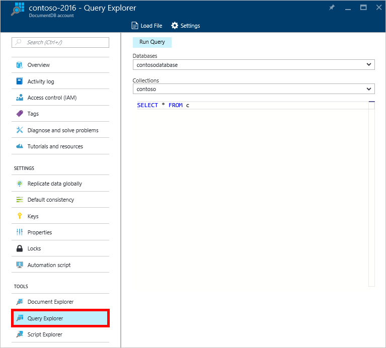
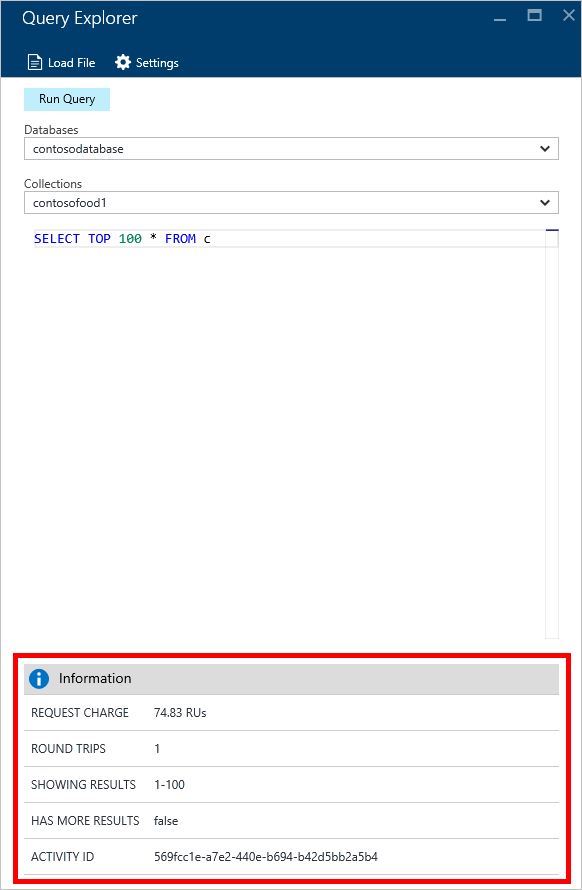

<properties
    pageTitle="DocumentDB 查詢 Explorer: SQL 查詢編輯器 |Microsoft Azure"
    description="深入了解 DocumentDB 查詢總管] 中，用來撰寫 SQL 查詢和執行這些 NoSQL DocumentDB 集合 Azure 入口網站中的 SQL 查詢編輯器。"
    keywords="撰寫 sql 查詢的 sql 查詢編輯器"
    services="documentdb"
    authors="kirillg"
    manager="jhubbard"
    editor="monicar"
    documentationCenter=""/>

<tags
    ms.service="documentdb"
    ms.workload="data-services"
    ms.tgt_pltfrm="na"
    ms.devlang="na"
    ms.topic="article"
    ms.date="08/30/2016"
    ms.author="kirillg"/>

# 撰寫、 編輯和執行 SQL 查詢的使用查詢檔案總管 DocumentDB 

本文提供[Microsoft Azure DocumentDB](https://azure.microsoft.com/services/documentdb/)查詢總管] 中，Azure 入口網站的工具，可讓您撰寫、 編輯和執行[DocumentDB 集合](documentdb-create-collection.md)中的 SQL 查詢的概觀。

1. 在 [Azure] 入口網站中 Jumpbar，按一下 [ **DocumentDB (NoSQL)**]。 如果看不到**DocumentDB (NoSQL)** ，請按一下 [**更多服務**]，然後按一下 [ **DocumentDB (NoSQL)**。

2. 在 [資源] 功能表中，按一下 [**查詢總管**]。 

    

3. 在**查詢總管**刀中，從下拉式清單中，選取**資料庫**及**集合**查詢，再輸入執行查詢。 

    [**資料庫**與**集合**] 下拉式清單會根據您要在其中啟動查詢總管內容預先填入。 

    預設查詢的`SELECT TOP 100 * FROM c`提供。  您可以接受預設查詢或建立您自己的查詢中使用的[SQL 查詢使用密技工作表](documentdb-sql-query-cheat-sheet.md)或[SQL 查詢和 SQL 語法](documentdb-sql-query.md)本文所述的 SQL 查詢語言。

    按一下 [檢視結果的 [**執行查詢**。

    ![撰寫查詢總管 SQL 查詢編輯器] 中的 SQL 查詢的螢幕擷取畫面](./media/documentdb-query-collections-query-explorer/queryexplorerinitial.png)

4. **結果**刀顯示查詢的輸出。 

    

## 使用結果

根據預設，查詢總管會傳回結果集的 100。  如果您的查詢產生 100 個以上的結果，只要使用 [**下一頁**] 及 [**上一頁**] 命令來瀏覽結果。

成功的查詢，**資訊**窗格包含指標要求免費往返次數所做的查詢，一組結果顯示目前，例如，是否有更多結果，然後就可以存取透過 [**下一頁**] 命令，為先前所述。

## 使用多個查詢

如果您使用多個查詢，並想要它們之間快速切換，您可以的所有查詢查詢在文字方塊中輸入的**查詢總管**刀，然後醒目提示您想要執行的項目，然後按一下 [檢視結果的 [**執行查詢**。

## 從檔案中新增查詢將 SQL 查詢編輯器

您可以將載入現有的檔案，使用 [**載入檔案**] 命令的內容。

## 疑難排解

如果查詢完成但發生錯誤時，查詢總管會顯示錯誤，可協助疑難排解工作清單。

## 執行 DocumentDB SQL 查詢外入口網站

Azure 入口網站中的 [查詢總管方法只要針對 DocumentDB 執行 SQL 查詢。 您也可以執行使用[REST API](https://msdn.microsoft.com/library/azure/dn781481.aspx)或[用戶端 Sdk](documentdb-sdk-dotnet.md)的 SQL 查詢。 如需有關如何使用這些其他方法的詳細資訊，請參閱[執行 SQL 查詢](documentdb-sql-query.md#executing-sql-queries)

## 後續步驟

若要深入瞭解查詢檔案總管中支援 DocumentDB SQL 文法檢查，請參閱[SQL 查詢和 SQL 語法](documentdb-sql-query.md)或印出的[SQL 查詢使用密技工作表](documentdb-sql-query-cheat-sheet.md)。
您也可能會喜歡實驗[查詢遊樂場](https://www.documentdb.com/sql/demo)可以在此測試出線上使用的範例資料集的查詢。
