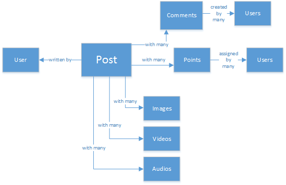

<properties 
    pageTitle="DocumentDB 設計模式︰ 社交媒體應用程式 |Microsoft Azure" 
    description="運用 DocumentDB 其他 Azure 服務的儲存空間彈性瞭解有關設計圖樣的社交網路。" 
    keywords="社交媒體應用程式"
    services="documentdb" 
    authors="ealsur" 
    manager="jhubbard" 
    editor="" 
    documentationCenter=""/>

<tags 
    ms.service="documentdb" 
    ms.workload="data-services" 
    ms.tgt_pltfrm="na" 
    ms.devlang="na" 
    ms.topic="article" 
    ms.date="09/27/2016" 
    ms.author="mimig"/>

# 前往 [社交與 DocumentDB

可大規模相互連接的協會中表示，有些時候生活中，您可以立即**社交網路**的一部分。 我們會使用社交網路保持聯繫朋友、 同事、 家人或有時與具有共同興趣的人員共用我們熱情。

為工程師或開發人員，我們可能會想如何執行這些網路儲存及互連我們的資料，或可能會有更工作是以建立或設計新的社交網路，針對特定專門市場好多。 這是何時最大的問題發生︰ 所有這些資料的儲存方式？

例如，假設我們建立新和晶亮社交網路，我們的使用者可以張貼相關的媒體，例如圖片、 視訊或甚至音樂的文件的位置。 使用者可以在文章上的註解，並為評等的點。 會有摘要的使用者會看到的文章，可以在主網站登陸頁面上進行互動。 這不聽起來很複雜 （的第一個），但方便，讓我們來停止那里 （我們無法深入自訂使用者摘要受到關聯，但它超過本文的目標）。

因此，如何我們儲存此和位置？

許多您可能會體驗 SQL 資料庫，或至少有 [的[關聯式模型資料的](https://en.wikipedia.org/wiki/Relational_model)概念，您可能會想要開始繪製像這樣︰

 

完全標準化和精美的資料結構... 不適合。 

沒有收到我錯誤，我過 SQL 資料庫時我所有的生活，他們很好用，但每個圖樣、 練習及軟體的平台，例如不適合每一種情況。

為何無法在這個案例的最佳選擇 SQL？ 如果我想要顯示該文章網站或應用程式，則必須在執行查詢，我們來看看的單一的文章，結構... 8 資料表連接 （！） 只顯示一個單一文章，現在，圖片的文章，以動態方式載入，並在螢幕上顯示的資料流可能會看到我的重點。

我們無法，當然，使用大的 SQL 執行個體足夠 power 來解決與提供我們的內容，但，為什麼我們較簡單的解決方案有這些多個聯結的數以千計的查詢？

## NoSQL 道路

可以[在 Azure 上執行](http://neo4j.com/developer/guide-cloud-deployment/#_windows_azure)的特殊圖形資料庫，但是他們不是便宜及需要 IaaS 服務 (基礎結構為-的-服務、 虛擬機器主要) 和維護。 我要在大部分情況下，執行 Azure 的 NoSQL 資料庫[DocumentDB](https://azure.microsoft.com/services/documentdb/)瞄準這份文件在較低的成本解決方案，都將能夠運作。 使用[NoSQL](https://en.wikipedia.org/wiki/NoSQL)的方法，將資料儲存在 JSON 格式，並套用[正規化](https://en.wikipedia.org/wiki/Denormalization)，我們先前複雜的文章可以轉換成單一[文件](https://en.wikipedia.org/wiki/Document-oriented_database)︰

    {
        "id":"ew12-res2-234e-544f",
        "title":"post title",
        "date":"2016-01-01",
        "body":"this is an awesome post stored on NoSQL",
        "createdBy":User,
        "images":["http://myfirstimage.png","http://mysecondimage.png"],
        "videos":[
            {"url":"http://myfirstvideo.mp4", "title":"The first video"},
            {"url":"http://mysecondvideo.mp4", "title":"The second video"}
        ],
        "audios":[
            {"url":"http://myfirstaudio.mp3", "title":"The first audio"},
            {"url":"http://mysecondaudio.mp3", "title":"The second audio"}
        ]
    }

然後您可以取得與單一查詢，以及與沒有連接。 這是更簡單與起來很簡單，而且，budget-wise，也需要較少的資源，以獲得更好的結果。

Azure DocumentDB 可確保所有的內容使用其[自動編製索引作業](documentdb-indexing.md)，其中可以偶數索引是[自訂](documentdb-indexing-policies.md)。 結構描述免費的方法可讓我們文件儲存在以不同和動態結構，或許明天我們想要的類別或與其相關聯的 hashtags 清單的文章，DocumentDB 會處理新增其屬性的新文件與任何我們所需的額外工作。

在文章上的註解可以視為只其他文章 （這可簡化我們物件對應） 上層屬性。 

    {
        "id":"1234-asd3-54ts-199a",
        "title":"Awesome post!",
        "date":"2016-01-02",
        "createdBy":User2,
        "parent":"ew12-res2-234e-544f"
    }

    {
        "id":"asd2-fee4-23gc-jh67",
        "title":"Ditto!",
        "date":"2016-01-03",
        "createdBy":User3,
        "parent":"ew12-res2-234e-544f"
    }

與所有社交網路進行互動可以儲存在另一個物件上計數器為︰

    {
        "id":"dfe3-thf5-232s-dse4",
        "post":"ew12-res2-234e-544f",
        "comments":2,
        "likes":10,
        "points":200
    }

建立摘要只是建立文件，可以使用指定的相關性順序文章識別碼的清單︰

    [
        {"relevance":9, "post":"ew12-res2-234e-544f"},
        {"relevance":8, "post":"fer7-mnb6-fgh9-2344"},
        {"relevance":7, "post":"w34r-qeg6-ref6-8565"}
    ]

我們可能有依建立日期排序的文章中的 「 最新的 「 資料流，以使用這些文章的 「 最高溫 「 資料流更按讚過去 24 小時內，我們甚至可以執行的每個使用者追蹤者及興趣等邏輯為基礎的自訂資料流和仍會文章的清單。 是的如何建立這些清單中，但讀取效能仍會保留 unhindered。 一旦我們擷取其中一個清單，我們發出單一查詢 DocumentDB 使用[IN 運算子](documentdb-sql-query.md#where-clause)來取得頁面的文章，一次。

無法使用[Azure 應用程式服務的](https://azure.microsoft.com/services/app-service/)背景處理程序建立的摘要資料流︰ [Webjobs](../app-service-web/web-sites-create-web-jobs.md)。 一旦建立文章，可以使用[Azure 儲存體](https://azure.microsoft.com/services/storage/)[佇列](../storage/storage-dotnet-how-to-use-queues.md)和 Webjobs 觸發使用[Azure Webjobs SDK](../app-service-web/websites-dotnet-webjobs-sdk.md)，實作文章傳播內根據自己的自訂邏輯資料流觸發背景處理。 

延後的方式來建立最後一致的環境使用相同的方法可以處理點及對一篇文章按讚。

追蹤者都需要技巧。 DocumentDB 有的文件大小限制為 512 Kb，因此您可能會將儲存為此結構文件的追蹤者︰

    {
        "id":"234d-sd23-rrf2-552d",
        "followersOf": "dse4-qwe2-ert4-aad2",
        "followers":[
            "ewr5-232d-tyrg-iuo2",
            "qejh-2345-sdf1-ytg5",
            //...
            "uie0-4tyg-3456-rwjh"
        ]
    }

這可能適合使用一些千分位使用者追蹤者，但如果一些熱門話題加入我們的排名，此方法將最後叫用文件大小首字放大。

若要解決這個問題，我們可以使用混合的方法。 使用者統計資料文件的一部分我們可以儲存的追蹤者︰

    {
        "id":"234d-sd23-rrf2-552d",
        "user": "dse4-qwe2-ert4-aad2",
        "followers":55230,
        "totalPosts":452,
        "totalPoints":11342
    }

追蹤者的實際圖形可以儲存在可讓簡單的 「 A-如下所示-B"儲存與擷取的[副檔名](https://github.com/richorama/AzureStorageExtensions#azuregraphstore)Azure 儲存資料表。 如此一來，我們可以委派的確切的追蹤者清單 （時） Azure 儲存資料表，但快速的數字查閱擷取程序，我們將使用 DocumentDB。

## 「 梯 」 圖樣及資料重複

您可能已經注意到參考文章 JSON 文件中，有多個出現處的使用者。 然後，您會有猜到右，這表示的資訊，代表使用者，指定這個正規化，可能會出現在一個以上的位置。

若要允許更快速的查詢，我們會造成資料重複。 此側效果的問題是如果使用者的資料變更時，某些動作，我們需要找出所有的活動他曾並未，並更新所有。 沒有聲音非常實用，正確嗎？

圖形資料庫解決它自己的方式，我們要解決方式識別鍵屬性，我們會示範在每個活動我們應用程式中的使用者。 如果我們以視覺化方式顯示在我們的應用程式中的文章，並顯示只建立者的名稱和圖片，為什麼所有使用者的資料儲存在 「 createdBy] 屬性中？ 如果每一個註解的我們只會顯示使用者的圖片，我們不需要其餘他的資訊。 這是位置撥的 「 梯模式 」 的項目派上用場。

讓我們來看使用者資訊，例如︰

    {
        "id":"dse4-qwe2-ert4-aad2",
        "name":"John",
        "surname":"Doe",
        "address":"742 Evergreen Terrace",
        "birthday":"1983-05-07",
        "email":"john@doe.com",
        "twitterHandle":"@john",
        "username":"johndoe",
        "password":"some_encrypted_phrase",
        "totalPoints":100,
        "totalPosts":24
    }
    
藉由查看這項資訊，我們可以快速偵測的重要資訊，而這不，如此會建立 「 梯子 」:

最小的步驟中，稱為 [UserChunk 時，最小的一段識別使用者的資訊，用於資料重複。 藉由只我們將 「 說明 」 的資訊以減少重複的資料的大小，我們會減少大量更新的可能性。

中間名的步驟稱為使用者，將會用於大部分的效能相關查詢上 DocumentDB 最存取和最重要的完整資料。 其包含 UserChunk 所代表的資訊。

最大是擴充的使用者。 包括所有的要徑的使用者資訊，以及不是真正需要快速地閱讀其他資料或最終 （例如登入程序） 的使用方式。 此資料可以儲存外部 DocumentDB，Azure SQL 資料庫或 Azure 儲存資料表中。

為什麼我們想要分割使用者並甚至在不同的位置儲存此資訊嗎？ 因為[沒有無限](documentdb-limits.md)DocumentDB 中的儲存空間，並從效能指向檢視較大的文件、 costlier 的查詢。 讓相機正確的資訊以執行您的社交網路的所有效能相關查詢和儲存最終的情況，例如完整的設定檔的編輯內容，登入的其他額外資訊，即使資料採礦的使用狀況分析及大型資料計劃與文件。 我們想沒有要資料收集的資料採礦時速度變慢，因為它 Azure SQL 資料庫上執行，我們執行有有關透過使用者擁有快速且相機經驗。 使用者，儲存在 DocumentDB，如下所示︰

    {
        "id":"dse4-qwe2-ert4-aad2",
        "name":"John",
        "surname":"Doe",
        "username":"johndoe"
        "email":"john@doe.com",
        "twitterHandle":"@john"
    }

然後文章如下所示︰

    {
        "id":"1234-asd3-54ts-199a",
        "title":"Awesome post!",
        "date":"2016-01-02",
        "createdBy":{
            "id":"dse4-qwe2-ert4-aad2",
            "username":"johndoe"
        }
    }

和時編輯其中一個區塊的屬性會影響的位置，您可以輕鬆使用指向索引屬性的查詢尋找受影響的文件 (選取 * 從文章 p 位置 p.createdBy.id = = 「 edited_user_id 」)，然後更新區塊。

## [搜尋] 方塊

使用者會產生，幸運，大量內容。 及我們應會提供可搜尋和尋找內容，可能不是直接在其內容資料流時，可能因為我們請不要依照建立者，或者也許我們只想要尋找的舊文章我們 6 個月之內。

好，因為我們使用 Azure DocumentDB，我們可以輕鬆地實作搜尋引擎，只需要幾分鐘的時間和不需輸入一行程式碼 （除了明顯、 搜尋程序和 UI） 中使用 [ [Azure 搜尋](https://azure.microsoft.com/services/search/)和。

為什麼這是很容易？

Azure 搜尋實作他們通話[索引子](https://msdn.microsoft.com/library/azure/dn946891.aspx)，背景處理程序，將您的資料存放庫中的連結，自動新增、 更新或移除的物件索引中。 支援[Azure SQL 資料庫索引子](https://blogs.msdn.microsoft.com/kaevans/2015/03/06/indexing-azure-sql-database-with-azure-search/)、 [Azure Blob 索引子](../search/search-howto-indexing-azure-blob-storage.md)和好， [Azure DocumentDB 索引子](../documentdb/documentdb-search-indexer.md)。 轉場效果的 DocumentDB Azure 搜尋的資訊十分、 兩個存放區中的資訊 JSON 格式，我們只需要[建立索引](../search/search-create-index-portal.md)和我們想從我們的文件的屬性對應編製索引和這是，在幾分鐘內 （取決於我們的資料大小），所有的內容將可供搜尋時，在雲端基礎架構最佳的搜尋-為-的-服務方案。 

如需有關 Azure 搜尋的詳細資訊，您可以造訪[搜尋 Hitchhiker 的指南](https://blogs.msdn.microsoft.com/mvpawardprogram/2016/02/02/a-hitchhikers-guide-to-search/)。

## 基本知識

後儲存所有這個內容的規模擴大時，每一天的規模擴大時，我們可能會發現自己想︰ 能做什麼資訊的所有資料流與從 [我的使用者？

Answer 相當簡單︰ 將工作，並瞭解它。

但是，我們可以瞭解什麼？ 幾個簡單的範例包括[舉動分析](https://en.wikipedia.org/wiki/Sentiment_analysis)，根據使用者的喜好設定內容的建議，或甚至自動化內容仲裁者，以確保所有內容的都發佈我們社交網路為家庭安全。

現在，我收到您連結，您可能會將您需要在數學科學一些博士擷取這些模式和資訊簡單的資料庫及檔案，但您會發生錯誤。

[Azure 電腦學習](https://azure.microsoft.com/services/machine-learning/)， [Cortana 智慧套件](https://www.microsoft.com/en/server-cloud/cortana-analytics-suite/overview.aspx)的一部分是完全受管理的雲端服務可讓您建立一個簡單的拖放介面中使用演算法的工作流程的程式碼中[R](https://en.wikipedia.org/wiki/R_(programming_language))演算法或使用部分已內建且可使用 Api，例如︰[文字分析](https://gallery.cortanaanalytics.com/MachineLearningAPI/Text-Analytics-2)、[內容仲裁者](https://www.microsoft.com/moderator)或[建議](https://gallery.cortanaanalytics.com/MachineLearningAPI/Recommendations-2)。

若要達到上述任一電腦學習案例，我們可以使用[Azure 資料湖](https://azure.microsoft.com/services/data-lake-store/)內嵌來自不同來源的資訊，然後使用[U SQL](https://azure.microsoft.com/documentation/videos/data-lake-u-sql-query-execution/)處理資訊，並產生可以處理的 Azure 電腦學習成果。

另一個可用的選項是使用[Microsoft 認知服務](https://www.microsoft.com/cognitive-services)來分析使用者內容。不只可以我們瞭解這些更 （透過分析他們撰寫[文字分析](https://www.microsoft.com/cognitive-services/en-us/text-analytics-api)api），但我們無法偵測不想要或成熟內容，並適當採取行動以[電腦願景 API](https://www.microsoft.com/cognitive-services/en-us/computer-vision-api)。 認知服務包含許多的方塊出解決方案，不需要任何一種使用電腦學習知識庫。

## 結束時

本文會剖析一些到低成本服務建立完全上 Azure 社交網路，並鼓勵使用稱為 「 梯 」 的多層次的儲存空間方案與資料分配提供好的結果的替代方案。

藍圖是這種情況不銀色項目符號，則由組合很棒的服務，讓我們來建立好的體驗，分工合作︰ 適用於多種語言的應用程式，但功能強大的背景處理程序可展開的 Azure 儲存體和 Azure SQL 資料庫的速度與自由 Azure DocumentDB 提供絕佳社交應用程式，第一類的搜尋解決方案 Azure 搜尋，例如前智慧主機 Azure 應用程式服務的彈性不偶數儲存大量的資料和 Azure 電腦學習建立知識和可以提供意見反應給我們的程序和我們提供正確的內容向使用者說明的智慧分析 power。

## 後續步驟

進一步瞭解資料模型閱讀[DocumentDB 模型資料](documentdb-modeling-data.md)文件。 如果您想在其他 DocumentDB 的使用案例中，請參閱[常見 DocumentDB 使用案例](documentdb-use-cases.md)。

或進一步瞭解 DocumentDB 按照[DocumentDB 學習路徑](https://azure.microsoft.com/documentation/learning-paths/documentdb/)。
