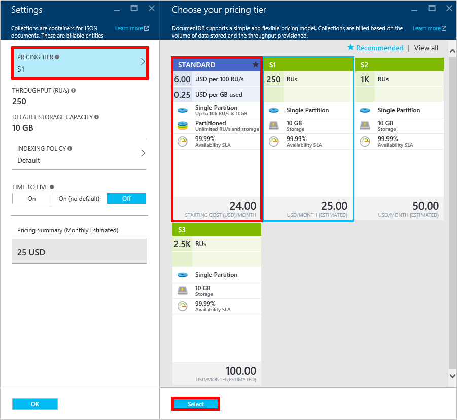

<properties 
    pageTitle="Supercharge DocumentDB S1 帳戶 |Microsoft Azure" 
    description="利用提高處理量 DocumentDB S1 帳戶中 Azure 入口網站中進行幾個簡單的變更。" 
    services="documentdb" 
    authors="mimig1" 
    manager="jhubbard" 
    editor="monicar" 
    documentationCenter=""/>

<tags 
    ms.service="documentdb" 
    ms.workload="data-services" 
    ms.tgt_pltfrm="na" 
    ms.devlang="na" 
    ms.topic="article" 
    ms.date="08/25/2016" 
    ms.author="mimig"/>

# Supercharge DocumentDB 帳戶

遵循下列步驟，以善用 Azure DocumentDB S1 帳戶提高處理量。 幾乎任何其他成本，您可以增加的您現有 S1 帳戶從 250 [RU/s](documentdb-request-units.md) 400 RU/s，或更多 ！  

> [AZURE.VIDEO changedocumentdbcollectionperformance]

## 變更為 Azure 入口網站中的使用者定義的效能

1. 在瀏覽器中瀏覽至[**Azure 入口網站**](https://portal.azure.com)。 
2. 按一下 [**瀏覽** -> **DocumentDB (NoSQL)**，然後選取要修改的 DocumentDB 帳戶。   
3. 在 [**資料庫**透鏡，選取要修改的資料庫，然後在**資料庫**刀中，選取與 S1 價格層的集合。

      

4. 在**集合**刀中，按一下 [**更多**]，然後按一下**設定**。   
5. 在**設定**刀中，按一下**價格層**，請注意，會顯示每月每個計劃成本估計值。 在**選擇您的價格層**刀中，按一下 [**標準**]，然後按一下**選取**以儲存變更。

      

6. 回到**設定**刀，**價格層**會變更為**標準**，**處理量 (RU/s)** ] 方塊會顯示預設值為 400。 按一下**[確定]**儲存變更]。 

    > [AZURE.NOTE] 您可以設定之間 400 到 10000 個[要求單位](../articles/documentdb/documentdb-request-units.md)的處理能力 /second (RU/s)。 **價格摘要**頁面的底部會自動更新提供每月成本的估計值。
    
    

8. 重新開啟**資料庫**刀中，您可以驗證集合 supercharged 處理的量。 

    

如需有關使用者定義和預先定義的處理量的變更，請參閱部落格文章[DocumentDB︰ 您必須能夠使用新的價格選項的相關的所有項目](https://azure.microsoft.com/blog/documentdb-use-the-new-pricing-options-on-your-existing-collections/)。

## 後續步驟

如果您決定您需要更多處理量 （大於 10000 RU/s） 或更多儲存空間 （大於 10 GB） 您可以建立分割的集合。 若要建立分割的集合，請參閱[建立集合](documentdb-create-collection.md)。