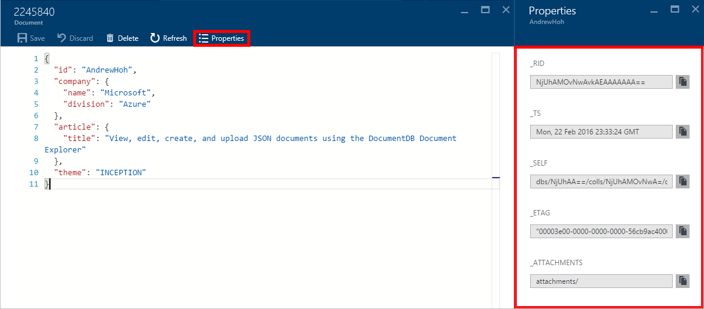

<properties
    pageTitle="DocumentDB 文件總管] 中，若要檢視 JSON |Microsoft Azure"
    description="深入了解 DocumentDB 文件總管] 中，檢視 JSON、 編輯、 建立及上傳 JSON DocumentDB，NoSQL 文件資料庫的文件的 Azure 入口網站工具。"
        keywords="檢視 json"
    services="documentdb"
    authors="kirillg"
    manager="jhubbard"
    editor="monicar"
    documentationCenter=""/>

<tags
    ms.service="documentdb"
    ms.workload="data-services"
    ms.tgt_pltfrm="na"
    ms.devlang="na"
    ms.topic="article"
    ms.date="08/30/2016"
    ms.author="kirillg"/>

# 檢視、 編輯、 建立及上傳 JSON 文件使用 DocumentDB 文件檔案總管

本文提供[Microsoft Azure DocumentDB](https://azure.microsoft.com/services/documentdb/)文件檔案總管，Azure 入口網站的工具，可讓您檢視、 編輯、 建立、 上傳和篩選 DocumentDB JSON 文件的概觀。 

請注意文件檔案總管的 MongoDB 的通訊協定支援 DocumentDB 帳戶不會啟用。 啟用此功能時，就會更新此頁面。

## 啟動文件檔案總管

1. 在 [Azure] 入口網站中 Jumpbar，按一下 [ **DocumentDB (NoSQL)**]。 如果看不到**DocumentDB (NoSQL)** ，請按一下 [**更多服務**]，然後按一下 [ **DocumentDB (NoSQL)**。

2. 選取 [帳戶名稱]。 

3. 在 [資源] 功能表中，按一下 [**文件總管**]。 
 
    ![[文件檔案總管] 命令的螢幕擷取畫面](./media/documentdb-view-JSON-document-explorer/documentexplorercommand.png)

    在**文件總管**刀中，[**資料庫**與**集合**] 下拉式清單預先會根據您尚未啟動設定文件總管內容填入。 

## 建立文件

1. [啟動文件檔案總管](#launch-document-explorer)]。

2. 在**文件總管**刀中，按一下 [**建立文件**。 

    **文件**刀中提供的最小的 JSON 程式碼片段。

    

2. 在**文件**刀中，輸入或貼上您要建立，JSON 文件的內容中，然後按一下**儲存**至資料庫並在**文件總管**刀中指定的集合，確認您的文件。

    ![文件總管的螢幕擷取畫面儲存] 命令](./media/documentdb-view-JSON-document-explorer/savedocument1.png)

    > [AZURE.NOTE] 如果您不提供 「 識別碼] 屬性，文件檔案總管會自動新增 [識別碼] 屬性，並會產生一個 GUID 為識別碼值。

    如果您已經有從 JSON 資料檔案，MongoDB、 SQL Server、 CSV 檔案、 Azure 資料表儲存體，Amazon DynamoDB、 HBase，或從其他 DocumentDB 集合] 中，您可以使用 DocumentDB 的[資料移轉工具](documentdb-import-data.md)來快速匯入資料。

## 編輯文件

1. [啟動文件檔案總管](#launch-document-explorer)]。

2. 若要編輯現有的文件，在**文件總管**刀中加以選取，來編輯**文件**刀，文件，然後按一下**儲存**。

    

    如果您在編輯文件，決定您想要放棄的編輯目前的設定，只要按一下 [**文件**刀中的 [**放棄**，確認選取 [捨棄] 動作，而且重新載入文件的先前的狀態。

    ![螢幕擷取畫面的文件檔案總管選取 [捨棄] 命令](./media/documentdb-view-JSON-document-explorer/discardedit.png)

## 刪除文件

1. [啟動文件檔案總管](#launch-document-explorer)]。

2. 在**文件總管]**中選取的文件，按一下 [**刪除**]，然後確認刪除。 確認之後, 立即會從 [文件檔案總管] 清單移除文件。

    ![螢幕擷取畫面的文件檔案總管 [刪除] 命令](./media/documentdb-view-JSON-document-explorer/deletedocument.png)

## 使用 JSON 文件

文件總管驗證有效 JSON 包含任何新的或編輯文件。  您可以更檢視 JSON 錯誤游標暫留在 [錯誤] 區段，取得驗證錯誤的詳細資訊。

此外，文件總管可讓您以正確的 JSON 內容儲存文件。

最後，文件總管可讓您輕鬆地按一下 [**屬性**] 命令來檢視目前載入的文件中的系統內容。

> [AZURE.NOTE] 時間戳記 (_ts) 屬性內部表示為期間的時間，但文件總管人力的讀取 GMT 格式顯示值。

## 篩選文件
文件總管支援瀏覽選項的數字，而且進階設定。

根據預設，文件總管載入中選取的集合，依最早到最晚從其建立日期前 100 個文件中。  若要載入其他的文件 （在 100 批次），您可以選取 [文件總管刀底部的 [**載入更多**] 選項。 您可以選擇載入到 [**篩選**] 命令的文件。

1. [啟動文件檔案總管](#launch-document-explorer)]。

2. 在**文件總管**刀頂端，按一下 [**篩選**]。  

    
  
3.  篩選器設定顯示在下方的命令列。 在篩選設定，提供 WHERE 子句，及/或 ORDER BY 子句，然後再按一下**篩選**。

    

    文件檔案總管自動重新整理文件符合篩選查詢的結果。 閱讀更多有關的[SQL 查詢和 SQL 語法](documentdb-sql-query.md)DocumentDB SQL 文法文章，或列印的[SQL 查詢使用密技工作表](documentdb-sql-query-cheat-sheet.md)的複本。

    **資料庫**及**集合**] 下拉式清單方塊可輕鬆地變更的文件目前檢視不需關閉並重新啟動文件檔案總管的集合。  

    文件總管也支援以其 id 屬性篩選的文件目前載入的設定。  直接在文件篩選器的識別碼] 方塊中輸入。

    

    篩選清單中的文件檔案總管中的結果會根據您所提供的準則。

    

    > [AZURE.IMPORTANT] 文件總管篩選功能篩選僅限從 [***目前***載入的文件的設定，且不會執行對目前選取的集合的查詢。

4. 若要重新整理文件總管載入的文件的清單，請按一下 [刀頂端的 [**重新整理**]。

    ![螢幕擷取畫面的文件檔案總管重新整理] 命令](./media/documentdb-view-JSON-document-explorer/documentexplorerrefresh.png)

## 大量新增文件

文件總管支援大量 ingestion 一或多個現有 JSON 文件，最多 100 個 JSON 檔案，每個上傳作業。  

1. [啟動文件檔案總管](#launch-document-explorer)]。

2. 若要開始上傳程序，請按一下 [**上傳文件**。

    

    **上傳文件**刀隨即會開啟。 

2. 按一下 [瀏覽] 按鈕來開啟檔案總管] 視窗，選取一或多個 JSON 文件上傳，再按一下 [**開啟**]。

    

    > [AZURE.NOTE] 文件總管目前支援每個個別的上傳作業的最多 100 個 JSON 文件。

3. 一旦您滿意您的選取範圍時，按一下 [**上傳**] 按鈕。  文件會自動新增至 [文件檔案總管] 窗格，然後上傳結果會顯示為作業的進度。 匯入失敗個別檔案的報告。

    

4. 完成作業之後，您可以選取進位到另一個 100 的文件上傳。

## 使用 JSON 外入口網站的文件

Azure 入口網站中的文件總管方法只要 DocumentDB 中使用文件。 您也可以使用使用[REST API](https://msdn.microsoft.com/library/azure/mt489082.aspx)或[用戶端 Sdk](documentdb-sdk-dotnet.md)的文件。 例如程式碼，請參閱[.NET SDK 文件範例](documentdb-dotnet-samples.md#document-examples)和[Node.js SDK 文件的範例](documentdb-nodejs-samples.md#document-examples)。

如果您需要以匯入，或從其他來源 （JSON 檔案、 MongoDB、 SQL Server、 CSV 檔案、 Azure 資料表儲存體、 Amazon DynamoDB 或 HBase） 移轉檔案，您可以使用 DocumentDB[資料移轉工具](documentdb-import-data.md)來快速地將資料匯入 DocumentDB。

## 疑難排解

**問題**︰ 文件總管傳回**沒有找到文件**。

**解決方案**︰ 確定您已選取正確的訂閱、 資料庫及插入文件的集合。 此外，請確認您在 [您處理量配額操作。 如果您在 [最大處理量層級並取得操作經流速控制，低下集合的最大處理量配額運作的應用程式使用方式。

**說明**︰ 入口網站可等任何其他撥打電話至 DocumentDB 資料庫及集合應用程式。 如果您的要求目前正在經流速控制因為從另一個應用程式正在進行通話，入口網站可能也會經流速控制，導致無法在要顯示在入口網站的資源。 若要解決此問題，解決高處理量使用方式的原因，然後重新整理入口網站刀。 [效能秘訣](documentdb-performance-tips.md)文章[處理量](documentdb-performance-tips.md#throughput)一節中找如何測量及較低的處理量使用方式的詳細資訊。

## 後續步驟

若要深入瞭解文件檔案總管中支援 DocumentDB SQL 文法檢查，請參閱[SQL 查詢和 SQL 語法](documentdb-sql-query.md)或印出的[SQL 查詢使用密技工作表](documentdb-sql-query-cheat-sheet.md)。

[學習路徑](https://azure.microsoft.com/documentation/learning-paths/documentdb/)也會引導您以進一步了解更多關於 DocumentDB 實用資源。 
