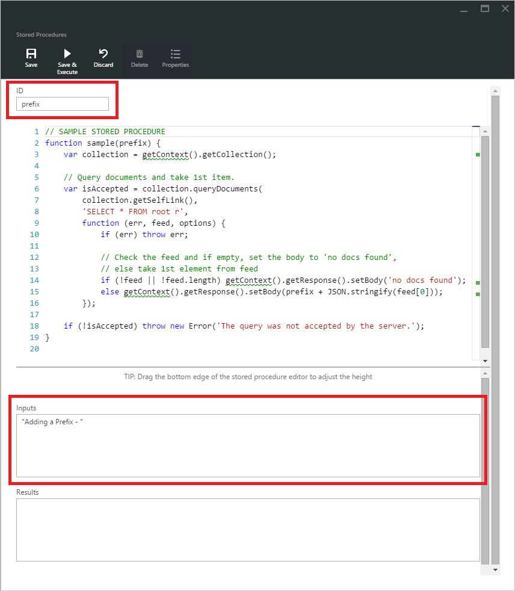

<properties
    pageTitle="DocumentDB 指令碼總管] 中，JavaScript 編輯器 |Microsoft Azure"
    description="深入了解 DocumentDB 指令碼總管] 中，一 Azure 入口網站的工具來管理 DocumentDB 伺服器端程式設計成品包括預存程序、 引動程序及使用者定義函數。"
    keywords="javascript 編輯器"
    services="documentdb"
    authors="kirillg"
    manager="jhubbard"
    editor="monicar"
    documentationCenter=""/>

<tags
    ms.service="documentdb"
    ms.workload="data-services"
    ms.tgt_pltfrm="na"
    ms.devlang="na"
    ms.topic="article"
    ms.date="08/30/2016"
    ms.author="kirillg"/>

# 建立和執行預存程序與引動程序，使用 [DocumentDB 指令碼總管] 中的使用者定義函數

本文提供[Microsoft Azure DocumentDB](https://azure.microsoft.com/services/documentdb/)指令碼總管] 中，這是在 Azure 入口網站可讓您檢視及執行 DocumentDB 伺服器端程式設計成品包括預存程序、 引動程序及使用者定義函數 JavaScript 編輯器的概觀。 閱讀更多關於 DocumentDB 伺服器端程式設計[預存程序與資料庫引動程序，Udf](documentdb-programming.md)文件中。

## 啟動指令碼總管

1. 在 [Azure] 入口網站中 Jumpbar，按一下 [ **DocumentDB (NoSQL)**]。 如果看不到**DocumentDB 帳戶**，請按一下 [**更多服務**]，然後按一下 [ **DocumentDB (NoSQL)**。

2. 在 [資源] 功能表中，按一下 [**指令碼總管**]。

    ![[指令碼總管] 命令的螢幕擷取畫面](./media/documentdb-view-scripts/scriptexplorercommand.png)
 
    根據您要在其中啟動指令碼總管內容預先填入**資料庫**及**集合**] 下拉式清單方塊。  例如，如果您從資料庫刀啟動時，目前的資料庫是預先填入。  如果您從集合刀啟動時，則為預先填入目前的集合。

4.  使用 [**資料庫**及**集合**] 下拉式清單方塊的指令碼目前檢視不需關閉並重新啟動指令碼總管的集合，輕鬆地變更。  

5. 指令碼總管也支援以其 id 屬性篩選目前載入指令碼一組。  在 [篩選] 方塊中直接輸入和指令碼總管] 清單中的結果會根據您所提供的準則。

    ![螢幕擷取畫面的指令碼總管] 進行篩選後的結果](./media/documentdb-view-scripts/scriptexplorerfilterresults.png)

    > [AZURE.IMPORTANT] 指令碼總管篩選功能篩選僅限從***目前***載入指令碼，並不會自動重新整理目前選取的集合。

5. 若要重新整理的指令碼載入指令碼總管] 的清單，只要按一下刀頂端的 [**重新整理**] 命令。

    ![螢幕擷取畫面的指令碼總管重新整理] 命令](./media/documentdb-view-scripts/scriptexplorerrefresh.png)

## 建立、 檢視與編輯預存程序、 引動程序及使用者定義函數

指令碼總管] 可讓您輕鬆地執行 DocumentDB 伺服器端程式設計成品上的 CRUD 作業。  

- 若要建立指令碼，只要按一下適用會建立指令碼總管] 中的命令、 提供 id、 輸入的指令碼，內容，按一下 [**儲存**。

    

- 在建立觸發程序時，您也必須指定觸發程序類型與觸發作業

    

- 若要檢視指令碼，只要按一下您感興趣的指令碼。

    

- 若要編輯的指令碼，只要編輯器中 JavaScript 進行必要的變更，然後按一下 [**儲存**]。

    

- 若要放棄指令碼任何擱置的變更，只要按一下 [**捨棄**] 命令。

    ![螢幕擷取畫面的指令碼總管] 捨棄變更經驗](./media/documentdb-view-scripts/scriptexplorerdiscardchanges.png)

- 指令碼總管也可讓您輕鬆地按一下 [**屬性**] 命令來檢視目前載入指令碼的系統內容。

    

    > [AZURE.NOTE] 時間戳記 (_ts) 屬性內部表示為期間的時間，但指令碼總管人力的讀取 GMT 格式顯示值。

- 若要刪除指令碼，指令碼總管] 中選取它，然後按一下 [**刪除**] 命令。

    ![螢幕擷取畫面的指令碼總管 [刪除] 命令](./media/documentdb-view-scripts/scriptexplorerdeletescript1.png)

- 按一下**[是]**確認刪除動作，或按一下 [**無**取消刪除動作。

    ![螢幕擷取畫面的指令碼總管 [刪除] 命令](./media/documentdb-view-scripts/scriptexplorerdeletescript2.png)

## 執行預存程序

> [AZURE.WARNING] 在 [指令碼總管] 中執行預存程序尚未支援的伺服器端分割集合。 如需詳細資訊，請造訪[Partitioning 和 DocumentDB 中的縮放比例](documentdb-partition-data.md)。

指令碼總管] 可讓您從 Azure 入口網站執行伺服器端預存程序。

- 開啟新的建立預存程序刀時, 已可提供預設的指令碼 （*前置字元*）。 若要執行*的前置詞*或您自己的指令碼，新增*識別碼*和*輸入*。 接受多個參數的預存程序，所有的輸入必須在陣列 （例如*[「 foo 」、 「 列 」]*）。

    

- 若要執行的預存程序，只要按一下指令碼編輯器] 窗格中的 [**儲存並執行**] 命令。

    > [AZURE.NOTE] [**儲存並執行**] 命令將會儲存您預存程序之前執行，也就是說，它會覆寫先前儲存的版本預存程序。

- 成功的預存程序會有*順利儲存及執行預存程序*的狀態，並傳回的結果便會填入 [*結果*] 窗格中。

    

- 如果執行遇到錯誤，會在 [*結果*] 窗格中填入錯誤。

    ![檢視的螢幕擷取畫面的指令碼總管] 指令碼的屬性。 執行有錯誤的預存程序](./media/documentdb-view-scripts/documentdb-execute-a-stored-procedure-error.png)

## 使用外部入口網站的指令碼

Azure 入口網站中的指令碼總管方法只要使用預存程序、 引動程序和在 DocumentDB 使用者定義函數。 您也可以使用指令碼使用 REST API 和[用戶端 Sdk](documentdb-sdk-dotnet.md)。 REST API 文件包含使用[預存程序使用其餘](https://msdn.microsoft.com/library/azure/mt489092.aspx)、[使用者定義函數使用其餘](https://msdn.microsoft.com/library/azure/dn781481.aspx)，和[引動程序使用其餘](https://msdn.microsoft.com/library/azure/mt489116.aspx)的範例。 範例也會提供顯示如何[搭配使用 C# 的指令碼](documentdb-dotnet-samples.md#server-side-programming-examples)並[使用 Node.js 指令碼](documentdb-nodejs-samples.md#server-side-programming-examples)。

## 後續步驟

進一步瞭解 DocumentDB 伺服器端程式設計[預存程序與資料庫引動程序，Udf](documentdb-programming.md)文件中。

[學習路徑](https://azure.microsoft.com/documentation/learning-paths/documentdb/)也會引導您以進一步了解更多關於 DocumentDB 實用資源。  
