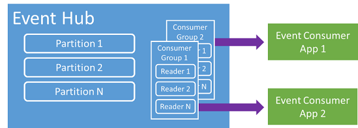
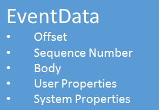

<properties 
    pageTitle="Azure 事件集線器概觀 |Microsoft Azure"
    description="簡介和 Azure 事件集線器的概觀。"
    services="event-hubs"
    documentationCenter="na"
    authors="sethmanheim"
    manager="timlt"
    editor="" />
<tags 
    ms.service="event-hubs"
    ms.devlang="na"
    ms.topic="get-started-article"
    ms.tgt_pltfrm="na"
    ms.workload="na"
    ms.date="08/16/2016"
    ms.author="sethm" />

# Azure 事件集線器概觀

許多現代化的解決方案想要提供彈性的客戶體驗，或改善產品透過連續的意見反應和自動化的遙測。 如何安全地與可靠程序有大量的資訊許多同時發行者的挑戰遇到這種解決方案。 Microsoft Azure 事件集線器是受管理的平台服務，提供各式各樣的案例中的大型資料吸收量的基礎。 這種情況的範例是在行動應用程式]，從網頁伺服器陣列，在主控台遊戲遊戲事件擷取流量資訊中追蹤的行為，或遙測資料從工業的電腦收集或連線車輛。 一般角色事件集線器要播放的解決方案架構的是，也就是以 「 大門 」 的事件管道的郵件，通常稱為*事件 ingestor*。 事件 ingestor 是元件或位於事件發行者和事件消費者減少的事件資料流從這些事件消耗之間的服務。

Azure 事件集線器是處理提供低延遲和高可靠性事件與遙測輸入龐大的小數位數，在雲端服務的事件。 這項服務，用於其他下游的服務，是在應用程式儀器、 使用者體驗或工作流程處理和網際網路的項目 (IoT) 案例特別有用。 事件集線器提供處理功能的訊息資料流和事件中心是類似佇列 」 和 「 主題的實體，但它有非常不同傳統企業訊息的特性。 企業訊息案例常需要複雜的功能，例如順序與失效字母、 交易支援強式傳遞保證事件吸收量主要考量時高處理量，以及處理事件資料流時的彈性。 因此，事件集線器功能與不同的服務匯流排主題非常偏差結果向高處理量和處理案例的事件。 因此，事件集線器請勿實作所使用的主題的訊息功能。 如果您需要這些功能，主題會維持最佳的選擇。

事件中心會建立事件集線器命名空間層級，類似於服務匯流排佇列 」 和 「 主題。 事件集線器使用 AMQP 和 HTTP 作為其主要的 API 介面。 下圖顯示事件集線器與服務匯流排之間的關係。

## 概念的概觀

事件集線器提供串流透過分割的消費者模式的訊息。 佇列 」 和 「 主題使用[競爭消費者](https://msdn.microsoft.com/library/dn568101.aspx)模型每個使用者嘗試讀取相同的佇列中或資源。 這項競爭資源的最終結果在複雜度和縮放比例限制處理應用程式的資料流。 事件集線器使用的每個使用者僅限讀取特定的子集或磁碟分割的訊息資料流分割的消費者圖樣的線條。 此模式啟用的事件處理水平比例]，並提供無法佇列 」 和 「 主題中的其他資料流導向功能。

### 磁碟分割區

分割為的事件會保留在 [事件] 中心內的排序的順序。 較新的事件到達時，即會新增到此順序結尾。 分割可以視為 「 認可記錄 」。

磁碟分割區的事件中心層級設定設定的保留時間保留資料。 這項設定適用於上所有磁碟分割區以事件中心。 以時間為基礎; 在到期的事件您無法明確地將它們刪除。 事件中心包含多個資料分割。 每個資料分割原樣，並包含自己的資料的順序。 如此一來，磁碟分割區通常在不同的工資率增加。

指定在事件中心建立時間及必須是 2 到 32 （預設值為 4） 之間的磁碟分割區數。 分割資料組織機制，而且更多相關中使用的應用程式比事件集線器處理量所需的下游平行度。 這樣的磁碟分割之數字的選項在 [事件] 中心與直接相關，同時讀者您預期有數。 事件中心建立之後的磁碟分割計算不是指;您應該考慮這個數字，以長期預期的小數位數。 您可以增加 32 的磁碟分割限制連絡服務匯流排小組。

雖然磁碟分割區可識別，可以直接傳送給最好避免將傳送給特定的磁碟分割的資料。 不過，您可以使用較高的層級架構，就在 [[事件 publisher](#event-publisher)和[Publisher 原則](#capacity-and-security)] 區段。

在事件集線器內容，郵件被稱為*事件資料*。 事件的資料包含在事件的本文，使用者定義的屬性包和各種不同的中繼資料，例如它的位移事件的相關資料分割和其資料流順序中的數字。 磁碟分割區會填入一系列的事件資料。

## 事件發行者

將事件或資料傳送到 [事件] 中心內的任何實體是*事件發行者*。 事件的發行者可以發佈使用 HTTPS 或 AMQP 1.0 的事件。 事件的發行者使用共用 Access 簽章 (SA) 來識別到事件集線器，並可以有唯一的身分識別，或使用的常見 SA 權杖，視情況的需求而定。

如需有關使用 SA 的詳細資訊，請參閱[共用 Access 簽章驗證與服務匯流排](../service-bus-messaging/service-bus-shared-access-signature-authentication.md)。

### Publisher 的一般工作

本節描述的事件發行者的一般工作。

#### 取得 SA 權杖

共用 Access 簽章 (SA) 是事件集線器驗證機制。 服務匯流排提供命名空間和事件中心層級的 SA 原則。 SA 權杖會產生從 SA 機碼，而且是 SHA 雜湊的 URL，以特定格式編碼。 使用的名稱 （原則） 的索引鍵和權杖，服務匯流排可以重新產生雜湊，因此驗證寄件者。 一般而言，只**傳送**權限特定事件中樞都建立的事件發行者 SA 權杖。 這個 SA token URL 機制是在 publisher 原則的 publisher 識別用的基礎。 如需有關使用 SA 的詳細資訊，請參閱[共用 Access 簽章驗證與服務匯流排](../service-bus-messaging/service-bus-shared-access-signature-authentication.md)。

#### 發佈事件

您可以發佈透過 AMQP 1.0 或 HTTPS 事件。 服務匯流排提供[EventHubClient](https://msdn.microsoft.com/library/microsoft.servicebus.messaging.eventhubclient.aspx)類別發佈事件到事件集線器.NET 用戶端。 如需其他執行階段與平台，您可以使用任何 AMQP 1.0 用戶端，例如[Apache Qpid](http://qpid.apache.org/)。 您可以將個別，發佈事件或批次。 單一出版物 （事件資料執行個體） 有 256 KB，無論它是否單一事件或以批次的限制。 發佈大於這會導致錯誤的事件。 不知道的磁碟分割區 [事件] 中心內，然後只指定*分割鍵*（下一節中推出），或透過其 SA 權杖其身分識別的發行者的最佳作法是它。

選擇使用 AMQP 或 HTTPS 是特定的使用狀況。 AMQP 需要常設的雙向通訊端元件傳輸層安全性 (TLS) 或 SSL/TLS 的建立。 這可能會耗費資源網路流量而言，但只會發生的 AMQP 工作階段的開頭。 HTTPS 較低的初始費用，但每一個要求負荷需要額外的 SSL。 經常發佈事件的發行者，AMQP 提供大筆效能、 延遲和處理量。

### 分割索引鍵

分割索引鍵是組織的用來進行資料，對應到特定的磁碟分割區的連入事件資料的值。 分割索引鍵是傳遞到事件中心寄件者所提供的值。 處理程序透過靜態雜湊功能，其結果會建立磁碟分割工作分派。 如果您不指定的磁碟分割金鑰發佈事件時，會使用循環工作分派。 使用磁碟分割金鑰，事件發行者時僅其分割索引鍵，而不事件的已發佈的磁碟分割的注意。 索引鍵和分割聯繫隔離寄件者不需要太多知道下游處理和儲存空間的事件。 分割金鑰組織下游處理、 資料的重要，但不根本上有所相關磁碟分割區本身。 每個裝置或使用者唯一識別很好的磁碟分割鍵，但其他屬性，例如地理位置也可以用來為單一資料分割群組相關的事件。 下圖顯示使用磁碟分割金鑰釘選到磁碟分割區的事件寄件者。

事件集線器可確保所有共用相同的磁碟分割索引鍵值的事件傳遞在 [順序] 和 [至相同的磁碟分割。 重要的是，如果使用 publisher 原則，下一節所述的磁碟分割金鑰然後發行者的身分識別和分割索引鍵的值必須符合。 否則，會發生錯誤。

### 事件消費者

從 [事件] 中心讀取事件資料的任何實體是事件消費者。 所有事件消費者都閱讀事件串流的磁碟分割區消費者群組中。 每個資料分割應有一次只能有一個作用中的閱讀程式。 所有事件集線器消費者都連線透過 AMQP 1.0 工作階段，可以使用事件傳遞。 用戶端不需要的資料可用性投票。

#### 消費者群組

發佈/訂閱機制的事件集線器啟用透過消費者群組。 消費者群組是整個的事件中樞的檢視 （「 狀態 」、 「 位置] 或 「 位移 」）。 消費者群組啟用多個使用的應用程式，每個有一個檢視事件資料流，以及讀取資料流獨立的自己速度與自己的位移。 在資料流處理架構，每個下游應用程式可消費者群組。 如果您想要寫入長期儲存事件資料，然後儲存文件撰寫應用程式是消費者群組。 另一個、 個別消費者群組被執行複雜的事件處理。 您只能存取磁碟分割區透過消費者群組。 隨時都有預設消費者群組在 [事件] 中心內，您可以建立 20 個消費者群組事件中心標準層。

消費者群組 URI 慣例範例如下︰

    //<my namespace>.servicebus.windows.net/<event hub name>/<Consumer Group #1>
    //<my namespace>.servicebus.windows.net/<event hub name>/<Consumer Group #2>

下圖顯示消費者群組內的事件消費者。

#### 資料流位移

位移是磁碟分割內事件的位置。 您可以想像位移的用戶端游標。 位移是位元組事件的編號。 這可讓事件消費者 （閱讀程式） 若要指定點在事件串流他們要開始讀取事件。 為時間戳記或位移值，您可以指定位移。 消費者負責儲存自己位移的值以外的事件集線器服務。

在磁碟分割，每項事件會包括位移。 這個位移更動用於給定分割的事件順序顯示的位置。 位移可以傳遞至 [事件] 中心內的數字或時間戳記值讀取裝置連線時。

#### 檢查點

*檢查點*是讀者標示或確認其位置分割事件順序中的程序。 檢查點的消費者責任且發生消費者群組內的分割為基礎。 這表示，為每個消費者] 群組中，每個資料分割閱讀程式必須追蹤的目前位置的事件串流，並可以通知服務時就會視為資料流完成。 如果讀者中斷磁碟分割，將其重新連線時開始在先前已提交的磁碟分割的消費者] 群組中的最後一個 reader 檢查點讀取。 讀者連線時，它會將這個位移傳遞給指定位置開始閱讀 [事件] 中心中。 如此一來，您可以使用檢查點為 「 完成 」 的兩個標記事件，下游應用程式，並提供恢復之間不同的電腦上執行的讀者容錯移轉時。 因為事件資料會保留在建立事件中心時的所指定的保留間隔，可能是返回較舊的資料，藉此檢查點程序較低位移。 透過此機制，檢查點可讓容錯移轉恢復和控制的事件串流重新執行。

#### 消費者的一般工作

本節說明事件集線器事件消費者或助讀程式的一般工作。 所有事件集線器消費者都連線透過 AMQP 1.0。 AMQP 1.0 是工作階段和狀態注意的雙向通訊通道。 每個資料分割有幫助的事件隔離的磁碟分割傳輸 AMQP 1.0 連結工作階段。

##### 連線到磁碟分割

若要使用從事件中心的事件，消費者必須連接到磁碟分割。 如先前所述，您隨時存取磁碟分割區透過消費者群組。 分割的消費者模型的一部分，單一閱讀程式應該在磁碟分割作用中消費者群組內的任何一次。 常見的作法是時直接連接到磁碟分割區以進行閱讀程式連線至特定的磁碟分割區使用租用機制。 如此一來，可能是消費者群組擁有一個使用中的閱讀程式中的每個資料分割。 管理讀取程式順序位置是一個重要的工作，方法是透過檢查點。 使用.NET 用戶端[EventProcessorHost](https://msdn.microsoft.com/library/microsoft.servicebus.messaging.eventprocessorhost.aspx)類別來簡化這項功能。 [EventProcessorHost](https://msdn.microsoft.com/library/microsoft.servicebus.messaging.eventprocessorhost.aspx)智慧消費者代理程式，而下一節所述。

##### 讀取事件

為特定的磁碟分割開啟 AMQP 1.0 工作階段和連結之後，事件傳遞給 AMQP 1.0 用戶端事件集線器服務。 較高的輸出量和比提取為基礎的機制，例如 HTTP GET 較低的延遲，可讓此傳送機制。 事件會傳送給客戶，每個事件資料執行個體包含重要的中繼資料，例如 offset 及順序的數字可用來檢查點上的事件順序。

您必須負責管理這個位移最佳可處理資料流中的管理進度的方式。

## 容量與安全性

事件集線器是串流輸入 free 平行架構。 因此，有調整大小和縮放比例事件集線器為基礎的解決方案時要考慮的幾個重要層面。 這些容量控制項中的第一個稱為*處理量單位*下, 一節所述。

### 處理量單位

處理量單位控制事件集線器處理量容量。 處理量單位預先購買單位的容量。 單一處理量單位包括下列各項︰

- 輸入︰ 向上到 1 MB 每秒的第二或 1000年事件。

- 出口︰ 向上秒 2 mb。

輸入被節流容量購買處理量單位數量所提供的數量。 傳送 「 超出配額 」 的例外狀況上方此量結果的資料。 在這段是每秒的第二或 1000年事件任一 1 MB，視第一次。 出口不會產生節流例外]，但僅限於購買處理量單位所提供的資料傳輸的量︰ 每個處理量單位秒 2 MB。 如果您收到發佈的工資率例外狀況或預期會看到較高的出口務必核取所購買的數量事件中心建立命名空間的處理量單位數量。 若要取得更多處理量單位，您可以調整[Azure 傳統入口網站][]中的 [**縮放比例**] 索引標籤上的 [**命名空間**] 頁面上的設定。 您也可以變更使用 Azure Api 這項設定。

資料組織概念磁碟分割區時，處理量單位是完全容量概念。 處理量單位向收費每小時，預先購買。 一旦購買，處理量單位被付費的最小值的一個小時。 最 20 處理量單位可以購買事件集線器命名空間，而且沒有 20 處理量單位 Azure 帳戶限制。 所有事件集線器跨越共用這些處理量單位中指定的命名空間。

處理量單位佈建最佳投入為基礎，並不一定可以立即購買。 如果您需要特定的容量，建議您購買提前這些處理量單位。 如果您需要 20 個以上的處理量單位，您也可以連絡 Azure 支援，以購買更多處理量單位認可為基礎的 20，進位到第一個 100 處理量單位區塊。 此外，您也可以購買區塊 100 處理量單位。

建議您謹慎平衡處理量單位] 及 [磁碟分割區以獲得最佳的縮放比例與事件集線器。 單一資料分割有一個處理量單位的最大比例。 處理量單位數量應該小於或等於事件中樞的磁碟分割之數字。

若要取得詳細價格資訊，請參閱[事件集線器價格](https://azure.microsoft.com/pricing/details/event-hubs/)。

### Publisher 原則

事件集線器可讓您微調控制事件發行者透過*publisher 原則*。 Publisher 原則是設計用來提供大量獨立的事件發行者的執行時間功能一組。 使用 publisher 原則，每個 publisher 時所使用自己的唯一識別碼到事件集線器，請使用下列機制發佈事件︰

    //<my namespace>.servicebus.windows.net/<event hub name>/publishers/<my publisher name>

您沒有建立 publisher 名稱提前，但是他們必須符合使用發佈事件，才能確保獨立的 publisher 身分識別的 SA token。 如需有關 SA 的詳細資訊，請參閱[共用 Access 簽章驗證與服務匯流排](../service-bus-messaging/service-bus-shared-access-signature-authentication.md)。 使用 publisher 原則時, **PartitionKey**值設定為 publisher 名稱。 若要正常運作，必須符合下列值。

## 摘要

Azure 事件集線器提供超比例事件和遙測處理常見的應用程式和使用者工作流程在任何監控可以使用的服務。 提供的功能發行-訂閱功能低延遲並在大量的縮放比例] 事件集線器作為 」 開啟遞增 」 顯示較大的資料。 使用 publisher 為基礎的身分識別和撤銷清單，這些功能會延伸到網際網路的項目的常見案例。 如需開發事件集線器應用程式的詳細資訊，請參閱[事件集線器程式設計指南](event-hubs-programming-guide.md)。

## 後續步驟

現在，您學事件集線器概念，您可以移動以下情況︰

- 開始使用[事件集線器教學課程]。
- 完成[範例應用程式的使用事件集線器]。

[Azure 傳統入口網站]: http://manage.windowsazure.com
[事件集線器教學課程]: event-hubs-csharp-ephcs-getstarted.md
[使用事件集線器範例應用程式]: https://code.msdn.microsoft.com/windowsazure/Service-Bus-Event-Hub-286fd097
