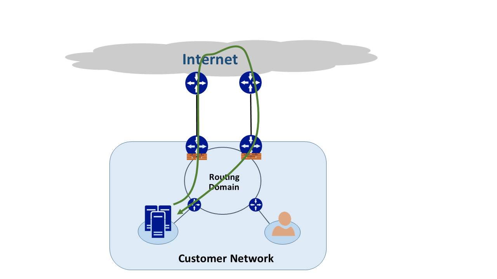
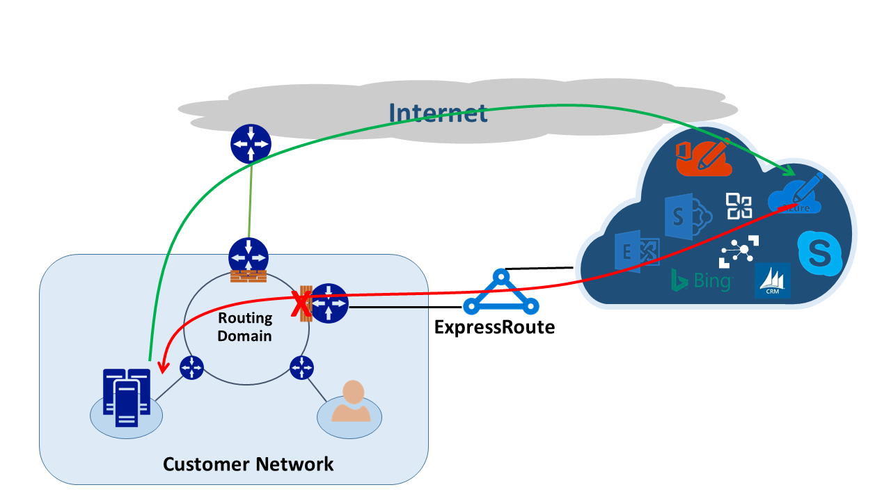

<properties
   pageTitle="非對稱式路由 |Microsoft Azure"
   description="本文會引導您客戶可能有多個連結的目的地的網路中的非對稱式路由面對的問題。"
   documentationCenter="na"
   services="expressroute"
   authors="osamazia"
   manager="carmonm"
   editor=""/>
<tags
   ms.service="expressroute"
   ms.devlang="na"
   ms.topic="get-started-article"
   ms.tgt_pltfrm="na"
   ms.workload="infrastructure-services"
   ms.date="10/10/2016"
   ms.author="osamazia"/>

# 非對稱式路由有多個網路路徑

本文說明如何轉寄，並傳回網路流量網路來源與目的地之間，您可以使用多個路徑時，可能需要不同的路徑。

請務必瞭解兩個概念，若要了解非對稱式路由。 有多個網路路徑的效果。 另一個是裝置，例如防火牆來說，如何將狀態。 這些類型的裝置稱為狀態的裝置。 這兩項因素的組合所建立的網路流量卸除狀態裝置因為狀態的裝置未偵測到流量起始與裝置本身的案例。

## 多個網路路徑

當企業網路會有其網際網路服務提供者的網際網路只有一個連結時，所有流量，並且透過網際網路都傳送相同的路徑。 通常，公司購買多個電路為多餘的路徑，以改善網路的執行時間。 發生這種情況下，可能是流量移外部網路，至網際網路，通過一個連結，並傳回流量移到不同的連結。 這通常稱為非對稱式路由。 在非對稱式路由]，反向網路流量會採用原始流程從不同的路徑。

雖然主要發生在網際網路上非對稱式路由也適用於其他多重路徑的組合。 適用於，例如，同時網際網路路徑並前往相同的目的地，然後移至相同目的地的多個私人路徑私人路徑。

每個路由器一路從來源至目的地，計算達到目的最佳的路徑。 路由器決定最佳的路徑根據兩個主要因素︰

-   外部網路之間的路徑，根據路由通訊協定框線閘道器通訊協定 (BGP)。 BGP 採用廣告從其他例項，並執行這些透過一系列的步驟，判斷最佳路徑至預定的目的地。 路由表中儲存的最佳的路徑。
-   子網路遮罩路由相關聯的長度會影響路由路徑。 如果路由器接收到相同的 IP 位址，但使用不同的子網路遮罩的多個通知，路由器慣用較長的子網路遮罩廣告，因為它具有視為更特定的路由。

## 設定狀態的裝置

路由器尋找 IP 標頭的封包路由之用。 某些裝置看起來更深入的封包內。 一般而言，這些裝置查看 Layer4 （傳輸控制通訊協定，或 TCP; 或使用者資料流通訊協定或 UDP），或甚至 Layer7 （應用程式層） 標題。 這些類型的裝置已安全性裝置或頻寬最佳化裝置。 

防火牆是裝置的常見範例狀態。 防火牆允許或拒絕封包通過根據各種不同的欄位，例如通訊協定、 TCP/UDP 連接埠] 和 URL 標題其介面。 此層級的封包檢查將重大的處理載入在裝置上。 若要改善效能，防火牆盡可能地壓縮第一封包的流程。 如果其允許繼續封包時，它將保留其狀態表格流程資訊。 根據初始判定允許此流程相關的所有後續封包。 屬於現有的流程封包可能會出現防火牆。 如果防火牆有沒有相關的前一個狀態資訊，請防火牆卸除封包。

## 非對稱式路由 ExpressRoute

當您連線至 Microsoft Azure ExpressRoute 透過時，您的網路的變更會像這樣︰

-   您有多個連結至 Microsoft。 一個連結您現有的網際網路連線，而另一個是透過 ExpressRoute。 Microsoft 的一些流量可能網際網路瀏覽，但回來透過 ExpressRoute，或反向操作。
-   您會收到透過 ExpressRoute 更具體的 IP 位址。 因此，流量從您的網路到 Microsoft 透過 ExpressRoute 所提供的服務，路由器永遠偏好 ExpressRoute。

若要瞭解的網路有下列兩項變更的效果，讓我們看某些案例。 例如，您只有一個電路網際網路並您使用的所有的 Microsoft 服務，透過網際網路。 從您的網路流量，Microsoft 並返回穿過網際網路連結相同，並透過防火牆傳送。 防火牆記錄流程看到第一封包，並傳回的封包允許因為流程在於狀態的資料表。

然後，您開啟 ExpressRoute，並使用 ExpressRoute 透過 microsoft 提供的服務。 透過網際網路使用 Microsoft 的所有其他服務。 將個別的防火牆部署在您已連線至 ExpressRoute 的邊緣。 Microsoft 會通知您的網路更具體的前置詞透過 ExpressRoute 特定的服務。 路由基礎結構選擇 ExpressRoute 給這些前置詞的慣用的路徑。 如果您不透過 ExpressRoute 通知您的公用 IP 位址至 Microsoft，Microsoft 就會與您的公用 IP 位址透過網際網路通訊。 從您的網路轉寄流量 Microsoft 使用 ExpressRoute，並反向傳輸 microsoft 會使用網際網路。 當在邊緣防火牆看到它找不到狀態資料表中的流程回應封包時，其去掉寄流量。

如果您選擇使用相同的網路位址轉譯 (NAT) 集區，ExpressRoute，以及網際網路，您會看到與用戶端類似問題在您的網路上私用的 IP 位址。 透過網際網路的 Windows Update 等服務的要求移，因為這些服務的 IP 位址不透過 ExpressRoute 通知。 不過，傳回流量恢復透過 ExpressRoute。 如果 Microsoft 收到的 IP 位址相同的網路遮罩從網際網路和 ExpressRoute，它會在網際網路上慣用 ExpressRoute。 如果防火牆或另一個狀態的裝置上您的網路邊緣與面對 ExpressRoute 沒有先前流程的相關資訊，將其去掉所屬的流程封包。

## 非對稱式路由解決方案

您有兩個主要的選項，以解決此問題的非對稱式路由。 一是透過路由]，而另一個是使用來源為基礎的 NAT (SNAT)。

### 路由

請確定您的公用 IP 位址通知至適當的寬區域網路 (WAN) 連結。 例如，如果您想要使用網際網路驗證流量和 ExpressRoute 用您的郵件流量，您不應該通知您 Active Directory Federation Services (AD FS) 的公用 IP 位址透過 ExpressRoute。 同樣地，請務必不以公開內部部署 AD FS server 路由器收到透過 ExpressRoute 的 IP 位址。 透過 ExpressRoute 接收路由是更具體，讓他們 ExpressRoute 驗證流量的慣用的路徑至 Microsoft。 這會導致非對稱式路由。

如果您想要使用 ExpressRoute 進行驗證，請確定您廣告 AD FS 的公用 IP 位址透過不 NAT ExpressRoute 這種方式，是來自 Microsoft，移至內部部署的流量 AD FS server 介紹 ExpressRoute。 返回流量客戶從 Microsoft 會使用 ExpressRoute 因為它是在網際網路上的慣用的路由。

### 來源為基礎的 NAT

解決非對稱式路由問題的另一個方法是使用 SNAT。 例如，您有不通知的內部部署的簡易郵件傳輸通訊協定 (SMTP) 伺服器的公用 IP 位址透過 ExpressRoute 因為您想要使用此類型的通訊的網際網路。 Microsoft 的來源，然後移至您的內部部署 SMTP 伺服器的要求穿過網際網路。 您 SNAT 內部 IP 位址的內送要求。 從 SMTP 伺服器反向傳輸移至邊緣防火牆 （可用 NAT） 而不是透過 ExpressRoute。 傳回的流量會返回透過網際網路。

## 非對稱式路由偵測

Traceroute 是最佳方式，請確定您的網路流量通過預期的路徑。 如果您希望從您內部部署的 SMTP 伺服器的流量至 Microsoft 以網際網路路徑，預期的 traceroute 是從 SMTP 伺服器 Office 365。 結果會驗證流量確實離開您的網路趨近於網際網路，而不是 ExpressRoute。
