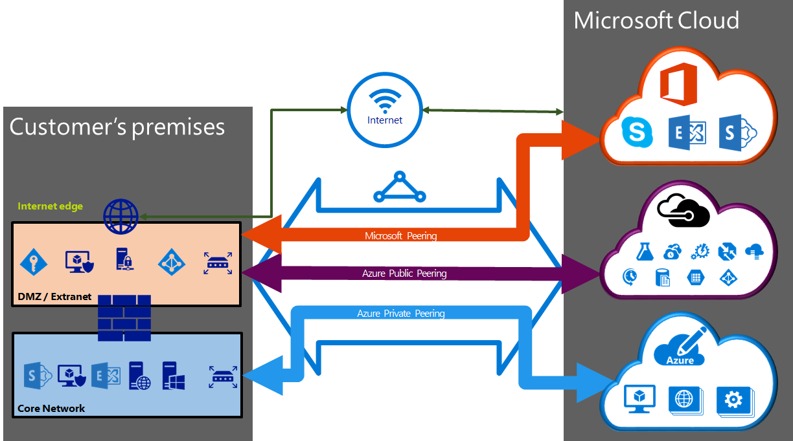

<properties 
   pageTitle="ExpressRoute 電路與路由網域 |Microsoft Azure"
   description="本頁面提供 ExpressRoute 電路與路由網域的概觀。"
   documentationCenter="na"
   services="expressroute"
   authors="cherylmc"
   manager="carmonm"
   editor=""/>
<tags 
   ms.service="expressroute"
   ms.devlang="na"
   ms.topic="article" 
   ms.tgt_pltfrm="na"
   ms.workload="infrastructure-services" 
   ms.date="10/10/2016"
   ms.author="cherylmc"/>

# ExpressRoute 電路與路由的網域

 您必須排序您的內部部署基礎結構連線至 Microsoft，連線提供者所提供的*ExpressRoute 電路*。 下圖會提供邏輯表示的 WAN 和 Microsoft 之間的連線。

## ExpressRoute 電路

*ExpressRoute 電路*代表您的內部部署基礎結構與 Microsoft 雲端服務，透過一個連線提供者之間的邏輯連線。 您可以排序多個 ExpressRoute 電路。 每個電路可在相同或不同區域]，並可連線至其部署到不同的連線提供者。 

ExpressRoute 電路不會對應到任何的實體。 電路唯一識別的標準 GUID 稱為服務鍵 （s 鍵）。 服務金鑰是資訊的唯一的 Microsoft、 連線提供者，與您之間交換。 S 鍵不是為了確保安全密碼。 有 1:1 和之間的對應 ExpressRoute 電路的鍵。

ExpressRoute 電路可以有三個獨立 peerings: Azure 公用、 Azure 私人，與 Microsoft。 每個對等為一組獨立 BGP 的工作階段每個這些設定多餘的可用性。 有 1:N (1 < = N < = 3) ExpressRoute 電路之間的對應及路由網域。 ExpressRoute 電路可以有任何一個、 兩個或所有的三個 peerings 每個 ExpressRoute 電路啟用。
 
每個電路有固定的頻寬 50 Mbps、 100 Mbps、 200 Mbps、 500 Mbps、 1 Gbps （10 Gbps），而且對應到一個連線提供者及對等的位置。 您選取的頻寬電路所有 peerings 之間共用。 

### 配額、 限制及限制

預設的配額與限制套用至每個 ExpressRoute 電路。 請參閱配額的最新狀態資訊的[Azure 訂閱及服務限制，配額和限制式](../azure-subscription-service-limits.md)頁面。

## ExpressRoute 路由網域

ExpressRoute 電路擁有與其相關聯的多個路由網域︰ Azure 公用、 Azure 私人，與 Microsoft。 每個路由的網域在路由器一組具有相同設定 (在 [作用中作用中或載入共用設定) 高可用性。 Azure 服務會分類為*公用 Azure*和*Azure 私用*來代表 IP 位址配置。

### 私人對等

Azure 計算服務，也就是虛擬機器 (IaaS)，而且部署虛擬網路中的雲端服務 (PaaS)，可以連接到私人對等的網域。 私人對等的網域會被視為到 Microsoft Azure 核心網路的副檔名為受信任。 您可以設定核心網路和 Azure 虛擬網路 (VNets) 之間的雙向連線。 這對等，可讓您連線至虛擬機器和雲端服務，直接在其私用的 IP 位址。  

您可以將一個以上的虛擬網路連線到私人對等的網域。 檢閱[常見問題集頁面](expressroute-faqs.md)限制和限制的資訊。 您可以造訪[Azure 訂閱及服務限制，配額和限制式](../azure-subscription-service-limits.md)的最新版本的資訊上限制。  請參閱 [[路由](expressroute-routing.md)] 頁面的路由設定的詳細資訊。

### 公用對等

Azure 儲存體、 SQL 資料庫]，以及網站等服務會提供的公用 IP 位址。 您可以私下連線到裝載於，包括您的雲端服務，透過公用等路由網域 Vip 的公用 IP 位址的服務。 您可以連接您 DMZ 公用對等的網域，並從您 WAN 連線至自己的公用 IP 位址上的所有 Azure 服務而不需要透過網際網路連線。 

從您 WAN Microsoft Azure 服務永遠起始連線。 Microsoft Azure 服務無法啟動連線到您的網路，透過此路由的網域。 一旦啟用公用對等，您可以連線至所有 Azure 服務。 我們不允許您選擇性地選取我們要為其通知路由的服務。 您可以檢閱前置詞我們通知給您透過此對等，在[Microsoft Azure 資料中心 IP 範圍](http://www.microsoft.com/download/details.aspx?id=41653)] 頁面上的清單。 每週更新頁面。

您可以使用只需要的路由網路中定義的自訂路由篩選。 請參閱 [[路由](expressroute-routing.md)] 頁面的路由設定的詳細資訊。 您可以使用只需要的路由網路中定義的自訂路由篩選。 

透過公用等路由網域支援的服務，請參閱[常見問題集頁面](expressroute-faqs.md)如需詳細資訊。 
 
### Microsoft 對等

[AZURE.INCLUDE [expressroute-office365-include](../../includes/expressroute-office365-include.md)]

連線至所有其他 Microsoft 線上服務 （例如 Office 365 服務） 會透過 Microsoft 對等。 我們可以讓您 WAN 與 Microsoft 雲端服務，透過 Microsoft 對等路由網域之間的雙向連線。 您必須只能由您或您的連線提供者所擁有的公用 IP 位址透過連線至 Microsoft 雲端服務，您必須遵守所有已定義的規則。 如需詳細資訊的[ExpressRoute 必要條件](expressroute-prerequisites.md)] 頁面，請參閱。

查看更多有關支援的服務、 成本與設定的詳細資訊的[常見問題集頁面](expressroute-faqs.md)。 連線提供者提供 Microsoft 對等支援的清單上會看到 [ [ExpressRoute 位置](expressroute-locations.md)] 頁面，如需的資訊。

## 路由網域比較

下表將比較三個路由的網域。

||**私人對等**|**公用對等**|**Microsoft 對等**|
|---|---|---|---|
|**最大值。支援的每個對等的 # 前置詞**|根據預設，搭配 ExpressRoute Premium 10000 4000|200|200|
|**支援的 IP 位址範圍**|在您 WAN 內任何有效的 IPv4 位址。|您或您的連線提供者所擁有的公用 IPv4 位址。|您或您的連線提供者所擁有的公用 IPv4 位址。|
|**以數字的需求**|私人及公用為數字。 您必須擁有公用如果您選擇要使用其中一個數字。 | 私人及公用為數字。 不過，您必須證明公用 IP 位址的擁有的權。| 私人及公用為數字。 不過，您必須證明公用 IP 位址的擁有的權。|
|**路由的介面 IP 位址**|RFC1918 及公用的 IP 位址|路由登錄中註冊您的公用 IP 位址。| 路由登錄中註冊您的公用 IP 位址。|
|**MD5 雜湊支援**| [是]|[是]|[是]|

您可以選擇以啟用下列一或多個路由的網域屬於其 ExpressRoute 電路。 您可以選擇有相同的 VPN 上放置，如果您想要將其合併成單一路由網域的所有路由網域。 您也可以將它們放在不同路由網域，類似於圖表。 建議的設定是私人對等已直接連接到核心網路，並在公開與 Microsoft 對等的連結會連線到您 DMZ。
 
如果您選擇讓所有的三個對等工作階段，您必須具有三對 BGP 工作階段 （針對每個對等的類型的一組）。 BGP 工作階段組提供的高度可用的連結。 如果您連線到圖層 2 連線提供者，您必須負責設定及管理路由。 您可以瞭解更多檢閱設定 ExpressRoute 的[工作流程](expressroute-workflows.md)。

## 後續步驟

- 尋找服務提供者。 請參閱[ExpressRoute 服務提供者及位置](expressroute-locations.md)。
- 請確定的符合所有的先決條件。 請參閱[ExpressRoute 的先決條件](expressroute-prerequisites.md)。
- 設定 ExpressRoute 連線。
    - [建立 ExpressRoute 電路](expressroute-howto-circuit-classic.md)
    - [設定路由 (電路 peerings)](expressroute-howto-routing-classic.md)
    - [連結 VNet ExpressRoute 電路](expressroute-howto-linkvnet-classic.md)
