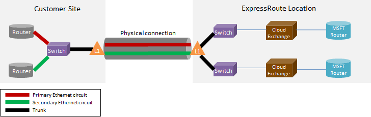

<properties
   pageTitle="ExpressRoute 常見問題集"
   description="ExpressRoute 常見問題集包含支援 Azure 服務、 成本、 資料和連線、 SLA、 提供者和位置、 頻寬，以及其他技術的詳細資料的相關資訊。"
   documentationCenter="na"
   services="expressroute"
   authors="cherylmc"
   manager="carmonm"
   editor=""/>
<tags
   ms.service="expressroute"
   ms.devlang="na"
   ms.topic="article" 
   ms.tgt_pltfrm="na"
   ms.workload="infrastructure-services"
   ms.date="10/10/2016"
   ms.author="cherylmc"/>

# ExpressRoute 常見問題集

## 什麼是 ExpressRoute？
ExpressRoute 是 Azure 服務可讓您私人之間建立關聯 Microsoft 資料中心，是在您的內部部署或共置設備的基礎結構。 ExpressRoute 連線不要移公用網際網路，並在網際網路上提供更高的安全性、 可靠性和使用較低的延遲時間，比一般的連線速度。

### 使用 ExpressRoute 和私人網路連線的優點是什麼？
ExpressRoute 連線不要移公用網際網路，並在網際網路上提供更高的安全性、 可靠性和使用較低且一致的延遲時間，比一般的連線速度。 在某些情況下，使用 ExpressRoute 連線之間的資料傳輸內部部署的裝置，Azure 會產生嚴重成本優點。

### 透過 ExpressRoute 支援哪些 Microsoft 雲端服務？
ExpressRoute 支援大部分今天包括 Office 365 的 Microsoft Azure 服務。  尋找推出上市上的更新]。

### 哪裡可以使用的服務？
請參閱頁面服務的位置和可用性︰ [ExpressRoute 合作夥伴及位置](expressroute-locations.md)。

### 如何使用 ExpressRoute 連線至 Microsoft，如果我沒有使用其中一個 ExpressRoute 航空公司夥伴合作關係？
您可以選取地區的航空公司，並開啟乙太網路連線到其中一個受支援的 exchange 提供者的位置。 然後，您可以對等 microsoft 提供者的位置。 核取[ExpressRoute 合作夥伴及位置](expressroute-locations.md)以查看您的服務提供者是否有任何 exchange 位置的最後一節。 然後您就可以排序透過服務提供者連線至 Azure ExpressRoute 電路。

### 多少 ExpressRoute 成本？
核取[定價詳細資料](https://azure.microsoft.com/pricing/details/expressroute/)價格資訊。

### 如果我使用的指定的頻寬 ExpressRoute 電路付款，並從 [我的網路服務提供者購買 VPN 連線必須是相同的速度？
[否]。 您可以從您的服務提供者購買 VPN 連線的任何速度。 不過，您連線至 Azure 會限制為您購買的 ExpressRoute 電路頻寬。

### 如果我使用的指定的頻寬 ExpressRoute 電路，我必須用尖峰最更高的速度，如有必要的功能？
[是]。 ExpressRoute 電路會設定為支援，您可以傳送兩次您採購沒有其他成本的頻寬限制的情況。 如果他們支援此功能，請檢查您的服務提供者。

### 我可以使用相同的私人網路連線虛擬網路與其他 Azure 服務同時嗎？
[是]。 ExpressRoute 電路，一次設定可讓您同時存取虛擬網路中的服務和其他 Azure 服務。 您將透過虛擬網路上的私人的對等路徑及其他服務公用對等的路徑。

### ExpressRoute 是否提供服務等級協定 (SLA)？
請參閱[ExpressRoute SLA 頁面](https://azure.microsoft.com/support/legal/sla/)如需詳細資訊。

## 支援的服務
透過 ExpressRoute 支援最 Azure 服務。

- 虛擬機器及部署虛擬網路中的雲端服務的連線支援的私人的對等路徑上。
- Azure 網站支援透過公用對等的路徑。
- IoT 中心支援透過公用對等的路徑。
- Office 365 支援的 Microsoft 對等路徑上。
- 所有其他服務就可以存取的公用等路徑上。 例外狀況如下所示。

    **不支援下列服務︰**

    - CDN
    - Visual Studio 小組服務載入測試
    - 多重因素驗證
    - 流量管理員

## 資料和連線

### 是否有我可以將移轉使用 ExpressRoute 的資料量限制？
我們無法的資料傳輸量設定限制。 請參閱有關頻寬費率[定價詳細資料](https://azure.microsoft.com/pricing/details/expressroute/)。

### ExpressRoute 支援哪些連線速度？
支援的頻寬優惠︰

| 50 Mbps、 100 Mbps、 200 Mbps 500 Mbps，1Gbps，2 Gbps、 5 Gbps，10Gbps |

### 可使用哪些服務提供者？
服務提供者和位置的清單，請參閱[ExpressRoute 合作夥伴及位置](expressroute-locations.md)。

## 技術詳細資料

### Azure 連接我內部部署的位置的技術需求是什麼？
請參閱[ExpressRoute 必要條件] 頁面](expressroute-prerequisites.md)的需求。

### 有 ExpressRoute 的連線重複？
[是]。 每個 Express 路由電路有的連線設定提供高可用性交叉重複的配對。

### 如果無法在我的 ExpressRoute 連結會遺失連線嗎？
如果其中一個交叉連線失敗，就不會遺失連線。 使用支援的網路負載多餘的連線。 此外，您就可以在對等的其他位置，以達到失敗恢復建立多個電路。

### 如果我不在雲端 exchange 放在一起，我的服務提供者提供點對點連接，我需要重新排列我內部網路和 Microsoft 之間的兩個實體連接？ 
否，您只需要一個實體連接您的服務提供者建立兩個乙太網路虛擬電路透過實體連線。 1 (L1) 裝置終止的實體連線 （例如光纖） 在 [圖層上 （請參閱下方圖像）。 兩個乙太網路虛擬電路會使用不同的虛擬區域網路 Id，分別電路主要和次要標記。 這些虛擬區域網路識別碼位於外部 802.1Q 乙太網路頁首。 內部 802.1Q 乙太網路 （未顯示） 的標頭] 已對應至特定的[ExpressRoute 路由網域](expressroute-circuit-peerings.md)。 

### 我可以延伸我虛擬其中一項以 Azure 使用 ExpressRoute 嗎？
[否]。 我們不支援層級 2 連線延伸到 Azure。

### 可以在我的訂閱中有一個以上的 ExpressRoute 電路？
[是]。 您可以在您的訂閱中有一個以上的 ExpressRoute 電路。 預設的限制的專用電路數設定為 10。 您也可以連絡 Microsoft 支援人員，如有需要請增加限制。

### 可以使用不同的服務提供者的 ExpressRoute 電路嗎？
[是]。 您可以將 ExpressRoute 電路有許多服務提供者。 每個 ExpressRoute 電路會只有一項服務提供者與相關聯。

### 如何將我虛擬網路連線至 ExpressRoute 電路
概述的基本步驟如下。

- 您必須建立 ExpressRoute 電路，並將它啟用的服務提供者。
- 您或提供者必須設定 BGP 對等 (s)。
- 您必須連結 ExpressRoute 電路虛擬網路。

如需詳細資訊，請參閱[電路佈建及電路狀態的 ExpressRoute 工作流程](expressroute-workflows.md)。

### 是否有我 ExpressRoute 電路連線界限？
[是]。 [ExpressRoute 合作夥伴和位置](expressroute-locations.md)] 頁面上提供 ExpressRoute 電路連線邊界的概觀。 連線的 ExpressRoute 電路僅限於單一淉區域。 連線可以展開，以啟用 ExpressRoute 進階功能交互淉的區域。

### 我可以連結至多個虛擬 ExpressRoute 電路網路嗎？
[是]。 您可以連結 ExpressRoute 電路最多 10 個虛擬網路。

### 我有多個 Azure 訂閱包含虛擬網路。 我可以連線的個別訂閱單一 ExpressRoute 電路虛擬網路？
[是]。 您可以授權使用單一 ExpressRoute 電路最多 10 個其他 Azure 訂閱。 啟用 ExpressRoute 進階功能，可以增加此限制。

如需詳細資訊，請參閱[共用跨多個訂閱 ExpressRoute 電路](expressroute-howto-linkvnet-arm.md)。

### 虛擬網路連線至相同的電路隔離彼此嗎？
[否]。 連結至相同的 ExpressRoute 電路的所有虛擬網路屬於相同的路由網域，並不是從路由角度彼此隔離。 如果您需要傳送隔離，必須建立個別的 ExpressRoute 電路。

### 我能有一個虛擬的網路連線到多個 ExpressRoute 電路？
[是]。 您可以連結最多 4 ExpressRoute 電路與單一虛擬網路。 他們的順序必須透過 4 不同的[ExpressRoute 位置](expressroute-locations.md)。

### 可以存取網際網路連線到 ExpressRoute 電路我虛擬網路嗎？
[是]。 如果您不具有通知預設路由 (0.0.0.0 / 0) 或 BGP 工作階段透過網際網路傳送前置詞，您可以從 [連結至 ExpressRoute 電路虛擬網路連線至網際網路。

### 我可以封鎖網際網路連線至虛擬網路連線到 ExpressRoute 電路？
[是]。 您可以通知封鎖所有的網際網路連線至虛擬機器部署虛擬網路中的預設路由 (0.0.0.0 / 0)，並將 out 透過 ExpressRoute 電路的所有流量路由都傳送。 請注意，是否您通知預設路由，我們會強制流量移至您的部署公用對等 （例如 Azure 儲存和 SQL DB） 後所提供的服務。 您必須設定路由器透過公用對等的路徑，或透過網際網路流量返回 Azure。

### 可以與彼此連結到相同的 ExpressRoute 電路虛擬網路嗎？
[是]。 虛擬機器中虛擬網路連線到相同的 ExpressRoute 電路部署可以彼此。

### 可以使用網站-連線的 ExpressRoute 搭配虛擬網路嗎？
[是]。 網站-Vpn ExpressRoute 可以同時存在。

### 可以從網站-/ 點為網站的設定，以使用 ExpressRoute 移動虛擬網路嗎？
[是]。 您必須建立網路內部的虛擬 ExpressRoute 閘道器。 會有程序與相關聯的小型停機時間。

### 我需要什麼透過 ExpressRoute 連線至 Azure 儲存空間？
您必須建立 ExpressRoute 電路，並設定公用對等的路由。

### 有限制，我可以通知的路由數目嗎？
[是]。 我們接受進位至 4000 路由前置詞為私人的對等及 200 每個公用對等和 Microsoft 對等。 您可以將它增加到 10000 路由的私人外面，如果您啟用 ExpressRoute 進階功能。

### 是否有我可以透過 BGP 工作階段通知的 IP 範圍限制？
我們不接受私人前置詞 (RFC1918) 公開與 Microsoft 對等 BGP 工作階段。

### 如果超過 BGP，會發生什麼情況限制？
刪除 BGP 工作階段。 前置詞計數低於限制之後，它們會被重設。

### 什麼是 ExpressRoute BGP 保留時間？ 可加以調整嗎？
保留時間已 180。 保持訊息傳送每隔 60 秒。 這些修正了 Microsoft 方無法變更的設定。

### 我要到我的虛擬網路通知的預設路由 (0.0.0.0 / 0) 之後，我無法啟動我的 Azure Vm 上執行的 Windows。 如何以我修正此問題？
下列步驟可協助辨識啟用要求的 Azure:

1. 建立您的 ExpressRoute 電路公用的對等。
2. 執行 DNS 查閱並尋找**kms.core.windows.net**的 IP 位址
3. 然後執行下列兩個項目，讓來自 Azure 啟用要求，並會接受邀請，就會辨識出金鑰管理服務。
    - 在您的內部網路上路由傳送 IP 位址 （在步驟 2 中取得） 回到透過公用的對等的 Azure 的流量。
    - 有 NSP 提供者字形-pin Azure 透過公用的對等的流量。

### 我可以變更 ExpressRoute 電路的頻寬嗎？
[是]。 您可以增加 ExpressRoute 電路的頻寬，而不必將它清除。 您必須待您的連線提供者，以確保他們更新中支援的頻寬增加其網路節流。 您將不過無法以減少的 ExpressRoute 電路頻寬。 需要較低頻寬即表示 tear 向下並重新建立 ExpressRoute 電路。

### 我要如何變更 ExpressRoute 電路的頻寬？
您可以更新的頻寬 ExpressRoute 電路使用專用的更新電路 API 及 PowerShell 指令程式。

## ExpressRoute 進階版

### 什麼是 ExpressRoute 進階版？
ExpressRoute 進階版是下列功能的集合。

 - 增加路由表格限制從 4000 路由至私人對等的 10000 路由。
 - 增加 VNets 可連線至 ExpressRoute 電路的數目 （預設為 10）。 請參閱下的表以更多詳細資料。
 - 全域透過 Microsoft 核心網路連線。 您現在可以連結另一個區域 ExpressRoute 電路 VNet 一個淉區域中。 **範例︰**您可以連結建立中歐洲西部建立矽谷 ExpressRoute 電路 VNet。
 - 連線至 Office 365 服務及 CRM Online。

### 多少 VNets 可以我連結至 ExpressRoute 電路如果啟用 [ExpressRoute 進階版？
下表顯示的 ExpressRoute 限制和每 ExpressRoute 電路 VNets 數目。

[AZURE.INCLUDE [expressroute-limits](../../includes/expressroute-limits.md)]

### 我要如何啟用 ExpressRoute 進階版？
當功能已啟用，可以關閉更新電路狀態時，您可以啟用 ExpressRoute 進階功能。 您可以在電路建立時啟用 ExpressRoute 進階版，或撥打專用的更新電路 API / PowerShell cmdlet 來啟用 ExpressRoute 進階版。

### 如何停用 ExpressRoute 進階版？
您可以停用 ExpressRoute 進階版，則可電話專用的更新電路 API / PowerShell cmdlet，您必須確定您有縮放連線必須符合停用 ExpressRoute premium 之前的預設限制。 我們將會失敗要求以停用 ExpressRoute 進階版，如果您使用縮放以外的預設限制。

### 我可以選擇及選擇我想要從進階功能設定的功能嗎？
[否]。 您無法選擇所需的功能。 當您開啟 ExpressRoute 進階版時，我們會啟用所有功能。

### 多少 ExpressRoute 進階版成本？
請參閱成本[定價詳細資料](https://azure.microsoft.com/pricing/details/expressroute/)。

### 我要付除了標準 ExpressRoute 費用 ExpressRoute 進階版嗎？
[是]。 ExpressRoute 進階版費用掌握 ExpressRoute 電路費用和連線提供者所需的費用。

## ExpressRoute 和 Office 365 服務 CRM Online

[AZURE.INCLUDE [expressroute-office365-include](../../includes/expressroute-office365-include.md)]

### 如何建立連線到 Office 365 服務及 CRM Online ExpressRoute 電路？

1. 檢閱[ExpressRoute 先決條件](expressroute-prerequisites.md)頁面，以確定您符合需求。
2. 檢閱服務提供者和[ExpressRoute 合作夥伴](expressroute-locations.md)和位置的位置，以確保都符合您的連線需求的清單。
3. 檢閱[網路規劃與效能調整 Office 365](http://aka.ms/tune/)規劃您的容量需求。
4. 請遵循下列設定連線[電路佈建及電路狀態的 ExpressRoute 工作流程](expressroute-workflows.md)的工作流程中所列的步驟。

>[AZURE.IMPORTANT] 請確定您已設定連線至 Office 365 服務及 CRM Online 時啟用 ExpressRoute 進階版附加元件。

### 我需要啟用 Azure 公用對等連線至 Office 365 服務和 CRM Online 嗎？
否，您只需要啟用 Microsoft Peering。 Azure AD 驗證資料將會傳送到 Microsoft Peering。 

### 我現有的 ExpressRoute 電路可支援連線至 Office 365 服務及 CRM Online 嗎？
[是]。 您現有的 ExpressRoute 電路可以設定為支援 Office 365 服務的連線。 請確定您已連線至 Office 365 服務，並確認您已啟用進階版附加元件有足夠的容量。 [網路規劃與效能調整 Office 365](http://aka.ms/tune/)可協助您規劃您連線的需求。 請參閱[建立及修改 ExpressRoute 電路](expressroute-howto-circuit-classic.md)。

### 可以存取服務，透過 ExpressRoute 連線哪些 Office 365 嗎？

請參閱[Office 365 Url 與 IP 位址範圍](http://aka.ms/o365endpoints)ExpressRoute 支援服務的最新清單的頁面。

### 多少 ExpressRoute Office 365 服務及 CRM Online 成本？
Office 365 服務及 CRM Online 需要啟用進階版附加元件。 [定價詳細資料] 頁面](https://azure.microsoft.com/pricing/details/expressroute/)的 ExpressRoute 提供成本詳細的資料。

### Office 365 的 ExpressRoute 支援哪些地區？
請參閱[ExpressRoute 合作夥伴和位置](expressroute-locations.md)的清單上的夥伴和位置 ExpressRoute 支援位置的詳細資訊。

### 我可以存取 Office 365 在網際網路上即使 ExpressRoute 已設定為 [我的組織嗎？
[是]。 Office 365 服務端點是透過網際網路連線，即使 ExpressRoute 已設定為您的網路。 如果您是在已連線至 ExpressRoute 透過 Office 365 服務的位置，您會連線到 ExpressRoute。

### Dynamics AX 線上可存取透過 ExpressRoute 連線？
否，它不支援。
