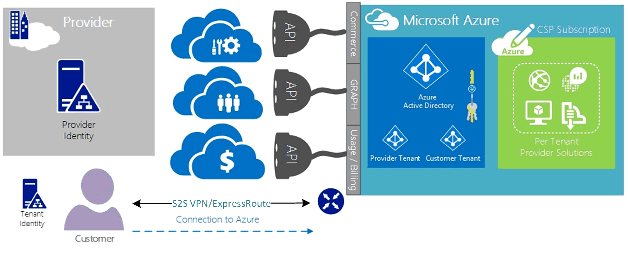

<properties
   pageTitle="雲端解決方案提供者的 azure ExpressRoute |Microsoft Azure"
   description="本文提供雲端服務提供者想要併入 Azure 服務及 ExpressRoute 將其產品的資訊。"
   documentationCenter="na"
   services="expressroute"
   authors="richcar"
   manager="carmonm"
   editor=""/>
<tags
   ms.service="expressroute"
   ms.devlang="na"
   ms.topic="get-started-article"
   ms.tgt_pltfrm="na"
   ms.workload="infrastructure-services"
   ms.date="10/10/2016"
   ms.author="richcar"/>

# 雲端解決方案提供者 (CSP) ExpressRoute

Microsoft 提供您的客戶，而不需投資開發這些新服務超比例傳統的轉售商和服務 distributors (CSP) 能夠快速佈建新服務及解決方案。 若要允許雲端解決方案提供者 (CSP) 可直接管理這些新的服務，Microsoft 提供程式和 Api，代表您的客戶管理 Microsoft Azure 資源 CSP。 這些資源是 ExpressRoute。 ExpressRoute 可讓 Azure 服務連線現有客戶資源 CSP。 ExpressRoute 是高速私人通訊連結至 Azure 中的服務。 

ExpresRoute 組成電路高可用性附加至單一客戶訂閱，不能共用多名客戶的一組。 每個電路應該終止中不同路由器維護的可用性。

>[AZURE.NOTE] 這表示的大型/複數實作單一客戶會需要多個 ExpressRoute 電路 ExpressRoute 上有頻寬和連線大寫字。

Microsoft Azure 提供成長一些您可以為客戶提供的服務。  最佳採取善用這些服務會需要使用 ExpressRoute 連線，提供高速度低延遲存取 Microsoft Azure 環境。

## Microsoft Azure 管理
Microsoft 提供與管理 Azure 客戶訂閱藉由使用與您的服務管理系統的程式設計整合 Api Csp。 您可以找到支援的管理功能[以下](https://msdn.microsoft.com/library/partnercenter/dn974944.aspx)。

## Microsoft Azure 資源管理
根據您有客戶合約會決定如何管理訂閱。 CSP 可以直接建立並管理資源或客戶進行的維修作業可以有 Microsoft Azure 訂閱的控制權，並建立所需的 Azure 資源。 如果您的客戶管理的 Microsoft Azure 訂閱中的資源建立他們會使用其中一個兩種模式: [連線的 「 模型或 「 直接至 「 模型。 下列各節中的詳細說明這些模型。  

### 連線到模型

  

連線到模型中 CSP 會建立您的資料中心與客戶的 Azure 訂閱之間的直接連接。 直接連線是使用 ExpressRoute，以 Azure 連接您的網路。 客戶連線到您的網路。 這種情況需要客戶經過 CSP 網路存取 Azure 服務。 

如果您的客戶會有其他 Azure 不管理您的訂閱，他們會使用公用網際網路或自己私人連線連線到非 CSP 訂閱下佈建這些服務。 

針對 CSP 管理 Azure 服務，則假設 CSP 具有然後會複寫到 Azure Active Directory 管理其 CSP 訂閱透過 Administrate-On-Behalf-Of (AOBO) 的先前建立的客戶身分識別存放區。 這種情況下的鍵驅動程式包含位置指定的合作夥伴或服務提供者都已建立一對多關聯性客戶、 客戶目前正在使用的服務提供者或合作夥伴有想来提供提供彈性和地址的客戶無法滿足 CSP 單獨的挑戰的提供者主控和 Azure 裝載解決方案的組合。 此模型如下所示在**圖**中。

### 連線至模型

連線至模型中的服務提供者建立其客戶的資料中心與客戶的 （客戶） 透過使用 ExpressRoute CSP 佈建 Azure 訂閱之間的直接連線網路。

>[AZURE.NOTE] ExpressRoute 客戶想要建立和維護 ExpressRoute 電路。  

此連線案例需要的客戶連線透過客戶網路存取 CSP 管理 Azure 訂閱，直接使用直接網路連線的建立、 擁有和客戶管理完全或部分。 它會引用本身的提供者目前沒有這客戶身分識別存放區建立，並提供者會複製到 Azure Active Directory 其目前的識別存放區，透過 AOBO 其訂閱的管理協助客戶。 這種情況下的鍵驅動程式包含位置指定的合作夥伴或服務提供者都已建立一對多關聯性客戶、 客戶目前正在使用的服務提供者或合作夥伴有想来提供只根據 Azure 裝載的解決方案，而不需要使用現有的提供者資料中心或基礎結構的服務。

選擇下列兩個選項根據客戶的需求與您目前的需求，以提供 Azure 服務。 詳細資料，這些模型和相關聯的角色型存取控制、 網路連線和身分識別設計模式中的下列連結的詳細資料中包含︰
-   **角色基礎存取控制 (RBAC)** – RBAC 根據 Azure Active Directory。  Azure RBAC 的詳細資訊請參閱[以下](../active-directory/role-based-access-control-configure.md)。
-   **網路**– 涵蓋各種網路 Microsoft Azure 中的主題。
-   **Azure Active Directory (AAD)** – AAD 提供 Microsoft Azure 及第 3 的廠商 SaaS 應用程式的身分識別管理。 如需有關 Azure AD，請參閱[以下](https://azure.microsoft.com/documentation/services/active-directory/)。  

## 網路速度
ExpressRoute 支援從 50 Mb/s 10 Gb/s 的網路速度。 這個選項可讓客戶購買所需的唯一環境的網路頻寬。

>[AZURE.NOTE] 視需要而不干擾通訊]，您可以增加網路頻寬，但若要降低網路速度會需要電路清除並重新建立較低的網路速度。  

ExpressRoute 支援高速連線利用更佳的多個 vNets 至單一 ExpressRoute 電路連線。 單一 ExpressRoute 電路可以共用相同的客戶所擁有的多個 Azure 訂閱。

## 設定 ExpressRoute
若要在單一 ExpressRoute 電路支援三種類型的流量 （[路由的網域](#ExpressRoute-routing-domains)），可以設定 ExpressRoute。 此流量可以分成對等的 Microsoft Azure 公用對等與私人對等。 您可以選擇一個或所有類型的流量透過單一 ExpressRoute 電路傳送，或使用多個 ExpressRoute 電路根據 ExpressRoute 電路及客戶所需的隔離的大小。 公用資料傳輸與私人通往往返在相同的電路，可能不允許您的客戶的安全性狀態。

### 連線到模型
連線到設定，您將必須針對您所有的網路 underpinnings 裝載於 Azure 訂閱連接您的客戶資料中心的資源。 每個客戶的想要使用 Azure 功能需要自己 ExpressRoute 連線，您將管理。 您會使用相同的方法客戶想要使用採購 ExpressRoute 電路。 您將依照電路佈建及電路狀態[ExpressRoute 工作流程](./expressroute-workflows.md)文件中所述的相同步驟。 然後，您會設定來控制流量的內部部署網路和 Azure vNet 之間的框線閘道器通訊協定 (BGP) 路由。

### 連線至模型
在連線至設定中，您的客戶，已具有 Azure 現有的連線，或會啟動連結 ExpressRoute 從您的客戶自己的資料中心直接 Azure，而不是您的資料中心的網際網路服務提供者的連線。 若要開始提供的程序，連線到模型中上述客戶時，會遵循的步驟。 一旦您的客戶必須設定的內部部署路由器，都能存取您的網路 」 和 「 Azure vNets 建立電路。

您可以設定連線與設定路由協助允許您 datacenter(s) 通訊與您的資料中心中的用戶端資源，或與資源裝載於 Azure 中的資源。

## ExpressRoute 路由網域
ExpressRoute 提供三個路由網域︰ 公用、 私人以及 Microsoft 對等。 每個路由的網域設定中的可用性的作用中作用中設定的相同路由器。 如需詳細資訊 ExpressRoute 路由網域看起來[以下](./expressroute-circuit-peerings.md)。

您可以定義自訂的路由篩選器，以允許只想要允許或需要的路由。 如需詳細資訊，或若要查看如何進行這些變更，請參閱文件︰[建立及修改使用 PowerShell ExpressRoute 電路路由](./expressroute-howto-routing-classic.md)如需詳細資訊路由篩選。

>[AZURE.NOTE] Microsoft 及公用的對等連線必須透過客戶或 CSP 所擁有的公用 IP 位址，必須遵守所有已定義的規則。 如需詳細資訊，請參閱[ExpressRoute 先決條件](expressroute-prerequisites.md)頁面。  

## 路由
ExpressRoute 連線到透過 Azure 虛擬網路閘道 Azure 的網路。 網路閘道器提供的 Azure 虛擬網路路由。

建立 Azure 虛擬網路時，也會建立從 vNet 的子網路 vNet 的預設路由表格。 如果預設路由表沒有足夠的自訂解決方案路由可以建立自訂的應用裝置或區塊路由至特定的子網路或外部網路路由外寄流量。

### 預設路由
預設路由表包含下列路由︰

- 子網路內路由
- 子網路至-子網路中虛擬網路
- 到網際網路
- 使用 VPN 閘道器的虛擬網路至虛擬網路
- 使用 VPN 或 ExpressRoute 閘道器的虛擬網路-至-內部部署網路

  

### 使用者定義路由 (UDR)
使用者定義的路徑允許虛擬網路或在其中一個其他預先定義閘道器 （ExpressRoute; 網際網路或 VPN） 中的其他子網路輸出指定子網路流量的控制項。 取代預設的系統路由表格時，可以與使用者定義路由表格的預設路由表取代自訂路由。 透過使用者定義的路徑，客戶可以建立特定路由至裝置，例如防火牆或侵入偵測設備，或封鎖子網路主機服務的使用者定義的路由至特定的子網路存取。 使用者定義路由概略查看[以下](../virtual-network/virtual-networks-udr-overview.md)。 

## 安全性
根據的模型是使用連線至或連線到客戶其 vNet 中定義的安全性原則，或提供安全性原則需求以 CSP 來定義其 vNets。 您可以定義以下安全性準則︰

1.  **客戶隔離**— Azure 平台提供客戶隔離藉由將客戶編號] 和 [vNet 資訊儲存在安全資料庫中，這用來封裝 GRE 通道中的每個客戶的流量。
2.  定義進出流量中 vNets Azure 中的子網路中的**網路安全性群組 (NSG)**規則。 根據預設，NSG 包含封鎖規則，以封鎖流量導向 vNet 從網際網路]，並允許的 vNet 內的資料傳輸規則。 如需有關網路安全性群組看[以下](https://azure.microsoft.com/blog/network-security-groups/)。
3.  **強制通道**，這是來自 Azure ExpressRoute 連線到上的部署資料中心重新導向的繫結的網際網路流量重新導向的選項。 如需有關強制通道看[以下](./expressroute-routing.md#advertising-default-routes)。  

4.  **加密**，即使 ExpressRoute 電路專用於特定的客戶，有的網路提供者可能會破壞，允許入侵者檢查封包傳輸的可能性。 地址潛在，客戶或 CSP 可以加密流量連線定義 IPSec 通道模式原則傳送開啟的部署資源和 Azure 之間的所有流量的資源 (選用通道模式 IPSec 參照客戶 1 圖 5: ExpressRoute 安全性、 上方)。 第二個選項就是使用防火牆應用裝置在每個 ExpressRoute 電路結束點。 這需要額外的第 3 廠商防火牆 Vm/就安裝兩端透過 ExpressRoute 電路加密流量。

  

## 後續步驟
雲端解決方案提供者服務可讓您以增加您要的值，而不需要耗費基礎架構與功能所購物品維持您做為主要外包提供者的位置與客戶的方式。 與 Microsoft Azure 緊密整合可透過 CSP API，讓您可以整合管理的 Microsoft Azure 您現有的管理架構內完成。  

其他資訊位於下列連結︰

[Microsoft 雲端解決方案提供者程式](https://partner.microsoft.com/en-US/Solutions/cloud-reseller-overview)。  
[準備好交易雲端解決方案提供者](https://partner.microsoft.com/en-us/solutions/cloud-reseller-pre-launch)。  
[Microsoft 雲端解決方案提供者的資源](https://partner.microsoft.com/en-us/solutions/cloud-reseller-resources)。
