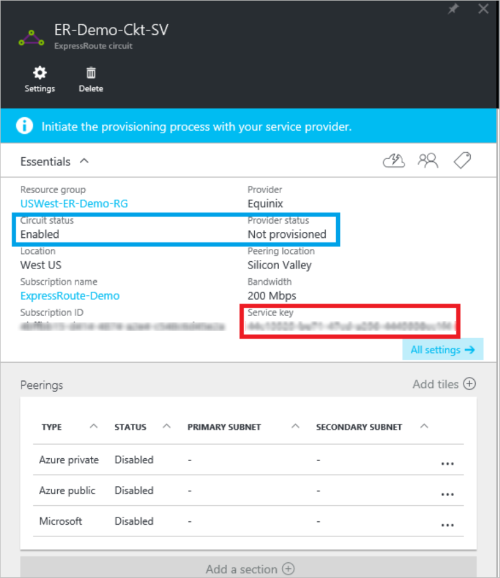

<properties
   pageTitle="建立及修改使用資源管理員和 Azure 入口網站的 ExpressRoute 電路 |Microsoft Azure"
   description="本文將說明如何建立、 佈建、 驗證、 更新、 刪除及 deprovision ExpressRoute 電路。"
   documentationCenter="na"
   services="expressroute"
   authors="cherylmc"
   manager="carmonm"
   editor=""
   tags="azure-resource-manager"/>
<tags
   ms.service="expressroute"
   ms.devlang="na"
   ms.topic="article"
   ms.tgt_pltfrm="na"
   ms.workload="infrastructure-services"
   ms.date="10/10/2016"
   ms.author="cherylmc"/>

# 建立及修改 ExpressRoute 電路

> [AZURE.SELECTOR]
[Azure 入口網站的資源管理員](expressroute-howto-circuit-portal-resource-manager.md)
[PowerShell-資源管理員](expressroute-howto-circuit-arm.md)
[PowerShell-傳統](expressroute-howto-circuit-classic.md)

本文將說明如何建立使用 Azure 入口網站和 Azure 資源管理員部署模型的 Azure ExpressRoute 電路。 下列步驟會顯示如何檢查的電路狀態、 更新，或刪除和 deprovision 它。

**關於 Azure 部署模型**

[AZURE.INCLUDE [vpn-gateway-clasic-rm](../../includes/vpn-gateway-classic-rm-include.md)] 

## 開始之前

- 設定之前，請檢閱的[必要條件](expressroute-prerequisites.md)和[工作流程](expressroute-workflows.md)。
- 請確定您能存取至[Azure 入口網站](https://portal.azure.com)。
- 請確定您有權限可建立新的網路資源。 如果您沒有正確的權限，請連絡您的帳戶管理員。

## 建立與佈建 ExpressRoute 電路

### 1.登入 Azure 入口網站

從瀏覽器中，瀏覽至[Azure 入口網站](http://portal.azure.com)，然後使用您 Azure 帳戶登入。

### 2。 建立新的 ExpressRoute 電路

>[AZURE.IMPORTANT] 您的 ExpressRoute 電路從發出的服務金鑰方式付款。 請確定您準備好佈建電路連線提供者時執行此作業。

1. 您可以建立 ExpressRoute 電路選取選項以建立新的資源。 按一下 [**新增** > **網路** > **ExpressRoute**，如下圖所示︰

    

2. 按一下 [ **ExpressRoute**之後，您會看到**建立 ExpressRoute 電路**刀。 當您正在填寫此刀上的值時，請確定您指定正確的 SKU 層及資料測量。

    - **層**會決定是否已啟用 ExpressRoute 標準或 ExpressRoute 進階版附加元件。 您可以指定**標準**標準 SKU 或**進階版**取得進階版附加元件。

    - **資料計量**決定付款類型。 您可以指定**計量付費**計量付費的資料計劃和**無限制**，無限制的資料計劃。 請注意，您可以從**計量付費**變更付款類型，為**無限制**，但您無法變更類型從**無限制****計量付費**。

    

>[AZURE.IMPORTANT] 請注意對等的位置，表示[實際位置](expressroute-locations.md)對 microsoft 等位置。 這**連結至 [位置] 屬性，參照到地理區域 Azure 網路資源提供者的所在位置**。 雖然無關，但最好選擇靠近對等的位置電路地理區域網路資源提供者。 

### 3.檢視電路與屬性

**檢視所有電路**

您可以檢視您所選取左側功能表上的**所有資源**所建立的所有電路。
    

**檢視內容**

    You can view the properties of the circuit by selecting it. On this blade, note the service key for the circuit. You must copy the circuit key for your circuit and pass it down to the service provider to complete the provisioning process. The circuit key is specific to your circuit.

### 4.傳送服務金鑰連線提供者提供

在此刀，**提供者狀態**會提供的服務提供者一邊佈建的目前狀態的詳細資訊。 **電路狀態**提供 Microsoft 方的狀態。 如需有關電路佈建狀態的詳細資訊，請參閱[工作流程](expressroute-workflows.md#expressroute-circuit-provisioning-states)。

當您建立新的 ExpressRoute 電路時，電路會在下列狀態︰

提供者狀態︰ 不佈建後 
電路狀態︰ 啟用

當您啟用正在連線提供者的下列狀態會變更電路︰

提供者狀態︰ 佈建 
電路狀態︰ 啟用

您可以使用 ExpressRoute 電路，它必須在下列狀態︰

提供者狀態︰ 佈建 
電路狀態︰ 啟用

### 5。 定期檢查狀態及電路鍵的狀態

您可以檢視中選取感興趣的電路的屬性。 檢查**狀態提供者**，並確保的郵件會移到**Provisioned**再繼續進行。

### 6。 建立您路由設定

如需逐步指示，請參閱建立及修改電路 peerings [ExpressRoute 電路路由設定](expressroute-howto-routing-portal-resource-manager.md)文件。

>[AZURE.IMPORTANT] 電路與提供圖層 2 connectivity 服務的服務提供者建立的只適用於下列指示進行。 如果您使用的提供受管理的服務提供者的 [圖層 3 服務 (通常是 IP VPN，例如 MPLS)，您的連線提供者會設定並管理您的路由。

### 7.連結 ExpressRoute 電路虛擬網路

接下來，連結至您的 ExpressRoute 電路的虛擬網路。 使用資源管理員部署模型時，請使用 [[連結至 ExpressRoute 電路的虛擬網路](expressroute-howto-linkvnet-arm.md)文章。

## 快速 ExpressRoute 電路的狀態

您可以藉由選取檢視電路的狀態。 

## 修改 ExpressRoute 電路

您可以修改 ExpressRoute 電路的特定屬性，而不會影響連線。 此時，您無法修改使用 Azure 入口網站的 ExpressRoute 電路內容。 不過，您可以使用 PowerShell 來修改電路屬性。 如需詳細資訊，請參閱 [[修改使用 PowerShell ExpressRoute 電路](expressroute-howto-circuit-arm.md#modify)] 區段。

您可以執行下列動作不中斷的情況︰

- 啟用或停用您的 ExpressRoute 電路 ExpressRoute 進階版附加元件。

- 增加您 ExpressRoute 電路的頻寬。 請注意，不支援降級的電路頻寬。 

- 變更測量計劃計量付費的資料不受限制的資料。 請注意，不支援測量的方案不受限制的資料變更計量付費的資料。

-  您可以啟用及停用**允許傳統的作業**。

如需有關限制和限制的詳細資訊，請參閱[ExpressRoute 常見問題集](expressroute-faqs.md)。

## 取消及刪除 ExpressRoute 電路

您可以刪除您 ExpressRoute 電路，選取 [**刪除**] 圖示。 請注意下列事項︰

- 您必須取消所有的虛擬網路，從 ExpressRoute 電路。 如果這項作業失敗，請核取任何虛擬網路是否會連結至電路。

- 如果 ExpressRoute 電路服務提供者佈建狀態**提供**或**Provisioned**您必須使用您的服務提供者 deprovision 他們電路。 我們會繼續保留資源，並向您收取費用，直到完成解除電路服務提供者，並通知我們。

- 如果服務提供者已取消 （服務提供者佈建狀態設定為**不佈建後**） 的電路提供您可以刪除線電路。 這會停止電路帳單

## 後續步驟

建立您的電路之後，請確定您執行下列動作︰

- [建立及修改您 ExpressRoute 電路路由](expressroute-howto-routing-portal-resource-manager.md)
- [連結您 ExpressRoute 電路虛擬網路](expressroute-howto-linkvnet-arm.md)
