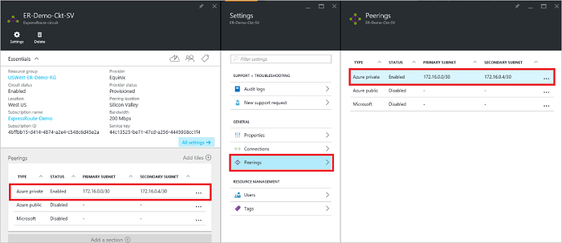
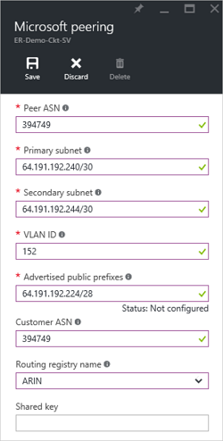

<properties
   pageTitle="如何設定使用 Azure 入口網站 ExpressRoute 電路路由 |Microsoft Azure"
   description="本文會引導您建立及佈建私人、 公開與 Microsoft 對等的 ExpressRoute 電路的步驟。 本文也會顯示如何檢查狀態更新或刪除您電路 peerings。"
   documentationCenter="na"
   services="expressroute"
   authors="cherylmc"
   manager="carmonm"
   editor=""
   tags="azure-resource-manager"/>
<tags
   ms.service="expressroute"
   ms.devlang="na"
   ms.topic="hero-article" 
   ms.tgt_pltfrm="na"
   ms.workload="infrastructure-services"
   ms.date="10/10/2016"
   ms.author="cherylmc"/>

# 建立及修改的 ExpressRoute 電路路由

> [AZURE.SELECTOR]
[Azure 入口網站的資源管理員](expressroute-howto-routing-portal-resource-manager.md)
[PowerShell-資源管理員](expressroute-howto-routing-arm.md)
[PowerShell-傳統](expressroute-howto-routing-classic.md)

本文會引導您建立及管理使用 Azure 入口網站與資源管理員部署模型 ExpressRoute 電路路由設定的步驟。

**關於 Azure 部署模型**

[AZURE.INCLUDE [vpn-gateway-clasic-rm](../../includes/vpn-gateway-classic-rm-include.md)] 

## 設定的先決條件

- 請確定的檢閱[先決條件](expressroute-prerequisites.md)頁面、[路由需求](expressroute-routing.md)頁面和[工作流程](expressroute-workflows.md)] 頁面之前設定。
- 您必須使用中的 ExpressRoute 電路。 依照指示操作來[建立 ExpressRoute 電路](expressroute-howto-circuit-arm.md)，而且有啟用您的連線提供者，再繼續進行 「 電路。 ExpressRoute 電路必須能夠並啟用狀態，您就可以執行如下所述的指令程式。

電路與服務提供者提供第 2 層 connectivity 服務建立只適用於下列指示進行。 如果您使用的服務提供者提供受管理的圖層 3 服務 (通常是 IPVPN，例如 MPLS)，會設定您的連線提供者，並管理您的路由。 

>[AZURE.IMPORTANT] 我們目前不通知 peerings 透過服務管理入口網站的服務提供者設定。 我們正在推出啟用此功能。 請檢查您的服務提供者設定 BGP peerings 之前。

您可以設定一個、 兩個或所有三個 peerings （Azure 私人、 Azure 公開與 Microsoft） ExpressRoute 電路。 您可以設定 peerings 以您選擇的順序。 不過，您必須確定在您完成設定的對等的各一次。 

## Azure 私人對等

本節說明如何建立、 取得、 更新及刪除 ExpressRoute 電路 Azure 私人對等的設定。 

### 若要建立 Azure 私人對等

1. 設定 ExpressRoute 電路。 請確定的電路已完全佈建連線提供者在繼續之前。

    

2. 設定電路 Azure 私人對等。 請確定您有下列項目，才能繼續進行下一個步驟︰

    - /30 子網路的主要的連結。 這不能保留虛擬網路的任何位址空間的一部分。
    - /30 子網路的次要的連結。 這不能保留虛擬網路的任何位址空間的一部分。
    - 若要建立外面上有效的虛擬區域網路 ID。 確定沒有其他對等電路中使用相同的虛擬區域網路識別碼。
    - 為的對等的數字。 您可以使用 2 位元組和數字的 4 位元組。 您可以使用私人的此對等的數字。 請確定您不使用 65515 中。
    - MD5 雜湊如果您選擇要使用其中一個。 **此為選用步驟**。

3. 選取 Azure 私人對等資料列，如下所示。
    
    
    

4. 設定私人對等。 下圖顯示組態範例。

    

    
5. 一旦您指定的所有參數，儲存設定。 當已成功接受設定時，您會看到類似下面的範例。

    
    

### 若要檢視 Azure 私人的對等詳細資料

您可以檢視選取 [對等 Azure 私人對等的屬性。

### 若要更新 Azure 私人的對等設定

您可以選取對等的列和修改的對等的屬性。 

### 若要刪除 Azure 私人對等

選取刪除] 圖示，如下所示，您可以移除您對等的設定。

## Azure 公用對等

本節說明如何建立、 取得、 更新及刪除 ExpressRoute 電路 Azure 公用對等的設定。 

### 若要建立 Azure 公用對等

1. 設定 ExpressRoute 電路。 請確定的電路已完全佈建連線提供者進一步在繼續之前。

    

2. 設定電路 Azure 公用對等。 請確定您有下列項目，才能繼續進行下一個步驟︰

    - /30 子網路的主要的連結。 
    - /30 子網路的次要的連結。 
    - 用來設定此對等的所有 IP 位址必須都是有效的公用 IPv4 位址。
    - 若要建立外面上有效的虛擬區域網路 ID。 確定沒有其他對等電路中使用相同的虛擬區域網路識別碼。
    - 為的對等的數字。 您可以使用 2 位元組和數字的 4 位元組。
    - MD5 雜湊如果您選擇要使用其中一個。 **此為選用步驟**。

3. 選取 Azure 公用等資料列，如下所示。
    
    
    

4. 設定公用對等。 下圖顯示組態範例。

    

    
5. 一旦您指定的所有參數，儲存設定。 當已成功接受設定時，您會看到類似下面的範例。

    
    

### 若要檢視 Azure 公用等詳細資料

您可以檢視選取 [對等 Azure 公用對等的屬性。

### 若要更新 Azure 公用等設定

您可以選取對等的列和修改的對等的屬性。 

### 若要刪除 Azure 公用對等

選取刪除] 圖示，如下所示，您可以移除您對等的設定。

## Microsoft 對等

本節提供如何建立、 取得、 更新及刪除 ExpressRoute 電路 Microsoft 對等的設定指示。 

### 若要建立 Microsoft 對等

1. 設定 ExpressRoute 電路。 請確定的電路已完全佈建連線提供者進一步在繼續之前。

    

2. 設定 Microsoft 對等電路。 請確定您有下列資訊，再繼續進行。

    - /30 子網路的主要的連結。 這必須是有效公用 IPv4 首碼您所擁有與登錄中 RIR / IRR。
    - /30 子網路的次要的連結。 這必須是有效公用 IPv4 首碼您所擁有與登錄中 RIR / IRR。
    - 若要建立外面上有效的虛擬區域網路 ID。 確定沒有其他對等電路中使用相同的虛擬區域網路識別碼。
    - 為的對等的數字。 您可以使用 2 位元組和數字的 4 位元組。
    - **通知首碼︰**您必須提供所有您計劃通知透過 BGP 工作階段的前置字元的清單。 僅限公用 IP 位址首碼會接受。 如果您要傳送一組前置詞，您可以傳送以逗號分隔的清單。 這些前置詞必須在 RIR 中註冊您 / IRR。
    - **客戶 ASN:**如果您是以數字對等未註冊的廣告前置詞，您可以指定其所註冊的另存新檔號碼。 **此為選用步驟**。
    - **路由登錄名稱︰**您可以指定 RIR / IRR 的數字和前置詞是註冊。 **此為選用步驟。**
    - MD5 雜湊，如果您選擇要使用其中一個。 **此為選用步驟。**
    
3. 您可以選取您想要設定，如下所示的對等。 選取 Microsoft 對等的列。
    
    
    

4.  設定 Microsoft 對等。 下圖顯示組態範例。

    

    
5. 一旦您指定的所有參數，儲存設定。 

    如果您電路，取得驗證所需的狀態 （如下圖所示），您必須開啟以證明給我們的支援小組的前置詞的擁有權的支援票證。  
    
    

    您可以直接從入口網站，如下所示開啟支援票證   
    
    

6. 當已成功接受設定時，您會看到類似下面的範例。

    
    

### 若要檢視 Microsoft 對等的詳細資料

您可以檢視選取 [對等 Azure 公用對等的屬性。

### 更新 Microsoft 對等的設定

您可以選取對等的列和修改的對等的屬性。 

### 若要刪除 Microsoft 對等

選取刪除] 圖示，如下所示，您可以移除您對等的設定。

## 後續步驟

下一個步驟，[連結到 ExpressRoute 電路 VNet](expressroute-howto-linkvnet-arm.md)。

-  如需有關 ExpressRoute 工作流程的詳細資訊，請參閱[ExpressRoute 工作流程](expressroute-workflows.md)。

-  如需有關電路對等的詳細資訊，請參閱[ExpressRoute 電路與路由的網域](expressroute-circuit-peerings.md)。

-  如需有關如何使用虛擬網路的詳細資訊，請參閱[虛擬網路概觀](../virtual-network/virtual-networks-overview.md)。

