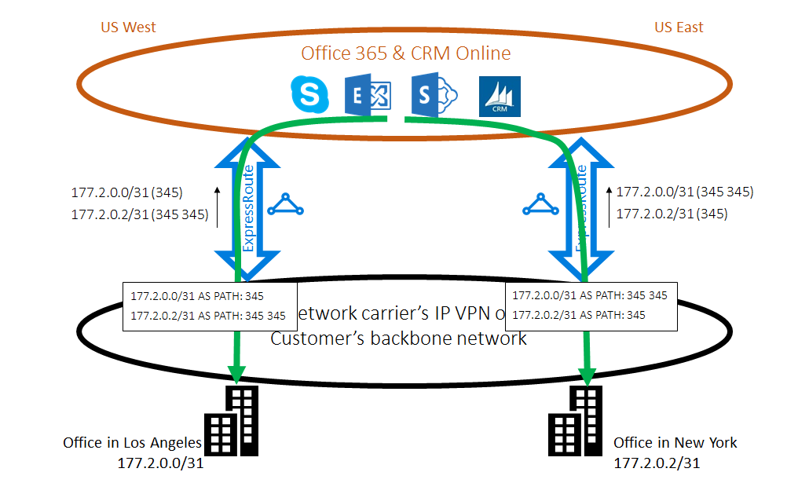

<properties
   pageTitle="最佳化 ExpressRoute 路由 |Microsoft Azure"
   description="本頁面提供最佳化路由時客戶會有一個以上 ExpressRoute 電路 Microsoft 與客戶的 corp 網路之間連線的詳細資料。"
   documentationCenter="na"
   services="expressroute"
   authors="charwen"
   manager="carmonm"
   editor=""/>
<tags
   ms.service="expressroute"
   ms.devlang="na"
   ms.topic="get-started-article"
   ms.tgt_pltfrm="na"
   ms.workload="infrastructure-services"
   ms.date="10/10/2016"
   ms.author="charwen"/>

# 最佳化路由 ExpressRoute
如果您有多個 ExpressRoute 電路，您會有一個以上的路徑，以連線至 Microsoft。 如此一來，可能會發生不理想路由-也就是將流量可能需要較長的路徑，連絡 Microsoft]，然後 Microsoft 到您的網路。 較長的網路路徑，較高的延遲。 延遲應用程式的效能與使用者體驗，並直接的影響。 本文將說明此問題，並說明如何最佳化路由使用標準路由技術。

## 不理想路由案例 1
讓我們來看看一下路由問題的範例。 假設您有兩個在美國，一個洛杉磯與一個在紐約的辦公室。 您的辦公室連線上寬 (WAN)，它可以是骨幹網路或您的服務提供者的 IP VPN。 您有兩個 ExpressRoute 電路美國西部中，在 [美國東部] WAN 也連線。 當然，您必須連線至 Microsoft 網路的兩個路徑。 現在假設您有在美國西部和美國東部 Azure 部署 （例如 Azure 應用程式服務）。 您是在洛杉磯使用者連線至 Azure 美國西部及紐約 Azure 美國東部至您的使用者，因為您的服務系統管理員通知每一個 office 中的使用者存取附近 Azure 服務的最佳體驗。 很抱歉，此計劃擬定用於東亞海岸使用者，但不是會用於西岸使用者。 以下是問題的原因。 在每個 ExpressRoute 電路，我們通知給您就 Azure 美國東部 (23.100.0.0/16) 中的前置字元和 Azure 美國西部 (13.100.0.0/16) 中的前置字元。 如果您不知道哪一個前置詞是哪一個區域，您無法以不同方式處理它。 WAN 網路可能會考慮這兩個前置詞比美國西部近美國東部因此將兩個 office 使用者路由傳送至在 [美國東部 ExpressRoute 電路。 最後，您必須有許多哭使用者洛杉磯 office 中。

### 解決方案︰ 使用 BGP 社群
若要最佳化的兩個 office 使用者路由，您必須知道的前置字元是從 Azure 美國西部及從 Azure 美國東部。 我們使用[BGP 社群值](expressroute-routing.md)編碼這項資訊。 我們已指派的唯一 BGP 社群值至每個 Azure 的區域，例如 「 12076:51004 」 的美國東部、 「 12076:51006 」 的美國西部。 現在，您知道哪一個前置詞是從 Azure 區域為何，您可以設定應該慣用的 ExpressRoute 電路。 因為我們使用 BGP exchange 路由資訊時，您可以使用 BGP 的本機喜好設定影響路由。 在此範例中，您可以指定較高的本機的喜好設定值，以在 [美國東部比美國西部 13.100.0.0/16 和同樣的較高的本機的喜好設定值 23.100.0.0/16 比在 [美國西部的美國東部中。 此設定會確定，當可以使用兩個路徑至 Microsoft 時，您的使用者在洛杉磯帶 ExpressRoute 電路在 [美國西部連線至 Azure 美國西部，而您位於紐約的使用者需要 ExpressRoute 在 [美國東部 Azure 美國東部。 路由雙面最佳化。 

## 不理想路由案例 2
以下是另一個範例來自 Microsoft 的連線需要較長的路徑，請連絡您的網路的位置。 在此情況下，您可以在[混合式環境](https://technet.microsoft.com/library/jj200581%28v=exchg.150%29.aspx)中使用內部部署的 Exchange 伺服器和 Exchange Online。 您的辦公室連接到 WAN。 您會通知您的內部部署伺服器中的兩個 ExpressRoute 電路透過 Microsoft 您辦公室的前置詞。 Exchange Online 會啟動的情況下，例如信箱移轉內部部署伺服器的連線。 很抱歉，洛杉磯 office 連線會先通過整個大陸返回至西岸路由至在 [美國東部 ExpressRoute 電路。 發生問題的方式類似於第一個項目。 沒有任何的提示，哪些客戶前置詞是靠近美國東部，有些則靠近美國西部無法分辨 Microsoft 網路。 發生，您的 office 中洛杉磯挑選錯誤的路徑。

### 解決方案︰ 使用 [另存新檔路徑前面上
有兩種解決方案的問題。 第一個是您只要洛杉磯辦公室 177.2.0.0/31，在 [美國西部 ExpressRoute 電路上通知您的內部部署前置字元，並在您的內部部署加上字首紐約辦公室 177.2.0.2/31，在 [美國東部 ExpressRoute 電路上。 如此一來，沒有連線到您的辦公室的每個 microsoft 的只有一個路徑。 沒有模糊不清的語意，而且路由最佳化。 使用此設計，您需要思考您容錯移轉策略。 路徑 ExpressRoute 透過 Microsoft 已損毀，必須先確定您的 Exchange Online 仍然可以連線到您的內部部署伺服器。 

第二個方案是您繼續同時在這兩個 ExpressRoute 電路前置詞的通知，並在另外提供意見的前置詞的提示是關閉您的辦公室的一個。 我們支援 BGP 另存新檔路徑附加的前面，因此您可以設定您的前置詞另存新檔路徑，影響路由。 在此範例中，您會增加在 [美國東部 172.2.0.0/31 另存新檔路徑，讓我們會想要在 [美國西部 ExpressRoute 電路預定此前置詞 （如我們的網路會認為此前置詞路徑是短的西） 的流量。 同樣地您也可以讓我們會想要在 [美國東部 ExpressRoute 電路延長 172.2.0.2/31 在 [美國西部另存新檔路徑。 路由最適合這兩個辦公室。 使用此設計，如果一個 ExpressRoute 電路已中斷，Exchange Online 仍連絡您透過另一個 ExpressRoute 電路與您 WAN。 

>[AZURE.IMPORTANT] 我們會移除前置詞在 Microsoft Peering 收到的另存新檔路徑中的數字為私人。 您要附加的 Microsoft Peering 路由會影響另存新檔路徑中的數字為公用。

>[AZURE.IMPORTANT] 雖然以下的範例是 Microsoft 和公用 peerings，我們的私人的對等支援相同的功能。 此外，另存新檔路徑前面上一個單一 ExpressRoute 電路中的運作方式會影響主要和次要路徑的選取範圍。
