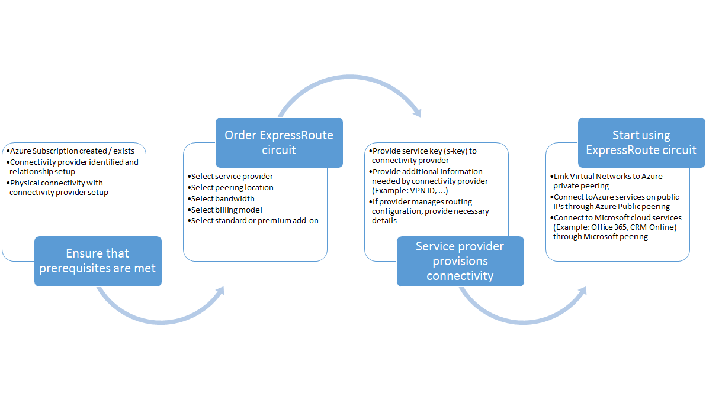

<properties
   pageTitle="工作流程設定 ExpressRoute 電路 |Microsoft Azure"
   description="此頁面會引導您完成設定 ExpressRoute 電路與 peerings 的工作流程"
   documentationCenter="na"
   services="expressroute"
   authors="cherylmc"
   manager="carmonm"
   editor="" />
<tags
   ms.service="expressroute"
   ms.devlang="na"
   ms.topic="article" 
   ms.tgt_pltfrm="na"
   ms.workload="infrastructure-services"
   ms.date="10/10/2016"
   ms.author="cherylmc"/>

# 電路佈建及電路狀態的 ExpressRoute 工作流程

此頁面會引導您佈建與高層級的路由設定工作流程的服務。

相對應的步驟與下圖顯示端對端才有的 ExpressRoute 電路佈建後，就必須遵循的任務。 

1. 使用 PowerShell 來設定 ExpressRoute 電路。 依照指示，請參閱[建立 ExpressRoute 電路](expressroute-howto-circuit-classic.md)如需詳細資訊。

2. 訂購的服務提供者的連線。 此程序不盡相同。 如需詳細資訊，瞭解如何排序連線，請連絡您的連線提供者。

3. 請確定的電路佈順利驗證佈建透過 PowerShell 狀態的 ExpressRoute 電路。 

4. 設定路由的網域。 如果您的連線提供者為您管理圖層 3，他們會設定路由您電路。 如果您的連線提供者只提供第 2 層服務，您必須設定路由根據 [[路由需求](expressroute-routing.md)與[路由設定](expressroute-howto-routing-classic.md)] 頁面中所述的指導方針。

    -  啟用 Azure 私人對等-您必須先啟用外面連線至 Vm / 雲端部署虛擬網路中的服務。
    -  啟用 Azure 公用對等-您必須先啟用 Azure 公用對等如果您想要連線至裝載於的公用 IP 位址的 Azure 服務。 這是如果您已啟用的 Azure 私人對等的預設路由存取 Azure 資源的需求。
    -  啟用 Microsoft 對等-您必須先啟用此存取 Office 365 並 CRM online 服務。 
    
    >[AZURE.IMPORTANT] 您必須確定您使用不同的 proxy，/ 使用網際網路連線至 Microsoft 與您的邊緣。 使用相同的邊緣 ExpressRoute 及網際網路會導致非對稱式路由，並會導致您的網路連線中斷。

    

5. 連結虛擬網路至 ExpressRoute 電路-您可以連結虛擬網路至您的 ExpressRoute 電路。 遵循指示[連結 VNets](expressroute-howto-linkvnet-arm.md)您電路。 這些 VNets 可以是在同一份 Azure ExpressRoute 線電路為訂閱，或者可以在不同的訂閱。

## 佈建狀態的 ExpressRoute 電路

每個 ExpressRoute 電路具有兩個狀態︰

- 服務提供者佈建狀態
- 狀態

狀態代表 Microsoft 佈建狀態。 若要啟用設定此屬性，則當您建立 Expressroute 電路

連線提供者佈建狀態代表上連線提供者的側邊的狀態。 它可以是*NotProvisioned*、*提供*或*Provisioned*。 ExpressRoute 電路必須 Provisioned 狀態，您就可以使用它。

### 可能的 ExpressRoute 電路狀態

此區段列出出 ExpressRoute 電路可能的狀態。

#### 在 [建立時間

當您執行的 PowerShell cmdlet 來建立 ExpressRoute 電路，您會看到下列狀態的 ExpressRoute 電路。

    ServiceProviderProvisioningState : NotProvisioned
    Status                           : Enabled

#### 連線提供者正在佈建電路

一旦您將服務金鑰傳遞給連線提供者，並啟動後提供的程序，您會看到下列狀態的 ExpressRoute 電路。

    ServiceProviderProvisioningState : Provisioning
    Status                           : Enabled

#### 何時完成連線提供者提供的程序

一經佈建的程序完成連線提供者，您會看到下列狀態 ExpressRoute 電路。

    ServiceProviderProvisioningState : Provisioned
    Status                           : Enabled

佈建後，只狀態電路，您就可以使用它時，可以在已啟用。 如果您使用的第 2 層提供者，您可以設定它是在此狀態時，才路由您電路。

#### 當連線提供者會取消提供電路

如果您要求的服務提供者，若要 deprovision ExpressRoute 電路，您會看到的服務提供者 deprovisioning 程序完成之後，設定為下列狀態的電路。

    ServiceProviderProvisioningState : NotProvisioned
    Status                           : Enabled

您可以選擇重新啟用它，如果有需要或執行 PowerShell cmdlet 來刪除線電路。  

>[AZURE.IMPORTANT] 如果您執行的 PowerShell cmdlet 來刪除線電路 ServiceProviderProvisioningState 佈建時或 Provisioned 操作會失敗。 請洽詢您的連線提供者 deprovision ExpressRoute 電路第一次，然後刪除 [電路。 Microsoft 會繼續結算電路，直到您執行的 PowerShell cmdlet 來刪除線電路。

## 路由工作階段設定的狀態

佈建狀態 BGP 可讓您知道已啟用 Microsoft edge BGP 工作階段。 您必須啟用狀態，您就可以使用 [對等。

請務必核取 BGP 特別是針對 Microsoft 對等工作階段狀態。 佈建狀態 BGP，除了有另一個稱為*通知公用前置詞狀態*的狀態。 在*設定*的狀態，這兩個 BGP 工作階段設定，以便您傳遞到工作端對端必須通知公用前置詞狀態。 

如果通知公用首碼狀態設定為*需要驗證*的狀態，BGP 工作階段不會啟用時通知的您與另存新檔中的數字的路由登錄任何不相符。 

>[AZURE.IMPORTANT] 如果*手動驗證*狀態通知公用前置詞狀態，則必須使用[Microsoft 支援](https://portal.azure.com/?#blade/Microsoft_Azure_Support/HelpAndSupportBlade)開啟支援票證及證明您擁有沿著通知相關聯的獨立系統數字的 IP 位址。

## 後續步驟

- 設定 ExpressRoute 連線。

    - [建立 ExpressRoute 電路](expressroute-howto-circuit-arm.md)
    - [設定路由](expressroute-howto-routing-arm.md)
    - [連結 VNet ExpressRoute 電路](expressroute-howto-linkvnet-arm.md)
