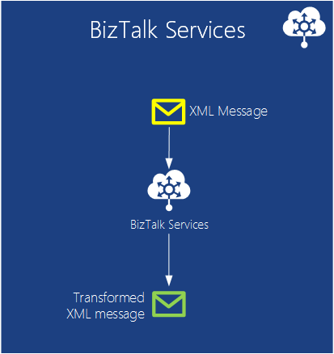

<properties
    pageTitle="Microsoft Azure 簡介 |Microsoft Azure"
    description="Microsoft Azure 的新手嗎？ 取得基本的概觀的服務可提供使用的方式很有用的範例。"
    services=" "
    documentationCenter=".net"
    authors="rboucher"
    manager="carolz"
    editor=""/>

<tags
    ms.service="multiple"
    ms.workload="multiple"
    ms.tgt_pltfrm="na"
    ms.devlang="na"
    ms.topic="article"
    ms.date="06/30/2015"  
    ms.author="robb"/>

# 介紹 Microsoft Azure

Microsoft Azure 是公用雲端的 Microsoft 應用程式平台。  本文的目標是為您提供 foundation 讓您瞭解基本概念的 Azure，即使您不知道雲端運算。

**瞭解如何讀取這份文件**

讓您輕鬆超載 azure 成長所有的時間。  開始使用基本服務會列在本文中，在第一個，然後繼續進行額外的服務。 這不表示您不能使用其他的服務本身，但基本服務進行設定核心 Azure 中執行的應用程式。

**提供意見反應**

您的意見反應很重要。 本文應該能 Azure 中有效的概觀。 如果沒有出現，請讓我們在頁面底部的 [註解] 區段中。 提供一些詳細資料，您需要看到及如何改善文件。  

## Azure 的元件

Azure 群組分類，在 [管理] 入口網站和[什麼是 Azure Infographic](https://azure.microsoft.com/documentation/infographics/azure/)等各種視覺輔助工具上的服務。 管理入口網站可讓您可使用來管理 Azure 中的多數 （但非全部） 服務。

本文會使用**不同的組織**談類似的函數，為基礎的服務與撥出的較大的文件組件的重要子服務。  

   
 *圖︰ Azure 提供執行 Azure 資料中心的網際網路存取應用程式服務。*

## 管理入口網站
Azure 的 web 介面一部分[管理入口網站](http://manage.windowsazure.com)，讓系統管理員存取及管理最，但非全部 Azure 的功能。  Microsoft 通常釋放較新的使用者介面入口網站中 beta 之前淘汰較舊的項目。 較新版本，稱為[「 Azure 預覽入口網站]](https://portal.azure.com/)。

兩個入口網站為作用中時，通常是產生長的重疊。 核心服務會出現在兩個入口網站，而非全部功能將無法在。 較新的服務可能會顯示在較新的入口網站第一個及較舊版本服務和功能可能只存在於較舊的項目。  以下郵件是如果您找不到項目在較舊的入口網站中的核取較新版本，反之亦然。

## 計算

其中一個最基本的項目會雲端平台是執行應用程式。 每個 Azure 計算模型都有它自己的角色，才能播放。

您可以單獨使用這些技術或結合視需要建立您的應用程式的右基礎。 您嘗試解決您選擇什麼問題而定的方式。

### Azure 虛擬機器

   
*圖︰ Azure 虛擬機器可讓您在雲端的虛擬機器執行個體的完全控制權。*

視建立虛擬機器，是否從標準的圖像，或從您提供，可以很有幫助。 這種方法，通常稱為基礎結構服務 (IaaS)，是 Azure 虛擬機器會提供。 圖 2] 顯示的虛擬機器 (VM) 的執行方式組合，以及如何建立一個 VHD。  

若要建立 VM，您可以指定哪些 VHD，以使用與虛擬記憶體的大小。  您然後支付 VM 正在執行一次。 您是付款分鐘及執行時，只仍保留 VHD 可用的最小的儲存空間費用。 Azure 提供股票圖 （稱為 「 圖像 」） 中包含可開機的作業系統，以開始 Vhd 庫。 包括 Microsoft 和協力廠商的選項，例如 Windows Server 與 Linux、 SQL Server、 Oracle 和其他資訊。 您可以免費建立 Vhd 和圖像，然後再上傳您自己。 您甚至可以上傳 Vhd 只能包含的資料，然後從您執行的 Vm 存取。

無論 VHD 來自時，您可以持續儲存 VM 正在執行時所做的任何變更。 下次當您從該 VHD，建立 VM 地方挑選項目。 返回虛擬機器 Vhd 會儲存在 Azure 儲存體二進位大型物件，我們討論更新版本。  這表示您收到以確保您的 Vm 不會消失硬體和磁碟失敗的狀況的複本。 您也可複製變更的 VHD Azure 登出，然後在本機上執行。

在一或多個虛擬機器，根據您在建立前或決定要從頭開始建立，現在執行應用程式。

雲端運算此相當一般方法可以用於解決許多不同的問題。

**虛擬機器案例**

1.  **開發/測試**-您可能會使用它們來建立完畢後使用，可以關閉便宜開發和測試平台。 您也可能會建立並執行應用程式，使用任何語言和您的文件庫。 這些應用程式可以使用任何的 Azure 提供，您也可以選擇要使用 SQL Server 或另一個 DBMS 執行一個或多個虛擬機器中的資料管理選項。
2.  **移動 Azure (增益 shift) 應用程式**」 增益 shift 」 指的是您想要使用起重機移動大型物件等更移動您的應用程式。  您 「 請拿起 」 VHD 從您的本機資料中心，「 shift 」 將其至 Azure，並那里執行。  您通常必須執行某些工作，若要移除其他系統的相依性。 如果有太多，您可以改為選擇選項 [3。  
3.  **延長您的資料中心**-使用 Azure Vm 的內部部署資料中心，延伸執行 SharePoint 或其他應用程式。 若要支援此功能，就可能在雲端建立 Windows 網域執行 Vm Azure Active Directory。 您可以在一起 Azure 中將您的區域網路和您的網路使用 Azure 虛擬網路 （稍後所述）。

### Web 應用程式

   
 *圖︰ Azure Web 應用程式執行網站的應用程式在雲端而不需要管理基礎的網頁伺服器。*

其中一個最常見的項目執行人員在雲端中執行的網站和 web 應用程式。 Azure 虛擬機器選項可讓，但是它仍可以讓您負責管理一或多個 Vm 和基礎的作業系統。 雲端服務 web 角色可以這麼做，但部署及維護他們仍會使用系統管理工作。  如果您只想網站的其他人處理您的系統管理工作嗎？

這只是 Web 應用程式會提供。 此計算模型中提供使用 Azure 管理入口網站以及 Api 受管理的 web 環境。 您可以將現有的網站應用程式移到 Web 應用程式不會變更，或您可以建立一個新直接在雲端中。 當正在執行網站時，您可以新增或移除執行個體，以動態方式依賴 Azure Web 應用程式]，在它們之間負載平衡要求。 Azure 應用程式提供 [共用] 選項，您的網站執行所在虛擬機器與其他網站中和標準的選項，讓它自己 VM 中執行的網站。 [標準] 選項也可讓您增加 （運算 power） 您執行個體的大小，如有需要。

開發，Web 應用程式支援.NET，PHP、 Node.js、 Java 和 SQL 資料庫及 MySQL （從 ClearDB，Microsoft 合作夥伴) 以及 Python 關聯式儲存空間。 它也會提供數個常用應用程式，包括 WordPress、 Joomla，以及 Drupal 的內建的支援。 目標是提供低成本、 可調整和廣泛實用的平台建立公用雲端中的網站和 web 應用程式。

**Web 應用程式的案例**

Web 應用程式被要為公司、 開發人員及網站設計機關相當實用。 企業、 很容易管理、 調整、 高度安全性，又高度可用方案執行的目前狀態的網站。 當您需要設定網站時，最好開始 Azure Web 應用程式，您需要無法使用的功能後，繼續執行至雲端服務。 請參閱 「 計算 」 區段中，可協助您選擇的選項之間的多個連結的結尾。

### 雲端服務
   
*圖︰ Azure 雲端服務提供執行彈性的自訂程式碼服務 (PaaS) 環境的平台上的位置*

假設您想要建立的雲端應用程式可支援許多使用者同時，不需要多管理，且並未發生故障。 您可能已建立的軟體廠商，例如，公司決定運用軟體與服務 (SaaS) 來建立您的應用程式在雲端的版本。 或者，您可能會啟動，建立您的預期會成長的消費者應用程式。 如果您正在建立 Azure 上，執行機型應使用？

Azure Web 應用程式可讓建立此類型的 web 應用程式，但有一些限制。 您不需要的管理權限，例如，這表示您無法安裝任何軟體。 Azure 虛擬機器可讓您更多的彈性，包括管理存取，和您確實可以使用它來建立很容易擴充的應用程式，但您必須處理層面的可靠性和管理您自己。 您想要是可讓您的控制您需要但也會處理大部分的可靠性和管理所需之工作的選項。

這只是 Azure 雲端服務所提供的內容。 低管理員應用程式，而且的範例經常所謂的平台以服務 (PaaS) 和此技術支援可調整、 可靠明文設計。 若要使用它，您可以建立一個使用您選擇，例如 C#、 Java、 PHP、 Python、 Node.js，或其他項目技術應用程式。 您的程式碼然後跟 （又稱為執行個體） 的虛擬機器中執行 Windows Server 版本。

但這些 Vm 有別於您建立的 Azure 虛擬機器中的項目。 為項目，Azure 本身管理這些執行項目，例如安裝作業系統修補程式，並自動新增推出修正圖像的項目。 這表示您的應用程式不應維持在 web 或工作者角色執行個體; 狀態請改為應該 Azure 資料管理選項下, 一節所述的其中一種消失。 Azure 也可以監視這些 Vm，重新啟動任何該會失敗。 您可以設定自動建立回應需求的 [更多或較少的執行個體的雲端服務。 這個選項可讓您處理增加的使用狀況]，然後調整您未付款，盡可能少使用的方式時，如此。

若要選擇當您建立執行個體的兩種角色，Windows 伺服器為基礎。 兩個主要差異在於網頁角色的執行個體執行程式 IIS，而不執行個體的工作者角色。 兩者都管理以相同的方式，不過，，很常見的應用程式使用兩者。 例如，可能會接受邀請的使用者，請從 web 角色執行個體，然後傳遞給處理工作者角色執行個體。 若要縮放應用程式，向上或向下，您可以要求 Azure 建立的其中一個角色的多個執行個體，或關閉現有的執行個體。 而且以 Azure 虛擬機器類似您會僅適用於時間正在執行每個網頁或背景工作角色執行個體。

**雲端服務的案例**

雲端服務是理想支援大量延展，當您需要更多控制平台比提供 Azure Web 應用程式，但不需要控制基礎的作業系統。

#### 選擇計算模型
[Azure Web 應用程式、 雲端服務與虛擬機器比較](./app-service-web/choose-web-site-cloud-service-vm.md)頁面提供如何選擇計算模型的詳細的資訊。

## 資料管理

應用程式的資料，而且不同類型的應用程式需要不同的資料。 因此，Azure 提供數種不同的方式來儲存和管理資料。 Azure 提供許多儲存空間的選項，但是所有專為非常長期儲存空間。  使用其中任何一個選項，有 3 複本保持 [透過 Azure 資料中心-6，如果您允許 Azure 備份到另一個資料中心至少 300 英哩辦公室使用地理重複性的 [同步處理資料。     

### 虛擬機器中
執行 SQL Server 或另一個 DBMS VM 建立與 Azure 虛擬機器中的功能已被提及。 了解這個選項不限於關聯式系統。您也可以免費執行 MongoDB 等 Cassandra NoSQL 技術。 執行您自己的資料庫系統是乾淨的簡單 it 複製我們可以用來在自己的資料中心-，但是也需要處理該 DBMS 的管理。  在 [其他選項，Azure 處理更多或所有您管理。

同樣地，blob 儲存體 （其中討論更新版本） 來備份虛擬機器和任何其他資料磁碟您建立或上傳的狀態。  

### Azure SQL 資料庫
   

*圖︰ Azure SQL 資料庫提供受管理的關聯式資料庫在雲端服務。*

關聯式儲存空間，Azure 提供功能 SQL 資料庫。 不讓騙您命名。 這是不同於 SQL Server 執行 Windows Server 的上方所提供的一般 SQL 資料庫。  

原名 SQL Azure，[Azure SQL 資料庫會提供所有關聯式資料庫管理系統的包括最小的異動，同時資料存取多個使用者資料完整性、 ANSI SQL 查詢，以及熟悉的程式設計模型的主要功能。 等存取 SQL Server、 SQL 資料庫，可以使用實體架構，ADO.NET、 JDBC 及其他熟悉資料存取技術。 也支援大部分的 T SQL 語言，以及 SQL Server 工具，例如 SQL Server Management Studio 中。 都熟悉 SQL Server （或另一個關聯式資料庫），使用 SQL 資料庫是乾淨的簡單。

不是 SQL 資料庫只在雲端 it DBMS 的 PaaS 服務。 您仍然可以控制您的資料和誰能夠存取，但 SQL 資料庫負責管理一眼，例如管理硬體基礎結構，並會自動保留資料庫及作業系統軟體最新狀態。 SQL 資料庫也會提供高可用性、 自動備份，時間點還原的功能，並可透過地理區域複寫複本。  

**SQL 資料庫的案例**

如果您要建立的 Azure 應用程式 （使用任何計算模型），需要關聯式儲存空間，SQL 資料庫可以是很好的選項。 應用程式執行外部的雲端也可以使用這項服務，不過，，有許多其他案例。 舉例來說，可以從不同的用戶端系統，包括桌上型電腦、 膝上型電腦、 平板電腦和手機存取儲存在 SQL 資料庫的資料。 因為它提供透過複寫的內建可用性，使用 SQL 資料庫可以協助最小化停機時間。

### 表格
  

*圖︰ Azure 資料表提供一般 NoSQL 方法來儲存資料。*

此功能通常稱為不同字詞的一部分的較大的功能，稱為 「 Azure 儲存體]。 如果您看到 「 表格 」、 「 Azure 表格 」 或 「 儲存空間表格 」，則所有同樣的動作。  

並不懂名稱︰ 這項技術不提供關聯式儲存空間。 事實上，則稱為 「 索引鍵/值的儲存區 NoSQL 方法的範例。 Azure 資料表，讓應用程式儲存的各種類型，例如字串、 整數和日期的屬性。 應用程式，可以擷取提供的唯一識別碼，該群組的一組屬性。 時複雜的作業等聯結不受支援，表格會提供快速存取輸入資料。 他們也可以很容易擴充，具有單一資料表可以按住一樣 tb 的資料。 並比對其簡易性，表格會使用 SQL 資料庫關聯式儲存於通常較低。

**表格的案例**

假設您想要建立 Azure 應用程式，快速存取所輸入資料，或許，許多，但不需要在此資料上執行複雜 SQL 查詢。 例如，假設您要建立消費者應用程式所要儲存每個使用者的客戶設定檔資訊。 您的應用程式將熱門，，因此您必須允許的大量資料，但您不會超出儲存，此資料擷取簡單的方法。 這是案例的所需要 Azure 資料表意義的位置。

### 二進位大型物件
    
*圖︰ Azure Blob 提供非結構化的二進位資料。*  

Azure Blob （一次 」 Blob 儲存體] 和只 」 儲存 Blob 」 是相同的工作） 是設計用來儲存非結構化的二進位資料。 資料表，例如 Blob 提供便宜的儲存空間，而單一 blob 可為大 1 TB (一個 tb)。 Azure 應用程式，也可以使用 Azure 磁碟機，讓 blob 裝載 Azure 執行個體中為 Windows 檔案系統提供常設儲存空間。 應用程式會看到一般的 Windows 檔案，但內容實際上儲存在 blob。

Blob 儲存體會使用許多其他 Azure 功能 （包括虛擬機器），讓它可以肯定的處理您的工作量。

**二進位大型物件的案例**

視訊、 大量檔案或其他二進位的資訊會儲存應用程式可以使用 blob 簡單、 低廉的儲存空間。 二進位大型物件也常使用的是與其他服務，例如內容傳遞網路，我們會稍後討論如何搭配使用。  

### 匯入/匯出
  

*圖︰ Azure 匯入 / 匯出] 可讓您將運送或從 Azure 更快且便宜的大量資料匯入或匯出的實體硬碟。*  

有時候您想要將大量資料移到 Azure。 想要花費很長的時間，可能是天，並使用大量的頻寬。 在下列情況下，您可以使用 Azure 匯入/匯出]，可讓您將運送 Bitlocker 加密 3.5 」 SATA 硬碟直接對 Azure 資料中心，位置 Microsoft 會將資料傳送到 blob 儲存體您。  上傳完畢之後，Microsoft 就會隨附回到您的磁碟機。  您也可以要求的大量資料從 Blob 儲存體會匯出到硬碟，並傳送給您透過郵件。

**案例匯入 / 匯出**

- **大型資料移轉**-每當您有大量的資料 (Tb) 您要上傳至 Azure 時，匯入/匯出服務，通常會許多更快且可能是較低比網際網路上傳送。 二進位大型物件中的資料後，您可以將其他表單，例如資料表儲存體] 或 [SQL 資料庫來進行處理。

- **封存資料修復**-您可以使用 [匯入/匯出]，讓 Microsoft 傳輸大型大量的資料儲存在 Azure Blob 儲存體存放裝置所傳送，然後有該裝置已傳送至您想要的位置。 因為這需要一些時間，所以不損毀修復不錯的選擇。 最好的封存的資料，您不需要快速存取。

### 檔案的服務
    
*圖︰ Azure 檔案的服務提供中小企業\\ \\server\share 路徑在雲端中執行的應用程式。*

內部部署，通常會有大量的檔案儲存到伺服器的訊息區 (SMB) 通訊協定使用無障礙\\ \\Server\share 格式。 Azure 現在有可讓您使用這個通訊協定在雲端服務。 Azure 中執行的應用程式可以使用其 Vm 使用熟悉的檔案系統 Api ReadFile 等 WriteFile 之間共用檔案。 此外，檔案也可以透過其餘介面，可讓您存取共用來自內部部署，您也設定虛擬網路時同時存取。 Azure 檔案是內建 blob 服務的上方，所以繼承相同的可用性、 持續性、 延展性和地理重複性的內建於 Azure 儲存體。

**Azure 檔案的案例**

- **移轉至雲端的現有應用程式**為其更容易移轉內部部署至雲端共用的應用程式組件之間的資料使用的檔案共用的應用程式。 每個 VM 連線至檔案共用，然後將其可以讀取及撰寫一樣，想要針對內部部署檔案共用的檔案。

- **共用應用程式設定**的分散式應用程式的常見模式是集中位置，從許多不同的虛擬機器可存取的設定檔。 這些設定檔案可以儲存在 Azure 檔案共用]，並閱讀所有應用程式執行個體。 也可以透過允許全球存取的設定檔，其餘介面，可管理的設定。

- **共用診斷**-您可以儲存並共用診斷記錄、 指標，等損毀傾印的檔案。 這些檔案可透過中小企業和其餘的介面讓應用程式使用各種不同的分析工具來處理和分析診斷資料。

- **偵錯開發/測試**-在雲端的虛擬機器使用開發人員] 或 [系統管理員時，他們通常需要一組工具或公用程式。 安裝及發佈這些公用程式，在每個虛擬機器很花時間。 Azure 檔案的開發人員或系統管理員可以檔案共用上儲存的最愛的工具，並從任何虛擬機器進行連線。

## 網路

Azure 會立即執行橫跨世界的許多資料中心。 當您執行的應用程式，或儲存的資料時，您可以選取一或多個使用這些資料中心。 您也可以連線至各種不同的方式使用下列的服務這些資料中心。

### 虛擬網路
   

*圖︰ 虛擬網路提供在雲端的私人網路，讓彼此可以與不同的服務或內部部署資源設定 VPN 跨內部部署連線。*  

使用公用的雲端其中一個實用的方法是視為副檔名為您自己的資料中心。

因為您可以視需要建立 Vm，然後將其移除 （和停止支付） 時，不需要您可以讓您需要時，只計算 power。 與 Azure 虛擬機器可讓您建立 Vm 執行 SharePoint、 Active Directory 和其他熟悉的內部部署軟體，因為這種方法可以使用您已經有的應用程式。

若要將此非常有用，您的使用者應該能夠將視為這些應用程式執行您自己的資料中心。 這就是 Azure 虛擬網路允許。 使用 VPN 閘道器裝置，請以系統管理員可以設定您的區域網路與您已部署至 Azure 虛擬網路的 Vm 之間虛擬私人網路 (VPN)。 為雲端 Vm 指定您自己的 IP v4 地址，因為它們會出現在您的網路上。 組織中的使用者可存取應用程式這些 Vm 包含如同其本機執行。

如需規劃與建立適合您的虛擬網路的詳細資訊，請參閱[虛擬網路](./virtual-network/virtual-networks-overview.md)。

### Express 路由

   

*圖︰ ExpressRoute 使用 Azure 虛擬網路，但是路由透過專用線條速度更快，而不是公用網際網路連線的連線。*  

如果您需要更多的頻寬或比 Azure 虛擬網路連線可提供的安全性，您可以查詢 ExpressRoute。 在某些情況下，ExpressRoute 也可以儲存您的錢。 您仍然需要中 Azure 虛擬網路，但是 Azure 與您的網站之間的連結無法移到公用網際網路上的專用的連線。 若要使用這項服務，您必須協議網路服務提供者，或 exchange 提供者。

設定連線需要更多時間 ExpressRoute 規劃，因此您可能會想要開始使用網站-VPN，然後移轉到 ExpressRoute 連線。

如需有關 ExpressRoute 的詳細資訊，請參閱[ExpressRoute 技術概觀](./expressroute/expressroute-introduction.md)。

### 流量管理員

   

*圖︰ Azure 流量管理員可讓您將全域流量路由至您的服務根據智慧的規則。*

如果您 Azure 應用程式執行多個資料中心，您可以使用 Azure 流量管理員聰明地將使用者的要求路由所有應用程式的執行個體。 此外，您也可以將流量路由至服務不在執行中 Azure 只要從網際網路存取。  

Azure 應用程式的單一一部分的全球使用者可能會執行中只有一個 Azure 資料中心。 應用程式的使用者散佈世界各地，不過，很容易在執行多個資料中心，或許甚至全部。 您可以在此第二個的情況下，面對問題︰ 如何執行您聰明地將使用者導向應用程式的執行個體？ 大部分的時間，您可能會想每位使用者存取，最接近資料中心，因為它可能會讓她的最佳的回應時間。 但如果應用程式的執行個體是多載或無法使用？ 在此情況下，就是很好，將其自動到另一個資料中心的要求。 這就是由 Azure 流量管理員。

應用程式的擁有者定義規則，指定如何您應該會要求使用者導向至資料中心，然後依賴上流量管理員執行這些規則。 例如，使用者可能會以正常方式會導向至最接近的 Azure 資料中心，，但其預設資料中心的回應時間超過其他資料中心的回應時間時取得傳送至另一個。 與多個使用者的全域分散式應用程式，不必處理這些問題的內建服務相當實用。

流量管理員會使用目錄名稱服務 (DNS) 來傳送使用者服務端點，但進一步流量不會繼續透過流量管理員後的連線。 這可防止流量管理員正在可能會降低服務通訊的瓶頸。

## 開發人員服務
Azure 提供的工具，協助開發人員及其建立和維護雲端中的應用程式的 IT 專業人員的數字。  

### Azure SDK
回 2008年支援只.NET 開發 Azure 第一個預先發行版本。 現在，不過，您可以建立 Azure 應用程式在幾乎任何語言。 Microsoft 目前提供特定語言 Sdk.NET、 Java、 PHP、 Node.js、 注音及 Python。 此外，也提供基本支援的任何語言，例如 c + + 一般 Azure SDK。  

這些 Sdk 可協助您建立、 部署及管理 Azure 應用程式。 您就能使用從[www.microsoftazure.com](https://azure.microsoft.com/downloads/)或 GitHub，及他們可以用 Visual Studio 與蝕。 Azure 也會提供開發人員可以使用任何編輯器或開發的環境，包括工具部署至 Azure 從 Linux 和 Macintosh 系統的應用程式的命令列工具。

協助您建置 Azure 應用程式，以及這些 Sdk 也提供用戶端文件庫，可協助您建立軟體的使用 Azure 服務。 比方說，您可能會讀取和寫入 Azure blob，讓應用程式，或建立部署透過 Azure 管理介面 Azure 應用程式的工具。

### Visual Studio 小組服務

Visual Studio 小組服務是行銷名稱包含數字的服務可協助開發 Azure 中的應用程式。

若要避免混淆-它不提供主控或網頁的 Visual Studio 版本。 您仍需要 Visual Studio 執行本機的複本。 但它提供許多其他工具，可以是很有幫助。

它會包含稱為小組 Foundation 服務，提供版本控制及工作項目追蹤主控的來源控制系統。  您甚至可以使用的版本控制給，如果您喜歡的。 然後，您可以變更您使用 project 的來源控制系統。 您可以建立不受限制的私人小組專案可以從任何位置世界中。  

Visual Studio 小組服務會提供載入測試服務。 您可以執行在 Visual Studio Vm 在雲端上建立的測試。 指定您要載入測試，使用者的總數，Visual Studio 小組服務會自動判斷需要多少代理程式，所需的虛擬機器向上微調及執行負載測試。 如果您是為 MSDN 訂閱者，您會收到千分位的負載測試每個月的免費使用者分鐘數。

Visual Studio 小組服務也會提供支援敏捷式開發連續整合組建等功能、 Kanban 區與虛擬小組聊天室。

**Visual Studio 小組 Services 案例**

Visual Studio 小組服務是很好的選擇已在全球進行共同作業，並不需要的公司已經有基礎結構，來執行此作業。 您可以取得設定以分鐘為單位，選擇 [來源控制系統，然後開始撰寫程式碼和建置該日。  小組工具提供的協調和共同作業及其他工具提供的分析所需的測試並快速調整您的應用程式。

但是的組織已經有內部部署系統，可以測試新的專案是否為更有效率的 Visual Studio 小組服務。   

### 應用程式的深入見解

  

*圖︰ 應用程式的深入見解監視效能及即時網頁或裝置應用程式的使用方式。*

當您是否在行動裝置、 桌上型電腦或網頁瀏覽器-上執行發佈您的應用程式的應用程式的深入見解會告訴您執行的方式，使用者會執行。 它會保留當機和回應的計數，提醒您如果數字交互無法接受臨界值，並協助您診斷任何問題。

當您開發的新功能時，規劃測量成功的使用者。 來分析使用模式，您可以瞭解什麼最適合您的客戶，並且在每個開發週期中強化您的應用程式。

它會裝載於 Azure，雖然應用程式的深入見解的運作應用程式，在 [上，關閉 Azure 和越來越範圍。 同時 J2EE 和 ASP.NET web 覆蓋應用程式，以及 iOS、 Android、 OSX 和 Windows 應用程式。 遙測會傳送 SDK 內建應用程式之後，分析和 Azure 中的應用程式的深入見解服務中顯示。

如果您想更特殊的分析，匯出遙測串流至資料庫，或 Power BI 或任何其他工具。

**應用程式的深入見解案例**

您開發應用程式。 可能是在 web 應用程式或裝置應用程式或網頁的後端裝置應用程式。

* 調整您的應用程式的效能，發佈之後，或在時載入測試。  應用程式的深入見解彙總遙測所有已安裝的執行個體，並會顯示圖表的回應時間、 要求與例外狀況的計算、 相依性回應的時間和其他效能指標。 這些幫助您調整您的應用程式的效能。 您可以插入程式碼，以更多報告如果您需要的特定資料。
* 偵測與診斷即時應用程式中的問題。 如果效能指標交互可接受臨界值，您可以透過電子郵件取得通知。 您可以檢查特定使用者的工作階段，例如將會看到所造成的例外狀況的要求。
* 追蹤評估成功的每個新功能的使用方式。 當您設計新的使用者本文時，計劃測量它用多少，以及使用者是否完成其預期的目標。 應用程式的深入見解提供您基本的使用情況資料，例如網頁] 檢視中，而且您可以插入程式碼，以追蹤更多詳細資料的使用者體驗。

### 自動化
沒有人喜歡浪費時間，重複執行相同的手動程序。 Azure 自動化可讓您建立、 監控、 管理及部署 Azure 環境中的資源。  

自動化會使用 「 runbooks 」，使用 Windows PowerShell 工作流程 （與只一般 PowerShell) 在幕後。 Runbooks 是執行不需要使用者互動。 PowerShell 工作流程可讓儲存在檢查點一路指令碼的狀態。 然後發生失敗，如果您沒有從頭開始執行指令碼。 您可以重新啟動精靈在最後一個檢查點。 這會儲存您嘗試建立指令碼處理每個可能失敗的工作。

**自動化案例**

Azure 自動化是很不錯的選擇來自動化 Azure 中手動較長時間執行、 容易發生錯誤，與經常重複的工作。

### API 管理

建立及發佈網際網路上的應用程式設計介面 (Api) 是常見的方式，以提供服務給應用程式。 如果這些服務 （例如，氣象資料） resellable，組織可允許存取這些付費的同一個服務其他第三方。 當您不按比例縮放更多的合作夥伴，通常必須最佳化來控制存取權。  某些合作夥伴甚至可能需要不同的格式中的資料。

Azure API 管理可輕鬆發佈至合作夥伴、 員工和協力廠商的 Api，安全地和小數位數的組織。 它提供不同的 API 端點，並做為 proxy 撥打實際的端點，同時提供快取、 轉換、 節流、 存取控制及分析彙總等服務。

**API 管理案例**

假設貴公司有一組裝置所有需要回撥集中的服務，以取得資料，例如，在每個車在旅途中有裝置貨運公司。  當然公司會想要設定讓它可以可靠預測更新的傳遞時間追蹤自己卡車系統。 可知道有多少卡車並適當規劃。  每個車必須回撥到中央位置與它的位置及速度資料，可能是更多的裝置。

貨運公司的客戶可能會想也可以從取得此位置的資料。  客戶可以用它來知道多久產品需要出差，其中他們困難，多少他們支付沿著特定路由 （如果與他們隨附所支付的合併）。 如果貨運公司已經彙總資料，許多客戶可能支付費用。  但然後貨運公司需要提供資料給客戶。 一旦客戶可以存取，它們可能沒有控制資料查詢的頻率。 他們必須提供有關誰能夠存取資料的規則。 所有這些規則會有其外部的 API 內建。 這是有助於 API 管理。  

## 身分識別與存取權

與身分識別的工作是大部分的應用程式的一部分。 了解使用者可讓決定它應該互動的方式與該使用者的應用程式。 Azure 提供可協助追蹤身分識別，以及整合身分識別存放區，您可能已經使用的服務。

### Active Directory

大部分的目錄服務，例如 Azure Active Directory 儲存使用者和其所屬組織的相關資訊。 它可讓使用者登入，然後提供這些權杖，他們可以呈現應用程式，以證明其身分識別。 您也可以與內部部署在您的區域網路中執行的 Windows Server Active Directory 同步處理的使用者資訊。 雖然機制和 Azure Active Directory 所使用的資料格式與 Windows Server Active Directory 中所使用的相同，它所執行的函數是非常類似。

請務必瞭解的 Azure Active Directory 主要針對使用雲端應用程式。 其可讓應用程式，例如，或其他雲端平台上，Azure 上執行。 它也使用 Microsoft 自己雲端應用程式，例如在 Office 365 中。 如果您想要將您的資料中心擴充至雲端使用 Azure 虛擬機器和 Azure 虛擬網路，不過，Azure Active Directory 不正確的選擇。 不過，您需要執行 Windows Server Active Directory 虛擬機器中。

若要讓應用程式存取其包含的資訊，Azure Active Directory 會提供 RESTful API 稱為 Azure Active Directory 圖表。 此 API 可讓任何平台存取目錄物件和它們之間的關係上執行應用程式。  例如，授權的應用程式可能會使用此 API 瞭解使用者、 其所屬的群組和其他資訊。 應用程式，也可以查看使用者為社交圖形禁止其更有效地使用個人之間的連線之間的關聯。

這項服務，Azure Active Directory 存取控制項，另一個功能，方便接受從 Facebook、 Google、 Windows Live ID 和其他常見的身分識別提供者的身分識別資訊的應用程式。 而不需了解各種不同的資料格式及通訊協定每個這些提供者使用的應用程式，存取控制轉譯為所有的單一的常見格式。 也可讓應用程式，接受來自一或多個 Active Directory 網域的登入。 例如，廠商提供的 SaaS 應用程式可能會使用 Azure Active Directory 存取控制授權讓使用者在每一個其客戶單一登入應用程式。

目錄服務是內部部署計算核心加強。 不應會意外的它們也很重要雲端中。

### 多重因素驗證
   

*圖︰ 多重因素驗證提供您的應用程式，以驗證的識別的多個表單的功能*

安全性很重要。 多重因素驗證 (MFA) 可協助確保只有自己的使用者存取他們的帳戶。 MFA （也稱為雙因素驗證或 「 2FA 」） 會要求使用者提供兩個身分識別驗證的使用者登增益集和交易這三種方法。

- 項目您知道 （通常是密碼）
- 您有 （不輕鬆地重複，如電話信任的裝置） 的項目
- 是 (biometrics) 的項目

因此當使用者登入，您可以要求他們也驗證其身分識別與行動應用程式、 電話或文字訊息搭配使用者的密碼。 根據預設，Azure Active Directory 支援使用者登增益集使用的密碼做為其唯一驗證方法。 使用 MFA SDK，您可以使用 MFA 與 Azure AD 或自訂的應用程式與目錄。 您也可以使用其內部部署的應用程式搭配使用多重因素驗證伺服器。

**MFA 案例**

登入保護機密的帳戶，例如銀行登入與來源的程式碼存取未經授權的項目可能會對成本高財務或智慧財產權屬性的位置。   

## 行動電話

如果您正在建立行動裝置的相關應用程式，儲存在雲端的資料與驗證的使用者，您不必撰寫自訂程式碼許多傳送推入通知，可協助 Azure。

雖然當然，您可以建立後端的行動應用程式使用虛擬機器、 雲端服務或 Web 應用程式，您可以花撰寫基本的服務元件使用 Azure 的服務較少的時間。

### 行動應用程式

*圖︰ 行動應用程式提供經常所需的介面使用行動裝置的應用程式的功能。*

Azure Mobile 應用程式提供許多有用的函數可以儲存您的時間時建立後的端行動應用程式。 其可讓您執行簡單的佈建和管理儲存 SQL 資料庫中的資料。 使用伺服器端程式碼，您可以輕鬆地使用 blob 儲存體或 MongoDB 等其他資料儲存選項。 行動應用程式的通知，提供支援，但在某些情況下您可以改為使用通知集線器下一步所述。  服務也是您的行動應用程式可以呼叫來完成工作 REST API。 行動應用程式也會提供驗證的使用者可透過 Microsoft 和 Active Directory 及 Facebook、 Twitter 和 Google 這類其他已知的身分識別提供者的功能。   

您可以使用其他 Azure 服務等服務匯流排工作者角色，並連線到內部部署系統。 您甚至可以使用從 Azure 儲存區 （例如 SendGrid 電子郵件) 的第 3 廠商附加元件，以提供其他功能。

原生的用戶端文件庫的 Android、 iOS、 HTML/JavaScript、 Windows Phone 和 Windows 市集讓您更容易開發所有主要的行動裝置平台上的應用程式。 REST API 可讓您使用不同的平台上的應用程式中的行動電話服務的資料與驗證的功能。 單一的行動訊息服務可以返回多個用戶端應用程式，以便您在裝置上提供一致的使用者體驗。

因為 Azure 已支援 kevin，您可以在您的應用程式時更受歡迎處理流量。  監視與記錄以協助疑難排解問題，並管理效能支援。

### 通知集線器

  

*圖︰ 通知集線器提供經常所需的介面使用行動裝置的應用程式的功能。*

雖然您可以撰寫程式碼來執行 Azure 行動應用程式中的通知，通知集線器已最佳化而適合廣播數百萬的高度個人化的推播通知在幾分鐘內。  您不必擔心詳細資料，例如行動通信業者或裝置製造商。 您可以針對個別或數百萬種單一 API 呼叫的使用者。

通知集線器是設計用來處理任何後端。 您可以使用 Azure 行動應用程式，在雲端上任何提供者執行自訂後的端或內部部署後端。

**通知中心案例**如果您在撰寫行動遊戲玩家原本開啟的位置，您可能需要通知播放程式 2 的播放程式 1 完成其開啟。 如果您只需要，您可以只使用行動應用程式。 但如果您有 100000 使用者播放您的遊戲提升，而您想要傳送給所有人，通知集線器機密免費提供較佳的選擇。

您可以傳送相關消息，低延遲運動活動和產品公告通知的使用者。 企業可以通知有關新時間機密通訊，例如潛在員工，這樣就不必不斷地檢查電子郵件或其他應用程式，隨時掌握資訊的員工。 您也可以傳送其中之一-單次密碼所需的多重因素驗證。

## 備份
每個企業必須備份及還原資料。 您可以使用 Azure 備份及還原您的應用程式中的雲端或內部部署。 Azure 提供不同的選項，以協助視備份的類型而定。

### 網站復原

Azure 網站復原 （舊稱 HYPER-V 復原管理員） 可協助您保護重要的應用程式的跨網站協調複寫和修復。 網站復原提供保護您自己的次要網站、 主網站或 Azure，根據 hyper-v、 VMWare 或舊的應用程式，並避免的費用和複雜度建立和管理您自己的第二個位置的功能。 Azure 加密資料並通訊與您有太啟用資料靜止加密的選項。

持續監視服務的健康情況，可協助自動化整齊有序復原在主要的資料中心網站中斷時的服務。 虛擬機器可以連線經過協調的方式，協助還原服務快速，更複雜的多層負載。

網站復原適用於現有技術，例如 HYPER-V 複本、 系統管理中心，以及 SQL Server 永遠上。 如需詳細資訊，查看[Azure 網站復原的概觀](site-recovery/site-recovery-overview.md)。

### Azure 的備份
  

*圖︰ Azure 備份備份資料從內部部署 Windows 伺服器到雲端。*  

Azure 備份備份從內部部署伺服器執行 Windows Server 到雲端的資料。 您可以直接從 Windows Server 2012、 Windows Server 2012 基本版或系統管理中心 2012 資料保護管理員中的備份工具來管理您的備份。 或者，您可以使用特殊的備份代理程式。

資料是更安全，因為備份加密傳輸之前，儲存在加密的 Azure 並受您上傳的憑證。 服務使用相同的重複和高度可用的資料保護 Azure 儲存體中找到。  您可以備份檔案和資料夾的定期排程或立即執行完整或增量備份。 資料備份到雲端之後，授權的使用者可以輕鬆地復原的任何伺服器的備份。 它也會提供可設定資料保留原則、 資料壓縮及資料傳輸節流設定，讓您管理成本] 以儲存並傳送資料。

**Azure 備份的案例**

如果您已經使用 Windows 伺服器或系統管理中心，Azure 備份備份您的伺服器檔案系統、 虛擬機器和 SQL Server 資料庫的自然解決方案。  其運作方式的加密與疏鬆壓縮的檔案。 有一些限制，因此您[檢查 Azure 備份的必要條件](http://technet.microsoft.com/library/dn296608.aspx)第一次。

## 訊息及整合

無論它在做什麼，程式碼常見問題必須與其他程式碼互動。  在某些情況下，需要是基本佇列訊息。 在其他情況下，更複雜的互動所需。 Azure 提供數種不同方式解決這些問題。 圖 5] 顯示選項。

### 佇列

*圖︰ 佇列允許寬鬆應用程式組件的結合，幫助縮放比例。*  

佇列是一個簡單的概念︰ 一個應用程式會將郵件放在佇列中，並由另一個應用程式最後讀取的郵件。 如果您的應用程式需要只這個簡單的服務，Azure 佇列可能的最佳選擇。

Azure 成長一段時間的方式，因為 Azure 儲存體佇列及服務匯流排佇列提供類似佇列服務。 為什麼您要使用的原因會包含在[Azure 佇列和服務匯流排佇列-比較 Contrasted](http://msdn.microsoft.com/library/azure/hh767287.aspx)相當技術 （英文）。  在許多情況下，可能會運作。

**佇列中案例**

常用的佇列今天是讓網頁角色的執行個體，通訊與工作者角色執行個體中相同的雲端服務應用程式。

例如，假設您建立的視訊共用 Azure 應用程式。 應用程式所組成，可讓使用者上傳和監看式視訊的 C# 程式上傳的視訊轉譯各種不同的格式實作工作者角色與 web 角色中執行的 PHP 程式碼。

當 web 角色執行個體的使用者傳來的取得新的視訊時，它可以儲存 blob 的視訊，然後將訊息傳送給工作者角色透過佇列，告知其這段影片中新的位置。 工作者角色的執行個體-it 不會影響哪些項目會，然後從佇列中讀取郵件，所需的視訊轉譯，背景中執行。

組織結構應用程式，以這種方式可讓非同步處理、，也讓應用程式更容易小數位數，因為可以獨立不同的 web 角色執行個體和工作者角色執行個體數目。 您也可以使用佇列大小的觸發程序，若要縮放的上下工作者角色數目。 太高，並新增更多的角色。 較低時，您可以減少執行角色儲存金錢的數目。  

即使他們不使用網頁和背景工作的角色，您可以使用相同的模式之間有許多不同的部分應用程式。  可讓您將任一邊的上下佇列中，視需要為的組件，需要處理的時間。

### 服務匯流排
是否在雲端，您的資料中心，在行動裝置，或其他，位置上執行應用程式需要互動。 Azure 服務匯流排的目標是要讓應用程式的執行幾乎任何位置的 exchange 資料。

除了佇列 （一對一） 稍早所述，服務匯流排也提供其他通訊方式。

#### 服務匯流排轉送

*圖︰ 服務匯流排轉送可讓應用程式在不同的防火牆之間的通訊。*

服務匯流排可讓直接通訊透過轉送服務，提供安全的方式，可透過防火牆互動。 服務匯流排轉送讓交換透過端點存放在雲端，而不是本機的郵件進行通訊的應用程式。

**服務匯流排轉送案例**

Azure 的應用程式或軟體在某些其他雲端平台上執行，可能是透過服務匯流排進行通訊的應用程式。 也可以執行外雲端，但是應用程式。 例如，把航空公司自己的資料中心內的電腦中實作保留服務。 航空公司需要這些許多用戶端，包括存回 kiosk airports，保留代理程式終端機服務的方式公開，甚至客戶的電話。 它可能使用服務匯流排這麼做，也就是建立彈性的各種應用程式的互動。

#### 服務匯流排主題和訂閱
   
 *圖︰ 服務匯流排主題可讓多個應用程式張貼訊息及其他應用程式來訂閱接收符合特定準則的郵件。*

服務匯流排提供的發佈與訂閱機制主題和訂閱的一部分。 使用 publish-subscribe，應用程式，可以傳送訊息給主題，其他應用程式可以建立本主題的訂閱。 這個選項可讓一組應用程式，讓相同的郵件讀取多個收件者之間的項目對多通訊。

**服務匯流排主題和訂閱案例**

隨時設定位置有許多郵件所很重要，但各種下游系統只需要聆聽這些通訊]，[服務匯流排主題不同的子集，訂閱是很好的選項。

### BizTalk 服務
   
 *圖︰ Biztalk 提供轉換 XML 雲端中的郵件格式的功能。*

有時候，您需要連線系統使用不同的郵件格式進行通訊。 通常會有不同的資料庫結構描述和 XML 訊息格式，即使常見的標準有商務用。 而非撰寫大量的自訂程式碼，您可以使用 BizTalk Server 內部部署整合各種系統。  Azure Biztalk 提供相同的類型，但在雲端的服務。 您可以支付只什麼您使用，不需擔心等您有內部部署的縮放比例。

**BizTalk Services 案例**

商務商務 B2B 互動常需要此類型的轉譯。  例如，建置飛機公司必須訂單組件的從不同的組件供應商。 會有許多部分供應商]。  這些訂單應該自動登入供應商系統執行直接從飛機產生器系統。  非企業想要變更其核心系統，郵件格式，很可能並不這些格式是相同。 Biztalk 可以採取的郵件，，新格式這兩種方式轉譯。 [飛機供應商可以處理翻譯或不同的供應商可以、 誰根據需要更多的控制項與翻譯所需的量。     

## 計算協助
Azure 提供協助的服務，不需要執行任何時間。  

### 排程器

   
*圖︰ Azure 排程器提供工作排程特定期間的特定時間的方式。*

有時候應用程式只需要在一段時間執行。 在 Azure，您可以儲存金錢此類型的應用程式，而不是讓應用程式，只保留執行 24 x 7 等待來處理資料。 Azure 排程器可讓您的應用程式應該執行根據間隔的時間] 或 [行事曆上時，排定。 可靠，並會驗證程序會執行，即使有網路、 電腦和資料中心失敗。 您可以使用排程器 REST API 來管理這些動作。

排程的警示發生時，排程器會將 HTTP 或 HTTPS 訊息傳送至特定的端點，或可以將儲存空間佇列中的郵件。  因此，您需要有您擁有存取端點，或是就監控儲存佇列中的應用程式。 然後後，取得的訊息時，其可執行它設計用來任何動作。

**排程器案例**

- 週期性的應用程式動作︰ 例如，服務可能會定期從 twitter 取得資料和收集到的一般摘要的資料。
- 每日進行的維修作業︰ 記錄處理或清除，執行備份和其他間歇性排程的工作。
- 在晚上執行的工作。
- Web 應用程式工作，例如每日剪除的記錄檔，請執行備份和其他維護工作。 系統管理員可以選擇，例如每天的下一個 9 個月，上午 1 備份其資料庫。

排程器 API 可讓您建立、 更新、 刪除、 檢視及管理工作集合與排程的工作以程式設計方式。

## 效能

效能很重要的應用程式。 應用程式通常重複存取相同的資料。 以提升效能的其中一個方法是讓應用程式時，最小化擷取它所需的時間往資料的複本。 Azure 提供不同的服務，執行此動作。

### Azure 快取

   
 **圖︰ Azure 應用程式可以快取記憶體的資料，甚至它分割，跨多個背景工作角色**

存取儲存在任何服務 SQL 資料庫、 表格或 Blob Azure 的資料管理中的資料-是相當快速。 尚未存取儲存在記憶體的資料會更快。 因此，保留經常存取資料的記憶體內複本可以改善應用程式的效能。 若要這麼做，您可以使用 Azure 的記憶體內快取。

在雲端服務應用程式可以將資料儲存在此快取，然後擷取它直接，並不需要存取常設儲存空間。 快取可以維護您的應用程式 Vm 內，或只是要快取專用的 Vm 來提供。 在任一情況下，可以分散式快取的資料包含模式跨多個 Vm Azure 資料中心。

Azure 有不同的快取技術，有移位一段時間的數字。 他們所造成的順序，有共用的角色，管理，Redis 快取。 共用的快取的舊技術，而您不應使用其建立新的實作。 管理快取具有相同的功能，但為受管理的服務 Azure 管理入口網站以外的在角色快取。 在預覽中，是 Redis 快取。 意指實作中有最大的數字的功能，當您撰寫新的快取程式碼，建議。

**Azure 快取分析藍本**

重複會讀取產品目錄的應用程式可能會使用這種快取好處，例如自資料需要將可更快速地。 技術也支援鎖定，讓它搭配讀/寫為唯讀的資料。 然後 ASP.NET 應用程式可以儲存工作階段的資料，只要設定變更，使用服務。

### 內容傳遞網路
   
 **圖︰ Blob 的複本可進行快取世界各地的網站。**

假設您要儲存的世界各地的使用者可存取的 blob 資料。 是最新全球杯相符項目]，或驅動程式的更新或常用的電子書的視訊。 將資料的複本儲存在多個 Azure 資料中心可協助，但如果有多個使用者，這可能不是足夠。 更好的效能，您可以使用 Azure cdn 到底。

Cdn 到底會有不同的網站世界各地的每個都能儲存 Azure blob 的複本。 第一次世界各地的某些部分中的使用者存取特定的 blob，其包含的資訊會複製從 Azure 資料中心到本機的 CDN 存放區中的地理位置。 之後，該部分的全球存取會使用快取中 CDN blob 複製-不需要移到最接近的 Azure 資料中心。 結果為更快速地存取經常存取資料的使用者在全球任何位置。

**Cdn 到底案例**

它會 cdn 到底使用傳遞視訊全球媒體服務。 視訊通常大，需要大量的頻寬。  媒體服務被討論其他地方在此頁面上。

## 大型資料和顯示較大的計算

### HDInsight (Hadoop)
   
 **圖︰ HDInsight 可協助進行大量的處理大量的資料**

許多年，大量的資料分析完成後儲存在與關聯式 DBMS 內建資料倉庫中的關聯式資料。 這種商務分析仍重要事項，並會更多很長的時間。 但如果資料要分析是大的關聯式資料庫就無法處理？ 並假設資料不關聯式嗎？ 可能是伺服器記錄中資料中心，例如，或從感應器歷史事件資料或其他項目。 在這種情況下，您可以所謂的大型資料問題。 您需要另一種方法。

主控項技術今天分析顯示較大的資料是 Hadoop。 Apache 開啟來源專案，這項技術儲存資料使用 Hadoop 分散式檔案系統 (HDFS)，然後讓建立 MapReduce 工作來分析資料的開發人員]。 HDFS 跨多個伺服器散播資料，然後平行處理的 MapReduce 工作，在每一個，讓大型資料區塊，就會執行。

HDInsight 是 Azure Apache Hadoop 型服務的名稱。 HDInsight 可讓 HDFS 叢集上存放資料，並將其分散到多個 Vm。 也會在這些 Vm 散佈 MapReduce 工作的邏輯。 就像使用內部部署 Hadoop 資料是處理的本機邏輯，且其運作方式的資料位於相同的 VM-及平行的較佳的效能。 HDInsight 也可以儲存資料中 Azure 儲存保存庫 (ASV)，使用二進位大型物件。  使用 ASV，可讓您儲存金錢，因為您可以刪除您不在使用時的 HDInsight 叢集，但仍保留在雲端的資料。

HDinsight 支援其他元件 Hadoop 生態系統，包括登錄區及豬。 Microsoft 也有建立更容易使用的資料所產生的 HDInsight 使用傳統的 BI 工具，例如 HiveODBC 介面卡的元件] 及 [適用於 Excel 的資料檔案總管。

### 高效能運算 （大計算）

使用雲端平台最具吸引力的方法是執行高效能運算 (HPC) 和其他 「 大計算 」 應用程式。 範例包括使用業界標準郵件傳遞介面 (MPI) 以及所謂平行應用程式，例如財務風險模型內建的特殊工程應用程式。

顯示較大的計算的執行程式碼許多電腦上同時。 Azure 上執行許多虛擬這表示的電腦上同時，所有使用平行解決某些問題。 執行此動作需要資源及排程的應用程式，亦即、 分散這些執行個體中的工作的一些方式。 Microsoft 的免費 HPC 套件及其他運算叢集方案可執行也將容量視需要新增至內部部署叢集或執行的大計算應用程式，完全在雲端中的 Azure 計算和基礎結構服務 Azure，利用。

Azure 提供 VM 範圍具有不同 CPU 核心、 記憶體、 磁碟容量和其他特性以符合需求的不同的應用程式的執行個體大小。 最近引入的 A8 和 A9 執行個體適用於有許多會特別是計算大量負載和平行 MPI 應用程式，因為它們高速、 多核心 Cpu 和大量的記憶體。 在某些設定執行個體利用低延遲和高處理量的應用程式的網路在雲端，其中包含遠端直接記憶體存取 (RDMA) 技術平行 MPI 應用程式的最高效率。

Azure 也提供大計算應用程式開發人員及合作夥伴一組完整的計算功能、 服務、 架構選項和開發工具。 Azure 支援自訂大計算工作流程有關特定的資料的工作流程與工作和任務排程模式，可以調整數以千計的計算核心。

## 媒體

   
 **圖︰ 媒體服務會提供視訊及其他媒體世界各地的用戶端應用程式的平台。**

影片，讓大型網際網路流量的一部分，該百分比明天會更大。 還提供在網頁上的視訊不簡單。 有多個變數，例如編碼演算法和顯示使用者的螢幕解析度。 視訊也可能會要求，例如星期六晚上特殊圖文集時許多人可讓您決定要觀看線上影片中有高速量。

指定其常用性，則絕對許多新的應用程式將會建立該使用視訊安全。 然而，所有需要解決的相同的問題，並加以解決這些問題的專屬會讓每一個部分沒有必要。 更好的方法是，建立提供許多應用程式，可以使用常見的解決方案的平台。 建立這個雲端中的平台有一些清除的優點。 可為基礎 pay-as-you-go，人使用，也可以處理中指定視訊的應用程式通常面臨的變化。

Azure 媒體服務解決此問題。 會提供一組方便人員建立和執行使用視訊和其他應用程式的雲端元件。

如圖所示，媒體服務會提供一組的元件的應用程式，使用視訊及其他媒體。 例如，包括媒體內嵌元件上傳視訊到媒體服務 （將其儲存在 Azure Blob 中）、 支援各種不同的視訊及音訊格式編碼元件、 內容保護元件，可提供數位版權管理、 廣告插入視訊資料流元件、 元件串流，及其他功能。 Microsoft 合作夥伴也可以提供的元件的平台，然後已發佈的元件及結算代表自己的 Microsoft。

使用此平台應用程式，可以執行 Azure 或其他位置。 例如，桌面應用程式的視訊生產房屋可能會讓視訊上傳至媒體服務，其使用者然後處理各種不同的方式。 或者，Azure 上執行的雲端內容管理服務可能依賴媒體服務處理程序，並將分散視訊。 執行的任何地方，以及任何它，每個應用程式會選擇的元件需要使用，請透過 RESTful 介面存取這些。

若要散發它會產生，應用程式，可以使用 Azure cdn 到底，另一個 CDN，或只會將位元即可直接傳送給使用者。 不過，它會那里取得，可以使用各種不同的用戶端系統，包括 Windows、 Macintosh、 HTML 5、 iOS、 Android、 Windows Phone、 Flash 和 Silverlight 視訊建立使用媒體服務。 目標是要輕鬆建立新的媒體應用程式。

**參照**

取得更多視覺檢視媒體服務的運作方式，下載[Azure 媒體服務海報][Azure Media Services Poster]。

## 商務

軟體與服務的轉換我們如何建立應用程式。 也將轉換我們賣出應用程式的方式。 SaaS 應用程式存放在雲端，因為這麼做的潛在客戶應該尋找線上解決方案。 將這項變更套用至資料以及應用程式。 為什麼不應人員尋找雲端可用的商業資料集？ Microsoft 地址這兩個使用[Azure Marketplace](https://azure.microsoft.com/marketplace/)這些問題。

   
 **圖︰ Azure Marketplace 和 Azure 市集可讓您尋找及購買 Azure 應用程式和商業資料集並將它們當作 Azure 應用程式組件使用。**

兩個之間的差異是服務商場超出 Azure 管理入口網站，但 [市集] 可從存取入口網站內。 若要尋找符合需求的 Azure 應用程式，可以搜尋潛在客戶。 客戶可以搜尋商業資料集，包括人口資料、 財務資料、 地理資料等。 當他們找出項目，例如時，他們可以存取或廠商，從直接透過 Marketplace] 或 [市集的 web 位置，或在某些情況下，從 [管理] 入口網站。 應用程式也可以使用 Bing 搜尋 API 透過市集]，讓他們存取的 web 搜尋結果。

**商務案例**

SendGrid 是 Azure 市集，可讓您傳送電子郵件應用程式。 提供可靠的傳送和統計資料等其他功能。  您可以購買此應用程式及相關的服務而嘗試自行建立這類基礎結構。  

## 快速入門

現在您有一窺全貌下, 一步就是撰寫您的第一個 Azure 應用程式。 選擇您的語言，[取得適當的 SDK](/downloads/)，然後移它。 雲端運算為新的預設-立即開始。

[Azure Media Services Poster]: http://azure.microsoft.com/documentation/infographics/media-services/
