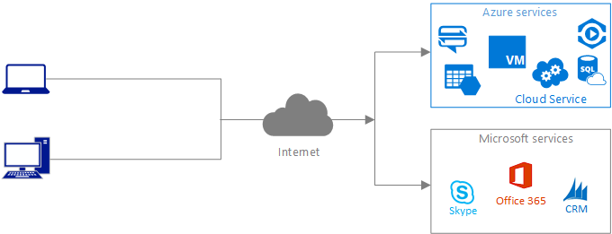
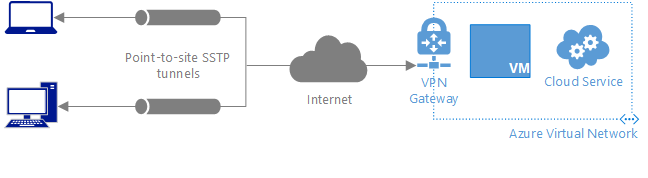
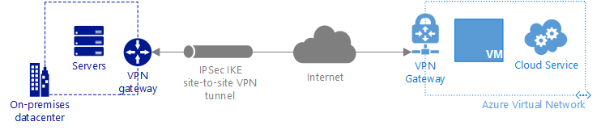
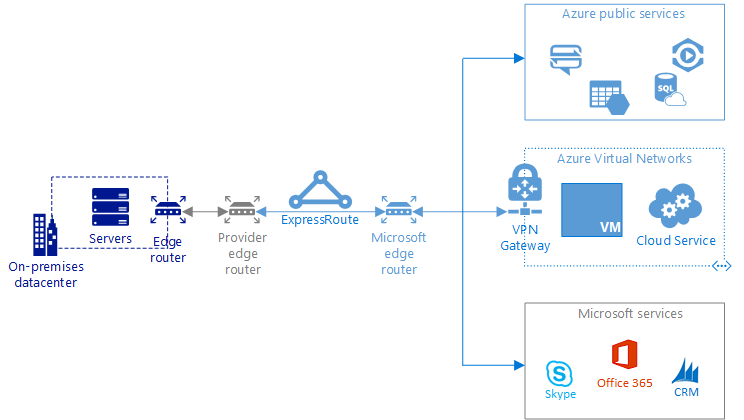

<properties
   pageTitle="您的內部部署網路連線到 Azure |Microsoft Azure"
   description="說明及比較的不同方法可以連線至 Microsoft 雲端服務，例如 Azure、 Office 365 和 Dynamics CRM Online。"
   services=""
   documentationCenter="na"
   authors="jimdial"
   manager="carmonm"
   editor=""
   tags=""/>
<tags
   ms.service="guidance"
   ms.devlang="na"
   ms.topic="article"
   ms.tgt_pltfrm="na"
   ms.workload="na"
   ms.date="08/25/2016"
   ms.author="jdial"/>
   
# 您的內部部署網路連線到 Azure

Microsoft 提供數種類型的雲端服務。 雖然您可以透過公用網際網路連線的所有服務，您也可以連線到使用虛擬私人網路 (VPN) 通道，透過網際網路或直接私人連線至 Microsoft 服務的部分。 本文可協助您判斷哪一個連線選項最符合您的需求根據您使用的 Microsoft 雲端服務的類型。 大多數的組織使用多個連線類型，如下所述。

## 透過公用網際網路連線

此連線類型直接透過網際網路、 提供 Microsoft 雲端服務的存取，如下所示。

此連線通常是用於連線至 Microsoft 雲端服務的第一個類型。 下表列出此連線類型優缺點。

| **優點**| **考量**|
|---------|---------|
|需要沒有修改您的內部部署網路，只要用戶端的所有裝置都有無限制的存取所有的 IP 位址和連接埠在網際網路上的。|經常使用 HTTPS 來加密流量，但它可以攔截在傳輸時會因為它穿過公用網際網路。|
|可以連線至公用網際網路上公開的所有 Microsoft 雲端服務。|發生無法預期的延遲因為連線穿過網際網路。|
|使用您現有的網際網路連線。||
|不需要任何連線裝置管理。||

此連線有沒有連線或頻寬成本，因為您使用現有的網際網路連線。 

## 連接點為網站連線

此連線類型會提供一些 Microsoft 雲端服務，透過安全通訊端通道通訊協定 」 (SSTP) 通道存取網際網路，如下所示。

連線由您現有的網際網路連線，但需要使用 Azure VPN 閘道器。 下表列出此連線類型優缺點。

| **優點**| **考量**|
|---------|---------|
|需要沒有修改您的內部部署網路，只要用戶端的所有裝置都有無限制的存取所有的 IP 位址和連接埠在網際網路上的。|使用 IPSec 加密流量，但它可以攔截在傳輸時會因為它穿過公用網際網路。|
|使用您現有的網際網路連線。|發生無法預期的延遲因為連線穿過網際網路。|
|處理最多 200 Mb/s 每閘道器的能力。|需要建立與管理個別之間的連線每個裝置上您的內部網路和每個裝置必須連線至每個閘道。|
|可以用來連線到 Azure 服務可連線至 Azure 虛擬網路 (VNet) 的 Azure 虛擬機器等 Azure 雲端服務。|需要 Azure VPN 閘道器的最小進行中的管理。|
||無法用來連線到 Microsoft Office 365 或 Dynamics CRM Online。
||無法用來連線到無法連線至 VNet 的 Azure 服務。|

進一步瞭解[VPN 閘道器](../vpn-gateway/vpn-gateway-about-vpngateways.md)服務、 其[價格](https://azure.microsoft.com/pricing/details/vpn-gateway)，以及輸出資料傳輸[價格](https://azure.microsoft.com/pricing/details/data-transfers)。

## 連線至網站連線

此連線類型會提供一些 Microsoft 雲端服務，透過 IPSec 通道存取網際網路，如下所示。

連線由您現有的網際網路連線，但必須使用其相關聯的價格和價格的輸出資料傳輸 Azure VPN 閘道。 下表列出此連線類型優缺點。

| **優點**| **考量**|
|---------|---------|
|在您的內部網路上的所有裝置可以與 Azure 服務連線到 VNet，因此不需要設定為每個裝置的個別連線進行都通訊。|使用 IPSec 加密流量，但它可以攔截在傳輸時會因為它穿過公用網際網路。|
|使用您現有的網際網路連線。|發生無法預期的延遲因為連線穿過網際網路。|
|可連線至 Azure 虛擬機器例如 VNet 可以連線的服務及雲端服務。|必須設定及管理驗證 VPN 裝置 * 內部部署。|
|處理最多 200 Mb/s 每閘道器的能力。|需要 Azure VPN 閘道器的最小進行中的管理。|
|可以強制從雲端透過檢查和使用使用者定義的路徑或框線閘道器通訊協定 (BGP) 記錄的內部網路的虛擬機器發起的租用戶的外寄流量 * *。|無法用來連線到 Microsoft Office 365 或 Dynamics CRM Online。|
||無法用來連線到無法連線至 VNet 的 Azure 服務。|
||如果您使用 [啟動裝置的內部部署連線的服務，您的安全性原則需要它，您可能需要之間的內部部署網路和 Azure 防火牆。|

- * 檢視清單[驗證 VPN 裝置](../vpn-gateway/vpn-gateway-about-vpn-devices.md#validated-vpn-devices)。
- * * 進一步瞭解使用[使用者定義的路徑](../vpn-gateway/vpn-gateway-forced-tunneling-rm.md)或[BGP](../vpn-gateway/vpn-gateway-bgp-overview.md)強制從 Azure VNets 路由至內部部署的裝置。

## 連線專用的私人連線

此連線類型提供存取所有的 Microsoft 雲端服務透過專用的私人連線至不往返網際網路的 Microsoft 如下所示。

連線需要使用 ExpressRoute 服務及一個連線提供者的連線。 下表列出此連線類型優缺點。

| **優點**| **考量**|
|---------|---------|
|公用網際網路上無法流量攔截傳輸，因為用服務提供者所提供的專用的連線。|需要內部部署路由器管理。|
|10 Gb/s 每個 ExpressRoute 電路和處理量進位 2 Gb/s 每一個閘道器至最頻寬。|需要一個連線提供者的專用的連線。|
|如預期呈現延遲因為它是不往返網際網路的 Microsoft 的專用的連線。|（如果連線電路到 VNets），則可能需要一或多個 Azure VPN 閘道器的最小進行中的管理。|
|雖然您可以視需要加密傳輸，不需要加密的通訊。| 如果您使用雲端服務的啟動裝置的內部部署連線，您可能需要之間的內部部署網路和 Azure 防火牆。|
|可以直接連接到所有的 Microsoft 雲端服務，有一些例外狀況 *。|需要網路位址轉譯 (NAT) 的內部部署的服務，便無法連線到 VNet.* * 輸入 Microsoft 資料中心的 IP 位址|
|可以強制從內部部署網路上的 [檢查和記錄使用 BGP 透過雲端虛擬機器發起的租用戶的外寄流量。|

- * 檢視無法使用 ExpressRoute[服務的清單](../expressroute/expressroute-faqs.md#supported-services)。 若要連線至 Office 365，必須經過核准 Azure 訂閱。  請參閱[Office 365 的 Azure ExpressRoute](https://support.office.com/article/Azure-ExpressRoute-for-Office-365-6d2534a2-c19c-4a99-be5e-33a0cee5d3bd?ui=en-US&rs=en-US&ad=US&fromAR=1)如需詳細資訊。
- * * 進一步瞭解 ExpressRoute [NAT](../expressroute/expressroute-nat.md)需求。

進一步瞭解[ExpressRoute](../expressroute/expressroute-introduction.md)、 其相關聯[價格](https://azure.microsoft.com/pricing/details/expressroute)，和[連線提供者](../expressroute/expressroute-locations.md#connectivity-provider-locations)。

## 其他考量

- 多個選項上方有各種它們可以支援 VNet 連線、 閘道器的連線，以及其他準則的最大限制。 建議您檢閱 Azure[網路限制](../azure-subscription-service-limits.md#networking-limits)了解如果它們會影響您選擇要使用的連線類型。 
- 如果您打算連接相同的 VNet ExpressRoute 閘道器至網站 VPN 連線，您應該瞭解重要的限制式第一次。 請參閱[設定 ExpressRoute 和網站-共存連線](../expressroute/expressroute-howto-coexist-resource-manager.md#limits-and-limitations)如需詳細資訊。

## 後續步驟

下列資源說明如何實作本文中包含的連線類型。

-   [實作點為網站連線](../vpn-gateway/vpn-gateway-howto-point-to-site-rm-ps.md)
-   [實作網站的連線](guidance-hybrid-network-vpn.md)
-   [實作專用的私人連線](guidance-hybrid-network-expressroute.md)
-   [實作與網站-連線的專用私人連線高可用性](guidance-hybrid-network-expressroute-vpn-failover.md)
