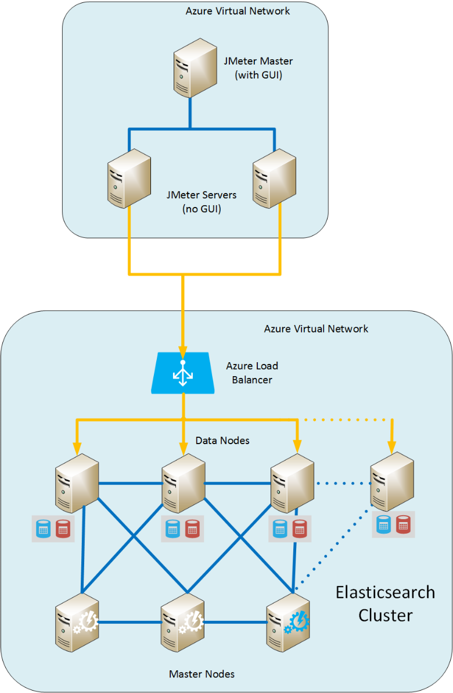
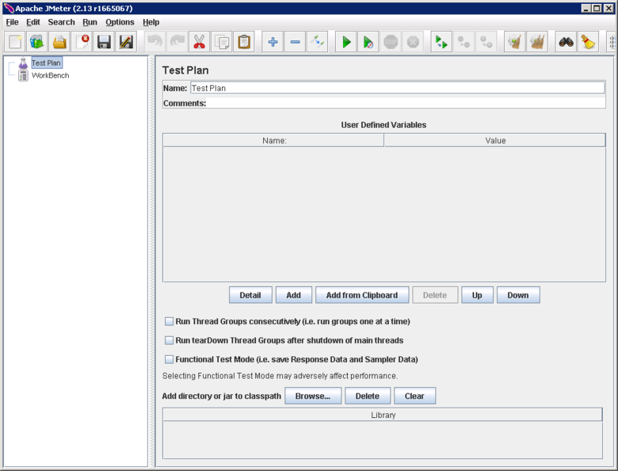
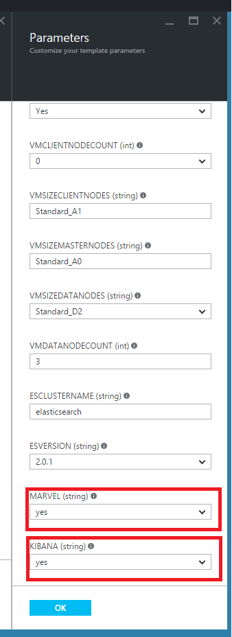

<properties
   pageTitle="建立 Elasticsearch 測試環境效能 |Microsoft Azure"
   description="如何設定環境進行測試 Elasticsearch 叢集的效能。"
   services=""
   documentationCenter="na"
   authors="dragon119"
   manager="bennage"
   editor=""
   tags=""/>

<tags
   ms.service="guidance"
   ms.devlang="na"
   ms.topic="article"
   ms.tgt_pltfrm="na"
   ms.workload="na"
   ms.date="09/22/2016"
   ms.author="masashin"/>
   
# <a name="creating-a-performance-testing-environment-for-elasticsearch-on-azure"></a>建立在 Azure Elasticsearch 測試環境效能

[AZURE.INCLUDE [pnp-header](../../includes/guidance-pnp-header-include.md)]

本文是[一系列的一部分](guidance-elasticsearch.md)。 

這份文件將說明如何設定的環境，以進行測試 Elasticsearch 叢集的效能。 此設定來測試資料 ingestion] 與 [查詢負載的效能[調整資料 ingestion 效能 Elasticsearch Azure 上][]所述。

效能測試程序會使用[標準設定](http://jmeter-plugins.org/wiki/StandardSet/)的外掛程式安裝在主要/從屬組態使用特別的目的設定專用 Vm （不屬於 Elasticsearch 叢集） 一組[Apache JMeter](http://jmeter.apache.org/)。 

[效能伺服器代理程式](http://jmeter-plugins.org/wiki/PerfMonAgent/)已安裝在每個 Elasticsearch 節點。 下列各節提供的指示重新建立測試環境，讓您進行 JMeter 以測試您的效能。 這些指示假設您有建立 Elasticsearch 叢集與使用 Azure 虛擬網路連線的節點。 

請注意，測試環境也會執行 Azure Vm 管理使用單一 Azure 資源群組的一組。

[Marvel](https://www.elastic.co/products/marvel)也安裝並設定為啟用 Elasticsearch 叢集監督和更輕鬆地分析內部層面。 如果 JMeter 統計資料會顯示的最大使用量或透過效能，可透過 Marvel 的資訊可準確幫助您判斷變動的原因。

下圖顯示整個系統的結構。 



請注意下列重點︰

- JMeter 母片 VM 執行 Windows Server 提供 JMeter 主控台 GUI 環境。 JMeter 母片 VM 提供 GUI （ *jmeter*應用程式） 才能建立測試、 執行測試，並以視覺化方式呈現結果的人員。 此 VM 協調與 JMeter 伺服器的實際傳送要求構成測試 Vm。

- JMeter 從屬 Vm 執行 Ubuntu Server (Linux)，這些 Vm 沒有 GUI 需求。 JMeter 伺服器 Vm 執行 JMeter 伺服器軟體 （ *jmeter 伺服器*應用程式） Elasticsearch 叢集傳送邀請。

- 用戶端專用的節點已不使用，雖然專用的主版節點已。

- 資料中的節點數目叢集可以而有所不同，正在測試之案例。

- Elasticsearch 叢集內所有節點都執行 Marvel 觀察在執行階段，效能及 JMeter 伺服器代理程式收集監控供稍後分析的資料。

- 當測試 Elasticsearch 2.0.0 及更新版本，其中一個資料節點也會執行 Kibana。 這是 marvel 的需要在 Elasticsearch 2.0.0 執行版及更新版本。

## <a name="creating-an-azure-resource-group-for-the-virtual-machines"></a>建立虛擬機器 Azure 資源群組

JMeter 母片必須直接連接到每個 Elasticsearch 叢集收集效能資料中的節點。 如果有別於 Elasticsearch 叢集 VNet JMeter VNet，然後這項功能需要設定的每個 Elasticsearch 節點的公用 IP 位址。 如果這是您的 Elasticsearch 設定問題，，然後請考慮使用相同的資源群組，在相同的 VNet 和 Elasticsearch 叢集實作 JMeter Vm，在這種情況您可以略過此第一個程序。

首先，[建立資源群組](../resource-group-template-deploy-portal.md)。 這份文件，假設您資源的群組名稱為*JMeterPerformanceTest*。 如果您想要在相同的 VNet 和 Elasticsearch 叢集執行 JMeter Vm，使用相同的資源群組作為，而不是建立一個新的叢集。

## <a name="creating-the-jmeter-master-virtual-machine"></a>建立主版 JMeter 的虛擬機器

下一步[建立 Windows VM](../virtual-machines/virtual-machines-windows-hero-tutorial.md)使用*Windows Server 2008 R2 SP1*圖像。  我們建議選取有足夠的核心和記憶體執行效能測試虛擬記憶體大小。 理想的情況下，這就是一部電腦至少 2 核心和 3.5 GB 的 RAM (A2 標準或更大)。

<!-- TODO add info on why disabling diagnostics is positive --> 

我們建議您停用診斷。 在入口網站中建立 VM，是在 [*監控*區段的 [*診斷**設定*刀上。 保持在其預設值的 [其他設定]。

請確認該 VM 及所有相關聯的資源已成功建立入口網站中的 [[檢查 [資源] 群組](../azure-portal/resource-group-portal.md#manage-resource-groups)。 列出的資源應該包含 VM 和網路安全性群組，以及使用相同的名稱，所有的公用 IP 位址網路介面和儲存帳戶，以根據 VM 的名稱。

## <a name="creating-the-jmeter-subordinate-virtual-machines"></a>建立 JMeter 從屬虛擬機器

現在[建立 Linux VM](../virtual-machines/virtual-machines-linux-quick-create-portal.md)使用*Ubuntu 伺服器 14.04 LTS*圖像。  就跟 JMeter 主 VM，選取 [有足夠的核心和記憶體執行效能測試虛擬記憶體大小]。 理想的情況下，這就是一部電腦至少 2 核心和至少 3.5 GB 的 RAM (標準 A2 或更大)。

同樣地，我們建議您停用診斷。

您可以建立最多從屬 Vm 隨意。 

## <a name="installing-jmeter-server-on-the-jmeter-subordinate-vms"></a>在 JMeter 從屬 Vm 安裝 JMeter 伺服器

JMeter 從屬 Vm 執行 Linux，依預設您無法連線至開啟遠端桌面連線 (RDP)。 不過，您可以在每個 VM 上的 [[使用 PuTTY 來開啟命令列] 視窗](../virtual-machines/virtual-machines-linux-mac-create-ssh-keys.md)。

一旦您已連線到其中一個從屬 Vm，我們將使用艦隊來設定 JMeter。

首先，請安裝所需執行 JMeter Java 執行階段環境。

```bash
sudo add-apt-repository ppa:webupd8team/java
sudo apt-get update
sudo apt-get install oracle-java8-installer
```

現在，下載 JMeter 軟體封裝為 zip 檔案。

```bash
wget http://apache.mirror.anlx.net/jmeter/binaries/apache-jmeter-2.13.zip
```

安裝 [解壓縮] 命令，然後使用它來展開 JMeter 軟體。 本軟體會複製到名稱為**apache-jmeter-2.13**的資料夾。

```bash
sudo apt-get install unzip
unzip apache-jmeter-2.13.zip
```

變更為*bin*目錄拿著 JMeter 可執行檔，然後進行*jmeter 伺服器*和*jmeter*程式可執行。

```bash
cd apache-jmeter-2.13/bin
chmod u+x jmeter-server
chmod u+x jmeter
```

現在，我們需要編輯檔案`jmeter.properties`位於目前資料夾 （使用您熟悉最，例如*六*或*vim*文字編輯器）。 找出下列行︰

```yaml
...
client.rmi.localport=0
...
server.rmi.localport=4000
...
```

取消註解 (移除前置\## 」 字元) 和修改這些線條，如下所示，然後將檔案儲存並關閉編輯器] 中︰

```yaml
...
client.rmi.localport=4441
...
server.rmi.localport=4440
```

現在，請執行下列命令以開啟連入 TCP 流量的連接埠 4441 （這是您剛才設定接聽*jmeter 伺服器*的連接埠）︰

```bash
sudo iptables -A INPUT -m state --state NEW -m tcp -p tcp --dport 4441 -j ACCEPT
```

下載包含的 JMeter （這些增益集提供效能監視計數器） 的外掛程式的標準集合 zip 檔案，然後解壓縮檔案到**apache-jmeter-2.13**資料夾。 解壓縮此位置的檔案會外掛程式放在正確的資料夾。

如果系統提示您取代授權檔案時，輸入 [A （適用於所有）︰

```bash
wget http://jmeter-plugins.org/downloads/file/JMeterPlugins-Standard-1.3.0.zip
unzip JMeterPlugins-Standard-1.3.0.zip
```

使用`nohup`啟動背景中的 JMeter 伺服器。 它應該回應顯示程序識別碼和訊息，指出它已建立遠端物件，並準備好開始接收命令。  ~/Apache-jmeter-2.13/bin 目錄中，執行下列命令。 

```bash
nohup jmeter-server &
```

> [AZURE.NOTE]如果 VM 是關機 JMeter 伺服器程式已結束。 您必須連線至 VM 並再次手動重新啟動它。 或者，您可以設定系統*jmeter 伺服器*上執行命令，自動啟動藉由新增下列命令以`/etc/rc.local`（之前*結束 0* ] 命令） 的檔案︰

```bash
sudo -u <username> bash << eoc
cd /home/<username>/apache-jmeter-2.13/bin
nohup ./jmeter-server &
eoc
```

取代`<username>`您登入名稱。

您可能會發現實用終端機讓視窗保持開啟，好讓測試正在進行中時，您可以監視 JMeter 伺服器的進度。

您需要的每個 JMeter 從屬 VM 重複這些步驟。

## <a name="installing-the-jmeter-server-agent-on-the-elasticsearch-nodes"></a>在 Elasticsearch 節點安裝 JMeter 伺服器代理程式

此程序假設您已登入存取 Elasticsearch 節點。 如果您已經建立範本資源管理員叢集，您可以連線至透過 [跳轉] 方塊 VM，每個節點的[Azure 上執行的 Elasticsearch](guidance-elasticsearch-running-on-azure.md)Elasticsearch 拓撲] 區段中所示。 您可以連線至 [捷徑] 方塊中，也使用 PuTTY。 

在這裡，您可以使用*ssh*命令 Elasticsearch 叢集節點的每個登入。

登入的其中一個 Elasticsearch 節點以系統管理員。  在艦隊命令提示字元中，輸入下列命令以建立保留 JMeter 伺服器代理程式的資料夾，然後移至該資料夾︰

```bash
mkdir server-agent
cd server-agent
```

執行下列命令以安裝 [*解壓縮*] 命令 （如果尚未安裝），下載 JMeter 伺服器代理程式軟體，並將它解壓縮︰

```bash
sudo apt-get install unzip
wget http://jmeter-plugins.org/downloads/file/ServerAgent-2.2.1.zip
unzip ServerAgent-2.2.1.zip
```
 
執行下列命令以設定防火牆，並啟用 TCP 流量通過連接埠 4444 （這是由 JMeter 伺服器代理程式的連接埠）︰

```bash
sudo iptables -A INPUT -m state --state NEW -m tcp -p tcp --dport 4444 -j ACCEPT
```

執行下列命令以啟動 JMeter 伺服器代理程式在背景中︰

```bash
nohup ./startAgent.sh &
```

JMeter 伺服器代理程式應該回應的郵件，指出它已啟動傾聽連接埠 4444。  按下 Enter，取得命令提示字元中，然後執行下列命令。

```bash
telnet <nodename> 4444
```

取代`<nodename>`您節點的名稱。 (您可以找到您的節點的名稱來執行`hostname`] 命令。)這個命令會開啟您的本機電腦上的連接埠 4444 telnet 連線。 您可以使用此連線以驗證 JMeter 伺服器代理程式正在順利執行。

如果不執行 JMeter 伺服器代理程式，您會收到回應 

`*telnet: Unable to connect to remote host: Connection refused*.`

如果 JMeter 伺服器代理程式正在執行並已正確設定連接埠 4444，您應該會看到下列回應︰


> [AZURE.NOTE] 它已經連接到電腦之後，telnet 工作階段並不提供任何類型的提示。

在 telnet 工作階段中，輸入下列命令︰

``` 
test
```

如果 JMeter 伺服器代理程式設定並聆聽正確，應該表示它接收命令和回覆訊息*Yep*。

> [AZURE.NOTE]您可以輸入其他命令] 以取得效能監視資料。 例如，命令`metric-single:cpu:idle`可讓您目前的比例 CPU 是閒置 （這是快照） 的時間。 命令的完整清單，請造訪[效能伺服器代理程式](http://jmeter-plugins.org/wiki/PerfMonAgent/)] 頁面。 ︰ 回到呼叫他效能伺服器代理程式。 >>

在 telnet 工作階段中，輸入下列命令以結束工作階段，並返回 [艦隊命令提示字元︰

``` 
exit
```

> [AZURE.NOTE]當與 JMeter 從屬 Vm，如果您登入，或如果這台電腦會關閉並重新啟動然後 JMeter 伺服器代理程式會需要重新啟動以手動方式使用`startAgent.sh`] 命令。 如果您想要自動啟動 JMeter 伺服器代理程式，請將下列命令的`/etc/rc.local`之前*結束 0* ] 命令的檔案。 
> 取代`<username>`您登入名稱︰

```bash
sudo -u <username> bash << eoc
cd /home/<username>/server-agent
nohup ./startAgent.sh &
eoc
```

您可以現在請重複此整個程序中每個其他節點 Elasticsearch 叢集，或者您可以使用`scp`] 命令，將的伺服器代理程式] 資料夾和內容複製到其他節點並使用每個`ssh`命令啟動 JMeter 伺服器代理程式，如下所示。 e 取代`<username>`與您的使用者名稱和`<nodename>`與您想要複製並執行 （可能會要求您提供您的密碼，當您執行的每一個命令） 的軟體節點的名稱︰

```bash
scp -r \~/server-agent <username>@<nodename>:\~
ssh <nodename> sudo iptables -A INPUT -m state --state NEW -m tcp -p tcp --dport 4444 -j ACCEPT
ssh <nodename> -n -f 'nohup \~/server-agent/startAgent.sh'
```

## <a name="installing-and-configuring-jmeter-on-the-jmeter-master-vm"></a>安裝及設定 JMeter JMeter 主 VM 上

在 Azure 入口網站中，按一下 [**資源群組**]。 在 [**資源群組**刀中，按一下 [包含 JMeter 母片及從屬 Vm 資源群組]。  在 [**資源群組**刀中，按一下 [ **JMeter 主 VM**]。 在虛擬機器刀的工具列上，按一下 [**連線**。 開啟網頁瀏覽器出現提示時的 RDP 檔案。 Windows 中建立您 vm 遠端桌面連線。  Vm 出現提示時輸入使用者名稱和密碼。

在 VM，使用 Internet Explorer 中，移至 [[下載 Windows Java](http://www.java.com/en/download/ie_manual.jsp)頁面。 遵循下載並執行 Java 安裝程式的指示。

在網頁瀏覽器中，移至 [[下載 Apache JMeter](http://jmeter.apache.org/download_jmeter.cgi)頁面和下載 zip 包含最新的二進位。 Zip 儲存您 VM 適當的位置。

移至 [[自訂 JMeter 外掛程式](http://jmeter-plugins.org/)網站，並下載外掛程式標準設定。 將 zip JMeter 下載的相同資料夾中儲存的上一個步驟。

在 Windows 檔案總管] 中，移至包含 apache 資料夾-jmeter-*len* zip 檔案， *len*是 JMeter 的目前版本的位置。 將檔案解壓縮到目前的資料夾。

擷取檔案 JMeterPlugins-標準*yyy*.zip 檔案，其中*yyy*是目前版本的外掛程式]，將 apache-jmeter-*len*資料夾。 這會新增到正確的資料夾的外掛程式的 JMeter。 安全地可以合併的文件庫資料夾，並出現提示時，覆寫的授權和讀我檔案。

移至 [apache-jmeter-*len*/bin 資料夾和編輯 jmeter.properties 檔案使用 [記事本]。  在 [`jmeter.properties`檔案時，請尋找 [標示為*遠端主辦城市] 和 [RMI 組態*] 區段。  在本節中的檔案，找到的下列行︰

```yaml
remote_hosts=127.0.0.1
```

變更這一行，並取代 IP 位址 127.0.0.1 並以逗號分隔的 IP 位址或清單的每個 JMeter 從屬伺服器主機名稱。 例如︰

```yaml
remote_hosts=JMeterSub1,JMeterSub2
```

尋找下列命令，然後移除`#`開頭的此列，字元及修改 client.rmi.localport 設定的值︰

```yaml
#client.rmi.localport=0
```

若要︰

```yaml
client.rmi.localport=4440
```

將檔案儲存並關閉 [記事本]。 

在 [視窗] 工具列中，按一下 [**開始]**，按一下 [**系統管理工具**]，然後按一下**具有進階安全性的 Windows 防火牆**。  在 Windows 防火牆與進階安全性] 視窗的左窗格中，**輸入規則**]，以滑鼠右鍵按一下，然後按一下 [**新增規則**。

在**新增輸入規則精靈**] 在 [**規則類型**] 頁面上選取**連接埠**，然後按 [**下一步**。  在 [通訊協定和連接埠] 頁面上選取 [ **TCP**中，選取**特定本機連接埠**文字方塊中輸入`4440-4444`，然後按一下 [**下一步**。  在 [動作] 頁面中，選取 [**允許連線**，，然後按 [**下一步**。 在設定檔頁面上，保留所有核取的選項，然後再按 [**下一步**。  在 [名稱] 頁面中，在 [**名稱**] 文字方塊中輸入*JMeter*，，然後按一下**完成**。  關閉 [具有進階安全性] 視窗的 Windows 防火牆]。

在 Windows 檔案總管，在 apache-jmeter-*xx*/bin 資料夾，按兩下*jmeter* Windows 批次檔案，以開始 GUI。 使用者介面應該會出現︰



在功能表列中，按一下 [**執行****遠端開始**]，然後按一下驗證所列的兩個 JMeter 從屬機器︰


您已準備好開始進行測試效能。

## <a name="installing-and-configuring-marvel"></a>安裝及設定 Marvel

Azure Elasticsearch 快速入門範本會安裝，並自動設定適當的 Marvel 版本，如果您設定為建置叢集時 true （「 是 」），則 MARVEL 和 KIBANA 參數︰



如果您要新增 Marvel 到現有的叢集您需要執行安裝，以手動方式，與程序會根據您是否使用 Elasticsearch 版本不同 1.7.x 或 2.x，下列程序中所述。

### <a name="installing-marvel-with-elasticsearch-173-or-earlier"></a>安裝 Marvel Elasticsearch 1.73 或更舊版本

如果您使用的 Elasticsearch 1.7.3 或更早版本，執行下列步驟*的每個節點*叢集︰

- 登入至節點並移至 Elasticsearch 主目錄。  一般主目錄是 linux， `/usr/share/elasticsearch`。

-  執行下列命令以下載並安裝 Elasticsearch Marvel 外掛程式︰

```bash
sudo bin/plugin -i elasticsearch/marvel/latest
```

- 停止然後再重新 Elasticsearch 節點上︰

```bash
sudo service elasticsearch restart
```

- 若要確認 Marvel 已安裝正確，開啟網頁瀏覽器並移至 URL `http://<server>:9200/_plugin/marvel`。 取代`<server>`名稱或叢集任何 Elasticsearch 伺服器 IP 位址。  確認類似以下所示的頁面顯示︰


### <a name="installing-marvel-with-elasticsearch-200-or-later"></a>透過 Elasticsearch 2.0.0 安裝 Marvel 或更新版本

如果您使用的 Elasticsearch 2.0.0 或更新版本中，執行下列工作*的每個節點*叢集︰

登入節點並移至 Elasticsearch 主目錄 (通常是`/usr/share/elasticsearch`) 執行下列命令以下載並安裝 Elasticsearch Marvel 外掛程式︰

```bash
sudo bin/plugin install license
sudo bin/plugin install marvel-agent
```

停止然後再重新 Elasticsearch 節點上︰

```bash
sudo service elasticsearch restart
```

下列程序，取代`<kibana-version>`4.2.2，如果您使用的 Elasticsearch 2.0.0 或 Elasticsearch 2.0.1，或如果您使用的 Elasticsearch 2.1.0 4.3.1 或更新版本。  取代`<marvel-version>`2.0.0，如果您使用的 Elasticsearch 2.0.0 或 Elasticsearch 2.0.1，或如果您使用的 Elasticsearch 2.1.0 2.1.0 或更新版本。  執行下列工作*上一個節點*叢集︰

登入節點並從[網站下載 Elasticsearch](https://www.elastic.co/downloads/past-releases)，下載 Kibana 適當建立，您的 Elasticsearch 版本，然後擷取套件︰

```bash
wget https://download.elastic.co/kibana/kibana/kibana-<kibana-version>-linux-x64.tar.gz
tar xvzf kibana-<kibana-version>-linux-x64.tar.gz
```

開啟連接埠 5601 接受傳入的要求︰

```bash
sudo iptables -A INPUT -m state --state NEW -m tcp -p tcp --dport 5601 -j ACCEPT
```

移至 [Kibana 設定資料夾 (`kibana-<kibana-version>-linux-x64/config`)，編輯`kibana.yml`檔案，然後將下列行。 取代`<server>`名稱或叢集 Elasticsearch 伺服器 IP 位址︰

```yaml
elasticsearch.url: "http://<server>:9200"
```

移至 Kibana bin 資料夾 (`kibana-<kibana-version>-linux-x64/bin`)，然後執行下列命令以整合 Kibana Marvel 外掛程式︰

```bash
sudo ./kibana plugin --install elasticsearch/marvel/<marvel-version>
```

啟動 Kibana:

```bash
sudo nohup ./kibana &
```

若要確認 Marvel 安裝，請開啟網頁瀏覽器並移至 URL `http://<server>:5601/app/marvel`。 取代`<server>`名稱或執行 Kibana 伺服器 IP 位址。

確認類似以下所示的頁面顯示 （從顯示的圖像可能會有所不同叢集的名稱）。


按一下 [對應至叢集] 連結 (elasticsearch210 上述圖像)。 應該顯示頁面類似以下所示︰


[調整資料 Ingestion 效能的 Elasticsearch Azure 上]: guidance-elasticsearch-tuning-data-ingestion-performance.md  