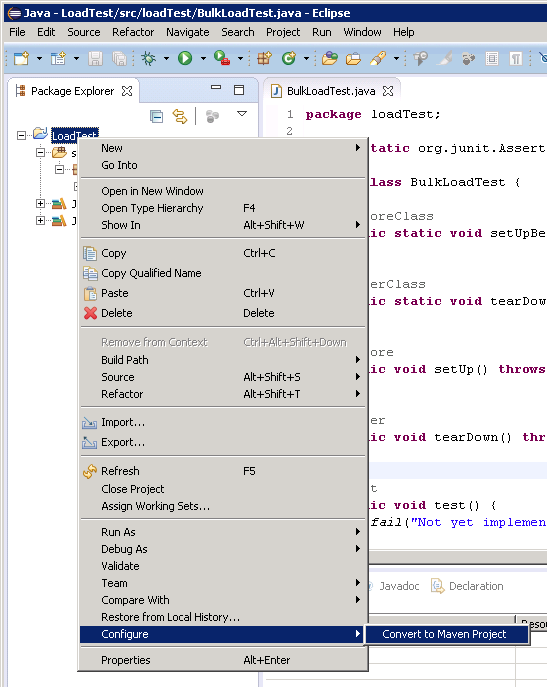
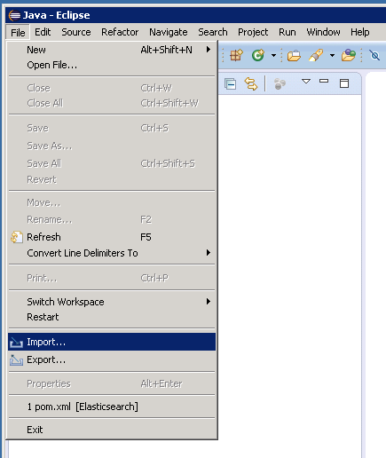

<properties
   pageTitle="部署 JMeter JUnit 樣本中，以進行測試 Elasticsearch 效能 |Microsoft Azure"
   description="如何使用 JUnit 樣本中，以產生和上傳到 Elasticsearch 叢集的資料。"
   services=""
   documentationCenter="na"
   authors="dragon119"
   manager="bennage"
   editor=""
   tags=""/>

<tags
   ms.service="guidance"
   ms.devlang="na"
   ms.topic="article"
   ms.tgt_pltfrm="na"
   ms.workload="na"
   ms.date="09/22/2016"
   ms.author="masashin"/>
   
# 部署 JMeter JUnit 樣本中，以進行測試 Elasticsearch 效能

[AZURE.INCLUDE [pnp-header](../../includes/guidance-pnp-header-include.md)]

本文是[一系列的一部分](guidance-elasticsearch.md)。 

這份文件會說明如何建立及使用 JUnit 樣本中可產生及將資料上傳至 Elasticsearch 叢集 JMeter 測試方案的一部分。 這種方法提供彈性載入測試方法可以產生大量測試資料而不根據外部資料檔案。

> [AZURE.NOTE] 使用此方法來建構用來評估資料 ingestion [Elasticsearch 調整資料 ingestion 效能](guidance-elasticsearch-tuning-data-ingestion-performance.md)所述的效能的載入測試了。 文件說明 JUnit 程式碼的詳細資料。

測試資料 ingestion 效能，請使用蝕 （火星），開發 JUnit 程式碼，並使用 Maven 解析相依性。 下列程序說明安裝蝕、 設定 Maven、 建立 JUnit 測試，及部署這項測試為 JUnit 要求樣本 JMeter 測試的逐步程序。

> [AZURE.NOTE] 如詳細的結構和測試環境設定的詳細資訊，請參閱[建立 Elasticsearch Azure 上的效能測試環境][]。

## 安裝的先決條件

在您的部署電腦上必須[Java 執行階段環境](http://www.java.com/en/download/ie_manual.jsp)。
您也必須安裝[蝕 IDE Java 開發人員](https://www.eclipse.org/downloads/index.php?show_instructions=TRUE)。

> [AZURE.NOTE] 如果您使用的為您的開發環境的 [[建立上 Azure Elasticsearch 效能測試環境][]中所述的 JMeter 主 VM，下載 Windows 32 位元版本的蝕安裝程式。

## 建立負載測試 Elasticsearch JUnit 測試專案

如果沒有執行，啟動蝕 IDE，然後關閉 [**歡迎**] 頁面。  在 [**檔案**] 功能表中，按一下，然後再按一下 [ **Java 專案**。

在 [**新 Java 專案**] 視窗中，輸入專案名稱，選取 [**使用預設 JRE**，，然後按一下**完成**。

在 [**套件檔案總管**] 視窗中，展開節點以您的專案名稱加以命名。 確認其中包含 「 **src** JRE 您指定的參照的資料夾。

以滑鼠右鍵按一下**src**資料夾，按一下 [**新增**]，再按一下 [ **JUnit 測試大小寫**。

在**新的 JUnit 測試案例**] 視窗中，選取**新的 Junit 4 測試**]，輸入名稱 （這可專案的名稱相同雖然慣例開始小寫字母） 套件，測試類別，然後選取產生方法 stub 測試所需的選項的名稱。 保留空白，[**測試] 下的類別**] 方塊，然後按一下 [**完成]**。

如果出現下列**新 JUnit 測試案例**對話方塊，請選取選項 JUnit 4 文件庫新增至建立路徑，然後按一下**[確定]**。 

確認 JUnit 測試基本架構的程式碼會產生 Java 編輯器] 視窗中顯示。

在**套件檔案總管**中，以滑鼠右鍵按一下專案節點，按一下 [**設定**]，然後按一下**轉換 Maven 專案**。

> [AZURE.NOTE]使用 Maven 可讓您更輕鬆地管理外部相依性 （例如 Elasticsearch Java 用戶端文件庫） 取決於專案。

在**建立新 POM** ] 對話方塊中，在**包裝**下拉式清單中，選取**jar**，，然後按一下 [**完成]**。

在專案物件模型 (POM) 編輯器下方出現的窗格會顯示警告訊息 」 建立路徑指定執行環境 J2SE 1.5 倍。 有安裝工作區中嚴格相容於此環境中沒有 JREs 」，根據哪個版本的 Java 已安裝在您的部署電腦上。 如果您有 Java 晚於版本為 1.5 來計算，您可以忽略此警告的版本。

在 POM 編輯器中，展開**屬性**，然後按一下 [**建立**]。

在 [**新增屬性**] 對話方塊中，在 [**名稱**] 方塊中輸入*es.version*、 [**值**] 方塊中輸入*1.7.2*，，然後按一下**[確定]**。 這是使用 Elasticsearch Java 用戶端程式庫的版本 （此版本可能會在未來，取代和定義為 POM 屬性的版本和參考此屬性，在專案中的其他位置可快速變更版本）。

按一下 [POM 編輯器] 中的**相依性**] 索引標籤，然後按一下 [**相依性**] 清單旁的 [**新增**。

在 [**選取的相依性**] 對話方塊中的 [**群組識別碼**] 方塊中輸入 [ *org.elasticsearch*、**成品識別碼**] 方塊中輸入*elasticsearch*，在 [**版本**] 方塊中輸入*\${es.version}*，然後按一下**[確定]**。 Java Elasticsearch 用戶端文件庫的相關資訊保存在線上的 Maven 中央存放庫，並此設定會自動下載文件庫和相依性建置專案時。

在 [**檔案**] 功能表上按一下 [**全部儲存**。 這個動作會儲存，並建立專案，下載 Maven 所指定的相依性。 請確認 [Maven 相依性] 資料夾，會出現在套件檔案總管。 展開 [此資料夾] 以檢視 jar 檔案下載至支援 Elasticsearch Java 用戶端文件庫]。

## 將蝕匯入現有 JUnit 測試專案

此程序假設您已下載的先前已建立使用蝕 Maven 專案。

啟動蝕 IDE。 在 [**檔案**] 功能表上按一下 [**匯入**。

在 [**選取**] 視窗中，展開 [ **Maven**資料夾**現有 Maven 專案**]，然後按一下然後按 [**下一步**。

在 [ **Maven 專案**] 視窗中，指定資料夾保留專案 （包含 pom.xml 檔案的資料夾），按一下 [**全選**]，然後按一下 [**完成]**。

在 [**套件檔案總管**] 視窗中，展開節點對應到您的專案。 請確認專案包含一個名為**src**資料夾。 這個資料夾包含 JUnit 測試的程式碼。 可以編譯專案，並將其部署追蹤] 下方的指示。

## 部署 JMeter JUnit 測試

這個程序假設您已建立名為 LoadTest 包含 JUnit 測試類別命名為專案`BulkLoadTest.java`接受傳入的一串為建構函式 （這是 JMeter 預期的機制） 設定參數。

在蝕 IDE 中，在**套件檔案總管**中，專案節點，以滑鼠右鍵按一下，然後再按一下 [**匯出**]。

在**匯出精靈**] 在 [**選取**] 頁面中，展開 [ **Java**節點**JAR 檔案**，，然後按一下然後按 [**下一步**。

在**JAR 檔案規格**頁面上，**選取要匯出的資源**] 方塊中，展開專案取消選取**.project**，並取消選取**pom.xml**。 在**JAR 檔案**] 方塊中，提供檔案名稱和位置糖 （應該為它指定.jar 檔案副檔名），然後再按一下 [**完成**。

使用 Windows 檔案總管中，複製您剛剛建立以 JMeter 主 JVM，並將其儲存在 apache jmeter 2.13 JAR 檔案\\的文件庫\\junit 資料夾] 下的 JMeter 的安裝所在的資料夾 （請參閱 「 建立 JMeter 主虛擬機器 」 的程序中[建立效能測試環境的 Elasticsearch Azure 上](guidance-elasticsearch-creating-performance-testing-environment.md)如需詳細資訊。）

回到蝕、 展開 [**套件檔案總管**] 視窗，請記下 JAR 的所有檔案和專案的 [Maven 相依性] 資料夾中列出其位置。 請注意下, 圖中顯示的檔案可能會有所不同，取決於您正在使用的 Elasticsearch 版本︰

使用 Windows 檔案總管中，複製參照 apache jmeter 2.13 Maven 相依性資料夾中的每個 JAR 檔案\\的文件庫\\junit JMeter 主 VM 上的資料夾。

如果文件庫\\junit 資料夾已包含較舊版本的這些 JAR 檔案，然後將其移除。 如果您將其保留在然後 JUnit 測試可能無法運作時參照可能會解析成錯誤 （每瓶）。

如果目前正在執行，JMeter 母片上 VM，停止 JMeter。  啟動 JMeter。  在 JMeter，以滑鼠右鍵按一下 [**測試計劃**，按一下 [**新增**]、 按一下**對話 （使用者）**，，然後按一下**執行緒群組**。

**測試計劃**節點下，以滑鼠右鍵按一下**執行緒群組**，按一下 [**新增**]、 按**樣本**，，然後按一下**JUnit 要求**。

在**JUnit 要求**] 頁面上，選取 [**搜尋 JUnit4 註釋 （而非 JUnit 3)**。 在**類別名稱**下拉式清單中，選取 [JUnit 載入測試類別 (會列出在表單中*&lt;套件&gt;。&lt;課程&gt;*)，**測試方法**下拉式清單選取 JUnit 測試方法 (這是實際執行測試相關聯的工作的方法，應該已標示*@test*蝕專案中的註釋)，然後輸入任何值會傳遞給**建構函式字串標籤**] 方塊中。 下圖所示的詳細資料是只範例。您的**類別名稱**，**測試方法*，和**建構函式字串標籤** 可能會不同於這些顯示。

如果您的課程不會出現在**類別名稱**下拉式清單中，則可能表示糖不正確匯出或尚未放在文件庫中\\junit 資料夾，或部分相依 （每瓶） 會缺少的文件庫\\junit 資料夾。 如果這種情況，再次匯出蝕的專案，並確保您已選取**src**資源、 將糖複製到文件庫\\junit 資料夾，然後確認您是複製所有從屬參照 （每瓶） Maven 列出的文件庫資料夾。

關閉 JMeter。 有不需要儲存測試方案。  複製 JAR 檔案包含 /home/ JUnit 測試類別&lt;使用者名稱&gt;/apache-jmeter-2.13/lib/junit 資料夾，在每一 JMeter 從屬 Vm (*&lt;使用者名稱&gt;*名稱的系統管理員的使用者指定當您建立 VM，[建立上 Azure Elasticsearch 效能測試環境](guidance-elasticsearch-creating-performance-testing-environment.md)中看到 「 建立 JMeter 從屬虛擬機器 」 的程序，如需詳細資訊。)

複製 /home/ JUnit 測試類別所需的相依 JAR 檔案&lt;使用者名稱&gt;在每一 JMeter 從屬 Vm /apache-jmeter-2.13/lib/junit 資料夾。 請務必先移除此資料夾中任何舊版 JAR 檔案。

您可以使用`pscp`公用程式將檔案從 Windows 電腦複製到 Linux。

[建立在 Azure Elasticsearch 測試環境效能]: guidance-elasticsearch-creating-performance-testing-environment.md
