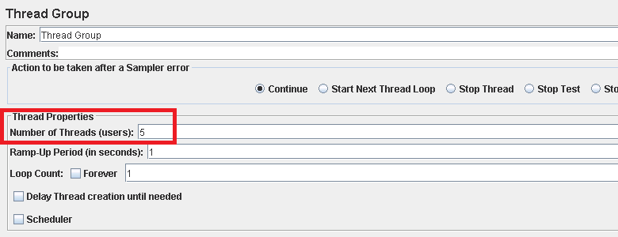
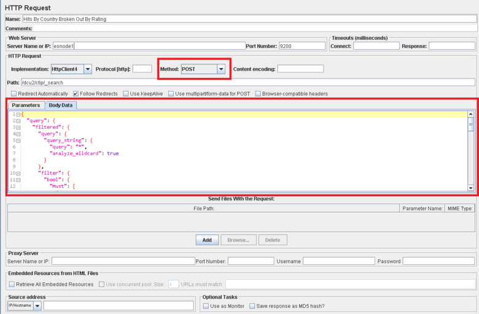

<properties
   pageTitle="實作 Elasticsearch JMeter 測試方案 |Microsoft Azure"
   description="如何執行效能與 JMeter Elasticsearch 測試。"
   services=""
   documentationCenter="na"
   authors="dragon119"
   manager="bennage"
   editor=""
   tags=""/>

<tags
   ms.service="guidance"
   ms.devlang="na"
   ms.topic="article"
   ms.tgt_pltfrm="na"
   ms.workload="na"
   ms.date="09/22/2016"
   ms.author="masashin" />
   
# <a name="implementing-a-jmeter-test-plan-for-elasticsearch"></a>實作 Elasticsearch JMeter 測試方案

[AZURE.INCLUDE [pnp-header](../../includes/guidance-pnp-header-include.md)]

本文是[一系列的一部分](guidance-elasticsearch.md)。 

針對 Elasticsearch 進行的效能測試實作使用 JMeter 測試方案與 Java 程式碼為 JUnit 測試執行工作，例如將叢集上載資料的整合。 測試方案與 JUnit 程式碼所述[Elasticsearch Azure 上的調整資料 ingestion 效能][]，以及[調整資料彙總和 Azure 上 Elasticsearch 的查詢效能][]。

這份文件的目的是要摘要的金鑰體驗所獲得建構及執行這些測試方案。 在 Apache JMeter 網站上的 [ [JMeter 最佳作法](http://jmeter.apache.org/usermanual/best-practices.html)] 頁面包含更廣義的建議有效地使用 JMeter。

## <a name="implementing-a-jmeter-test-plan"></a>實作 JMeter 測試計劃

下列清單摘要列出您應該考慮建立 JMeter 測試方案時的項目︰

- 建立個別的執行緒群組針對每個您想要執行的測試。 測試可以包含多個步驟，包括邏輯控制器、 計時器測試和後的處理器、 取樣器，以及接聽程式。

- 避免建立太多執行緒執行緒群組中。 過多的執行緒會導致失敗的 「 不在記憶體 」 JMeter 例外狀況。 最好是要新增更多 JMeter 從屬伺服器每個執行較小的執行緒比嘗試單一 JMeter 伺服器上執行多執行緒的數字。



- 若要評估叢集的效能，請將[效能指標行程](http://jmeter-plugins.org/wiki/PerfMon/)外掛程式併入測試計劃。 這是有為其中一項標準 JMeter 外掛程式的 JMeter 接聽程式。 儲存原始效能資料到一組逗點分隔值 (CSV) 格式的檔案，然後當測試完成程序。 這是更有效率，並且會採用 JMeter 小於要是比來處理擷取資料。 


您可以使用工具這類 Excel 匯入資料，並用於分析產生的圖形可供選用範圍。

請考慮擷取下列資訊︰

- CPU 使用率 Elasticsearch 叢集中每個節點。

- 閱讀從磁碟每個節點的秒的位元組數。

- 如果可能的話，百分比的 CPU 時間等待 I/O 執行每個節點。 這不一定的 Windows Vm 可能，但 Linux 您可以建立的自訂公制 （接著公制），執行下列命令介面指令叫用*vmstat*節點上︰

```Shell
sh:-c:vmstat 1 5 | awk 'BEGIN { line=0;total=0;}{line=line+1;if(line&gt;1){total=total+\$16;}}END{print total/4}'
```

功能變數 16 *vmstat*輸出中包含 CPU 所花費的時間等待 I/O。 如需有關此陳述式的運作方式的詳細資訊，請參閱[vmstat] 命令](http://linuxcommand.org/man_pages/vmstat8.html)。

- 位元組數傳送及接收的每個節點在網路上。

- 使用不同的彙總的報表接聽記錄效能及成功或失敗作業的頻率。 擷取成功和失敗資料到不同的檔案。


- 讓每個 JMeter 測試案例盡，讓您直接關聯與特定的測試動作的效能。 需要複雜的邏輯測試情況下，請考慮封裝 JUnit 測試此邏輯並使用 JUnit 要求樣本中 JMeter 執行測試。

- 使用 HTTP 要求樣本執行 HTTP 作業，例如取得、 文章、 放入或刪除。 例如，您可以執行 Elasticsearch 搜尋查詢的文章，並提供*本文資料*] 方塊中的查詢詳細資料︰



- 為了方便重複性和重複使用，參數化測試 JMeter 測試方案。 然後您可以使用指令碼來自動化測試計劃執行。

## <a name="implementing-a-junit-test"></a>實作 JUnit 測試

您可以建立一或多個 JUnit 測試，將複雜的程式碼加入 JMeter 測試方案中。 您可以使用 Java 整合的開發環境 (IDE) 等蝕撰寫 JUnit 測試。 如何設定適當的開發環境[部署 JMeter JUnit 樣本中的，以進行測試 Elasticsearch 效能][]提供資訊。

下列清單摘要列出一些撰寫 JUnit 測試的程式碼時，您應該遵循的最佳作法︰

- 若要初始化參數傳遞到測試使用測試類別建構函式。 JMeter 可以使用一個使用單一字串引數。 建構函式，如下列範例所示，將其個別的項目，剖析這個引數︰

```Java
private String hostName = "";
private String indexName = "";
private String typeName = "";
private int port = 0;
private String clusterName = "";
private int itemsPerBatch = 0;

/\* JUnit test class constructor \*/
public ElasticsearchLoadTest2(String params) {
    /* params is a string containing a set of comma separated values for:
        hostName
        indexName
        typeName
        port
        clustername
        itemsPerBatch
    */

    /* Parse the parameter string into an array of string items */
    String delims = "\[ \]\*,\[ \]\*"; // comma surrounded by zero or more spaces
    String\[\] items = params.split(delims);

    /* Note: Parameter validation code omitted */

    /* Use the parameters to populate variables used by the test */
    hostName = items[0];
    indexName = items[1];
    typeName = items[2];
    port = Integer.parseInt(items[3]);
    clusterName = items[4];
    itemsPerBatch = Integer.parseInt(items[5]);

    if(itemsPerBatch == 0)
        itemsPerBatch = 1000;
}
```

- 避免 I/O 或建構函式或設定測試類別中的其他耗時作業，因為他們執行每次執行時 JUnit 測試。 （相同的 JUnit 測試可以執行數千從 JMeter 執行每個效能測試的時間）。

- 請考慮使用昂貴的測試案例初始化一次設定。

- 如果測試需要大量的輸入參數，測試設定資訊儲存在個別的設定檔，然後將傳入建構函式的 [此檔案的位置。

- 避免硬式編碼載入測試程式碼中的檔案路徑。 這些可能會導致失敗，因為 operating systems 例如 Windows 和 Linux 之間的差異。

- 使用判斷提示指出 JUnit 失敗，好讓您可以追蹤 JMeter 和使用的商務度量單位，請測試方法。 如果可能的話，傳遞返回有關失敗的原因，如下所示粗體在下列範例中︰

```Java
@Test
public void bulkInsertTest() throws IOException {
    ...
    BulkResponse bulkResponse = bulkRequest.execute().actionGet();
    assertFalse(
        bulkResponse.buildFailureMessage(), bulkResponse.hasFailures());
        ...
}
```


[Running Elasticsearch on Azure]: guidance-elasticsearch-running-on-azure.md
[調整資料 Ingestion 效能的 Elasticsearch Azure 上]: guidance-elasticsearch-tuning-data-ingestion-performance.md
[部署 JMeter JUnit 樣本中，以進行測試 Elasticsearch 效能]: guidance-elasticsearch-deploying-jmeter-junit-sampler.md
[調整資料彙總和 Azure 上 Elasticsearch 的查詢效能]: guidance-elasticsearch-tuning-data-aggregation-and-query-performance.md
