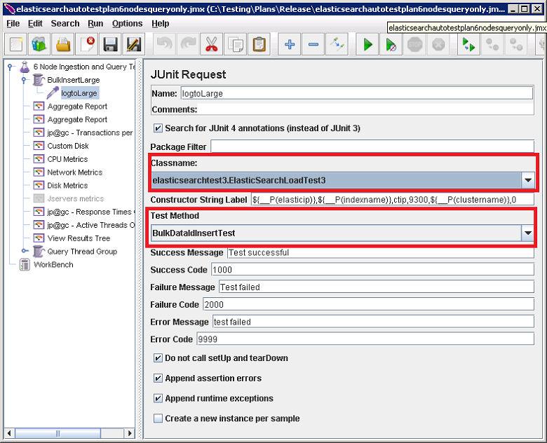

<properties
   pageTitle="執行自動的 Elasticsearch 效能測試 |Microsoft Azure"
   description="如何執行效能測試您自己的環境中的描述。"
   services=""
   documentationCenter="na"
   authors="dragon119"
   manager="bennage"
   editor=""
   tags=""/>

<tags
   ms.service="guidance"
   ms.devlang="na"
   ms.topic="article"
   ms.tgt_pltfrm="na"
   ms.workload="na"
   ms.date="09/22/2016"
   ms.author="masashin"/>
   
# <a name="running-the-automated-elasticsearch-performance-tests"></a>執行自動的 Elasticsearch 效能測試

[AZURE.INCLUDE [pnp-header](../../includes/guidance-pnp-header-include.md)]

本文是[一系列的一部分](guidance-elasticsearch.md)。 

[調整資料 ingestion 效能的 Elasticsearch 上 Azure]及[調整資料彙總查詢的及效能 Elasticsearch Azure 上]的文件會說明執行針對範例 Elasticsearch 叢集的效能測試的數字。

這些測試已建立指令碼，以便讓使用者執行自動化方式。 這份文件將說明如何您可以在自己的環境中重複測試。

## <a name="prerequisites"></a>必要條件

自動的測試需要下列項目︰

-  Elasticsearch 叢集。

- JMeter 環境設定來[建立效能測試環境 Elasticsearch Azure 上的]文件所述。

- [Python 3.5.1](https://www.python.org/downloads/release/python-351/) JMeter 母片 VM 上安裝。


## <a name="how-the-tests-work"></a>測試的運作方式
使用 JMeter 執行測試。 JMeter 主要伺服器載入測試方案，並將其傳遞到一段的實際執行測試 JMeter 從屬伺服器。 JMeter 主要伺服器協調 JMeter 從屬伺服器，並彙總的結果。

提供以下測試方案︰

* [elasticsearchautotestplan3nodes.jmx](https://github.com/mspnp/azure-guidance/blob/master/ingestion-and-query-tests/templates/elasticsearchautotestplan3nodes.jmx)。 移轉 3 節點叢集執行 ingestion 測試。

* [elasticsearchautotestplan6nodes.jmx](https://github.com/mspnp/azure-guidance/blob/master/ingestion-and-query-tests/templates/elasticsearchautotestplan6nodes.jmx)。 移轉 6 節點叢集執行 ingestion 測試。

* [elasticsearchautotestplan6qnodes.jmx](https://github.com/mspnp/azure-guidance/blob/master/ingestion-and-query-tests/templates/elasticsearchautotestplan6qnodes.jmx)。 移轉 6 節點叢集執行 ingestion] 與 [查詢測試。

* [elasticsearchautotestplan6nodesqueryonly.jmx](https://github.com/mspnp/azure-guidance/blob/master/ingestion-and-query-tests/templates/elasticsearchautotestplan6nodesqueryonly.jmx)。 執行查詢專用的測試移轉 6 節點叢集。


您可以使用這些測試做為您自己的案例為基礎的方案，如果您需要較少或多個節點。

測試方案產生和上傳的測試資料以 JUnit 要求樣本。 JMeter 測試計劃建立和執行此樣本，並監視每一個 Elasticsearch 節點的效能資料。  

## <a name="building-and-deploying-the-junit-jar-and-dependencies"></a>建立並部署 JUnit JAR 和相依性
在執行之前應下載的效能測試，編譯和部署在效能/junitcode 資料夾中的 JUnit 測試。 JMeter 測試方案參考這些測試。 如需詳細資訊，請參閱在文件中[部署 JMeter JUnit 樣本中的，以進行測試 Elasticsearch 效能]的 「 匯入現有 JUnit 測試專案蝕 」 的程序。

有兩個版本的 JUnit 測試︰ 

- [Elasticsearch1.73](https://github.com/mspnp/azure-guidance/tree/master/ingestion-and-query-tests/junitcode/elasticsearch1.73)。 您可以使用此程式碼來執行 ingestion 測試。 這些測試使用 Elasticsearch 1.73。

- [Elasticsearch2](https://github.com/mspnp/azure-guidance/tree/master/ingestion-and-query-tests/junitcode/elasticsearch2)。 您可以使用此程式碼來執行查詢測試。 這些測試使用 Elasticsearch 2.1 及更新版本。

將適當的 Java 封存 (JAR) 檔案，以及相依性的其餘部分複製 JMeter 電腦。 [部署 JMeter JUnit 樣本中的，以進行測試 Elasticsearch 效能][]，請參閱程序。 

> **重要**部署 JUnit 測試之後, 使用 JMeter 載入並設定測試方案 BulkInsertLarge 執行緒群組參照正確 JAR 檔案、 JUnit 類別名稱，請確定及參考此 JUnit 測試，測試方法︰
> 
> 
> 
> 執行測試之前，先儲存更新的測試方案。

## <a name="creating-the-test-indexes"></a>建立測試索引
每個測試執行 ingestion 及/或針對單一索引的查詢可讓您指定的測試執行時。 您應該使用建立索引的文件[上 Azure Elasticsearch 調整資料 ingestion 效能]，並[調整資料彙總 Elasticsearch Azure 上的查詢效能]附錄所述的結構描述，並設定其根據您測試的狀況 （啟用/停用的文件值、 多個複本，等等。）請注意測試方案假設索引包含名稱為*ctip*單一類型。

## <a name="configuring-the-test-script-parameters"></a>設定測試指令碼參數
下列測試指令碼參數將檔案複製到 JMeter 伺服器電腦︰

* [run.properties](https://github.com/mspnp/azure-guidance/blob/master/ingestion-and-query-tests/run.properties)。 此檔案指定要使用，請測試 （秒） 的工期節點 （或在 Elasticsearch 叢集，負載平衡器） 的 IP 位址 JMeter 測試執行緒數] 及 [叢集的名稱︰

  ```ini
  nthreads=3
  duration=300
  elasticip=<IP Address or DNS Name Here>
  clustername=<Cluster Name Here>
  ```
  
  編輯此檔案，然後指定您測試和叢集適當的值。

* [查詢-設定-win.ini](https://github.com/mspnp/azure-guidance/blob/master/ingestion-and-query-tests/query-config-win.ini)和[查詢-設定-nix.ini](https://github.com/mspnp/azure-guidance/blob/master/ingestion-and-query-tests/query-config-nix.ini)。 這兩個檔案都包含相同的資訊。*win*檔案格式為 Windows 檔名和路徑和*nix*檔案 Linux 檔名和路徑的格式︰

  ```ini
  [DEFAULT]
  debug=true #if true shows console logs.

  [RUN]
  pathreports=C:\Users\administrator1\jmeter\test-results\ #path where tests results are saved.
  jmx=C:\Users\administrator1\testplan.jmx #path to the JMeter test plan.
  machines=10.0.0.1,10.0.0.2,10.0.0.3 #IPs of the Elasticsearch data nodes separated by commas.
  reports=aggr,err,tps,waitio,cpu,network,disk,response,view #Name of the reports separated by commas.
  tests=idx1,idx2 #Elasticsearch index(es) name(s) to test, comma delimited if more than one.
  properties=run.properties #Name of the properties file.
  ```

  編輯此檔案指定測試結果的位置執行，您的報表包含將會產生原始效能資料收集效能指標，Elasticsearch 資料節點的 IP 位址和名稱 （或名稱以逗號分隔） 測試索引的一個以上的 JMeter 測試方案的名稱逐一執行測試。 如果 run.properties 檔案位於不同的資料夾或目錄中，指定此檔案的完整路徑。

## <a name="running-the-tests"></a>執行測試

* 將檔案[查詢 test.py](https://github.com/mspnp/azure-guidance/blob/master/ingestion-and-query-tests/query-test.py)複製到 JMeter 伺服器電腦 run.properties 和查詢-設定-win.ini (查詢-設定-nix.ini) 檔案的相同資料夾中。

* 請確定 jmeter.bat (Windows) 或 jmeter.sh (Linux) 位於您的環境的可執行路徑。

* 若要執行測試命令列執行的查詢 test.py 指令碼︰

  ```cmd
  py query-test.py
  ```

* 當測試完成時，結果就會儲存為一組的逗點分隔值 (CSV) 檔案，指定在查詢設定 win.ini (查詢-設定-nix.ini) 檔案。 您可以使用 Excel 來分析及圖形此資料。


[調整資料 Ingestion 效能的 Elasticsearch Azure 上]: guidance-elasticsearch-tuning-data-ingestion-performance.md
[調整資料彙總和 Azure 上 Elasticsearch 的查詢效能]: guidance-elasticsearch-tuning-data-aggregation-and-query-performance.md
[建立在 Azure Elasticsearch 測試環境效能]: guidance-elasticsearch-creating-performance-testing-environment.md
[部署 JMeter JUnit 樣本中，以進行測試 Elasticsearch 效能]: guidance-elasticsearch-deploying-jmeter-junit-sampler.md
