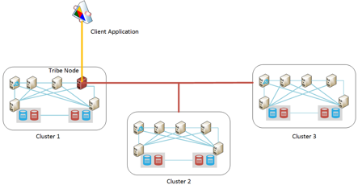

<properties
   pageTitle="Azure 上執行 Elasticsearch |Microsoft Azure"
   description="如何安裝、 設定和 Azure 上執行 Elasticsearch。"
   services=""
   documentationCenter="na"
   authors="dragon119"
   manager="bennage"
   editor=""
   tags=""/>

<tags
   ms.service="guidance"
   ms.devlang="na"
   ms.topic="article"
   ms.tgt_pltfrm="na"
   ms.workload="na"
   ms.date="09/22/2016"
   ms.author="masashin"/>

# <a name="running-elasticsearch-on-azure"></a>Azure 上執行 Elasticsearch

[AZURE.INCLUDE [pnp-header](../../includes/guidance-pnp-header-include.md)]

本文是[一系列的一部分](guidance-elasticsearch.md)。 

## <a name="overview"></a>概觀

這份文件的 Elasticsearch 一般的結構的簡略介紹，然後再說明 [可以如何實作使用 Azure Elasticsearch 叢集。 碰部署 Elasticsearch 叢集，集中的各種功能的效能和管理需求的系統，，並考量您的需求應該如何驅動 [設定] 及 [拓撲所選取的最佳作法。

> [AZURE.NOTE] 本指南假設[Elasticsearch][]基本的熟悉。

## <a name="the-structure-of-elasticsearch"></a>Elasticsearch 的結構 

Elasticsearch 是高度作為搜尋引擎最佳化的文件資料庫。 文件會序列化 JSON 格式。 資料會保留在 [使用[Apache Lucene][]，雖然檢視區隔詳細資料，並不需要使用 Elasticsearch，瞭解 Lucene 實作的索引。

### <a name="clusters-nodes-indexes-and-shards"></a>叢集、 節點、 索引和擊碎

Elasticsearch 實作使用 sharding 跨多個節點，並提供高可用性複寫散發資料的直的架構。 文件會儲存在索引。 使用者可以指定哪些文件中的變數用來識別內索引，或是系統可以產生索引鍵的欄位和值自動。 索引用來實際組織文件，而是主要表示尋找文件。 

索引包含擊碎一組。 文件是平均分佈擊碎使用雜湊機制根據索引鍵值和擊碎索引中的數字。 

可以複寫索引。 在此情況下會複製索引中的每個晶怪。 確保每個原始晶怪 Elasticsearch 的索引 （又稱為 「 主要晶怪 」） 和其複本一律位於不同的節點。 當新增或修改文件時，所有撰寫會在主要晶怪第一個，然後在每一個複本上執行的操作。 

下圖顯示 Elasticsearch 叢集包含三個節點的重要層面。 已建立的每個晶怪 （在所有的六個擊碎） 的兩個複本的兩個主要擊碎組成索引。


*簡單的 Elasticsearch 叢集，其中包含兩個主要節點和兩組複本*

這個叢集，主要晶怪 1 和 2 的主要晶怪位於協助平衡負載在它們之間的不同節點。 同樣地分佈的複本。 如果單一節點失敗，請剩餘的節點會有足夠的資訊，若要讓系統繼續運作。 如有必要，Elasticsearch 將升級成為主要晶怪，如果無法使用對應的主要晶怪複本晶怪。

### <a name="node-roles"></a>節點角色

Elasticsearch 叢集節點可以執行下列角色︰

- **資料節點**可以保留包含資料索引的一個或多個擊碎。

- 不保留索引資料，但的**用戶端節點**處理所做的用戶端應用程式，以適當的資料節點傳入的邀請。
 
- **主版節點**的不持有索引資料但的執行叢集管理作業，例如維護及發佈叢集周圍的傳遞資訊 （清單的節點包含哪些擊碎），決定哪些節點，可，為節點會顯示，而且會消失，重新放置擊碎和節點失敗後協調復原。 多個節點可以設定為 [母片，但其實會選擇僅有一個執行主要功能。 如果此節點失敗，另一個選舉生效並其中一個其他合格母片的節點會選擇接手。

> [AZURE.NOTE]選擇的主版節點是息息相關叢集的關鍵。 其他節點偵測 （ping) 定期以確保它仍可使用。 選擇的主版節點也做為資料節點，有這些 ping 回應的節點變成忙碌的機率和會失敗。 在此情況下，母片會視為失敗，其中一個其他母片節點其位置中選擇。 

 下圖顯示包含混合的專用的母片與用戶端，Elasticsearch 叢集中的資料節點的拓撲。


*顯示不同類型的節點 Elasticsearch 叢集*

### <a name="costs-and-benefits-of-using-client-nodes"></a>成本及使用用戶端節點的優點

當應用程式提交到 Elasticsearch 叢集查詢時，應用程式所連接的節點負責導向查詢程序。 節點轉寄邀請的每個資料節點，並會收集的結果，傳回應用程式的累積的資訊。 如果查詢包含彙總及其他計算，應用程式所連接的節點會執行必要作業後從每個其他節點擷取資料。 此散佈/收集程序可以使用大量處理和記憶體資源。

使用用戶端專用的節點執行這些工作，可讓資料節點，將焦點放在 [管理和儲存資料。 結果是涉及複雜的查詢和彙總的許多情況下可以因使用專用的用戶端節點。 不過，使用用戶端專用的節點的影響可能會而定您的案例、 工作量和叢集大小。 

> [AZURE.NOTE] 如需詳細資訊，微調程序請[調整資料彙總和 Azure 上 Elasticsearch 的查詢效能][]。

### <a name="connecting-to-a-cluster"></a>連線到叢集

Elasticsearch 公開一系列的其餘部分的 Api 建立用戶端應用程式與叢集傳送邀請。 如果您開發應用程式使用.NET Framework，兩種較高的層級 Api 可 – [Elasticsearch.Net 及巢狀][]。

如果您要建立使用 Java 的用戶端應用程式，您可以使用[節點用戶端 API][] ，以動態方式建立用戶端節點，並將其新增至叢集。 如果您的系統使用較小的數字的存留連線，好方便您，以動態方式建立用戶端節點。 使用節點 API 建立的用戶端節點都提供與叢集路由主節點對應 （其中節點包含哪些擊碎詳細資料）。 這項資訊可讓 Java 應用程式，直接連接到適當的節點編製索引作業或查詢資料，以減少使用其他 Api 時可能需要的躍點的數目。

這種方法的成本會將叢集註冊用戶端節點的成本。 如果大量的用戶端節點，顯示，快速消失維護及散發叢集路由對應的影響可能相當重要。

下圖顯示使用負載平衡器將要求路由至一組用戶端節點，雖然可以使用相同的策略，直接連接到資料節點如果不會使用用戶端節點的設定。


*連線到 Elasticsearch 叢集透過 Azure 負載平衡器的用戶端應用程式執行個體*

> [AZURE.NOTE]您可以使用[Azure 負載平衡器 」][]來公開公用網際網路叢集，或如果用戶端應用程式和叢集當中完全相同的私人虛擬網路 (VNet)，您可以使用[內部負載平衡器][]。

### <a name="node-discovery"></a>節點探索

Elasticsearch 根據對等通訊，因此探索其他節點叢集節點生命週期中的重要部分。 節點探索可讓叢集，依序可讓叢集無障礙延展動態加入的新資料節點。 此外，如果資料節點無法回應來自其他節點通訊要求，主版節點可以決定資料節點失敗，並執行必要的步驟，以重新配置它所儲存的其他操作資料節點擊碎。

Elasticsearch 節點探索會處理使用探索模組。 探索模組是可切換使用不同的探索機制外掛程式。 預設探索模組 ([Zen][]) 會發出 ping 要求，若要在相同的網路上尋找其他節點的節點。 如果其他節點回應時，他們家常交換資訊。 然後主節點可以發佈至新的節點擊碎 （如果有資料節點），並重新平衡叢集。 Zen 探索模組也會處理的主版選舉程序和偵測節點失敗的通訊協定。

此外，如果您執行的 Azure 虛擬機器 (Vm) 為 Elasticsearch 節點，多點傳送的訊息不支援。 基於，您應該設定 Zen 探索使用單訊息，並提供正確的連絡人節點 elasticsearch.yml 設定檔中的清單。

如果您要在 Azure 虛擬網路 Elasticsearch 叢集，您可以指定私人 DHCP 指派 IP 處理，提供給每個叢集 VM 應保持配置 （靜態）。 您可以設定 Zen 探索單訊息使用這些靜態 IP 位址。 如果您使用的 Vm 與動態 IP 位址，請記住，如果 VM 停駐點，並重新啟動它可以配置的新的 IP 位址進行探索更加困難。 若要處理這種情況下，您可以針對[Azure 雲端外掛程式][]交換 Zen 探索模組。 此外掛程式使用 Azure API 實作探索機制，也就根據 Azure 訂閱資訊。

> [AZURE.NOTE]Azure 雲端外掛程式的目前版本會要求您安裝 Azure 訂閱管理憑證 Java 採用 Elasticsearch 節點，並提供的位置和認證以存取採用 elasticsearch.yml 檔案中。 此檔案保留純文字，因此很重要，您確保只有此檔案，以執行 Elasticsearch 服務的帳戶。 
> 
> 此外，此方法可能無法與 Azure 資源管理員部署相容。 因此，建議您使用的主版節點的靜態 IP 位址，並使用這些節點實作 Zen 探索單叢集訊息。 在下列設定中 （取自 elasticsearch.yml 檔案的範例資料節點），主機 IP 位址參照叢集主節點︰

```yaml
discovery.zen.ping.multicast.enabled: false  
discovery.zen.ping.unicast.hosts: ["10.0.0.10","10.0.0.11","10.0.0.12"]
```

## <a name="general-system-guidelines"></a>系統的一般指導方針

在各種不同的電腦，範圍從單一膝上型電腦到叢集的高階伺服器上執行 Elasticsearch。 不過，而言記憶體，計算 power，且快速磁碟的更多資源可提供更佳的效能。 下節概述執行 Elasticsearch 的基本硬體與軟體需求。

### <a name="memory-requirements"></a>記憶體需求 

Elasticsearch 嘗試儲存記憶體中資料的速度。 生產伺服器裝載的節點典型的企業或上 Azure 中等大小商業部署應有 14 GB 和 28 GB 的 RAM （D3 或 D4 Vm） 之間。 **跨多個節點，而非建立節點的更多記憶體負載分散**（實驗有顯示較大的節點使用更多記憶體可能會導致失敗的擴充的復原時間）。不過，雖然建立大量的小型節點叢集可以增加可用性和處理量，它也提報精力管理及維護這類系統。

**配置 50%的 Elasticsearch 堆積在伺服器上可用的記憶體**。 如果您執行 Elasticsearch 之前，先使用 Linux 設定 ES_HEAP_SIZE 環境變數。 或者，如果您使用的 Windows 或 Linux，您可以指定在記憶體大小`Xmx`和`Xms`參數，當您啟動 Elasticseach。 將兩個參數設定為相同的值，以避免調整大小的堆積在執行階段 Java 虛擬機器 (JVM)。 不過，**沒有配置超過 30 GB**。 使用的作業系統檔案快取剩餘的記憶體。

> [AZURE.NOTE]Elasticsearch 利用 Lucene 文件庫中建立及管理索引。 Lucene 結構使用磁碟的格式，並快取檔案系統快取中的這些結構會大幅增強效能。

請注意，在 64 位元的電腦上 Java 的最大的最佳堆積大小上方 30 GB。 上述 Java 切換成使用延伸的機制參考堆積上的之物件的大小，其中會增加每個物件的記憶體需求，並減少效能。 

如果堆積大小超過 30 GB，也可能最佳化子執行預設 Java 回收 （同時標記及整理）。 不目前建議切換至不同的回收，為 Elasticsearch 和 Lucene 只測試針對預設值。

不 overcommit 記憶體為磁碟交換主記憶體會嚴重影響效能。 如果可以的話，請停用完全交換 （取決於作業系統的詳細資料）。 如果這不是可能然後啟用*mlockall*中的設定 Elasticsearch 設定檔案 (elasticsearch.yml)，如下所示︰

```yaml
bootstrap.mlockall: true
```

此設定的設定會使其記憶體鎖定 JVM 並防止作業系統交換出來。

### <a name="disk-and-file-system-requirements"></a>磁碟與檔案系統需求

使用儲存擊碎進階版儲存備份資料磁碟。 如要保留的最大預期您擊碎中的資料量，雖然可以稍後新增進一步磁碟，應該要調整大小的磁碟。 您可以在多個磁碟節點擴充晶怪。

> [AZURE.NOTE]Elasticsearch 壓縮儲存欄位的資料使用 LZ4 演算法，及 Elasticsearch 2.0 這時候開始，您可以變更壓縮類型。 您可以切換壓縮演算法來結實為*郵遞區號*和*gzip*公用程式所使用。 這個壓縮技巧可以將更多資源，但您應該考慮用於封存記錄資料。 這種方法可以協助降低索引的大小。

您不需要叢集內所有節點都有相同的磁碟版面配置與容量。 不過，很大的磁碟容量比較叢集其他節點的節點會讓更多資料，且需要提高的處理 power 處理此資料。 因此節點可能會變得 「 快速鍵 」 相較於其他節點，並，因此會影響效能。

如果可以的話，請使用 RAID 0 （等量）。 實作不一致性致歉和鏡像其他形式是 RAID 的不需要為 Elasticsearch 提供自己高 availablility 解決方案在表單中的複本。

> [AZURE.NOTE]之前 Elasticsearch 2.0.0，您也可以指定多個目錄*path.data*設定的設定，以實作軟體層級的等量。 在 Elasticsearch 2.0.0，不再支援這種等量。 不過，不同擊碎可能配置到不同的路徑，但所有單一晶怪中的檔案會寫入相同的路徑。 如果您需要等量，您應該等量磁碟區作業系統或硬體層級的資料。 

若要最大化儲存處理量，每個**VM 必須有專用的進階版儲存帳戶**。

Lucene 文件庫可以使用大量的檔案來儲存索引資料，並 Elasticsearch 可開啟大量的溝通節點之間與客戶的通訊端。 請確定作業系統已設定支援足夠數量的開啟檔案 （最多 64000 若有足夠的記憶體) 的描述。 請注意許多 Linux 散佈的預設設定限制的數目為 1024，開啟檔案描述是得太小。

Elasticsearch 使用對應的記憶體 (mmap) I/O 與 Java 新 I/O (NIO) 的組合，來最佳化同步存取資料檔案和索引。 如果您使用的 Linux，您應該設定作業系統，以確保有足夠的虛擬記憶體用於 256 K 記憶體對應區域的空間。

> [AZURE.NOTE]許多 Linux 散佈預設值，將資料寫入磁碟排列時使用完全展覽佇列 (CFQ) 排程器。 此排程器不適合 SSDs。 請考慮重新設定使用 NOOP 排程器或期限排程器，兩者都是更有效率 SSDs 的作業系統。

### <a name="cpu-requirements"></a>CPU 需求

Azure Vm 中可以使用各種不同的 CPU 設定支援 1 到 32 核心之間。 資料節點，絕佳起點的標準 DS 數列 VM，然後選取 [DS3 （4 個核心） 或 D4 （8 個核心） sku 皆可。 DS3 也會提供 14 GB 的 RAM，而 DS4 包含 28 GB。 

GS-數列 （適用於進階版儲存區） 和 G-數列 （標準的儲存空間） 使用 Xeon E5 V3 處理器可能適合大量計算常用功能，例如大型的彙總的工作量。 最新的資訊，請造訪[虛擬機器的大小][]。

### <a name="network-requirements"></a>網路需求

Elasticsearch 需要介於 1 到 10Gbps，根據的大小和適用的實作叢集的網路頻寬。 更多節點會新增至叢集，Elasticsearch 移轉擊碎節點之間。 Elasticsearch 假設所有節點之間的通訊時間約略並不會考慮擊碎保留這些節點的相對位置。 此外，複寫造成大量的網路 I/O 擊碎之間。 因此，**避免建立叢集在不同區域中的節點**。

### <a name="software-requirements"></a>軟體需求

在 Windows 或 Linux 上，您可以執行 Elasticsearch。 Elasticsearch 服務會部署為 Java jar 文件庫，然後在 Elasticsearch 套件中包含的其他 Java 文件庫中有相依性。 您必須安裝 Java 7 （更新 55 或更新版本） 或 Java 8 （更新 20 或更新版本） 來執行 Elasticsearch JVM。

> [AZURE.NOTE]非*Xmx*和*Xms*記憶體參數 （指定為命令列選項 Elasticsearch 引擎 – 請參閱[記憶體需求][]） 進行修改預設 JVM 設定的設定。 已設計 Elasticsearch 使用預設值。變更可能會導致 Elasticsearch 成為 detuned 和效能不佳。

### <a name="deploying-elasticsearch-on-azure"></a>部署上 Azure Elasticsearch

雖然您不難部署 Elasticsearch 一個執行個體，建立的節點並上安裝和設定 Elasticsearch 每一個數字是耗時及出錯程序。 如果您考慮 Azure Vm 上執行 Elasticsearch，有三個選項，以協助降低錯誤的機會。

- 使用 Azure 資源管理員[範本](https://azure.microsoft.com/marketplace/partners/elastic/elasticsearchelasticsearch/)中的 Azure marketplace。 此範本建立彈性。 其可讓您新增商業的增強功能，例如盾、 Marvel、 監看員，依此類推。

- 若要建立叢集使用 Azure 快速入門[範本](https://github.com/Azure/azure-quickstart-templates/tree/master/elasticsearch)。 此範本可建立 Windows Server 2012 或 Ubuntu Linux 14.0.4 叢集。 其可讓您使用實驗的功能，例如 Azure 檔案儲存空間。 [參考資料和測試此文件中的工作會使用此範本。

- 使用指令碼可自動化或自動執行。 可以建立並部署 Elasticsearch 叢集的指令碼並用於[GitHub 存放庫][elasticsearch-scripts]

## <a name="cluster-and-node-sizing-and-scalability"></a>叢集和節點縮放與延展性 

Elasticsearch 可讓部署拓撲，設計支援不同的需求和層級的小數位數的數字。 本節將告訴您一些常見的拓撲，並說明實作叢集根據這些拓撲考量。

### <a name="elasticsearch-topologies"></a>Elasticsearch 拓撲

下圖說明開始設計 Azure Elasticsearch 拓撲︰


*建議開始建立 Azure Elasticsearch 叢集點*

此拓撲包含六個資料節點與三個用戶端節點並三個主要的節點 （只有一個就是主節點其他兩個可供選舉應該選擇母片會失敗。）每個節點被當作個別 VM。 Azure web 應用程式會導向至透過負載平衡器的用戶端節點。 

在此範例中，所有的節點和 web 應用程式位於相同的虛擬網路的有效地將其隔離來自外面。 如果叢集需要使用外部 （可能是屬於混合式解決方案整合內部部署的用戶端），然後您可以使用 Azure 負載平衡器提供的公用 IP 位址，，但您將需要採取額外的安全性預防措施避免他人未經授權的存取叢集。 

選擇性 「 跳方塊 」 是只適用於管理員的 VM。 此 VM 有虛擬網路，但也對網路連線至允許系統管理員登入 （應該使用憑證或強式密碼保護此登入） 外部網路向外的網路連線。 系統管理員可以登入跳] 方塊，然後從該處直接連接到任何叢集節點。 

替代方法包括使用網站-VPN 組織之間虛擬網路，或使用[ExpressRoute][]電路連線至虛擬網路。 這些機制允許叢集的管理權限，而不公開公用網際網路叢集。

若要維持 VM 可用性，資料節點會分組為相同的 Azure 可用性設定。 同樣地，用戶端節點會保留在另一個可用的設定，並且第三個可用性集中儲存母片的節點。

此拓撲是類型的很容易擴充只要新增更多節點適當，確保他們設定同名的叢集 elasticsearch.yml 檔案中。 用戶端節點也需要新增至 Azure 負載平衡器的後端資料庫。

**地理尋找叢集**

**這會影響效能的節點間通訊時，不散佈叢集各區域的節點**（請參閱[網路需求][]）。 關閉不同區域中的使用者的地理尋找資料需要建立多個叢集。 在此情況下，您需要考慮如何 （或甚至是否） 同步處理叢集。 可能的解決方案包括︰

[部族節點][]類似的用戶端節點，但它可以參與多個 Elasticsearch 叢集，並為一大叢集檢視。 資料仍在本機管理 （更新不會傳送跨叢集界限） 每個叢集，但會顯示的所有資料。 查詢部族節點，建立及管理文件中任何叢集。 

主要的限制是部族節點無法用來建立新的索引，並在所有叢集，索引名稱必須是唯一的。 因此很重要，考慮設計用來從部族節點存取叢集時如何命名的索引。

使用此機制，每個叢集可包含資料的最有可能透過本機的用戶端應用程式，但這些用戶端仍然可以存取及修改遠端資料，但仍會有可能擴充延遲。 下圖顯示此拓撲的範例。 醒目提示部族中的節點叢集 1;雖然這不會顯示在圖表上，其他的叢集可能也會有部族節點︰



*存取多個叢集透過部族節點用戶端應用程式*

在此範例中，用戶端應用程式連線至部族節點叢集 1 （共同位於相同的區域），但這個節點設定，才能存取叢集 2 和叢集 3，可能會位於不同區域。 用戶端應用程式可以傳送邀請的擷取或修改叢集的所有資料。

> [AZURE.NOTE]部族節點需要連線至叢集，可能會展示的安全性考量的多點的探索。 請參閱更多詳細資料區段[節點探索][]。

- 叢集之間實作地理複寫。 在每個叢集所做的變更傳播這種方法，在靠近處即時叢集位於其他資料中心。 協力廠商的增益集可供 Elasticsearch 支援這項功能，例如[PubNub 變更外掛程式][]。

- 使用[Elasticsearch 快照和還原模組][]。 如果資料是非常緩慢的而且只能由單一叢集修改，您可以考慮使用定期資料的複本並還原中 （如果您已安裝[Azure 雲端外掛程式][]，可以在 Azure Blob 儲存體中儲存快照） 其他叢集這些快照的快照。 不過，此方案不適用於快速變更資料，或如果可以在一個以上的叢集變更資料。

**小型拓撲**

大型拓撲中所包含的專用的母片]、 [用戶端] 和 [資料節點叢集可能不適用的每一種情況。 如果您要建立的小型生產或開發系統，請考慮 3 節點叢集下圖所示。

用戶端應用程式直接連接到叢集任何可用的資料節點。 叢集包含三個擊碎標示為 P1 第 3 頁 （若要允許等比級數） 再加上標示為 R1 R3 的複本。 使用三個節點，可讓 Elasticsearch 散佈擊碎和複本，以便如果節點失敗的任何單一會遺失任何資料。


*3-節點叢集與 3 擊碎複本*

如果您在獨立的電腦上執行開發安裝您可以設定叢集與單一節點，做為母片、 用戶端，以及資料的儲存空間。 或者，您可以開始做為叢集在同一部電腦上執行啟動 Elasticsearch 多個執行個體的多個節點。 下圖顯示的範例。


*在同一部電腦上執行多個 Elasticsearch 節點開發設定*

請注意，這兩個這些獨立設定所建議生產環境時，可能造成競爭，除非您開發的電腦有大量的記憶體和數種快速磁碟。 此外，它們不提供任何可用性保證。 如果電腦失敗，請所有節點都都會遺失。

### <a name="scaling-a-cluster-and-data-nodes"></a>縮放比例叢集和資料節點

Elasticsearch 可以在兩個維度縮放︰ 垂直 （使用比較大，功能更強大的電腦） 和水平 （用的電腦上的載入）。

**垂直調整 Elasticsearch 資料節點**

如果您使用 Azure Vm 主控 Elasticsearch 叢集，每個節點可以對應 VM。 垂直性的節點的限制主要由 VM 的 SKU，並整體限制套用至個別儲存帳戶和 Azure 訂閱。 

[Azure 訂閱及服務限制，配額和限制](../azure-subscription-service-limits.md)頁面說明這些限制的詳細資料，但下列清單中的項目建立 Elasticsearch 叢集而言，就是最相關。 

- 每個儲存帳戶會 20000 IOPS 限制。 每個 VM 叢集應該運用專用 （最好是付費） 儲存的帳戶。

- 虛擬網路中的資料節點的數字。 如果您不使用 Azure 資源管理員，限制為 2048年是每個虛擬網路 VM 執行個體。 雖然這應該證明足夠的許多情況下，如果您有使用千分位節點的設定，很大，這可能是在限制範圍。

- 每個訂閱，每個地區儲存帳戶的數目。 您可以建立最多 100 個每個 Azure 訂閱的儲存空間帳戶中每個區域。 儲存帳戶用來存放虛擬磁碟，且每個儲存帳戶的空間 500 TB 的限制。

- 每個訂閱的核心數目。 預設的限制是 20 核心每個訂閱，但這可以增加最多 10000 核心要求增加的限制，透過支援票證。 

- 每個虛擬記憶體大小的記憶體量。 較小的大小 Vm 有限金額可用的記憶體 （有 3.5 GB 的 D1 機器和 D2 機器有 7 GB）。 這些機器可能不適合需要 Elasticsearch 快取的大量資料，以獲得最佳效能 （彙總資料，或資料 ingestion 期間分析大量的文件，例如） 案例。

- 每個虛擬記憶體大小的磁碟的數目上限。 這項限制可以限制的大小和效能叢集。 減少磁碟表示可保留較少的資料，並可以由適用於等量減少磁碟降低效能。

- 數更新網域/錯誤每可用性設定的網域。 如果您建立 Vm 使用 Azure 資源管理員，每個可用性設定可以配置，最多 3 故障網域和 20 更新的網域。 這項限制會影響的大型叢集進行經常積存更新的可靠度。

此外，您可能不應該考慮使用 Vm 超過 64 gb 的記憶體。 [記憶體需求][]的一節所述，您不應該配置 JVM 超過 30 GB 的 RAM 在每個 VM，並允許作業系統利用供 I/O 緩衝剩餘的記憶體。

使用記住這些限制，您應該一律分散虛擬磁碟的叢集 Vm 以減少的 I/O 節流機會儲存帳戶。 集中很大，您可能需要重新設計邏輯基礎結構，並將其分割成個別功能的磁碟分割。 例如，您可能需要分割叢集訂閱，雖然此程序可能會造成進一步的複雜性因為需要虛擬網路連線。

**水平縮放 Elasticsearch 叢集**

在內部 Elasticsearch，內的水平延展性限制取決於擊碎已定義之每個索引的數目。 一開始，許多擊碎可以配置到相同的節點叢集，但隨著資料量增加額外可以新增節點並擊碎可以分散到這些的節點。 理論上的節點數目到達擊碎數時，才會系統停止不按比例縮放水平。

使用垂直縮放比例，有思考實作水平的縮放比例，包括時，您應該考量的一些問題︰

- 您可以在 Azure 虛擬網路連線的 Vm 數目上限。 這可能會限制很大叢集的水平延展性。 您可以建立跨多個規避這項限制，但這種方法的虛擬網路可能會導致精簡效能的每個節點的位置不足與其對等的節點叢集。

- 每個虛擬記憶體大小的磁碟數目。 不同系列和 sku 皆可支援不同的數字的連接的磁碟。
此外，您可以也請考慮使用暫時 VM 隨附的儲存空間提供一段有限的快速資料的儲存空間，雖然恢復及復原您應該考慮的含意 (請參閱[設定可靠度及復原上 Azure Elasticsearch] [elasticsearch-resilience-recovery]如需詳細資訊)。 D 系列，DS 數列、 Dv2 系列，以及 GS-系列 Vm 使用 SSDs 暫時儲存空間。

您可以考慮使用[虛擬機器縮放比例設定][vmss]來啟動和停止 Vm 為要求即表示。 不過，這種方式可能無法適用於 Elasticsearch 叢集，原因如下︰

- 這個方法最適合用於無 Vm。 您新增或移除節點從 Elasticsearch 叢集，每次擊碎會重新配置以平衡載入，並此程序可以產生的網路流量和磁碟 I/O 相當區會嚴重影響資料 ingestion 費率。 您必須評估此開銷是否值得其他處理程序，以動態方式啟動 [更多 Vm 可用的記憶體資源的優點。

- VM 啟動不會發生立即，並可能需要幾分鐘，才能才可供其他 Vm 或它們關閉。 縮放比例，如此一來只應該用來處理持續視需要變更。

- 縮放之後時，您實際上需要考慮縮放比例回？ 移除 Elasticsearch 叢集 VM 可要求 Elasticsearch 復原擊碎和位於該 VM 的複本，並重新其建立的一或多個剩餘節點的資源大量程序。 一次移除多個 Vm 可能會危害叢集，讓復原難以的完整性。 此外，許多 Elasticsearch 實作放大一段時間，但資料的性質，它不容易縮小音量。 可以手動刪除文件及文件也可以設定 ttl （存留時間） 的他們過期，會移除，但在大部分情況下可能先前配置的空間會快速重複使用新的或修改過的文件。 移除或變更文件時，可能會發生片段，在索引中的，在此情況下，您可以使用 Elasticsearch HTTP[最佳化][]API (Elasticsearch 2.0.0 及較舊版本) 或[強制合併][]API (Elasticsearch 2.1.0 及更新版本) 來執行重組。

### <a name="determining-the-number-of-shards-for-an-index"></a>決定擊碎索引的數目

集中的節點數目可能隨時間，但擊碎索引中的數字為固定一旦建立索引。 若要新增或移除擊碎需要重新索引資料 – 建立新的索引所需的擊碎數目，並從舊索引將資料複製到新的 （您可以使用別名閥的資料具有已重新建立索引的使用者-請參閱[調整資料彙總和 Azure 上 Elasticsearch 的查詢效能][]更多詳細資料） 的程序。
因此，請務必來判斷您的可能需要開始前事先叢集中建立的第一個索引的擊碎數目。 您可以執行下列步驟，以建立這個數字︰

- 建立單一節點叢集使用相同的硬體設定您想要在生產環境中部署。

- 建立索引符合您打算使用生產環境中的結構。 單一晶怪並沒有複本，請讓此索引。

- 新增特定資料量的實際生產索引。

- 執行一般查詢彙總，與其他工作負載，索引，並測量的處理量及回應的時間。

- 如果處理量] 和 [回應時間在可接受的限制，然後重複步驟 3 （新增更多資料） 的程序。

- 當您出現已達到容量晶怪 （回應時間和處理量開始成為無法接受） 時，請記下的文件的音量。

- 從單一晶怪容量推斷預期的計算所需的擊碎 （您應該包含錯誤的某些誤差這些計算外插法不精確的科學） 數目生產環境中的文件數。

> [AZURE.NOTE]請記住，每個晶怪被當作會耗費記憶體、 CPU 能力和檔案控點 Lucene 索引。 更多擊碎您有，您必須使用這些資源的其他。

此外，建立更多擊碎可能會增加延展性 （根據您的工作量及分析藍本） 和可以提升資料 ingestion 處理量，但它可能會降低多個查詢的效率。 根據預設，查詢會詢問的索引 （您可以使用[自訂路由][]修改這個問題，如果您知道您需要的資料位於哪個擊碎） 使用每個晶怪。 

下列程序只能產生擊碎，數目的估計值，可能不知道預期生產環境中的文件的音量。 在此情況下，您應該判斷 （如上所述） 初始音量和預測的成長率。 建立可處理資料的成長期間，直到您願意資料庫重新建立索引的擊碎中適當的數目。 

用於分析藍本，例如事件管理和記錄其他策略包括使用循環索引。
建立新的索引資料 ingested 每天透過及存取此索引的別名每天切換為指向最新的索引。 這種方法可讓您更輕鬆地年齡出舊的資料 （您可以刪除索引包含已不再需要的資訊），並保持可管理的資料量。

請記住的節點數目可能沒有符合擊碎數目。 例如，如果您建立 50 擊碎，您可以分散到這些 10 節點一開始，然後再新增 [更多節點的工作會增加音量為縮放出系統。 避免建立特別大量的擊碎的一小部分的節點 （1000年擊碎分散 2 節點，例如）。 雖然系統可能會理論縮放到 1000年節點，此設定，但執行 500 擊碎單一節點風險，還可以重創節點的效能。

> [AZURE.NOTE]系統的資料 ingestion 大量，請考慮使用擊碎質數。 Elasticsearch 用擊碎產生更多甚至散佈在本例中的文件傳閱的預設演算法。

### <a name="security"></a>安全性

根據預設，Elasticsearch 實作最小的安全性，且不提供任何平均數的驗證和授權。 這些方面需要設定基礎的作業系統、 網路和使用增益集和協力廠商公用程式。 範例包括[盾][]，以及[搜尋保護][]。

> [AZURE.NOTE]盾是外掛程式，提供彈性的使用者驗證、 資料加密、 角色型存取控制、 IP 篩選及稽核。 可能必須設定實作進一步安全性量值，例如磁碟加密基礎的作業系統。

在生產系統中，您應該考慮的方式︰

- 避免他人未經授權的存取叢集。
- 找出並驗證的使用者。
- 授權可執行的作業，已驗證的使用者。
- 保護叢集惡意或有害的作業。
- 防止未經授權存取資料。
- （如果適用），請符合法規需求商業資料的安全性。

### <a name="securing-access-to-the-cluster"></a>保護安全叢集存取

Elasticsearch 是網路服務。 Elasticsearch 叢集節點接聽內送的用戶端要求使用 HTTP]，然後彼此使用 TCP 頻道。 您應該採取步驟以防止未經授權的用戶端或服務可透過 HTTP 和 TCP 路徑傳送邀請。 請考慮下列項目。 

- 定義網路安全性群組，若要限制的輸入與輸出網路流量的虛擬網路或 VM 特定連接埠。

- 變更用戶端 web access (9200) 和程式的網路存取 (9300) 使用的預設連接埠。 您可以使用防火牆來防止惡意網際網路流量的每個節點。

- 根據的位置和用戶端連線，將 [叢集網際網路沒有直接存取私人子網路上。 如果叢集必須公開子網路外，路由傳送所有的要求，透過堡壘伺服器或 proxy 充分強化保護叢集。

如果您必須提供直接存取節點、 使用[nginx](http://nginx.org/en/) proxy 伺服器設定及 HTTPS 驗證。

> [AZURE.NOTE]使用 proxy 伺服器，例如 nginx，您也可以限制存取的功能。 例如，您可以設定只允許要求 nginx\_搜尋端點，如果您需要執行其他操作時，防止用戶端。

如果您需要更完整的網路存取安全性，請使用盾或搜尋防衛隊外掛程式。

### <a name="identifying-and-authenticating-users"></a>識別並驗證使用者

所有叢集所做的用戶端的要求都應該驗證。 此外，您應該防止未經授權的節點加入叢集，這些可以提供後門系統略過驗證。

Elasticsearch 外掛程式可供使用，可以執行不同類型的 [驗證]，包括︰

- **HTTP 基本驗證**。 在邀請中每個包含使用者名稱和密碼。 使用 SSL/TLS 」 或 「 對等的保護層級，必須經過加密所有要求。

- **LDAP 與 Active Directory 整合**。 這個方法需要用戶端，會指派有 LDAP 或 AD] 群組中的角色。

- **原生驗證**。 使用 Elasticsearch 叢集本身中定義的身分識別。

- **進行驗證**。 您可以使用 [叢集內的 TLS 驗證來驗證所有節點。

- **IP 篩選**。 使用篩選，以防止未經授權的子網路從用戶端連線，並且也會防止來自加入叢集這些子節點的 IP。

### <a name="authorizing-client-requests"></a>授權用戶端要求

授權取決於 Elasticsearch 外掛程式用來提供這項服務。 比方說，通常是提供基本驗證的外掛程式提供功能，定義的層級驗證]，使用 LDAP 或 AD 外掛程式會通常關聯角色] 中的用戶端與然後指派這些角色的存取權限。 在使用任何增益集時，您應該考慮下列幾點︰

- 您是否要限制用戶端可以執行的作業？ 例如，用戶端應該可以監視狀態叢集，或建立及刪除索引嗎？

- 用戶端應特定索引限制？ 這是 multitenant 非常有用︰ 每個樣式輔助線。 沒有連字號 >> 其中租用戶指定自己一組特定的索引，而這些索引就無法存取到其他租用戶的情況。

- 應由用戶端無法讀取和寫入的索引的資料？ 用戶端可能可以執行的擷取使用索引的資料，但必須無法新增或刪除該索引，資料，例如搜尋。

目前，大部分的安全性外掛程式範圍運算叢集或索引的層級，而非索引中的文件的子集。 這是基於效率。 您可以輕鬆因此未限制特定的文件中的單一索引的要求。 如果您需要的這個層級，將文件儲存在個別的索引，並使用 [在一起的別名該群組的索引。 

例如，在人員系統中，如果使用者需要存取所有文件若包含 X 部門員工的相關資訊、 B 使用者需要存取所有文件若包含 Y 部門員工的相關資訊，以及 C 使用者需要存取所有文件若包含兩個部門員工的相關資訊，建立兩個索引 （適用於部門 X 和 Y 部門）及參照兩個索引的別名。 授與使用者的讀取權限的第一個索引，授與使用者 B 讀取權限的第二個索引，並授與使用者 C 透過別名兩個索引的讀取權限。 如需詳細資訊，請參閱[假裝索引，每位使用者使用別名][]。

### <a name="protecting-the-cluster"></a>保護叢集

如果不小心保護，可能不正確地使用受到叢集。 

**停用 Elasticsearch 中的指令碼的動態查詢**查詢時，可能會導致安全性漏洞。 使用原生指令碼，而非查詢指令碼。原生指令碼是以 Java 撰寫及編譯 JAR 檔案到 Elasticsearch 外掛程式。

動態查詢指令碼現在預設為停用;不重新啟動，除非您有很好的理由執行此作業。

**避免公開給使用者的查詢字串搜尋**為此類型的搜尋可讓使用者執行需要大量資源的查詢逐步。 這些搜尋可能會嚴重影響叢集的效能，而且可以呈現系統 DOS 攻擊開啟。 此外，搜尋查詢字串可以公開的潛在私人資訊。

為這些**無法使用大量的記憶體防止作業**可能會導致結果 Elasticsearch 失敗節點的記憶體用完例外狀況。 長時間執行大量資源可以用於實作 DOS 攻擊。 範例包括︰

例如，避免嘗試載入記憶體 （如果指令碼或在這些欄位 facet 排序查詢），很大的欄位的搜尋要求︰

- 同時查詢多個索引的搜尋。

- 擷取大量的欄位的搜尋。 這些搜尋可讓大量所需的欄位資料快取耗盡記憶體。 根據預設，欄位的資料快取是不受限制的大小，不過您可以設定[indices.fielddata.cache.*](https://www.elastic.co/guide/en/elasticsearch/reference/current/modules-fielddata.html)屬性來限制可用的資源 elasticsearch.yml 設定檔中。 您也可以設定以協助防範耗盡記憶體，若要停止個別查詢從 monopolizing 記憶體[要求電路分隔][]的單一欄位的快取的資料的[欄位資料電路分隔][]。 設定參數的成本為提高部分失敗的查詢或逾時的可能性。
 
> [AZURE.NOTE]使用[文件中的值][]，可以儲存到磁碟] 欄位的資料，而不是載入記憶體減少索引的記憶體需求。 這可以協助降低記憶體耗盡節點，但速度減少的機會。

> Elasticsearch 一律假設它有足夠的記憶體來執行其目前的工作量。 如果這不是大小寫，可以損毀 Elasticsearch 服務。 Elasticsearch 提供的端點，傳回資源使用狀況 （HTTP[貓 Api][]） 的相關資訊，您應該謹慎監視這項資訊。

**清除 [進行中的記憶體區段等待的時間太長**。 這可以耗盡記憶體內緩衝空間。
如果有需要，請以減少資料臨界值的 [[設定 translog][]清除到磁碟。

**建立索引大量的中繼資料**。 包含欄位名稱中的大型變化的文件索引，可以使用大量的記憶體。 如需詳細資訊，請參閱[對應分裂][]。
  
長或查詢大量的定義為特定高度案例的。 在另一個通常是一個叢集預期的工作量可能完全不同的設定檔的工作量。 判斷哪些作業無法接受需要嚴重研究及測試您的應用程式。

主動偵測與在造成嚴重產生的損害或資料遺失之前停止惡意活動。
請考慮使用快速偵測異常模式資料的存取及發出警告時，例如使用者的登入要求無法、 非預期的節點加入或離開叢集，或作業的時間比預期更長的安全性監視及通知系統。 工具，可以執行這些工作包括 Elasticearch[監看員][]。

### <a name="protecting-the-data"></a>保護資料

您可以使用 SSL/TLS，保護資料 inflight 但 Elasticsearch 不提供任何內建加密形式的資料儲存在磁碟上的資訊。 請記住，這項資訊會保留在一般磁碟檔案中，任何使用者有權存取這些檔案可能會他們按住，例如，將它們複製到自己叢集的資料。 請考慮下列幾點︰

- 保護 Elasticsearch 保留的資料使用的檔案。 不允許任意讀取或寫入存取權的 Elasticsearch 服務以外的身分識別。

- 加密使用加密檔案系統儲存這些檔案中的資料。

> [AZURE.NOTE]Azure 現在支援 Linux 和 Windows Vm 的磁碟加密。 如需詳細資訊，請參閱[Azure 磁碟加密 for Windows 和 Linux IaaS Vm 預覽][]。

### <a name="meeting-regulatory-requirements"></a>符合法規需求

法規要求，主要考量稽核作業，若要維持歷程記錄的事件，並確保這些隱私權作業可協助避免被監視 （重新顯示） 由外部代理。 特別是，您應該考慮的方式︰

- 追蹤所有要求 (成功或不)，及所有嘗試存取系統。

- 加密叢集以及叢集所執行的節點-通訊所做的用戶端的通訊。 您應該實作 SSL/TLS 的所有叢集通訊。 如果貴組織已有有別於這些可透過 SSL/TLS 的需求，Elasticsearch 也支援隨插即用加密。

- 安全地儲存稽核的所有資料。 稽核資訊的音量可以放大非常快速地並必須強行保護來防止遭到竄改的稽核資訊。

- 安全地保存稽核資料。

### <a name="monitoring"></a>監控

監控很重要，作業系統層級和 Elasticsearch 層級。

您可以執行監視使用作業系統特定工具作業系統層級。 Windows、 包括項目，例如效能監視器適當的效能計數器，雖然 Linux 下，您可以使用工具，例如*vmstat* *iostat*，與*上方*。 監控作業系統層級的重要項目包括 CPU 使用率、 磁碟 I/O 區、 磁碟 I/O 等待時間和網路流量。
微調 Elasticsearch 叢集，Elasticsearch 處理程序的 CPU 使用率應為高、，應該最低磁碟 I/O 等待的時間。

在軟體層級，您應該監控處理量和回應時間的要求與邀請的失敗的詳細資料。 Elasticsearch 提供數種 Api，您可以使用來檢查叢集的不同層面的效能。 兩個最重要的 Api 是*_cluster/健康狀況*與*_nodes/統計資料*。 *_Cluster/狀況*API 可提供叢集，以及提供每個索引的詳細的資訊的整體健康情況的快照，如下列範例所示︰

`GET _cluster/health?level=indices`

使用此 API 產生範例輸出以下所示︰

```json
{
    "cluster_name": "elasticsearch",
    "status": "green",
    "timed_out": false,
    "number_of_nodes": 6,
    "number_of_data_nodes": 3,
    "active_primary_shards": 10,
    "active_shards": 20,
    "relocating_shards": 0,
    "initializing_shards": 0,
    "unassigned_shards": 0,
    "delayed_unassigned_shards": 0,
    "number_of_pending_tasks": 0,
    "number_of_in_flight_fetch": 0,
    "indices": {
        "systwo": {
            "status": "green",
            "number_of_shards": 5,
            "number_of_replicas": 1,
            "active_primary_shards": 5,
            "active_shards": 10,
            "relocating_shards": 0,
            "initializing_shards": 0,
            "unassigned_shards": 0
        },
        "sysfour": {
            "status": "green",
            "number_of_shards": 5,
            "number_of_replicas": 1,
            "active_primary_shards": 5,
            "active_shards": 10,
            "relocating_shards": 0,
            "initializing_shards": 0,
            "unassigned_shards": 0
        }
    }
}
```

這個叢集包含 「 *systwo* *sysfour*的兩個索引。 監控每個索引鍵的統計資料是狀態、 active_shards 及 unassigned_shards。 狀態] 應為綠色 active_shards 數應該反映 number_of_shards 和 number_of_replicas，與 unassigned_shards 應為零。 

如果狀態是 [紅色]，然後索引的組件遺失或已損毀。 如果*active_shards*設定小於*number_of_shards* -（*number_of_replicas* + 1） 和 unassigned_shards 為非零，您可以驗證此。 請注意黃色狀態，表示的索引位於可轉換的狀態，請新增更多的複本或正在重新定位擊碎的結果。 狀態應該時切換到綠色完成轉場效果。 

如果黃色保持段或變更為紅色，您應該看到作業系統層級是否發生任何有效的 I/O 事件 （例如磁碟機或網路失敗）。

\_節點/stats API 發出叢集中每個節點的詳細資訊︰

`GET _nodes/stats`

產生的輸出包含索引 （包括的大小和文件的數字），每個節點的儲存方式的詳細資料所花費執行編製索引作業、 查詢、 搜尋、 合併、 快取、 作業系統及程序資訊，統計 JVM （包括回收集合效能），而且執行緒集區。 如需詳細資訊，請參閱[監控個別的節點][]。

大部分的 Elasticsearch 要求而失敗*EsRejectedExecutionException*錯誤訊息，然後 Elasticsearch 失敗地與工作的方式傳送。 在此情況下，您需要找出導致 Elasticsearch 至落後瓶頸。 請考慮下列項目︰

- 如果瓶頸就是因為資源限制式，例如沒有足夠的記憶體配置給 JVM 造成過多的回收，請考慮配置額外的資源 （在此情況下，設定使用更多記憶體，設定為 50%的可用儲存空間的節點 – 請參閱[記憶體需求][]JVM）。

- 如果叢集有顯示大型 I/O 等待的時間，並使用合併列印統計資料收集索引\_節點 stats API 包含較大的值，則索引是寫入大量。 重新瀏覽各微調編製索引的效能[最佳化資源編製索引作業](guidance-elasticsearch-tuning-data-ingestion-performance.md#optimizing-resources-for-indexing-operations)的點。

- 節流執行資料 ingestion 作業的用戶端應用程式，而且決定對效能的影響。 如果這種方式顯示的重大改良，然後請考慮保留速度或縮放出分配寫入大量索引的載入更多的節點。
如需詳細資訊，請參閱[Azure 上 Elasticsearch 調整資料 ingestion 效能][]。

- 如果查詢，而且花費很長的時間，然後請考慮查詢最佳化的方式，將會指出索引的搜尋統計資料。 請注意，您可以使用報告搜尋統計資料的*query_time_in_millis* ] 和 [ *query_total*值來計算查詢效率; 概略指南方程式*query_time_in_millis* / *query_total*可讓您針對每個查詢平均時間。

### <a name="tools-for-monitoring-elasticsearch"></a>監視 Elasticsearch 工具

各種不同的工具，可執行每日例行監視生產 Elasticsearch 的。 這些工具通常會使用基礎 Elasticsearch Api 收集的資訊，並可以一同觀看比容易的原始資料的方式呈現詳細資料。 常見範例包括[Elasticsearch 不對][]、 [Bigdesk][]、 [Kopf][]及[Marvel][]。

Elasticsearch 不對 Bigdesk，與 Kopf 執行為 Elasticsearch 軟體的外掛程式。 Marvel 的最新版本可以單獨地執行，但需要[Kibana][]提供資料擷取和裝載環境。 使用 Kibana Marvel 的優點是，您可以執行的 Elasticsearch，在不同環境中監視讓您瀏覽 Elasticsearch 可能無法可以監控工具中執行的 Elasticsearch 軟體的問題。 例如，如果 Elasticsearch 重複失敗，或執行速度很慢，執行為 Elasticsearch 外掛程式的工具也會受到影響，進行監控和診斷更加困難。

層級的作業系統，您可以使用的主機服務 Elasticsearch 節點 Vm 擷取效能資料的工具，例如[Azure 作業管理套件][]或[Azure 入口網站的 Azure 診斷][]記錄分析功能。 另一個方法是使用[Logstash][]來擷取效能及資料記錄，將這項資訊儲存在個別的 Elasticsearch 叢集 （不是使用您所使用的相同叢集或您的應用程式），然後使用 Kibana 以視覺化方式呈現資料。 如需詳細資訊，請參閱[Microsoft Azure 診斷與 ELK][]。

### <a name="tools-for-testing-elasticsearch-performance"></a>以進行測試 Elasticsearch 效能的工具

如果您是效能 Elasticsearch 或接受叢集效能測試，可使用其他工具。 若要在開發或測試環境而非生產是這些工具。
經常使用的範例是[Apache JMeter][]。

JMeter 用來執行效能評估及其他文件相關本指南所述的載入測試。 [建立效能測試環境 Elasticsearch Azure 上的][]詳細說明如何 JMeter 已設定和使用。

[Running Elasticsearch on Azure]: guidance-elasticsearch-running-on-azure.md
[調整資料 Ingestion 效能的 Elasticsearch Azure 上]: guidance-elasticsearch-tuning-data-ingestion-performance.md
[建立效能上 Azure Elasticsearch 測試環境]: guidance-elasticsearch-creating-performance-testing-environment.md
[Implementing a JMeter Test Plan for Elasticsearch]: guidance-elasticsearch-implementing-jmeter-test-plan.md
[Deploying a JMeter JUnit Sampler for Testing Elasticsearch Performance]: guidance-elasticsearch-deploying-jmeter-junit-sampler.md
[調整資料彙總和 Azure 上 Elasticsearch 的查詢效能]: guidance-elasticsearch-tuning-data-aggregation-and-query-performance.md
[Configuring Resilience and Recovery on Elasticsearch on Azure]: guidance-elasticsearch-configuring-resilience-and-recovery.md
[Running the Automated Elasticsearch Resiliency Tests]: guidance-elasticsearch-configuring-resilience-and-recovery

[Apache JMeter]: http://jmeter.apache.org/
[Apache Lucene]: https://lucene.apache.org/
[Azure 磁碟加密 for Windows 和 Linux IaaS Vm 預覽]: ../azure-security-disk-encryption.md
[Azure 負載平衡器]: ../load-balancer/load-balancer-overview.md
[ExpressRoute]: ../expressroute/expressroute-introduction.md
[內部負載平衡器]:  ../load-balancer/load-balancer-internal-overview.md
[虛擬機器的大小]: ../virtual-machines/virtual-machines-linux-sizes.md

[記憶體需求]: #memory-requirements
[網路需求]: #network-requirements
[節點探索]: #node-discovery
[Query Tuning]: #query-tuning

[elasticsearch-scripts]: https://github.com/mspnp/azure-guidance/tree/master/scripts/ps
[A Highly Available Cloud Storage Service with Strong Consistency]: http://blogs.msdn.com/b/windowsazurestorage/archive/2011/11/20/windows-azure-storage-a-highly-available-cloud-storage-service-with-strong-consistency.aspx
[Azure 雲端外掛程式]: https://www.elastic.co/blog/azure-cloud-plugin-for-elasticsearch
[Azure 診斷 Azure 入口網站]: https://azure.microsoft.com/blog/windows-azure-virtual-machine-monitoring-with-wad-extension/
[Azure 作業管理套件]: https://www.microsoft.com/server-cloud/operations-management-suite/overview.aspx
[Azure Quickstart Templates]: https://azure.microsoft.com/documentation/templates/
[Bigdesk]: http://bigdesk.org/
[貓 Api]: https://www.elastic.co/guide/en/elasticsearch/reference/1.7/cat.html
[設定 translog]: https://www.elastic.co/guide/en/elasticsearch/reference/current/index-modules-translog.html
[自訂路由]: https://www.elastic.co/guide/en/elasticsearch/reference/current/mapping-routing-field.html
[文件中的值]: https://www.elastic.co/guide/en/elasticsearch/guide/current/doc-values.html
[Elasticsearch]: https://www.elastic.co/products/elasticsearch
[Elasticsearch 標頭]: https://mobz.github.io/elasticsearch-head/
[Elasticsearch.Net 及巢狀]: http://nest.azurewebsites.net/
[elasticsearch-resilience-recovery]: guidance-elasticsearch-configuring-resilience-and-recovery.md
[Elasticsearch 快照和還原模組]: https://www.elastic.co/guide/en/elasticsearch/reference/current/modules-snapshots.html
[假裝每位使用者使用別名索引]: https://www.elastic.co/guide/en/elasticsearch/guide/current/faking-it.html
[欄位資料電路分隔]: https://www.elastic.co/guide/en/elasticsearch/reference/current/circuit-breaker.html#fielddata-circuit-breaker
[強制執行合併列印]: https://www.elastic.co/guide/en/elasticsearch/reference/2.1/indices-forcemerge.html
[gossiping]: https://en.wikipedia.org/wiki/Gossip_protocol
[Kibana]: https://www.elastic.co/downloads/kibana
[Kopf]: https://github.com/lmenezes/elasticsearch-kopf
[Logstash]: https://www.elastic.co/products/logstash
[對應分裂]: https://www.elastic.co/blog/found-crash-elasticsearch#mapping-explosion
[Marvel]: https://www.elastic.co/products/marvel
[Microsoft Azure 診斷與 ELK]: http://aka.ms/AzureDiagnosticsElk
[監控個別節點]: https://www.elastic.co/guide/en/elasticsearch/guide/current/_monitoring_individual_nodes.html#_monitoring_individual_nodes
[nginx]: http://nginx.org/en/
[節點用戶端 API]: https://www.elastic.co/guide/en/elasticsearch/client/java-api/current/client.html
[最佳化]: https://www.elastic.co/guide/en/elasticsearch/reference/1.7/indices-optimize.html
[PubNub 變更外掛程式]: http://www.pubnub.com/blog/quick-start-realtime-geo-replication-for-elasticsearch/
[要求電路分隔]: https://www.elastic.co/guide/en/elasticsearch/reference/current/circuit-breaker.html#request-circuit-breaker
[搜尋防衛隊]: https://github.com/floragunncom/search-guard
[盾]: https://www.elastic.co/products/shield
[Transport Client API]: https://www.elastic.co/guide/en/elasticsearch/client/java-api/current/transport-client.html
[部族節點]: https://www.elastic.co/blog/tribe-node
[vmss]: https://azure.microsoft.com/documentation/services/virtual-machine-scale-sets/
[監看員]: https://www.elastic.co/products/watcher
[Zen]: https://www.elastic.co/guide/en/elasticsearch/reference/current/modules-discovery-zen.html
