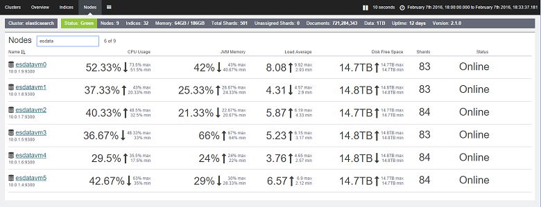

<properties
   pageTitle="調整資料彙總] 與 [查詢效能與上 Azure Elasticsearch |Microsoft Azure"
   description="最佳化 Elasticsearch 的查詢和搜尋效能時的考量的摘要。"
   services=""
   documentationCenter="na"
   authors="dragon119"
   manager="bennage"
   editor=""
   tags=""/>

<tags
   ms.service="guidance"
   ms.devlang="na"
   ms.topic="article"
   ms.tgt_pltfrm="na"
   ms.workload="na"
   ms.date="09/22/2016"
   ms.author="masashin"/>
   
# <a name="tuning-data-aggregation-and-query-performance-with-elasticsearch-on-azure"></a>調整 Elasticsearch Azure 上與資料彙總] 與 [查詢效能

[AZURE.INCLUDE [pnp-header](../../includes/guidance-pnp-header-include.md)]

本文是[一系列的一部分](guidance-elasticsearch.md)。 

使用 Elasticsearch 主要原因是支援資料搜尋。 使用者應該可以快速找出尋找的資訊。 此外，系統必須啟用使用者提出問題的資料，請搜尋的關聯性，並了商務決策，做出結論。 此處理是從資訊差異資料。

這份文件摘要說明決定的最佳方式，最佳化您的查詢和搜尋效能的系統時，您可以考慮的選項。

所有的效能建議主要仰賴套用至您的情況的案例大量的資料，您會編製索引，以及哪些應用程式和使用者查詢您的資料。 設定或使用您自己的資料和負載來評估您指定的分析藍本優點編製索引的結構中，您應該仔細測試結果的任何變更。 為此，這份文件也會說明執行一個使用不同的設定實作的特定案例的基準的數字。 您可以採用採用評估自己系統效能的方法。 [附錄](#appendix-the-query-and-aggregation-performance-test)說明這些測試的詳細資料。

## <a name="index-and-query-performance-considerations"></a>編製索引及查詢的效能考量

本節說明您考慮一些常見因素相關時設計建立索引以支援快速查詢和搜尋的需要。

### <a name="storing-multiple-types-in-an-index"></a>在 [索引中儲存多個類型

Elasticsearch 索引可以包含多個類型。 可能會以避免這種方法，並建立個別的索引，每個類型。 請考慮下列幾點︰

- 不同類型可能會指定不同的分析器，並不一定清除 Elasticsearch 應該使用如果執行查詢，在索引層級，而非類型層級的分析。 如需詳細資訊，請參閱[避免類型陷阱](https://www.elastic.co/guide/en/elasticsearch/guide/current/mapping.html#_avoiding_type_gotchas)。

- 按住多個類型的索引擊碎可能會超過於含有單一類型的索引。 更大的晶怪，更多工作所需的 Elasticsearch 來篩選資料時執行查詢。

- 如果類型的資料區之間有嚴重不相符，請一種類型的資訊可成為沒有嚴密分佈於許多擊碎減少擷取資料的搜尋的效率。

    

    ***共用索引類型之間的效果*** 

    型別 A 和 b 類型的文件中的 [圖表上方，共用相同的索引有許多其他文件類型的比 b 搜尋型別會涉及查詢所有四個擊碎的類型。 圖表的下半部會顯示每個類型是否會建立個別的索引的效果。 在此案例中，輸入會搜尋只需要存取兩個擊碎。

- 小型擊碎可更平均分佈於大型擊碎，讓載入分散到節點 Elasticsearch 更容易。

- 不同類型可能會有不同的保持期限。 很難封存舊的資料與共用文件擊碎作用中的資料。


不過，在某些情況下類型之間共用索引可以有效率如果︰

- 搜尋定期範圍中的相同索引的類型。

- 類型只有少數幾個文件每個。 維護一組個別的每一種類型的擊碎會變得明顯的負荷在此情況下。


### <a name="optimizing-index-types"></a>最佳化索引類型

Elasticsearch 索引的內容用來填入它的原始 JSON 文件的複本。 這項資訊保存在[*\_來源*](https://www.elastic.co/guide/en/elasticsearch/reference/current/mapping-source-field.html#mapping-source-field)欄位的每個索引項目。 此資料搜尋，不僅依預設會傳回以*取得*與*搜尋*要求。 不過，此欄位必須支付費用，而且佔用的儲存空間，讓擊碎較大，增加執行的 I/O 音量。 您可以停用*\_來源*每個類型為基礎的功能變數︰

```http
PUT my_index
{
  "mappings": {
    "my_type": {
      "_source": {
        "enabled": false
      }
    }
  }
}
```
停用此功能變數時，也會移除能夠執行下列作業︰

- 使用*更新*API 更新索引中的資料。

- 執行傳回反白顯示的資料的搜尋。

- 直接到另一個重新從一個 Elasticsearch 索引索引。

- 變更對應或分析設定。

- 檢視 [原始文件的偵錯查詢。


### <a name="reindexing-data"></a>重新索引的資料

擊碎才能索引的最終決定索引的容量。 您可以採取初始 （和最新） 推測多少擊碎會必要，但您都應該考量重新編製索引策略文件。 在許多情況下，重新索引可能預定的工作當資料規模擴大時。 可能不想要為搜尋最佳化，一開始，配置大量擊碎的索引，但配置新擊碎展開的資料量。 在其他情況下重新索引可能需要執行更多的臨機操作方式，如果您的相關資料大量成長只要估算不正確。

> [AZURE.NOTE] 重新索引可能不必要之資料的年齡 」 快速。 在此情況下，應用程式可能會建立新的索引的每一段時間。 範例包括效能記錄，或稽核資料無法在最新的索引中儲存的每一天。

<!-- -->

重新索引有效涉及從舊的項目中的資料建立新的索引，然後移除舊的索引。 如果索引很大，此程序花費的時間，並以確保資料維持可在此期間，您可能需要。 因此，您應該建立[的每個索引的別名](https://www.elastic.co/guide/en/elasticsearch/reference/current/indices-aliases.html)，並查詢應擷取資料到這些別名。 重新索引，時保留舊的索引，指向的別名，然後開啟它重新索引完成後，請參考新的索引。 此方法也適用於存取建立新的索引的每一天的時間為基礎資料。 若要存取目前資料會使用建立時需要變換至新的索引的別名。

### <a name="managing-mappings"></a>管理對應

Elasticsearch 使用對應，來決定如何解讀文件中的每個欄位中的資料。 每個類型都有它自己的對應，有效定義的結構描述，該類型。 Elasticsearch 產生倒的索引的每一個欄位中的文件類型中使用此資訊。 在任何文件中，每個欄位都有資料類型 （例如*字串*、*日期*或*長*） 和值。 第一次建立索引，或其來推斷 Elasticsearch 的新文件新增至類型時，您可以指定索引的對應。 不過，請考慮下列幾點︰

- 動態產生的對應可能會導致錯誤根據索引中加入文件時，如何解譯欄位。 例如，文件 1 可能包含保留數字欄位的而且原因 Elasticsearch 若要將這個欄位新增對應的指定的*時間有多長*是。 如果後續的文件會新增的欄位包含非數值的資料，然後就會失敗。 在此情況下，欄位應該可能有已被視為字串新增第一份文件時。 建立索引] 時，指定這個對應可以協助防止這類問題。

- 設計您的文件，以避免這可以新增嚴重負荷執行搜尋時，會耗用的記憶體，很，並導致查詢無法找到的資料產生極大對應。 採用一致的命名慣例，共用相同類型的文件中的欄位。 不同的文件中，不使用，例如欄位名稱，例如 「 first_name 」、 「 名字 」，以及 「 名字 」。 每個文件中使用相同的欄位名稱。 此外，請勿使用的值做為索引鍵 （這是常見的方法，在欄系列資料庫中，但可能會導致效率和失敗 「 Elasticsearch）。如需詳細資訊，請參閱[對應分裂](https://www.elastic.co/blog/found-crash-elasticsearch#mapping-explosion)。

- 若要避免 tokenization 適當的位置使用*not_analyzed* 。 例如，文件若包含名為保存 「 ABC 定義 」 的值的*資料*的字串欄位然後您可嘗試執行搜尋，以符合此值，如下所示的所有文件︰

  ```http
  GET /myindex/mydata/_search
  {
    "query" : {
      "filtered" : {
        "filter" : {
          "term" : {
            "data" : "ABC-DEF"
          }
        }
      }
    }
  }
  ```

 不過，此搜尋將無法傳回預期的結果中的字串 ABC 定義 token 化時，就建立索引的方式。 它會有效分割成兩個權杖，ABC 和定義，以連字號。 此功能設計用來支援搜尋功能完整的文字，但如果您想要解譯成單一原子項目中的字串您應該時停用 tokenization 文件新增至索引。 您可以使用這類對應︰

  ```http
  PUT /myindex
  {
    "mappings" : {
      "mydata" : {
        "properties" : {
          "data" : {
            "type" : "string",
            "index" : "not_analyzed"
          }
        }
      }
    }
  }
  ```

  如需詳細資訊，請參閱[尋找確切的值](https://www.elastic.co/guide/en/elasticsearch/guide/current/_finding_exact_values.html#_term_filter_with_text)。


### <a name="using-doc-values"></a>使用文件中的值

多個查詢與彙總要求的搜尋作業排序資料。 排序需要能夠將一或多個字詞對應至文件的清單。 若要協助此程序，Elasticsearch 可以載入所有的記憶體做為排序索引鍵欄位的值。 這項資訊稱為*fielddata*。 目的快取中的記憶體 fielddata 必須支付的 I/O，而可能是較快，重複讀取磁碟相同的資料。 不過，如果欄位具有高基數，然後在記憶體中儲存 fielddata 可以使用大量堆積空間，可能會影響能夠執行其他並行作業，或甚至耗盡造成 Elasticsearch 失敗的儲存空間。

另外，Elasticsearch 也支援*文件中的值*。 文件是記憶體內 fielddata 的項目類似，但它會儲存磁碟上，並建立資料是儲存在索引 （fielddata 建構動態執行查詢時。）文件中的值不會使用堆積空間並，因此時非常有用的排序] 或 [跨彙總資料欄位的查詢可以包含唯一值的很大的數字。 此外，在堆積精簡的壓力可以幫助位移效能之間的差異從磁碟擷取資料和記憶體讀取。 回收可能會發生的少，且較不可能會影響其他運用記憶體的同時作業。

您可以啟用或停用使用*doc_values*屬性，索引中每個屬性為基礎的文件值，如下列範例所示︰

```http
PUT /myindex
{
  "mappings" : {
    "mydata" : {
      "properties" : {
        "data" : {
          ...
          "doc_values": true
        }
      }
    }
  }
}
```
> [AZURE.NOTE] Elasticsearch 版本這時候開始 2.0.0 預設會啟用文件中的值。

使用文件中的值的確切影響很可能是您自己的資料與查詢的分析藍本特定，因此準備好進行效能測試，建立其用途。 您也應該注意的文件中的值，無法使用分析的字串欄位。 如需詳細資訊，請參閱[文件中的值](https://www.elastic.co/guide/en/elasticsearch/guide/current/doc-values.html#doc-values)。

### <a name="using-replicas-to-reduce-query-contention"></a>使用以減少查詢競爭的複本

常見的策略，來提升查詢的效能是建立的每個索引的多個複本。 從複本擷取資料，可以符合資料擷取作業。 不過，這種方法可以嚴重影響效能的資料 ingestion 作業，讓它必須包含混合的負載案例中謹慎使用。 此外，此策略為只優勢如果複本分佈節點並不會競爭屬於相同的索引的主要擊碎與資源。 請記住，有可能增加或減少索引的複本數目，以動態方式。

### <a name="using-the-shard-request-cache"></a>使用晶怪要求快取

Elasticsearch 可以快取查詢在記憶體中每個晶怪要求的本機資料。 擷取更快速地執行相同的資料這可讓搜尋，您可以從記憶體，而不是磁碟的儲存空間讀取資料。 快取資料，以這種方式可以因此改善的部分搜尋作業，犧牲減少可用的記憶體來同時執行其他工作的效能。 也有風險，從 [快取服務的資料已過期。 晶怪會重新整理的資料已變更時，只被失效快取中的資料。 重新整理的頻率受到索引的*refresh_interval*設定的值。

根據預設，停用快取索引的要求，但您可以啟用，如下所示︰

```http
PUT /myindex/_settings
{
  "index.requests.cache.enable": true
}
```

晶怪要求快取是最適合維持相對靜態，例如歷史或記錄資料的資訊。

### <a name="using-client-nodes"></a>使用用戶端節點

第一次收到要求的節點會處理所有查詢。 這個節點進一步要求所有包含的查詢，將索引擊碎其他節點與然後累積傳回回應的結果。 如果查詢包含彙總資料或執行複雜計算，初始節點負責執行適當的處理。 如果您的系統支援較小的數字的複雜的查詢，請考慮建立資料庫的用戶端來改善從資料節點載入的節點。 相反地，如果您的系統處理大量的簡單查詢，然後提交這些要求直接資料節點，並使用負載平衡器平均地分配要求。

### <a name="tuning-queries"></a>微調查詢

下列點摘要最大化 Elasticsearch 查詢的效能的秘訣︰

- 避免儘可能包含萬用字元的查詢。

- 如果相同的欄位主旨全文檢索搜尋與完全相符，請考慮分析及 nonanalyzed 表單中儲存的資料欄位。 執行 [分析] 欄位中，針對全文檢索搜尋和 nonanalyzed 欄位完全相符的項目。

- 只傳回資料必要。 如果您有大型文件，但應用程式只需要保留在 [子集合] 欄位中的資訊，然後傳回此子集合的查詢，而不是整份文件。 這種方法可減少叢集的網路頻寬需求。

- 可能的話，使用篩選，而不是查詢時搜尋資料。 篩選只會決定文件是否符合指定的準則，而查詢會計算如何關閉相符項目 （計分） 的文件。 內部，篩選所產生的值會儲存成點陣圖指出符合/否相符的每份文件，並以 Elasticsearch 快取。 發生相同的篩選準則之後，可以從快取擷取點陣圖，並且用來快速擷取相符的文件。 如需詳細資訊，請參閱[內部篩選作業](https://www.elastic.co/guide/en/elasticsearch/guide/current/_finding_exact_values.html#_internal_filter_operation)。

- 用於*bool*篩選執行靜態比較，而且名稱只能使用*和*、*或*和 [*未*篩選動態計算的篩選，例如與指令碼或*地理-\**篩選。

- 如果查詢*和*，*或*，結合*bool*篩選或*不*與*地理-* *篩選]，將*和*/*或*/*不地理-* * 篩選最後以便操作最的小資料集。

    同樣地，您也可使用 [ *post_filter*執行昂貴篩選作業。 將上次執行這些篩選器。

- 使用彙總，而不是 facet。 避免計算彙總的會分析或有多個可能的值。

    > **附註**︰ Facet 已經移除 Elasticsearch 版本 2.0.0 中。

- 除非您的應用程式需要確切的數目的相符的項目，請使用狀況*value_count*彙總的*基數*彙總。 正確計數可以過期快速，且許多應用程式只需要合理的估計值。

- 避免指令碼。 在查詢和篩選器中的指令碼昂貴而不會快取結果。 長時間執行指令碼可以使用搜尋往來，導致佇列的後續要求。 如果佇列中填滿，進一步將拒絕要求。

## <a name="testing-and-analyzing-aggregation-and-search-performance"></a>測試和分析彙總]，然後搜尋效能

本節描述一系列已針對不同的叢集和索引設定所執行的測試的結果。 兩種類型的測試未執行，如下所示︰

- * * *Ingestion] 與 [查詢*測試 * *。 這項測試開始使用空白索引所填入測試還來執行大量插入作業 （每一項作業新增 1000年文件）。 同時，查詢設計用來搜尋上述 15 分鐘期間新增文件，並產生的彙總的數字重複執行在 5 的第二個時間間隔。 重現組成的即時查詢附近的大規模資料 ingestion 挑戰工作負載的效果執行 24 小時，通常被允許這項測試。

- ***查詢專用*測試**。這項測試很類似*ingestion] 與 [查詢*測試的 ingestion 部分會被省略了，而且每個節點索引都會填入 100 萬個文件。 執行查詢的修改的組合;資料現在已靜態已移除限制文件，以加入前 15 分鐘的時間項目。 測試 90 分鐘，有較少建立效能模式，因為固定的資料量所需的時間。

---

在索引中的每個文件有相同的結構描述。 下表摘要列出結構描述中的欄位︰

名稱                          | 類型         | 備忘稿 |
  ----------------------------- | ------------ | -------------------------------------------------------- |
  組織                  | 字串      | 測試產生 200 唯一的組織。 |
  CustomField1-CustomField5   |字串       |這些是設定為空字串的五個字串欄位。|
  DateTimeRecievedUtc           |時間戳記    |日期及時間加入文件的位置。|
  Host （主機)                          |字串       |此欄位設為空字串。|
  HttpMethod                    |字串       |此欄位設為下列的值的其中一個: 「 張貼 」、 「 取得 」、 「 放置 」。|
  HttpReferrer                  |字串       |此欄位設為空字串。|
  HttpRequest                   |字串       |此功能變數會填入 10 和 200 字元的長度之間的隨機文字。|
  HttpUserAgent                 |字串       |此欄位設為空字串。|
  HttpVersion                   |字串       |此欄位設為空字串。|
  OrganizationName              |字串       |此欄位會設定為 [組織] 欄位的值相同。|
  SourceIp                      |IP           |此欄位包含表示資料的 「 來源 」 的 IP 位址。 |
   SourceIpAreaCode              |長         |此欄位會設定為 0。|
  SourceIpAsnNr                 |字串       |此欄位會設定為 [另存新檔\#\#\#\#\#」。|
  SourceIpBase10                |長         |此欄位是設為 500。|
  SourceIpCountryCode           |字串       |此欄位包含 2 個字元的國家/地區碼。 |
  SourceIpCity                  |字串       |此欄位的內容識別城市國家/地區中的字串。 |
  SourceIpLatitude              |點兩下       |此欄位包含隨機值。|
  SourceIpLongitude             |點兩下       |此欄位包含隨機值。|
  SourceIpMetroCode             |長         |此欄位會設定為 0。|
  SourceIpPostalCode            |字串       |此欄位設為空字串。|
  SourceLatLong                 |地理點   |此欄位已設為隨機地理點。|
  SourcePort                    |字串       |此功能變數會填入的隨機數字的字串表示。|
  TargetIp                      |IP           |這會填入隨機的 IP 位址範圍 0.0.100.100 至 255.9.100.100 中。|
  SourcedFrom                   |字串       |此欄位已設為 「 MonitoringCollector 」 字串。|
  TargetPort                    |字串       |此功能變數會填入的隨機數字的字串表示。|
  評等                        |字串       |此功能變數會填入其中一個隨機選取的 20 不同的字串值。|
  UseHumanReadableDateTimes     |布林值      |此欄位設為 false。|
 
下列查詢以批次執行的每個反覆運算的測試。 斜體中的名稱會用來指這些查詢中的 [這份文件其餘部分。 請注意，省略時間準則 （文件新增前 15 分鐘）*查詢專用*測試︰

- 在最後一個 15 分鐘 （*計算的評等*） 輸入多少*評等*的每個值的文件？ 

- 在最後一個 15 分鐘內 （*一段時間的計數*） 每個 5 分鐘的時間間隔已經新增數的文件？

- 已針對每個國家/地區新增前 15 分鐘 （*依國家/地區的點擊*） 的*評等*的每個值的數目文件？

- 哪些 15 組織發生新增前 15 分鐘 （*前 15 組織*） 的最常用的文件？

- 有許多不同的企業發生在加入前 15 分鐘 （*唯一的計數組織*） 的文件？

- 已新增多少文件前 15 分鐘 （*總點擊計數*）？

- 如何許多不同的*SourceIp*值的出現在加入前 15 分鐘 （*唯一 IP 計數*） 的文件中？


索引的定義和查詢的詳細資料[附錄](#appendix-the-query-and-aggregation-performance-test)所述。

若要瞭解的下列變數效果設計測試︰

- **磁碟類型**。 測試所執行的 D4 Vm 使用標準的儲存空間 (HDDs) 6 節點叢集，且上使用進階版儲存空間 (SSDs) DS4 Vm 6 節點叢集重複。

- **電腦大小的縮放**。 測試已執行 DS3 Vm （指定為*小型*叢集） 中所包含的 6 節點叢集，重複上一群 DS4 Vm （*中型*叢集），且重複叢集上的 DS14 機器 （*大型*叢集）。 下表摘要列出每個 VM SKU 的主要特性︰

 叢集 | VM SKU        | 核心的數量 | 數字的資料磁碟 | 大的 RAM (GB) |
---------|---------------|-----------------|----------------------|----------|
 小型   | 標準 DS3  | 4               | 8                    | 14       |
 媒體  | 標準 DS4  | 8               | 16                   | 28       |
 大型   | 標準 DS14 | 16              | 32                   | 112      |

- **叢集大小-出縮放比例**。 測試 DS14 Vm 包含 1，3 及 6 節點的叢集上執行。

- **索引的複本數目**。 使用索引以 1 與 2 複本設定執行測試。

- **文件中的值**。 一開始測試執行索引設定*doc_values*設為*true* （預設值）。 使用*doc_values*設為*false*，重複執行所選的測試。

- **快取**。 啟用索引晶怪要求快取方式進行測試。

- **擊碎數目**。 測試重複執行建立查詢更有效率地執行索引包含較少，較大的擊碎或更多、 更小的擊碎各使用不同擊碎數字。


## <a name="performance-results---disk-type"></a>效能結果-磁碟類型

執行此*ingestion] 與 [查詢*測試於 6 節點的叢集 D4 Vm （使用 HDDs），以及 6 節點叢集 DS4 Vm （使用 SSDs） 的評估磁碟的效能。 在這兩個叢集 Elasticsearch 設定都是相同。 資料已分散到 16 磁碟上每個節點，每個節點有 14 GB RAM 配置給執行 Elasticsearch Java 虛擬機器 (JVM)，作業系統使用沒有剩餘的記憶體 (也 14 GB)。 每個測試執行 24 小時。 這段期間選取要啟用資料變得很明顯，並允許系統穩定增加大量的效果。 下表摘要列出的結果，醒目提示包含測試之各種作業的回應時間。

 叢集 | 作業/查詢            | 平均回應時間 （毫秒） |
---------|----------------------------|----------------------------|
 D4      | Ingestion                  | 978                        |
         | 依評等的計算            | 103                        |
         | 計算留在上時間            | 134                        |
         | 依國家/地區的點擊            | 199                        |
         | 前 15 組織       | 137                        |
         | 組織專屬的計算 | 139                        |
         | 唯一 IP 計數            | 510                        |
         | 總點擊計數           | 89                         |
 DS4     | Ingestion                  | 511                        |
         | 依評等的計算            | 187                        |
         | 計算留在上時間            | 411                        |
         | 依國家/地區的點擊            | 402                        |
         | 前 15 組織       | 307                        |
         | 組織專屬的計算 | 320                        |
         | 唯一 IP 計數            | 841                        |
         | 總點擊計數           | 236                        |

第一眼就會顯示 DS4 叢集執行更好與 D4 叢集，有時候加倍 （或差） 的查詢的回應時間。 雖然這不會告訴整個本文。 下表顯示執行的每個叢集 ingestion 運算的數目 （請記住，每一項作業載入 1000年文件）︰

 叢集 | Ingestion 操作計數 |
---------|---------------------------|
 D4      | 264769                    |
 DS4     | 503157                    |

DS4 叢集已與 D4 叢集幾乎倍資料載入測試期間。 因此，分析時每一項作業的回應時間，您還必須考慮多少掃描，請對每個查詢的文件以及多少文件。 在索引中的文件的音量持續變大時，這些是動態的數字。 您無法直接除以 264769 503137 （ingestion 所執行的作業每個叢集的數量），然後再將結果乘以 D4 叢集提供比較的資訊，這會忽略 I/O ingestion 作業同時執行數量時所執行的每個查詢的平均回應時間。 不過，您應該測量的實體寫入的資料量，並進行測試時，會從磁碟讀取。 JMeter 測試方案擷取每一個節點這項的資訊。 摘要的結果如下︰

 叢集 | 平均位元組撰寫/已讀取每次操作 |
---------|----------------------------------------------|
 D4      | 13471557                                     |
 DS4     | 24643470                                     |

這項資料顯示 DS4 叢集就能維持 I/O 率約 1.8 時間的 D4 叢集。 差異的除了磁碟的性質，所有其他的資源都相同，必須是因為使用 SSDs 而 HDDs。

若要協助左右對齊此結束時下, 圖說明如何 I/O 執行一段時間的每個叢集︰


<!-- -->

***D4 和 DS4 叢集磁碟活動***

D4 叢集圖顯示大幅變化，尤其是在第一個的下半部的測試。 這是可能的原因，以減少 I/O 率節流設定。 在測試的初始階段，查詢可小來分析資料時，快速地執行。 D4 叢集磁碟是因此可能接近第二個 (IOPS) 容量、 其輸入輸出操作運作，但是每個 I/O 作業可能不會傳回多資料。 DS4 叢集可以支援較高的 IOPS 工資率，並且不會受同等節流，I/O 速率有更多規則。 若要支援此理論下, 一圖形組會顯示如何 CPU 已封鎖的磁碟 I/O 一段時間 （在圖形的磁碟等待時間都是 CPU 等待 i/o 所花費的時間比例）︰


***CPU 磁碟 I/O 等候 D4 和 DS4 叢集的時間***

請務必瞭解的原因有兩個主流封鎖 CPU I/O 作業︰

- I/O 子系統無法讀取或寫入資料，或從磁碟。

- I/O 子系統無法由裝載環境經流速控制。 使用 HDDs 實作 azure 磁碟有最大的 500 IOPS，處理能力，SSDs 有 5000 IOPS 的最大處理能力。


D4 叢集，花費的總時間 I/O 等待期間前半測試相互關聯密切倒的方式顯示的 I/O 工資率，該圖表使用。 期間的低 I/O 會對應到一段大量 CPU 用於封鎖的時間，這表示的 I/O 會被經流速控制]。 更多資料新增到叢集的情況下變更，並在半 i/o 測試尖峰等待的時間對應至尖峰 I/O 處理量。 此時，CPU 遭到封鎖時執行實數 I/O。 同樣地，DS4 叢集，等待 I/O 花費的時間就得多偶數。 每個最大使用量符合 I/O 效能，而不是透過相當於最大使用量，這表示有幾乎不的節流發生。

有其他一個要考慮的因素。 測試，期間 D4 叢集會產生 10584 ingestion 錯誤和 21 查詢錯誤。 測試 DS4 叢集上的所產生沒有錯誤。

## <a name="performance-results---scaling-up"></a>效能結果的縮放

向上調整測試執行對 DS3、 DS4，以及 DS14 Vm 6 節點叢集執行測試。 因為 DS4 VM 提供兩倍 CPU 核心和記憶體 DS3，並 DS14 機器加倍 CPU 資源一次同時提供的記憶體數量四次選取這些 sku 皆可。 下表將比較重要層面的每個 SKU:

 SKU  | \#CPU 核心 | 記憶體 (GB) | 最大值磁碟 IOPS | 最大值頻寬 (MB/s)|
------|-------------|-------------|---------------|--------------|
 DS3  | 4           | 14          | 12,800| 128 |
 DS4  | 8           | 28          | 25,600| 256 |
 DS14 | 16          | 112         | 50000| 512 |

下表摘要列出小型 (DS3)、 媒體 (DS4)，以及大型 (DS14) 叢集執行的檢定的結果。 每個 VM 可用於 SSDs 保留資料。 每個測試執行 24 小時。

表格報表每一種類型的查詢成功要求 （失敗不包含） 的數目。 要求嘗試每種類型數是測試的查詢的大致相同執行期間。 這是因為 JMeter 測試方案跟單一項目 （由評等的計算、 計數移轉時間、 點擊依國家/地區、 前 15 組織、 唯一的計數組織、 唯一 IP 計數，以及點擊總數） 每個查詢的共同稱為*測試交易*（此交易是獨立執行 ingestion 作業，這由個別的執行緒所執行的工作） 為單一單位。 測試方案每次執行單一測試交易。 測試交易完成數因此是在每次交易慢查詢回應時間值。

| 叢集      | 作業/查詢            | 要求的數目 | 平均回應時間 （毫秒） |
|--------------|----------------------------|--------------------|----------------------------|
| 小型 (DS3)  | Ingestion                  | 207284             | 3328                       |
|              | 依評等的計算            | 18444              | 268                        |
|              | 計算留在上時間            | 18444              | 340                        |
|              | 依國家/地區的點擊            | 18445              | 404                        |
|              | 前 15 組織       | 18439              | 323                        |
|              | 組織專屬的計算 | 18437              | 338                        |
|              | 唯一 IP 計數            | 18442              | 468                        |
|              | 總點擊計數           | 18428              | 294   
|||||
| 媒體 (DS4) | Ingestion                  | 503157             | 511                        |
|              | 依評等的計算            | 6958               | 187                        |
|              | 計算留在上時間            | 6958               | 411                        |
|              | 依國家/地區的點擊            | 6958               | 402                        |
|              | 前 15 組織       | 6958               | 307                        |
|              | 組織專屬的計算 | 6956               | 320                        |
|              | 唯一 IP 計數            | 6955               | 841                        |
|              | 總點擊計數           | 6958               | 236                        |
|||||
| 大型 (DS14) | Ingestion                  | 502714             | 511                        |
|              | 依評等的計算            | 7041               | 201                        |
|              | 計算留在上時間            | 7040               | 298                        |
|              | 依國家/地區的點擊            | 7039               | 363                        |
|              | 前 15 組織       | 7038               | 244                        |
|              | 組織專屬的計算 | 7037               | 283                        |
|              | 唯一 IP 計數            | 7037               | 681                        |
|              | 總點擊計數           | 7038               | 200                        |

這些數字，顯示這項測試，DS4 和 DS14 叢集的效能是相當類似。 DS3 叢集查詢作業的回應時間也會出現比較 favorably 一開始，然後查詢執行的作業的數字是遠超過 DS4 和 DS14 叢集的值。 不過，其中一個應該花強式通知 ingestion 工資率] 和 [連續的數字的文件進行搜尋。 在 DS3 叢集 ingestion 更限制，並測試結束資料庫只包含關於閱讀中的每個其他兩個叢集之文件的 40%。 這可能是因為處理資源、 網路和比較 DS4 或 DS14 VM DS3 vm 磁碟頻寬。 假設 DS4 VM 有 DS3 VM，為兩倍的資源，而且 DS14 有兩次 （四個時間的記憶體） DS4 VM 的資源，還有一個問題︰ 為什麼小於 ingestion 費率 DS4 和 DS14 叢集之間的差異大幅的 DS3 和 DS4 叢集間發生？ 這可能是因為網路使用率和 Azure Vm 的頻寬限制。 下列圖表顯示所有三個叢集此資料︰


**執行 ingestion] 與 [查詢測試 DS3 DS4，與 DS14 叢集網路使用率** 

<!-- -->

Azure Vm 可用的網路頻寬限制未發佈可以視情況而定，但網路活動的事實出現在有大約 2.75GBps 的平均值的兩個 DS4 levelled，並 DS14 測試建議已達到此類限制，且已成為中限制處理量的主要因素。 若是 DS3 叢集，因此其他可能的原因，限制的其他資源可用性較低的效能都是大幅降低網路活動。

若要找出 ingestion 作業的效果，並說明如何查詢效能而當節點不按比例縮放，一組查詢專用的測試執行，使用相同的節點。 下表摘要列出每個叢集獲得的結果︰

> [AZURE.NOTE] 您不應該比較的效能和數字中的查詢所執行的要求*僅供查詢*測試與其*ingestion] 與 [查詢*測試，以執行。 這是因為已修改查詢和相關的文件的不同。

| 叢集      | 作業/查詢            | 要求的數目 | 平均回應 Ttme （毫秒） |
|--------------|----------------------------|--------------------|----------------------------|
| 小型 (DS3)  | 依評等的計算            | 464                | 11758                      |
|              | 計算留在上時間            | 464                | 14699                      |
|              | 依國家/地區的點擊            | 463                | 14075                      |
|              | 前 15 組織       | 464                | 11856                      |
|              | 組織專屬的計算 | 462                | 12314                      |
|              | 唯一 IP 計數            | 461                | 19898                      |
|              | 總點擊計數           | 462                | 8882  
|||||
| 媒體 (DS4) | 依評等的計算            | 1045               | 4489                       |
|              | 計算留在上時間            | 1045               | 7292                       |
|              | 依國家/地區的點擊            | 1053               | 7564                       |
|              | 前 15 組織       | 1055               | 5066                       |
|              | 組織專屬的計算 | 1051               | 5231                       |
|              | 唯一 IP 計數            | 1051               | 9228                       |
|              | 總點擊計數           | 1051               | 2180                       |
|||||
| 大型 (DS14) | 依評等的計算            | 1842               | 1927                       |
|              | 計算留在上時間            | 1839               | 4483                       |
|              | 依國家/地區的點擊            | 1838               | 4761                       |
|              | 前 15 組織       | 1842               | 2117                       |
|              | 組織專屬的計算 | 1837               | 2393                       |
|              | 唯一 IP 計數            | 1837               | 7159                       |
|              | 總點擊計數           | 1837               | 642                        |

這次請跨不同叢集的平均回應時間趨勢是更清楚。 網路使用率較下方 2.75GBps 稍早所需 DS4 和 DS14 叢集 （這可能是因為飽和 ingestion] 與 [查詢測試網路），以及與 DS3 叢集 1.5GBps。 事實上，則接近 200MBps 在所有的情況下，如下列圖形所示︰


***網路使用量 DS3，DS4 和 DS14 叢集執行查詢專用測試*** 

限制因素 DS3 和 DS4 叢集現在會顯示為 100%靠近適用於太多時間的 CPU 使用率。 在 DS14 叢集 CPU 使用對平均 80%。 這是仍高、，但清楚醒目提示有更多的 CPU 核心可用的優點。 下圖說明 DS3 DS4，與 DS14 叢集的 CPU 使用模式。


***執行查詢專用測試 DS3 和 DS14 叢集的 CPU 使用率*** 

## <a name="performance-results---scaling-out"></a>效能結果-擴展

為了說明如何系統縮放比例出節點的數字，請執行測試使用 DS14 叢集包含 1，3 及 6 節點。 這次請僅*專用查詢*執行測試，使用 100 萬個文件和執行 90 分鐘︰

| 叢集 | 作業/查詢            | 要求的數目 | 平均回應時間 （毫秒） |
|---------|----------------------------|--------------------|----------------------------|
| 1 的節點  | 依評等的計算            | 288                | 6216                       |
|         | 計算留在上時間            | 288                | 28933                      |
|         | 依國家/地區的點擊            | 288                | 29455                      |
|         | 前 15 組織       | 288                | 9058                       |
|         | 組織專屬的計算 | 287                | 19916                      |
|         | 唯一 IP 計數            | 284                | 54203                      |
|         | 總點擊計數           | 287                | 3333                       |
|||||
| 3 節點 | 依評等的計算            | 1194               | 3427                       |
|         | 計算留在上時間            | 1194               | 5381                       |
|         | 依國家/地區的點擊            | 1191               | 6840                       |
|         | 前 15 組織       | 1196               | 3819                       |
|         | 組織專屬的計算 | 1190               | 2938                       |
|         | 唯一 IP 計數            | 1189               | 12516                      |
|         | 總點擊計數           | 1191               | 1272                       |
|||||
| 6 節點 | 依評等的計算            | 1842               | 1927                       |
|         | 計算留在上時間            | 1839               | 4483                       |
|         | 依國家/地區的點擊            | 1838               | 4761                       |
|         | 前 15 組織       | 1842               | 2117                       |
|         | 組織專屬的計算 | 1837               | 2393                       |
|         | 唯一 IP 計數            | 1837               | 7159                       |
|         | 總點擊計數           | 1837               | 642                        |

節點數目差別嚴重查詢效能的叢集，雖然以非線性的方式。 3 節點叢集為單一節點叢集，完成大約 4 倍查詢，而 6 節點叢集處理許多 6 時間。 若要協助說明此非線性下, 圖顯示 CPU 由三個叢集方式︰


***1，3，與執行查詢專用測試 6 節點叢集的 CPU 使用率***

單一節點並 3 節點叢集可 cpu 的 CPU 使用率高 6 節點叢集雖然有可用的可用處理容量。 在此情況下，其他因素很可能會限制。 這可能確認測試 9 和 12 節點，就可能會顯示進一步可用處理容量。

上述表格中的資料也會顯示如何查詢的平均回應時間視情況而定。 這是查詢的測試系統如何調整特定類型時，最有用的資訊項目。 橫跨多個節點與其他人時，某些搜尋會清楚最更有效率。 這可能是因為節點的數字與文件中叢集增加數目的比例，每個叢集包含 100 萬個文件。 在執行搜尋涉及彙總資料時，將 [處理程序 Elasticsearch，並將其緩衝當做彙總程序，在每個節點的記憶體中擷取的資料。 如果有多個節點，有較少的資料擷取緩衝，和在每個節點 [處理程序。

## <a name="performance-results---number-of-replicas"></a>效能結果的複本數目

針對與單一複本索引執行*ingestion] 與 [查詢*測試。 使用兩個複本以設定索引 6 節點 DS4 和 DS14 叢集上重複執行測試。 所有的測試執行 24 小時。 下表顯示一個與兩個複本的比較結果︰

| 叢集 | 作業/查詢            | 平均回應時間 （毫秒）-1 的複本 | 平均回應時間 （毫秒）-2 的複本 | [差異百分比回應時間 |
|---------|----------------------------|----------------------------------------|-----------------------------------------|-------------------------------|
| DS4     | Ingestion                  | 511                                    | 655                                     | + 28%                          |
|         | 依評等的計算            | 187                                    | 168                                     | -10%                          |
|         | 計算留在上時間            | 411                                    | 309                                     | -25%                          |
|         | 依國家/地區的點擊            | 402                                    | 562                                     | + 40%                          |
|         | 前 15 組織       | 307                                    | 366                                     | + 19%                          |
|         | 組織專屬的計算 | 320                                    | 378                                     | + 18%                          |
|         | 唯一 IP 計數            | 841                                    | 987                                     | + 17%                          |
|         | 總點擊計數           | 236                                    | 236                                     | + 0%                           |
||||||
| DS14    | Ingestion                  | 511                                    | 618                                     | + 21%                          |
|         | 依評等的計算            | 201                                    | 275                                     | + 37%                          |
|         | 計算留在上時間            | 298                                    | 466                                     | + 56%                          |
|         | 依國家/地區的點擊            | 363                                    | 529                                     | + 46%                          |
|         | 前 15 組織       | 244                                    | 407                                     | + 67%                          |
|         | 組織專屬的計算 | 283                                    | 403                                     | + 42%                          |
|         | 唯一 IP 計數            | 681                                    | 823                                     | + 21%                          |
|         | 總點擊計數           | 200                                    | 221                                     | + 11%                          |

為更高的複本數目，減少 ingestion 工資率。 此時，必須 Elasticsearch 正在撰寫的每個文件中，更多份產生額外的磁碟 I/O。  這會反映 DS14 叢集索引的圖形與 1 和 2 的複本下, 圖所示。 若是索引的 1 的複本中，average I/O 率已 16896573 位元組/第二個。 索引與 2 的複本中，average I/O 率為 33986843 位元組/第二個，透過按兩次多。


***1 和 2 複本執行 ingestion] 與 [查詢測試節點的磁碟 I/O 工資率***

| 叢集 | 查詢                      | 平均回應時間 （毫秒）-1 的複本 | 平均回應時間 （毫秒）-2 的複本 |
|---------|----------------------------|----------------------------------------|-----------------------------------------|
| DS4     | 依評等的計算            | 4489                                   | 4079                                    |
|         | 計算留在上時間            | 7292                                   | 6697                                    |
|         | 依國家/地區的點擊            | 7564                                   | 7173                                    |
|         | 前 15 組織       | 5066                                   | 4650                                    |
|         | 組織專屬的計算 | 5231                                   | 4691                                    |
|         | 唯一 IP 計數            | 9228                                   | 8752                                    |
|         | 總點擊計數           | 2180                                   | 1909                                    |
|||||
| DS14    | 依評等的計算            | 1927                                   | 2330                                    |
|         | 計算留在上時間            | 4483                                   | 4381                                    |
|         | 依國家/地區的點擊            | 4761                                   | 5341                                    |
|         | 前 15 組織       | 2117                                   | 2560                                    |
|         | 組織專屬的計算 | 2393                                   | 2546                                    |
|         | 唯一 IP 計數            | 7159                                   | 7048                                    |
|         | 總點擊計數           | 642                                    | 708                                     |

這些結果會顯示平均回應時間 DS4 叢集，但 DS14 叢集增加改進。 若要協助解譯這些結果，您也必須考量每個測試執行的查詢的數︰

| 叢集 | 查詢                      | 數字執行-1 的複本 | 數字執行-2 的複本 |
|---------|----------------------------|------------------------------|-------------------------------|
| DS4     | 依評等的計算            | 1054                         | 1141                          |
|         | 計算留在上時間            | 1054                         | 1139                          |
|         | 依國家/地區的點擊            | 1053                         | 1138                          |
|         | 前 15 組織       | 1055                         | 1141                          |
|         | 組織專屬的計算 | 1051                         | 1136                          |
|         | 唯一 IP 計數            | 1051                         | 1135                          |
|         | 總點擊計數           | 1051                         | 1136                          |
|||||
| DS14    | 依評等的計算            | 1842                         | 1718                          |
|         | 計算留在上時間            | 1839                         | 1716                          |
|         | 依國家/地區的點擊            | 1838                         | 1714                          |
|         | 前 15 組織       | 1842                         | 1718                          |
|         | 組織專屬的計算 | 1837                         | 1712                          |
|         | 唯一 IP 計數            | 1837                         | 1712                          |
|         | 總點擊計數           | 1837                         | 1712                          |

與平均回應時間減少排列增加 DS4 叢集所執行的查詢數目，但再次一定是 DS14 叢集的則為 true，則會顯示此資料。 不一致的散佈嚴重因子變異數為 DS4 的 CPU 使用率叢集在 1 複本與 2-複本測試。 某些節點出現接近 100%使用率，而其他人有可用處理容量。 改善效能是很可能是因為處理分散叢集節點的增強功能。 下圖顯示變化 CPU 中處理之間最少量和重度使用 Vm （節點 4 和 3）︰


***在執行查詢專用測試 DS4 叢集最少使用和最常使用節點的 CPU 使用率***

DS14 叢集這不是大小寫。 兩個測試的 CPU 使用率所有節點，都為較低和第二個複本的可用性變得更少的優點與多個開銷︰


***在執行查詢專用測試 DS14 叢集最少使用和最常使用節點的 CPU 使用率***

這些結果顯示基準仔細測試您的系統，決定是否要使用多個複本時需要。 您隨時都應該至少有一個複本的每個索引 （除非您願意可能會遺失資料，如果節點失敗），但其他複本可以強制負擔的好處，根據您的工作量及叢集可用的硬體資源的系統。

## <a name="performance-results---doc-values"></a>效能結果的文件中的值

使用文件值啟用，導致 Elasticsearch 用來排序磁碟上的欄位的資料的儲存方式進行*ingestion] 與 [查詢*測試。 使用文件值停用，因此 Elasticsearch 動態建構 fielddata 和記憶體快取，重複執行測試。 所有的測試執行 24 小時。 下表將比較測試帶的內建使用 D4、 DS4 和 DS14 Vm （D4 叢集 DS4 和 DS14 叢集使用 SSDs 時使用一般的硬碟，） 6 節點叢集的回應時間。

| 叢集 | 作業/查詢            | 平均回應時間 （毫秒）-啟用文件值 | 平均回應時間 （毫秒）-停用的文件值 | [差異百分比回應時間 |
|---------|----------------------------|-------------------------------------------------|--------------------------------------------------|-------------------------------|
| D4      | Ingestion                  | 978                                             | 835                                              | -15%                          |
|         | 依評等的計算            | 103                                             | 132                                              | + 28%                          |
|         | 計算留在上時間            | 134                                             | 189                                              | + 41%                          |
|         | 依國家/地區的點擊            | 199                                             | 259                                              | + 30%                          |
|         | 前 15 組織       | 137                                             | 184                                              | + 34%                          |
|         | 組織專屬的計算 | 139                                             | 197                                              | + 42%                          |
|         | 唯一 IP 計數            | 510                                             | 604                                              | + 18%                          |
|         | 總點擊計數           | 89                                              | 134                                              | + 51%                          |
||||||
| DS4     | Ingestion                  | 511                                             | 581                                              | + 14%                          |
|         | 依評等的計算            | 187                                             | 190                                              | + 2%                           |
|         | 計算留在上時間            | 411                                             | 409                                              | -0.5%                         |
|         | 依國家/地區的點擊            | 402                                             | 414                                              | + 3%                           |
|         | 前 15 組織       | 307                                             | 284                                              | -7%                           |
|         | 組織專屬的計算 | 320                                             | 313                                              | -2 的百分比                           |
|         | 唯一 IP 計數            | 841                                             | 955                                              | + 14%                          |
|         | 總點擊計數           | 236                                             | 281                                              | + 19%                          |
||||||
| DS14    | Ingestion                  | 511                                             | 571                                              | + 12%                          |
|         | 依評等的計算            | 201                                             | 232                                              | + 15%                          |
|         | 計算留在上時間            | 298                                             | 341                                              | + 14%                          |
|         | 依國家/地區的點擊            | 363                                             | 457                                              | + 26%                          |
|         | 前 15 組織       | 244                                             | 338                                              | + 39%                          |
|         | 組織專屬的計算 | 283                                             | 350                                              | + 24%                          |
|         | 唯一 IP 計數            | 681                                             | 909                                              | + 33%                          |
|         | 總點擊計數           | 200                                             | 245                                              | + 23%                          |

下表會比較 ingestion 所執行的作業測試數︰

| 叢集 | Ingestion 操作計數啟用文件值 | Ingestion 操作計數-文件值停用 | [差異百分比中 \number 的 ingestion 作業 |
|---------|----------------------------------------------|-----------------------------------------------|-----------------------------------------|
| D4      | 264769                                       | 408690                                        | + 54%                                    |
| DS4     | 503137                                       | 578237                                        | + 15%                                    |
| DS14    | 502714                                       | 586472                                        | + 17%                                    |

改良的 ingestion 率會發生寫入較少的資料磁碟插入文件時停用的文件值。 更佳的效能是費時 D4 VM 使用 HDDs 來儲存資料。 在此例中為 ingestion 作業也縮小內容 （請參閱本節中的第一個資料表） 15%的回應時間。 這可能會因為可能的 HDDs 精簡壓力執行靠近測試其 IOPS 限制文件中的值，請參閱磁碟類型測試，如需詳細資訊。 下圖將 D4 Vm I/O 效能與文件值啟用 （保留在磁碟上的值） 和文件值停用 （保留在記憶體中的值）︰


***針對文件中的值 D4 叢集磁碟活動啟用及停用***

相反地，使用 SSDs Vm 的 ingestion 值顯示增加的小型文件，但 ingestion 作業的回應時間增加的數目。 使用一或兩個小例外]，也是糟查詢回應時間。 SSDs 比較不會讓效能的變更可能因為增加處理活動和管理 JVM 堆積開銷靠近其 IOPS 限制執行啟用，文件值。 這是明顯藉由比較的 CPU 使用率啟用及停用的文件值。 下圖會醒目提示此 DS4 叢集，大部分的 CPU 使用率移到的位置從 30%的 40%頻啟用，以停用的文件值 40-50%頻的文件值的資料 （DS14 叢集顯示類似趨勢）︰


***針對文件中的值 DS4 叢集 CPU 使用率啟用及停用***

若要區別的文件值的查詢效能資料 ingestion 的效果，成對的查詢專用的測試啟用及停用的文件值 DS4 和 DS14 叢集執行。 下表摘要列出這些測試的結果︰

| 叢集 | 作業/查詢            | 平均回應時間 （毫秒）-啟用文件值 | 平均回應時間 （毫秒）-停用的文件值 | [差異百分比回應時間 |
|---------|----------------------------|-------------------------------------------------|--------------------------------------------------|-------------------------------|
| DS4     | 依評等的計算            | 4489                                            | 3736                                             | -16%                          |
|         | 計算留在上時間            | 7293                                            | 5459                                             | -25%                          |
|         | 依國家/地區的點擊            | 7564                                            | 5930                                             | -22%                          |
|         | 前 15 組織       | 5066                                            | 3874                                             | -14%                          |
|         | 組織專屬的計算 | 5231                                            | 4483                                             | -2 的百分比                           |
|         | 唯一 IP 計數            | 9228                                            | 9474                                             | + 3%                           |
|         | 總點擊計數           | 2180                                            | 1218                                             | -44%                          |
||||||
| DS14    | 依評等的計算            | 1927                                            | 2144                                             | + 11%                          |
|         | 計算留在上時間            | 4483                                            | 4337                                             | -3%                           |
|         | 依國家/地區的點擊            | 4761                                            | 4840                                             | + 2%                           |
|         | 前 15 組織       | 2117                                            | 2302                                             | + 9%                           |
|         | 組織專屬的計算 | 2393                                            | 2497                                             | + 4%                           |
|         | 唯一 IP 計數            | 7159                                            | 7639                                             | + 7%                           |
|         | 總點擊計數           | 642                                             | 633                                              | -1%                           |

請記住，這時候開始 Elasticsearch 2.0，預設會啟用文件中的值。 在測試中涵蓋 DS4 叢集，停用文件中的值有整體，正數效果，而一定是通常 DS14 叢集 （兩個情況下，效能較佳停用的文件值是非常臨界） 則為 true，則會出現。

DS4 叢集，這兩種情況的 CPU 使用率為 100%靠近，指出叢集 CPU 繫結兩個測試期間。 不過，處理的查詢數縮小內容從 7369 以 5894 （20%)。 請記住，如果文件中的值會停用 Elasticsearch 動態會產生 fielddata 在記憶體中，這會用到 CPU 能力。 此設定已減少磁碟 I/O 但靠近其最大的功能已執行的 cpu 增加的壓力率，因此在此情況下停用的文件值會更快速地查詢，但有較少。

在 DS14 測試不含文件值 CPU 與活動不高，但不是 100%。 執行的查詢數已略高 （約 4%) 中啟用文件值的測試︰

| 叢集 | 查詢                      | 執行-啟用文件值的數目 | 執行-數字的文件值停用 |
|---------|----------------------------|---------------------------------------|----------------------------------------|
| DS4     | 依評等的計算            | 1054                                  | 845                                    |
|         | 計算留在上時間            | 1054                                  | 844                                    |
|         | 依國家/地區的點擊            | 1053                                  | 842                                    |
|         | 前 15 組織       | 1055                                  | 846                                    |
|         | 組織專屬的計算 | 1051                                  | 839                                    |
|         | 唯一 IP 計數            | 1051                                  | 839                                    |
|         | 總點擊計數           | 1051                                  | 839  
|||||                                  |
| DS14    | 依評等的計算            | 1772                                  | 1842                                   |
|         | 計算留在上時間            | 1772                                  | 1839                                   |
|         | 依國家/地區的點擊            | 1770                                  | 1838                                   |
|         | 前 15 組織       | 1773                                  | 1842                                   |
|         | 組織專屬的計算 | 1769                                  | 1837                                   |
|         | 唯一 IP 計數            | 1768                                  | 1837                                   |
|         | 總點擊計數           | 1769                                  | 1837                                   |

## <a name="performance-results---shard-request-cache"></a>效能結果-晶怪要求快取

若要示範如何在每個節點的記憶體的快取索引資料可能影響效能，DS4 上進行*查詢和 ingestion*測試並 DS14 6 節點的叢集索引快取啟用-請參閱[使用晶怪要求快取](#using-the-shard-request-cache)的章節，如需詳細資訊。 結果所產生的舊版的測試使用相同的索引，但索引快取停用的比較。 下表摘要列出的結果。 請注意，資料都已涵蓋只在第一個 90 分鐘的測試遭到削減，此時比較趨勢的外觀，繼續進行測試想可能未能任何其他的深入見解︰

| 叢集 | 作業/查詢            | 平均回應時間 （毫秒）-停用的索引快取 | 平均回應時間 （毫秒）-啟用索引快取 | [差異百分比回應時間 |
|---------|----------------------------|---------------------------------------------------|--------------------------------------------------|-------------------------------|
| DS4     | Ingestion                  | 504                                               | 3260                                             | + 547%                         |
|         | 依評等的計算            | 218                                               | 273                                              | + 25%                          |
|         | 計算留在上時間            | 450                                               | 314                                              | -30%                          |
|         | 依國家/地區的點擊            | 447                                               | 397                                              | -11%                          |
|         | 前 15 組織       | 342                                               | 317                                              | -7%                           |
|         | 組織專屬的計算 | 370                                               | 324                                              | -12%                         |
|         | 唯一 IP 計數            | 760                                               | 355                                              | -53%                          |
|         | 總點擊計數           | 258                                               | 291                                              | + 12%                          |
||||||
| DS14    | Ingestion                  | 503                                               | 3365                                             | + 569%                         |
|         | 依評等的計算            | 234                                               | 262                                              | + 12%                          |
|         | 計算留在上時間            | 357                                               | 298                                              | x 17%                          |
|         | 依國家/地區的點擊            | 416                                               | 383                                              | 為 8%                           |
|         | 前 15 組織       | 272                                               | 324                                              | -7%                           |
|         | 組織專屬的計算 | 330                                               | 321                                              | -3%                           |
|         | 唯一 IP 計數            | 674                                               | 352                                              | -48%                          |
|         | 總點擊計數           | 227                                               | 292                                              | + 29%                          |

這項資料顯示感興趣的兩個點︰

-  資料 ingestion 費率出現會大幅降低啟用索引快取。

-  索引快取不一定改善回應時間，所有類型的查詢，而且能對特定彙總的作業，例如所執行的 [依評等的字數統計] 和 [點擊總數查詢產生負面影響。
 

若要瞭解為什麼系統會出現此問題，您應該考慮查詢順利執行每個測試執行期間的數。 下表摘要列出此資料︰

| 叢集 | 作業/查詢            | 計算作業/查詢-停用的索引快取 | 計算作業/查詢-啟用索引快取 |
|---------|----------------------------|-------------------------------------------------|------------------------------------------------|
| DS4     | Ingestion                  | 38611                                           | 13232                                          |
|         | 依評等的計算            | 524                                             | 18704                                          |
|         | 計算留在上時間            | 523                                             | 18703                                          |
|         | 依國家/地區的點擊            | 522                                             | 18702                                          |
|         | 前 15 組織       | 521                                             | 18706                                          |
|         | 組織專屬的計算 | 521                                             | 18700                                          |
|         | 唯一 IP 計數            | 521                                             | 18699                                          |
|         | 總點擊計數           | 521                                             | 18701                                          |
||||                                        |
| DS14    | Ingestion                  | 38769                                           | 12835                                          |
|         | 依評等的計算            | 528                                             | 19239                                          |
|         | 計算留在上時間            | 528                                             | 19239                                          |
|         | 依國家/地區的點擊            | 528                                             | 19238                                          |
|         | 前 15 組織       | 527                                             | 19240                                          |
|         | 組織專屬的計算 | 524                                             | 19234                                          |
|         | 唯一 IP 計數            | 524                                             | 19234                                          |
|         | 總點擊計數           | 527                                             | 19236                                          |

您可以看到 ingestion 工資率已啟用 [快取是約 1/3 的快取已停用時，雖然 34 倍增加執行查詢的數目。 不再查詢會造成盡可能磁碟 I/O，且沒有安裝磁碟資源競爭。 這會反映在下圖中圖形比較所有四個案例 I/O 的活動︰


***使用索引快取 ingestion] 與 [查詢測試磁碟 I/O 活動停用，並啟用***

減少磁碟 I/O 也是 CPU 花較少 I/O 完成正在等待的時間。 這會醒目提示下, 圖︰


***CPU 時間等待磁碟 I/O 索引快取停用，並啟用完成 ingestion] 與 [查詢測試***

減少磁碟 I/O 全新 Elasticsearch 可能會花時間服務查詢的資料更大比例保存在記憶體中。 這會增加顯而易見如果您要查看所有四個案例的 CPU 使用率的 CPU 使用率。 下列圖表顯示如何 CPU 使用已更保持啟用快取︰


***使用索引快取停用，並啟用測試 ingestion 及查詢的 CPU 使用率***

網路 I/O 這兩個案例的測試期間的音量已針對類似。 不含快取測試顯示期間的測試期間，但更長的時間，逐漸降低 24 小時制執行顯示此統計 levelled 大約 2.75GBps 在這些測試。 下圖顯示 DS4 叢集 （DS14 叢集的資料是非常類似） 此資料︰


***使用索引快取停用，並啟用 ingestion] 與 [查詢測試網路流量區***

[向上](#performance-results-scaling-up)測試所述，限制網路頻寬與 Azure Vm 未發佈可以視情況而定，但 CPU 和磁碟活動的中度等級建議網路使用率可能會在這個案例中限制的因素。

快取是自然更適合案例資料不常變更的位置。 若要醒目提示的快取在此案例中，影響*僅查詢的*測試執行啟用了快取。 如下所示的結果 （這些測試執行 90 分鐘，以及測試索引包含 100 萬個文件）︰

| 叢集 | 查詢                      | 平均回應時間 （毫秒） | 執行的查詢數 |
|---------|----------------------------|----------------------------|-------------------------|
|         |                            | **停用快取**         | **已啟用快取**       |
| DS4     | 依評等的計算            | 4489                       | 210                     |
|         | 計算留在上時間            | 7292                       | 211                     |
|         | 依國家/地區的點擊            | 7564                       | 231                     |
|         | 前 15 組織       | 5066                       | 211                     |
|         | 組織專屬的計算 | 5231                       | 211                     |
|         | 唯一 IP 計數            | 9228                       | 218                     |
|         | 總點擊計數           | 2180                       | 210                     |
|         |                            |                            |                         |
| DS14    | 依評等的計算            | 1927                       | 211                     |
|         | 計算留在上時間            | 4483                       | 219                     |
|         | 依國家/地區的點擊            | 4761                       | 236                     |
|         | 前 15 組織       | 2117                       | 212                     |
|         | 組織專屬的計算 | 2393                       | 212                     |
|         | 唯一 IP 計數            | 7159                       | 220                     |
|         | 總點擊計數           | 642                        | 211                     |

變異數的快測試效能是因為資源 DS4 和 DS14 Vm 之間的差異。 這兩種情況的快取測試是直接從記憶體擷取卸除大幅做為資料的平均回應時間。 值得也的回應時間的快取 DS4 和 DS14 叢集測試已快結果工還是非常類似。 也有極少不同回應的時間內的每個測試每個查詢的詳細資訊，且全都需要大約 220ms年。 磁碟 I/O 工資率和兩個叢集的 CPU 使用率是一次全部的資料是在記憶體極低小 I/O 或處理。 網路 I/O 工資率為類似於未快取測試，確認該網路頻寬可能會限制的因素，在這項測試。 下圖顯示 DS4 叢集這項資訊。 DS14 叢集的設定檔是非常類似︰


***磁碟 I/O、 CPU 使用率和網路使用的查詢專用的測試有啟用索引快取***

上述表格中的數字建議，使用 DS14 架構透過使用 DS4 顯示好處。 事實上，DS14 叢集所產生的樣本數關於 5%下方的 DS4 叢集，但也可能是因為網路限制，這可能稍有隨時間。

## <a name="performance-results---number-of-shards"></a>效能結果-擊碎數

這項測試的目的是判斷擊碎建立索引的數字是否有任何關係，該索引的查詢效能。

個別測試進行先前有顯示的索引晶怪設定會影響資料 ingestion 率。 若要判斷查詢效能按照類似的方法，但不限於 DS14 硬體上執行的 6 節點叢集進行測試。 這種方法可協助變數的最小化，所以效能任何差異應該是因為擊碎的音量。

*查詢專用*的相同的索引設定 7、 13、 23、 37 及 61 主要擊碎複本上進行測試。 索引包含 100 萬個文件，並透過單一複本，叢集加倍擊碎數目。 每個測試執行 90 分鐘。 下表摘要列出的結果。 平均回應所顯示的時間由測試每次執行包含一組完整的查詢 JMeter 測試交易的回應時間。 請參閱一節[效能結果的縮放](#performance-results-scaling-up)，如需詳細資訊中的附註︰

| 擊碎的數字          | 晶怪版面配置 （每個節點，包括複本擊碎） | 執行的查詢數 | 平均回應時間 （毫秒） |
|---------------------------|----------------------------------------------------|-----------------------------|------------------------|
| 7 (包括複本 14) | 3-2-2-2-2-3                                        | 7461                        | 40524                  |
| 13 (26)                   | 5-4-5-4-4-4                                        | 7369                        | 41055                  |
| 23 (46)                   | 7-8-8-7-8-8                                        | 14193                       | 21283                  |
| 37 (74)                   | 13-12-12-13-12-12                                  | 13399                       | 22506                  |
| 61 (122)                  | 20-21-20-20-21-20                                  | 14743                       | 20445                  |

這些結果表示有明顯的效能與之間的差異 13(26) 晶怪叢集 23,(46) 晶怪叢集、 處理量幾乎加倍和回應時間一半。 這是很可能是因為 Vm 和 Elasticsearch 使用來處理搜尋要求的結構的設定。 搜尋要求佇列，並由單一搜尋執行緒處理每個搜尋的要求。 搜尋執行緒建立 Elasticsearch 節點數目是裝載的節點的電腦上的處理器數目的函數。 結果建議的節點上只 4 或 5 擊碎，與處理資源沒有完全運用。 支援此功能位於 [CPU 使用率執行這項測試。 下列圖像是來自 Marvel 執行 13(26) 晶怪測試快照︰



***查詢專用測試 7(14) 晶怪叢集上的 CPU 使用率***

比較與其 23(46) 晶怪測試這些數字︰


***查詢專用測試 23(46) 晶怪叢集上的 CPU 使用率***

在 23(46) 晶怪，請 CPU 使用率都是最高。 每個節點包含 7 或 8 擊碎。 DS14 架構提供 16 的處理器，並 Elasticsearch 較佳的能夠利用此數字的核心與其他擊碎。 上述表格中的數字建議，增加擊碎超過此時間點的數目可能會改善效能稍微，但您應該位移維護擊碎大量的額外負荷對這些數字。 這些測試會暗示最佳的每個節點擊碎數目是每個節點上可用的處理器核心的一半數目。 不過，請記住，只有在執行查詢時，所得到這些的結果。 如果您的系統匯入資料，您也必須考量 sharding 可能會如何影響資料 ingestion 作業的效能。 

## <a name="summary"></a>摘要

Elasticsearch 提供許多您可以使用結構索引並調整，以支援大型查詢作業的選項。 這份文件有摘要一些常見的組態和技巧，您可以使用來調整您的資料庫進行查詢。 不過，您應該辨識間最佳化的資料庫，支援快速擷取，而不是支援大量的資料 ingestion 有折衷。 有時什麼是很好的查詢可以有不方便影響插入作業，反之亦然。 在混合的工作量公開系統中，您需要評估餘額的所在位置，並調整系統參數。

此外，套用不同的設定和技巧可能會根據資料和限制的結構 （或其他） 的硬體系統建構上。 這份文件中顯示的測試許多說明硬體平台的選取範圍可能會如何影響處理量，以及如何一些策略可幫助在某些情況下，但在其他人不方便。 瞭解可用的選項，然後執行 [嚴格基準使用自己的資料來決定最佳組合，是很重要的一點。

最後請記住，Elasticsearch 資料庫不一定的靜態的項目。 一段時間，就可能會變大，可能需要用來建構資料的策略定期修訂。 例如，可能會需要不按比例縮放、 不按比例縮放，或重新建立索引資料與其他擊碎。 當系統增加大小和複雜程度，請準備持續測試效能，以確保仍會議保證客戶任何 Sla。

## <a name="appendix-the-query-and-aggregation-performance-test"></a>附錄︰ 查詢和彙總效能測試

本附錄說明對 Elasticsearch 叢集執行效能測試。 使用一組個別的 Vm 上執行的 JMeter 執行測試。 詳細資料的測試環境設定會[建立效能，測試環境 Elasticsearch Azure 上](guidance-elasticsearch-creating-performance-testing-environment.md)所述。 若要執行您自己的測試，您可以建立手動追蹤此附錄，提供的指導方針自己 JMeter 測試方案，或您可以單獨使用可用的自動化的測試指令碼。 如需詳細資訊，請參閱[執行自動的 Elasticsearch 效能測試](guidance-elasticsearch-running-automated-performance-tests.md)。

資料查詢工作負載執行查詢時執行一次大型的文件上傳如下所述的設定。 此工作負載的目的是模擬生產環境位置新資料為不斷地新增時執行搜尋。 查詢所擷取前 15 分鐘新增文件中的最新的資料結構化。

每份文件儲存在名為*idx*的單一索引，並透過類型*的文件*。 您可以使用下列 HTTP 要求建立索引。 *Number_of_replicas* ] 及 [ *number_of_shards*設定不同的許多測試所示的值。 此外，測試 fielddata 而非文件中的值、 每個屬性用的註解之屬性*「 doc_values 」: false*。

**重要事項**︰ 卸除索引，並重新建立之前執行每項測試。 

``` http
PUT /idx
{  
    "settings" : {
        "number_of_replicas": 1,
        "refresh_interval": "30s",
        "number_of_shards": "5",
        "index.translog.durability": "async"    
    },
    "doc": {
        "mappings": {
            "event": {
                "_all": {
                    "enabled": false
                },
                "_timestamp": {
                    "enabled": true,
                    "store": true,
                    "format": "date_time"
                },
                "properties": {
                    "Organization": {
                        "type": "string",
                        "index": "not_analyzed"
                    },
                    "CustomField1": {
                        "type": "string",
                        "index": "not_analyzed"
                    },
                    "CustomField2": {
                        "type": "string",
                        "index": "not_analyzed"
                    },
                    "CustomField3": {
                        "type": "string",
                        "index": "not_analyzed"
                    },
                    "CustomField4": {
                        "type": "string",
                        "index": "not_analyzed"
                    },
                    "CustomField5": {
                        "type": "string",
                        "index": "not_analyzed"
                    },
                    "DateTimeReceivedUtc": {
                        "type": "date",
                        "format": "dateOptionalTime"
                    },
                    "Host": {
                        "type": "string",
                        "index": "not_analyzed"
                    },
                    "HttpMethod": {
                        "type": "string",
                        "index": "not_analyzed"
                    },
                    "HttpReferrer": {
                        "type": "string",
                        "index": "not_analyzed"
                    },
                    "HttpRequest": {
                        "type": "string",
                        "index": "not_analyzed"
                    },
                    "HttpUserAgent": {
                        "type": "string",
                        "index": "not_analyzed"
                    },
                    "HttpVersion": {
                        "type": "string",
                        "index": "not_analyzed"
                    },
                    "OrganizationName": {
                        "type": "string",
                        "index": "not_analyzed"
                    },
                    "SourceIp": {
                        "type": "ip"
                    },
                    "SourceIpAreaCode": {
                        "type": "long"
                    },
                    "SourceIpAsnNr": {
                        "type": "string",
                        "index": "not_analyzed"
                    },
                    "SourceIpBase10": {
                        "type": "long"
                    },
                    "SourceIpCity": {
                        "type": "string",
                        "index": "not_analyzed"
                    },
                    "SourceIpCountryCode": {
                        "type": "string",
                        "index": "not_analyzed"
                    },
                    "SourceIpLatitude": {
                        "type": "double"
                    },
                    "SourceIpLongitude": {
                        "type": "double"
                    },
                    "SourceIpMetroCode": {
                        "type": "long"
                    },
                    "SourceIpPostalCode": {
                        "type": "string",
                        "index": "not_analyzed"
                    },
                    "SourceIpRegion": {
                        "type": "string",
                        "index": "not_analyzed"
                    },
                    "SourceLatLong": {
                        "type": "geo_point",
                        "doc_values": true,
                        "lat_lon": true,
                        "geohash": true
                    },
                    "SourcePort": {
                        "type": "string",
                        "index": "not_analyzed"
                    },
                    "SourcedFrom": {
                        "type": "string",
                        "index": "not_analyzed"
                    },
                    "TargetIp": {
                        "type": "ip"
                    },
                    "TargetPort": {
                        "type": "string",
                        "index": "not_analyzed"
                    },
                    "Rating": {
                        "type": "string",
                        "index": "not_analyzed"
                    },
                    "UseHumanReadableDateTimes": {
                        "type": "boolean"
                    }
                }
            }
        }
    }
}
```

測試執行下列查詢︰
* 在最後一個 15 分鐘尚未輸入多少評等的每個值的文件？

  ```http
  GET /idx/doc/_search
  {
    "query": {
      "bool": {
        "must": [
          {
            "range": {
              "DateTimeReceivedUtc": {
                "gte": "now-15m",
                "lte": "now"
              }
            }
          }
        ],
        "must_not": [],
        "should": []
      }
    },
    "from": 0,
    "size": 0,
    "aggs": {
      "2": {
        "terms": {
          "field": "Rating",
          "size": 5,
          "order": {
            "_count": "desc"
          }
        }
      }
    }
  }
  ```

* 在最後一個 15 分鐘內每個 5 分鐘的時間間隔已經新增數的文件？

  ```http
  GET /idx/doc/_search
  {
    "query": {
      "bool": {
        "must": [
          {
            "range": {
              "DateTimeReceivedUtc": {
                "gte": "now-15m",
                "lte": "now"
              }
            }
          }
        ],
        "must_not": [],
        "should": []
      }
    },
    "from": 0,
    "size": 0,
    "sort": [],
    "aggs": {
      "2": {
        "date_histogram": {
          "field": "DateTimeReceivedUtc",
          "interval": "5m",
          "time_zone": "America/Los_Angeles",
          "min_doc_count": 1,
          "extended_bounds": {
            "min": "now-15m",
            "max": "now"
          }
        }
      }
    }
  }
  ```

* 已針對每個國家/地區新增前 15 分鐘的評等的每個值的數目文件？

  ```HTTP
  GET /idx/doc/_search
  {
    "query": {
      "filtered": {
        "query": {
          "query_string": {
            "query": "*",
            "analyze_wildcard": true
          }
        },
        "filter": {
          "bool": {
            "must": [
              {
                "query": {
                  "query_string": {
                    "query": "*",
                    "analyze_wildcard": true
                  }
                }
              },
              {
                "range": {
                  "DateTimeReceivedUtc": {
                    "gte": "now-15m",
                    "lte": "now"
                  }
                }
              }
            ],
            "must_not": []
          }
        }
      }
    },
    "size": 0,
    "aggs": {
      "2": {
        "terms": {
          "field": "Rating",
          "size": 5,
          "order": {
            "_count": "desc"
          }
        },
        "aggs": {
          "3": {
            "terms": {
              "field": "SourceIpCountryCode",
              "size": 15,
              "order": {
                "_count": "desc"
              }
            }
          }
        }
      }
    }
  }
  ```

* 哪些 15 組織會在加入前 15 分鐘的文件中最常發生？

  ```http
  GET /idx/doc/_search
  {
    "query": {
      "filtered": {
        "query": {
          "query_string": {
            "query": "*",
            "analyze_wildcard": true
          }
        },
        "filter": {
          "bool": {
            "must": [
              {
                "query": {
                  "query_string": {
                    "query": "*",
                    "analyze_wildcard": true
                  }
                }
              },
              {
                "range": {
                  "DateTimeReceivedUtc": {
                    "gte": "now-15m",
                    "lte": "now"
                  }
                }
              }
            ],
            "must_not": []
          }
        }
      }
    },
    "size": 0,
    "aggs": {
      "2": {
        "terms": {
          "field": "Organization",
          "size": 15,
          "order": {
            "_count": "desc"
          }
        }
      }
    }
  }
  ```

* 有許多不同的企業發生在加入前 15 分鐘的文件？

  ```http
  GET /idx/doc/_search
  {
    "query": {
      "filtered": {
        "query": {
          "query_string": {
            "query": "*",
            "analyze_wildcard": true
          }
        },
        "filter": {
          "bool": {
            "must": [
              {
                "query": {
                  "query_string": {
                    "query": "*",
                    "analyze_wildcard": true
                  }
                }
              },
              {
                "range": {
                  "DateTimeReceivedUtc": {
                    "gte": "now-15m",
                    "lte": "now"
                  }
                }
              }
            ],
            "must_not": []
          }
        }
      }
    },
    "size": 0,
    "aggs": {
      "2": {
        "cardinality": {
          "field": "Organization"
        }
      }
    }
  }
  ```

* 已新增多少文件前 15 分鐘？

  ```http
  GET /idx/doc/_search
  {
    "query": {
      "filtered": {
        "query": {
          "query_string": {
            "query": "*",
            "analyze_wildcard": true
          }
        },
        "filter": {
          "bool": {
            "must": [
              {
                "query": {
                  "query_string": {
                    "analyze_wildcard": true,
                    "query": "*"
                  }
                }
              },
              {
                "range": {
                  "DateTimeReceivedUtc": {
                    "gte": "now-15m",
                    "lte": "now"
                  }
                }
              }
            ],
            "must_not": []
          }
        }
      }
    },
    "size": 0,
    "aggs": {}
  }
  ```

* 如何許多不同的 SourceIp 值的出現在加入前 15 分鐘的文件中？

  ```http
  GET /idx/doc/_search
  {
    "query": {
      "filtered": {
        "query": {
          "query_string": {
            "query": "*",
            "analyze_wildcard": true
          }
        },
        "filter": {
          "bool": {
            "must": [
              {
                "query": {
                  "query_string": {
                    "query": "*",
                    "analyze_wildcard": true
                  }
                }
              },
              {
                "range": {
                  "DateTimeReceivedUtc": {
                    "gte": "now-15m",
                    "lte": "now"
                  }
                }
              }
            ],
            "must_not": []
          }
        }
      }
    },
    "size": 0,
    "aggs": {
      "2": {
        "cardinality": {
          "field": "SourceIp"
        }
      }
    }
  }
  ```
