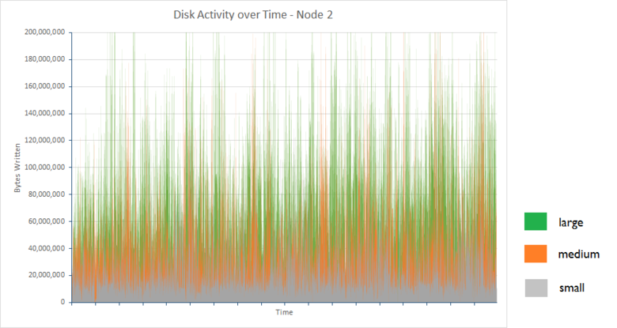

<properties
   pageTitle="調整資料 ingestion 效能的 Elasticsearch 上 Azure |Microsoft Azure"
   description="請參閱如何最大化 Elasticsearch 上 Azure 資料 ingestion 效能。"
   services=""
   documentationCenter="na"
   authors="dragon119"
   manager="bennage"
   editor=""
   tags=""/>

<tags
   ms.service="guidance"
   ms.devlang="na"
   ms.topic="article"
   ms.tgt_pltfrm="na"
   ms.workload="na"
   ms.date="09/22/2016"
   ms.author="masashin"/>

# <a name="tuning-data-ingestion-performance-for-elasticsearch-on-azure"></a>調整資料 ingestion 效能的 Elasticsearch Azure 上

[AZURE.INCLUDE [pnp-header](../../includes/guidance-pnp-header-include.md)]

本文是[一系列的一部分](guidance-elasticsearch.md)。 

## <a name="overview"></a>概觀

判斷結構系統來快速並有效率地內嵌可搜尋資料的最佳方式可建立任何搜尋資料庫時，重要。 周圍這項需求的考量有關不僅基礎結構實作系統，但也可協助確保系統可以預期的層級的資料蜂擁保留，您可以使用各種最佳化的選項。 

這份文件將說明您應該考慮實作 Elasticsearch 叢集預期資料 ingestion 率的部署及設定選項。 若要提供便於實心的資料，這份文件也會顯示結果的基準使用簡單的大量資料 ingestion 工作負載的不同設定。 在這份文件結尾處[附錄](#appendix-the-bulk-load-data-ingestion-performance-test)說明工作負載的詳細資料。

基準的目的是不是用來產生執行 Elasticsearch 絕對的效能數字或甚至建議的特定拓撲，但而說明您可以使用評估效能、 縮放資料節點及實作叢集符合您自己的效能需求的方法。 

調整您的系統時重要測試徹底根據自己的工作負載的效能。 收集遙測可讓您取得使用，最佳的硬體設定的相關資訊，以及您應該考慮的水平縮放比例因素。 特別是，您應該︰

- 請考慮承載的整體大小並不只是每個大量插入邀請中的項目數目。 較小的數字的每個邀請中的大量項目可能是較佳比較大的數字，根據資源可用於處理每個要求。

您可以監視的不同大量插入要求使用[Marvel](https://www.elastic.co/products/marvel)，使用*readbytes*效果/*writebytes* I/O 計數器與[JMeter](https://jmeter.apache.org/)，及工具*iostat*等*vmstat* Ubuntu 上的作業系統。 

- 進行效能測試和收集遙測量值 CPU 處理和 I/O 等待的時間、 磁碟延遲，處理量，和回應時間。 這項資訊可協助找出可能的障礙和評估成本與使用進階版儲存空間的優點。 請記住，CPU 和磁碟使用可能會根據方式的所有節點筆記本甚或擊碎和複本分散到叢集 （某些節點可包含多個擊碎與其他人）。

- 請考慮如何數的一個要求您的工作量分佈叢集] 及 [評估使用不同的數字的節點處理此工作負載的影響。

- 請考慮如何負載可能會變大時企業展開。 評估此 Vm 和節點使用的儲存空間的成本的擴充的影響。

- 辨識的叢集使用較大的一般磁碟的節點數目可能經濟型如果您的狀況需要大量的要求，而且磁碟基礎結構維護符合您服務等級協定 (SLA) 的處理量。 不過，增加的節點數目可能會導致在其他節點間通訊和同步處理的形式。

- 瞭解有更多的每個節點的核心可能會產生更多的磁碟流量在處理文件。 在此情況下，測量磁碟使用評估是否 I/O 子系統可能會變成瓶頸決定使用進階版儲存空間的優點。

- 測試並分析取捨編號更高的較少的核心與使用更多核心較少的節點的節點。 請記住，增加複本數目提報叢集的需求，並可能會要求您新增的節點。

- 請考慮使用暫時磁碟可能需要索引有更頻繁地復原。

- 量值來評估容量，並在 [使用情況的儲存空間的儲存空間大量使用方式。 例如，案例中儲存為 1.5 來計算億文件使用 350 GB 的儲存空間。

- 測量您的工作負載的檔案傳輸速度，請考慮如何關閉您可能會收到任何您在其中建立虛擬磁碟的特定的儲存帳戶總 I/O 工資率傳輸限制。

## <a name="node-and-index-design"></a>節點和索引設計

在必須支援大型資料 ingestion 系統中，您可以要求下列問題︰

- **是的資料，快速移動或變動？** 更動態的資料、 大於維護成本 Elasticsearch。 如果將複製資料時，每個複本保持同步。 快速移動的資料有只限制為單位的週期或，可以輕鬆更新可能會因整個停用複寫。 這個選項，[] 區段中所提及[調整大規模資料 ingestion。](#tuning-large-scale-data-ingestion)

- **您如何更新需要透過搜尋找到要的資料？** 若要維持效能，Elasticsearch 緩衝的資料量在記憶體中，可以。 這表示所有的變更會立即可供搜尋的要求。 Elasticsearch 使用固定的變更，並使其顯示程序，請參閱[持續性進行變更](https://www.elastic.co/guide/en/elasticsearch/guide/current/translog.html#translog)。 

    工資率資料會顯示由*重新整理\_間隔*設定的相關的索引。 根據預設，此間隔] 設定成 1 秒。 不過，不是每一種情況需要重新整理快速發生此。 例如，錄製記錄資料的索引可能需要應付快速且連續的流入需要快速，ingested，但不需要的資訊會立即可供查詢的資訊。 在此情況下，請考慮降低重新整理的頻率。 此功能也一節所述[調整大規模資料 ingestion。](#tuning-large-scale-data-ingestion)

- **快速是可能會變大的資料？** 索引容量取決於擊碎時建立索引所指定的數目。 若要允許等比級數，指定擊碎 （預設為 5） 中有足夠的數目。 所有的五個擊碎如果單一節點一開始建立索引時，會位於節點，但隨著資料量增加額外可以新增節點並 Elasticsearch 會動態分散擊碎節點。 不過，每個晶怪有開銷。 所有的搜尋索引中查詢所有擊碎，以便建立大量擊碎少量的資料的速度變慢 （避免[Kagillion 擊碎](https://www.elastic.co/guide/en/elasticsearch/guide/current/kagillion-shards.html)案例） 的資料擷取。

    （例如記錄） 的一些負載可能會建立新的索引，每一天，而且如果您發現擊碎數不足的大量資料，您應該變更之前再建立下一個索引 （現有的索引不會受到影響）。 如果您必須將現有資料分散更多擊碎，其中一個選項是重新建立索引的資訊。 建立新的索引，以適當的設定，並將資料複製到其。 此程序可透明應用程式使用[index 別名](https://www.elastic.co/guide/en/elasticsearch/reference/current/indices-aliases.html)。

- **資料是否需要之間 multitenancy 情境中的使用者？** 您可以建立個別的索引，為每位使用者，但會很高如果每位使用者只有中等資料量。 不過，請考慮建立[共用的索引](https://www.elastic.co/guide/en/elasticsearch/guide/current/shared-index.html)，並使用[別名根據篩選](https://www.elastic.co/guide/en/elasticsearch/guide/current/faking-it.html)直接要求的每位使用者資料。 若要將使用者的資料放在一起保持在相同的晶怪，覆寫預設路由設定編製索引及傳送資料根據使用者的一些識別屬性。

- **是長或短的資料？** 如果您使用一組 Azure Vm 實作 Elasticsearch 叢集，您可以儲存在本機資源系統磁碟，而不是連結的磁碟機上的暫時資料。
使用利用的資源磁碟 SSD VM SKU 可以改善 I/O 效能。 不過，保留資源磁碟上的任何資訊會暫時，而且如果 VM 重新啟動 （請參閱 [] 區段中時將資料暫時磁碟機會遺失[了解暫存的磁碟機上的 Microsoft Azure 虛擬機器](http://blogs.msdn.com/b/mast/archive/2013/12/07/understanding-the-temporary-drive-on-windows-azure-virtual-machines.aspx)中的更多詳細資料） 可能會遺失。 如果您要保留重新啟動之間的資料，請建立按住這項資訊，並將其附加至 VM 資料磁碟。

- **如何使用中是資料？** Azure Vhd 有恕節流如果的讀/寫活動超過指定的參數 （目前 500 輸入輸出秒作業 (IOPS) 附加至標準層 VM 及進階版儲存空間的磁碟 5000 IOPS 磁碟）。 

    若要降低節流的機會，並增加 I/O 效能，請考慮建立多個資料磁碟的每個 VM 及設定 Elasticsearch 等量資料在這些磁碟[磁碟與檔案系統需求](guidance-elasticsearch-running-on-azure.md#disk-and-file-system-requirements)所述。

    您應該選擇最小化的磁碟 I/O 讀取確保足夠的記憶體有經常存取的快取資料的作業可協助硬體設定。 這是 Azure 上所述執行 Elasticsearch 的[記憶體需求](guidance-elasticsearch-running-on-azure.md#memory-requirements)一節。

- **每個節點會需要何種類型的工作量來支援？** Elasticsearch 受益有快取資料 （在表單中的 [檔案系統快取） 可用的記憶體和 JVM 堆積如下節所述[的記憶體需求](guidance-elasticsearch-running-on-azure.md#memory-requirements)的執行 Elasticsearch Azure 上。 

    記憶體數量，CPU 核心數] 及 [數量的可用磁碟是由設定 SKU 的虛擬機器。 如需詳細資訊，請參閱 Azure 網站上的[虛擬機器價格](http://azure.microsoft.com/pricing/details/virtual-machines/)。

### <a name="virtual-machine-options"></a>虛擬機器選項

您可以提供 Vm 中 Azure 使用不同的 Sku 的數字。 Azure VM 可用的資源而定 SKU 已選取。 每個 SKU 提供不同混合核心、 記憶體和儲存空間。 必須先選取適當的大小的 VM 的會處理預期的工作量，但也可將證明效益。
開始設定，符合您目前的需求 （執行效能若要測試，這份文件稍後所述）。 您可以稍後調整叢集，藉由新增更多 Vm 執行 Elasticsearch 節點。

Azure 網站上的[虛擬機器大小](../virtual-machines/virtual-machines-linux-sizes.md)Vm 之文件的各種選項和 sku 皆可使用。

您應該相符的大小與資源 VM VM 上執行的節點將執行的角色。

資料節點︰

- 最多配置 30 GB 或 50%的可用的 RAM 記憶體 java 堆積，無論是較低。 將作業系統使用快取檔案的其餘部分。 如果您使用的 Linux，您可以指定的記憶體配置 Java 堆積設定 ES\_堆積\_大小環境變數，才能執行 Elasticsearch。 或者，如果您使用的 Windows 或 Linux，您可以規定*Xmx*和*Xms*參數的記憶體大小，當您啟動 Elasticsearch。

    根據工作量，較少的大型 Vm 可能無法為有效地使用較大的數字的中度的尺寸 Vm 的效能。 您應該進行可以測量必須做的取捨之間的其他網路流量及維護成本增加可用的核心數] 及 [每個節點的精簡的磁碟競爭與相關的測試。

- 使用進階版儲存空間來儲存 Elasticsearch 資料。 這被討論的 [[儲存選項](#storage-options)] 區段中的更多詳細資料。

- 在這些磁碟使用相同的大小和等量資料的多個磁碟。 您的 Vm 的 SKU 將指定的數目上限，您可以附加的資料磁碟。 如需詳細資訊，請參閱[磁碟與檔案系統需求](guidance-elasticsearch-running-on-azure.md#disk-and-file-system-requirements)。

- 使用至少 2 核心，最好是 4 個或多個多核心 CPU SKU。 

用戶端節點︰

- 沒有磁碟儲存空間配置 Elasticsearch 資料、 用戶端專用不要儲存磁碟上的資料。

- 請確定有足夠的記憶體可用來處理工作負載。 大量插入要求讀取將資料傳送到不同的資料節點之前, 的記憶體和彙總及查詢的結果傳回用戶端應用程式之前，會保留在記憶體中。 基準測試您的工作量，並監控所使用的工具，例如 Marvel 或使用*節點/stats* API 傳回[JVM 資訊](https://www.elastic.co/guide/en/elasticsearch/guide/current/_monitoring_individual_nodes.html#_jvm_section)的記憶體使用量 (`GET _nodes/stats`) 若要評估的最佳的需求。  特別監控*堆積\_使用\_百分比*公制每個節點及堆積大小] 下方的 [可用的空間 75%的目的。

- 請確定足夠的 CPU 核心可接收並處理預期的大量要求。
要求佇列已接收之前處理，並會佇列的項目音量 CPU 核心每個節點的數字的函數。 您可以監視佇列長度使用節點/stats API 傳回的[資訊集區](https://www.elastic.co/guide/en/elasticsearch/guide/current/_monitoring_individual_nodes.html#_threadpool_section)中使用的資料。 

    如果佇列*拒絕*計數指出要求會被拒，這表示叢集為開始的限制。 這可能是因為 CPU 的頻寬，但可能也是因為其他因素，例如缺乏超出記憶體或 I/O 效能變慢，所以使用這項資訊搭配其他統計值以協助您判斷根本原因。

    用戶端節點可能，或可能不會有必要，請根據您的工作量。 資料 ingestion 負載不會因使用專用的用戶端，而有些搜尋和彙總可以更快速地執行。 要準備基準測試您自己的案例。

    用戶端節點是主要用於連線至叢集使用傳輸用戶端 API 的應用程式。 您也可以使用節點的用戶端 API，以動態方式建立的專用用戶端應用程式，使用的應用程式主機環境的資源。 如果您的應用程式使用節點用戶端 API，然後將其不可能需要以包含預先設定專用的用戶端節點叢集。 
    
    不過，請注意，使用用戶端節點的 API 建立的節點是最高級叢集的成員，例如參與網路通話，與其他節點。 經常啟動和停止用戶端節點可以建立不需要噪音整個叢集。

母片的節點︰

- 沒有磁碟儲存空間配置 Elasticsearch 資料、 專用的主版節點不要儲存磁碟上的資料。

- CPU 需求應該最低。

- 記憶體需求取決於叢集的大小。 叢集狀態的相關資訊，保留在記憶體中。 小型叢集的所需的記憶體很少，但大型的高度活躍叢集，經常和移動擊碎位置建立索引，狀態資訊的數量可能會大幅增長。 監控 JVM 堆積大小，來判斷您是否要新增更多的記憶體。

> [AZURE.NOTE]叢集可靠性永遠建立多個主節點，並設定剩餘的節點，以避免分割大腦發生的可能性。 理想的情況下，應該奇數的主版節點。 本主題是所述[設定可靠度和修復 Elasticsearch 上 Azure][]中的更多詳細資料。

### <a name="storage-options"></a>儲存選項

有許多儲存空間的選項上可 Azure Vm 使用不同的取捨影響效能、 可用性及復原您需要請仔細考慮的成本。

請注意，應該 Elasticsearch 資料儲存在磁碟上專用的資料。  這是為了降低競爭與作業系統，並確保大量 Elasticsearch I/O，不會競爭 I/O 資源的作業系統函數。

Azure 的磁碟是效能限制。 如果您發現叢集期經歷的活動的週期性高速量可能會降低 I/O 要求。 若要避免此問題，調整您要平衡 Elasticsearch 中的文件大小，對大量要求可能會收到的每個磁碟的設計。

根據標準的儲存空間的磁碟支援 500 IOPS 最大要求工資率，而根據進階版儲存空間的磁碟可以運作，多達 5000 個 IOPS，根據資料磁碟的大小。 進階版儲存空間的磁碟只適用於 Vm DS 與 GS 系列。 若要尋找最大磁碟 IOPS 的虛擬記憶體大小，請參閱[在 Azure 虛擬機器的大小](../virtual-machines/virtual-machines-linux-sizes.md)。 與磁碟大小配置虛擬記憶體大小取決於進階版儲存空間的效能。 如需詳細資訊，請參閱[進階版儲存空間︰ Azure 虛擬機器負載高效能儲存空間](../storage/storage-premium-storage.md)。

**常設資料磁碟**

持續性資料磁碟是 Azure 儲存備份的 Vhd。 如果 VM 需要重新建立主要失敗後，現有 Vhd 可以輕鬆地附加至新的 VM。 Vhd 可以建立根據標準 （旋轉媒體） 的儲存空間或進階版儲存空間 (SSDs)。 如果您想要使用 SSDs 您必須建立 Vm 使用 DS 數列或較高的。 DS 機器成本相當於 D 數列 Vm 相同，但您使用進階版儲存空間的額外收費。

在每個磁碟的最大傳輸率哪裡不足支援預期工作負載的情況下，請考慮建立多個資料磁碟和允許 Elasticsearch[條紋這些磁碟上的資料](guidance-elasticsearch-running-on-azure.md#disk-and-file-system-requirements)，或實作[RAID 0 等量使用虛擬磁碟](../virtual-machines/virtual-machines-linux-configure-raid.md)系統層級。

> [AZURE.NOTE]在 Microsoft 的經驗顯示使用 RAID 0 是益處平滑的 I/O 效果*spiky*產生活動的常見高速量的工作量。

在本機上重複使用進階版 (或在本機上多餘的低層次或問與答負載) 拿著磁碟; 儲存帳戶的儲存空間跨地區、 區域複寫不需要 Elasticsearch 高可用性。 

**暫時磁碟**

使用根據 SSDs 常設磁碟需要建立 Vm 支援進階版儲存空間。 這會有價格含意。 使用本機暫時磁碟存放 Elasticsearch 資料可適度調整大小的節點要求到大約 800 GB 的儲存空間的成本有效解決方案。 在 [標準 D 系列的 Vm]，暫時磁碟使用實作 SSDs 提供更大的效能與多較低的延遲時間，比一般的磁碟

使用 Elasticsearch，效能可以是等於使用進階版儲存空間，不需產生的成本，請參閱一節[地址設定磁碟延遲問題](#addressing-disk-latency-issues)，如需詳細資訊。

部落格文章[D 數列效能期望](https://azure.microsoft.com/blog/d-series-performance-expectations/)中所述的 VM 的大小限制中暫時儲存空間的量。

例如，標準\_D1 VM 提供 50 GB 的暫時儲存空間，標準\_D2 VM 有 100 GB 的暫時儲存空間及 [標準]\_D14 VM 提供 800 GB 的暫時的空間。 針對叢集節點只需要，D 數列 VM 使用暫時儲存可以是空間的成本有效。

您必須平衡用於暫時針對時間與成本重新啟動電腦之後，復原此資料的儲存空間的提高處理能力。 如果 VM 移到不同的主機伺服器，如果主機會更新，或如果主機遇到硬體失敗，暫時磁碟的內容都會遺失。 如果資料本身有限制為單位的週期遺失這些資料可能可以接受。 存留較久的資料，它可能重建索引，或從備份檔案還原遺失的資訊。 就可以使用其他 Vm 上的複本，可能會遺失的最小化。

> [AZURE.NOTE]不要使用**單一**VM 存放生產的資料。 如果節點失敗，所有的資料無法使用。 重要資訊，請確定資料會複寫上至少一個其他節點。

**Azure 檔案**

[Azure 檔案的服務](http://blogs.msdn.com/b/windowsazurestorage/archive/2014/05/12/introducing-microsoft-azure-file-service.aspx)，提供共用的檔案存取使用 Azure 儲存體。 您可以建立的檔案共用，您可以裝載 Azure Vm 上。 多個 Vm 可以裝載相同的檔案共用，讓他們能夠存取相同的資料。

基於效能，不建議，您使用的檔案共用保留不需要共用節點的 Elasticsearch 資料的一般資料磁碟更適合此用途。 檔案共用可用於建立 Elasticsearch[陰影複本索引](https://www.elastic.co/guide/en/elasticsearch/reference/current/indices-shadow-replicas.html)。 不過，此功能目前實驗，而不應實作生產環境中這一次。 因此，陰影索引不會考慮進一步本指南中。

**網路選項**

Azure 實作共用網路配置。 使用相同的硬體機架 Vm 競爭使用網路資源。 因此可用的網路頻寬可能會根據一天的時間，以及每日週期的共用相同的實體網路基礎結構的 Vm 上執行的工作。 您有小型控制這些因素。 請務必瞭解網路效能的可能會隨著時間波動，因此會相應地設定使用者的期望。

## <a name="scaling-up-nodes-to-support-large-scale-data-ingestion"></a>縮放比例設定為支援大型資料 ingestion 節點

您可以建立使用合理中等的硬體 Elasticsearch 叢集，然後擴充或擴充的資料量的規模擴大時，並要求的數目會增加。 Azure 您調較大和較昂貴 Vm 」 上執行或您可以向外使用其他的較小且便宜 Vm。 

您也可能會執行兩個策略的組合。 所有情況下，沒有一體解決方案，因此評估特定的情況下必須先準備好進行數列效能的最佳方法測試。

向上調整方法有關此區段、 [] 區段中所提及縮放比例出[出縮放比例︰ 做出結論](#scaling-out-conclusions)。
本節描述一系列的針對一組包含各種大小的 Vm Elasticsearch 叢集所執行的基準測試的結果。 叢集已指定為小型、 中型和大型。 下表摘要列出配置給每個叢集 Vm 的資源。

| 叢集 | VM SKU      | 核心的數量 | 數字的資料磁碟 | 大的 RAM  |
|---------|-------------|-----------------|----------------------|------|
| 小型   | 標準 D2 | 2               | 4                    | 7 GB  |
| 媒體  | 標準 D3 | 4               | 8                    | 14 GB |
| 大型   | 標準 D4 | 8               | 16                   | 28 GB |

每個 Elasticsearch 叢集包含 3 的資料節點。 這些資料節點處理用戶端的要求，以及處理處理資料。 另一個用戶端節點已經無法使用，因為他們所提供的測試資料 ingestion 案例小獲得的好處。 叢集也包含三個主要的節點，其中的選擇來協調叢集 Elasticsearch。

使用 Elasticsearch 1.7.3 用於執行測試。 測試上叢集執行 Ubuntu Linux 14.0.4，一開始執行，並重複使用 Windows Server 2012。 [附錄](#appendix-the-bulk-load-data-ingestion-performance-test)說明測試所執行的工作負載的詳細資料。

### <a name="data-ingestion-performance--ubuntu-linux-1404"></a>資料 ingestion 效能-Ubuntu Linux 14.0.4

下表摘要列出整體執行每個設定的兩個小時檢定的結果︰

| 設定 | 範例計數 | 平均回應時間 （毫秒） | 處理量 (作業/s) |
|---------------|--------------|----------------------------|---------------------------|
| 小型         | 67057        | 636                        | 9.3                       |
| 媒體        | 123482       | 692                        | 17.2                      |
| 大型         | 197085       | 839                        | 27.4                      |

處理量和數字的範例處理三種設定都是在大約比 1:2:3。 不過，可用的記憶體、 CPU 核心及磁碟的資源，有比 1:2:4。 它是水彩值得調查中評估為何，這可能是大小寫叢集節點的低功率效能詳細資料。 這項資訊有助於判斷是否有限制向上和最好是將縮放比例。 

### <a name="determining-limiting-factors-network-utilization"></a>決定限制因素︰ 網路使用量

Elasticsearch 是取決於有足夠的網路頻寬支援的用戶端的要求，以及叢集節點之間的同步處理資訊蜂擁。 為醒目提示，有限控制頻寬可用性，例如在和其他共用相同的網路基礎結構的 Vm 的目前網路負載的資料中心的諸多變數而定。 不過，則仍討論網路活動的每個叢集，請確認沒有過多的流量。 下圖顯示的節點 2 個叢集 （每個叢集的其他節點的區是非常類似） 中所收到的網路流量的比較。


每秒的兩個小時內的每個叢集設定中的節點 2 接收平均位元組如下所示︰

| 設定 | 接收位元組/秒的平均數目 |
|---------------|--------------------------------------|
| 小型         | 3993640.3                            |
| 媒體        | 7311689.9                            |
| 大型         | 11893874.2                           |

系統執行**穩定**狀態時，所進行測試。 在情況位置重新建立索引或節點復原已發生，同時按住主要的節點和複本擊碎之間的資料傳輸可以產生嚴重網路流量。 文件[設定可靠度及復原上 Azure Elasticsearch][]更多說明此程序的效果。

### <a name="determining-limiting-factors-cpu-utilization"></a>決定限制因素︰ CPU 使用率

要求已處理的率至少部分受到可用處理容量。 Elasticsearch 接受大量大量插入邀請插入佇列。 每個節點有大量的一組插入佇列由可用的處理器數目。 根據預設，有一個佇列中的每個處理器按住每個佇列可以超過 50 個未完成的要求開始前，就會被拒絕。 

應用程式應該的並不會以 overspill 佇列傳送邀請。 一次每個佇列中的項目數，即將成為的用戶端應用程式傳送邀請工資率] 和 [這些相同的要求會擷取及處理 Elasticsearch 速率函數。 因此，有一個重要的統計資料擷取錯誤工資率彙總下表中的疑慮。

| 設定 | 總計的範例 | 錯誤計數  | 錯誤工資率 |
|---------------|---------------|--------------|------------|
| 小型         | 67057         | 0            | 0.00%      |
| 媒體        | 123483        | 1            | 0.0008%    |
| 大型         | 200702        | 3617         | 1.8%      |

每個這些錯誤被因下列 Java 例外狀況︰

```
org.elasticsearch.action.support.replication.TransportShardReplicationOperationAction$PrimaryPhase$1@75a30c1b]; ]
[219]: index [systembase], type [logs], id [AVEAioKb2TRSNcPa_8YG], message [RemoteTransportException[[esdatavm2][inet[/10.0.1.5:9300]][indices:data/write/bulk[s]]]; nested: EsRejectedExecutionException[rejected execution (queue capacity 50)
```

增加佇列數目，及/或每個佇列中的長度可能會減少的錯誤，但這種方法可以只應付的簡短工期高速量。 執行此動作執行一系列持續的資料 ingestion 任務時，將會直接延遲錯誤開始發生點。 此外，這項變更將不會提高處理，並可能傷害要求會處理之前再佇列的用戶端應用程式的回應時間。

5 擊碎 1 複本 （10 擊碎所有中的），結果太大的不平衡中載入之間集中節點中的預設索引結構，兩個節點將包含三個擊碎時其他節點將包含四個。 忙碌節點是最有可能的項目最，限制處理量的原因是，為每個案例中已選取這個節點。 

下列圖形的集合說明忙碌中每個叢集節點的 CPU 使用率。


小型、 中型和大型叢集，這些節點的平均 CPU 使用率已 75.01%64.93%] 及 [64.64%。 少會使用實際點擊 100%，使用率卸除節點和可用的 CPU power 可用增加的大小。 CPU power 因此不是限制的大型叢集效能的因素。

### <a name="determining-limiting-factors-memory"></a>決定限制因素︰ 記憶體

記憶體使用量是會影響效能的另一個重點。 測試，Elasticsearch 配置 50%的可用的記憶體。 這是與排列[文件的建議](https://www.elastic.co/guide/en/elasticsearch/guide/current/heap-sizing.html#_give_half_your_memory_to_lucene)。 時所執行的檢定，JVM 監視多餘回收集合活動 （堆積記憶體缺乏的指示）。 在所有的情況下，堆積大小穩定，JVM 出現低回收集合活動。 以下螢幕擷取畫面顯示 Marvel，快照短時間內醒目提示的索引鍵 JVM 統計資料，測試大型叢集上執行時。


***JVM 記憶體和記憶體回收集合活動大型叢集上。***

### <a name="determining-limiting-factors-disk-io-rrates"></a>決定限制因素︰ 磁碟 I/O rRates

剩餘實際伺服器端的可能會限制效能功能磁碟 I/O 子系統的效能。 下列圖表會比較位元組為忙碌中每個叢集節點的磁碟活動。

 

下表顯示兩個小時內的每個叢集組態中的節點 2 秒寫入的平均位元組︰

| 設定 | 撰寫秒位元組的平均數目 |
|---------------|-------------------------------------|
| 小型         | 25502361.94                         |
| 媒體        | 48856124.5                          |
| 大型         | 88137675.46                         |

撰寫的資料量增加數字的要求正在處理的是叢集，但 I/O 速率 Azure 儲存空間限制內 （建立使用 Azure 儲存空間的磁碟可以支援持續的率 10s 100 s MB/s，取決於是否使用標準或進階版的儲存空間）。 檢查的時間等待磁碟 I/O 協助說明磁碟處理能力為何低於理論的最大值。 圖形和下表顯示這些相同的三個節點的統計資料︰

> [AZURE.NOTE]磁碟等待時間開始計算監視 CPU 時間的處理器遭到封鎖等待 I/O 作業完成的百分比。


| 設定 | 平均磁碟等候 CPU 時間 （%） |
|---------------|--------------------------------|
| 小型         | 21.04                          |
| 媒體        | 14.48                          |
| 大型         | 15.84                          |

此資料會指出等待磁碟 I/O 完成花費大部分的 CPU 之間的時間 （幾乎 16%21%）。 這限制 Elasticsearch 來處理要求及儲存資料的能力。

測試期間，大型叢集插入超過**五 100 萬個文件**。 允許測試，以繼續顯示，等待的時間大幅增加資料庫時包含超過六 100 萬個文件。 這種行為的理由不完全調查，但可能會因為磁碟分割造成磁碟的延遲。 

在多個節點增加叢集的大小，也許可以協助減輕這種行為的效果。 在非常情況下可能必須重組磁碟顯示太多 I/O 時間。 不過，重組大型的磁碟可能會花很長的時間 （可能是多個 48 小時為 2 TB VHD 磁碟機），且只重新格式化磁碟機，並允許從複本擊碎復原資料遺失 Elasticsearch 可能的加值的方法。

### <a name="addressing-disk-latency-issues"></a>處理磁碟延遲問題

測試一開始執行使用 Vm 設定標準的磁碟。 標準的磁碟根據旋轉媒體，因此受到旋轉延遲和其他瓶頸，可以將限制 I/O 費率。 Azure 也提供進階版儲存空間的磁碟使用建立 SSD 裝置。 這些裝置有無旋轉的延遲，而且結果應該提供改良的 I/O 速度。 

下表將比較標準磁碟取代大型叢集中的進階版磁碟的結果 （標準 D4 Vm 大型叢集所取代標準 DS4 Vm; 數核心、 記憶體和磁碟已在這兩種情況下，唯一不同相同在於 DS4 Vm 使用 SSDs）。

| 設定    | 範例計數 | 平均回應時間 （毫秒） | 處理量 (作業/s) |
|------------------|--------------|----------------------------|---------------------------|
| 大型-標準 | 197085       | 839                        | 27.4                      |
| 大型-付費  | 255985       | 581                        | 35.6                      |

平均處理量幾乎 4 回應時間已明顯更好的所產生的小型叢集的 x。 這是更多與標準 DS4 VM 可用的資源。 平均 CPU 使用率中的忙碌節點叢集 （在本例中的節點 1） 增加時，它所花費的時間等待 I/O 完成︰


當您考慮下圖顯示的忙碌節點這個統計資料放到約 1%平均時，成為明顯降低磁碟等待的時間︰


有支付此改進，不過價格。 增加 10 到 35797 （12.3%) factor ingestion 錯誤的數字。 同樣地，這些錯誤大多大量的結果插入佇列溢位。 硬體現在會出現執行容量關閉，可能需要新增更多節點或節流大量插入以減少錯誤的音量率。 這份文件稍後會討論這些問題。

### <a name="testing-with-ephemeral-storage"></a>使用暫時儲存測試

叢集上的 [使用暫時儲存 D4 Vm 重複執行相同的測試。 在 D4 Vm 暫時儲存被當作單一 400 GB SSD。 範例處理、 回應時間及處理量的數字的所有叢集根據 DS14 Vm 與進階版儲存報告的數字十分相似。

| 設定                     | 範例計數 | 平均回應時間 （毫秒） | 處理量 (作業/s) |
|-----------------------------------|--------------|----------------------------|---------------------------|
| 大型-付費                   | 255985       | 581                        | 35.6                      |
| 大 – 標準 （暫時磁碟） | 255626       | 585                        | 35.5                      |

錯誤工資率也是類似 （33862 失敗登出 289488 要求總計 – 11.7%）。

下圖顯示 CPU 使用率，磁碟等待叢集 （節點 2 這次） 忙碌節點的統計資料︰


!(media/guidance-elasticsearch/data-ingestion-image13.png

如此一來，單獨的效能來說，使用暫時儲存可能被視為加值比使用進階版儲存空間方案。

### <a name="data-ingestion-performance--windows-server-2012"></a>資料 ingestion 效能-Windows Server 2012

相同的測試重複執行一組 Elasticsearch 叢集使用執行 Windows Server 2012 的節點。 這些測試的目的是要建立何種效果]，如果有的話，作業系統的選項可能會對叢集效能。

若要描繪出的 Windows 上 Elasticsearch 延展性下, 表顯示達成小型、 中型及大型叢集設定的處理量及回應的時間。 請注意，這些測試已所有執行與 Elasticsearch 設定為使用 SSD 暫時儲存空間，測試，以 Ubuntu 有顯示磁碟延遲是可能的重要因素達到最大的效能︰

| 設定 | 範例計數 | 平均回應時間 （毫秒） | 處理量 (作業/s) |
|---------------|--------------|----------------------------|---------------------------|
| 小型         | 90295        | 476                        | 12.5                      |
| 媒體        | 169243       | 508                        | 23.5                      |
| 大型         | 257115       | 613                        | 35.6                      |

這些結果表示 Elasticsearch 虛擬記憶體大小和可用的資源，在 Windows 上的縮放比例。

下表將比較大叢集 Ubuntu 及 Windows 上的結果︰

| 作業系統 | 範例計數 | 平均回應時間 （毫秒） | 處理量 (作業/s) | 錯誤工資率 （%） |
|------------------|--------------|----------------------------|---------------------------|----------------|
| Ubuntu           | 255626       | 585                        | 35.5                      | 11.7           |
| Windows          | 257115       | 613                        | 35.6                      | 7.2            |

雖然回應時間的位置略有較高，不一致的大型 Ubuntu 叢集，處理量。 這可能會一併的較低的錯誤比率 （會比成功作業更快速地報告錯誤，因此有較低的回應時間）。

Windows 監控工具所提報的 CPU 使用率已稍微高於 Ubuntu。 不過，您應該將度量單位，例如這些作業系統非常謹慎的方式不同作業系統報告這些統計資料之間的比較。 此外，CPU 所花費的時間等待 I/O 龐大的磁碟延遲的詳細資訊不適用於相同的方式一樣 Ubuntu。 很重要的一點是 CPU 使用率處於高，表示的時間所花費的等待 I/O 很低︰


### <a name="scaling-up-conclusions"></a>向上︰ 結論

微調叢集 Elasticsearch 效能有可能上 Windows 和 Ubuntu 和，其比例向上以類似的圖樣，在這兩種作業系統上。 最佳效能，請**使用進階版 Elasticsearch 資料的儲存空間**。

## <a name="scaling-out-clusters-to-support-large-scale-data-ingestion"></a>支援大型資料 ingestion 叢集出縮放比例

擴展是免費的方法向上調查前一節。 Elasticsearch 的重要功能是既有的水平延展性內建在軟體。 增加叢集大小是簡單的新增更多節點。 您不需要執行任何手動作業轉散發索引或擊碎為這些工作的自動處理，但還有其他設定選項可供使用，您可以使用此程序會影響。 

新增更多節點協助跨多個機器分配載入以提升效能。 當您新增更多節點，您可能也需要考慮重新索引增加擊碎可用的數字的資料。 建立有更多擊碎比有可用的節點的一開始的索引，您可優先進行某種程度此程序。 進一步節點新增時，可以發佈擊碎。

除了善用 Elasticsearch 的水平延展性，還有其他原因實作有更多擊碎比節點的索引。 每個晶怪被當作個別的資料結構 （索引[Lucene](https://lucene.apache.org/) ），而且有維護一致性及處理並行自己內部機制。 建立多個擊碎有助於增加平行節點，並可改善效能。 

不過，維護效能時縮放比例取得平衡。 更多的節點，擊碎叢集包含更多的投入比資格同步處理叢集，可以減少所執行的工作。 任何指定的工作負載有最佳的設定充分發揮 ingestion 進行的維修作業開銷最小化時的效能。 此設定會依賴的工作量及叢集; 性質具體來說，的大量、 大小和文件、 用以 ingestion 發生，工資率和硬體系統執行的內容。  

本節摘錄了調查將縮放叢集保障支援使用先前所述的效能測試工作負載的結果。 使用 Vm 根據大型的 VM 大小 (8 CPU 核心、 與 16 資料磁碟 28 GB 的 RAM 標準 D4) 執行相同的測試執行叢集上 Ubuntu Linux 14.0.4，但設定節點及擊碎不同的數字。 結果不打算會明確他們只會套用到某個特定案例中，但是他們可以做為可協助您要分析的叢集，水平延展性絕佳起點，並產生的最佳比例擊碎最符合您自己的需求的節點的數字。

### <a name="baseline-results--3-nodes"></a>比較基準結果-3 節點

若要取得比較基準圖，資料 ingestion 效能測試執行針對 3 節點叢集 5 擊碎與 1 的複本。 這是 Elasticsearch 索引的預設設定。 在此組態中，Elasticsearch 分配 2 的主要擊碎節點，2，剩餘的主要晶怪儲存在上的第三個節點。 下表摘要列出而言大量 ingestion 作業秒的處理能力和數字的測試成功已儲存的文件。

> [AZURE.NOTE] 請遵循此區段中的資料表，請在的主要擊碎會顯示為以虛線分隔每個節點的數字。 例如，5 晶怪 3 節點版面配置如下 2-2-1。 未指定的複本擊碎版面配置。 他們會遵循主要擊碎類似的配置。

| 設定 | 文件計數 | 處理量 (作業/s)   | 晶怪版面配置 |
|---------------|----------------|-----------------------------|--------------|
| 5 擊碎      | 200560412      | 27.86                       | 2-2-1        |

### <a name="6-node-results"></a>6-節點結果

6 節點叢集上重複進行測試。 這些測試的目的是要嘗試，確定更精確地儲存多個晶怪節點上的效果]。

| 設定 | 文件計數 | 處理量 (作業/s)   | 晶怪版面配置 |
|---------------|----------------|-----------------------------|--------------|
| 4 擊碎      | 227360412      | 31.58                       | 1-1-0-1-1-0  |
| 7 擊碎      | 268013252      | 37.22                       | 2-1-1-1-1-1  |
| 10 擊碎     | 258065854      | 35.84                       | 1-2-2-2-1-2  |
| 11 擊碎     | 279788157      | 38.86                       | 2-2-2-1-2-2  |
| 12 擊碎     | 257628504      | 35.78                       | 2-2-2-2-2-2  |
| 13 擊碎     | 300126822      | 41.68                       | 2-2-2-2-2-3  |

指出下列趨勢，會出現下列結果︰

* 每個節點的更多擊碎皆可改善處理量。 使用每個節點建立這些測試擊碎少量，這種現象預期，基於稍早所述。

* 奇數擊碎可提供較佳的效能與偶數。 原因*如果這是較不清除，但它可能路由演算法 Elasticsearch 使用的是更能在此情況下，將資料分散擊碎前置零每個節點的更多偶數負載*。

若要測試這些假設，較大的數字的擊碎執行數個進一步的測試。 從 Elasticsearch 建議，在我們決定使用擊碎質數針對每個測試這些問題的範圍為奇數頁的數字的合理分配。

| 設定 | 文件計數 | 處理量 (作業/s)   | 晶怪版面配置      |
|---------------|----------------|-----------------------------|-------------------|
| 23 擊碎     | 312844185      | 43.45                       | 4-4-4-3-4-4       |
| 31 擊碎     | 309930777      | 43.05                       | 5-5-5-5-6-5       |
| 43 擊碎     | 316357076      | 43.94                       | 8-7-7-7-7-7       |
| 61 擊碎     | 305072556      | 42.37                       | 10-11-10-10-10-10 |
| 91 擊碎     | 291073519      | 40.43                       | 15-15-16-15-15-15 |
| 119 擊碎    | 273596325      | 38.00                       | 20-20-20-20-20-19 |

這些結果建議即將到達引爆點已達大約 23 擊碎。 此之後，增加擊碎數目導致小型降低的效能 （43 擊碎處理能力可能是異常）。

### <a name="9-node-results"></a>9 節點結果

所以重複使用 9 節點，一次使用擊碎質數叢集。

| 設定 | 文件計數 | 處理量 (作業/s)   | 晶怪版面配置               |
|---------------|----------------|-----------------------------|----------------------------|
| 17 擊碎     | 325165364      | 45.16                       | 2-2-2-2-2-2-2-2-1          |
| 19 擊碎     | 331272619      | 46.01                       | 2-2-2-2-2-2-2-2-3          |
| 29 擊碎     | 349682551      | 48.57                       | 3-3-3-4-3-3-3-4-3          |
| 37 擊碎     | 352764546      | 49.00                       | 4-4-4-4-4-4-4-4-5          |
| 47 擊碎     | 343684074      | 47.73                       | 5-5-5-6-5-5-5-6-5          |
| 89 擊碎     | 336248667      | 46.70                       | 10-10-10-10-10-10-10-10-9  |
| 181 擊碎    | 297919131      | 41.38                       | 20-20-20-20-20-20-20-20-21 |

這些結果會顯示大約 37 擊碎類似的圖樣，即將到達引爆的點。

### <a name="scaling-out-conclusions"></a>縮放比例出︰ 結論

使用粗糙外插法，6-節點和 9 節點測試結果，表示，這個特定案例中，最大化效能擊碎理想的數目為 4n + 1，其中 n 是節點數目。 此*可能*會與大量插入可用的執行緒，數字的函數在已 CPU 核心的數量而定，如下所示的 （如需詳細資訊，請參閱[多重文件模式](https://www.elastic.co/guide/en/elasticsearch/guide/current/distrib-multi-doc.html#distrib-multi-doc)） 的理由︰

- 用戶端應用程式傳送的每個大量插入要求會收到的單一資料節點。

- 資料節點建立新的大量插入邀請的每個受到原始邀請的主要晶怪，並轉寄到其他節點，平行。

- 每個主要的晶怪寫入時，是傳送另一個要求給每個複本的該晶怪。 主要晶怪等待邀請傳送至複本以完成，才能完成。

根據預設，Elasticsearch 會建立一個大量插入執行緒的每一個可用的 CPU 核心 VM 中。 若是使用這項測試 D4 Vm，每個 CPU 包含 8 個核心，因此 8 大量插入建立往來。 使用索引合併 4 （在一個 5） 主要擊碎每個節點，也是 4 (5)，但在每個節點的複本。 插入這些擊碎和複本的資料無法使用每個符合可用的數字的要求，每個節點 8 往來。 增加或減少擊碎的數量可能會導致執行緒處理效率執行緒可能會保留位置或佇列的要求。 不過，這是在進一步的實驗不只是理論和不可能會明確。

測試也說明一個其他的重點。 在此案例中，增加的節點數目可以改善資料 ingestion 處理量，但結果不一定直線。 進行進一步的測試 12 和 15 節點叢集可以顯示點出的小數位數，會顯示其他好處。 如果這個數字的節點提供足夠的儲存空間，可能必須若要返回 [縮放比例設定策略並開始使用更多或更大根據進階版儲存空間的磁碟。

> [AZURE.IMPORTANT] 為每一個叢集運作永遠神奇公式不會比 4n + 1。 如果您有使用較少或多個 CPU 核心，最佳晶怪組態可能不同。 結果根據特定的工作負載的只是資料 ingestion。 也包含的查詢與彙總的工作負載可能很各種不同結果。

> 此外，資料 ingestion 工作量利用單一索引。 在許多情況下，資料有分散到多個不同的圖樣] 或 [資源使用而產生的索引。

> 若要了解使用而不是取得結果的方法是很重要的一點，這個練習。 您應準備好執行自己延展性評估，根據您自己的工作量，以取得最適合您自己的案例的資訊。

## <a name="tuning-large-scale-data-ingestion"></a>調整大規模資料 ingestion

Elasticsearch 是高度可設定，有許多選項與您可以使用特定的使用情況和案例的效能最佳化的設定。 本節說明一些常見的範例。 請注意 Elasticsearch 提供這方面的彈性隨附警告，很容易 detune Elasticsearch 和較進行效能。 在調整，只讓一個一次變更一律量值，以確保他們都不利於您系統的任何變更的效果。

### <a name="optimizing-resources-for-indexing-operations"></a>最佳化資源編製索引作業。

下列清單說明您應該考慮時的一些事項調整 Elasticsearch 叢集，以支援大型資料 ingestion。 前兩個項目是最可能會立即影響效能，更臨界，根據工作負載的其餘部分時︰

*  新增至索引才會看到的搜尋索引重新整理時的新文件。 重新整理索引是昂貴的作業，，因此，只會執行定期而為每個文件不會建立。 預設的重新整理間隔是 1 秒。 如果您執行大量作業，您應該考慮暫時停用索引重新整理。 設定索引*重新整理\_間隔*為-1。

    ```http
    PUT /my_busy_index
    {
        "settings" : {
            "refresh_interval": -1
        }
    }
    ```

    使用手動觸發重新整理[*\_重新整理*](https://www.elastic.co/guide/en/elasticsearch/reference/current/indices-refresh.html)API 作業的結尾，讓資料顯示。 如需詳細資訊，請參閱[大量編製索引的使用方式](https://www.elastic.co/guide/en/elasticsearch/reference/current/indices-update-settings.html#bulk)。 [變更資料 ingestion 的重新整理間隔的影響](#the-impact-of-changing-the-index-refresh-interval-on-data-ingestion-performance)的詳細說明更新版本。

* 如果複製索引，每個編製索引作業 (文件建立、 更新或刪除) 中主要晶怪發生時，會將複本擊碎上重複。 請考慮停用複寫大量匯入作業期間，然後重新開啟它匯入完成後︰

    ```http
    PUT /my_busy_index
    {
        "settings" : {
            "number_of_replicas": 0
        }
    }
    ```

    當您重新啟用複寫時，則 Elasticsearch 會執行索引的資料的位元組網路傳送至每個複本。 這是比重複編製索引的程序文件的文件上的每個節點更有效率。 風險是資料可能會遺失的主要節點失敗時執行大量匯入，但復原可能只是一次啟動匯入的重要性。 [複製資料 ingestion 效能的影響](#the-impact-of-replicas-on-data-ingestion-performance)稍後描述的更多詳細資料。

* Elasticsearch 嘗試平衡可用之間所需的查詢以及 ingesting 資料所需的資源。 如此一來，它可能節流資料 ingestion 效能 （節流的事件記錄在 [Elasticsearch 登入）。 這項限制被要避免大量的同時建立索引區段需要合併和儲存到磁碟，可以獨佔資源的程序。 如果您的系統不目前執行查詢，您可以停用資料 ingestion 節流設定。 這應該讓最大化效能編製索引作業。 您可以停用節流整個叢集，如下所示︰

    ```http
    PUT /_cluster/settings
    {
        "transient" : {
            "indices.store.throttle.type": "none"
        }
    }
    ```

    Ingestion 完成時，請回到*「 合併 」*設定叢集流速類型。 停用節流可能會導致不穩定叢集，請注意，確認您已程序在必要時，可以復原叢集的位置。

* Elasticsearch 保留的堆積記憶體編製索引作業的比例，餘數大多用於查詢和搜尋。 這些緩衝時間的目的是減少的執行較少，較大寫入大於更多、 更小的寫入的磁碟 I/O 作業的數字。 預設的比例堆積記憶體配置是 10%。 如果您編製索引作業大量資料此值可能不足。 支援大量的資料 ingestion 的系統，您應該允許 512 MB 的節點中每個作用中晶怪的記憶體。 例如，如果您正在執行 Elasticsearch D4 Vm (28 GB RAM)，並有 50%的可用的記憶體配置 JVM (14 GB)，然後 1.4 GB 會為可供使用依編製索引作業。 如果包含 3 個作用中的擊碎子節點，此設定為可能有足夠的。 不過，如果包含多個擊碎超過此子節點，請考慮增加的值*indices.memory.index\_緩衝\_大小*elasticsearch.yml 設定檔中的參數。 如需詳細資訊，請參閱[效能考量 Elasticsearch 編製索引作業](https://www.elastic.co/blog/performance-considerations-elasticsearch-indexing)。

    超過 512 MB 的每個作用中的晶怪無法很可能會改善編製索引的效能和實際可能配置是不方便較少的記憶體適用於執行其他工作。 也請注意，為索引緩衝時間配置更多堆積空間移除記憶體搜尋等彙總資料及其他作業速度變慢查詢作業的效能。

* Elasticsearch 限制 （預設值為 8） 的執行緒可以同時執行晶怪編製索引作業的數目。 如果只包含少量擊碎子節點，請考慮增加*索引\_並行*設定受到大量編製索引作業，或大量插入的目標的索引，如下所示︰

    ```http
    PUT /my_busy_index
    {
        "settings" : {
            "index_concurrency": 20
        }
    }
    ```

* 如果您執行大量的一段時間的編製索引和大量作業，您可以增加*編製索引*及*大量*往來可用執行緒集區中的數字和擴充*大量插入*佇列中的每個資料節點的大小。 這可讓更多的要求，而不是被捨棄佇列。 如需詳細資訊，請參閱[執行緒集區](https://www.elastic.co/guide/en/elasticsearch/reference/current/modules-threadpool.html)。 如果您正在執行持續的高層級的資料 ingestion，不建議然後增加大量往來數目。 請改為建立其他的節點，並使用 sharding 編製索引的載入分散這些節點。 或者，請考慮循序傳送大量插入批次，而非平行為這將作為降低大量的錯誤的機會自然節流機制插入佇列溢位。

### <a name="the-impact-of-changing-the-index-refresh-interval-on-data-ingestion-performance"></a>變更索引的影響重新整理的間隔資料 ingestion 效能

重新整理的間隔管理的工資用以 ingested 的資料就是查詢和彙總，但經常重新整理會影響資料 ingestion 作業的效能。 預設的重新整理間隔是 1 秒。 您可以停用、 重新整理，但這樣可能不適合用於您的工作量。 您可以嘗試嘗試不同的時間間隔，以及建立成問題的 ingestion 效能與呈現最新的資訊。

影響的範例，包含分散到 3 的資料節點的 7 擊碎 Elasticsearch 叢集上重複資料 ingestion 效能測試。 索引有一個複本。 每個資料節點所根據 D4 VM (28 GB 的 RAM，8 處理器核心) 若要保留的資料使用 SSD 備份暫時儲存空間。 每個測試執行 （1 小時）。

在這項測試重新整理的頻率設定為 1 秒的預設值。 下表顯示處理量及回應的時間比較不同的執行這項測試重新整理工資位置縮小成一次每 30 秒。

| 重新整理的頻率 | 範例計數 | 平均回應時間-成功作業 （毫秒） | 處理量 – 成功作業 (作業/s) |
|--------------|--------------|----------------------------------------------------|---------------------------------------------------|
| 1 的第二個     | 93755        | 460                                                | 26.0                                              |
| 30 秒   | 117758       | 365                                                | 32.7                                              |

在這項測試卸除重新整理的頻率導致 18%改善處理量，以及 21 百分比減少平均回應時間。 使用 Marvel 產生下列圖形說明這項差異的主要原因。 下列的數字顯示索引合併活動的重新整理的間隔設定為 1 秒和 30 秒。 

若要防止變得過多的記憶體內索引區段數執行索引合併。 1 秒重新整理的間隔會產生大量的小型的區段，必須經常合併而 30 秒重新整理的間隔，則會產生較少的大量區段可以更理想合併。


***1 的第二個索引重新整理頻率索引合併活動***


***30 秒索引重新整理頻率索引合併活動***

### <a name="the-impact-of-replicas-on-data-ingestion-performance"></a>複本資料 ingestion 效能的影響

複本是叢集的基本功能的任何有彈性，而不使用它們您可能會遺失的資訊，如果節點失敗。 不過，複本增加的磁碟與網路 I/O 正在執行，而且可能會危害資料 ingested 的頻率。 基於稍早所述，可能很有幫助暫時停用大型資料上傳作業期間的複本。

資料 ingestion 效能，所以重複使用三個設定︰

* 使用沒有複本叢集。

* 使用叢集與 1 的複本。

* 使用叢集與 2 的複本。

在所有的情況下，叢集包含 7 擊碎分散到 3 節點，並在設定的測試先前所述的 Vm 上執行。 測試索引使用 30 秒重新整理的間隔。

下表摘要列出回應時間和每個測試進行比較處理能力︰

| 設定 | 範例計數 | 平均回應時間-成功作業 （毫秒） | 處理量 – 成功作業 (作業/s) | 資料 Ingestion 錯誤 |
|---------------|--------------|----------------------------------------------------|---------------------------------------------------|--------------------------|
| 0 的複本    | 215451       | 200                                                | 59.8                                              | 0                        |
| 1 的複本     | 117758       | 365                                                | 32.7                                              | 0                        |
| 2 的複本    | 94218        | 453                                                | 26.1                                              | 194262                   |


效能的複本會增加拒絕已清除，但您也應該注意到大量的資料 ingestion 錯誤，在第三個測試。 這些錯誤所產生的訊息指出，其因為大量插入佇列中溢出造成要拒絕要求。 這些拒絕很快發生，因此很大的數字。

> [AZURE.NOTE] 第三個測試的結果醒目提示發生暫時性的錯誤，例如這時使用智慧型重試策略的重要性，再次關閉允許大量插入佇列中逐步完成前正在重新嘗試重複大量短時間內插入作業。

圖形的下一組比較測試期間的回應時間。 在每個第一個圖表會顯示的整體回應時間的情況下，第二個圖形放大的最快的作業 （請注意，第一個圖形的小數位數十個時間的第二個） 的回應時間。 您可以查看設定檔的回應時間不盡相同的三個測試跨。

使用沒有複本，大部分的操作原本 75ms年之間 750ms，大約 25ms年時間最快速的回應︰


1 的複本的最填入的操作回應時間已 125ms年至 1250ms 範圍中。 最快的回應原本大約 75ms年，雖然沒有較少大於 0 的複本的大小寫在這些快速回應。 還有更多超過大幅最常見的情況下，超過 1250ms 的回覆︰


與 2 的複本，最填入的回應的時間範圍至 1500ms 200ms年，但沒有最少下方比 1 複本測試中的最小範圍的結果。 不過，結果上限上方的圖樣是非常類似的 1 的複本測試。 這是很可能是因為溢位 （超過 50 要求佇列長度） 大量插入佇列中的效果。 防止 ingestion 作業，不需要過多的回應時間至維持 2 的複本會造成溢位更頻繁地佇列中所需之其他工作。 作業是快速拒絕，而不是花費很長的時間，可能造成逾時例外或影響 （這是大量插入佇列機制的目的） 的用戶端應用程式回應能力︰


使用 Marvel，就可以看見複本數目的效果大量索引佇列。 下圖顯示 Marvel 描繪大量如何插入測試期間填滿的佇列中的資料。 平均佇列長度是溢出並要求的結果遭到拒絕了周圍 40 個要求，但週期性高速量所造成︰


***大量索引佇列大小和數字與 2 複本被拒絕的要求。***

您應該比較這與下圖顯示一個複本的結果。 Elasticsearch 引擎就能快速處理要求，大約 25，在保留平均佇列長度，而且沒有點並未佇列長度超過 50 要求，應已被拒絕。


***大量索引佇列大小和數字 1 複本被拒絕的要求。***

## <a name="best-practices-for-clients-sending-data-to-elasticsearch"></a>傳送資料至 Elasticsearch 的用戶端的最佳作法

效能的許多方面擔心內部系統中不僅與用戶端應用程式使用系統的方式。 Elasticsearch 提供許多功能，可供資料 ingestion 程序。產生文件的唯一識別碼，執行文件分析，即使使用指令碼儲存轉換的資料是一些範例。 然而，所有新增至載入在 Elasticsearch 引擎，並在許多情況下這些函數可更有效率地執行傳輸之前的用戶端應用程式。 

> [AZURE.NOTE] 這份清單的最佳作法，主要考量 ingesting 而修改現有的資料已儲存在索引中的新資料。 Ingestion 負載會執行附加作業以 Elasticsearch，而成刪除/附加作業所執行的資料修改。 這是因為索引中的文件不變，因此修改文件，包括整份文件取代為新的版本。 您就可以執行的 HTTP 放置要求覆寫現有的文件，或者您可以使用 Elasticsearch*更新*API 擷取查詢來擷取電腦中現有的文件、 合併變更，並接著執行放入儲存新文件。

此外，請考慮適當的位置，請執行下列作法︰

* 停用不需要分析的索引欄位的文字分析。 分析包含 token 啟用可以搜尋特定文字的查詢文字。 不過，它可以是一個需要大量 CPU 的任務，因此請 [選擇性。 如果您使用 Elasticsearch 儲存記錄檔的資料，它可能對眾多允許複雜的搜尋的詳細資訊記錄郵件有幫助。 其他欄位，例如包含錯誤碼或識別碼應該可能不會 token 化 （頻率是您可能會要求所有郵件的詳細資料，其錯誤碼包含"3"的 example?） 下列程式碼會停用分析*systembase*索引的*記錄*類型的*名稱*和*hostip*欄位。

    ```http
    PUT /systembase
    {
        "settings" : {
            ...
        },
        "logs" : {
            ...
            "name": {
                "type": "string",
                "index" : "not_analyzed"
            },
            "hostip": {
                "type": "string",
                "index" : "not_analyzed"
            },
            ...
        }
    }
    ```

* 如果您不需要，請停用 [ *_all* ] 欄位的索引。 *\_所有*欄位串連分析和編製索引的文件中的其他欄位的值。 很有用的執行可以與比對文件中的任何欄位的查詢。 如果用戶端都必須與比對命名的欄位，然後啟用*\_所有*只要必須支付 CPU 和儲存空間的成本。 下列範例會示範如何停用*\_所有* *systembase*索引中的*記錄*類型] 欄位。

    ```http
    PUT /systembase
    {
        "settings" : {
            ...
        },
        "logs" : {
            "_all": {
                "enabled" : false
            },
            ...,
        ...
        }
    }
    ```

    請注意，您可以建立的選擇性版本*\_所有*的僅包含特定欄位中的資訊。 如需詳細資訊，請參閱[停用\_所有欄位](https://www.elastic.co/guide/en/elasticsearch/reference/current/mapping-all-field.html#disabling-all-field)。

* 避免在索引中的動態對應。 動態對應的強大功能，但將新欄位新增到現有的索引需要節點協調索引結構的變更，暫時可能會導致要鎖定的索引。 如果不小心使用，則動態對應也可能導致分裂中欄位數] 及 [連續索引中繼資料的音量。 接著，會產生更多的儲存需求及 I/O ingesting 資料和執行查詢時。 這兩種問題會影響效能。 請考慮停用動態對應，明確定義您索引結構。 如需詳細資訊，請參閱[動態對應的欄位](https://www.elastic.co/guide/en/elasticsearch/reference/current/dynamic-field-mapping.html#dynamic-field-mapping)。

* 瞭解如何平衡符合衝突需求的工作量。 您隨時都必須考量的資料 ingestion 造成嚴重影響其他並行作業，例如使用者執行查詢的效能。 資料 ingestion 可能會受到突然高速量，並蜂擁如果，系統會嘗試使用 [立即送達的所有資料可能會導致查詢率提升速度非常緩慢。 避免透過大量 ingestion 要求插入佇列中藉由調整它會處理速率發生這種情況下嘗試 Elasticsearch （請參閱[判斷限制因素 – CPU 使用率](#determining-limiting-factors-cpu-utilization)區段中的其他相關資訊），但這個機制應該將其視為的最後一個步驟。 如果尚未準備處理您的應用程式碼會被拒絕要求可能會遺失資料。 請考慮改用的圖樣，例如[佇列型載入 Levelling](https://msdn.microsoft.com/library/dn589783.aspx)控制的資料會傳送到 Elasticsearch 工資率。

* 請確定叢集有足夠的資源來處理工作負載，尤其是如果索引設定為使用多個複本。

* 使用大量插入 API 上傳大型批次的文件。 大小大量適當要求。 有時放大批次不是較佳的效能，且可能導致 Elasticsearch 對話和其他資源可成為超載延遲其他並行作業。 大量插入批次中的文件會保留在記憶體協調節點時執行的作業。 每個批次的實際大小的考量優先於文件計數項目。 雖然您自己的調查 Elasticsearch 文件的建議使用 5 MB 和 15 MB 之間，作為開始點，沒有為構成理想批次的大小，，快速規則。 進行測試，建立您自己的案例和工作量混合的最佳批次大小的效能。

* 請確定的大量插入要求是分散到節點而非導向至單一節點。 導向至單一節點的所有要求可能會導致記憶體耗盡正在處理的每個大量插入要求即會儲存在記憶體中節點。 要求重新導向到其他節點時，它也可以增加網路延遲。

* Elasticsearch 使用仲裁撰寫資料時所組成大多數的主要及複本節點。 不會直到仲裁報告成功完成作業。 這種方法可協助確保的資料不會寫入大多數的節點是否無法使用因為網路磁碟分割 （失敗） 事件。 使用仲裁速度變慢寫入作業的效能。 您可以將*一致性*參數設定*一個*撰寫資料時，以停用仲裁型撰寫。 下列範例會將新文件，但主要晶怪寫入已完成時完成。

    ```http
    PUT /my_index/my_data/104?consistency=one
    {
        "name": "Bert",
        "age": 23
    }
    ```

    請注意，如同非同步複寫，停用仲裁型撰寫可能會導致不一致之間主要晶怪，每個複本。

* 在使用 quorums 時，如果沒有足夠的節點可決定應該取消寫入作業，因為無法仲裁之前等待 Elasticsearch。 取決於此等待逾時查詢參數 （預設值為 1 分鐘）。 您可以使用逾時查詢參數修改這項設定。 下列範例會建立新的文件，並等待回應之前取消仲裁 5 秒的最大值︰

    ```http
    PUT /my_index/my_data/104?timeout=5s
    {
        "name": "Sid",
        "age": 27
    }
    ```

    Elasticsearch 也可讓您使用自己的版本號碼，[產生的外部](https://www.elastic.co/guide/en/elasticsearch/reference/current/docs-index_.html#_version_types)。

* 請考慮停用*\_來源*索引的欄位。 此欄位的內容儲存文件時使用原始 JSON 文件的複本。 儲存此欄位會額外儲存空間的成本及磁碟 I/O。 不過，這些可能會根據文件結構，臨界，您也應該知道的停用*\_來源*欄位可防止用戶端可以執行下列作業︰

    * 使用更新 API 修改文件。
    * 執行飛醒目提示時執行查詢。
    * 重新索引的資料。
    * 偵錯的查詢和檢視 [原始文件的彙總。

    下列範例會停用*\_來源* *systembase*索引中的*記錄*類型] 欄位。

  ```http
  PUT /systembase
  {
        "settings" : {
            ...
        },
        "logs" : {
            "_source": {
                "enabled": false
            },
            ...,
        ...
        }
  }
  ```

## <a name="general-guidelines-for-conducting-data-ingestion-performance-testing-with-elasticsearch"></a>進行資料 ingestion 效能與 Elasticsearch 測試的一般指導方針

下列點醒目提示某些項目，您應該考慮時執行效能測試與 Elasticsearch 分析結果。

* 效能測試是不必耗時而昂貴。 至少收集測量磁碟和網路、 CPU 使用率、 CPU 等待的時間和磁碟的延遲 （如果可以的話） 上的檔案傳輸速度的統計資料。 這可讓您快速回應上以良好傳回投資的測試的作業。

* 運用任何指令碼所提供功能負載測試工具來收集可能否則無法使用的度量。 例如，Linux 有各種不同的可靠的效能統計資料，您可以使用公用程式，例如*vmstat*和*iostat*來收集。 您可以使用指令碼和 JMeter 以擷取此資料測試方案的一部分。

* 效能工程主要是要分析根據可靠且可重複的資料的統計資料。 不會停止在不讓必要的深入見解的高層級指標。 自我教育的資料，然後進行工程快速回饋開發選項處理程序的效能。 永遠查看比較趨勢與過去的結果設定的統計資料。 執行此動作定期就會產生能夠理解的資料，是可重複使用您的工作量，與其中您能夠存取的設定和部署變更的效果。

* 您可以使用的工具，例如 Marvel 監視叢集和節點時測試，以獲得額外的深入見解的效能。 JMeter 有效擷取原始資料後續的分析，但會使用 Marvel 可以授與您即時的風格的效能 faring 如何和故障的可能原因，並降低清單。 此外，許多載入測試工具不提供內部計量 Elasticsearch 的可見性。 使用和比較編製索引傳輸速率、 合併區段計數、 回收 (GC) 統計資料，以及節流時間用於索引統計資料。 重複此定期分析。

* 您可以比較您載入測試工具的統計資料 Marvel （磁碟和網路流量、 CPU 使用率、 記憶體和執行緒集區使用量） 若要瞭解報告的基礎架構與特定 Elasticsearch 統計值的數字之間的關聯性模式中的節點統計資料。

* 一般的規則考慮*一個節點一個晶怪*為以進行測試效能的比較基準，並新增節點評估應用程式成本。 不過，不依賴完全根據少量節點並擊碎推測效能。 同步處理及通訊成本叢集有發生無法預期影響較大的節點及擊碎數。

* 查看晶怪配置節點比較統計資料。 某些節點會有較少的複本，這將會建立的 [資源使用狀況不平衡擊碎。

* 如果您正在執行負載測試，增加您測試工具使用提交工作叢集，直到發生錯誤的執行緒數目。 持續處理量測試，請考慮維護您預期的最大使用量載入下方的測試層級。 如果錯誤工資率超過 ceiling，錯誤會造成因為修復能力的後端資源的成本。 在下列情況下，將難免降低處理量。

* 若要模擬系統如何反應意外大型的突發的活動，請考慮執行產生超過您預期的最大使用量載入錯誤工資率的測試。 這可讓您處理量圖表專業而言容量，但修復能力的成本。

* 使用文件計數評估您效能的設定檔，並資源回收追蹤您的工作量模式的文件。 請考慮加入更多文件的設定檔，效能可能會變更。

* 請注意的儲存空間，您使用的 IOPS 與傳輸費率限制 Sla。 不同的儲存空間類型 (SSD，旋轉媒體) 各有不同傳輸速度。

* 請記住因磁碟和網路活動，而不只可以放的 CPU 效能，但因為後端應用程式可以使用鎖定和通訊與分散式處理機制可能會導致 underutilization 的處理器。

* 執行效能測試至少兩個小時 （不幾分鐘）。 編製索引作業可能會影響效能可能無法看到立即的方法。 例如，JVM 回收集合統計資料和編製索引的合併可以變更效能設定檔一段時間。

* 請考慮索引重新整理可能會影響很大資料 ingestion 處理量，以及與叢集限制。

## <a name="summary"></a>摘要

請務必瞭解如何為大量資料和數字的要求增加調整您的方案。 Azure 上執行的 Elasticsearch 可讓垂直和水平縮放比例。 您可以執行其他的資源，放大 Vm 上和 Elasticsearch 叢集分散 Vm 的網路。 選項的範圍可令人混淆。 這是加值實作叢集上大量的小型 Vm，含少量大型 Vm，或在中間位置叢集上？ 此外，每個索引應該包含多少擊碎，而什麼是必須做的取捨相關資料 ingestion 與查詢的效能？ 在其中擊碎分散到節點的方式可以有明顯的影響資料 ingestion 輸出量。 使用多個擊碎可以減少內晶怪，就會發生的內部競爭，但您必須平衡負擔使用許多擊碎叢集上可以對此項優惠。 有效回答下列問題，您應準備好測試您的系統，來判斷最適合的策略。

資料 ingestion 負載，磁碟 I/O 子系統的效能是一個重要的因素。 使用 SSDs，能夠拓展處理量減少磁碟延遲寫入作業。 如果您不需要節點大量的磁碟空間，請考慮標準 Vm 使用取代較昂貴 Vm 支援進階版儲存空間的暫時儲存空間。

## <a name="appendix-the-bulk-load-data-ingestion-performance-test"></a>附錄︰ 大量載入資料 ingestion 效能測試

本附錄說明對 Elasticsearch 叢集執行效能測試。 使用一組個別的 Vm 上執行的 JMeter 執行測試。 詳細資料的測試環境設定會[建立效能，測試環境 Elasticsearch Azure 上][]所述。 若要執行您自己的測試，您可以建立自己的 JMeter 測試計劃以手動方式，或者您可以使用可用的自動化的測試指令碼分別。 如需詳細資訊，請參閱[執行自動的 Elasticsearch 效能測試][]。

資料 ingestion 工作量使用大量插入 API 來執行大型的上傳的文件。 此索引的目的是模擬接收記錄代表系統事件的後續搜尋及分析的資料存放庫。 每份文件儲存在名為*systembase*的單一索引，並透過類型*記錄*。 所有文件都有相同的固定結構描述，如下表所述︰

| 功能變數         | 資料類型            | 範例                           |
|---------------|---------------------|-----------------------------------|
| @timestamp    | 日期時間            | 2013-12-11T08:01:45.000Z          |
| 名稱          | 字串              | checkout.payment                  |
| 訊息       | 字串              | 連入要求訊息          |
| severityCode  | 整數             | 1                                 |
| 重要性      | 字串              | 資訊                              |
| 主機名稱      | 字串              | sixshot                           |
| hostip        | 字串 （ip 位址） | 10.0.0.4                          |
| pid           | int                 | 123                               |
| tid           | int                 | 4325                              |
| appId         | 字串 (uuid)       | {00000000-0000-0000-000000000000} |
| 應用程式名稱       | 字串              | mytestapp                         |
| appVersion    | 字串              | 0.1.0.1234                        |
| 類型          | int                 | 5                                 |
| 子類型       | int                 | 1                                 |
| 相互關聯識別碼 | guid                | {00000000-0000-0000-000000000000} |
| 作業系統            | 字串              | Linux                             |
| osVersion     | 字串              | 4.1.1                             |
| 參數    | [ ]                | {索引鍵︰ 值，索引鍵︰ 值}             |

若要建立索引，您可以使用下列的要求。 *數字\_的\_複本*，*重新整理\_間隔*，及*數字\_的\_擊碎*設定不同的許多測試所示的值。

> [AZURE.IMPORTANT] 卸除，每個測試執行之前重新建立索引。

```http
PUT /systembase
{
    "settings" : {
        "number_of_replicas": 1,
        "refresh_interval": "30s",
        "number_of_shards": "5"
    },
    "logs" : {
        "properties" : {
            "@timestamp": {
            "type": "date",
            "index" : "not_analyzed"
            },
            "name": {
                "type": "string",
                "index" : "not_analyzed"
            },
            "message": {
                "type": "string",
                "index" : "not_analyzed"
            },
            "severityCode": {
                "type": "integer",
                "index" : "not_analyzed"
            },
            "severity": {
                "type": "string",
                "index" : "not_analyzed"
            },
            "hostname": {
                "type": "string",
                "index" : "not_analyzed"
            },
            "hostip": {
                "type": "string",
                "index" : "not_analyzed"
            },
            "pid": {
                "type": "integer",
                "index" : "not_analyzed"
            },
            "tid": {
                "type": "integer",
                "index" : "not_analyzed"
            },
            "appId": {
                "type": "string",
                "index" : "not_analyzed"
            },
            "appName": {
                "type": "string",
                "index" : "not_analyzed"
            },
            "appVersion": {
                "type": "integer",
                "index" : "not_analyzed"
            },
            "type": {
                "type": "integer",
                "index" : "not_analyzed"
            },
            "subtype": {
                "type": "integer",
                "index" : "not_analyzed"
            },
            "correlationId": {
                "type": "string",
                "index" : "not_analyzed"
            },
            "os": {
                "type": "string",
                "index" : "not_analyzed"
            },
            "osVersion": {
                "type": "string",
                "index" : "not_analyzed"
            },
            "parameters": {
                "type": "string",     
                "index" : "not_analyzed"
            }
        }
    }
}
```

每個大量插入批次包含 1000年的文件。 每份文件產生根據*severityCode*、*主機名稱*、 *hostip*、 *pid*、 *tid*、*應用程式名稱*、 *appVersion*、*類型*、*子類型*，以及*相互關聯識別碼*欄位和隨機選取的文字固定的*名稱*、*郵件*、*嚴重性*、 *os*、 *osVersion*、*參數*、 *data1*，以及*data2*欄位的字詞組的隨機值的組合。 最大化成功輸入的音量謹慎選取用來上傳資料的用戶端應用程式執行個體數目。 測試已啟用支付並減少的整體結果中的任何暫時故障影響叢集的兩個小時。 這次，在某些測試上傳幾乎 1.5 億文件。

使用自訂的 JUnit 要求樣本執行緒群組加入 JMeter 測試計劃中動態產生的資料。 在蝕 IDE 使用 JUnit 測試案例範本建立 JUnit 程式碼。

> [AZURE.NOTE] 如需如何建立 JUnit 測試 JMeter 的資訊，請參閱[部署 JMeter JUnit 樣本中的，以進行測試 Elasticsearch 效能][]。

下列程式碼片段顯示測試 Elasticsearch 1.7.3 Java 程式碼。 請注意，在此範例中的 JUnit 測試類別名稱為*ElasticsearchLoadTest2*:

```java
/* Java */
package elasticsearchtest2;

    import static org.junit.Assert.*;

    import org.junit.*;

    import java.util.*;

    import java.io.*;

    import org.elasticsearch.action.bulk.*;
    import org.elasticsearch.common.transport.*;
    import org.elasticsearch.client.transport.*;
    import org.elasticsearch.common.settings.*;
    import org.elasticsearch.common.xcontent.*;

    public class ElasticsearchLoadTest2 {

        private String [] names={"checkout","order","search","payment"};
        private String [] messages={"Incoming request from code","incoming operation succeeded with code","Operation completed time","transaction performed"};
        private String [] severity={"info","warning","transaction","verbose"};
        private String [] apps={"4D24BD62-20BF-4D74-B6DC-31313ABADB82","5D24BD62-20BF-4D74-B6DC-31313ABADB82","6D24BD62-20BF-4D74-B6DC-31313ABADB82","7D24BD62-20BF-4D74-B6DC-31313ABADB82"};

        private String hostname = "";
        private String indexstr = "";
        private String typestr = "";
        private int port = 0;
        private int itemsPerInsert = 0;
        private String clustername = "";
        private static Random rand=new Random();

        @Before
        public void setUp() throws Exception {
        }

        public ElasticsearchLoadTest2(String paras) {
        \* Paras is a string containing a set of comma separated values for:
            hostname
            indexstr
            typestr
            port
            clustername
            node
            itemsPerInsert
        */

            // Note: No checking/validation is performed

            String delims = "[ ]*,[ ]*"; // comma surrounded by zero or more spaces
            String[] items = paras.split(delims);

            hostname = items[0];
            indexstr = items[1];
            typestr = items[2];
            port = Integer.parseInt(items[3]);
            clustername = items[4];
            itemsPerInsert = Integer.parseInt(items[5]);

            if (itemsPerInsert == 0)
                itemsPerInsert = 1000;
            }

        @After
        public void tearDown() throws Exception {
        }

        @Test
        public void BulkBigInsertTest() throws IOException {

            Settings settings = ImmutableSettings.settingsBuilder().put("cluster.name", clustername).build();

            TransportClient client;
            client = new TransportClient(settings);

            try {
                client.addTransportAddress(new InetSocketTransportAddress(hostname, port));
                BulkRequestBuilder bulkRequest = client.prepareBulk();
                Random random = new Random();
                char[] exmarks = new char[12000];
                Arrays.fill(exmarks, 'x');
                String dataString = new String(exmarks);

                for(int i=1; i &lt; itemsPerInsert; i++){
                    random.nextInt(10);
                    int host=random.nextInt(20);

                    bulkRequest.add(client.prepareIndex(indexstr, typestr).setSource(XContentFactory.jsonBuilder().startObject()
                        .field("@timestamp", new Date())
                        .field("name", names[random.nextInt(names.length)])
                        .field("message", messages[random.nextInt(messages.length)])
                        .field("severityCode", random.nextInt(10))
                        .field("severity", severity[random.nextInt(severity.length)])
                        .field("hostname", "Hostname"+host)
                        .field("hostip", "10.1.0."+host)
                        .field("pid",random.nextInt(10))
                        .field("tid",random.nextInt(10))
                        .field("appId", apps[random.nextInt(apps.length)])
                        .field("appName", "application" + host)
                        .field("appVersion", random.nextInt(5))
                        .field("type", random.nextInt(6))
                        .field("subtype", random.nextInt(6))
                        .field("correlationId", UUID.randomUUID().toString())
                        .field("os", "linux")
                        .field("osVersion", "14.1.5")
                        .field("parameters", "{key:value,key:value}")
                        .field("data1",dataString)
                        .field("data2",dataString)
                    .endObject()));
                }

                BulkResponse bulkResponse = bulkRequest.execute().actionGet();
                assertFalse(bulkResponse.hasFailures());
            }
            finally {
                client.close();
            }
        }

        @Test
        public void BulkDataInsertTest() throws IOException {
            Settings settings = ImmutableSettings.settingsBuilder().put("cluster.name", clustername).build();

            TransportClient client;
            client = new TransportClient(settings);

            try {
                client.addTransportAddress(new InetSocketTransportAddress(hostname, port));
                BulkRequestBuilder bulkRequest = client.prepareBulk();

                for(int i=1; i&lt; itemsPerInsert; i++){
                    rand.nextInt(10);
                    int host=rand.nextInt(20);

                    bulkRequest.add(client.prepareIndex(indexstr, typestr).setSource(XContentFactory.jsonBuilder().startObject()
                        .field("@timestamp", new Date())
                        .field("name", names[rand.nextInt(names.length)])
                        .field("message", messages[rand.nextInt(messages.length)])
                        .field("severityCode", rand.nextInt(10))
                        .field("severity", severity[rand.nextInt(severity.length)])
                        .field("hostname", "Hostname" + host)
                        .field("hostip", "10.1.0."+host)
                        .field("pid",rand.nextInt(10))
                        .field("tid",rand.nextInt(10))
                        .field("appId", apps[rand.nextInt(apps.length)])
                        .field("appName", "application"+host)
                        .field("appVersion", rand.nextInt(5))
                        .field("type", rand.nextInt(6))
                        .field("subtype", rand.nextInt(6))
                        .field("correlationId", UUID.randomUUID().toString())
                        .field("os", "linux")
                        .field("osVersion", "14.1.5")
                        .field("parameters", "{key:value,key:value}")
                    .endObject()));
                }

                BulkResponse bulkResponse = bulkRequest.execute().actionGet();
                assertFalse(bulkResponse.hasFailures());
            }
            finally {
                client.close();
            }
        }
    }
```

私人*字串*陣列*名稱*、*郵件*、*嚴重性*及*應用程式*包含小型的一組值隨機選取的項目。 每份文件的剩餘資料項目會產生在執行階段。

從 JMeter，叫用使用*字串*參數建構函式和傳遞字串中的值指定 JUnit 要求樣本組態的一部分。 這個 JUnit 測試，*字串*參數必須包含下列資訊︰

* **主機名稱**。 這是名稱或 Azure 負載平衡器 IP 位址。 負載平衡器嘗試分散叢集內的資料節點的要求。 如果您不使用負載平衡器您可以指定節點的地址中叢集，但是所有邀請會都導向至節點，可能會造成的障礙。

* **Indexstr**。 這是 JUnit 測試所產生的資料新增至索引的名稱。 如果您在上述建立索引，此值應該*systembase*。

* **Typestr**。 這是在索引中的類型儲存資料的位置。 如果您在上述建立索引，此值應該*記錄*。

* **連接埠**。 這是連線到主機上的連接埠。 在大多數情況下應設此 9300 （若要聆聽的用戶端 API 邀請，連接埠 9200 僅用於 HTTP 要求使用 Elasticsearch 的連接埠）。

* **Clustername**。 這是包含索引 Elasticsearch 叢集的名稱。

* **ItemsPerInsert**。 這是數字的參數，表示在每個大量插入批次中新增的文件的數目。 預設批次大小為 1000年。

您可以指定之資料的建構函式字串中用來設定 JUnit 樣本 JMeter 中的 [JUnit 要求] 頁面。 下圖顯示範例︰


*BulkInsertTest*和*BigBulkInsertTest*方法執行的實際工時的產生及上傳的資料。 這兩種方法，兩者十分相似。 他們會連線到 Elasticsearch 叢集，然後再建立的文件 （如由*ItemsPerInsert*建構函式字串參數） 以批次。 文件會新增至使用 Elasticsearch 大量 API 的索引。 兩種方法之間的差異是省略了， *BulkInsertTest*方法中上傳*data1*和*data2*字串中的欄位每份文件，但填入*BigBulkInsertTest*方法 12000 字元的字串。 請注意，您選取哪一種方法使用 JMeter （在上圖中醒目提示） 中的 [JUnit 要求] 頁面中的 [*測試方法*] 方塊來執行。

> [AZURE.NOTE] 此處所提供的程式碼範例使用 Elasticsearch 1.7.3 傳輸用戶端文件庫。 如果您使用的 Elasticsearch 2.0.0 或更新版本中，您必須使用適當的文件庫選取的版本。 如需有關 Elasticsearch 2.0.0 傳輸用戶端文件庫的詳細資訊，請參閱 Elasticsearch 網站上的[傳輸用戶端](https://www.elastic.co/guide/en/elasticsearch/client/java-api/2.0/transport-client.html)頁面。

[設定上 Azure Elasticsearch 可靠度及修復]: guidance-elasticsearch-configuring-resilience-and-recovery.md
[建立效能上 Azure Elasticsearch 測試環境]: guidance-elasticsearch-creating-performance-testing-environment.md
[執行自動化的 Elasticsearch 效能測試]: guidance-elasticsearch-running-automated-performance-tests.md
[部署 JMeter JUnit 樣本中，以進行測試 Elasticsearch 效能]: guidance-elasticsearch-deploying-jmeter-junit-sampler.md
