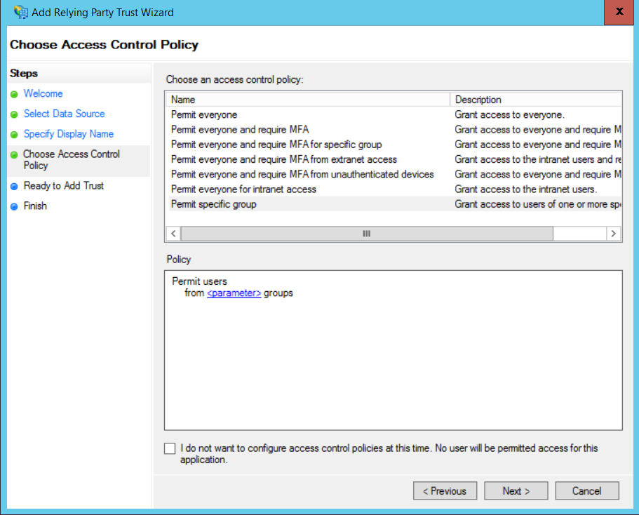

<properties
   pageTitle="與客戶的 AD FS 同盟的 |Microsoft Azure"
   description="如何 federate 與客戶的 AD FS multitenant 應用程式中"
   services=""
   documentationCenter="na"
   authors="JohnPWSharp"
   manager="roshar"
   editor=""
   tags=""/>

<tags
   ms.service="guidance"
   ms.devlang="dotnet"
   ms.topic="article"
   ms.tgt_pltfrm="na"
   ms.workload="na"
   ms.date="06/02/2016"
   ms.author="v-josha"/>

# <a name="federating-with-a-customers-ad-fs-for-multitenant-apps-in-azure"></a>客戶 AD FS multitenant Azure 中的應用程式與聯盟

[AZURE.INCLUDE [pnp-header](../../includes/guidance-pnp-header-include.md)]

本文是[一系列的一部分]。 此外還有隨附這一系列完成[範例應用程式]。

本文將說明如何多租用戶 SaaS 應用程式可支援驗證透過 Active Directory Federation Services (AD FS)，才能與客戶的 AD FS 建立同盟。

## <a name="overview"></a>概觀

Azure Active Directory (Azure AD) 可讓您輕鬆地登入的使用者，使 Azure AD 租用戶，包括 Office365 及 Dynamics CRM Online 的客戶。 但應該做什麼客戶使用內部部署 Active Directory 公司內部網路上？

其中一個選項是同步處理使用 Azure AD，使用[Azure AD Connect]其內部部署 AD 這些客戶。 不過，有些客戶可能無法使用此方法，因為公司的 IT 原則或因為其他原因。 在此情況下，另一個選項是透過 Active Directory Federation Services (AD FS) 建立同盟。

若要啟用這種情況︰

-   客戶必須擁有具網際網路 AD FS 伺服器陣列。
-   SaaS 提供者部署自己 AD FS 伺服器陣列。
-   客戶和 SaaS 提供者必須設定[同盟信任]。 這是手動程序。

信任關聯中有三個主要的角色︰

-   客戶 AD FS 是[帳戶夥伴]負責驗證使用者從客戶的 AD，並建立使用者宣告安全性權杖。
-   SaaS 提供者的 AD FS 是[資源夥伴]信任帳戶夥伴，並會收到使用者宣告。
-   應用程式設定為在 SaaS 提供者的 AD FS 信賴 （資源點數）。

    

> [AZURE.NOTE] 在本文中，我們會假設 OpenID 連線以驗證通訊協定的應用程式使用。 另一個選項是使用 WS 同盟。

> 對於 OpenID 連線，SaaS 提供者必須使用 AD FS 4.0 執行 Windows Server 2016，目前位於 Technical Preview 中。 AD FS 3.0 不支援 OpenID 連線。

> ASP.NET 核心 1.0 不包含的方塊出 WS 同盟支援。

如需使用 ASP.NET 4 WS 同盟的範例，請參閱[作用中的目錄-dotnet-webapp-wsfederation 範例][active-directory-dotnet-webapp-wsfederation]。

## <a name="authentication-flow"></a>驗證流程

1.  當使用者按下 [登入] 時，應用程式會重新導向上 SaaS 提供者的 AD FS OpenID 連線端點。
2.  使用者輸入他或她組織的使用者名稱 (「`alice@corp.contoso.com`」)。 AD FS 使用主領域探索重新導向至客戶 AD FS，在使用者輸入其認證。
3.  客戶 AD FS 會傳送至 SaaS 提供者的 AD FS，使用者宣告使用 WF 同盟 （或 SAML）。
4.  將 AD FS 宣告延伸至應用程式，使用 OpenID 連線。 需要從 WS 同盟通訊協定轉場效果。

## <a name="limitations"></a>限制

在撰寫時，應用程式會收到有限的宣告，在 OpenID id_token，如下表所示。 AD FS 4.0 是在仍預覽，此設定可能會變更。 無法目前定義其他宣告︰

宣告   | 描述
------|-------------
aud | 對象。 應用程式的宣告已發行。
authenticationinstant   | [驗證立即]。 驗證時間發生。
c_hash  | 程式碼雜湊值。 這是雜湊權杖的內容。
exp | [到期時間]。 之後的權杖將不再接受時間。
iat | [在發行]。 何時發行權杖時間。
iss | 發行者。 此宣告的值會資源夥伴 AD FS。
名稱    | 使用者名稱。 範例︰ `john@corp.fabrikam.com`。
nameidentifier | [名稱識別碼]。 名稱的權杖核發的實體的識別碼。
nonce   | 工作階段 nonce。 AD FS，以協助防止重新執行攻擊所產生的唯一值。
upn | 使用者主要名稱 (UPN)。 範例︰john@corp.fabrikam.com
pwd_exp | 密碼過期期間。 使用者的密碼或類似的 「 驗證 」 密碼，例如 PIN 直到的秒數。 到期。

> [AZURE.NOTE] 「 Iss 」 宣告包含協力廠商 AD FS （一般而言，此宣告會識別為發行者 SaaS 提供者）。 它不會識別客戶 AD FS。 您可以找到屬於 UPN 客戶的網域。

本文的其餘部分說明如何設定資源點數 （應用程式） 與帳戶合作夥伴 （客戶） 的信任關係。

## <a name="ad-fs-deployment"></a>AD FS 部署

SaaS 提供者可以部署 AD FS 內部部署或 Azure Vm 上。 安全性和可用性，下列方針是非常重要︰

-   部署至少兩個 AD FS 伺服器和兩個 AD FS proxy 伺服器，達到最佳 AD FS 服務。
-   網域控制站 AD FS 伺服器永遠不應該公開直接到網際網路，並應直接存取他們的虛擬網路中。
-   Web 應用程式 proxy (先前 AD FS proxy) 必須使用 AD FS 伺服器發佈至網際網路。

若要設定 Azure 中的類似拓撲需要使用虛擬網路、 NSG 的、 azure VM 及可用性集。 如需詳細資訊，請參閱[部署 Windows Server Active Directory Azure 虛擬機器上的商務連絡人的指導方針][active-directory-on-azure]。

## <a name="configure-openid-connect-authentication-with-ad-fs"></a>使用 AD FS 設定 OpenID 連線驗證

SaaS 提供者必須啟用 OpenID 連線的應用程式與 AD FS 之間。 若要這麼做，請在 [AD FS 中新增應用程式群組。  您可以找到的詳細的指示，在此[部落格文章]，請在 「 OpenId 連線的設定 Web 應用程式登入 AD FS 」。 

接下來，設定連線 OpenID 介軟體。 中繼資料端點是`https://domain/adfs/.well-known/openid-configuration`，其中的網域是 SaaS 提供者的 AD FS 網域。

通常您可以結合這與其他 OpenID 連線的端點 （例如 AAD)。 您需要兩個不同登入按鈕或其他方法來區分，以便使用者會傳送到正確的驗證結束點。

## <a name="configure-the-ad-fs-resource-partner"></a>設定 AD FS 資源夥伴

SaaS 提供者必須執行下列動作想要透過 ADFS 連線每位客戶︰

1.  新增宣告提供者信任。
2.  新增宣告規則。
3.  啟用常用領域探索。

以下是更多詳細資料中的步驟。

### <a name="add-the-claims-provider-trust"></a>新增宣告提供者信任

1.  在 [伺服器管理員] 中，按一下 [**工具**]，，然後選取 [ **AD FS 管理**。
2.  在 [主控台樹狀目錄的**AD FS**，以滑鼠右鍵按一下**宣告提供者信任**。 選取 [**新增宣告提供者信任**]。
3.  按一下 [**開始**] 以啟動精靈。
4.  選取選項 「 匯入資料發佈線上或網路上的本機宣告提供者 」。 輸入客戶的同盟中繼資料端點的 URI。 (範例︰ `https://contoso.com/FederationMetadata/2007-06/FederationMetadata.xml`。)您必須以取得此客戶。
5.  完成精靈，使用預設的選項。

### <a name="edit-claims-rules"></a>編輯宣告規則

1.  以滑鼠右鍵按一下新增的宣告提供者信任，並選取 [**編輯宣告規則**。
2.  按一下 [**新增規則**]。
3.  選取 「 傳遞到或篩選連入宣告 」，然後按一下 [**下一步**]。
    
4.  輸入規則的名稱。
5.  「 連入宣告類型] 下，「 選取**UPN**。
6.  選取 [瀏覽您所有的階段宣告值 」。
  
7.  按一下 [**完成**]。
8.  重複步驟 2-7，並指定**錨點宣告類型**的內送的宣告類型。
9.  按一下**[確定]**以完成精靈]。

### <a name="enable-home-realm-discovery"></a>啟用常用領域探索
執行下列 PowerShell 指令碼︰

```
Set-ADFSClaimsProviderTrust -TargetName "name" -OrganizationalAccountSuffix @("suffix")
```

其中 「 名稱 」 的宣告提供者信任，好記的名稱，而 「 尾碼 」 會客戶的 UPN 尾碼的 AD （例如，「 corp.fabrikam.com 」）。

使用此設定時，使用者可以輸入組織帳戶，然後 AD FS 會自動選取對應的宣告提供者。 在 [使用特定的電子郵件尾碼設定身分識別提供者 」] 區段底下，請參閱[自訂 AD FS 登入頁面]，請。

## <a name="configure-the-ad-fs-account-partner"></a>設定 AD FS 帳戶夥伴

客戶必須執行下列動作︰

1.  新增依賴的合作對象 （資源點數） 信任。
2.  新增宣告規則。

### <a name="add-the-rp-trust"></a>新增資源點數信任

1.  在 [伺服器管理員] 中，按一下 [**工具**]，，然後選取 [ **AD FS 管理**。
2.  在主控台樹狀目錄的**AD FS**，以滑鼠右鍵按一下**依賴廠商信任**。 選取 [**新增依賴派對信任**]。
3.  選取 [**宣告注意**，然後按一下 [**開始**]。
4.  在 [**選取資料來源**] 頁面上選取的選項 」 匯入資料發佈線上或網路上的本機宣告提供者 」。 輸入 SaaS 提供者的同盟中繼資料端點的 URI。
  
5.  在 [**指定顯示名稱**] 頁面上輸入任何名稱。
6.  在 [**選擇存取控制原則**] 頁面中，選擇 [原則]。 您無法在組織中，讓每個人，或選擇特定的安全性群組。
  
7.  輸入 [**原則**] 方塊中所需任何參數。
8.  按一下 [**下一步**完成精靈。

### <a name="add-claims-rules"></a>新增宣告規則

1.  以滑鼠右鍵按一下新加入的信賴廠商信任]，然後選取 [**編輯宣告發行原則**。
2.  按一下 [**新增規則**]。
3.  選取 [傳送 LDAP 屬性為宣告 」，然後按一下 [**下一步**]。
4.  輸入規則名稱，例如 「 UPN 」。
5.  在**儲存屬性**，請選取 [ **Active Directory**。
  
6.  在 [**對應的 LDAP 屬性**] 區段中︰
  - 在**LDAP 屬性**，選取**使用者主體名稱**。
  - 在**外寄的宣告類型**] 底下選取 [ **UPN**]。
  
7.  按一下 [**完成**]。
8.  再次按一下 [**新增規則**]。
9.  選取 [傳送宣告使用自訂規則]，然後按一下 [**下一步**]。
10. 輸入規則，例如 「 錨點宣告 Type 」 的名稱。
11. 下的 [**自訂規則**，輸入下列資訊︰

    ```
    EXISTS([Type == "http://schemas.microsoft.com/ws/2014/01/identity/claims/anchorclaimtype"])=>
      issue (Type = "http://schemas.microsoft.com/ws/2014/01/identity/claims/anchorclaimtype",
             Value = "http://schemas.xmlsoap.org/ws/2005/05/identity/claims/upn");
    ```

    此規則問題類型的宣告`anchorclaimtype`。 宣告會告訴信賴 UPN 作為使用者的不變的識別碼。

12. 按一下 [**完成**]。
13. 按一下**[確定]**以完成精靈]。

## <a name="next-steps"></a>後續步驟

- 閱讀本系列下一個文章︰[使用用戶端宣告，來取得從 Azure AD 存取權杖][client assertion]

<!-- Links -->
[一系列的一部分]: guidance-multitenant-identity.md
[Azure AD Connect]: ../active-directory/active-directory-aadconnect.md
[同盟信任]: https://technet.microsoft.com/library/cc770993(v=ws.11).aspx
[帳戶合作夥伴]: https://technet.microsoft.com/library/cc731141(v=ws.11).aspx
[資源合作夥伴]: https://technet.microsoft.com/library/cc731141(v=ws.11).aspx
[驗證立即]: https://msdn.microsoft.com/library/system.security.claims.claimtypes.authenticationinstant%28v=vs.110%29.aspx
[到期時間]: http://tools.ietf.org/html/draft-ietf-oauth-json-web-token-25#section-4.1.4
[在發行]: http://tools.ietf.org/html/draft-ietf-oauth-json-web-token-25#section-4.1.6
[名稱識別碼]: https://msdn.microsoft.com/library/system.security.claims.claimtypes.nameidentifier(v=vs.110).aspx
[active-directory-on-azure]: https://msdn.microsoft.com/library/azure/jj156090.aspx
[部落格文章]: http://www.cloudidentity.com/blog/2015/08/21/OPENID-CONNECT-WEB-SIGN-ON-WITH-ADFS-IN-WINDOWS-SERVER-2016-TP3/
[自訂 AD FS 登入頁面]: https://technet.microsoft.com/library/dn280950.aspx
[範例應用程式]: https://github.com/Azure-Samples/guidance-identity-management-for-multitenant-apps
[client assertion]: guidance-multitenant-identity-client-assertion.md
[active-directory-dotnet-webapp-wsfederation]: https://github.com/Azure-Samples/active-directory-dotnet-webapp-wsfederation
