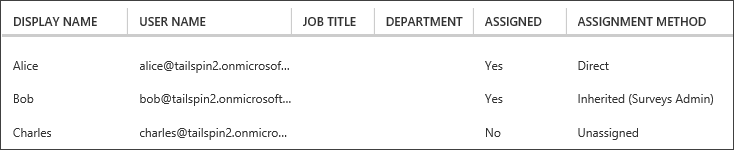

<properties
   pageTitle="應用程式角色 |Microsoft Azure"
   description="如何執行使用應用程式角色的授權"
   services=""
   documentationCenter="na"
   authors="MikeWasson"
   manager="roshar"
   editor=""
   tags=""/>

<tags
   ms.service="guidance"
   ms.devlang="dotnet"
   ms.topic="article"
   ms.tgt_pltfrm="na"
   ms.workload="na"
   ms.date="02/16/2016"
   ms.author="mwasson"/>

#  <a name="application-roles-in-multitenant-applications"></a>應用程式 multitenant 應用程式中的角色

[AZURE.INCLUDE [pnp-header](../../includes/guidance-pnp-header-include.md)]

本文是[一系列的一部分]。 此外還有隨附這一系列完成[範例應用程式]。

應用程式角色用來將權限指派給使用者。 例如， [Tailspin 問卷][Tailspin]應用程式定義的下列角色︰

- 系統管理員。 可以執行任何問卷屬於該租用戶上所有的 CRUD 作業。
- 建立者。 可以建立新的問卷調查。
- 閱讀程式。 可以讀取該租用戶屬於任何問卷調查。

您可以看到的角色最後取得成數權限，期間[的授權]。 但第一個問題是如何指派及管理角色。 我們識別三個主要的選項︰

-   [Azure AD 應用程式的角色](#roles-using-azure-ad-app-roles)
-   [Azure AD 安全性群組](#roles-using-azure-ad-security-groups)
-   [應用程式角色管理員](#roles-using-an-application-role-manager)。

## <a name="roles-using-azure-ad-app-roles"></a>使用 Azure AD 應用程式角色的角色

這是我們使用 Tailspin 問卷應用程式中的方法。

這種方法，SaaS 提供者，請以將其新增至應用程式顯示定義的應用程式的角色。 客戶註冊之後，客戶 AD 目錄的系統管理員會指派給角色的使用者。 當使用者登入時，使用者指派的角色宣告方式傳送。

> [AZURE.NOTE] 如果客戶 Azure AD 進階版，管理員可以指派角色，安全性群組，群組的成員會繼承的應用程式的角色。 這是方便的方式來管理角色，因為群組擁有者不需要 AD 管理員]。

這種方法的優點︰

-   簡單的程式設計模型。
-   角色會有特定應用程式。 一個應用程式的角色宣告不會傳送至另一個應用程式。
-   如果客戶會移除其 AD 租用戶中的應用程式，角色消失。
-   應用程式不需要任何額外 Active Directory 權限] 以外讀取使用者的設定檔。

缺點︰

- 不 Azure AD 進階版客戶無法指定給角色的安全性群組。 對於這些客戶，必須完成所有使用者指派 AD 管理員。
- 如果您有的後端 web API，也就是分開的 web 應用程式，web 應用程式的角色指派不適用於 web API。 如需此端點的詳細資訊，請參閱[保護後端網頁 API]。

### <a name="implementation"></a>實作

**定義的角色。** SaaS 提供者宣告應用程式中的角色的[應用程式資訊清單]。 例如，以下是問卷應用程式的資訊清單項目︰

```
"appRoles": [
  {
    "allowedMemberTypes": [
      "User"
    ],
    "description": "Creators can create Surveys",
    "displayName": "SurveyCreator",
    "id": "1b4f816e-5eaf-48b9-8613-7923830595ad",
    "isEnabled": true,
    "value": "SurveyCreator"
  },
  {
    "allowedMemberTypes": [
      "User"
    ],
    "description": "Administrators can manage the Surveys in their tenant",
    "displayName": "SurveyAdmin",
    "id": "c20e145e-5459-4a6c-a074-b942bbd4cfe1",
    "isEnabled": true,
    "value": "SurveyAdmin"
  }
],
```

`value`屬性會顯示在角色宣告。 `id`屬性是已定義之角色的唯一識別碼。 一律會產生的新 GUID 值`id`。

**指派給使用者**。 當新的客戶註冊時，則會客戶 AD 租用戶中登錄應用程式。 此時，該租用戶 AD 管理員可以指派給角色的使用者。

> [AZURE.NOTE] 如先前所述，Azure AD 進階版客戶可以也會指派給角色安全性群組。

從 Azure 入口網站下列螢幕擷取畫面顯示三個使用者。 Alice 是直接指派給角色。 百勝繼承為安全性群組，名為 「 問卷管理員 」，其指派給角色的成員角色。 查理未指派給任何角色。



> [AZURE.NOTE] 或者，應用程式可以指派角色以程式設計方式，使用 Azure AD 圖形 API。  不過，這需要應用程式取得客戶 AD 目錄的寫入權限。 具有這些權限的應用程式無法執行許多調皮&mdash;客戶信任應用程式不出錯他們的目錄。 許多客戶可能願意授與存取層級。

**取得角色宣告**。 當使用者登入時，應用程式就會收到使用者指派的角色與類型宣告中`http://schemas.microsoft.com/ws/2008/06/identity/claims/role`。  

使用者可以有多個角色或沒有角色。 在您的授權的程式碼，不假設使用者擁有一個角色宣告。 不過，撰寫程式碼，檢查是否存在特定宣告值︰

```csharp
if (context.User.HasClaim(ClaimTypes.Role, "Admin")) { ... }
```

## <a name="roles-using-azure-ad-security-groups"></a>使用 Azure AD 安全性群組的角色

在這種方式，以 AD 安全性群組表示角色。 應用程式會將權限指派給使用者根據其安全性群組成員資格。

優點︰

-   沒有 Azure AD 進階版客戶，這種方法可讓客戶使用安全性群組管理角色指派。

缺點︰

- 複雜度。 每個租用戶傳送不同的群組宣告，因為應用程式必須追蹤的安全性群組對應至哪些應用程式的角色，每個租用戶。
- 如果客戶會移除其 AD 租用戶中的應用程式的安全性群組會留在他們 AD 目錄中。

### <a name="implementation"></a>實作

在 [應用程式資訊清單中，設定`groupMembershipClaims`屬性設定為 「 SecurityGroup 」。 這需要從 AAD 取得群組的成員資格宣告。

```
{
   // ...
   "groupMembershipClaims": "SecurityGroup",
}
```

當新的客戶註冊時，應用程式會指示建立安全性群組角色所需的應用程式的客戶。 [客戶] 和 [群組物件識別碼輸入應用程式的需求。 應用程式會儲存這些表格中的群組識別碼會對應到應用程式的角色，每一租用戶。

> [AZURE.NOTE] 或者，應用程式可能會建立群組以程式設計方式，使用 Azure AD 圖形 API。  這會較容易發生錯誤。 不過，需要應用程式，以取得 「 讀取和寫入所有群組 」 客戶 AD 目錄的權限。 許多客戶可能願意授與存取層級。

當使用者登入︰

1.  應用程式會收到宣告為使用者的群組。 每個宣告的值是群組的物件識別碼。
2.  Azure AD 限制權杖中傳送群組的數目。 群組的數目超過此限制，如果 Azure AD 傳送特殊的 「 overage 」 宣告。 如果該宣告，應用程式必須查詢 Azure AD 圖形 API，以取得所有使用者所屬的群組。 如需詳細資訊，請參閱標題為 「 群組宣告 overage] 區段底下的 [使用 AD 群組的雲端應用程式中的授權]。
3.  應用程式會在其本身的資料庫，若要尋找的對應的應用程式角色指派給使用者的物件識別碼。
4.  應用程式會將應用程式角色的使用者主體自訂宣告值。 例如︰ `survey_role` = 「 SurveyAdmin 」。

授權原則應使用自訂的角色宣告，不群組宣告。

## <a name="roles-using-an-application-role-manager"></a>使用應用程式角色管理員角色

使用這個方法，應用程式角色不會儲存在 Azure AD 完全。 不過，應用程式儲存自己資料庫中的每位使用者的角色指派&mdash;ASP.NET 身分識別，例如使用**RoleManager**類別。

優點︰

-   應用程式具有完全控制權的角色和使用者指派。

缺點︰

- 更複雜，難維護。
- 無法使用 AD 安全性群組管理角色指派。
- 儲存在應用程式資料庫中，其可讓與的租用戶 AD 目錄同步處理時新增或移除使用者的使用者資訊。   

有多個現有的範例，這種方法。 例如，請參閱[建立 ASP.NET MVC 應用程式授權與 SQL 資料庫並部署至 Azure 應用程式服務]。

## <a name="next-steps"></a>後續步驟

- 閱讀本系列下一個文章︰[在 multitenant 應用程式中的角色和資源授權][的授權]

<!-- Links -->
[Tailspin]: guidance-multitenant-identity-tailspin.md
[一系列的一部分]: guidance-multitenant-identity.md
[授權]: guidance-multitenant-identity-authorize.md
[安全的後端 web API]: guidance-multitenant-identity-web-api.md
[建立 ASP.NET MVC 應用程式授權與 SQL 資料庫並部署至 Azure 應用程式服務]: ../app-service-web/web-sites-dotnet-deploy-aspnet-mvc-app-membership-oauth-sql-database.md
[應用程式資訊清單]: ../active-directory/active-directory-application-manifest.md
[範例應用程式]: https://github.com/Azure-Samples/guidance-identity-management-for-multitenant-apps
