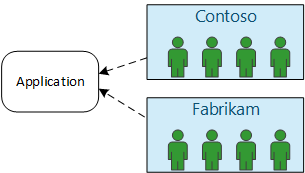
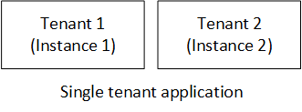
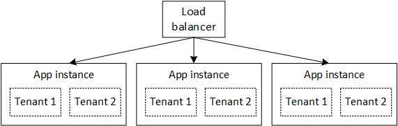

<properties
   pageTitle="身分識別管理 multitenant 應用程式 |Microsoft Azure"
   description="Multitenant 應用程式中的身分識別管理簡介"
   services=""
   documentationCenter="na"
   authors="MikeWasson"
   manager="roshar"
   editor=""
   tags=""/>

<tags
   ms.service="guidance"
   ms.devlang="dotnet"
   ms.topic="article"
   ms.tgt_pltfrm="na"
   ms.workload="na"
   ms.date="06/02/2016"
   ms.author="mwasson"/>

# Microsoft Azure 中 multitenant 應用程式的身分識別管理簡介

[AZURE.INCLUDE [pnp-header](../../includes/guidance-pnp-header-include.md)]

本文是[一系列的一部分]。 此外還有隨附這一系列完成[範例應用程式]。

例如，假設您正在撰寫企業 SaaS 裝載雲端中的應用程式。 當然，應用程式將會有使用者︰

但這些使用者所屬組織︰

範例︰ Tailspin 銷售其 SaaS 應用程式的訂閱。 Contoso 和 Fabrikam 應用程式的登入。 當 Alice (`alice@contoso`) 中的符號，應用程式應該知道愛麗絲是 Contoso 的一部分。

- Alice_應該_有 Contoso 資料的存取權。
- Alice_不應該_有 Fabrikam 資料的存取權。

本指南會告訴您如何管理 multitenant 應用程式，使用[Azure Active Directory]中的使用者身分識別[AzureAD](Azure AD) 來處理登入和驗證。

## 什麼是 multitenancy？

_租用戶_是一組使用者。 在 SaaS 應用程式中，租用戶是訂閱者或客戶的應用程式。 _Multitenancy_是的架構多個租用戶共用相同的實體執行個體的應用程式的位置。 雖然租用戶共用 （例如 Vm 或儲存空間） 的實際資源，每個租用戶取得自己的應用程式的邏輯執行個體。

一般而言，之間租用戶，而不是與其他租用戶的使用者共用應用程式的資料。

比較此架構與單一租用戶架構，其中每個租用戶有專用的實體執行個體。 在單一租用戶架構中，您可以新增租用戶來設定新的應用程式的執行個體的旋轉。

### Multitenancy 和水平縮放比例

若要達到雲端中的比例，通常會新增更多實體的執行個體。 這是稱為_水平縮放比例_，或_查看縮放比例_。 請考慮在 web 應用程式。 若要處理更多的流量，您可以新增更多伺服器 Vm，並將它們放在前負載平衡器。 每個 VM 執行獨立的實體執行個體的 web 應用程式。

任何要求路由到任何的執行個體。 在一起，系統會作為單一邏輯執行個體。 您可以清除 VM 或微調設定新的 VM，而不會影響使用者。 在此結構，每個實體的執行個體多租用戶，而藉由新增更多的執行個體不按比例縮放。 如果執行個體之一當機，它不會影響任何租用戶。

## 在 multitenant 應用程式的身分識別

在 multitenant 的應用程式，您必須考慮的租用戶的內容中的使用者。

**驗證**

- 使用者登入他們的組織認證應用程式。 他們沒有建立新的使用者設定檔，應用程式。
- 在相同組織中的使用者屬於相同的租用戶。
- 當使用者登入時，應用程式就會知道使用者所屬的租用戶。

**授權**

- 授權的使用者動作 （例如，檢視資源） 時, 應用程式必須考慮使用者的租用戶。
- 使用者可能會被指派的應用程式，例如 「 系統 」 或 「 標準使用者 」 中的角色。 客戶，不提供者 SaaS 應該管理角色指派。

**範例。** Alice 的員工 Contoso，她的瀏覽器中瀏覽至應用程式，並按一下 「 登入] 按鈕。 她會重新導向到她在輸入 （使用者名稱和密碼） 其公司認證登入畫面。 現在，她登入應用程式為`alice@contoso.com`。 應用程式也會知道愛麗絲是此應用程式的系統管理員使用者的。 因為她是系統管理員，晨怡也可以查看屬於 Contoso 之所有資源的清單。 不過，她無法檢視 Fabrikam 的資源，因為她只會在她租用戶系統管理員。

本指南中，我們將便於使用 Azure AD 身分識別管理。

- 假設 （包括 Office365 及 Dynamics CRM 租用戶） 的 Azure AD 客戶將儲存其使用者設定檔
- 客戶的內部部署 Active Directory (AD) 可以使用[Azure AD Connect] [ADConnect]同步處理的 Azure AD 其內部部署 AD。

如果與內部部署 AD 客戶無法使用 Azure AD Connect （因為公司的 IT 原則或其他原因），提供者可以與客戶聯盟 SaaS 的 AD 透過 Active Directory Federation Services (AD FS)。 [客戶 AD FS 與聯盟]說明這個選項。

本指南不會考慮 multitenancy，例如資料分割、 每個租用戶設定等其他方面。

## 後續步驟

- 閱讀本系列下一個文章︰[瞭解 Tailspin 問卷調查應用程式][tailpin]

<!-- Links -->
[ADConnect]: ../active-directory/active-directory-aadconnect.md
[AzureAD]: https://azure.microsoft.com/documentation/services/active-directory/
[一系列的一部分]: guidance-multitenant-identity.md
[與客戶的 AD FS 同盟的]: guidance-multitenant-identity-adfs.md
[範例應用程式]: https://github.com/Azure-Samples/guidance-identity-management-for-multitenant-apps
[tailpin]: guidance-multitenant-identity-tailspin.md
