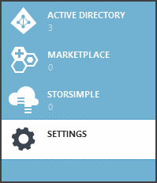
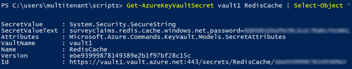

<properties
   pageTitle="使用金鑰保存庫保護機密應用程式 |Microsoft Azure"
   description="如何使用金鑰保存庫服務來儲存應用程式密碼"
   services=""
   documentationCenter="na"
   authors="MikeWasson"
   manager="roshar"
   editor=""
   tags=""/>

<tags
   ms.service="guidance"
   ms.devlang="dotnet"
   ms.topic="article"
   ms.tgt_pltfrm="na"
   ms.workload="na"
   ms.date="02/16/2016"
   ms.author="mwasson"/>

# <a name="using-azure-key-vault-to-protect-application-secrets"></a>使用 Azure 金鑰保存庫保護應用程式的機密資訊

[AZURE.INCLUDE [pnp-header](../../includes/guidance-pnp-header-include.md)]

本文是[一系列的一部分]。 此外還有隨附這一系列完成[範例應用程式]。

## <a name="overview"></a>概觀

通常會有應用程式設定，會區分便必須受到保護，例如︰

- 資料庫連線字串
- 密碼
- 加密金鑰

基於安全性的最佳作法，您應該永遠不會儲存這些機密資料來源控制項。 您可以輕鬆太，遺漏&mdash;即使是私人群組您原始程式碼儲存機制。 它不保密從一般公用。 在較大的專案，您可能會想要限制，開發和運算子可以存取生產機密資料。 （有不同的測試或開發環境設定）。

更安全的選項是[Azure 金鑰保存庫]中儲存這些機密[KeyVault]。 索引鍵保存庫是管理加密金鑰和其他機密的雲端裝載服務。 本文說明如何使用金鑰保存庫來儲存您的應用程式的設定。

在[Tailspin 問卷][Surveys]應用程式中，下列設定的密碼︰

- 資料庫連接字串。
- 意指連接字串。
- 用戶端 web 應用程式的密碼。

若要儲存金鑰保存庫設定機密資料，問卷應用程式實作自訂設定提供者，連結到 ASP.NET 核心 1.0[設定系統][configuration]。 自訂的提供者讀取金鑰保存庫在啟動時設定的設定。

問卷應用程式會載入設定的設定，從下列位置︰

- Appsettings.json 檔案
- [使用者的機密資訊儲存][ user-secrets] (的開發環境; 以進行測試)
- 主控環境 （Azure web 應用程式中的應用程式設定）
- 索引鍵保存庫

每個這些覆寫前一個，因此儲存在金鑰保存庫中的任何設定較高的優先順序。

> [AZURE.NOTE] 根據預設，會停用的金鑰保存庫設定提供者。 不需要在本機上執行應用程式。 您想要啟用它生產部署中。

> 索引鍵保存庫提供者目前不支援的.NET 核心，因為其需要[Microsoft.Azure.KeyVault] [Microsoft.Azure.KeyVault]套件。

在啟動時，應用程式設定讀取每個註冊的設定提供者，並使用這些填入強的選項物件。 (如需詳細資訊，請參閱[使用的選項和設定物件][options]。)

## <a name="implementation"></a>實作

[KeyVaultConfigurationProvider] [KeyVaultConfigurationProvider]類別是插入 ASP.NET 核心 1.0[設定系統]設定提供者[configuration]。

若要使用`KeyVaultConfigurationProvider`，來電`AddKeyVaultSecrets`啟動類別中的擴充方法︰

```csharp
    var builder = new ConfigurationBuilder()
        .SetBasePath(appEnv.ApplicationBasePath)
        .AddJsonFile("appsettings.json");

    if (env.IsDevelopment())
    {
        builder.AddUserSecrets();
    }
    builder.AddEnvironmentVariables();
    var config = builder.Build();

    // Add key vault configuration:
    builder.AddKeyVaultSecrets(config["AzureAd:ClientId"],
        config["KeyVault:Name"],
        config["AzureAd:Asymmetric:CertificateThumbprint"],
        Convert.ToBoolean(config["AzureAd:Asymmetric:ValidationRequired"]),
        loggerFactory);
```

請注意，`KeyVaultConfigurationProvider`需要一些設定的設定，需要會儲存在其中一個其他設定來源。

應用程式啟動時，`KeyVaultConfigurationProvider`列舉所有的金鑰保存庫中的機密。 針對每個 [私人]，它會尋找名為 「 ConfigKey 」 的標籤。 標籤的值是組態設定的名稱。

> [AZURE.NOTE] [標籤][key-tags]是選擇性的中繼資料儲存與索引鍵。 標記用以下這是因為機碼名稱不能包含冒號 （:） 字元。

```csharp
var kvClient = new KeyVaultClient(GetTokenAsync);
var secretsResponseList = await kvClient.GetSecretsAsync(_vault, MaxSecrets, token);
foreach (var secretItem in secretsResponseList.Value)
{
    //The actual config key is stored in a tag with the Key "ConfigKey"
    // because ':' is not supported in a shared secret name by Key Vault.
    if (secretItem.Tags != null && secretItem.Tags.ContainsKey(ConfigKey))
    {
        var secret = await kvClient.GetSecretAsync(secretItem.Id, token);
        Data.Add(secret.Tags[ConfigKey], secret.Value);
    }
}
```

> [AZURE.NOTE] 請參閱[KeyVaultConfigurationProvider.cs]。

## <a name="setting-up-key-vault-in-the-surveys-app"></a>問卷應用程式中設定金鑰保存庫

先決條件︰

- 安裝[Azure 資源管理員 Cmdlet][azure-rm-cmdlets]。
- 設定問卷應用程式中[執行的問卷調查應用程式]所述[readme]。

高層級的步驟執行︰

1. 設定管理員使用者的租用戶中。
2. 設定用戶端憑證。
3. 建立索引鍵保存庫。
4. 將您的主要保存庫中設定的設定。
5. 取消註解的程式碼，可讓金鑰保存庫。
6. 更新應用程式的使用者的機密資訊。

### <a name="set-up-an-admin-user"></a>系統管理員使用者的設定

> [AZURE.NOTE] 若要建立索引鍵保存庫，您必須使用可管理您的 Azure 訂閱的帳戶。 此外，任何您從主要的保存庫閱讀授權的應用程式必須註冊中相同的租用戶，為該帳戶。

在此步驟中，您會確認您可以建立索引鍵保存庫時的租用戶的使用者身分登入已註冊的問卷調查應用程式的位置。

首先，變更 Azure 訂閱相關聯的目錄。

1. 登入[Azure 管理入口網站][azure-management-portal]

2. 按一下 [**設定**]。

    

3. 選取您 Azure 訂閱]。

4. 按一下 [**編輯目錄**底部的入口網站]。

    

5. 在 「 變更的相關聯的目錄] 中，選取位置註冊問卷應用程式，請 Azure AD 租用戶

    

6. 按一下 [箭號] 按鈕，然後完成] 對話方塊。

建立系統中的使用者 Azure AD 租用戶的學生已註冊的問卷調查應用程式的位置。

1. 登入[Azure 管理入口網站][azure-management-portal]。

2. 選取您的應用程式在哪裡註冊 Azure AD 租用戶。

3. 按一下 [**使用者** > **新增使用者**。

4. 在 [**新增使用者**] 對話方塊中指派給全域管理員角色的使用者。

Azure 訂閱的共同管理員的身分新增系統管理使用者。

1. 登入[Azure 管理入口網站][azure-management-portal]。

2. 按一下 [**設定]** ，然後選取您 Azure 的訂閱。

3. 按一下 [**管理員**]

4. 按一下 [**新增**底部的入口網站。

5. 輸入您先前建立的管理員使用者的電子郵件。

6. 核取訂閱中的核取方塊。

7. 按一下完成] 對話方塊的核取記號按鈕。


### <a name="set-up-a-client-certificate"></a>設定用戶端憑證

1. 執行 PowerShell 指令碼[/Scripts/Setup-KeyVault.ps1] [ Setup-KeyVault] ，如下所示︰
    ```
    .\Setup-KeyVault.ps1 -Subject <<subject>>
    ```
    針對`Subject`參數，輸入任何名稱，例如 「 surveysapp 」。 指令碼會產生自我簽署的憑證，並將它儲存在 「 目前使用者/個人 」 憑證存放區。

2. 指令碼的輸出是 JSON 片段。 新增此應用程式顯示的 web 應用程式，如下所示︰

    1. 登入[Azure 管理入口網站][azure-management-portal]並瀏覽至您的 Azure AD 目錄。

    2. 按一下 [**應用程式**]。

    3. 選取 [問卷應用程式]。

    4.  按一下 [**管理資訊清單**，然後選取 [**下載資訊清單**。

    5.  開啟文字編輯器中的資訊清單 JSON 檔案。 貼到指令碼的輸出`keyCredentials`屬性。 應該看起來如下︰
    ```
            "keyCredentials": [
                {
                  "type": "AsymmetricX509Cert",
                  "usage": "Verify",
                  "keyId": "29d4f7db-0539-455e-b708-....",
                  "customKeyIdentifier": "ZEPpP/+KJe2fVDBNaPNOTDoJMac=",
                  "value": "MIIDAjCCAeqgAwIBAgIQFxeRiU59eL.....
                }
              ],
    ```          
    6.  儲存變更至 JSON 檔案。

    7.  回到入口網站。 按一下 [**管理資訊清單** > **上傳資訊清單**及上傳 JSON 檔案。

3. 將相同的 JSON 片段新增至 [網路 API (Surveys.WebAPI) 的應用程式顯示。

4. 執行下列命令以取得指紋的憑證。
    ```
    certutil -store -user my [subject]
    ```
    位置`[subject]`是您指定的主旨中的 PowerShell 指令碼的值。 指紋會列在 「 憑證 Hash(sha1) 」。 移除的十六進位數字之間的空格。

您可以稍後使用指紋。

### <a name="create-a-key-vault"></a>建立索引鍵保存庫

1. 執行 PowerShell 指令碼[/Scripts/Setup-KeyVault.ps1] [ Setup-KeyVault] ，如下所示︰

    ```
    .\Setup-KeyVault.ps1 -KeyVaultName <<key vault name>> -ResourceGroupName <<resource group name>> -Location <<location>>
    ```

    當畫面提示您輸入認證，使用者身分登入 Azure AD 先前所建立。 指令碼會建立新的 [資源] 群組中，與該資源群組內的新索引鍵保存庫。

    附註︰ 針對-位置參數，您可以使用下列 PowerShell 命令，以取得有效的區域的清單︰

    ```
    Get-AzureRmResourceProvider -ProviderNamespace "microsoft.keyvault" | Where-Object { $_.ResourceTypes.ResourceTypeName -eq "vaults" } | Select-Object -ExpandProperty Locations
    ```

2. 再次執行 SetupKeyVault.ps 使用下列參數︰

    ```
    .\Setup-KeyVault.ps1 -KeyVaultName <<key vault name>> -ApplicationIds @("<<web app client ID>>", "<<web API client ID>>")
    ```

    位置

    - 索引鍵保存庫名稱 = 您在先前的步驟給金鑰保存庫的名稱。
    - web 應用程式的用戶端識別碼 = 問卷 web 應用程式的用戶端識別碼。
    - 網頁 api 用戶端識別碼 = Surveys.WebAPI 應用程式的用戶端識別碼。

    範例︰
    ```
    .\Setup-KeyVault.ps1 -KeyVaultName tailspinkv -ApplicationIds @("f84df9d1-91cc-4603-b662-302db51f1031", "8871a4c2-2a23-4650-8b46-0625ff3928a6")
    ```

    > [AZURE.NOTE] 您可以取得用戶端識別碼從[Azure 管理入口網站][azure-management-portal]。 選取 Azure AD 租用戶，選取的應用程式，然後按一下 [**設定**。

    這個指令碼授權 web app 和 web API，從您的主要保存庫擷取密碼。 請參閱[開始使用 Azure 金鑰保存庫][authorize-app]如需詳細資訊。

### <a name="add-configuration-settings-to-your-key-vault"></a>將設定的設定新增至您的主要保存庫

1. 執行 SetupKeyVault.ps，如下所示︰

    ```
    .\Setup-KeyVault.ps1 -KeyVaultName <<key vault name> -KeyName RedisCache -KeyValue "<<Redis DNS name>>.redis.cache.windows.net,password=<<Redis access key>>,ssl=true" -ConfigName "Redis:Configuration"
    ```
    位置

    - 索引鍵保存庫名稱 = 您在先前的步驟給金鑰保存庫的名稱。
    - Redis DNS 名稱 = DNS 意指快取執行個體的名稱。
    - Redis 便捷鍵 = 意指快取執行個體的便捷鍵。

    這個命令會將您的主要保存庫密碼。 私人是名稱/值組加上標籤︰

    -   機碼名稱不使用應用程式，但金鑰保存庫中必須是唯一。
    -   值為 [設定] 選項中，在本例意指連線字串中的值。
    -   「 ConfigKey 」 標記保留設定索引鍵的名稱。

2. 此時，則建議您先測試是否您順利儲存金鑰保存庫密碼。 執行下列動作的 PowerShell 命令︰

    ```
    Get-AzureKeyVaultSecret <<key vault name>> RedisCache | Select-Object *
    ```
    輸出應該會顯示 [私人] 的值加上一些中繼資料︰

    

3. 執行 SetupKeyVault.ps 即可新增資料庫連線字串︰

    ```
    .\Setup-KeyVault.ps1 -KeyVaultName <<key vault name> -KeyName ConnectionString -KeyValue <<DB connection string>> -ConfigName "Data:SurveysConnectionString"
    ```

    位置`<<DB connection string>>`資料庫連線字串的值。

    以進行測試與本機資料庫，請從 Tailspin.Surveys.Web/appsettings.json 檔案複製連線字串。 如果您執行這項作業，請務必變更雙反斜線 ('\\\\」) 到單一反斜線。 雙反斜線是 JSON 檔案中的使用逸出字元。

    範例︰

    ```
    .\Setup-KeyVault.ps1 -KeyVaultName mykeyvault -KeyName ConnectionString -KeyValue "Server=(localdb)\MSSQLLocalDB;Database=Tailspin.SurveysDB;Trusted_Connection=True;MultipleActiveResultSets=true" -ConfigName "Data:SurveysConnectionString"
    ```

### <a name="uncomment-the-code-that-enables-key-vault"></a>取消註解的程式碼，可讓金鑰保存庫

1. 開啟 Tailspin.Surveys 方案。

2. 在 [ [Tailspin.Surveys.Web/Startup.cs][web-startup]，找出下列程式碼區段，並取消該註解。

    ```csharp
    //#if DNX451
    //            _configuration = builder.Build();
    //            builder.AddKeyVaultSecrets(_configuration["AzureAd:ClientId"],
    //                _configuration["KeyVault:Name"],
    //                _configuration["AzureAd:Asymmetric:CertificateThumbprint"],
    //                Convert.ToBoolean(_configuration["AzureAd:Asymmetric:ValidationRequired"]),
    //                loggerFactory);
    //#endif
    ```

3. 在 [ [Tailspin.Surveys.WebAPI/Startup.cs][web-api-startup]，找出下列程式碼區段，並取消該註解。

    ```csharp
    //#if DNX451
    //            var config = builder.Build();
    //            builder.AddKeyVaultSecrets(config["AzureAd:ClientId"],
    //                config["KeyVault:Name"],
    //                config["AzureAd:Asymmetric:CertificateThumbprint"],
    //                Convert.ToBoolean(config["AzureAd:Asymmetric:ValidationRequired"]),
    //                loggerFactory);
    //#endif
    ```

4. 在 [ [Tailspin.Surveys.Web/Startup.cs][web-startup]，找出登錄的程式碼`ICredentialService`。 取消註解的使用線條`CertificateCredentialService`，和註解的使用線條`ClientCredentialService`:

    ```csharp
    // Uncomment this:
    services.AddSingleton<ICredentialService, CertificateCredentialService>();
    // Comment out this:
    //services.AddSingleton<ICredentialService, ClientCredentialService>();
    ```

    這項變更可讓 web 應用程式，使用[用戶端判斷提示][client-assertion]取得 OAuth 存取權杖。 使用用戶端判斷提示，您不需要 OAuth 用戶端密碼。 或者，您無法將用戶端私人儲存金鑰保存庫。 不過，金鑰保存庫和同時使用用戶端的用戶端判斷提示憑證，因此如果您啟用索引鍵保存庫時，啟用用戶端判斷提示很好的做法。

### <a name="update-the-user-secrets"></a>更新使用者的機密資訊

在方案總管中，以滑鼠右鍵按一下 Tailspin.Surveys.Web 專案，然後選取 [**管理使用者的機密資訊**。 在 secrets.json 檔案，刪除現有 JSON 並貼上如下︰

    ```
    {
      "AzureAd": {
        "ClientId": "[Surveys web app client ID]",
        "PostLogoutRedirectUri": "https://localhost:44300/",
        "WebApiResourceId": "[App ID URI of your Surveys.WebAPI application]",
        "Asymmetric": {
          "CertificateThumbprint": "[certificate thumbprint. Example: 105b2ff3bc842c53582661716db1b7cdc6b43ec9]",
          "StoreName": "My",
          "StoreLocation": "CurrentUser",
          "ValidationRequired": "false"
        }
      },
      "KeyVault": {
        "Name": "[key vault name]"
      }
    }
    ```

[方括號] 中的項目取代為正確的值。

- `AzureAd:ClientId`︰ 問卷的應用程式用戶端識別碼。
- `AzureAd:WebApiResourceId`: 指定當您建立的 Surveys.WebAPI 應用程式中 Azure AD 應用程式識別碼 URI。
- `Asymmetric:CertificateThumbprint`︰ 您先前，那麼當您建立的用戶端憑證憑證指紋。
- `KeyVault:Name`︰ 您的主要保存庫名稱。

> [AZURE.NOTE] `Asymmetric:ValidationRequired`為 false，所以您先前建立的憑證不簽署根憑證授權單位 (CA)。 實際使用的憑證簽署的根的 CA 及設定`ValidationRequired`為 true。

儲存更新的 secrets.json 檔案。

接下來，請在方案總管中，以滑鼠右鍵按一下 Tailspin.Surveys.WebApi 專案，然後選取 [**管理使用者的機密資訊**。 刪除現有 JSON 並貼上如下︰

```
{
  "AzureAd": {
    "ClientId": "[Surveys.WebAPI client ID]",
    "WebApiResourceId": "https://tailspin5.onmicrosoft.com/surveys.webapi",
    "Asymmetric": {
      "CertificateThumbprint": "[certificate thumbprint]",
      "StoreName": "My",
      "StoreLocation": "CurrentUser",
      "ValidationRequired": "false"
    }
  },
  "KeyVault": {
    "Name": "[key vault name]"
  }
}
```

取代 [方括號] 中的項目，然後儲存 secrets.json 檔案。

> [AZURE.NOTE] Web API，請務必使用用戶端識別碼 Surveys.WebAPI 應用程式，而非問卷應用程式。


<!-- Links -->
[authorize-app]: ../key-vault/key-vault-get-started.md/#authorize
[azure-management-portal]: https://manage.windowsazure.com/
[azure-rm-cmdlets]: https://msdn.microsoft.com/library/mt125356.aspx
[client-assertion]: guidance-multitenant-identity-client-assertion.md
[configuration]: https://docs.asp.net/en/latest/fundamentals/configuration.html
[KeyVault]: https://azure.microsoft.com/services/key-vault/
[KeyVaultConfigurationProvider]: https://github.com/Azure-Samples/guidance-identity-management-for-multitenant-apps/blob/master/src/Tailspin.Surveys.Configuration.KeyVault/KeyVaultConfigurationProvider.cs
[key-tags]: https://msdn.microsoft.com/library/azure/dn903623.aspx#BKMK_Keytags
[Microsoft.Azure.KeyVault]: https://www.nuget.org/packages/Microsoft.Azure.KeyVault/
[options]: https://docs.asp.net/en/latest/fundamentals/configuration.html#using-options-and-configuration-objects
[readme]: https://github.com/Azure-Samples/guidance-identity-management-for-multitenant-apps/blob/master/docs/running-the-app.md
[Setup-KeyVault]: https://github.com/Azure-Samples/guidance-identity-management-for-multitenant-apps/blob/master/scripts/Setup-KeyVault.ps1
[Surveys]: guidance-multitenant-identity-tailspin.md
[user-secrets]: http://go.microsoft.com/fwlink/?LinkID=532709
[web-startup]: https://github.com/Azure-Samples/guidance-identity-management-for-multitenant-apps/blob/master/src/Tailspin.Surveys.Web/Startup.cs
[web-api-startup]: https://github.com/Azure-Samples/guidance-identity-management-for-multitenant-apps/blob/master/src/Tailspin.Surveys.WebAPI/Startup.cs
[一系列的一部分]: guidance-multitenant-identity.md
[KeyVaultConfigurationProvider.cs]: https://github.com/Azure-Samples/guidance-identity-management-for-multitenant-apps/blob/master/src/Tailspin.Surveys.Configuration.KeyVault/KeyVaultConfigurationProvider.cs
[範例應用程式]: https://github.com/Azure-Samples/guidance-identity-management-for-multitenant-apps
