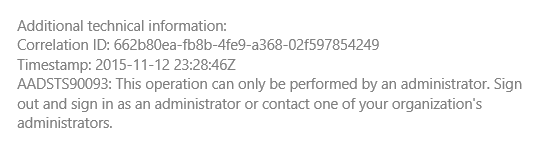

<properties
   pageTitle="註冊和租用戶中 multitenant 應用程式的登入 |Microsoft Azure"
   description="如何在 multitenant 應用程式中的內建租用戶"
   services=""
   documentationCenter="na"
   authors="MikeWasson"
   manager="roshar"
   editor=""
   tags=""/>

<tags
   ms.service="guidance"
   ms.devlang="dotnet"
   ms.topic="article"
   ms.tgt_pltfrm="na"
   ms.workload="na"
   ms.date="05/23/2016"
   ms.author="mwasson"/>

# <a name="sign-up-and-tenant-onboarding-in-a-multitenant-application"></a>註冊和租用戶中 multitenant 應用程式的登入

[AZURE.INCLUDE [pnp-header](../../includes/guidance-pnp-header-include.md)]

本文是[一系列的一部分]。 此外還有隨附這一系列完成[範例應用程式]。

本文將說明如何實作_註冊_程序在多租用戶的應用程式，可讓應用程式的組織所註冊的客戶。
實作註冊程序的幾個原因有︰

-   允許 AD 管理員，才能使用應用程式的客戶的整個組織同意。
-   收集信用卡付款或其他客戶的資訊。
-   執行應用程式所需的任何一次性每個租用戶設定。

## <a name="admin-consent-and-azure-ad-permissions"></a>管理員同意和 Azure AD 權限

Azure AD 經過驗證，才能應用程式需要使用者的目錄的存取權。 最小值，在應用程式需要讀取使用者的設定檔權限。 第一次的使用者登入，Azure AD 顯示同意書頁面會列出所要求的權限。 按一下 [**接受**]，使用者授與應用程式的權限。

根據預設，同意授與每位使用者為基礎。 登入的每位使用者會看到同意書頁面。 不過，Azure AD 也支援_管理員同意_，可讓同意 AD 管理員為整個組織。

使用管理員同意流程時，同意書頁面會指出廣告管理員已授與權限，代表整個承租人︰


管理員按一下 [**接受]**之後，相同的租用戶中的其他使用者可以登入，然後 Azure AD 會略過 [同意] 畫面。

只有 AD 管理員可以授與管理同意，因為它會授與權限，代表整個組織。 如果管理員同意流程驗證方法嘗試非系統管理員，Azure AD 會顯示錯誤訊息︰



在應用程式需要額外的權限在稍後，客戶必須再次登入，並同意更新的權限。  

## <a name="implementing-tenant-sign-up"></a>實作租用戶註冊

[Tailspin 問卷]的[Tailspin]應用程式，我們所定義的註冊程序的幾項需求︰

-   使用者可以登入之前，必須註冊租用戶。
-   註冊使用系統同意流程。
-   註冊加入使用者的租用戶應用程式資料庫。
-   租用戶註冊之後，應用程式就會顯示的登入頁面。

在此區段中，我們會逐步我們實作註冊程序。
請務必瞭解的 「 註冊 」 與 「 登入 」 是應用程式的概念。 驗證流程期間 Azure AD 不原本就知道使用者是否正在註冊。 若要追蹤的內容的應用程式是由。

匿名使用者造訪問卷應用程式時，使用者時，顯示兩個按鈕，一個登入，還有一個 「 註冊您的公司 」 （登入）。


這些按鈕叫用[AccountController]類別中的動作。

`SignIn`動作會傳回**ChallegeResult**，使 OpenID 連線介軟體，若要重新導向至驗證的端點。 這是在 ASP.NET 核心 1.0 的觸發程序驗證的預設方式。  

```csharp
[AllowAnonymous]
public IActionResult SignIn()
{
    return new ChallengeResult(
        OpenIdConnectDefaults.AuthenticationScheme,
        new AuthenticationProperties
        {
            IsPersistent = true,
            RedirectUri = Url.Action("SignInCallback", "Account")
        });
}
```

現在比較`SignUp`動作︰

```csharp
[AllowAnonymous]
public IActionResult SignUp()
{
    // Workaround for https://github.com/aspnet/Security/issues/546
    HttpContext.Items.Add("signup", "true");

    var state = new Dictionary<string, string> { { "signup", "true" }};
    return new ChallengeResult(
        OpenIdConnectDefaults.AuthenticationScheme,
        new AuthenticationProperties(state)
        {
            RedirectUri = Url.Action(nameof(SignUpCallback), "Account")
        });
}
```

例如`SignIn`、`SignUp`動作也會傳回`ChallengeResult`。 但這次，我們新增的狀態資訊的一段`AuthenticationProperties`中`ChallengeResult`:

-   註冊︰ 布林旗標，表示使用者已開始註冊程序。

中的狀態資訊`AuthenticationProperties`加到 OpenID 連線[狀態]的參數，往返期間驗證流程。


使用者授權 Azure AD 並取得重新導向到應用程式之後，驗證票證包含狀態。 我們會使用這項事實，請確定 「 註冊 」 值持續出現在整個驗證流程。

## <a name="adding-the-admin-consent-prompt"></a>新增管理員同意提示

Azure AD，在系統同意流程觸發加入驗證邀請中的查詢字串"提示"參數︰

```
/authorize?prompt=admin_consent&...
```

問卷應用程式新增期間提示`RedirectToAuthenticationEndpoint`事件。 此事件稱為右之前介軟體會重新導向至驗證結束點。

```csharp
public override Task RedirectToAuthenticationEndpoint(RedirectContext context)
{
    if (context.IsSigningUp())
    {
        context.ProtocolMessage.Prompt = "admin_consent";
    }

    _logger.RedirectToIdentityProvider();
    return Task.FromResult(0);
}
```

> [AZURE.NOTE] 請參閱[SurveyAuthenticationEvents.cs]。

設定` ProtocolMessage.Prompt`會告訴將"提示"參數新增至驗證要求介軟體。

請注意，出現提示時，才需要註冊期間。 一般登入不應該包含它。 若要區別它們，檢查是否有`signup`驗證狀態中的值。 下列為擴充方法會檢查這種情況︰

```csharp
internal static bool IsSigningUp(this BaseControlContext context)
{
    Guard.ArgumentNotNull(context, nameof(context));

    string signupValue;
    object obj;
    // Check the HTTP context and convert to string
    if (context.HttpContext.Items.TryGetValue("signup", out obj))
    {
        signupValue = (string)obj;
    }
    else
    {
        // It's not in the HTTP context, so check the authentication ticket.  If it's not there, we aren't signing up.
        if ((context.AuthenticationTicket == null) ||
            (!context.AuthenticationTicket.Properties.Items.TryGetValue("signup", out signupValue)))
        {
            return false;
        }
    }

    // We have found the value, so see if it's valid
    bool isSigningUp;
    if (!bool.TryParse(signupValue, out isSigningUp))
    {
        // The value for signup is not a valid boolean, throw                
        throw new InvalidOperationException($"'{signupValue}' is an invalid boolean value");
    }

    return isSigningUp;
}
```

> [AZURE.NOTE] 請參閱[BaseControlContextExtensions.cs]。

> [AZURE.NOTE] 注意︰ 此程式碼包含 ASP.NET 核心 1.0 RC1 中的已知問題的因應措施。 在 [`RedirectToAuthenticationEndpoint`事件，沒有方法以取得驗證內容，包含 「 註冊 」 狀態。 因應措施，`AccountController.SignUp`方法也會將放到 「 註冊 」 狀態`HttpContext`。 因為`RedirectToAuthenticationEndpoint`發生之前重新導向，讓我們還有相同`HttpContext`。

## <a name="registering-a-tenant"></a>註冊租用戶

問卷應用程式儲存應用程式資料庫中的每個租用戶資訊與使用者。


在租用戶，IssuerValue 是發行者宣告租用戶的值。 Azure ad，這是`https://sts.windows.net/<tentantID>`，並提供每一租用戶的唯一值。

當新的租用戶註冊，問卷應用程式會寫入租用戶記錄至資料庫。 發生內部這種情況`AuthenticationValidated`事件。 （不要這麼做之前此事件，由於識別碼權杖不會進行驗證，因此您不能信任宣告值。 請參閱[驗證]。

以下是從問卷應用程式相關的程式碼︰

```csharp
public override async Task AuthenticationValidated(AuthenticationValidatedContext context)
{
    var principal = context.AuthenticationTicket.Principal;
    var userId = principal.GetObjectIdentifierValue();
    var tenantManager = context.HttpContext.RequestServices.GetService<TenantManager>();
    var userManager = context.HttpContext.RequestServices.GetService<UserManager>();
    var issuerValue = principal.GetIssuerValue();
    _logger.AuthenticationValidated(userId, issuerValue);

    // Normalize the claims first.
    NormalizeClaims(principal);
    var tenant = await tenantManager.FindByIssuerValueAsync(issuerValue)
        .ConfigureAwait(false);

    if (context.IsSigningUp())
    {
        // Originally, we were checking to see if the tenant was non-null, however, this would not allow
        // permission changes to the application in AAD since a re-consent may be required.  Now we just don't
        // try to recreate the tenant.
        if (tenant == null)
        {
            tenant = await SignUpTenantAsync(context, tenantManager)
                .ConfigureAwait(false);
        }

        // In this case, we need to go ahead and set up the user signing us up.
        await CreateOrUpdateUserAsync(context.AuthenticationTicket, userManager, tenant)
            .ConfigureAwait(false);
    }
    else
    {
        if (tenant == null)
        {
            _logger.UnregisteredUserSignInAttempted(userId, issuerValue);
            throw new SecurityTokenValidationException($"Tenant {issuerValue} is not registered");
        }

        await CreateOrUpdateUserAsync(context.AuthenticationTicket, userManager, tenant)
            .ConfigureAwait(false);
    }
}
```

> [AZURE.NOTE] 請參閱[SurveyAuthenticationEvents.cs]。

將此程式碼會執行下列動作︰

1.  核取租用戶的發行者] 值是否已在資料庫中。 如果租用戶已經無法註冊，`FindByIssuerValueAsync`傳回 null。
2.  如果使用者已註冊時︰
  1.    新增至資料庫的租用戶 (`SignUpTenantAsync`)。
  2.    將已驗證的使用者新增至資料庫 (`CreateOrUpdateUserAsync`)。
3.  否則完成一般登入流程︰
  1.    如果資料庫中找不到租用戶的發行者，這表示未註冊租用戶，且客戶需要登入。 在此情況下，例外狀況導致驗證失敗。
  2.    否則，請建立資料庫的記錄此使用者，如果還沒有其中一個 (`CreateOrUpdateUserAsync`)。

以下是[SignUpTenantAsync]方法可新增至資料庫的租用戶。

```csharp
private async Task<Tenant> SignUpTenantAsync(BaseControlContext context, TenantManager tenantManager)
{
    Guard.ArgumentNotNull(context, nameof(context));
    Guard.ArgumentNotNull(tenantManager, nameof(tenantManager));

    var principal = context.AuthenticationTicket.Principal;
    var issuerValue = principal.GetIssuerValue();
    var tenant = new Tenant
    {
        IssuerValue = issuerValue,
        Created = DateTimeOffset.UtcNow
    };

    try
    {
        await tenantManager.CreateAsync(tenant)
            .ConfigureAwait(false);
    }
    catch(Exception ex)
    {
        _logger.SignUpTenantFailed(principal.GetObjectIdentifierValue(), issuerValue, ex);
        throw;
    }

    return tenant;
}
```

以下是整個註冊流程問卷應用程式中的摘要︰

1.  使用者按一下 [**註冊**] 按鈕。
2.  `AccountController.SignUp`動作會傳回 challege 結果。  驗證狀態包含 「 註冊 」 值。
3.  在 [`RedirectToAuthenticationEndpoint`事件，新增`admin_consent`提示。
4.  Azure AD 連線 OpenID 介軟體會重新導向和使用者進行驗證。
5.  在 [`AuthenticationValidated`事件，尋找 「 註冊 」 狀態。
6.  將資料庫中的租用戶。

## <a name="next-steps"></a>後續步驟

- 閱讀本系列下一個文章︰[在 multitenant 應用程式中的應用程式角色][app roles]


<!-- Links -->
[app roles]: guidance-multitenant-identity-app-roles.md
[Tailspin]: guidance-multitenant-identity-tailspin.md
[一系列的一部分]: guidance-multitenant-identity.md
[AccountController]: https://github.com/Azure-Samples/guidance-identity-management-for-multitenant-apps/blob/master/src/Tailspin.Surveys.Web/Controllers/AccountController.cs
[狀態]: http://openid.net/specs/openid-connect-core-1_0.html#AuthRequest
[SurveyAuthenticationEvents.cs]: https://github.com/Azure-Samples/guidance-identity-management-for-multitenant-apps/blob/master/src/Tailspin.Surveys.Web/Security/SurveyAuthenticationEvents.cs
[BaseControlContextExtensions.cs]: https://github.com/Azure-Samples/guidance-identity-management-for-multitenant-apps/blob/master/src/Tailspin.Surveys.Web/Security/BaseControlContextExtensions.cs
[驗證]: guidance-multitenant-identity-authenticate.md
[SignUpTenantAsync]: https://github.com/Azure-Samples/guidance-identity-management-for-multitenant-apps/blob/master/src/Tailspin.Surveys.Web/Security/SurveyAuthenticationEvents.cs
[範例應用程式]: https://github.com/Azure-Samples/guidance-identity-management-for-multitenant-apps
