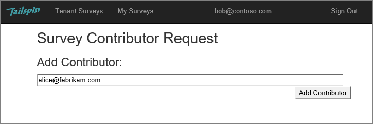
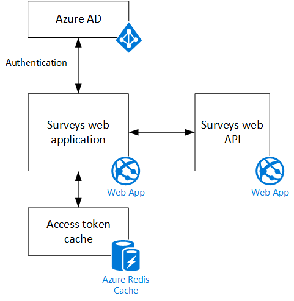

<properties
   pageTitle="關於 Tailspin 問卷應用程式 |Microsoft Azure"
   description="Tailspin 問卷應用程式概觀"
   services=""
   documentationCenter="na"
   authors="MikeWasson"
   manager="roshar"
   editor=""
   tags=""/>

<tags
   ms.service="guidance"
   ms.devlang="dotnet"
   ms.topic="article"
   ms.tgt_pltfrm="na"
   ms.workload="na"
   ms.date="05/23/2016"
   ms.author="mwasson"/>

# 關於 Tailspin 問卷應用程式

[AZURE.INCLUDE [pnp-header](../../includes/guidance-pnp-header-include.md)]

本文是[一系列的一部分]。 此外還有隨附這一系列完成[範例應用程式]。

Tailspin 是虛構公司，開發 SaaS 應用程式名稱為問卷調查。 這個應用程式可讓組織建立及發佈線上問卷調查。

- 組織可以應用程式的登入。
- 組織已註冊後，使用者可以登入至應用程式中使用其組織認證。
- 使用者可以建立、 編輯及發佈問卷調查。

> [AZURE.NOTE] 若要開始使用應用程式，請參閱[執行問卷應用程式]。

## 使用者可以建立、 編輯及檢視問卷

已驗證的使用者可以檢視所有調查他或她所建立，或具有 [參與者] 權限，並建立新的問卷調查。 請注意，使用者則以使用其組織的身分登入`bob@contoso.com`。

此螢幕擷取畫面顯示 [編輯問卷] 頁面︰

使用者也可以檢視相同的租用戶中的其他使用者所建立的任何問卷調查。

## 問卷擁有者可以邀請參與者

當使用者建立問卷時，他或她就可以邀請其他人會在問卷的參與者。 參與者可以編輯問卷，但無法刪除或將它發佈。  

使用者可以新增參與者其他租用戶，可讓跨租用戶共用的資源。 在此螢幕擷取畫面，百勝 (`bob@contoso.com`)，就新增 Alice (`alice@fabrikam.com`) 為百勝建立問卷的參與者。

當 Alice 登入時，她就會看到 「 我可以參與的問卷] 下所列的問卷。

請注意，Alice，則將自己的租用戶，不 Contoso 租用戶來賓身分登入。 Alice 具有 [參與者] 權限僅適用於該問卷&mdash;她無法檢視其他問卷的 Contoso 租用戶。

## 架構

問卷應用程式是由前端網頁和網路 API 後端所組成。 同時使用[ASP.NET 核心 1.0]實作。

Web 應用程式使用 Azure Active Directory (Azure AD) 來驗證使用者。 Web 應用程式也會撥打 OAuth 2 存取權杖取得 Web API Azure AD。 存取權杖 Azure Redis 快取中快取。 快取可讓多個執行個體，共用相同的權杖快取 （例如，在伺服器陣列）。

## 後續步驟

- 閱讀本系列下一個文章︰[使用 Azure Active Directory 和 OpenID 連線的 multitenant 應用程式中的驗證][authentication]

<!-- Links -->

[authentication]: guidance-multitenant-identity-authenticate.md
[一系列的一部分]: guidance-multitenant-identity.md
[執行問卷應用程式]: https://github.com/Azure-Samples/guidance-identity-management-for-multitenant-apps/blob/master/docs/running-the-app.md
[ASP.NET 核心 1.0]: https://docs.asp.net/en/latest/
[範例應用程式]: https://github.com/Azure-Samples/guidance-identity-management-for-multitenant-apps
