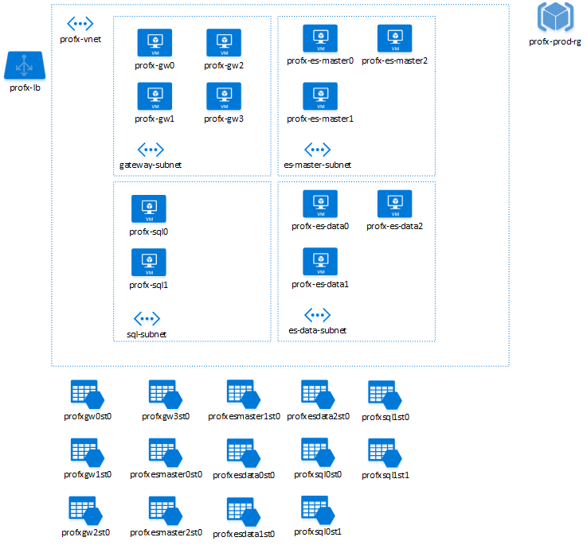

<properties
   pageTitle="建議 Azure 資源的命名慣例 |指引 |Microsoft Azure"
   description="建議 Azure 資源的命名慣例。 如何命名虛擬機器、 儲存帳戶、 網路、 虛擬網路、 子網路和其他 Azure 實體"
   services=""
   documentationCenter="na"
   authors="bennage"
   manager="marksou"
   editor=""
   tags=""/>

<tags
   ms.service="guidance"
   ms.devlang="na"
   ms.topic="article"
   ms.tgt_pltfrm="na"
   ms.workload="na"
   ms.date="08/27/2016"
   ms.author="christb"/>
   
# <a name="recommended-naming-conventions-for-azure-resources"></a>建議 Azure 資源的命名慣例

[AZURE.INCLUDE [pnp-header](../../includes/guidance-pnp-header-include.md)]

Microsoft Azure 中的任何資源名稱的選項是很重要因為︰

- 很難稍後變更名稱。
- 名稱必須符合的特定的資源類型的需求。

一致的命名慣例作為資源更容易地找到。 他們也可以指出資源在方案中的角色。

本文是命名規則和 Azure 資源的限制的摘要和建議的命名慣例比較基準。  您可以使用這些建議開始算起的特定自己慣例至您的需求。  

命名慣例成功的關鍵建立並追蹤其在您的應用程式和組織。 

## <a name="naming-subscriptions"></a>命名的訂閱

在命名 Azure 訂閱時，名稱的詳細資訊請了解內容和清除每個訂閱的目的。  在多個訂閱的環境工作時，追蹤共用的命名慣例可以改善清楚。

命名訂閱的建議的模式就是︰

`<Company> <Department (optional)> <Product Line (optional)> <Environment>`

- 公司通常會針對每個訂閱相同。 不過，有些公司可能有子公司內的組織結構。 這些公司可能受中央的 IT 群組。 在下列情況下，它們可能會區分由的上層公司名稱 (*Contoso*) 和子公司名稱 （*北美風*）。

- 部門是組織內的名稱，在這裡一群人使用。 此為選用命名空間中的項目。

- 產品線是特定的產品或從部門中執行的函數名稱。
這是通常選用的內部服務及應用程式。 不過，強烈建議需要輕鬆分隔和識別 （例如清楚的帳單記錄的區隔）-在公開服務使用。

- 環境是說明的應用程式或服務，例如開發、 問與答或 Prod 部署生命週期的名稱。

| 公司 | 部門 | 產品或服務 | 環境 | 全名  |
----------| ---------- | ----------------------- | ----------- | ---------- |
| Contoso | SocialGaming | AwesomeService | 生產 | Contoso SocialGaming AwesomeService 生產 |
| Contoso | SocialGaming | AwesomeService | 開發 | Contoso SocialGaming AwesomeService 開發 |
| Contoso | 它 | InternalApps | 生產 | Contoso IT InternalApps 生產 |
| Contoso | 它 | InternalApps | 開發 | Contoso IT InternalApps 開發 |

<!-- TODO; include more information about organizing subscriptions for application deployment, pods, etc. -->

## <a name="use-affixes-to-avoid-ambiguity"></a>若要避免混淆使用 Affixes

在命名 Azure 中的資源時，建議使用一般 [首碼] 或 [尾碼識別類型與資源的內容。  中繼資料類型的所有資訊時內容，以程式設計方式可供使用，套用通用 affixes 簡化視覺識別碼]。  當您可以將 affixes 加入您的命名慣例，請務必明確指定是否 label 名稱 （前置詞） 的開頭或結尾 （後稱謂）。  

例如，以下是裝載計算引擎服務的兩個可能的名稱︰

- SvcCalculationEngine （前置字元）
- CalculationEngineSvc （後稱謂）

Affixes 可以參照不同層面的描述特定的資源。 下表顯示一些常用的範例。

| 長寬 | 範例 | 備忘稿 |
| ------ | ------- | ----- |
| 環境 | 開發，產品，問與答 | 識別資源環境 |
| 位置 | uw （美國西） 舒慧 （適用於美國東部） | 識別您部署資源的區域 |
| 執行個體 | 01、 02 | 資源，有多個命名執行個體 （網頁伺服器等）。 |
| 產品或服務 | 服務 | 識別產品、 應用程式或資源支援服務 |
| 角色 | sql、 網頁，訊息 | 識別相關聯的資源的角色 |

開發特定的命名慣例，為您的公司或專案，時重要的是，選擇一組通用的 affixes 和其位置 （後稱謂或前置字元）。

## <a name="naming-rules-and-restrictions"></a>命名規則和限制

Azure 中的每個資源或服務類型會強制執行限制和範圍; 命名一的組必要的命名規則和範圍必須遵守任何命名慣例或圖樣。  例如時 VM 的名稱對應至 DNS 名稱，因此，才能在所有 Azure 都是唯一的, VNET 名稱限定為建立內的 [資源] 群組。

一般而言，避免任何特殊字元 (`-`或`_`) 為任何名稱的第一個或最後一個字元。 這些字元會造成大部分的驗證規則失敗。

| 類別 | 服務或實體 | 範圍 | 長度 | 大小寫 | 有效的字元 | 建議的圖樣 | 範例 |
| ------------- | ----------------- | ----- | ------ | ------ | ---------------- | ----------------- | ------- |
| 資源群組 | 資源群組 | 全域管理員 | 1-64 | 不區分大小寫 | 英數字、 底線和連字號 | `<service short name>-<environment>-rg` | `profx-prod-rg` |
| 資源群組 | 顯示狀態設定 | 資源群組 | 1-80 | 不區分大小寫 | 英數字、 底線和連字號 | `<service-short-name>-<context>-as` | `profx-sql-as` |
| 一般 | 標記 | 相關聯的實體 | 512 （名稱）、 256 （值） | 不區分大小寫 | 英數字元 | `"key" : "value"` | `"department" : "Central IT"` |
| 計算 | 虛擬機器 | 資源群組 | 1-15 | 不區分大小寫 | 英數字、 底線和連字號 | `<name>-<role>-<instance>` | `profx-sql-001` |
| 儲存空間 | 儲存體帳戶名稱 （資料） | 全域管理員 | 3-24 | 小寫 | 英數字元 | `<service short name><type><number>` | `profxdata001` |
| 儲存空間 | 儲存體帳戶名稱 （磁碟） | 全域管理員 | 3-24 | 小寫 | 英數字元 | `<vm name without dashes>st<number>` | `profxsql001st0` |
| 儲存空間 | 容器名稱 | 儲存帳戶 | 3-多為 63 |   小寫 | 英數字和破折號 | `<context>` | `logs` |
| 儲存空間 | Blob 名稱 | 容器 | 1 1024 | 區分大小寫 | 任何 URL 字元 | `<variable based on blob usage>` | `<variable based on blob usage>` |
| 儲存空間 | 佇列名稱 | 儲存帳戶 | 3-多為 63 | 小寫 | 英數字和破折號 | `<service short name>-<context>-<num>` | `awesomeservice-messages-001` |
| 儲存空間 | 資料表名稱 | 儲存帳戶 | 3-多為 63 |不區分大小寫 | 英數字元 | `<service short name>-<context>` | `awesomeservice-logs` |
| 儲存空間 | 檔案名稱 | 儲存帳戶 | 3-多為 63 | 小寫 | 英數字元 | `<variable based on blob usage>` | `<variable based on blob usage>` |
| 網路 | 虛擬網路 (VNet) | 資源群組 | 2-64 | 不區分大小寫 | 英數字、 虛線、 底線和期間 | `<service short name>-[section]-vnet` | `profx-vnet` |
| 網路 | 子網路 | 父 VNet | 2-80 | 不區分大小寫 | 英數字、 底線、 虛線及期間 | `<role>-subnet` | `gateway-subnet` |
| 網路 | 網路介面 | 資源群組 | 1-80 | 不區分大小寫 | 英數字、 虛線、 底線和期間 | `<vmname>-<num>nic` | `profx-sql1-1nic` |
| 網路 | 網路安全性群組 | 資源群組 | 1-80 | 不區分大小寫 | 英數字、 虛線、 底線和期間 | `<service short name>-<context>-nsg` | `profx-app-nsg` |
| 網路 | 網路安全性群組規則 | 資源群組 | 1-80 | 不區分大小寫 | 英數字、 虛線、 底線和期間 | `<descriptive context>` | `sql-allow` |
| 網路 | 公用 IP 位址 | 資源群組 | 1-80 | 不區分大小寫 | 英數字、 虛線、 底線和期間 | `<vm or service name>-pip` | `profx-sql1-pip` |
| 網路 | 負載平衡器 | 資源群組 | 1-80 | 不區分大小寫 | 英數字、 虛線、 底線和期間 | `<service or role>-lb` | `profx-lb` |
| 網路 | 負載平衡的規則設定 | 負載平衡器 | 1-80 | 不區分大小寫 | 英數字、 虛線、 底線和期間 | `descriptive context` | `http` |

<!-- TODO fill in the rest of these resources
| Networking | Azure Application Gateway | Resource Group | 1-80 | Case-insensitive | Alphanumeric, dash, underscore, and period | `<service or role>-aag` | `profx-aag`
| Networking | Azure Application Gateway Connection | Azure Application Gateway | 1-80 | Case-insensitive | Alphanumeric, dash, underscore, and period | `` | TODO
| Networking | Traffic Manager Profile | Resource Group | 1-80 | Case-insensitive | Alphanumeric, dash, underscore, and period | TODO | TODO
-->

## <a name="organizing-resources-with-tags"></a>組織資源的標籤

Azure 資源管理員支援任何文字字串，以找出內容並簡化自動化標記項的目。  例如，標籤`"sqlVersion: "sql2014ee"`部署針對其執行自動化指令碼執行 SQL Server 2014 企業版中識別 Vm。  標記應該用來強化及加強效果列的選擇的命名慣例側邊的內容。

> [AZURE.TIP]標記的其他優點之一是標記橫跨資源群組]，可讓您連結，並建立實體跨不同部署之間的關係。

每個資源或資源群組不能超過**15**的標記。 標籤名稱為 512 個字元，並標記值僅限於 256 個字元。

如需有關資源標記的詳細資訊，請參閱[使用標籤以組織 Azure 資源](../resource-group-using-tags.md)。

常見的標記使用情況如下︰

- **計費**;分組資源和關聯帳單或收費備份代碼。
- **識別服務**;共同作業和分組的識別資源群組間的資源的群組
- **存取控制及安全性內容**。根據產品組合、 系統、 服務、 應用程式、 執行個體等系統管理角色識別。

> [AZURE.TIP]最早-標記通常標籤。  更有標記的位置中配置的比較基準，隨時間，而不是以 retrofit 之後需要調整。  

一些常見的標記方法範例︰

| 標籤名稱 | 索引鍵 | 範例 | 註解 |
| -------- | --- | ------- | ------- |
| 帳單 / 內部 Chargeback 識別碼 | 收款  | `IT-Chargeback-1234` | 內部 I/O 或帳單的程式碼 |
| 運算子或直接負責個別 (DRI) | managedBy | `joe@contoso.com`  | Alias （別名） 或電子郵件地址 |
| 專案名稱 | 專案名稱 | `myproject`  | [專案] 或 [產品] 行的名稱 |
| 專案版本 | 專案版本 | `3.4`  | [專案] 或 [產品] 行的版本 |
| 環境 | 環境 | `<Production, Staging, QA >` | 環境識別碼 | 
| 層 | 層 | `Front End, Back End, Data` | 層或角色/內容識別碼 |
| 資料設定檔 | dataProfile | `Public, Confidential, Restricted, Internal` | 區分大小寫的資源中儲存的資料 |
 
## <a name="tips-and-tricks"></a>秘訣和竅門

某些類型的資源可能會要求其他小心命名和慣例。

### <a name="virtual-machines"></a>虛擬機器

尤其是較大的拓撲，請仔細命名虛擬機器會簡化回傳識別的角色和用途每一台電腦，並啟用更可預測指令碼。

> [AZURE.WARNING]Azure 中每個虛擬機器有 Azure 資源名稱和作業系統主機名稱。  
> 如果資源名稱] 和 [主機名稱不同，管理 Vm 可能挑戰，並應避免使用。
> 例如，如果已經建立從.vhd 虛擬機器包含設定的作業系統，使用 [主機名稱。

- [Windows Server Vm 的命名慣例](https://support.microsoft.com/en-us/kb/188997)

<!-- TODO - recommendations on naming VMs. -->

### <a name="storage-accounts-and-storage-entities"></a>儲存帳戶和儲存項目

有儲存帳戶-磁碟的 Vm，儲存資料二進位大型物件、 佇列和資料表中的兩個主要的使用案例。  儲存帳戶的 VM 磁碟應該追蹤的上層 VM 名稱與關聯的命名慣例 （和與高階 VM Sku 的多個儲存的帳戶可能需要，也可以套用數字的後置字元）。

> [AZURE.TIP]儲存帳戶-的資料或磁碟-應該追蹤多個儲存帳戶以運用 （也就是 [一律使用數字的尾碼） 可讓的命名慣例。

它可以設定存取 blob Azure 儲存體帳戶中的資料的自訂網域名稱。
Blob 服務的預設端點是`https://mystorage.blob.core.windows.net`。

但如果您將自訂網域 （如 www.contoso.com) 對應到 blob 端點儲存帳戶，您也可以存取 blob 儲存體帳戶中的資料使用該網域。 例如，使用自訂網域名稱，`http://mystorage.blob.core.windows.net/mycontainer/myblob`無法存取與`http://www.contoso.com/mycontainer/myblob`。

如需關於設定此功能的詳細資訊，請參閱[設定將自訂網域名稱用於您 Blob 儲存體結束點](../storage/storage-custom-domain-name.md)。

如需有關命名二進位大型物件、 容器及表格的詳細資訊︰

- [命名及參照容器、 Blob 和中繼資料](https://msdn.microsoft.com/library/dd135715.aspx)
- [命名佇列和中繼資料](https://msdn.microsoft.com/library/dd179349.aspx)
- [命名表格](https://msdn.microsoft.com/library/azure/dd179338.aspx)

Blob 名稱最多可以包含的字元，任何組合，但保留的 URL 字元必須正確逸出。 避免 blob 名稱結尾以英文句點 （.）、 斜線 （/）、 順序或兩者的組合。 根據慣例，斜線是**虛擬**目錄分隔符號。 不使用反斜線 (\) blob 的名稱。 用戶端 Api 可能允許，但無法正常運作，雜湊並不會符合簽章。

無法建立之後，請修改儲存帳戶或容器的名稱。
如果您想要使用的新名稱，您必須將其刪除，並建立一個新。

> [AZURE.TIP] 我們建議您之前進行未來突破性開發的新的服務或應用程式建立的所有儲存的帳戶和類型的命名慣例。

## <a name="example---deploying-an-n-tier-service"></a>例如部署 n 層服務

在此範例中，我們定義 n 層服務設定] （裝載於 6 Linux Vm） ElasticSearch 叢集所組成前端 IIS 伺服器 （裝載於 Windows Server Vm），並且採用 SQL Server （裝載在兩個 Windows Server Vm），及相關聯的儲存帳戶虛擬網路，資源群組及負載平衡器。

我們先定義此應用程式的關聯式慣例︰

| 實體 | 慣例 | 描述  |
| ------ | ---------- | ------------ |  
| 服務名稱 | `profx` | 簡短名稱的應用程式或部署的服務 |
| 環境 | `prod` | 這是實際執行部署 （而不是問與答，測試等等。） |

從該比較基準我們可以接著安排慣例針對每個資源類型︰

| 資源類型 | 慣例基底 | 範例 |
| ------------- | --------------- | ------- |
| 訂閱 | `<Company> <Department (optional)> <Product Line (optional)> <Environment>` | `Contoso IT InternalApps Profx Production` |
| 資源群組 | `servicename-rg` | `profx-rg` |
| 虛擬網路 | `servicename-vnet` | `profx-vnet` |
| 子網路 | `role-subnet` | `sql-vnet` |
| 負載平衡器 | `servicename-lb` | `profx-lb` |
| 虛擬機器 | `servicename-role[number]` | `profx-sql0` |
| 儲存帳戶 | `<vmnamenodashes>st<num>` | `profxsql0st0` |

圖表下列所示︰



## <a name="sample---azure-cli-script-for-deploying-the-sample-above"></a>範例-Azure CLI 指令碼部署上述範例

```bash
#!/bin/sh

#####################################################################
# Sample script using the Azure CLI to build out an application 
# demonstrating naming conventions.  
#
# Note; this script is not intended for production deployment, as it does 
# not create availability sets, configure network security rules, etc.
#####################################################################

# Set up variables to build out the naming conventions for deploying
# the cluster  
LOCATION=eastus2
APP_NAME=profx
ENVIRONMENT=prod
USERNAME=testuser
PASSWORD="testpass"

# Set up the tags to associate with items in the application
TAG_BILLTO="InternalApp-ProFX-12345"
TAGS="billTo=${TAG_BILLTO}"

# Explicitly set the subscription to avoid confusion as to which subscription
# is active/default
SUBSCRIPTION=3e9c25fc-55b3-4837-9bba-02b6eb204331

# Set up the names of things using recommended conventions
RESOURCE_GROUP="${APP_NAME}-${ENVIRONMENT}-rg"
VNET_NAME="${APP_NAME}-vnet"

# Set up the postfix variables attached to most CLI commands
POSTFIX="--resource-group ${RESOURCE_GROUP} --location ${LOCATION} --subscription ${SUBSCRIPTION}"

##########################################################################################
# Set up the VM conventions for Linux and Windows images

# For Windows, get the list of URN's via 
# azure vm image list ${LOCATION} MicrosoftWindowsServer WindowsServer 2012-R2-Datacenter
WINDOWS_BASE_IMAGE=MicrosoftWindowsServer:WindowsServer:2012-R2-Datacenter:4.0.20160126

# For Linux, get the list or URN's via 
# azure vm image list ${LOCATION} canonical ubuntuserver
LINUX_BASE_IMAGE=canonical:ubuntuserver:16.04.0-DAILY-LTS:16.04.201602130

#########################################################################################
## Define functions 
create_vm ()
{
    vm_name=$1
    vnet_name=$2
    subnet_name=$3
    os_type=$4
    vhd_path=$5
    vm_size=$6
    diagnostics_storage=$7

    # Create the network interface card for this VM
    azure network nic create --name "${vm_name}-0nic" --subnet-name ${subnet_name} --subnet-vnet-name ${vnet_name} \
        --tags="${TAGS}" ${POSTFIX}

    # Create the storage account for this vm's disks (premium locally redundant storage -> PLRS)
    # Note the ${var//-/} syntax to remove dashes from the vm name
    storage_account_name=${vm_name//-/}st01
    azure storage account create --type=PLRS --tags "${TAGS}" ${POSTFIX} "${storage_account_name}"

    # Map the name of the diagnostics storage account to a blob URI for boot diagnostics
    # This is (currently) required when deploying with a named premium storage account 
    diag_blob="https://${diagnostics_storage}.blob.core.windows.net/"

    # Create the VM
    azure vm create --name ${vm_name} --nic-name "${vm_name}-0nic" --os-type ${os_type} \
        --image-urn ${vhd_path} --vm-size ${vm_size} --vnet-name ${vnet_name} --vnet-subnet-name ${subnet_name} \
        --storage-account-name "${storage_account_name}" --storage-account-container-name vhds --os-disk-vhd "${vm_name}-osdisk.vhd" \
        --admin-username "${USERNAME}" --admin-password "${PASSWORD}" \
        --boot-diagnostics-storage-uri "${diag_blob}" \
        --tags="${TAGS}" ${POSTFIX} 
}

###################################################################################################
# Create resources

# Step 1 - create the enclosing resource group
azure group create --name "${RESOURCE_GROUP}" --location "${LOCATION}" --tags "${TAGS}" --subscription "${SUBSCRIPTION}"

# Step 2 - create the network security groups

# Step 3 - create the networks (VNet and subnets)
azure network vnet create --name "${VNET_NAME}" --address-prefixes="10.0.0.0/8" --tags "${TAGS}" ${POSTFIX}
# TODO - does subnet support tagging?
azure network vnet subnet create --name gateway-subnet --vnet-name "${VNET_NAME}" --address-prefix="10.0.1.0/24" --resource-group "${RESOURCE_GROUP}" --subscription ${SUBSCRIPTION}
azure network vnet subnet create --name es-master-subnet --vnet-name "${VNET_NAME}" --address-prefix="10.0.2.0/24" --resource-group "${RESOURCE_GROUP}" --subscription ${SUBSCRIPTION}
azure network vnet subnet create --name es-data-subnet --vnet-name "${VNET_NAME}" --address-prefix="10.0.3.0/24" --resource-group "${RESOURCE_GROUP}" --subscription ${SUBSCRIPTION}
azure network vnet subnet create --name sql-subnet --vnet-name "${VNET_NAME}" --address-prefix="10.0.4.0/24" --resource-group "${RESOURCE_GROUP}" --subscription ${SUBSCRIPTION}

# Step 4 - define the load balancer and network security rules
azure network lb create --name "${APP_NAME}-lb" ${POSTFIX}
# In a production deployment script, we'd create load balancer rules and 
# network security groups here

# Step 5 - create a diagnostics storage account
diagnostics_storage_account=${APP_NAME//-/}diag
azure storage account create --type=LRS --tags "${TAGS}" ${POSTFIX} "${diagnostics_storage_account}"

# Step 6.1 - Create the gateway VMs
for i in `seq 1 4`;
do
    create_vm "${APP_NAME}-gw${i}" "${APP_NAME}-vnet" "gateway-subnet" "Windows" "${WINDOWS_BASE_IMAGE}" "Standard_DS1" "${diagnostics_storage_account}" 
done    

# Step 6.2 - Create the ElasticSearch master and data VMs
for i in `seq 1 3`;
do
    create_vm "${APP_NAME}-es-master${i}" "${APP_NAME}-vnet" "es-master-subnet" "Linux" "${LINUX_BASE_IMAGE}" "Standard_DS1" "${diagnostics_storage_account}"
done
for i in `seq 1 3`;
do
    create_vm "${APP_NAME}-es-data${i}" "${APP_NAME}-vnet" "es-data-subnet" "Linux" "${LINUX_BASE_IMAGE}" "Standard_DS1" "${diagnostics_storage_account}"
done

# Step 6.3 - Create the SQL VMs
create_vm "${APP_NAME}-sql0" "${APP_NAME}-vnet" "sql-subnet" "Windows" "${WINDOWS_BASE_IMAGE}" "Standard_DS1" "${diagnostics_storage_account}"
create_vm "${APP_NAME}-sql1" "${APP_NAME}-vnet" "sql-subnet" "Windows" "${WINDOWS_BASE_IMAGE}" "Standard_DS1" "${diagnostics_storage_account}"
```
