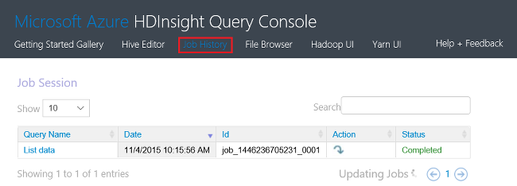

<properties
    pageTitle="管理 HDInsight 使用 Azure 入口網站中的 Hadoop 叢集 |Microsoft Azure"
    description="瞭解如何管理 HDInsight 服務。 建立 HDInsight 叢集、 開啟互動式 JavaScript 主控台，並開啟 Hadoop 命令主控台。"
    services="hdinsight"
    documentationCenter=""
    tags="azure-portal"
    authors="mumian"
    manager="jhubbard"
    editor="cgronlun"/>

<tags
    ms.service="hdinsight"
    ms.workload="big-data"
    ms.tgt_pltfrm="na"
    ms.devlang="na"
    ms.topic="article"
    ms.date="09/14/2016"
    ms.author="jgao"/>

# 使用 [Azure 入口網站管理 Hadoop 叢集 HDInsight 中

[AZURE.INCLUDE [selector](../../includes/hdinsight-portal-management-selector.md)]

使用[Azure 入口網站][azure-portal]，您可以建立 Azure HDInsight Hadoop 叢集、 變更 Hadoop 使用者的密碼，您就可以存取 Hadoop 命令主控台叢集上的啟用遠端桌面通訊協定 (RDP)。

本文中的資訊僅適用於視窗為基礎的 HDInsight 叢集。 管理 Linux 型叢集資訊，請按一下 [上述定位點選取器]。

按一下 [定位點選取器建立 Hadoop 叢集 HDInsight 使用其他工具中的資訊。 

**必要條件**

這份文件之前，您必須具備下列項目︰

- **Azure 訂閱**。 請參閱[取得 Azure 免費試用版](https://azure.microsoft.com/documentation/videos/get-azure-free-trial-for-testing-hadoop-in-hdinsight/)。
- **Azure 儲存體帳戶**HDInsight 叢集使用預設檔案系統的 Azure Blob 儲存體容器。 如需有關如何 Azure Blob 儲存體提供的 HDInsight 叢集順暢的使用體驗的詳細資訊，請參閱[使用與 HDInsight Azure Blob 儲存體](hdinsight-hadoop-use-blob-storage.md)。 建立 Azure 儲存體帳戶的詳細資訊，請參閱[如何建立儲存的帳戶](../storage/storage-create-storage-account.md)。

##開啟入口網站

1. 登入[https://portal.azure.com](https://portal.azure.com)。
2. 開啟入口網站後，您可以︰

    - 按一下 [建立新的叢集左側功能表中的 [**新增**]:
    
        ![新的 HDInsight 叢集] 按鈕](./media/hdinsight-administer-use-management-portal/azure-portal-new-button.png)
    - 按一下 [從左側功能表的 [ **HDInsight 叢集**]。
    
        ![Azure 入口網站的 HDInsight 叢集] 按鈕](./media/hdinsight-administer-use-management-portal/azure-portal-hdinsight-button.png)

    如果**HDInsight**沒有出現在左側功能表中，按一下 [**瀏覽**]。 

    ![Azure 入口網站瀏覽叢集] 按鈕](./media/hdinsight-administer-use-management-portal/azure-portal-browse-button.png)

##建立叢集

如需使用入口網站建立指示，請參閱[建立 HDInsight 叢集](hdinsight-provision-clusters.md#create-using-the-preview-portal)。

HDInsight 搭配寬 Hadoop 元件。 驗證與支援的元件清單中，請參閱[Azure HDInsight 是哪個版本的 Hadoop](hdinsight-component-versioning.md)。 您可以使用下列選項的其中一個自訂 HDInsight:

- 使用指令碼的巨集指令執行自訂指令碼，可以自訂變更叢集設定，或安裝自訂元素，例如 Giraph 或 Solr 叢集。 如需詳細資訊，請參閱[使用指令碼的巨集指令的自訂 HDInsight 叢集](hdinsight-hadoop-customize-cluster.md)。
- 在叢集建立期間使用 PowerShell 的 Azure HDInsight.NET SDK 中叢集自訂參數。 變更這些設定然後會保留叢集的生命，並不會受到叢集節點 reimages Azure 平台定期執行進行的維修作業。 如需有關使用叢集自訂參數的詳細資訊，請參閱[建立 HDInsight 叢集](hdinsight-provision-clusters.md)。
- 部分的原生 Java 元件，例如 Mahout 與重疊顯示，可以為 JAR 檔案叢集上執行。 這些 JAR 檔案可以發佈至 Azure Blob 儲存體，並提交給 HDInsight 叢集透過 Hadoop 工作送出機制。 如需詳細資訊，請參閱[提交 Hadoop 工作以程式設計方式](hdinsight-submit-hadoop-jobs-programmatically.md)。

    >[AZURE.NOTE] 如果您有問題部署 HDInsight 叢集 JAR 檔案或呼叫 JAR HDInsight 叢集上的檔案，請連絡[Microsoft 支援服務](https://azure.microsoft.com/support/options/)。

    > 階層式 HDInsight，不支援，而且不會有資格申請 Microsoft 支援服務。 支援的元件的清單，請參閱[HDInsight 所提供之叢集版本中的新功能？](hdinsight-component-versioning.md)。

不支援在使用遠端桌面連線叢集自訂軟體的安裝。 如果您要重新建立叢集會是遺失，您應避免儲存主節點的磁碟機上的任何檔案。 我們建議您儲存在 Azure Blob 儲存體上的檔案。 Blob 儲存體是持續。

##清單，然後顯示叢集

1. 登入[https://portal.azure.com](https://portal.azure.com)。
2. 按一下 [從左側功能表的 [ **HDInsight 叢集**]。
3. 按一下 [叢集名稱]。 如果叢集清單很長，您可以使用頁面上方的篩選器。
4. 按兩下 [叢集從清單中，以顯示詳細資料]。

    **功能表和 [基本功能**︰

    
    
    - 若要自訂功能表，以滑鼠右鍵按一下] 功能表上的任何位置，再按一下 [**自訂]**。
    - **設定**及**所有的設定**︰ 顯示**設定**刀叢集，可讓您存取叢集詳細的設定資訊。
    - **儀表板**、**叢集儀表板**與**URL︰ 這些是存取叢集儀表板，也就是 Ambari Web Linux 型叢集的所有方式。-**安全命令介面 * *: 顯示指示連線至叢集使用安全命令介面 (SSH) 連線。
    - **縮放比例叢集**︰ 可讓您變更此叢集工作者節點數目。
    - **刪除**︰ 刪除叢集。
    - **快速入門 ()**︰ 顯示的資訊可協助您開始使用 HDInsight。
    - **使用者 ()**︰ 可讓您設定為其他使用者的_入口網站_管理的權限，此叢集 Azure 訂閱。
    
        > [AZURE.IMPORTANT] 這_只_會影響 access 和 Azure 入口網站中，在此叢集的權限，不會影響可以連線至或提交到 HDInsight 叢集工作的人員。
    - **標籤 (![事項] 標記圖示](./media/hdinsight-administer-use-portal-linux/tags.png))**︰ 標籤可讓您設定以定義您的雲端服務自訂分類的金鑰/值組。 比方說，您可能會建立名為 [__專案__]，，，然後使用特定專案相關聯的所有服務的 [常見的值。
    - **Ambari 檢視**︰ Ambari 網頁的連結。
    
    > [AZURE.IMPORTANT] 若要管理 HDInsight 叢集所提供的服務，您必須使用 Ambari 網頁或 Ambari REST API。 如需有關如何使用 Ambari 的詳細資訊，請參閱[管理 HDInsight 叢集使用 Ambari](hdinsight-hadoop-manage-ambari.md)。

    **使用方式**︰
    
    
    
5. 按一下 [**設定**]。

    

    - **屬性**︰ 檢視叢集內容。
    - **叢集 AAD 身分識別**︰ 
    - **Azure 儲存金鑰**︰ 檢視預設儲存帳戶與索引鍵。 儲存帳戶是叢集建立程序期間的設定。
    - **叢集登入**︰ 變更叢集 HTTP 使用者名稱和密碼。
    - **外部 Metastores**︰ 檢視登錄區及 Oozie metastores。 Metastores 只可以叢集建立程序期間進行設定。
    - **縮放比例叢集**︰ 增加和減少叢集工作者節點數目。
    - **遠端桌面**︰ 啟用及停用遠端桌面 (RDP) 存取權，並設定 RDP 使用者名稱。  RDP 使用者名稱必須與 HTTP 使用者名稱。
    - **記錄可查夥伴**︰
    
    > [AZURE.NOTE] 這是一般清單可用的設定。而非所有會出現所有叢集類型。

6. 按一下 [**內容**︰

    [屬性] 清單上下列動作︰
    
    - **主機名稱**︰ 叢集名稱。
    - **叢集 URL**。
    - **狀態**︰ 包含中止，接受，ClusterStorageProvisioned AzureVMConfiguration、 HDInsightConfiguration，操作執行，錯誤，刪除刪除，逾時 DeleteQueued、 DeleteTimedout、 DeleteError、 PatchQueued、 CertRolloverQueued、 ResizeQueued、 ClusterCustomization
    - **地區**︰ Azure 的位置。 如需支援 Azure 位置的清單，請參閱**地區**下拉式清單方塊上[HDInsight 價格](https://azure.microsoft.com/pricing/details/hdinsight/)。
    - **建立資料**。
    - **作業系統**: [ **Windows**或**Linux**。
    - **類型**︰ Hadoop、 HBase 大量，激起。 
    - **版本**。 請參閱[HDInsight 版本](hdinsight-component-versioning.md)
    - **訂閱**︰ 訂閱名稱。
    - **訂閱識別碼**。
    - **主要資料來源**。 Azure Blob 儲存體帳戶做為預設 Hadoop 檔案系統。
    - **價格層的工作者節點**。
    - **不對節點價格層**。

##刪除叢集

刪除叢集不會刪除預設儲存帳戶或任何連結的儲存空間的帳戶。 您可以使用相同的儲存空間帳戶和相同 metastores 重新建立叢集。

1. 登入[入口網站][azure-portal]。
2. 從左側功能表中按一下 [**全部瀏覽**]、 按一下**HDInsight 叢集**，按一下您叢集的名稱。
3. 從上方的功能表中，按一下 [**刪除**，然後依照指示執行。

另請參閱[暫停/關機叢集](#pauseshut-down-clusters)。

##縮放比例叢集
叢集縮放功能可讓您變更正在執行中 Azure HDInsight，而不需要重新建立叢集叢集使用工作者節點數目。

>[AZURE.NOTE] 只使用 HDInsight 版本 3.1.3 叢集或更高支援。 如果您不確定您的叢集版本的您可以核取 [屬性] 頁面。  請參閱[清單] 和 [顯示叢集](#list-and-show-clusters)。

變更每種類型的支援 HDInsight 叢集資料節點數目的影響︰

- Hadoop

    您可以順暢完美地增加背景工作中的節點數目 Hadoop 叢集執行而不會影響任何擱置] 或 [執行的工作。 在進行作業時也能提交新的工作。 縮放比例作業失敗適當地處理以便叢集永遠左功能的狀態。

    當 Hadoop 叢集縮小來減少資料節點數目時，部分叢集服務會重新啟動。 這會使所有執行，並且擱置的工作，在 [縮放比例] 作業完成失敗。 您可以不過，重新送出工作一旦完成作業。

- HBase

    流暢地，您可以新增或移除節點] 在執行中時，HBase 叢集。 完成 [縮放比例] 作業的幾分鐘內自動對稱地區的伺服器。 不過，您可以登入的叢集 headnode，並從 [命令提示字元視窗中執行下列命令以手動平衡地區伺服器︰

        >pushd %HBASE_HOME%\bin
        >hbase shell
        >balancer

    如需有關如何使用 HBase 命令介面的詳細資訊，請參閱]
- 大量

    流暢地，您可以新增或移除資料節點] 在執行中時，大量叢集。 但縮放作業成功完成之後，您將需要重新平衡拓撲。

    平衡可完成兩種方法︰

    * 大量網頁 UI
    * 命令列介面 (CLI) 工具

    請參閱[Apache 大量文件](http://storm.apache.org/documentation/Understanding-the-parallelism-of-a-Storm-topology.html)更多。

    大量網頁 UI HDInsight 叢集上有︰

    

    以下是如何使用 [CLI 命令來重新平衡大量拓撲範例︰

        ## Reconfigure the topology "mytopology" to use 5 worker processes,
        ## the spout "blue-spout" to use 3 executors, and
        ## the bolt "yellow-bolt" to use 10 executors

        $ storm rebalance mytopology -n 5 -e blue-spout=3 -e yellow-bolt=10

**若要縮放叢集**

1. 登入[入口網站][azure-portal]。
2. 從左側功能表中按一下 [**全部瀏覽**]、 按一下**HDInsight 叢集**，按一下您叢集的名稱。
3. 按一下 [**設定**]，請從 [上方] 功能表，然後按一下 [**縮放比例叢集**。
4. 輸入**數字的工作者節點**。 叢集節點數目的限制而異 Azure 訂閱。 您也可以連絡帳單支援，以增加限制。  成本資訊會反映您所做的節點數目的變更。

    

##暫停/關機叢集

大部分的 Hadoop 工作是批次工作只能執行有時候的時間。 針對大部分 Hadoop 叢集，有長的叢集不用於處理的時間。 HDInsight，與您的資料會儲存於 Azure 儲存體，以便在不使用安全地刪除叢集。
您也會針對 HDInsight 叢集，即使沒有使用。 由於叢集費用多次多儲存空間的費用，讓經濟叢集時無法使用。

有多種方式，您可以設計程序︰

- 使用者 Azure 資料工廠。 如需視和自我已定義之連結的 HDInsight 服務，請參閱[Azure HDInsight 連結服務](../data-factory/data-factory-compute-linked-services.md)及[轉換及分析使用 Azure 資料工廠](../data-factory/data-factory-data-transformation-activities.md)。
- 使用 PowerShell 的 Azure。  請參閱[分析航班延遲情況資料](hdinsight-analyze-flight-delay-data.md)。
- 使用 Azure CLI。 請參閱[使用 Azure CLI 管理 HDInsight 叢集](hdinsight-administer-use-command-line.md)。
- 使用 HDInsight.NET SDK。 請參閱[提交 Hadoop 工作](hdinsight-submit-hadoop-jobs-programmatically.md)。

價格的資訊，請參閱[HDInsight 價格](https://azure.microsoft.com/pricing/details/hdinsight/)。 若要刪除叢集從入口網站，請參閱[刪除叢集](#delete-clusters)

##變更叢集使用者名稱

HDInsight 叢集可以有兩個使用者帳戶。 建立程序期間，會建立 HDInsight 叢集使用者帳戶。 您也可以建立 RDP 使用者帳戶以存取透過 RDP 叢集。 請參閱[啟用遠端桌面](#connect-to-hdinsight-clusters-by-using-rdp)。

**若要變更的 HDInsight 叢集使用者名稱和密碼**

1. 登入[入口網站][azure-portal]。
2. 從左側功能表中按一下 [**全部瀏覽**]、 按一下**HDInsight 叢集**，按一下您叢集的名稱。
3. 按一下 [**設定**]，請從 [上方] 功能表，然後按一下 [**叢集登入**。
4. 如果已啟用**叢集登入**，您必須按一下 [**停用**，然後按一下 [**啟用**]，才能變更使用者名稱和密碼。
4. 變更**叢集登入名稱**及/或**叢集登入密碼**]，然後再按一下 [**儲存**。

    

##授與/撤銷存取

HDInsight 叢集有下列 HTTP web 服務 （所有這些服務需要 RESTful 的端點）︰

- ODBC
- JDBC
- Ambari
- Oozie
- Templeton

根據預設，這些服務會授與存取。 您可以撤銷/授與存取從 Azure 入口網站。

>[AZURE.NOTE] 授與/撤銷存取，您會重設叢集使用者名稱和密碼。

**若要授與撤銷 HTTP web 服務存取**

1. 登入[入口網站][azure-portal]。
2. 從左側功能表中按一下 [**全部瀏覽**]、 按一下**HDInsight 叢集**，按一下您叢集的名稱。
3. 按一下 [**設定**]，請從 [上方] 功能表，然後按一下 [**叢集登入**。
4. 如果已啟用**叢集登入**，您必須按一下 [**停用**，然後按一下 [**啟用**]，才能變更使用者名稱和密碼。
6. **叢集登入的使用者名稱**和**叢集登入密碼**，輸入新的使用者名稱和密碼 （分別） 叢集。
7. 按一下 [**儲存**]。

    

##尋找預設儲存帳戶

每個 HDInsight 叢集具有預設儲存帳戶。 預設儲存帳戶和叢集其鍵會出現在 [**設定**/**屬性**/**Azure 儲存金鑰**。 請參閱[清單] 和 [顯示叢集](#list-and-show-clusters)。

    
##尋找 [資源] 群組 

Azure 資源管理員模式中，在每個 HDInsight 叢集建立與 Azure 資源群組。 Azure 資源所屬群組之叢集會顯示於︰

- [叢集] 清單中會有一個**資源群組**資料行。
- 叢集**不可或缺**的磚。  

請參閱[清單] 和 [顯示叢集](#list-and-show-clusters)。
   
##開啟 HDInsight 查詢主控台

HDInsight 查詢主控台包含下列功能︰

- **快速入門] 庫**︰ 若要使用庫，請參閱[瞭解 Hadoop，使用 [Azure HDInsight 快速入門] 庫](hdinsight-learn-hadoop-use-sample-gallery.md)。
- **登錄區編輯器**︰ GUI 網頁介面送出登錄區工作。  請參閱[使用 [查詢主控台執行登錄區查詢](hdinsight-hadoop-use-hive-query-console.md)。

    

- **工作歷程記錄**︰ 監視器 Hadoop 工作。  

    

    按一下**查詢名稱**以顯示詳細資料，包括工作內容]，[**工作查詢**，和 * * 工作成果。 您也可以下載查詢，並輸出至工作站。

- **檔案瀏覽器**︰ 瀏覽預設儲存帳戶並連結的儲存空間帳戶。

    ![瀏覽] 入口網站的檔案瀏覽器 HDInsight](./media/hdinsight-administer-use-management-portal/hdinsight-file-browser.png)

    在螢幕擷取畫面，**<Account>**類型指出的項目是 Azure 儲存體帳戶。  按一下帳戶名稱，瀏覽檔案。
    
- **Hadoop ui**。

    
    
    從 **Hadoop 使用者介面*，您可以瀏覽檔案，並檢查記錄檔。 

- **Yarn ui**。

    

##執行登錄區查詢

若要從入口網站執行的工作區，按一下 [HDInsight 查詢主控台中的 [**登錄區編輯器**]。 請參閱[開啟 HDInsight 查詢主控台](#open-hdinsight-query-console)。

##監視工作

若要監控工作從入口網站，按一下 [HDInsight 查詢主控台中的 [**工作歷程記錄**]。 請參閱[開啟 HDInsight 查詢主控台](#open-hdinsight-query-console)。

##瀏覽檔案

若要瀏覽儲存在預設儲存帳戶 」 和 「 連結的儲存帳戶檔案，請按一下 [**檔案瀏覽器**HDInsight 查詢主控台中檢視。 請參閱[開啟 HDInsight 查詢主控台](#open-hdinsight-query-console)。

您也可以使用從**Hadoop 使用者介面**的**瀏覽檔案系統**公用程式 HDInsight 主控台中檢視。  請參閱[開啟 HDInsight 查詢主控台](#open-hdinsight-query-console)。

##監視叢集使用情況

HDInsight 叢集刀 [__使用情況__] 區段會顯示可用核心數目的相關資訊至您的訂閱，用於 HDInsight，以及核心配置給此叢集及如何將它們配置此叢集內節點數目。 請參閱[清單] 和 [顯示叢集](#list-and-show-clusters)。

> [AZURE.IMPORTANT] 若要監視 HDInsight 叢集所提供的服務，您必須使用 Ambari 網頁或 Ambari REST API。 如需有關如何使用 Ambari 的詳細資訊，請參閱[管理 HDInsight 叢集使用 Ambari](hdinsight-hadoop-manage-ambari.md)

##開啟 Hadoop UI

若要監視叢集、 瀏覽檔案系統，並檢查記錄，按一下 [ **Hadoop UI** HDInsight 查詢主控台中檢視。 請參閱[開啟 HDInsight 查詢主控台](#open-hdinsight-query-console)。

##開啟 Yarn UI

若要使用 Yarn 使用者介面，請按一下**Yarn UI** HDInsight 查詢主控台中檢視。 請參閱[開啟 HDInsight 查詢主控台](#open-hdinsight-query-console)。

##連線至叢集使用 RDP

為您提供在建立叢集認證可讓叢集本身透過遠端桌面服務叢集，但無法存取。 當您佈建叢集或延後叢集也會佈建後，您可以開啟遠端桌面存取權。 如需在建立啟用遠端桌面的相關指示，請參閱[建立 HDInsight 叢集](hdinsight-provision-clusters.md)。

**若要啟用遠端桌面**

1. 登入[入口網站][azure-portal]。
2. 從左側功能表中按一下 [**全部瀏覽**]、 按一下**HDInsight 叢集**，按一下您叢集的名稱。
3. 按一下 [**設定**]，請從 [上方] 功能表，然後按一下 [**遠端桌面**。
4. 輸入**過期於****遠端桌面使用者名稱**與**遠端桌面密碼**，然後再按一下 [**啟用**]。

    

    在 [到期的預設值是一週。
> [AZURE.NOTE] 您也可以使用 HDInsight.NET SDK 叢集上啟用遠端桌面。 以下列方式使用 HDInsight 用戶端物件**EnableRdp**方法︰**用戶端。EnableRdp (clustername，位置、 「 rdpuser 」、 「 rdppassword 」，DateTime.Now.AddDays(6))**。 同樣地，如果您停用遠端桌面叢集上，您可以使用**用戶端。DisableRdp （clustername、 位置）**。 如需有關這些方法的詳細資訊，請參閱[HDInsight.NET SDK 參考](http://go.microsoft.com/fwlink/?LinkId=529017)。 這是僅適用於 Windows 上執行的 HDInsight 叢集。

**若要使用 RDP 連線到叢集**

1. 登入[入口網站][azure-portal]。
2. 從左側功能表中按一下 [**全部瀏覽**]、 按一下**HDInsight 叢集**，按一下您叢集的名稱。
3. 按一下 [**設定**]，請從 [上方] 功能表，然後按一下 [**遠端桌面**。
4. 按一下 [**連線**]，然後依照指示進行。 如果連線是停用，您必須先啟用。 請確定使用遠端桌面使用者名稱和密碼。  您無法使用叢集使用者認證。

##開啟 Hadoop 命令列

若要使用遠端桌面連線到叢集，並使用 Hadoop 命令列，您必須先啟用遠端桌面存取叢集前一節所述。

**若要開啟 Hadoop 命令列**

1. 連線到叢集使用遠端桌面。
8. 從桌面，按兩下 [ **Hadoop 命令列**]。

    ![HDI。HadoopCommandLine][image-hadoopcommandline]

    如需有關 Hadoop 命令的詳細資訊，請參閱[Hadoop 命令參考](http://hadoop.apache.org/docs/current/hadoop-project-dist/hadoop-common/CommandsManual.html)。

在先前的螢幕擷取畫面，該資料夾名稱會有內嵌 Hadoop 版本號碼。 版本號碼變更，可根據 Hadoop 元件叢集上所安裝的版本。 若要參照的資料夾，您可以使用 Hadoop 環境變數。 例如︰

    cd %hadoop_home%
    cd %hive_home%
    cd %hbase_home%
    cd %pig_home%
    cd %sqoop_home%
    cd %hcatalog_home%
    
##後續步驟
本文中，您已經學會如何使用來建立 HDInsight 叢集入口網站，以及如何開啟 Hadoop 命令列工具。 若要深入瞭解，請參閱下列文章︰

* [管理使用 PowerShell 的 Azure HDInsight](hdinsight-administer-use-powershell.md)
* [管理使用 CLI Azure HDInsight](hdinsight-administer-use-command-line.md)
* [建立 HDInsight 叢集](hdinsight-provision-clusters.md)
* [以程式設計方式提交 Hadoop 工作](hdinsight-submit-hadoop-jobs-programmatically.md)
* [開始使用 Azure HDInsight](hdinsight-hadoop-linux-tutorial-get-started.md)
* [哪個版本的 Hadoop 位於 Azure HDInsight？](hdinsight-component-versioning.md)

[azure-portal]: https://portal.azure.com
[image-hadoopcommandline]: ./media/hdinsight-administer-use-management-portal/hdinsight-hadoop-command-line.png "Hadoop 命令列"
